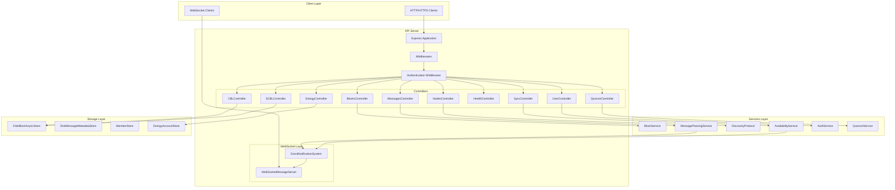
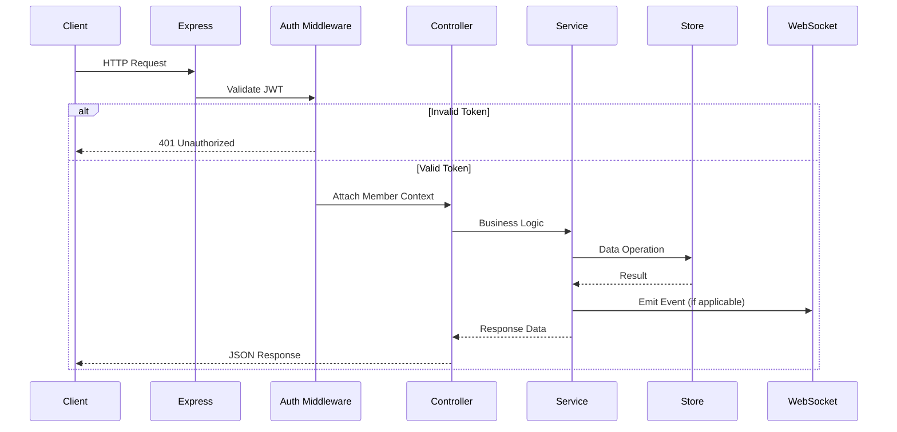

# Design Document: API Server Operations

## Overview

This design document describes the architecture and implementation approach for completing the BrightChain API Server Operations feature. The API server is built on Express.js with HTTPS support and follows a controller-based architecture pattern established in the existing codebase.

The implementation extends the existing API infrastructure by:
1. Integrating the message passing router into the main API
2. Adding Super CBL endpoints for large file handling
3. Exposing node discovery and block replication capabilities
4. Integrating WebSocket for real-time events
5. Adding health check and status endpoints
6. Completing stubbed endpoints
7. Ensuring consistent authentication and error handling

## Architecture

### High-Level Architecture



### Request Flow



## Components and Interfaces

### 1. MessagesController

Integrates the existing `messageRouter` functionality into a proper controller following the established pattern.

```typescript
interface IMessagesController {
  // POST /api/messages - Send a message
  sendMessage(req: Request): Promise<IStatusCodeResponse<ISendMessageResponse>>;
  
  // GET /api/messages/:id - Get message by ID
  getMessage(req: Request): Promise<IStatusCodeResponse<IGetMessageResponse>>;
  
  // GET /api/messages - Query messages
  queryMessages(req: Request): Promise<IStatusCodeResponse<IQueryMessagesResponse>>;
  
  // DELETE /api/messages/:id - Delete message
  deleteMessage(req: Request): Promise<IStatusCodeResponse<IDeleteMessageResponse>>;
}

interface ISendMessageRequest {
  content: string;        // Base64 encoded content
  senderId: string;       // Sender member ID
  recipients?: string[];  // Optional recipient IDs (broadcast if empty)
  messageType: string;    // Message type identifier
  priority?: MessagePriority;
  encryptionScheme?: number;
}

interface ISendMessageResponse {
  messageId: string;
  magnetUrl: string;
}
```

### 2. SCBLController

Handles Super CBL operations for large files that exceed single CBL capacity.

```typescript
interface ISCBLController {
  // POST /api/scbl/store - Store large file as Super CBL
  storeSCBL(req: Request): Promise<IStatusCodeResponse<IStoreSCBLResponse>>;
  
  // GET /api/scbl/retrieve - Retrieve file from Super CBL
  retrieveSCBL(req: Request): Promise<IStatusCodeResponse<IRetrieveSCBLResponse>>;
}

interface IStoreSCBLRequest {
  data: string;                    // Base64 encoded file data
  durabilityLevel?: DurabilityLevel;
  isEncrypted?: boolean;
}

interface IStoreSCBLResponse {
  success: boolean;
  magnetUrl: string;
  metadata: {
    hierarchyDepth: number;
    subCblCount: number;
    totalSize: number;
    rootBlockIds: string[];
  };
}

interface IRetrieveSCBLResponse {
  success: boolean;
  data: string;                    // Base64 encoded file data
  isEncrypted: boolean;
}
```

### 3. NodesController

Exposes node discovery and network management capabilities.

```typescript
interface INodesController {
  // GET /api/nodes - List connected nodes
  listNodes(req: Request): Promise<IStatusCodeResponse<IListNodesResponse>>;
  
  // GET /api/nodes/:nodeId - Get node details
  getNode(req: Request): Promise<IStatusCodeResponse<IGetNodeResponse>>;
  
  // POST /api/nodes/discover - Discover nodes with block
  discoverBlock(req: Request): Promise<IStatusCodeResponse<IDiscoverBlockResponse>>;
  
  // POST /api/nodes/register - Register node for WebSocket auth
  registerNode(req: Request): Promise<IStatusCodeResponse<IRegisterNodeResponse>>;
}

interface INodeInfo {
  nodeId: string;
  publicKey?: string;
  status: 'online' | 'offline' | 'unreachable';
  capabilities: string[];
  lastSeen: string;
  latencyMs?: number;
}

interface IDiscoverBlockResponse {
  blockId: string;
  found: boolean;
  locations: ILocationRecord[];
  queriedPeers: number;
  duration: number;
}
```

### 4. SyncController

Handles block replication and synchronization operations.

```typescript
interface ISyncController {
  // POST /api/blocks/:blockId/replicate - Replicate block to nodes
  replicateBlock(req: Request): Promise<IStatusCodeResponse<IReplicateBlockResponse>>;
  
  // GET /api/blocks/:blockId/locations - Get block locations
  getBlockLocations(req: Request): Promise<IStatusCodeResponse<IBlockLocationsResponse>>;
  
  // POST /api/sync/request - Check block availability
  syncRequest(req: Request): Promise<IStatusCodeResponse<ISyncRequestResponse>>;
  
  // POST /api/sync/reconcile - Initiate reconciliation
  reconcile(req: Request): Promise<IStatusCodeResponse<IReconcileResponse>>;
}

interface IReplicateBlockRequest {
  targetNodeIds: string[];
  durabilityLevel?: DurabilityLevel;
}

interface IReplicateBlockResponse {
  blockId: string;
  replicationResults: {
    nodeId: string;
    success: boolean;
    error?: string;
  }[];
}

interface ISyncRequestResponse {
  available: string[];      // Block IDs available locally
  missing: string[];        // Block IDs that need fetching
  unknown: string[];        // Block IDs with unknown status
}
```

### 5. HealthController

Provides health check and status endpoints.

```typescript
interface IHealthController {
  // GET /api/health - Basic health check
  getHealth(req: Request): Promise<IStatusCodeResponse<IHealthResponse>>;
  
  // GET /api/health/detailed - Detailed health with dependencies
  getDetailedHealth(req: Request): Promise<IStatusCodeResponse<IDetailedHealthResponse>>;
}

interface IHealthResponse {
  status: 'healthy' | 'degraded' | 'unhealthy' | 'starting';
  uptime: number;
  timestamp: string;
  version: string;
}

interface IDetailedHealthResponse extends IHealthResponse {
  dependencies: {
    blockStore: IDependencyStatus;
    messageService: IDependencyStatus;
    webSocketServer: IDependencyStatus;
    discoveryProtocol: IDependencyStatus;
    database: IDependencyStatus;
  };
}

interface IDependencyStatus {
  name: string;
  status: 'healthy' | 'degraded' | 'unhealthy';
  latencyMs?: number;
  message?: string;
}
```

### 6. WebSocket Event Integration

Extends the existing WebSocket infrastructure to support API-triggered events.

```typescript
interface IWebSocketEventPayload {
  type: string;
  timestamp: string;
  data: unknown;
}

// Message events
interface IMessageStoredEvent extends IWebSocketEventPayload {
  type: 'message:stored';
  data: {
    messageId: string;
    senderId: string;
    recipients: string[];
  };
}

// Block availability events
interface IBlockAvailabilityEvent extends IWebSocketEventPayload {
  type: 'block:availability_changed';
  data: {
    blockId: string;
    oldState: AvailabilityState;
    newState: AvailabilityState;
  };
}

// Partition events
interface IPartitionEvent extends IWebSocketEventPayload {
  type: 'partition:entered' | 'partition:exited';
  data: {
    disconnectedPeers?: string[];
    reconnectedPeers?: string[];
  };
}

// Replication events
interface IReplicationEvent extends IWebSocketEventPayload {
  type: 'block:replicated';
  data: {
    blockId: string;
    targetNodeId: string;
    success: boolean;
  };
}
```

### 7. API Router Integration

Updated API router structure integrating all controllers.

```typescript
class ApiRouter<TID extends PlatformID> extends BaseRouter<TID> {
  constructor(application: IBrightChainApplication<TID>) {
    super(application);
    
    // Existing controllers
    this.router.use('/user', this.userController.router);
    this.router.use('/blocks', this.blocksController.router);
    this.router.use('/i18n', this.i18nController.router);
    this.router.use('/energy', this.energyController.router);
    this.router.use('/quorum', this.quorumController.router);
    this.router.use('/cbl', this.cblController.router);
    
    // New controllers
    this.router.use('/messages', this.messagesController.router);
    this.router.use('/scbl', this.scblController.router);
    this.router.use('/nodes', this.nodesController.router);
    this.router.use('/sync', this.syncController.router);
    this.router.use('/health', this.healthController.router);
    this.router.use('/docs', this.docsController.router);
  }
}
```

## Data Models

### Message Metadata

```typescript
interface IMessageMetadata {
  messageId: string;
  senderId: string;
  recipients: string[];
  messageType: string;
  priority: MessagePriority;
  deliveryStatus: Map<string, MessageDeliveryStatus>;
  acknowledgments: Map<string, Date>;
  encryptionScheme: MessageEncryptionScheme;
  isCBL: boolean;
  cblBlockIds?: string[];
  createdAt: Date;
}

enum MessageDeliveryStatus {
  PENDING = 'pending',
  IN_TRANSIT = 'in_transit',
  DELIVERED = 'delivered',
  FAILED = 'failed',
  EXPIRED = 'expired'
}

enum MessagePriority {
  LOW = 0,
  NORMAL = 1,
  HIGH = 2,
  URGENT = 3
}
```

### Super CBL Structure

```typescript
interface ISuperCBLMetadata {
  rootMagnetUrl: string;
  hierarchyDepth: number;
  subCblCount: number;
  totalSize: number;
  blockSize: BlockSize;
  isEncrypted: boolean;
  createdAt: Date;
  durabilityLevel: DurabilityLevel;
}

interface ISuperCBLHeader {
  magicBytes: [0xBC, 0x03];  // Super CBL identifier
  version: number;
  subCblCount: number;
  depth: number;
  subCblAddresses: string[];
}
```

### Node Information

```typescript
interface INodeRecord {
  nodeId: string;
  publicKey: Buffer;
  status: NodeStatus;
  capabilities: NodeCapability[];
  location: {
    region?: string;
    zone?: string;
  };
  lastSeen: Date;
  latencyMs?: number;
  blockCount?: number;
}

enum NodeStatus {
  ONLINE = 'online',
  OFFLINE = 'offline',
  UNREACHABLE = 'unreachable',
  SYNCING = 'syncing'
}

enum NodeCapability {
  BLOCK_STORAGE = 'block_storage',
  MESSAGE_ROUTING = 'message_routing',
  CBL_WHITENING = 'cbl_whitening',
  QUORUM_MEMBER = 'quorum_member'
}
```

### API Error Response

```typescript
interface IApiErrorResponse {
  error: {
    code: string;
    message: string;
    details?: Record<string, unknown>;
    requestId: string;
    timestamp: string;
  };
}

enum ErrorCode {
  // Validation errors (400)
  VALIDATION_ERROR = 'VALIDATION_ERROR',
  INVALID_REQUEST = 'INVALID_REQUEST',
  MISSING_FIELD = 'MISSING_FIELD',
  
  // Authentication errors (401)
  UNAUTHORIZED = 'UNAUTHORIZED',
  TOKEN_EXPIRED = 'TOKEN_EXPIRED',
  INVALID_TOKEN = 'INVALID_TOKEN',
  
  // Authorization errors (403)
  FORBIDDEN = 'FORBIDDEN',
  INSUFFICIENT_PERMISSIONS = 'INSUFFICIENT_PERMISSIONS',
  
  // Not found errors (404)
  NOT_FOUND = 'NOT_FOUND',
  BLOCK_NOT_FOUND = 'BLOCK_NOT_FOUND',
  MESSAGE_NOT_FOUND = 'MESSAGE_NOT_FOUND',
  NODE_NOT_FOUND = 'NODE_NOT_FOUND',
  
  // Conflict errors (409)
  ALREADY_EXISTS = 'ALREADY_EXISTS',
  
  // Server errors (500)
  INTERNAL_ERROR = 'INTERNAL_ERROR',
  SERVICE_UNAVAILABLE = 'SERVICE_UNAVAILABLE',
  
  // Not implemented (501)
  NOT_IMPLEMENTED = 'NOT_IMPLEMENTED'
}
```

### Health Check Data

```typescript
interface IHealthCheckResult {
  status: HealthStatus;
  uptime: number;
  timestamp: Date;
  version: string;
  nodeId: string;
  dependencies: Map<string, IDependencyHealth>;
}

enum HealthStatus {
  HEALTHY = 'healthy',
  DEGRADED = 'degraded',
  UNHEALTHY = 'unhealthy',
  STARTING = 'starting'
}

interface IDependencyHealth {
  name: string;
  status: HealthStatus;
  latencyMs?: number;
  lastCheck: Date;
  errorMessage?: string;
}
```


## Correctness Properties

*A property is a characteristic or behavior that should hold true across all valid executions of a system—essentially, a formal statement about what the system should do. Properties serve as the bridge between human-readable specifications and machine-verifiable correctness guarantees.*

Based on the prework analysis of acceptance criteria, the following correctness properties have been identified for property-based testing:

### Property 1: Message Round-Trip Consistency

*For any* valid message content, senderId, and messageType, storing the message via POST /api/messages and then retrieving it via GET /api/messages/:id SHALL return the same content (base64 decoded).

**Validates: Requirements 1.1, 1.2**

### Property 2: Message Query Filter Correctness

*For any* set of stored messages and any filter criteria (recipientId, senderId, messageType), querying GET /api/messages with those filters SHALL return only messages that match ALL specified filter criteria.

**Validates: Requirements 1.3**

### Property 3: Message Deletion Removes Access

*For any* stored message, after DELETE /api/messages/:id returns 204, subsequent GET /api/messages/:id SHALL return 404.

**Validates: Requirements 1.4**

### Property 4: Super CBL Round-Trip with Metadata

*For any* data payload exceeding CBL threshold, storing via POST /api/scbl/store and retrieving via GET /api/scbl/retrieve with the returned magnetUrl SHALL return identical data, and the store response SHALL include valid hierarchyDepth and subCblCount metadata.

**Validates: Requirements 2.1, 2.2, 2.3**

### Property 5: Super CBL Durability Propagation

*For any* Super CBL stored with a specified durabilityLevel, ALL sub-CBLs in the hierarchy SHALL be persisted with that same durability level.

**Validates: Requirements 2.5**

### Property 6: Node Discovery Returns Valid Locations

*For any* blockId that exists on at least one node, POST /api/nodes/discover SHALL return a non-empty locations array where each location contains a valid nodeId that actually has the block.

**Validates: Requirements 3.3**

### Property 7: Node Registration Enables Authentication

*For any* node that registers via POST /api/nodes/register with valid credentials, subsequent WebSocket connections with that nodeId SHALL successfully authenticate.

**Validates: Requirements 3.4**

### Property 8: Replication Updates Block Locations

*For any* block replicated to target nodes via POST /api/blocks/:blockId/replicate, after successful replication, GET /api/blocks/:blockId/locations SHALL include all target nodes in the returned locations.

**Validates: Requirements 4.1, 4.2**

### Property 9: Sync Request Partitions Block IDs

*For any* list of blockIds submitted to POST /api/sync/request, the union of (available + missing + unknown) in the response SHALL equal the input list, with no duplicates across categories.

**Validates: Requirements 4.3**

### Property 10: State Changes Emit WebSocket Events

*For any* message operation (store/deliver/fail) or block availability state change, subscribed WebSocket clients SHALL receive an event with the correct type and relevant metadata within the event delivery window.

**Validates: Requirements 5.2, 5.4**

### Property 11: WebSocket Filter Enforcement

*For any* subscription filter (event types, senderId, recipientId) and any set of emitted events, the client SHALL receive only events that match ALL specified filter criteria.

**Validates: Requirements 5.3**

### Property 12: WebSocket Cleanup on Disconnect

*For any* WebSocket client that disconnects, the server's subscription count SHALL decrease by one, and no events SHALL be sent to the disconnected client's former connection.

**Validates: Requirements 5.5**

### Property 13: Health Endpoint Response Structure

*For any* server state, GET /api/health SHALL return a response containing status (one of: healthy, degraded, unhealthy, starting), uptime (non-negative number), and timestamp (valid ISO date), and GET /api/health/detailed SHALL additionally include dependency statuses for blockStore, messageService, and webSocketServer.

**Validates: Requirements 6.1, 6.2**

### Property 14: Health Endpoint Response Time

*For any* request to GET /api/health, the response time SHALL be less than 100ms.

**Validates: Requirements 6.4**

### Property 15: Profile Round-Trip Consistency

*For any* authenticated user, updating profile via PUT /api/user/profile and then retrieving via GET /api/user/profile SHALL return the updated values, and the profile SHALL include energyBalance and reputation fields.

**Validates: Requirements 7.3, 7.4**

### Property 16: Quorum Seal-Unseal Round-Trip

*For any* document sealed with a set of member shares, unsealing with sufficient valid shares via POST /api/quorum/documents/:documentId/unseal SHALL return the original document content.

**Validates: Requirements 7.2**

### Property 17: Authentication Enforcement

*For any* protected endpoint, requests without a JWT token SHALL return 401, requests with an expired token SHALL return 401 with expiration message, and requests with a valid token SHALL have member information attached to the request context.

**Validates: Requirements 8.1, 8.2, 8.3**

### Property 18: Role-Based Access Control

*For any* endpoint requiring specific permissions, only requests from members with the required role SHALL succeed; others SHALL receive 403 Forbidden.

**Validates: Requirements 8.4**

### Property 19: Error Response Consistency

*For any* error condition across all endpoints, the response SHALL be JSON containing error.code (string), error.message (string), and error.requestId (string). Validation errors SHALL return 400 with field-specific messages, not-found errors SHALL return 404 with resource type and identifier, and internal errors SHALL return 500 without exposing stack traces.

**Validates: Requirements 9.1, 9.2, 9.3, 9.4, 9.5**

### Property 20: OpenAPI Specification Completeness

*For any* endpoint defined in the API router, the OpenAPI specification at GET /api/docs SHALL include that endpoint with request/response schemas, authentication requirements, and example requests/responses.

**Validates: Requirements 10.2, 10.3, 10.4**

## Error Handling

### Error Response Format

All API errors follow a consistent JSON structure:

```typescript
{
  "error": {
    "code": "ERROR_CODE",
    "message": "Human-readable error message",
    "details": {
      // Optional field-specific or contextual information
    },
    "requestId": "uuid-v4-request-id",
    "timestamp": "2025-01-16T10:00:00.000Z"
  }
}
```

### HTTP Status Code Mapping

| Status Code | Error Category | Example Codes |
|-------------|----------------|---------------|
| 400 | Validation Error | VALIDATION_ERROR, MISSING_FIELD, INVALID_REQUEST |
| 401 | Authentication Error | UNAUTHORIZED, TOKEN_EXPIRED, INVALID_TOKEN |
| 403 | Authorization Error | FORBIDDEN, INSUFFICIENT_PERMISSIONS |
| 404 | Not Found | NOT_FOUND, BLOCK_NOT_FOUND, MESSAGE_NOT_FOUND |
| 409 | Conflict | ALREADY_EXISTS |
| 500 | Internal Error | INTERNAL_ERROR |
| 501 | Not Implemented | NOT_IMPLEMENTED |
| 503 | Service Unavailable | SERVICE_UNAVAILABLE |

### Error Handling Strategy

1. **Validation Errors**: Use express-validator for request validation. Return field-specific error messages.

2. **Authentication Errors**: JWT validation in middleware. Never expose token details in error messages.

3. **Business Logic Errors**: Map domain errors (StoreError, QuorumError) to appropriate HTTP status codes using existing utility functions.

4. **Internal Errors**: Log full error details server-side. Return generic message to client without stack traces.

5. **Request ID Generation**: Generate UUID v4 for each request in middleware. Include in all responses and logs.

### Error Logging

```typescript
// Error logging structure
interface IErrorLog {
  requestId: string;
  timestamp: Date;
  method: string;
  path: string;
  statusCode: number;
  errorCode: string;
  errorMessage: string;
  stack?: string;  // Only in non-production
  userId?: string;
  duration: number;
}
```

## Testing Strategy

### Dual Testing Approach

The testing strategy employs both unit tests and property-based tests for comprehensive coverage:

1. **Unit Tests**: Verify specific examples, edge cases, and error conditions
2. **Property Tests**: Verify universal properties across all valid inputs

### Property-Based Testing Configuration

- **Library**: fast-check (already used in the codebase)
- **Minimum Iterations**: 100 per property test
- **Tag Format**: `Feature: api-server-operations, Property {number}: {property_text}`

### Test Categories

#### Unit Tests

- Controller handler unit tests with mocked services
- Service integration tests with test fixtures
- Middleware tests for authentication and validation
- Error handling tests for each error code

#### Property-Based Tests

Each correctness property from the design document will be implemented as a property-based test:

```typescript
// Example: Property 1 - Message Round-Trip Consistency
describe('MessagesController', () => {
  it('Property 1: Message round-trip consistency', async () => {
    await fc.assert(
      fc.asyncProperty(
        fc.string({ minLength: 1 }),  // content
        fc.uuid(),                      // senderId
        fc.string({ minLength: 1 }),  // messageType
        async (content, senderId, messageType) => {
          // Feature: api-server-operations, Property 1: Message Round-Trip Consistency
          const storeResponse = await api.post('/api/messages', {
            content: Buffer.from(content).toString('base64'),
            senderId,
            messageType
          });
          
          const getResponse = await api.get(`/api/messages/${storeResponse.messageId}`);
          const retrievedContent = Buffer.from(getResponse.content, 'base64').toString();
          
          return retrievedContent === content;
        }
      ),
      { numRuns: 100 }
    );
  });
});
```

#### Integration Tests

- End-to-end API flow tests
- WebSocket event delivery tests
- Multi-node simulation tests for discovery and replication

### Test File Organization

```
brightchain-api-lib/src/lib/
├── controllers/api/
│   ├── messages.ts
│   ├── messages.spec.ts           # Unit tests
│   ├── messages.property.spec.ts  # Property tests
│   ├── scbl.ts
│   ├── scbl.spec.ts
│   ├── scbl.property.spec.ts
│   ├── nodes.ts
│   ├── nodes.spec.ts
│   ├── nodes.property.spec.ts
│   ├── sync.ts
│   ├── sync.spec.ts
│   ├── sync.property.spec.ts
│   ├── health.ts
│   └── health.spec.ts
├── services/
│   └── *.property.spec.ts         # Service property tests
└── __tests__/
    └── api.integration.spec.ts    # Integration tests
```

### Test Execution

```bash
# Run all tests
nx run brightchain-api-lib:test

# Run property tests only
nx run brightchain-api-lib:test --testPathPattern=property

# Run specific controller tests
nx run brightchain-api-lib:test --testPathPattern=messages
```
