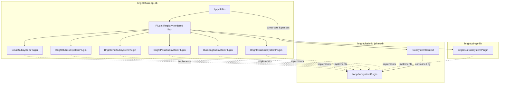
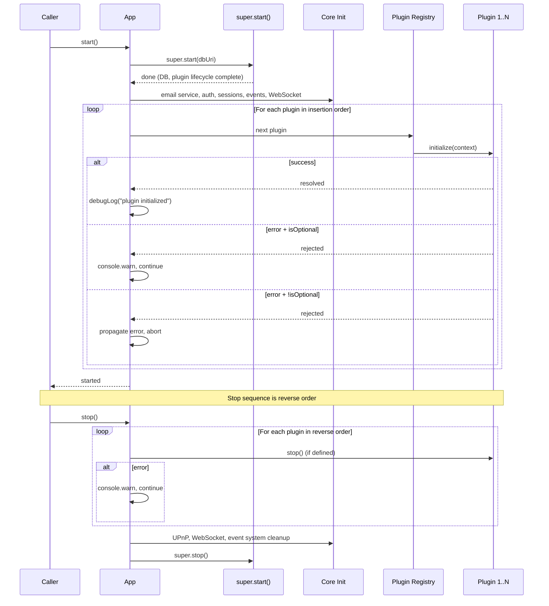

# Design Document: App Subsystem Plugins

## Overview

This design refactors the monolithic `App.start()` method (~950 lines) in `brightchain-api-lib/src/lib/application.ts` into a plugin-based subsystem architecture. Seven subsystems — Email, BrightHub, BrightChat, BrightPass, Digital Burnbag, BrightTrust, and BrightCal — are extracted into discrete plugin classes that implement a shared `IAppSubsystemPlugin` interface.

The interface lives in `brightchain-lib` so that any package in the workspace (including `brightcal-api-lib`) can implement a plugin without depending on `brightchain-api-lib`. This directly resolves the circular dependency between `brightchain-api-lib` and `brightcal-api-lib`.

Each plugin encapsulates:
- Service instantiation and wiring
- Service container registration
- ApiRouter binding
- Graceful error handling (optional plugins log warnings and continue)
- Teardown logic (co-located with initialization)

The `App` class gains a plugin registry that stores plugins in insertion order and iterates them during `start()` (forward order) and `stop()` (reverse order). Core App concerns (HTTP server, auth, sessions, WebSocket, event system) remain inline in `App.start()`.

## Architecture



### Lifecycle Sequence



### Design Decisions

1. **Interface in `brightchain-lib`**: The `IAppSubsystemPlugin` and `ISubsystemContext` interfaces live in the shared library so `brightcal-api-lib` can implement a plugin without importing from `brightchain-api-lib`. This is the key mechanism for breaking the circular dependency.

2. **Ordered array, not a map**: The plugin registry is an ordered array (`IAppSubsystemPlugin[]`), not a `Map<string, IAppSubsystemPlugin>`. Insertion order matters for initialization (e.g., Email before BrightHub). A separate name-uniqueness check prevents duplicates.

3. **`isOptional` defaults to `true`**: Most subsystems currently use try/catch with `console.warn` and continue. Making `isOptional` default to `true` preserves this behavior without requiring every plugin to explicitly set it.

4. **Context object, not `this`**: Plugins receive a narrowed `ISubsystemContext` instead of the full `App` instance. This enforces encapsulation — plugins can only access what they need, and the context interface is stable across packages.

5. **Dynamic import for BrightCal**: The `BrightCalSubsystemPlugin` is registered via `await import('@brightchain/brightcal-api-lib')` at runtime, preserving the `!brightcal-api-lib` negative dependency in `brightchain-api-lib/project.json`. The App class never has a compile-time import of `brightcal-api-lib`.

6. **Core services remain inline**: Email service factory, auth service, backup code service, session adapter, event system, and WebSocket servers are core App concerns that other plugins depend on. They stay in `App.start()` to avoid circular plugin dependencies.

## Components and Interfaces

### IAppSubsystemPlugin (brightchain-lib)

```typescript
/**
 * Shared interface for App subsystem plugins.
 * Implemented by each subsystem to encapsulate its initialization and teardown.
 */
export interface IAppSubsystemPlugin {
  /** Unique name identifying this subsystem (e.g., "email", "brighthub"). */
  readonly name: string;

  /**
   * Whether initialization failure should be non-fatal.
   * When true (default), errors are logged and the App continues starting.
   * When false, errors propagate and abort App.start().
   */
  readonly isOptional?: boolean;

  /**
   * Initialize the subsystem: create services, register in the service
   * container, wire routes to the ApiRouter, etc.
   */
  initialize(context: ISubsystemContext): Promise<void>;

  /**
   * Optional teardown hook. Called in reverse registration order during
   * App.stop(). Errors are logged but do not prevent other plugins from
   * stopping.
   */
  stop?(): Promise<void>;
}
```

### ISubsystemContext (brightchain-lib)

The context is intentionally typed with broad interfaces so that `brightchain-lib` does not need to import concrete classes from `brightchain-api-lib`.

```typescript
import type { Express } from 'express';

/**
 * Narrowed set of App resources passed to subsystem plugins during
 * initialization. Uses broad/interface types so the definition can
 * live in brightchain-lib without importing concrete api-lib classes.
 */
export interface ISubsystemContext {
  /** The ServiceContainer for registering and resolving services. */
  services: IServiceContainer;

  /**
   * The ApiRouter instance, or null if not available.
   * Plugins that wire routes should guard on this being non-null.
   */
  // eslint-disable-next-line @typescript-eslint/no-explicit-any
  apiRouter: any | null;

  /** The Express application instance for mounting middleware/routes. */
  expressApp: Express;

  /** Environment configuration. */
  // eslint-disable-next-line @typescript-eslint/no-explicit-any
  environment: any;

  /** Block store from BrightChainDatabasePlugin. */
  // eslint-disable-next-line @typescript-eslint/no-explicit-any
  blockStore: any;

  /** Member store from BrightChainDatabasePlugin. */
  // eslint-disable-next-line @typescript-eslint/no-explicit-any
  memberStore: any;

  /** Energy store from BrightChainDatabasePlugin. */
  // eslint-disable-next-line @typescript-eslint/no-explicit-any
  energyStore: any;

  /** BrightDb instance from BrightChainDatabasePlugin. */
  // eslint-disable-next-line @typescript-eslint/no-explicit-any
  brightDb: any;

  /**
   * Get a model/collection from the document store by name.
   * Equivalent to App.getModel().
   */
  // eslint-disable-next-line @typescript-eslint/no-explicit-any
  getModel(name: string): any;

  /** The EventNotificationSystem instance, or null. */
  // eslint-disable-next-line @typescript-eslint/no-explicit-any
  eventSystem: any | null;
}

/**
 * Minimal service container interface for plugin use.
 * Matches the ServiceContainer API from node-express-suite.
 */
export interface IServiceContainer {
  register<T>(key: string, factory: () => T, overwrite?: boolean): void;
  get<T>(key: string): T;
  has(key: string): boolean;
}
```

### Plugin Registry (App class)

```typescript
// In App<TID> class:
private readonly subsystemPlugins: IAppSubsystemPlugin[] = [];

public registerSubsystemPlugin(plugin: IAppSubsystemPlugin): void {
  if (this.subsystemPlugins.some(p => p.name === plugin.name)) {
    throw new Error(
      `Duplicate subsystem plugin name: "${plugin.name}" is already registered.`
    );
  }
  this.subsystemPlugins.push(plugin);
}
```

### Plugin Implementations

| Plugin Class | Package | Name | isOptional | stop() |
|---|---|---|---|---|
| `EmailSubsystemPlugin` | `brightchain-api-lib` | `"email"` | `true` | No |
| `BrightHubSubsystemPlugin` | `brightchain-api-lib` | `"brighthub"` | `true` (default) | No |
| `BrightChatSubsystemPlugin` | `brightchain-api-lib` | `"brightchat"` | `true` (default) | No |
| `BrightPassSubsystemPlugin` | `brightchain-api-lib` | `"brightpass"` | `true` (default) | No |
| `BurnbagSubsystemPlugin` | `brightchain-api-lib` | `"burnbag"` | `true` | No |
| `BrightTrustSubsystemPlugin` | `brightchain-api-lib` | `"brighttrust"` | `true` | Yes |
| `BrightCalSubsystemPlugin` | `brightcal-api-lib` | `"brightcal"` | `true` | No |

### File Layout

```
brightchain-lib/src/lib/interfaces/
  appSubsystemPlugin.ts          # IAppSubsystemPlugin, ISubsystemContext, IServiceContainer
  index.ts                        # re-export added

brightchain-api-lib/src/lib/plugins/subsystems/
  emailSubsystemPlugin.ts
  brightHubSubsystemPlugin.ts
  brightChatSubsystemPlugin.ts
  brightPassSubsystemPlugin.ts
  burnbagSubsystemPlugin.ts
  brightTrustSubsystemPlugin.ts
  index.ts                        # barrel export

brightcal-api-lib/src/lib/plugins/
  brightCalSubsystemPlugin.ts
```

## Data Models

No new persistent data models are introduced. This refactor is purely structural — it reorganizes existing initialization code into plugin classes. All existing service registrations, collection names, and data flows remain identical.

The key data structures are the interfaces themselves:

### IAppSubsystemPlugin

| Field | Type | Required | Description |
|---|---|---|---|
| `name` | `string` | Yes | Unique identifier for the subsystem |
| `isOptional` | `boolean` | No (defaults `true`) | Whether init failure is non-fatal |
| `initialize` | `(ctx: ISubsystemContext) => Promise<void>` | Yes | Lifecycle hook for setup |
| `stop` | `() => Promise<void>` | No | Lifecycle hook for teardown |

### ISubsystemContext

| Field | Type | Description |
|---|---|---|
| `services` | `IServiceContainer` | Service container for registration/resolution |
| `apiRouter` | `any \| null` | ApiRouter for wiring controllers/routes |
| `expressApp` | `Express` | Express app for mounting middleware |
| `environment` | `any` | Environment configuration |
| `blockStore` | `any` | Block store from DB plugin |
| `memberStore` | `any` | Member store from DB plugin |
| `energyStore` | `any` | Energy store from DB plugin |
| `brightDb` | `any` | BrightDb instance |
| `getModel` | `(name: string) => any` | Collection/model lookup |
| `eventSystem` | `any \| null` | Event notification system |

## Correctness Properties

*A property is a characteristic or behavior that should hold true across all valid executions of a system — essentially, a formal statement about what the system should do. Properties serve as the bridge between human-readable specifications and machine-verifiable correctness guarantees.*

### Property 1: Registry preserves insertion order

*For any* sequence of uniquely-named plugins registered via `registerSubsystemPlugin`, the internal plugin registry SHALL contain those plugins in exactly the order they were registered.

**Validates: Requirements 2.1, 2.2, 2.4**

### Property 2: Duplicate name rejection

*For any* string `name`, if a plugin with that name is already registered, calling `registerSubsystemPlugin` with another plugin bearing the same name SHALL throw an error.

**Validates: Requirements 2.3**

### Property 3: Initialize in registration order

*For any* sequence of registered plugins, when `App.start()` completes, the `initialize` method of each plugin SHALL have been called in the same order the plugins were registered.

**Validates: Requirements 3.1**

### Property 4: Optional plugin failure is non-fatal

*For any* set of registered plugins where some plugins have `isOptional` set to `true` or `undefined` and their `initialize` methods throw errors, all remaining plugins in the sequence SHALL still have their `initialize` methods called, and `App.start()` SHALL complete without throwing.

**Validates: Requirements 1.4, 3.2, 12.3**

### Property 5: Non-optional plugin failure aborts start

*For any* sequence of registered plugins, if a plugin with `isOptional` set to `false` has its `initialize` method throw an error, then `App.start()` SHALL propagate that error, and no subsequent plugin's `initialize` method SHALL be called.

**Validates: Requirements 3.3**

### Property 6: Stop in reverse registration order

*For any* sequence of registered plugins that define a `stop` method, when `App.stop()` is called, the `stop` methods SHALL be invoked in reverse registration order.

**Validates: Requirements 4.1**

### Property 7: Stop errors are non-fatal

*For any* set of registered plugins where some plugins' `stop` methods throw errors, all other plugins that define a `stop` method SHALL still have their `stop` methods called.

**Validates: Requirements 4.2, 4.3**

## Error Handling

### Plugin Initialization Errors

The plugin lifecycle loop in `App.start()` handles errors per-plugin based on the `isOptional` flag:

```typescript
for (const plugin of this.subsystemPlugins) {
  try {
    await plugin.initialize(context);
    debugLog(env.debug, 'log', `[ ready ] ${plugin.name} subsystem initialized`);
  } catch (err) {
    if (plugin.isOptional !== false) {
      // isOptional is true or undefined → non-fatal
      console.warn(
        `[ warning ] ${plugin.name} subsystem initialization failed, continuing:`,
        err,
      );
    } else {
      // isOptional is explicitly false → fatal
      throw err;
    }
  }
}
```

This preserves the existing behavior where each subsystem's try/catch logs a warning and continues.

### Plugin Stop Errors

During `App.stop()`, all plugin `stop()` errors are caught and logged. The loop always completes so every plugin gets a chance to clean up:

```typescript
for (let i = this.subsystemPlugins.length - 1; i >= 0; i--) {
  const plugin = this.subsystemPlugins[i];
  if (plugin.stop) {
    try {
      await plugin.stop();
    } catch (err) {
      console.warn(
        `[ warning ] ${plugin.name} subsystem stop failed:`,
        err,
      );
    }
  }
}
```

### Existing Error Patterns Preserved

Each extracted plugin preserves the exact error handling of the original inline code:
- **Email**: try/catch → `console.warn('email endpoints will return 503')`
- **BrightHub**: guarded by `if (this.apiRouter)` — no try/catch needed (services are pure constructors)
- **BrightChat**: guarded by `if (this.apiRouter)` — same pattern
- **BrightPass**: block-scoped, no try/catch (simple collection adapter)
- **Burnbag**: try/catch → `console.warn('continuing without burnbag')`
- **BrightTrust**: try/catch → `console.warn('continuing without brightTrust')`
- **BrightCal**: try/catch → `console.warn('continuing without calendar')`

With the plugin architecture, the per-plugin try/catch in the App loop replaces these individual try/catch blocks. The `isOptional: true` flag on each plugin produces equivalent behavior.

## Testing Strategy

### Unit Tests

Unit tests verify specific behaviors of the plugin registry and individual plugins:

1. **Plugin registry**:
   - `registerSubsystemPlugin` adds plugin to the list
   - Duplicate name throws with descriptive error message
   - Registry is empty by default

2. **Individual plugin properties**:
   - Each plugin has the correct `name` value
   - Each plugin has the correct `isOptional` value
   - BrightTrustSubsystemPlugin defines a `stop()` method
   - Other plugins do not define `stop()`

3. **Plugin initialization** (with mocked context):
   - EmailSubsystemPlugin registers `messagePassingService` and `emailMetadataStore`
   - BrightHubSubsystemPlugin registers all 8 social service keys
   - BrightChatSubsystemPlugin registers all chat service keys
   - BrightPassSubsystemPlugin registers `vaultMetadataCollection`
   - BurnbagSubsystemPlugin calls `mountDigitalBurnbagRoutes`
   - BrightTrustSubsystemPlugin registers all BrightTrust service keys
   - BrightCalSubsystemPlugin registers `calendarEngine` and `eventEngine`

4. **Context construction**:
   - Context object contains all required fields
   - Context fields reference the correct App properties

### Property-Based Tests

Property-based tests verify the universal properties defined in the Correctness Properties section. Each property test uses `fast-check` with a minimum of 100 iterations.

| Property | Test Description | Generator Strategy |
|---|---|---|
| Property 1 | Registry order | Generate random arrays of uniquely-named mock plugins (1–20), register all, verify order |
| Property 2 | Duplicate rejection | Generate random name strings, register once, attempt second registration, verify throw |
| Property 3 | Init order | Generate random plugin arrays, mock initialize to record call order, verify matches registration |
| Property 4 | Optional failure non-fatal | Generate plugins with random isOptional (true/undefined) and random throw behavior, verify all are attempted |
| Property 5 | Non-optional abort | Generate plugin sequence with one non-optional thrower at random position, verify subsequent plugins not called |
| Property 6 | Reverse stop order | Generate plugins with random stop() presence, call stop, verify reverse order |
| Property 7 | Stop error resilience | Generate plugins where random stop() methods throw, verify all stop() methods still called |

Tag format: `Feature: app-subsystem-plugins, Property {N}: {title}`

### Integration Tests

Integration tests verify behavioral equivalence (Requirement 12):

1. **Service key equivalence**: After initializing all 7 plugins, verify the service container has the same keys as the current monolithic implementation.
2. **Route equivalence**: After initializing all 7 plugins, verify the Express app has the same route paths mounted.
3. **Dynamic import**: Verify BrightCal plugin is loaded via dynamic import without compile-time dependency.

### What Is NOT Tested with PBT

- Individual plugin initialization logic (service creation, wiring) — these are integration tests with mocked dependencies
- Interface shape correctness — verified by TypeScript compiler
- File location constraints (Req 13) — verified by code review and build system
- BrightCal dependency isolation — verified by Nx dependency graph

