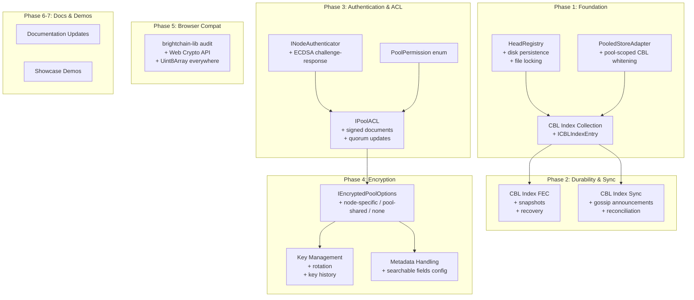
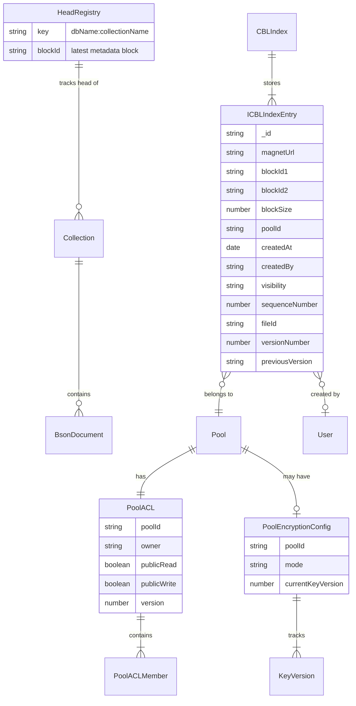

# Design Document: BrightChain Architectural Gaps

## Overview

This design addresses the remaining architectural gaps in BrightChain across seven phases. The core technical challenge is that BrightChain's persistence layer has a critical gap: the `HeadRegistry` is purely in-memory, making all `brightchain-db` data ephemeral across restarts. Everything else — CBL indexing, pool authentication, encrypted storage — depends on fixing this foundation first.

The design follows established project conventions:
- Shared interfaces and types in `brightchain-lib` (browser-compatible, uses `Uint8Array` not `Buffer`)
- Node.js-specific implementations in `brightchain-api-lib` and `brightchain-db`
- Generic type parameters for DTO flexibility (`IBaseData<TData>`)
- Property-based testing with `fast-check` (already a project dependency)

The design builds on four existing specs: `pool-based-storage-isolation`, `pool-scoped-whitening`, `cross-node-eventual-consistency`, and `cross-node-pool-coordination`.

## Architecture



### Key Architectural Decisions

1. **HeadRegistry persistence uses a simple JSON file with write-through caching.** The registry is small (one entry per collection) and writes are infrequent. A JSON file with file-level locking is simpler and more debuggable than a binary format or embedded database. The in-memory Map remains the primary read path for performance.

2. **CBL Index is a brightchain-db collection, not a separate store.** This leverages existing Collection infrastructure (CRUD, indexing, persistence, transactions) and means the CBL Index automatically benefits from HeadRegistry persistence. The `ICBLIndexEntry` interface lives in `brightchain-lib`; the collection lives in `brightchain-db`.

3. **PooledStoreAdapter CBL whitening fix adds pool-scoped methods to IPooledBlockStore.** Rather than changing the existing `storeCBLWithWhitening` signature (which would break the `IBlockStore` contract), we add `storeCBLWithWhiteningInPool` and `retrieveCBLFromPool` to `IPooledBlockStore`. The adapter overrides the base methods to delegate to the pool-scoped variants.

4. **ACLs are stored as signed blocks in the block store itself.** This makes ACLs tamper-evident, auditable, and subject to the same replication/durability mechanisms as data blocks. The ACL chain (each update references the previous ACL's block ID) provides an audit trail.

5. **Encryption operates on block data, not block IDs.** Block IDs are content hashes of the (encrypted) data, so Bloom filters and block lookups work unchanged. The trade-off is that content-based indexing and CBL address extraction are impossible on encrypted blocks.

6. **Key rotation does NOT re-encrypt existing blocks.** Old keys are retained in a key history. This avoids the massive I/O cost of re-encrypting an entire pool and is consistent with BrightChain's copy-on-write model.

## Components and Interfaces

### Phase 1 Components

#### 1.1 Persistent HeadRegistry (`brightchain-db`)

Location: `brightchain-db/src/lib/headRegistry.ts` (extracted from `collection.ts`)

```typescript
import { promises as fs } from 'fs';
import { join } from 'path';

export interface HeadRegistryOptions {
  /** Path to the directory where the registry file is stored */
  dataDir: string;
  /** File name for the registry (default: 'head-registry.json') */
  fileName?: string;
}

export interface IHeadRegistry {
  getHead(dbName: string, collectionName: string): string | undefined;
  setHead(dbName: string, collectionName: string, blockId: string): Promise<void>;
  removeHead(dbName: string, collectionName: string): Promise<void>;
  clear(): Promise<void>;
  load(): Promise<void>;
  getAllHeads(): Map<string, string>;
}

/**
 * Persistent HeadRegistry that writes through to a JSON file on disk.
 * The in-memory Map is the primary read path; disk is the persistence layer.
 * File-level locking prevents concurrent write corruption.
 */
export class PersistentHeadRegistry implements IHeadRegistry {
  private readonly heads = new Map<string, string>();
  private readonly filePath: string;
  private dirty = false;

  constructor(options: HeadRegistryOptions) {
    this.filePath = join(options.dataDir, options.fileName ?? 'head-registry.json');
  }

  // ... implementation details in tasks
}

/**
 * In-memory HeadRegistry for testing (preserves existing behavior).
 */
export class InMemoryHeadRegistry implements IHeadRegistry {
  private readonly heads = new Map<string, string>();
  // ... same interface, no disk I/O
}
```

The existing `HeadRegistry` singleton pattern is replaced with an `IHeadRegistry` interface. `BrightChainDb` accepts an `IHeadRegistry` via options (defaulting to `InMemoryHeadRegistry` for backward compatibility). When a `dataDir` is provided, it uses `PersistentHeadRegistry`.

#### 1.2 Pool-Scoped CBL Whitening (`brightchain-lib` + `brightchain-db`)

Extend `IPooledBlockStore` in `brightchain-lib`:

```typescript
// Added to IPooledBlockStore interface
export interface IPooledBlockStore extends IBlockStore {
  // ... existing methods ...

  /** Store a CBL with whitening, scoped to a specific pool */
  storeCBLWithWhiteningInPool(
    pool: PoolId,
    cblData: Uint8Array,
    options?: CBLWhiteningOptions,
  ): Promise<CBLStorageResult>;

  /** Retrieve a whitened CBL from a specific pool */
  retrieveCBLFromPool(
    pool: PoolId,
    blockId1: Checksum | string,
    blockId2: Checksum | string,
    block1ParityIds?: string[],
    block2ParityIds?: string[],
  ): Promise<Uint8Array>;
}
```

Update `PooledStoreAdapter` in `brightchain-db`:

```typescript
// PooledStoreAdapter overrides
public async storeCBLWithWhitening(
  cblData: Uint8Array,
  options?: CBLWhiteningOptions,
): Promise<CBLStorageResult> {
  return this.inner.storeCBLWithWhiteningInPool(this.poolId, cblData, options);
}

public async retrieveCBL(
  blockId1: Checksum | string,
  blockId2: Checksum | string,
  block1ParityIds?: string[],
  block2ParityIds?: string[],
): Promise<Uint8Array> {
  return this.inner.retrieveCBLFromPool(
    this.poolId, blockId1, blockId2, block1ParityIds, block2ParityIds,
  );
}
```

#### 1.3 CBL Index Entry Interface (`brightchain-lib`)

Location: `brightchain-lib/src/lib/interfaces/storage/cblIndex.ts`

```typescript
import { PoolId } from './pooledBlockStore';

/**
 * Visibility levels for CBL index entries.
 */
export enum CBLVisibility {
  Private = 'private',
  Shared = 'shared',
  Public = 'public',
}

/**
 * A CBL index entry tracking a whitened CBL storage result.
 * This is the higher-level registry — distinct from ICBLStore which
 * handles raw CBL block storage.
 *
 * Generic TId allows string for frontend, Buffer for backend.
 */
export interface ICBLIndexEntry<TId = string> {
  /** Unique entry ID */
  _id: string;
  /** Full magnet URL for CBL reconstruction */
  magnetUrl: string;
  /** First XOR component block ID (hex) */
  blockId1: string;
  /** Second XOR component block ID (hex) */
  blockId2: string;
  /** Block size used for storage */
  blockSize: number;
  /** Pool this CBL belongs to (undefined = default pool) */
  poolId?: PoolId;
  /** When the CBL was stored */
  createdAt: Date;
  /** Member ID of the creator */
  createdBy?: TId;
  /** Visibility level */
  visibility: CBLVisibility;
  /** Soft-delete timestamp (undefined = not deleted) */
  deletedAt?: Date;
  /** Optional user-facing metadata */
  metadata?: ICBLMetadata;
  /** FEC parity block IDs for each XOR component */
  parityBlockIds?: {
    block1: string[];
    block2: string[];
  };
  /** User collection/folder this entry belongs to */
  userCollection?: string;
  /** Users this CBL is shared with (for Shared visibility) */
  sharedWith?: TId[];
  /** Sequence number for sync ordering */
  sequenceNumber: number;
  /** Stable ID grouping all versions of the same logical file */
  fileId?: string;
  /** Version number within the file group (1-based) */
  versionNumber?: number;
  /** Magnet URL of the previous version (audit chain) */
  previousVersion?: string;
}

export interface ICBLMetadata {
  fileName?: string;
  mimeType?: string;
  originalSize?: number;
  tags?: string[];
}
```

#### 1.4 CBL Index Collection (`brightchain-db`)

Location: `brightchain-db/src/lib/cblIndex.ts`

```typescript
import { Collection } from './collection';
import { BrightChainDb } from './database';
import type { ICBLIndexEntry, CBLVisibility } from '@brightchain/brightchain-lib';

export interface CBLIndexQueryOptions {
  poolId?: string;
  createdBy?: string;
  visibility?: CBLVisibility;
  userCollection?: string;
  fileName?: string;
  mimeType?: string;
  tags?: string[];
  fileId?: string;
  includeDeleted?: boolean;
  limit?: number;
  offset?: number;
  sortBy?: 'createdAt' | 'fileName' | 'originalSize' | 'versionNumber';
  sortOrder?: 'asc' | 'desc';
}

/**
 * Higher-level CBL index built on top of a brightchain-db Collection.
 * Tracks whitened CBL storage results with metadata, pool scoping,
 * and user-level organization.
 */
export class CBLIndex {
  private readonly collection: Collection<ICBLIndexEntry>;
  private sequenceCounter = 0;

  constructor(db: BrightChainDb) {
    this.collection = db.collection<ICBLIndexEntry>('__cbl_index__');
  }

  async addEntry(entry: Omit<ICBLIndexEntry, '_id' | 'sequenceNumber'>): Promise<ICBLIndexEntry> { /* ... */ }
  async getByMagnetUrl(magnetUrl: string): Promise<ICBLIndexEntry | null> { /* ... */ }
  async getByBlockId(blockId: string): Promise<ICBLIndexEntry[]> { /* ... */ }
  async query(options: CBLIndexQueryOptions): Promise<ICBLIndexEntry[]> { /* ... */ }
  async softDelete(magnetUrl: string): Promise<void> { /* ... */ }
  async getPoolCBLCounts(): Promise<Map<string, number>> { /* ... */ }
  async getCrossPoolDependencies(poolId: string): Promise<{ blockId: string; pools: string[] }[]> { /* ... */ }
  async shareWith(magnetUrl: string, userId: string): Promise<void> { /* ... */ }
  async snapshot(): Promise<string> { /* ... */ } // Returns magnet URL of snapshot
  async restoreFromSnapshot(magnetUrl: string): Promise<void> { /* ... */ }

  /** Add a new version of a file. Auto-assigns versionNumber and previousVersion. */
  async addVersion(fileId: string, entry: Omit<ICBLIndexEntry, '_id' | 'sequenceNumber' | 'fileId' | 'versionNumber' | 'previousVersion'>): Promise<ICBLIndexEntry> { /* ... */ }
  /** Get all versions of a file, ordered by versionNumber ascending. */
  async getVersionHistory(fileId: string): Promise<ICBLIndexEntry[]> { /* ... */ }
  /** Get the latest version of a file (O(1) via sort + limit). */
  async getLatestVersion(fileId: string): Promise<ICBLIndexEntry | null> { /* ... */ }
}
```

### Phase 3 Components

#### 3.1 Node Authenticator Interface (`brightchain-lib`)

Location: `brightchain-lib/src/lib/interfaces/auth/nodeAuthenticator.ts`

```typescript
/**
 * Challenge-response authentication for node identity verification.
 * Interface in brightchain-lib; ECDSA implementation in brightchain-api-lib.
 */
export interface INodeAuthenticator {
  /** Generate a random challenge nonce */
  createChallenge(): Uint8Array;

  /** Sign a challenge with the node's private key */
  signChallenge(challenge: Uint8Array, privateKey: Uint8Array): Promise<Uint8Array>;

  /** Verify a signature against a public key */
  verifySignature(
    challenge: Uint8Array,
    signature: Uint8Array,
    publicKey: Uint8Array,
  ): Promise<boolean>;

  /** Get the node ID derived from a public key */
  deriveNodeId(publicKey: Uint8Array): string;
}
```

#### 3.2 Pool Permission and ACL (`brightchain-lib`)

Location: `brightchain-lib/src/lib/interfaces/auth/poolAcl.ts`

```typescript
import { PoolId } from '../storage/pooledBlockStore';

export enum PoolPermission {
  Read = 'read',
  Write = 'write',
  Replicate = 'replicate',
  Admin = 'admin',
}

/**
 * A member entry in a pool ACL.
 * Generic TId for DTO flexibility (string for frontend, Uint8Array for backend).
 */
export interface IPoolACLMember<TId = string> {
  nodeId: TId;
  permissions: PoolPermission[];
  addedAt: Date;
  addedBy: TId;
}

/**
 * Pool Access Control List.
 * Stored as a signed document in the block store.
 */
export interface IPoolACL<TId = string> {
  poolId: PoolId;
  owner: TId;
  members: IPoolACLMember<TId>[];
  publicRead: boolean;
  publicWrite: boolean;
  /** Block ID of the previous ACL version (for audit chain) */
  previousAclBlockId?: string;
  /** Signatures from admins who approved this ACL version */
  approvalSignatures: Array<{
    nodeId: TId;
    signature: Uint8Array;
  }>;
  /** Version number, incremented on each update */
  version: number;
  /** Timestamp of this ACL version */
  updatedAt: Date;
}

/**
 * Check if a node has a specific permission in a pool ACL.
 */
export function hasPermission<TId>(
  acl: IPoolACL<TId>,
  nodeId: TId,
  permission: PoolPermission,
): boolean {
  // Admin implies all permissions
  const member = acl.members.find(m => m.nodeId === nodeId);
  if (!member) {
    if (permission === PoolPermission.Read && acl.publicRead) return true;
    if (permission === PoolPermission.Write && acl.publicWrite) return true;
    return false;
  }
  if (member.permissions.includes(PoolPermission.Admin)) return true;
  return member.permissions.includes(permission);
}

/**
 * Check if a quorum of admins have signed an ACL update.
 */
export function hasQuorum<TId>(acl: IPoolACL<TId>): boolean {
  const adminCount = acl.members.filter(
    m => m.permissions.includes(PoolPermission.Admin)
  ).length;
  if (adminCount <= 1) return true; // Single-admin mode
  const signatureCount = acl.approvalSignatures.length;
  return signatureCount > adminCount / 2;
}
```

### Phase 4 Components

#### 4.1 Encrypted Pool Options (`brightchain-lib`)

Location: `brightchain-lib/src/lib/interfaces/storage/encryptedPool.ts`

```typescript
import { PoolId } from './pooledBlockStore';

export enum EncryptionMode {
  None = 'none',
  NodeSpecific = 'node-specific',
  PoolShared = 'pool-shared',
}

export interface IEncryptedPoolOptions {
  encryptionMode: EncryptionMode;
  /** Fields that remain unencrypted for search (e.g., ['blockSize', 'createdAt']) */
  searchableMetadataFields?: string[];
}

/**
 * Pool encryption configuration stored alongside the pool.
 */
export interface IPoolEncryptionConfig {
  poolId: PoolId;
  mode: EncryptionMode;
  searchableMetadataFields: string[];
  /** Key version history for decrypting older blocks */
  keyVersions: IKeyVersion[];
  /** Current active key version */
  currentKeyVersion: number;
}

export interface IKeyVersion {
  version: number;
  createdAt: Date;
  /** For pool-shared: the symmetric key encrypted per-member */
  encryptedKeys?: Array<{
    nodeId: string;
    encryptedKey: Uint8Array; // ECIES-encrypted symmetric key
  }>;
  /** Whether this key version is still valid for decryption */
  active: boolean;
}
```


## Data Models

### HeadRegistry Persistence Format

The on-disk format is a simple JSON object mapping composite keys to block IDs:

```json
{
  "mydb:users": "a1b2c3d4e5f6...",
  "mydb:orders": "f6e5d4c3b2a1...",
  "testdb:__cbl_index__": "1234567890ab..."
}
```

Key format: `${dbName}:${collectionName}` (same as the in-memory Map key).

### CBL Index Entry Document

Stored as a `BsonDocument` in the `__cbl_index__` collection:

```typescript
{
  _id: "uuid-v4",
  magnetUrl: "magnet:?xt=urn:brightchain:cbl&bs=256&b1=abc123&b2=def456",
  blockId1: "abc123...",
  blockId2: "def456...",
  blockSize: 256,
  poolId: "my-pool",
  createdAt: "2025-01-15T10:30:00Z",
  createdBy: "member-id-hex",
  visibility: "private",
  deletedAt: null,
  metadata: {
    fileName: "report.pdf",
    mimeType: "application/pdf",
    originalSize: 1048576,
    tags: ["reports", "2025"]
  },
  parityBlockIds: {
    block1: ["parity1a", "parity1b"],
    block2: ["parity2a", "parity2b"]
  },
  userCollection: "My Reports",
  sharedWith: [],
  sequenceNumber: 42,
  fileId: "file-uuid-v4",
  versionNumber: 3,
  previousVersion: "magnet:?xt=urn:brightchain:cbl&bs=256&b1=prev1&b2=prev2"
}
```

### Pool ACL Document

Stored as a signed block in the block store:

```typescript
{
  poolId: "secure-pool",
  owner: "node-id-of-creator",
  members: [
    {
      nodeId: "node-id-of-creator",
      permissions: ["admin"],
      addedAt: "2025-01-15T10:00:00Z",
      addedBy: "node-id-of-creator"
    },
    {
      nodeId: "node-id-of-member",
      permissions: ["read", "write"],
      addedAt: "2025-01-15T11:00:00Z",
      addedBy: "node-id-of-creator"
    }
  ],
  publicRead: false,
  publicWrite: false,
  previousAclBlockId: null,
  approvalSignatures: [
    {
      nodeId: "node-id-of-creator",
      signature: "<ECDSA signature bytes>"
    }
  ],
  version: 1,
  updatedAt: "2025-01-15T10:00:00Z"
}
```

### Pool Encryption Configuration

Stored alongside the pool ACL:

```typescript
{
  poolId: "encrypted-pool",
  mode: "pool-shared",
  searchableMetadataFields: ["blockSize", "createdAt", "poolId"],
  keyVersions: [
    {
      version: 1,
      createdAt: "2025-01-15T10:00:00Z",
      encryptedKeys: [
        { nodeId: "node-a", encryptedKey: "<ECIES-encrypted AES key>" },
        { nodeId: "node-b", encryptedKey: "<ECIES-encrypted AES key>" }
      ],
      active: true
    }
  ],
  currentKeyVersion: 1
}
```

### HeadRegistry Gossip Announcement

Extension to the existing `BlockAnnouncement` type:

```typescript
{
  type: "head_update",
  blockId: "new-head-block-id",
  dbName: "mydb",
  collectionName: "users",
  timestamp: "2025-01-15T10:30:00Z",
  nodeId: "announcing-node-id"
}
```

### CBL Index Gossip Announcement

Extension to the existing `BlockAnnouncement` type:

```typescript
{
  type: "cbl_index_update",
  blockId: "",
  poolId: "my-pool",
  entry: {
    magnetUrl: "magnet:?xt=urn:brightchain:cbl&...",
    blockId1: "abc123",
    blockId2: "def456",
    sequenceNumber: 42
  }
}
```

### Relationship Diagram




## Correctness Properties

*A property is a characteristic or behavior that should hold true across all valid executions of a system — essentially, a formal statement about what the system should do. Properties serve as the bridge between human-readable specifications and machine-verifiable correctness guarantees.*

The following properties are derived from the acceptance criteria in the requirements document. Each property is universally quantified and references the specific requirements it validates. Properties have been consolidated after reflection to eliminate redundancy.

### Phase 1: HeadRegistry & CBL Index Foundation

**Property 1: HeadRegistry persistence round-trip**
*For any* set of (dbName, collectionName, blockId) triples, after calling `setHead()` for each triple and creating a new `PersistentHeadRegistry` instance from the same data directory, calling `getHead()` for each triple should return the same blockId that was set.
**Validates: Requirements 1.1, 1.2**

**Property 2: HeadRegistry removal persistence**
*For any* set of head pointers that have been persisted, after calling `removeHead()` for a subset and creating a new `PersistentHeadRegistry` instance, the removed entries should not be present and the remaining entries should be unchanged. Similarly, after `clear()`, a new instance should have no entries.
**Validates: Requirements 1.3, 1.7**

**Property 3: HeadRegistry corrupt file recovery**
*For any* byte sequence written to the head registry file path, loading a `PersistentHeadRegistry` should never throw an exception — it should either parse valid JSON and load entries, or start with an empty registry.
**Validates: Requirements 1.4**

**Property 4: HeadRegistry gossip announcement on update**
*For any* (dbName, collectionName, blockId) triple, calling `setHead()` on a gossip-enabled HeadRegistry should result in exactly one gossip announcement containing the dbName, collectionName, and blockId.
**Validates: Requirements 2.1**

**Property 5: HeadRegistry last-writer-wins conflict resolution**
*For any* two head pointer announcements for the same (dbName, collectionName) with different block IDs and different timestamps, the HeadRegistry should retain the block ID with the later timestamp.
**Validates: Requirements 2.2, 2.3**

**Property 6: Pool-scoped CBL whitening round-trip**
*For any* valid pool ID and any CBL data (non-empty Uint8Array of valid block size), storing via `PooledStoreAdapter.storeCBLWithWhitening()` and then retrieving via `PooledStoreAdapter.retrieveCBL()` using the returned block IDs should produce data identical to the original CBL data. Additionally, both block IDs in the result should exist within the specified pool (verifiable via `hasInPool`).
**Validates: Requirements 3.1, 3.2, 3.4**

**Property 7: CBL Index entry completeness**
*For any* valid CBL storage result and optional metadata, creating a CBL index entry should produce a document containing: the magnet URL, both block IDs, block size, creation timestamp, creator ID, pool ID, visibility, and sequence number. All fields from the input should be faithfully preserved in the stored entry.
**Validates: Requirements 4.2, 5.1, 6.1**

**Property 8: CBL Index query correctness**
*For any* set of CBL index entries with known attributes, querying by any single attribute (magnet URL, block ID, creator ID, pool ID, file name, MIME type, tag) should return exactly the entries that match that attribute and no others.
**Validates: Requirements 4.3, 5.2, 6.2**

**Property 9: CBL Index block existence validation**
*For any* CBL index entry creation attempt, if either `blockId1` or `blockId2` does not exist in the block store, the creation should fail with an error. If both exist, the creation should succeed.
**Validates: Requirements 4.4**

**Property 10: CBL Index soft-delete preserves entry**
*For any* existing CBL index entry, after soft-deletion, the entry should still be retrievable (with `includeDeleted: true`) and should have a non-null `deletedAt` timestamp. The entry should not appear in default queries (without `includeDeleted`).
**Validates: Requirements 4.6**

**Property 11: CBL Index pagination completeness and ordering**
*For any* set of N CBL index entries and any page size P, iterating through all pages should yield exactly N entries with no duplicates and no gaps. When a sort order is specified, entries within and across pages should respect that order.
**Validates: Requirements 4.7**

**Property 12: CBL Index pool deletion reporting**
*For any* pool containing N CBL index entries, requesting deletion validation should report all N entries. The count should match the actual number of entries with that pool ID.
**Validates: Requirements 5.3**

**Property 13: CBL Index cross-pool dependency tracking**
*For any* CBL whose XOR component blocks reside in different pools, the CBL Index should report both pools as having a dependency, and neither pool should pass deletion validation while the cross-pool CBL exists.
**Validates: Requirements 5.4, 5.5**

**Property 14: CBL Index user collection organization**
*For any* CBL index entry assigned to a user collection name, querying by that collection name should return the entry. Changing the collection name should move the entry to the new collection.
**Validates: Requirements 6.3**

**Property 15: CBL Index sharing without duplication**
*For any* CBL index entry shared from user A to user B, user B's query should include the entry, user A's query should still include the entry, and the total number of blocks in the block store should not increase (no data duplication).
**Validates: Requirements 6.4**

**Property 16: CBL Index visibility enforcement**
*For any* CBL index entry with visibility `private`, only the creator should see it in queries. For `shared`, only the creator and `sharedWith` users should see it. For `public`, all pool members should see it.
**Validates: Requirements 6.5**

**Property 39: Version history chain integrity**
*For any* file with N versions added via `addVersion()`, the version numbers should be 1 through N with no gaps. Each version's `previousVersion` should point to the magnet URL of the version with `versionNumber - 1`, and version 1 should have no `previousVersion`. All entries should share the same `fileId`.
**Validates: Requirements 27.1, 27.2, 27.3, 27.4, 27.5**

**Property 40: Latest version resolution**
*For any* file with N versions, `getLatestVersion(fileId)` should return the entry with `versionNumber === N`. `getVersionHistory(fileId)` should return exactly N entries in ascending version order.
**Validates: Requirements 27.6, 27.7**

**Property 41: Version chain survives soft-delete**
*For any* file with versions [1, 2, 3] where version 2 is soft-deleted, `getVersionHistory(fileId)` with `includeDeleted: true` should still return all 3 versions with intact `previousVersion` pointers. Without `includeDeleted`, version 2 is omitted but versions 1 and 3 retain their original `previousVersion` values.
**Validates: Requirements 27.8**

### Phase 2: CBL Durability & Sync

**Property 17: CBL Index snapshot round-trip**
*For any* CBL index state (set of entries with metadata), creating a snapshot and then restoring from that snapshot should produce an index state equivalent to the original (same entries, same metadata, same sequence numbers).
**Validates: Requirements 7.2**

**Property 18: CBL Index sequence number monotonicity**
*For any* sequence of N mutations (inserts, updates, deletes) on the CBL Index, the sequence numbers assigned should be strictly monotonically increasing: each mutation's sequence number should be greater than the previous mutation's sequence number.
**Validates: Requirements 7.6**

**Property 19: CBL Index gossip idempotence**
*For any* CBL index entry announcement received by a node, processing the same announcement multiple times should result in exactly one entry in the local index (no duplicates).
**Validates: Requirements 8.2**

**Property 20: CBL Index conflict preservation**
*For any* two CBL index entries with the same magnet URL but different content (e.g., different metadata), both entries should be preserved in the index with a conflict flag, and neither should be silently overwritten.
**Validates: Requirements 8.3**

**Property 21: CBL Index soft-delete propagation**
*For any* CBL index entry that is soft-deleted on one node, after gossip propagation, the entry should also be marked as soft-deleted on peer nodes.
**Validates: Requirements 8.6**

### Phase 3: Authentication & ACL

**Property 22: ECDSA challenge-response round-trip**
*For any* valid ECDSA key pair, creating a challenge, signing it with the private key, and verifying the signature with the corresponding public key should succeed. Verifying with any other public key should fail.
**Validates: Requirements 9.1, 9.2**

**Property 23: ACL permission enforcement**
*For any* pool ACL configuration and any node attempting an operation, the operation should succeed if and only if the node has the required permission (Read for retrieval, Write for storage, Replicate for replication, Admin for ACL modification). Admin permission implies all other permissions.
**Validates: Requirements 10.3, 10.4, 10.5, 11.4, 11.5, 11.6, 11.7**

**Property 24: ACL completeness**
*For any* pool ACL, the document should contain: pool ID, owner node ID, at least one member with Admin permission, public access flags, version number, and at least one approval signature.
**Validates: Requirements 11.2**

**Property 25: Pool creation bootstrap**
*For any* new pool creation, the resulting ACL should have exactly one member (the creator) with Admin permission, version 1, and a valid signature from the creator.
**Validates: Requirements 12.1, 12.3**

**Property 26: Public access flags**
*For any* pool with `publicRead: true`, any node (including unauthenticated) should pass the Read permission check. For any pool with `publicWrite: true`, any node should pass the Write permission check. For pools without public flags, unauthenticated nodes should fail all permission checks.
**Validates: Requirements 12.5, 12.6**

**Property 27: Quorum requirement for ACL updates**
*For any* pool with N Admin members (N > 1), an ACL update should be accepted if and only if it has signatures from more than N/2 Admin members. For pools with exactly 1 Admin, the single Admin's signature should suffice.
**Validates: Requirements 13.1, 13.5**

**Property 28: ACL chain integrity**
*For any* sequence of ACL updates, each update should reference the previous ACL's block ID, forming a linked list. The version number should increment by 1 with each update.
**Validates: Requirements 13.3**

**Property 29: ACL minimum admin invariant**
*For any* ACL update that would remove an Admin, the update should be rejected if it would leave zero Admins. At least one Admin must always remain.
**Validates: Requirements 13.6**

### Phase 4: Encryption

**Property 30: Encryption round-trip**
*For any* valid block data and any encryption mode (node-specific or pool-shared), encrypting and then decrypting the data with the correct key should produce data identical to the original.
**Validates: Requirements 14.2, 14.3**

**Property 31: Block ID is hash of ciphertext**
*For any* plaintext block data, the block ID assigned after encryption should be the content hash of the encrypted (ciphertext) data, not the plaintext. Encrypting the same plaintext twice (with different nonces) should produce different block IDs.
**Validates: Requirements 14.5**

**Property 32: Key distribution to all members**
*For any* pool-shared encrypted pool with N members, each member should be able to decrypt the pool key using their own private key. After key rotation, all current members should be able to decrypt the new key version, and the old key version should remain in the key history.
**Validates: Requirements 15.2, 15.3**

**Property 33: Key rotation preserves old block access**
*For any* block encrypted with key version V, after rotating to key version V+1, the block should still be decryptable using key version V from the key history. New blocks should be encrypted with key version V+1.
**Validates: Requirements 15.4**

**Property 34: Member removal triggers key rotation**
*For any* pool-shared encrypted pool, removing a member should increment the current key version. The removed member's entry should not appear in the new key version's encrypted keys.
**Validates: Requirements 15.5**

**Property 35: Block IDs always unencrypted**
*For any* encryption mode and any block, the block ID (checksum) should always be readable and usable for lookups, Bloom filter membership, and has() checks, regardless of whether the block content is encrypted.
**Validates: Requirements 16.2**

**Property 36: Encrypted metadata field access control**
*For any* encrypted pool with a configured set of searchable metadata fields, querying by a searchable field should return results normally. Querying by a non-searchable (encrypted) field should return an error. Content-based indexing and CBL address extraction on encrypted blocks should fail or return empty results.
**Validates: Requirements 16.3, 16.4, 16.5**

**Property 37: Replication allowed by encryption mode**
*For any* pool, replication of encrypted blocks should be allowed if and only if the encryption mode is `pool-shared` or `none`. Pools with `node-specific` encryption should block replication.
**Validates: Requirements 17.1, 17.2**

**Property 38: Encrypted parity blocks**
*For any* block encrypted with node-specific encryption that has FEC parity blocks, the parity blocks should also be encrypted with the same node key. Decrypting a parity block with the node key should produce valid parity data.
**Validates: Requirements 17.5**

## Error Handling

### Phase 1 Errors

| Error Condition | Behavior | Requirements |
|---|---|---|
| HeadRegistry file corrupted/unreadable | Log warning, start with empty registry | 1.4 |
| HeadRegistry file locked by another process | Retry with exponential backoff, fail after timeout | 1.5 |
| CBL whitening with non-existent pool | Throw `PoolNotFoundError` with pool ID | 3.5 |
| CBL retrieval with missing block IDs in pool | Throw `BlockNotFoundError` with pool ID and block IDs | 3.5 |
| CBL Index entry creation with non-existent blocks | Throw `BlockValidationError` listing missing block IDs | 4.4 |

### Phase 2 Errors

| Error Condition | Behavior | Requirements |
|---|---|---|
| CBL Index snapshot storage fails | Log error, continue operation, retry on next interval | 7.2 |
| CBL Index recovery: all methods fail | Log critical error, start with empty index, alert operator | 7.4 |
| CBL Index gossip: conflicting entries | Preserve both, flag conflict, do not overwrite | 8.3 |

### Phase 3 Errors

| Error Condition | Behavior | Requirements |
|---|---|---|
| ECDSA signature verification fails | Reject operation, log with node ID and operation type | 9.3 |
| Permission denied | Throw `PermissionDeniedError` with required permission, actual permissions, pool ID | 10.6 |
| ACL update with insufficient quorum | Reject update, return required vs actual signature count | 13.5 |
| ACL update would remove last Admin | Reject update with `LastAdminError` | 13.6 |

### Phase 4 Errors

| Error Condition | Behavior | Requirements |
|---|---|---|
| Decryption with wrong key version | Try all key versions in history, fail with `DecryptionError` if none work | 15.4 |
| Replication attempted on node-specific pool | Reject with `ReplicationNotAllowedError` | 17.1 |
| Query on encrypted metadata field | Return `EncryptedFieldError` listing the field and pool config | 16.5 |
| Content indexing on encrypted block | Return empty results, log info-level message | 16.4 |

### Phase 5 Errors

| Error Condition | Behavior | Requirements |
|---|---|---|
| Node.js-specific import detected in brightchain-lib | Build failure with clear error message | 18.1, 18.3 |
| Buffer usage in brightchain-lib interface | Lint error recommending Uint8Array | 18.6 |

## Testing Strategy

### Testing Framework

- **Unit tests**: Jest (already configured via Nx)
- **Property-based tests**: `fast-check` (already a project dependency)
- **Test runner**: `NX_TUI=false npx nx test <project> --outputStyle=stream`

### Dual Testing Approach

Unit tests and property-based tests are complementary:
- **Unit tests** verify specific examples, edge cases, integration points, and error conditions
- **Property tests** verify universal properties across randomly generated inputs (minimum 100 iterations each)

### Property-Based Testing Configuration

Each property test must:
- Run a minimum of 100 iterations
- Reference its design document property number in a comment
- Use the tag format: `Feature: architectural-gaps, Property {number}: {property_text}`
- Be implemented as a single `fast-check` property test

### Test Organization by Phase

**Phase 1 Tests** (brightchain-db):
- HeadRegistry persistence: Properties 1-3 (round-trip, removal, corrupt recovery)
- HeadRegistry gossip: Properties 4-5 (announcement, conflict resolution)
- PooledStoreAdapter CBL: Property 6 (pool-scoped whitening round-trip)
- CBL Index CRUD: Properties 7-11 (entry completeness, query, validation, soft-delete, pagination)
- CBL Index pool features: Properties 12-16 (deletion reporting, cross-pool deps, collections, sharing, visibility)

**Phase 2 Tests** (brightchain-db + brightchain-api-lib):
- CBL Index durability: Properties 17-18 (snapshot round-trip, sequence monotonicity)
- CBL Index sync: Properties 19-21 (gossip idempotence, conflict preservation, delete propagation)

**Phase 3 Tests** (brightchain-lib + brightchain-api-lib):
- Authentication: Property 22 (ECDSA challenge-response round-trip)
- ACL enforcement: Properties 23-29 (permissions, completeness, bootstrap, public access, quorum, chain, min admin)

**Phase 4 Tests** (brightchain-lib + brightchain-api-lib):
- Encryption: Properties 30-31 (round-trip, block ID from ciphertext)
- Key management: Properties 32-34 (distribution, rotation preserves access, member removal)
- Metadata: Properties 35-36 (block IDs unencrypted, field access control)
- Replication: Properties 37-38 (mode-based replication, encrypted parity)

**Phase 5 Tests** (brightchain-lib):
- Browser build test (example test, not property)
- Import scanning for Node.js modules (example test)
- Buffer usage scanning (example test)

**Phases 6-7**: No automated property tests (documentation and demo tasks).

### Unit Test Focus Areas

- HeadRegistry file locking under concurrent access
- CBL Index recovery ordering (snapshot → FEC → scan)
- ACL bootstrap for single-node deployments
- Key rotation edge cases (single member, all members removed)
- Browser compatibility build verification
- Error message content verification for all error types
