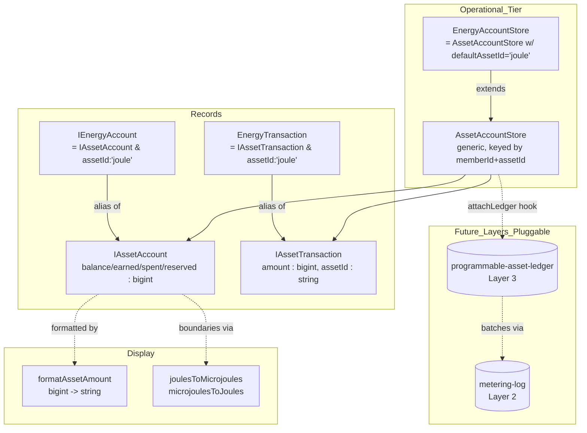
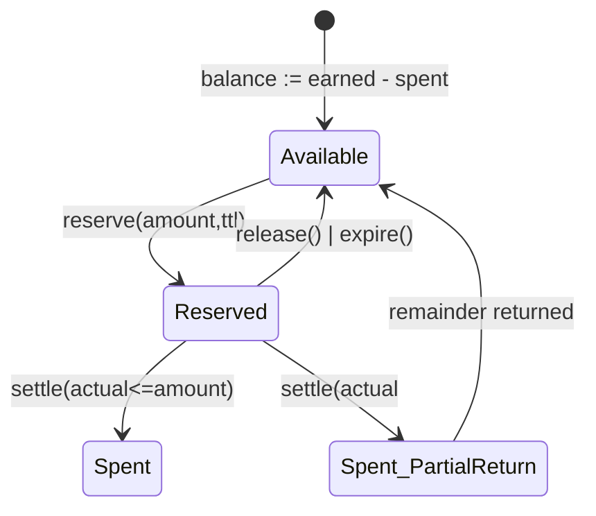

# Design — Asset Account Store Generalization

## Overview

This refactor introduces a thin asset-agnostic abstraction layer on top of the
existing Joule/energy account infrastructure. It is deliberately mechanical:
the goal is to lock in the right shape **before** any new ledger or metering
infrastructure depends on the wrong shape.

The design rests on four moves:

1. **`number` → `bigint` microunits** for all amounts.
2. **Add `assetId`** to account records, transactions, and signatures.
3. **Rename the store generically**, keep the legacy name as a `defaultAssetId='joule'` subclass.
4. **Document the operational/settlement boundary** with hooks (`attachLedger`, `getLastSettledAt`) that future Layer 2/3 work plugs into without rewrites.

No data migration runs. Legacy DTOs are upgraded lazily on first read.

## Architecture



## Architecture — Backward Compatibility Path

```mermaid
graph LR
  Legacy[Legacy DTO<br/>{ memberId, balance:number }]
  Hydrate[Hydrator]
  New[Modern in-memory<br/>{ memberId, assetId:'joule', balance:bigint }]
  Persist[Persist on next write]
  Legacy --> Hydrate
  Hydrate -- assetId default 'joule' --> New
  Hydrate -- balance * 1_000_000n --> New
  New --> Persist
  Persist --> Disk[(BrightDB / typed collection)]
```

## Components

### `IAssetAccount` (replaces `IEnergyAccount` as the base shape)

```ts
export interface IAssetAccount {
  readonly memberId: Checksum;
  readonly assetId: string;          // 'joule' for Joule
  balance: bigint;                   // microunits
  earned: bigint;
  spent: bigint;
  reserved: bigint;
  reputation: number;                // unchanged: 0..1 float
  readonly createdAt: Date;
  lastUpdated: Date;
}

export type IEnergyAccount = IAssetAccount & { readonly assetId: 'joule' };
```

### `IAssetAccountDto` (persisted form)

```ts
export interface IAssetAccountDto {
  [key: string]: unknown;
  memberId: string;
  assetId: string;                   // missing on legacy docs -> defaults 'joule'
  balance: string;                   // bigint serialized as decimal string
  earned: string;
  spent: string;
  reserved: string;
  reputation: number;
  createdAt: string;
  lastUpdated: string;
}
```

### `AssetAccountStore` (generic)

Same surface as today's `EnergyAccountStore`, but:

- Map key is `${memberHex}:${assetId}` instead of `memberHex`.
- Constructor takes `(typedCollection?, opts?: { defaultAssetId?: string })`.
- Single-arity methods (`get`, `set`, `has`, `delete`) operate on
  `defaultAssetId`. Two-arity variants (`getForAsset`, etc.) take an explicit
  `assetId`.
- `reserve` / `settle` / `release` produce/consume `IReservationHandle`.
- `attachLedger(writer)` is a one-shot setter; second call throws.

### `EnergyAccountStore` (compatibility shim)

```ts
export class EnergyAccountStore extends AssetAccountStore {
  constructor(
    typedCollection?: ITypedCollection<IAssetAccountDto, AssetAccount>,
  ) {
    super(typedCollection, { defaultAssetId: 'joule' });
  }
}
```

Every existing call site continues to compile and behave identically.

### `OperationCost` (bigint)

```ts
export class OperationCost {
  constructor(
    public readonly computation: bigint,
    public readonly storage: bigint,
    public readonly network: bigint,
    public readonly proofOfWork: bigint = 0n,
  ) {}
  get totalMicrojoules(): bigint {
    return this.computation + this.storage + this.network + this.proofOfWork;
  }
  /** @deprecated alias for totalMicrojoules — retained for grep compatibility */
  get totalJoules(): bigint { return this.totalMicrojoules; }
  static zero(): OperationCost { return new OperationCost(0n, 0n, 0n, 0n); }
  add(o: OperationCost): OperationCost { /* ... */ }
}
```

### Display helpers

```ts
export const JOULE_MICROUNITS_PER_UNIT = 1_000_000n;

export function microjoulesToJoules(uj: bigint): number {
  // display only; allowed to lose precision
  return Number(uj) / Number(JOULE_MICROUNITS_PER_UNIT);
}

export function joulesToMicrojoules(j: number): bigint {
  if (!Number.isFinite(j) || j < 0) throw new InvalidAmountError();
  return BigInt(Math.round(j * Number(JOULE_MICROUNITS_PER_UNIT)));
}

export function formatAssetAmount(
  amount: bigint,
  assetId: string,
  opts?: { precision?: number; locale?: string },
): string;
```

## Data Models

### Reservation lifecycle



### Composite key

The map inside `AssetAccountStore` is:

```
key = `${memberId.toHex()}:${assetId}`
```

The typed collection's filter for `replaceOne` is:

```
{ memberId: hex, assetId: 'joule' | 'other' }
```

A unique index on `(memberId, assetId)` SHALL be added at the schema layer.

## Error Handling

| Error                              | Thrown by                         | Notes                                  |
| ---------------------------------- | --------------------------------- | -------------------------------------- |
| `InvalidAmountError`               | `joulesToMicrojoules` etc.        | Negative or non-finite input.          |
| `MixedAssetError`                  | sum/aggregate helpers             | Records of differing `assetId`.        |
| `InsufficientAvailableBalanceError`| `reserve()`                       | `balance - reserved < amount`.         |
| `ReservationNotFoundError`         | `settle` / `release`              | Unknown handle.                        |
| `ReservationExpiredError`          | `settle` after TTL                | Caller MUST handle by re-reserving.    |
| `LedgerAlreadyAttachedError`       | `attachLedger`                    | One-shot setter.                       |
| `AssetUnknownError`                | `formatAssetAmount` strict mode   | Default formatter falls back, never throws. |

## Testing Strategy

- **Unit tests** for `joulesToMicrojoules` / `microjoulesToJoules` round-trip
  bounds, formatter output, error throwing.
- **Property-based tests (fast-check)** on `AssetAccountStore`:
  - Conservation invariant across random `earn`/`reserve`/`settle`/`release`
    sequences.
  - Multi-asset isolation: random ops on `assetId='joule'` never affect
    records under `assetId='postage'`.
  - Permutation idempotency on legacy-DTO hydration.
- **Compatibility tests**:
  - Persist a legacy DTO (no `assetId`, `balance: number`) directly into the
    backing collection; hydrate via `loadFromStore`; assert upgrade and
    re-persist correctness.
- **Integration**: every existing energy/auth/user controller test continues
  to pass unmodified.

## Migration & Rollout

- One PR. No feature flag (it's a refactor, not a feature).
- Order of operations inside the PR:
  1. Introduce new types / helpers / errors.
  2. Refactor `EnergyAccount` class → `AssetAccount` base + `EnergyAccount` alias.
  3. Refactor store.
  4. Update every call site (mechanical: `number` → `bigint`, multiplication
     by `JOULE_MICROUNITS_PER_UNIT` at boundaries).
  5. Update tests.
  6. Add the legacy-DTO hydration tests last (verifies the upgrade path
     against a real backing collection mock).
- CI must be green before merge. No skipped tests, no coverage drop.

## Out of Scope

- Asset ledger writes (Layer 3 spec).
- Metering log writes (Layer 2 spec).
- Cross-asset transfer / swap / exchange.
- Removing the `EnergyAccountStore` symbol.
- Joule-specific resource-rate tables.
- Reputation algorithm changes (field shape unchanged; computation untouched).
