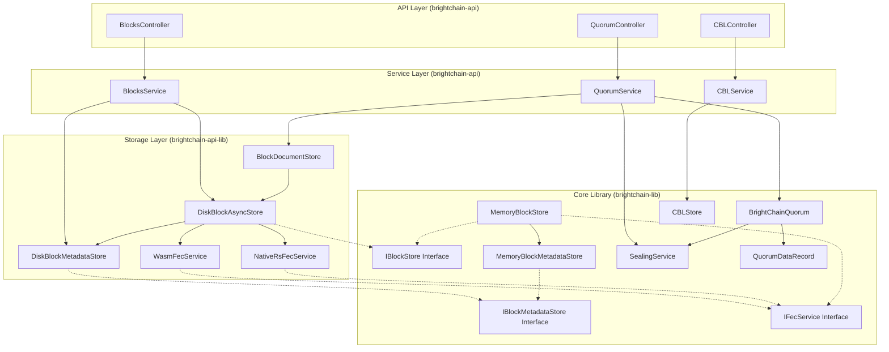

# Design Document: Backend Blockstore Quorum

## Overview

This design document describes the architecture and implementation of the Backend Blockstore Quorum feature for BrightChain. The system provides:

1. **Enhanced IBlockStore Interface** - Extended interface in brightchain-lib with FEC durability, metadata management, and replication tracking methods
2. **IFecService Interface** - Abstraction for FEC operations with multiple implementations (NativeRs for Apple Silicon, Wasm for cross-platform)
3. **Enhanced MemoryBlockStore** - Updated in-memory implementation in brightchain-lib with FEC support
4. **Enhanced DiskBlockAsyncStore** - Updated disk-based implementation in brightchain-api-lib with FEC support, metadata persistence, and expiration management
5. **Quorum Service** - A backend service layer that wraps the existing `BrightChainQuorum` and `SealingService` for API consumption
6. **REST API Layer** - Controllers and routes exposing block, quorum, and CBL operations
7. **Document Store Integration** - Connects `BlockDocumentStore` with quorum encryption for secure document storage

**Library Organization:**
- **brightchain-lib**: All interfaces (IBlockStore, IBlockMetadataStore, IFecService), enumerations, MemoryBlockStore, MemoryBlockMetadataStore
- **brightchain-api-lib**: Disk-specific implementations (DiskBlockAsyncStore, DiskBlockMetadataStore), FEC service implementations (WasmFecService, NativeRsFecService), FecServiceFactory
- **brightchain-api**: API controllers, services, and routes

The design leverages existing implementations from `brightchain-lib` and `brightchain-api-lib`, extending them with FEC-based durability using Reed-Solomon encoding, block replication tracking, and metadata management. Both MemoryBlockStore and DiskBlockAsyncStore implement the same enhanced IBlockStore interface. Replication interfaces are in place for future implementation - currently tracking only.

## Architecture



## Components and Interfaces

### 1. Enhanced IBlockStore Interface

The core block store interface extended with durability, FEC, and replication support. This interface is implemented by both MemoryBlockStore (brightchain-lib) and DiskBlockAsyncStore (brightchain-api-lib).

```typescript
import { ChecksumUint8Array } from '@digitaldefiance/ecies-lib';
import { BaseBlock } from '../blocks/base';
import { BlockHandle } from '../blocks/handle';
import { RawDataBlock } from '../blocks/rawData';
import { BlockSize } from '../enumerations/blockSize';

/**
 * Durability level determines how many parity blocks are generated
 */
enum DurabilityLevel {
  Ephemeral = 'ephemeral',       // No parity blocks
  Standard = 'standard',         // 1 parity block
  HighDurability = 'high_durability'  // 2+ parity blocks
}

/**
 * Replication status for a block
 */
enum ReplicationStatus {
  Pending = 'pending',           // Not yet replicated
  Replicated = 'replicated',     // Meets target replication factor
  UnderReplicated = 'under_replicated',  // Below target replication factor
  Failed = 'failed'              // Replication failed
}

/**
 * Block metadata including durability and replication info
 */
interface IBlockMetadata {
  blockId: string;
  createdAt: Date;
  expiresAt: Date | null;
  durabilityLevel: DurabilityLevel;
  parityBlockIds: string[];      // IDs of parity blocks for this data block
  accessCount: number;
  lastAccessedAt: Date;
  replicationStatus: ReplicationStatus;
  targetReplicationFactor: number;
  replicaNodeIds: string[];      // IDs of nodes holding replicas
  size: number;
  checksum: string;
}

/**
 * Options for storing a block
 */
interface BlockStoreOptions {
  expiresAt?: Date;
  durabilityLevel?: DurabilityLevel;
  targetReplicationFactor?: number;
}

/**
 * Result of block recovery attempt
 */
interface RecoveryResult {
  success: boolean;
  recoveredBlock?: RawDataBlock;
  error?: string;
}

/**
 * Enhanced interface for block storage operations with FEC and replication support
 */
export interface IBlockStore {
  /**
   * The block size for this store
   */
  readonly blockSize: BlockSize;

  // === Core Block Operations ===
  
  /**
   * Check if a block exists
   */
  has(key: ChecksumUint8Array | string): Promise<boolean>;

  /**
   * Get a block's data
   */
  getData(key: ChecksumUint8Array): Promise<RawDataBlock>;

  /**
   * Store a block's data with optional durability settings
   */
  setData(block: RawDataBlock, options?: BlockStoreOptions): Promise<void>;

  /**
   * Delete a block's data (and associated parity blocks)
   */
  deleteData(key: ChecksumUint8Array): Promise<void>;

  /**
   * Get random block checksums from the store
   */
  getRandomBlocks(count: number): Promise<ChecksumUint8Array[]>;

  /**
   * Get a handle to a block
   */
  get<T extends BaseBlock>(checksum: ChecksumUint8Array | string): BlockHandle<T>;

  /**
   * Store raw data with a key
   */
  put(key: ChecksumUint8Array | string, data: Uint8Array, options?: BlockStoreOptions): Promise<void>;

  /**
   * Delete a block
   */
  delete(key: ChecksumUint8Array | string): Promise<void>;

  // === Metadata Operations ===
  
  /**
   * Get metadata for a block
   */
  getMetadata(key: ChecksumUint8Array | string): Promise<IBlockMetadata | null>;

  /**
   * Update metadata for a block
   */
  updateMetadata(key: ChecksumUint8Array | string, updates: Partial<IBlockMetadata>): Promise<void>;

  // === FEC/Durability Operations ===
  
  /**
   * Generate parity blocks for a data block using Reed-Solomon encoding
   * @param key - The data block's checksum
   * @param parityCount - Number of parity blocks to generate
   * @returns Array of parity block checksums
   */
  generateParityBlocks(key: ChecksumUint8Array | string, parityCount: number): Promise<ChecksumUint8Array[]>;

  /**
   * Get parity block checksums for a data block
   */
  getParityBlocks(key: ChecksumUint8Array | string): Promise<ChecksumUint8Array[]>;

  /**
   * Attempt to recover a corrupted or missing block using parity data
   */
  recoverBlock(key: ChecksumUint8Array | string): Promise<RecoveryResult>;

  /**
   * Verify block integrity against its parity data
   */
  verifyBlockIntegrity(key: ChecksumUint8Array | string): Promise<boolean>;

  // === Replication Operations ===
  
  /**
   * Get blocks pending replication
   */
  getBlocksPendingReplication(): Promise<ChecksumUint8Array[]>;

  /**
   * Get blocks that are under-replicated
   */
  getUnderReplicatedBlocks(): Promise<ChecksumUint8Array[]>;

  /**
   * Record that a block has been replicated to a node
   */
  recordReplication(key: ChecksumUint8Array | string, nodeId: string): Promise<void>;

  /**
   * Record that a replica node is no longer available
   */
  recordReplicaLoss(key: ChecksumUint8Array | string, nodeId: string): Promise<void>;
}
```

### 2. Block Metadata Store

A component to manage block metadata. The interface and in-memory implementation live in brightchain-lib, while the disk implementation lives in brightchain-api-lib.

```typescript
/**
 * IBlockMetadataStore interface - defined in brightchain-lib
 * Located in brightchain-lib/src/lib/interfaces/storage/blockMetadataStore.ts
 */
interface IBlockMetadataStore {
  create(metadata: IBlockMetadata): Promise<void>;
  get(blockId: string): Promise<IBlockMetadata | null>;
  update(blockId: string, updates: Partial<IBlockMetadata>): Promise<void>;
  delete(blockId: string): Promise<void>;
  findExpired(): Promise<IBlockMetadata[]>;
  findByReplicationStatus(status: ReplicationStatus): Promise<IBlockMetadata[]>;
  recordAccess(blockId: string): Promise<void>;
}

/**
 * In-memory implementation for MemoryBlockStore
 * Located in brightchain-lib/src/lib/stores/memoryBlockMetadataStore.ts
 */
class MemoryBlockMetadataStore implements IBlockMetadataStore {
  private metadata = new Map<string, IBlockMetadata>();
  // ... implementation
}

/**
 * Disk-based implementation for DiskBlockAsyncStore
 * Located in brightchain-api-lib/src/lib/stores/diskBlockMetadataStore.ts
 * Stores metadata as JSON files alongside block data (*.m.json)
 */
class DiskBlockMetadataStore implements IBlockMetadataStore {
  // Path: {storePath}/{blockSize}/{first2}/{next2}/{blockId}.m.json
  // ... implementation
}
```

### 3. FEC Integration

Both MemoryBlockStore and DiskBlockAsyncStore use an IFecService interface for Reed-Solomon encoding/decoding. Multiple implementations are supported:

1. **WasmFecService** (brightchain-api-lib) - Uses `@subspace/reed-solomon-erasure.wasm` for cross-platform support
2. **NativeRsFecService** (brightchain-api-lib) - Uses `@digitaldefiance/node-rs-accelerate` for Apple Silicon hardware acceleration
3. **BrowserFecService** (brightchain-lib) - Lightweight implementation for browser environments

```typescript
/**
 * IFecService interface - defined in brightchain-lib for use by all block stores
 * Located in brightchain-lib/src/lib/interfaces/services/fecService.ts
 */
interface IFecService {
  /**
   * Check if this FEC service is available in the current environment
   */
  isAvailable(): Promise<boolean>;

  /**
   * Create parity data for a block
   */
  createParityData(blockData: Buffer | Uint8Array, parityCount: number): Promise<ParityData[]>;

  /**
   * Recover block data using parity
   */
  recoverFileData(
    corruptedData: Buffer | Uint8Array | null,
    parityData: ParityData[],
    originalSize: number
  ): Promise<FecRecoveryResult>;

  /**
   * Verify block integrity against parity
   */
  verifyFileIntegrity(blockData: Buffer | Uint8Array, parityData: ParityData[]): Promise<boolean>;
}

interface ParityData {
  data: Buffer | Uint8Array;
  index: number;
}

interface FecRecoveryResult {
  data: Buffer | Uint8Array;
  recovered: boolean;
}

/**
 * FEC Service Factory - selects best available implementation
 * Located in brightchain-api-lib/src/lib/services/fecServiceFactory.ts
 */
class FecServiceFactory {
  /**
   * Get the best available FEC service for the current environment
   * Priority: NativeRs (Apple Silicon) > Wasm > Browser fallback
   */
  static async getBestAvailable(): Promise<IFecService>;
}

/**
 * Parity block storage convention:
 * - Data block: {blockId}
 * - Parity blocks: {blockId}.p0, {blockId}.p1, etc.
 * - Metadata references parity block IDs
 */
```

### 4. Enhanced Block Store Service

Extends the existing `BlocksService` with metadata management and XOR operations.

```typescript
interface IEnhancedBlockService {
  // Existing operations
  storeBlock(data: Buffer, member: Member, options?: BlockStoreOptions): Promise<string>;
  getBlock(blockId: string): Promise<BlockWithMetadata>;
  deleteBlock(blockId: string): Promise<void>;
  
  // New metadata operations
  getBlockMetadata(blockId: string): Promise<IBlockMetadata>;
  updateBlockMetadata(blockId: string, updates: Partial<IBlockMetadata>): Promise<void>;
  
  // XOR brightening
  brightenBlock(blockId: string, randomBlockCount: number): Promise<BrightenResult>;
  
  // Cleanup
  cleanupExpiredBlocks(): Promise<CleanupResult>;
}

interface BlockStoreOptions {
  expiresAt?: Date;
  durabilityLevel?: DurabilityLevel;
}

interface BrightenResult {
  brightenedBlockId: string;
  randomBlockIds: string[];
  originalBlockId: string;
}

interface CleanupResult {
  deletedCount: number;
  deletedBlockIds: string[];
  errors: CleanupError[];
}
```

### 5. Quorum Service

A service layer that wraps `BrightChainQuorum` for API consumption.

```typescript
interface IQuorumService {
  // Member management
  addMember(publicKey: Uint8Array, metadata: MemberMetadata): Promise<QuorumMember>;
  removeMember(memberId: string): Promise<void>;
  getMember(memberId: string): Promise<QuorumMember | null>;
  listMembers(): Promise<QuorumMember[]>;
  
  // Document operations
  sealDocument<T>(
    agent: Member,
    document: T,
    memberIds: string[],
    sharesRequired?: number
  ): Promise<SealedDocumentResult>;
  
  unsealDocument<T>(
    documentId: string,
    memberShares: MemberShare[]
  ): Promise<T>;
  
  getDocument(documentId: string): Promise<QuorumDocumentInfo>;
  listDocuments(memberId?: string): Promise<QuorumDocumentInfo[]>;
  deleteDocument(documentId: string): Promise<void>;
  
  canUnlock(documentId: string, memberIds: string[]): Promise<CanUnlockResult>;
}

interface QuorumMember {
  id: string;
  publicKey: Uint8Array;
  metadata: MemberMetadata;
  isActive: boolean;
  createdAt: Date;
}

interface MemberMetadata {
  name: string;
  email?: string;
  role?: string;
}

interface MemberShare {
  memberId: string;
  decryptedShare: string;
}

interface SealedDocumentResult {
  documentId: string;
  encryptedData: Uint8Array;
  memberIds: string[];
  sharesRequired: number;
  createdAt: Date;
}

interface QuorumDocumentInfo {
  id: string;
  memberIds: string[];
  sharesRequired: number;
  createdAt: Date;
  creatorId: string;
}

interface CanUnlockResult {
  canUnlock: boolean;
  sharesProvided: number;
  sharesRequired: number;
  missingMembers: string[];
}
```

### 6. API Controllers

#### BlocksController (Enhanced)

```typescript
// POST /api/blocks
interface StoreBlockRequest {
  data: string; // base64 encoded
  options?: {
    expiresAt?: string; // ISO date
    durabilityLevel?: DurabilityLevel;
  };
}

interface StoreBlockResponse {
  blockId: string;
  metadata: IBlockMetadata;
}

// GET /api/blocks/:id
interface GetBlockResponse {
  blockId: string;
  data: string; // base64 encoded
  metadata: IBlockMetadata;
}

// GET /api/blocks/:id/metadata
interface GetBlockMetadataResponse {
  metadata: IBlockMetadata;
}

// POST /api/blocks/brighten
interface BrightenBlockRequest {
  blockId: string;
  randomBlockCount: number;
}

interface BrightenBlockResponse {
  brightenedBlockId: string;
  randomBlockIds: string[];
  originalBlockId: string;
}

// DELETE /api/blocks/:id
interface DeleteBlockResponse {
  success: boolean;
  blockId: string;
}
```

#### QuorumController

```typescript
// POST /api/quorum/members
interface AddMemberRequest {
  publicKey: string; // hex encoded
  metadata: MemberMetadata;
}

interface AddMemberResponse {
  member: QuorumMember;
}

// GET /api/quorum/members
interface ListMembersResponse {
  members: QuorumMember[];
}

// DELETE /api/quorum/members/:id
interface RemoveMemberResponse {
  success: boolean;
  memberId: string;
}

// POST /api/quorum/documents/seal
interface SealDocumentRequest {
  document: unknown;
  memberIds: string[];
  sharesRequired?: number;
}

interface SealDocumentResponse {
  documentId: string;
  memberIds: string[];
  sharesRequired: number;
  createdAt: string;
}

// POST /api/quorum/documents/:id/unseal
interface UnsealDocumentRequest {
  shares: MemberShare[];
}

interface UnsealDocumentResponse {
  document: unknown;
}

// GET /api/quorum/documents/:id
interface GetDocumentResponse {
  document: QuorumDocumentInfo;
}

// GET /api/quorum/documents/:id/can-unlock
interface CanUnlockRequest {
  memberIds: string[];
}

interface CanUnlockResponse {
  canUnlock: boolean;
  sharesProvided: number;
  sharesRequired: number;
  missingMembers: string[];
}
```

#### CBLController

```typescript
// POST /api/cbl
interface CreateCBLRequest {
  blockAddresses: string[]; // hex encoded checksums
  creatorId: string;
}

interface CreateCBLResponse {
  cblId: string;
  blockCount: number;
}

// GET /api/cbl/:id
interface GetCBLResponse {
  cblId: string;
  blockAddresses: string[];
  creatorId: string;
  createdAt: string;
}

// GET /api/cbl/:id/blocks
interface GetCBLBlocksResponse {
  cblId: string;
  blocks: Array<{
    address: string;
    data: string; // base64 encoded
  }>;
}

// DELETE /api/cbl/:id
interface DeleteCBLResponse {
  success: boolean;
  cblId: string;
}
```

### 7. Error Response Format

```typescript
interface ApiErrorResponse {
  error: {
    code: string;
    message: string;
    details?: Record<string, unknown>;
  };
  statusCode: number;
}

enum ErrorCode {
  // Block errors
  BLOCK_NOT_FOUND = 'BLOCK_NOT_FOUND',
  BLOCK_VALIDATION_FAILED = 'BLOCK_VALIDATION_FAILED',
  BLOCK_SIZE_MISMATCH = 'BLOCK_SIZE_MISMATCH',
  INSUFFICIENT_RANDOM_BLOCKS = 'INSUFFICIENT_RANDOM_BLOCKS',
  
  // Quorum errors
  MEMBER_NOT_FOUND = 'MEMBER_NOT_FOUND',
  DOCUMENT_NOT_FOUND = 'DOCUMENT_NOT_FOUND',
  INSUFFICIENT_SHARES = 'INSUFFICIENT_SHARES',
  SHARE_DECRYPTION_FAILED = 'SHARE_DECRYPTION_FAILED',
  INVALID_MEMBER_COUNT = 'INVALID_MEMBER_COUNT',
  
  // CBL errors
  CBL_NOT_FOUND = 'CBL_NOT_FOUND',
  INVALID_CBL_SIGNATURE = 'INVALID_CBL_SIGNATURE',
  
  // General errors
  VALIDATION_ERROR = 'VALIDATION_ERROR',
  UNAUTHORIZED = 'UNAUTHORIZED',
  FORBIDDEN = 'FORBIDDEN',
  INTERNAL_ERROR = 'INTERNAL_ERROR'
}
```

## Data Models

### Block Metadata Schema

```typescript
// Stored as JSON file alongside block data
// Path: {storePath}/{blockSize}/{first2}/{next2}/{blockId}.m.json
interface BlockMetadataFile {
  version: 1;
  blockId: string;
  createdAt: string; // ISO date
  expiresAt: string | null; // ISO date
  durabilityLevel: DurabilityLevel;
  parityBlockIds: string[]; // IDs of parity blocks for FEC recovery
  accessCount: number;
  lastAccessedAt: string; // ISO date
  replicationStatus: ReplicationStatus;
  targetReplicationFactor: number;
  replicaNodeIds: string[]; // IDs of nodes holding replicas
  size: number;
  checksum: string;
}
```

### Quorum Member Schema

```typescript
// Stored in BlockDocumentStore collection 'quorum_members'
interface QuorumMemberDocument {
  _id: string; // member ID
  publicKey: string; // hex encoded
  name: string;
  email?: string;
  role?: string;
  isActive: boolean;
  createdAt: Date;
  updatedAt: Date;
}
```

### Quorum Document Schema

```typescript
// Stored in BlockDocumentStore collection 'quorum_documents'
interface QuorumDocumentDocument {
  _id: string; // document ID
  encryptedData: string; // hex encoded
  encryptedSharesByMemberId: Record<string, string>; // memberId -> hex encoded share
  checksum: string; // hex encoded
  signature: string;
  creatorId: string;
  memberIds: string[];
  sharesRequired: number;
  createdAt: Date;
  updatedAt: Date;
}
```

### CBL Index Schema

```typescript
// Stored in BlockDocumentStore collection 'cbl_index'
interface CBLIndexDocument {
  _id: string; // CBL checksum
  creatorId: string;
  blockCount: number;
  totalSize: number;
  createdAt: Date;
  isEncrypted: boolean;
}
```


## Correctness Properties

*A property is a characteristic or behavior that should hold true across all valid executions of a system—essentially, a formal statement about what the system should do. Properties serve as the bridge between human-readable specifications and machine-verifiable correctness guarantees.*

### Property 1: Block Metadata Persistence Round-Trip

*For any* valid block data, storing the block and then retrieving its metadata SHALL return a metadata record containing the correct block ID, creation timestamp, and all configured options (expiration, durability level).

**Validates: Requirements 1.1, 1.3**

### Property 2: Block Access Tracking

*For any* stored block, accessing the block N times SHALL result in the access count being N and the last access timestamp being updated to reflect the most recent access.

**Validates: Requirements 1.2**

### Property 3: Block Expiration Identification

*For any* set of blocks with various expiration times, the cleanup identification process SHALL return exactly those blocks whose expiration time is in the past.

**Validates: Requirements 1.4, 2.1**

### Property 4: Block Cleanup with CBL Protection

*For any* expired block that is referenced by an active CBL, the cleanup process SHALL NOT delete that block. *For any* expired block not referenced by any CBL, the cleanup process SHALL delete both the block data and metadata.

**Validates: Requirements 2.2, 2.4**

### Property 5: XOR Brightening Correctness

*For any* source block and N random blocks, the brightening operation SHALL produce a result block that equals the XOR of the source block with all N random blocks, and SHALL return the correct list of random block IDs used.

**Validates: Requirements 6.1, 6.2, 6.3**

### Property 5a: FEC Parity Generation

*For any* block stored with durability level "standard", the block store SHALL generate exactly 1 parity block. *For any* block stored with durability level "high_durability", the block store SHALL generate at least 2 parity blocks. *For any* block stored with durability level "ephemeral", no parity blocks SHALL be generated.

**Validates: Requirements 4.1, 4.2, 4.3**

### Property 5b: FEC Block Recovery

*For any* block with parity data, if the original block is corrupted or missing, the recoverBlock operation SHALL successfully reconstruct the original block data using the parity blocks.

**Validates: Requirements 4.5, 4.6**

### Property 5c: FEC Integrity Verification

*For any* block with parity data, verifyBlockIntegrity SHALL return true if the block data matches the parity data, and false if the block has been modified.

**Validates: Requirements 4.8**

### Property 5d: Replication Status Tracking

*For any* block stored with a target replication factor, the block SHALL initially have status "pending". After recordReplication is called for enough nodes to meet the target, the status SHALL be "replicated". After recordReplicaLoss reduces replicas below target, the status SHALL be "under_replicated".

**Validates: Requirements 5.1, 5.3, 5.4, 5.5**

### Property 5e: Replication Query Correctness

*For any* set of blocks with various replication statuses, getBlocksPendingReplication SHALL return exactly those blocks with status "pending", and getUnderReplicatedBlocks SHALL return exactly those blocks with status "under_replicated".

**Validates: Requirements 5.2, 5.6**

### Property 6: Member Management Round-Trip

*For any* valid member public key and metadata, adding the member and then retrieving the member by ID SHALL return the same public key and metadata. The member list SHALL contain all added active members.

**Validates: Requirements 4.1, 4.3, 4.4**

### Property 7: Member Removal Preserves Existing Document Access

*For any* member who is part of a sealed document, removing that member from the quorum SHALL NOT affect their ability to participate in unsealing that existing document.

**Validates: Requirements 4.2**

### Property 8: Sealing Produces Valid Sealed Document

*For any* valid document and set of at least 2 members with a valid threshold, sealing SHALL produce a document record containing encrypted data (not equal to original), one encrypted share per member, and the correct threshold value.

**Validates: Requirements 5.1, 5.2, 5.3, 5.4, 5.6**

### Property 9: Seal/Unseal Round-Trip

*For any* valid document, set of members, and threshold T, sealing the document and then unsealing with at least T member shares SHALL return a document equivalent to the original.

**Validates: Requirements 6.1, 6.2, 6.3, 6.4**

### Property 10: Document Persistence Round-Trip

*For any* sealed document, persisting it to storage and then retrieving it by ID SHALL return an equivalent document record.

**Validates: Requirements 7.1, 7.2**

### Property 11: Document Listing Access Control

*For any* set of sealed documents with different member sets, listing documents for a specific member SHALL return exactly those documents where that member is in the member list.

**Validates: Requirements 7.3**

### Property 12: Document Deletion

*For any* sealed document, deleting it and then attempting to retrieve it SHALL result in a not-found error.

**Validates: Requirements 7.4**

### Property 13: Block API Round-Trip

*For any* valid block data, POSTing to /api/blocks and then GETting /api/blocks/:id SHALL return the same block data. The metadata endpoint SHALL return valid metadata.

**Validates: Requirements 8.1, 8.2, 8.4**

### Property 14: Block API Deletion

*For any* stored block, DELETEing /api/blocks/:id and then GETting the same ID SHALL return a 404 status.

**Validates: Requirements 8.3**

### Property 15: Brighten API Correctness

*For any* stored block and valid random block count, POSTing to /api/blocks/brighten SHALL return a valid brightened block ID and the correct number of random block IDs.

**Validates: Requirements 8.5**

### Property 16: Quorum Member API Round-Trip

*For any* valid member data, POSTing to /api/quorum/members and then GETting /api/quorum/members SHALL include the added member with correct data.

**Validates: Requirements 9.1, 9.2**

### Property 17: Quorum Member API Deletion

*For any* added member, DELETEing /api/quorum/members/:id SHALL remove the member from the list.

**Validates: Requirements 9.3**

### Property 18: Quorum Document API Round-Trip

*For any* valid document and member set, POSTing to /api/quorum/documents/seal and then POSTing to /api/quorum/documents/:id/unseal with valid shares SHALL return the original document.

**Validates: Requirements 9.4, 9.5**

### Property 19: Quorum Document Metadata API

*For any* sealed document, GETting /api/quorum/documents/:id SHALL return the correct metadata including member IDs and threshold.

**Validates: Requirements 9.6**

### Property 20: Can-Unlock API Correctness

*For any* sealed document with threshold T and member set M, the can-unlock endpoint SHALL return true if and only if the provided member IDs include at least T members from M.

**Validates: Requirements 9.7**

### Property 21: Encrypted Document Store Round-Trip

*For any* document created with encryption enabled, storing and then retrieving with valid quorum shares SHALL return the original document.

**Validates: Requirements 10.1, 10.2**

### Property 22: Unencrypted Document Store Round-Trip

*For any* document created without encryption, storing and then retrieving SHALL return the original document without requiring quorum shares.

**Validates: Requirements 10.3**

### Property 23: Document Store Access Control

*For any* set of documents with different access permissions, querying as a specific user SHALL return only documents that user has access to.

**Validates: Requirements 10.4**

### Property 24: CBL API Round-Trip

*For any* valid set of block addresses, POSTing to /api/cbl and then GETting /api/cbl/:id SHALL return the same block addresses.

**Validates: Requirements 11.1, 11.2**

### Property 25: CBL Blocks Retrieval

*For any* CBL with stored blocks, GETting /api/cbl/:id/blocks SHALL return the actual data for all blocks in the CBL.

**Validates: Requirements 11.3**

### Property 26: CBL API Deletion

*For any* created CBL, DELETEing /api/cbl/:id and then GETting the same ID SHALL return a 404 status.

**Validates: Requirements 11.4**

### Property 27: Error Response Format Consistency

*For any* API error response, the response body SHALL contain an error object with code, message, and optional details fields, and the HTTP status code SHALL match the error type.

**Validates: Requirements 12.6**

### Property 28: QuorumDataRecord Serialization Round-Trip

*For any* valid QuorumDataRecord object, serializing to JSON and then deserializing SHALL produce an object with equivalent id, encryptedData, encryptedSharesByMemberId, checksum, signature, memberIDs, sharesRequired, and dates.

**Validates: Requirements 13.1**

### Property 29: Block Metadata Serialization Round-Trip

*For any* valid IBlockMetadata object, serializing to JSON and then deserializing SHALL preserve all fields including blockId, timestamps, durabilityLevel, accessCount, replicationStatus, size, and checksum.

**Validates: Requirements 13.2**

### Property 30: CBL Serialization Round-Trip

*For any* valid ConstituentBlockListBlock, serializing and then deserializing SHALL preserve all block addresses, creator information, and signature.

**Validates: Requirements 13.3**

## Error Handling

### Block Store Errors

| Error Type | HTTP Status | Error Code | Description |
|------------|-------------|------------|-------------|
| Block not found | 404 | BLOCK_NOT_FOUND | The requested block ID does not exist |
| Block validation failed | 400 | BLOCK_VALIDATION_FAILED | Block data failed validation (checksum mismatch, size mismatch) |
| Block size mismatch | 400 | BLOCK_SIZE_MISMATCH | Block size doesn't match store configuration |
| Insufficient random blocks | 400 | INSUFFICIENT_RANDOM_BLOCKS | Not enough random blocks available for brightening |
| Metadata corrupted | 500 | METADATA_CORRUPTED | Block metadata file is corrupted or unreadable |

### Quorum Errors

| Error Type | HTTP Status | Error Code | Description |
|------------|-------------|------------|-------------|
| Member not found | 404 | MEMBER_NOT_FOUND | The requested member ID does not exist |
| Document not found | 404 | DOCUMENT_NOT_FOUND | The requested document ID does not exist |
| Insufficient shares | 400 | INSUFFICIENT_SHARES | Not enough shares provided for unsealing |
| Share decryption failed | 400 | SHARE_DECRYPTION_FAILED | One or more shares could not be decrypted |
| Invalid member count | 400 | INVALID_MEMBER_COUNT | Fewer than 2 members specified for sealing |
| Invalid threshold | 400 | INVALID_THRESHOLD | Threshold exceeds member count or is less than 2 |

### CBL Errors

| Error Type | HTTP Status | Error Code | Description |
|------------|-------------|------------|-------------|
| CBL not found | 404 | CBL_NOT_FOUND | The requested CBL ID does not exist |
| Invalid CBL signature | 400 | INVALID_CBL_SIGNATURE | CBL signature verification failed |
| Missing blocks | 400 | MISSING_BLOCKS | One or more blocks referenced by CBL do not exist |

### General Errors

| Error Type | HTTP Status | Error Code | Description |
|------------|-------------|------------|-------------|
| Validation error | 400 | VALIDATION_ERROR | Request body failed validation |
| Unauthorized | 401 | UNAUTHORIZED | Missing or invalid authentication |
| Forbidden | 403 | FORBIDDEN | User lacks permission for the operation |
| Internal error | 500 | INTERNAL_ERROR | Unexpected server error |

### Error Response Format

All error responses follow this format:

```typescript
{
  "error": {
    "code": "ERROR_CODE",
    "message": "Human-readable error message",
    "details": {
      // Optional additional context
      "field": "fieldName",
      "expected": "expectedValue",
      "actual": "actualValue"
    }
  },
  "statusCode": 400
}
```

## Testing Strategy

### Dual Testing Approach

This feature requires both unit tests and property-based tests for comprehensive coverage:

- **Unit tests**: Verify specific examples, edge cases, and error conditions
- **Property tests**: Verify universal properties across all valid inputs using randomized testing

### Property-Based Testing Configuration

- **Library**: `fast-check` (already available in the project)
- **Minimum iterations**: 100 per property test
- **Tag format**: `Feature: backend-blockstore-quorum, Property {number}: {property_text}`

### Test Categories

#### 1. Block Store Tests

**Unit Tests:**
- Store and retrieve a specific block
- Handle missing block gracefully
- Handle corrupted metadata file
- Verify expiration time edge cases (exactly at expiration, 1ms before/after)

**Property Tests:**
- Property 1: Block metadata persistence round-trip
- Property 2: Block access tracking
- Property 3: Block expiration identification
- Property 4: Block cleanup with CBL protection
- Property 5: XOR brightening correctness

#### 2. Quorum Service Tests

**Unit Tests:**
- Seal document with exactly 2 members (minimum)
- Unseal with exactly threshold shares
- Handle invalid public key format
- Handle member not found during unsealing

**Property Tests:**
- Property 6: Member management round-trip
- Property 7: Member removal preserves existing document access
- Property 8: Sealing produces valid sealed document
- Property 9: Seal/unseal round-trip
- Property 10: Document persistence round-trip
- Property 11: Document listing access control
- Property 12: Document deletion

#### 3. API Integration Tests

**Unit Tests:**
- Verify authentication middleware
- Verify request validation
- Test specific error responses

**Property Tests:**
- Property 13: Block API round-trip
- Property 14: Block API deletion
- Property 15: Brighten API correctness
- Property 16-17: Quorum member API
- Property 18-20: Quorum document API
- Property 24-26: CBL API

#### 4. Document Store Integration Tests

**Unit Tests:**
- Create encrypted document with specific content
- Query documents with specific filters

**Property Tests:**
- Property 21: Encrypted document store round-trip
- Property 22: Unencrypted document store round-trip
- Property 23: Document store access control

#### 5. Serialization Tests

**Property Tests:**
- Property 28: QuorumDataRecord serialization round-trip
- Property 29: Block metadata serialization round-trip
- Property 30: CBL serialization round-trip

### Test Data Generators

For property-based testing, the following generators are needed:

```typescript
// Block data generator
const arbBlockData = fc.uint8Array({ minLength: 1, maxLength: 4096 });

// Member generator
const arbMember = fc.record({
  publicKey: fc.uint8Array({ minLength: 33, maxLength: 33 }),
  name: fc.string({ minLength: 1, maxLength: 100 }),
  email: fc.option(fc.emailAddress()),
});

// Document generator
const arbDocument = fc.oneof(
  fc.string(),
  fc.dictionary(fc.string(), fc.jsonValue()),
  fc.array(fc.jsonValue())
);

// Threshold generator (relative to member count)
const arbThreshold = (memberCount: number) => 
  fc.integer({ min: 2, max: memberCount });

// Block metadata generator
const arbBlockMetadata = fc.record({
  expiresAt: fc.option(fc.date({ min: new Date(), max: new Date(Date.now() + 365 * 24 * 60 * 60 * 1000) })),
  durabilityLevel: fc.constantFrom('ephemeral', 'standard', 'high_durability'),
});
```

### Test Environment

- Use in-memory block store for unit tests
- Use temporary directories for integration tests
- Mock external services (ECIES, Shamir) for isolated unit tests
- Use real implementations for integration tests
