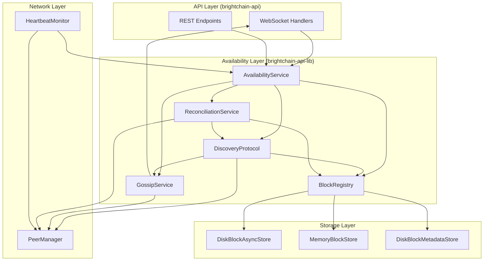

# Design Document: Block Availability and Discovery Protocol

## Overview

This design document describes the architecture and implementation of the Block Availability and Discovery Protocol for BrightChain. The system enables nodes to:

1. **Track Block Availability** - Know whether blocks are stored locally, remotely, cached, orphaned, or in an unknown state
2. **Discover Blocks** - Find blocks across the network using Bloom filters and gossip-based announcements
3. **Handle Network Partitions** - Continue operating when disconnected and reconcile state upon reconnection
4. **Maintain Location Metadata** - Track which nodes hold copies of each block

The design extends the existing IBlockStore and IBlockMetadata interfaces without breaking changes, wrapping existing implementations with availability-aware functionality.

**Library Organization:**
- **brightchain-lib**: Core interfaces (IAvailabilityService, IBlockRegistry, IDiscoveryProtocol), enumerations (AvailabilityState), extended IBlockMetadata
- **brightchain-api-lib**: Implementations (AvailabilityService, BlockRegistry, DiscoveryProtocol, GossipService)
- **brightchain-api**: WebSocket event handlers for gossip and discovery

## Architecture



## Components and Interfaces

### 1. Availability State Enumeration

Defines the possible availability states for blocks.

```typescript
/**
 * AvailabilityState enumeration
 * Located in brightchain-lib/src/lib/enumerations/availabilityState.ts
 */
export enum AvailabilityState {
  /**
   * Block is stored locally as the authoritative copy
   */
  Local = 'local',
  
  /**
   * Block exists on remote nodes but not locally
   */
  Remote = 'remote',
  
  /**
   * Block is cached locally but authoritative copy is remote
   */
  Cached = 'cached',
  
  /**
   * Block's source nodes are unreachable
   */
  Orphaned = 'orphaned',
  
  /**
   * Block location has not been determined
   */
  Unknown = 'unknown'
}

/**
 * Check if a block is accessible locally
 */
export function isLocallyAccessible(state: AvailabilityState): boolean {
  return state === AvailabilityState.Local || state === AvailabilityState.Cached;
}

/**
 * Check if a block requires network access
 */
export function requiresNetwork(state: AvailabilityState): boolean {
  return state === AvailabilityState.Remote || state === AvailabilityState.Unknown;
}
```

### 2. Extended Block Metadata

Extends IBlockMetadata with location tracking.

```typescript
/**
 * Location record for a block
 */
export interface ILocationRecord {
  nodeId: string;
  lastSeen: Date;
  isAuthoritative: boolean;
  latencyMs?: number;
}

/**
 * Extended block metadata with availability information
 * Extends existing IBlockMetadata from blockMetadata.ts
 */
export interface IBlockMetadataWithLocation extends IBlockMetadata {
  /**
   * Current availability state of the block
   */
  availabilityState: AvailabilityState;
  
  /**
   * Nodes known to hold this block
   */
  locationRecords: ILocationRecord[];
  
  /**
   * When the location information was last updated
   */
  locationUpdatedAt: Date;
}

/**
 * Create default location metadata for a new local block
 */
export function createDefaultLocationMetadata(
  localNodeId: string
): Pick<IBlockMetadataWithLocation, 'availabilityState' | 'locationRecords' | 'locationUpdatedAt'> {
  return {
    availabilityState: AvailabilityState.Local,
    locationRecords: [{
      nodeId: localNodeId,
      lastSeen: new Date(),
      isAuthoritative: true
    }],
    locationUpdatedAt: new Date()
  };
}
```

### 3. Block Registry Interface

Maintains a fast local index of blocks.

```typescript
/**
 * IBlockRegistry interface
 * Located in brightchain-lib/src/lib/interfaces/availability/blockRegistry.ts
 */
export interface IBlockRegistry {
  /**
   * Check if a block exists locally (O(1) lookup)
   */
  hasLocal(blockId: string): boolean;
  
  /**
   * Add a block to the local registry
   */
  addLocal(blockId: string): void;
  
  /**
   * Remove a block from the local registry
   */
  removeLocal(blockId: string): void;
  
  /**
   * Get count of local blocks
   */
  getLocalCount(): number;
  
  /**
   * Get all local block IDs (for full sync)
   */
  getLocalBlockIds(): string[];
  
  /**
   * Export a Bloom filter representation
   */
  exportBloomFilter(): BloomFilter;
  
  /**
   * Export a complete manifest
   */
  exportManifest(): BlockManifest;
  
  /**
   * Rebuild registry from storage
   */
  rebuild(): Promise<void>;
}

/**
 * Bloom filter for efficient block existence queries
 */
export interface BloomFilter {
  /**
   * Serialized filter data
   */
  data: Uint8Array;
  
  /**
   * Number of hash functions used
   */
  hashCount: number;
  
  /**
   * Size of the filter in bits
   */
  bitCount: number;
  
  /**
   * Number of items in the filter
   */
  itemCount: number;
  
  /**
   * Check if an item might exist
   */
  mightContain(blockId: string): boolean;
}

/**
 * Complete block manifest for synchronization
 */
export interface BlockManifest {
  nodeId: string;
  blockIds: string[];
  generatedAt: Date;
  checksum: string;
}
```

### 4. Discovery Protocol Interface

Handles finding blocks across the network.

```typescript
/**
 * IDiscoveryProtocol interface
 * Located in brightchain-lib/src/lib/interfaces/availability/discoveryProtocol.ts
 */
export interface IDiscoveryProtocol {
  /**
   * Discover locations for a block
   */
  discoverBlock(blockId: string): Promise<DiscoveryResult>;
  
  /**
   * Query a specific peer for a block
   */
  queryPeer(peerId: string, blockId: string): Promise<PeerQueryResult>;
  
  /**
   * Get cached discovery results
   */
  getCachedLocations(blockId: string): ILocationRecord[] | null;
  
  /**
   * Clear discovery cache for a block
   */
  clearCache(blockId: string): void;
  
  /**
   * Get Bloom filter from a peer
   */
  getPeerBloomFilter(peerId: string): Promise<BloomFilter>;
}

/**
 * Result of a block discovery operation
 */
export interface DiscoveryResult {
  blockId: string;
  found: boolean;
  locations: ILocationRecord[];
  queriedPeers: number;
  duration: number;
}

/**
 * Result of querying a single peer
 */
export interface PeerQueryResult {
  peerId: string;
  hasBlock: boolean;
  latencyMs: number;
  error?: string;
}

/**
 * Discovery protocol configuration
 */
export interface DiscoveryConfig {
  /**
   * Timeout for discovery queries (ms)
   */
  queryTimeoutMs: number;
  
  /**
   * Maximum concurrent queries
   */
  maxConcurrentQueries: number;
  
  /**
   * Cache TTL for discovery results (ms)
   */
  cacheTtlMs: number;
  
  /**
   * Bloom filter false positive rate target
   */
  bloomFilterFalsePositiveRate: number;
  
  /**
   * Number of hash functions for Bloom filter
   */
  bloomFilterHashCount: number;
}

export const DEFAULT_DISCOVERY_CONFIG: DiscoveryConfig = {
  queryTimeoutMs: 5000,
  maxConcurrentQueries: 10,
  cacheTtlMs: 60000,
  bloomFilterFalsePositiveRate: 0.01,
  bloomFilterHashCount: 7
};
```

### 5. Gossip Service Interface

Handles block announcements across the network.

```typescript
/**
 * IGossipService interface
 * Located in brightchain-lib/src/lib/interfaces/availability/gossipService.ts
 */
export interface IGossipService {
  /**
   * Announce a new block to the network
   */
  announceBlock(blockId: string): Promise<void>;
  
  /**
   * Announce block removal to the network
   */
  announceRemoval(blockId: string): Promise<void>;
  
  /**
   * Handle incoming block announcement
   */
  handleAnnouncement(announcement: BlockAnnouncement): Promise<void>;
  
  /**
   * Subscribe to announcements
   */
  onAnnouncement(handler: (announcement: BlockAnnouncement) => void): void;
  
  /**
   * Get pending announcements (for batching)
   */
  getPendingAnnouncements(): BlockAnnouncement[];
  
  /**
   * Flush pending announcements
   */
  flushAnnouncements(): Promise<void>;
}

/**
 * Block announcement message
 */
export interface BlockAnnouncement {
  type: 'add' | 'remove';
  blockId: string;
  nodeId: string;
  timestamp: Date;
  ttl: number;
}

/**
 * Gossip configuration
 */
export interface GossipConfig {
  /**
   * Number of peers to forward announcements to
   */
  fanout: number;
  
  /**
   * Initial TTL for announcements
   */
  defaultTtl: number;
  
  /**
   * Batch interval for announcements (ms)
   */
  batchIntervalMs: number;
  
  /**
   * Maximum announcements per batch
   */
  maxBatchSize: number;
}

export const DEFAULT_GOSSIP_CONFIG: GossipConfig = {
  fanout: 3,
  defaultTtl: 3,
  batchIntervalMs: 1000,
  maxBatchSize: 100
};
```

### 6. Availability Service Interface

Main service coordinating availability tracking.

```typescript
/**
 * IAvailabilityService interface
 * Located in brightchain-lib/src/lib/interfaces/availability/availabilityService.ts
 */
export interface IAvailabilityService {
  // === State Queries ===
  
  /**
   * Get availability state for a block
   */
  getAvailabilityState(blockId: string): Promise<AvailabilityState>;
  
  /**
   * Get all locations for a block
   */
  getBlockLocations(blockId: string): Promise<ILocationRecord[]>;
  
  /**
   * List blocks by availability state
   */
  listBlocksByState(state: AvailabilityState): Promise<string[]>;
  
  /**
   * Get availability statistics
   */
  getStatistics(): Promise<AvailabilityStatistics>;
  
  // === Location Updates ===
  
  /**
   * Update location for a block
   */
  updateLocation(blockId: string, location: ILocationRecord): Promise<void>;
  
  /**
   * Remove location for a block
   */
  removeLocation(blockId: string, nodeId: string): Promise<void>;
  
  // === Partition Handling ===
  
  /**
   * Check if in partition mode
   */
  isInPartitionMode(): boolean;
  
  /**
   * Enter partition mode
   */
  enterPartitionMode(): void;
  
  /**
   * Exit partition mode and start reconciliation
   */
  exitPartitionMode(): Promise<ReconciliationResult>;
  
  // === Events ===
  
  /**
   * Subscribe to availability events
   */
  onEvent(handler: (event: AvailabilityEvent) => void): void;
  
  // === Wrapped Block Store ===
  
  /**
   * Get the wrapped block store with availability tracking
   */
  getBlockStore(): IBlockStore;
}

/**
 * Availability statistics
 */
export interface AvailabilityStatistics {
  localCount: number;
  remoteCount: number;
  cachedCount: number;
  orphanedCount: number;
  unknownCount: number;
  totalKnownLocations: number;
  averageLocationsPerBlock: number;
}

/**
 * Availability event types
 */
export type AvailabilityEvent = 
  | { type: 'state_changed'; blockId: string; oldState: AvailabilityState; newState: AvailabilityState }
  | { type: 'location_added'; blockId: string; location: ILocationRecord }
  | { type: 'location_removed'; blockId: string; nodeId: string }
  | { type: 'partition_entered'; timestamp: Date; disconnectedPeers: string[] }
  | { type: 'partition_exited'; timestamp: Date; reconnectedPeers: string[] }
  | { type: 'reconciliation_started'; timestamp: Date }
  | { type: 'reconciliation_completed'; timestamp: Date; result: ReconciliationResult };
```

### 7. Reconciliation Service Interface

Handles state synchronization after reconnection.

```typescript
/**
 * IReconciliationService interface
 * Located in brightchain-lib/src/lib/interfaces/availability/reconciliationService.ts
 */
export interface IReconciliationService {
  /**
   * Start reconciliation with reconnected peers
   */
  reconcile(peerIds: string[]): Promise<ReconciliationResult>;
  
  /**
   * Get sync vector for a peer
   */
  getSyncVector(peerId: string): SyncVectorEntry | null;
  
  /**
   * Update sync vector after sync
   */
  updateSyncVector(peerId: string, timestamp: Date): void;
  
  /**
   * Get pending sync queue
   */
  getPendingSyncQueue(): PendingSyncItem[];
  
  /**
   * Add item to pending sync queue
   */
  addToPendingSyncQueue(item: PendingSyncItem): void;
  
  /**
   * Process pending sync queue
   */
  processPendingSyncQueue(): Promise<void>;
}

/**
 * Sync vector entry for a peer
 */
export interface SyncVectorEntry {
  peerId: string;
  lastSyncTimestamp: Date;
  lastManifestChecksum: string;
}

/**
 * Item in the pending sync queue
 */
export interface PendingSyncItem {
  type: 'store' | 'delete' | 'replicate';
  blockId: string;
  timestamp: Date;
  data?: Uint8Array;
}

/**
 * Result of reconciliation
 */
export interface ReconciliationResult {
  success: boolean;
  peersReconciled: number;
  blocksDiscovered: number;
  blocksUpdated: number;
  orphansResolved: number;
  conflictsResolved: number;
  errors: ReconciliationError[];
  duration: number;
}

/**
 * Reconciliation error
 */
export interface ReconciliationError {
  peerId?: string;
  blockId?: string;
  error: string;
}
```

### 8. Heartbeat Monitor

Monitors peer connectivity for partition detection.

```typescript
/**
 * IHeartbeatMonitor interface
 * Located in brightchain-lib/src/lib/interfaces/availability/heartbeatMonitor.ts
 */
export interface IHeartbeatMonitor {
  /**
   * Start monitoring
   */
  start(): void;
  
  /**
   * Stop monitoring
   */
  stop(): void;
  
  /**
   * Check if a peer is reachable
   */
  isPeerReachable(peerId: string): boolean;
  
  /**
   * Get all reachable peers
   */
  getReachablePeers(): string[];
  
  /**
   * Get all unreachable peers
   */
  getUnreachablePeers(): string[];
  
  /**
   * Subscribe to connectivity changes
   */
  onConnectivityChange(handler: (event: ConnectivityEvent) => void): void;
}

/**
 * Connectivity event
 */
export interface ConnectivityEvent {
  type: 'peer_connected' | 'peer_disconnected' | 'all_disconnected' | 'some_reconnected';
  peerId?: string;
  timestamp: Date;
}

/**
 * Heartbeat configuration
 */
export interface HeartbeatConfig {
  /**
   * Interval between heartbeats (ms)
   */
  intervalMs: number;
  
  /**
   * Timeout for heartbeat response (ms)
   */
  timeoutMs: number;
  
  /**
   * Number of missed heartbeats before marking unreachable
   */
  missedThreshold: number;
}

export const DEFAULT_HEARTBEAT_CONFIG: HeartbeatConfig = {
  intervalMs: 5000,
  timeoutMs: 2000,
  missedThreshold: 3
};
```

### 9. Availability-Aware Block Store Wrapper

Wraps existing IBlockStore with availability tracking.

```typescript
/**
 * AvailabilityAwareBlockStore
 * Located in brightchain-api-lib/src/lib/stores/availabilityAwareBlockStore.ts
 * 
 * Wraps an existing IBlockStore to add availability tracking
 */
export class AvailabilityAwareBlockStore implements IBlockStore {
  constructor(
    private readonly innerStore: IBlockStore,
    private readonly registry: IBlockRegistry,
    private readonly availabilityService: IAvailabilityService,
    private readonly gossipService: IGossipService,
    private readonly localNodeId: string
  ) {}
  
  // Delegate all IBlockStore methods to innerStore
  // Add hooks for availability tracking
  
  async setData(block: RawDataBlock, options?: BlockStoreOptions): Promise<void> {
    await this.innerStore.setData(block, options);
    
    // Update registry
    const blockId = block.idChecksum.toString('hex');
    this.registry.addLocal(blockId);
    
    // Update availability metadata
    await this.availabilityService.updateLocation(blockId, {
      nodeId: this.localNodeId,
      lastSeen: new Date(),
      isAuthoritative: true
    });
    
    // Announce to network
    await this.gossipService.announceBlock(blockId);
  }
  
  async deleteData(key: ChecksumUint8Array): Promise<void> {
    const blockId = typeof key === 'string' ? key : key.toString('hex');
    
    await this.innerStore.deleteData(key);
    
    // Update registry
    this.registry.removeLocal(blockId);
    
    // Remove local location
    await this.availabilityService.removeLocation(blockId, this.localNodeId);
    
    // Announce removal
    await this.gossipService.announceRemoval(blockId);
  }
  
  // ... other delegated methods with appropriate hooks
}
```

## Data Models

### Sync Vector Storage

```typescript
/**
 * Stored as JSON file
 * Path: {dataPath}/sync-vectors.json
 */
interface SyncVectorFile {
  version: 1;
  localNodeId: string;
  vectors: Record<string, {
    lastSyncTimestamp: string; // ISO date
    lastManifestChecksum: string;
  }>;
  updatedAt: string; // ISO date
}
```

### Pending Sync Queue Storage

```typescript
/**
 * Stored as JSON file
 * Path: {dataPath}/pending-sync-queue.json
 */
interface PendingSyncQueueFile {
  version: 1;
  items: Array<{
    type: 'store' | 'delete' | 'replicate';
    blockId: string;
    timestamp: string; // ISO date
    dataPath?: string; // Path to data file if type is 'store'
  }>;
  updatedAt: string; // ISO date
}
```

### Block Location Cache

```typescript
/**
 * In-memory cache with optional persistence
 * Path: {dataPath}/location-cache.json
 */
interface LocationCacheFile {
  version: 1;
  entries: Record<string, {
    locations: Array<{
      nodeId: string;
      lastSeen: string; // ISO date
      isAuthoritative: boolean;
      latencyMs?: number;
    }>;
    cachedAt: string; // ISO date
  }>;
}
```

### WebSocket Message Types

```typescript
/**
 * Discovery protocol messages
 */
enum DiscoveryMessageType {
  BLOOM_FILTER_REQUEST = 'discovery:bloom_filter_request',
  BLOOM_FILTER_RESPONSE = 'discovery:bloom_filter_response',
  BLOCK_QUERY = 'discovery:block_query',
  BLOCK_QUERY_RESPONSE = 'discovery:block_query_response',
  MANIFEST_REQUEST = 'discovery:manifest_request',
  MANIFEST_RESPONSE = 'discovery:manifest_response'
}

/**
 * Gossip protocol messages
 */
enum GossipMessageType {
  BLOCK_ANNOUNCEMENT = 'gossip:block_announcement',
  BLOCK_REMOVAL = 'gossip:block_removal',
  ANNOUNCEMENT_BATCH = 'gossip:announcement_batch'
}

/**
 * Heartbeat messages
 */
enum HeartbeatMessageType {
  PING = 'heartbeat:ping',
  PONG = 'heartbeat:pong'
}
```


## Correctness Properties

*A property is a characteristic or behavior that should hold true across all valid executions of a system—essentially, a formal statement about what the system should do. Properties serve as the bridge between human-readable specifications and machine-verifiable correctness guarantees.*

### Property 1: Block Storage Side Effects

*For any* block stored locally, the system SHALL:
- Mark the block's availability state as Local
- Add the local node ID to the block's location records
- Add the block ID to the local registry
- Announce the block to connected peers via gossip

**Validates: Requirements 1.2, 2.3, 3.2, 6.1, 12.2**

### Property 2: Block Deletion Side Effects

*For any* block deleted locally, the system SHALL:
- Remove the block ID from the local registry
- Remove the local node from the block's location records
- Announce the removal to connected peers via gossip

**Validates: Requirements 3.3, 6.5, 12.3**

### Property 3: Availability State Transitions

*For any* block, the availability state SHALL transition correctly:
- When stored locally as authoritative → Local
- When discovered only on remote nodes → Remote
- When cached locally with remote authoritative → Cached
- When all source nodes become unreachable → Orphaned
- When location is undetermined → Unknown

**Validates: Requirements 1.2, 1.3, 1.4, 1.5, 1.6**

### Property 4: Orphan State Transition on Partition

*For any* block in Remote state, when all nodes holding that block become unreachable, the block's state SHALL transition to Orphaned.

**Validates: Requirements 1.5, 7.3**

### Property 5: Bloom Filter Query Optimization

*For any* block discovery query:
- The system SHALL first check the peer's Bloom filter
- If the Bloom filter returns false (definitely not present), the system SHALL skip that peer
- If the Bloom filter returns true (possibly present), the system SHALL make a direct query
- The Bloom filter SHALL have no false negatives (if block exists, filter returns true)

**Validates: Requirements 4.3, 4.4, 4.5, 5.2, 5.3**

### Property 6: Bloom Filter Accuracy

*For any* set of N blocks in the registry, the Bloom filter SHALL:
- Return true for all N blocks (no false negatives)
- Have a false positive rate of 1% or less for blocks not in the registry

**Validates: Requirements 4.1, 4.6**

### Property 7: Location Metadata Update on Discovery

*For any* block discovered on a remote node (via gossip announcement or direct query), the system SHALL add that node to the block's location records with the current timestamp.

**Validates: Requirements 2.4, 5.4, 6.2, 9.3**

### Property 8: Location Metadata Serialization Round-Trip

*For any* valid IBlockMetadataWithLocation object, serializing to JSON and then deserializing SHALL produce an equivalent object with all location records preserved.

**Validates: Requirements 2.6**

### Property 9: Registry Consistency with Storage

*For any* sequence of store and delete operations, the registry SHALL contain exactly the set of block IDs currently stored locally.

**Validates: Requirements 3.1, 3.2, 3.3**

### Property 10: Manifest Export Correctness

*For any* registry state, the exported manifest SHALL contain exactly all block IDs in the registry, and the manifest checksum SHALL change if and only if the block set changes.

**Validates: Requirements 3.7**

### Property 11: Discovery Result Caching

*For any* successful block discovery, subsequent queries for the same block within the cache TTL SHALL return cached results without making network queries.

**Validates: Requirements 5.8**

### Property 12: Gossip TTL Decrement

*For any* gossip announcement with TTL > 0, when forwarded to peers, the TTL SHALL be decremented by 1. Announcements with TTL = 0 SHALL NOT be forwarded.

**Validates: Requirements 6.4**

### Property 13: Gossip Batching

*For any* sequence of block announcements within the batch interval, the system SHALL combine them into a single batch message up to the maximum batch size.

**Validates: Requirements 6.6**

### Property 14: Partition Mode Entry

*For any* node, when all known peers become unreachable (missed heartbeat threshold exceeded), the system SHALL enter Partition Mode and emit a partition_entered event.

**Validates: Requirements 7.2, 7.7, 14.4**

### Property 15: Partition Mode Exit

*For any* node in Partition Mode, when at least one peer becomes reachable, the system SHALL exit Partition Mode and initiate reconciliation.

**Validates: Requirements 7.5, 9.1**

### Property 16: Partition Mode Local Operations

*For any* node in Partition Mode:
- Reading and writing Local blocks SHALL succeed
- Reading Cached blocks SHALL succeed
- Requests for Remote blocks SHALL fail with a partition error

**Validates: Requirements 8.1, 8.2, 8.4, 8.6**

### Property 17: Pending Sync Queue

*For any* local change (store, delete, replicate) made during Partition Mode, the change SHALL be added to the pending sync queue with a timestamp.

**Validates: Requirements 8.3, 8.5**

### Property 18: Reconciliation Manifest Exchange

*For any* reconciliation process, the system SHALL exchange manifests with all reconnected peers and update location metadata for newly discovered blocks.

**Validates: Requirements 9.2, 9.3**

### Property 19: Reconciliation Orphan Resolution

*For any* block in Orphaned state, during reconciliation, if a source node is found in the exchanged manifests, the block's state SHALL transition from Orphaned to Remote.

**Validates: Requirements 9.5**

### Property 20: Reconciliation Conflict Resolution

*For any* conflicting block state during reconciliation, the system SHALL resolve using last-write-wins based on vector timestamps.

**Validates: Requirements 9.6**

### Property 21: Sync Vector Persistence Round-Trip

*For any* valid Sync Vector, persisting to disk and then loading SHALL produce an equivalent Sync Vector with all peer timestamps preserved.

**Validates: Requirements 10.5, 10.6**

### Property 22: Delta Synchronization

*For any* sync operation with a peer, the system SHALL request only changes since the last sync timestamp recorded in the Sync Vector for that peer.

**Validates: Requirements 10.2**

### Property 23: Sync Vector Update

*For any* successful sync with a peer, the Sync Vector entry for that peer SHALL be updated to the current timestamp.

**Validates: Requirements 10.3**

### Property 24: Block State Query Consistency

*For any* availability state S, listing blocks by state S SHALL return exactly the set of blocks currently in state S.

**Validates: Requirements 11.3**

### Property 25: Staleness Indication

*For any* location query where the location data is older than the configured staleness threshold, the response SHALL include a staleness indicator.

**Validates: Requirements 11.6**

### Property 26: Wrapper Error Propagation

*For any* error from the underlying IBlockStore, the AvailabilityAwareBlockStore wrapper SHALL propagate the error without modification.

**Validates: Requirements 12.6**

### Property 27: Configuration Validation

*For any* invalid configuration (negative timeouts, zero fanout, etc.), the system SHALL reject the configuration with a descriptive error message.

**Validates: Requirements 13.6**

### Property 28: Event Emission Completeness

*For any* state change (availability state change, location added/removed, partition enter/exit, reconciliation start/complete), the system SHALL emit the corresponding event.

**Validates: Requirements 14.1, 14.2, 14.3, 14.4, 14.5**

### Property 29: Event Filtering

*For any* event subscription with filters, the subscriber SHALL receive only events matching the specified event types and block ID patterns.

**Validates: Requirements 14.6**

### Property 30: Metrics Accuracy

*For any* point in time, the availability statistics SHALL accurately reflect:
- Count of blocks in each availability state
- Total known locations
- Average locations per block

**Validates: Requirements 15.1**

### Property 31: Discovery Latency Preference

*For any* block with multiple known locations, when retrieving the block, the system SHALL prefer nodes with lower recorded latency.

**Validates: Requirements 5.5**

## Error Handling

### Availability Service Errors

| Error Type | Error Code | Description |
|------------|------------|-------------|
| Block not found | BLOCK_NOT_FOUND | The requested block ID does not exist locally or remotely |
| Block unavailable | BLOCK_UNAVAILABLE | Block exists but is not accessible (orphaned or remote during partition) |
| Partition mode | PARTITION_MODE_ERROR | Operation requires network but node is in partition mode |
| Discovery timeout | DISCOVERY_TIMEOUT | Block discovery query timed out |
| Discovery failed | DISCOVERY_FAILED | Block discovery failed after querying all peers |

### Registry Errors

| Error Type | Error Code | Description |
|------------|------------|-------------|
| Registry rebuild failed | REGISTRY_REBUILD_FAILED | Failed to rebuild registry from disk storage |
| Bloom filter error | BLOOM_FILTER_ERROR | Error generating or querying Bloom filter |
| Manifest export failed | MANIFEST_EXPORT_FAILED | Failed to export block manifest |

### Gossip Errors

| Error Type | Error Code | Description |
|------------|------------|-------------|
| Announcement failed | ANNOUNCEMENT_FAILED | Failed to announce block to peers |
| Invalid announcement | INVALID_ANNOUNCEMENT | Received malformed announcement message |

### Reconciliation Errors

| Error Type | Error Code | Description |
|------------|------------|-------------|
| Reconciliation failed | RECONCILIATION_FAILED | Reconciliation process failed |
| Manifest exchange failed | MANIFEST_EXCHANGE_FAILED | Failed to exchange manifests with peer |
| Sync vector corrupted | SYNC_VECTOR_CORRUPTED | Sync vector file is corrupted |
| Conflict resolution failed | CONFLICT_RESOLUTION_FAILED | Failed to resolve conflicting block state |

### Configuration Errors

| Error Type | Error Code | Description |
|------------|------------|-------------|
| Invalid config | INVALID_CONFIG | Configuration validation failed |
| Invalid timeout | INVALID_TIMEOUT | Timeout value must be positive |
| Invalid fanout | INVALID_FANOUT | Fanout must be at least 1 |
| Invalid bloom filter config | INVALID_BLOOM_CONFIG | Bloom filter configuration is invalid |

## Testing Strategy

### Property-Based Testing

Property-based tests will use **fast-check** for TypeScript to validate universal properties across many generated inputs.

**Configuration:**
- Minimum 100 iterations per property test
- Each test tagged with: **Feature: block-availability-discovery, Property {number}: {property_text}**

**Key Property Tests:**

1. **Block Storage Side Effects** (Property 1)
   - Generate random blocks
   - Store each block
   - Verify all side effects occur atomically

2. **Bloom Filter Accuracy** (Property 6)
   - Generate random sets of block IDs
   - Build Bloom filter
   - Verify no false negatives
   - Measure false positive rate

3. **Serialization Round-Trips** (Properties 8, 21)
   - Generate random metadata/sync vectors
   - Serialize and deserialize
   - Verify equivalence

4. **Partition Mode Operations** (Property 16)
   - Generate random block operations
   - Simulate partition mode
   - Verify correct accept/reject behavior

5. **Reconciliation Orphan Resolution** (Property 19)
   - Generate random orphaned blocks
   - Simulate reconnection with manifests
   - Verify state transitions

### Unit Tests

Unit tests complement property tests for specific examples and edge cases:

1. **Availability State Enumeration**
   - Verify all five states exist
   - Test helper functions (isLocallyAccessible, requiresNetwork)

2. **Configuration Validation**
   - Test rejection of invalid configurations
   - Test acceptance of valid configurations

3. **Event Emission**
   - Test specific event payloads
   - Test event filtering

4. **Error Handling**
   - Test specific error conditions
   - Verify error codes and messages

### Integration Tests

1. **Multi-Node Discovery**
   - Set up multiple nodes
   - Store blocks on different nodes
   - Verify discovery across network

2. **Partition and Reconciliation**
   - Simulate network partition
   - Make changes during partition
   - Reconnect and verify reconciliation

3. **Gossip Propagation**
   - Announce blocks
   - Verify propagation to expected peers
   - Verify TTL decrement

### Test File Organization

```
brightchain-lib/src/lib/
├── availability/
│   ├── availabilityState.spec.ts
│   ├── blockRegistry.spec.ts
│   ├── blockRegistry.property.spec.ts
│   └── locationMetadata.property.spec.ts

brightchain-api-lib/src/lib/
├── services/
│   ├── availabilityService.spec.ts
│   ├── availabilityService.property.spec.ts
│   ├── discoveryProtocol.spec.ts
│   ├── discoveryProtocol.property.spec.ts
│   ├── gossipService.spec.ts
│   ├── gossipService.property.spec.ts
│   ├── reconciliationService.spec.ts
│   └── reconciliationService.property.spec.ts
├── stores/
│   ├── availabilityAwareBlockStore.spec.ts
│   └── availabilityAwareBlockStore.property.spec.ts
```
