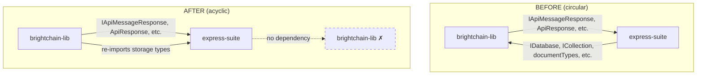

# Design Document: Break Circular Dependency

## Overview

This design describes how to eliminate the circular dependency between `@brightchain/brightchain-lib` and `@digitaldefiance/node-express-suite` by moving generic storage abstraction interfaces (IDatabase, ICollection, IClientSession, IFailableResult, IDatabaseLifecycleHooks, and ~30 document types) from brightchain-lib into express-suite.

After the migration, the dependency graph becomes one-directional:
- `brightchain-lib` → `express-suite` (imports API response types AND re-imports storage types)
- `express-suite` → ~~`brightchain-lib`~~ (no longer needed)

Brightchain-lib will provide backward-compatible re-exports so that existing consumers are unaffected.

## Architecture



### Migration Strategy

The migration follows a three-phase approach:

1. **Copy types into express-suite**: Create new source files in express-suite that define the storage abstraction types (copied from brightchain-lib originals).
2. **Update express-suite imports**: Change all express-suite internal files to import from local paths. Remove `@brightchain/brightchain-lib` from express-suite's `package.json`.
3. **Update brightchain-lib to re-export**: Replace the original type definitions in brightchain-lib with re-exports from `@digitaldefiance/node-express-suite`. Update the barrel exports.

### What Moves vs. What Stays

**Moves to express-suite:**
- `documentTypes.ts` — all ~30 generic document/query/result types
- `clientSession.ts` — `IClientSession`
- `collection.ts` — `ICollection<T>`
- `database.ts` — `IDatabase`
- `databaseLifecycleHooks.ts` — `IDatabaseLifecycleHooks<T>`
- `failableResult.ts` — `IFailableResult<T>`

**Stays in brightchain-lib:**
- `blockMetadata.ts`, `blockMetadataStore.ts`, `blockStore.ts`
- `cblIndex.ts`, `cblStore.ts`, `cblWhitening.ts`
- `encryptedPool.ts`, `headRegistry.ts`
- `pooledBlockStore.ts`, `readConcernBlockStore.ts`, `universalBlockStore.ts`

These block-store types do NOT import from the files being moved, so they are unaffected.

## Components and Interfaces

### New Files in Express Suite

The types will be placed under a new `express-suite/packages/digitaldefiance-node-express-suite/src/interfaces/storage/` directory:

```
src/interfaces/storage/
├── index.ts              # barrel export for all storage types
├── document-types.ts     # all ~30 document/query/result types (from documentTypes.ts)
├── client-session.ts     # IClientSession interface
├── collection.ts         # ICollection<T> interface
├── database.ts           # IDatabase interface
└── database-lifecycle-hooks.ts  # IDatabaseLifecycleHooks<T> interface
```

The existing `src/interfaces/failable-result.ts` will be updated to define `IFailableResult` locally instead of re-exporting from brightchain-lib.

The `src/interfaces/index.ts` barrel will add `export * from './storage'` to expose all storage types.

### Modified Files in Express Suite

| File | Change |
|------|--------|
| `src/services/mongoose-collection.ts` | Change `from '@brightchain/brightchain-lib'` → `from '../interfaces/storage'` |
| `src/services/mongoose-database.ts` | Change `from '@brightchain/brightchain-lib'` → `from '../interfaces/storage'` |
| `src/services/mongoose-session-adapter.ts` | Change `from '@brightchain/brightchain-lib'` → `from '../interfaces/storage'` |
| `src/application-base.ts` | Change `from '@brightchain/brightchain-lib'` → `from './interfaces/storage'` |
| `src/utils.ts` | Change `from '@brightchain/brightchain-lib'` → `from './interfaces/storage'` |
| `src/interfaces/failable-result.ts` | Define IFailableResult locally |
| `package.json` | Remove `@brightchain/brightchain-lib` from dependencies |

### Modified Files in Brightchain Lib

| File | Change |
|------|--------|
| `src/lib/interfaces/storage/documentTypes.ts` | Replace definitions with re-exports from `@digitaldefiance/node-express-suite` |
| `src/lib/interfaces/storage/clientSession.ts` | Replace definition with re-export |
| `src/lib/interfaces/storage/collection.ts` | Replace definition with re-export |
| `src/lib/interfaces/storage/database.ts` | Replace definition with re-export |
| `src/lib/interfaces/storage/databaseLifecycleHooks.ts` | Replace definition with re-export |
| `src/lib/interfaces/failableResult.ts` | Replace definition with re-export |
| `src/lib/interfaces/storage/index.ts` | No change needed (already re-exports from the above files) |

### Interface Definitions (Unchanged)

The interfaces themselves are not modified — they are copied verbatim. Key interfaces:

```typescript
// IClientSession — storage-agnostic session for transaction support
interface IClientSession {
  readonly id: string;
  readonly inTransaction: boolean;
  startTransaction(): void;
  commitTransaction(): Promise<void>;
  abortTransaction(): Promise<void>;
  endSession(): void;
}

// IDatabase — storage-agnostic database for collection access
interface IDatabase {
  collection<T extends BsonDocument>(name: string, options?: CollectionOptions): ICollection<T>;
  startSession(): IClientSession;
  withTransaction<R>(fn: (session: IClientSession) => Promise<R>): Promise<R>;
  listCollections(): string[];
  dropCollection(name: string): Promise<boolean>;
  connect(uri?: string): Promise<void>;
  disconnect(): Promise<void>;
  isConnected(): boolean;
}

// ICollection<T> — storage-agnostic collection for CRUD, query, index, etc.
// (full interface with ~30 methods, unchanged)

// IFailableResult<T> — generic success/failure result
interface IFailableResult<T> {
  success: boolean;
  data?: T;
  message?: string;
  error?: string | Error;
}
```

## Data Models

No new data models are introduced. The existing type definitions are relocated without modification. The key data types being moved are:

- **Document types**: `BsonDocument`, `DocumentId`, `FilterQuery<T>`, `UpdateQuery<T>`, `FindOptions<T>`, `SortSpec<T>`, `ProjectionSpec<T>`, `IndexSpec`, `IndexOptions`, `WriteOptions`, `UpdateOptions`, `CollectionOptions`
- **Result types**: `InsertOneResult`, `InsertManyResult`, `UpdateResult`, `DeleteResult`, `ReplaceResult`, `BulkWriteResult`
- **Bulk/aggregation types**: `BulkWriteOperation<T>`, `BulkWriteOptions`, `AggregationStage`
- **Change stream types**: `ChangeEvent<T>`, `ChangeEventType`, `ChangeListener<T>`
- **Schema validation types**: `CollectionSchema`, `FieldSchema`, `CollectionSchemaFieldType`, `ValidationFieldError`
- **Concern types**: `WriteConcern`, `ReadPreference`
- **Cursor types**: `CursorSession`
- **Text search types**: `TextIndexOptions`
- **Operator types**: `FilterOperator<V>`, `LogicalOperators<T>`, `UpdateOperators<T>`
- **Alias**: `ClientSession` (alias for IClientSession)


## Correctness Properties

*A property is a characteristic or behavior that should hold true across all valid executions of a system — essentially, a formal statement about what the system should do. Properties serve as the bridge between human-readable specifications and machine-verifiable correctness guarantees.*

### Property 1: No express-suite imports from brightchain-lib

*For any* TypeScript source file in `express-suite/packages/digitaldefiance-node-express-suite/src/`, no import statement should reference `@brightchain/brightchain-lib`.

**Validates: Requirements 2.1, 2.3**

### Property 2: Backward-compatible re-exports preserve all storage type names

*For any* type name in the set of Storage_Abstraction_Types (IDatabase, ICollection, IClientSession, IDatabaseLifecycleHooks, IFailableResult, and all ~30 documentTypes names), importing that name from `@brightchain/brightchain-lib` should yield a defined, usable type.

**Validates: Requirements 3.1, 3.2, 1.3, 1.4**

### Property 3: Type structural identity across packages

*For any* storage type name, a value typed as the brightchain-lib re-export should be assignable to a variable typed as the express-suite definition, and vice versa. This ensures the re-exports are true aliases, not accidentally divergent copies.

**Validates: Requirements 3.3**

## Error Handling

This migration is a pure type-relocation refactor. No new runtime error handling is introduced. The key risks and mitigations:

| Risk | Mitigation |
|------|------------|
| Missing re-export causes compile error in downstream consumer | Brightchain-lib's storage barrel re-exports every type; TypeScript compilation of brightchain-lib validates completeness |
| Circular dependency not fully broken (stale import left behind) | Property 1 validates zero imports from brightchain-lib in express-suite source |
| Type divergence after copy (types accidentally modified) | Property 3 validates structural identity via compile-time assignability |
| Block-store types break due to missing dependency | Block-store types do not import from the moved files (verified during analysis); compilation validates |
| express-suite package.json still lists brightchain-lib | Verified as an example test during task execution |

## Testing Strategy

### Dual Testing Approach

This migration is primarily validated through compilation and structural checks rather than runtime behavior. The testing strategy uses:

- **Unit tests (examples)**: Verify specific structural facts — package.json contents, file existence, build success, test suite pass
- **Property tests**: Verify universal properties across all source files and all type names

### Property-Based Testing Configuration

- Library: `fast-check` (already a devDependency of express-suite)
- Minimum iterations: 100 per property test
- Each test tagged with: **Feature: break-circular-dependency, Property {N}: {title}**

### Property Test Details

**Property 1: No express-suite imports from brightchain-lib**
- Generate: enumerate all `.ts` files in express-suite/src (use `fs.readdirSync` recursively)
- For each file, read contents and assert no import/require references `@brightchain/brightchain-lib`
- This is a "for all files" property — fast-check can sample from the file list

**Property 2: Backward-compatible re-exports**
- Define the full set of expected type names as an array
- For each name, dynamically import from `@brightchain/brightchain-lib` barrel and assert the symbol is defined
- fast-check samples from the type name array

**Property 3: Type structural identity**
- Create a compile-time test file with assignability checks for each type
- For each storage type T: `const a: BrightchainT = {} as ExpressSuiteT; const b: ExpressSuiteT = {} as BrightchainT;`
- If this file compiles, the property holds. This is a compile-time property, validated by `tsc` rather than runtime fast-check.

### Example Tests

- Verify `express-suite/package.json` does not contain `@brightchain/brightchain-lib` in dependencies
- Verify `brightchain-lib/package.json` contains `@digitaldefiance/node-express-suite` in dependencies
- Verify block-store type files still exist in brightchain-lib
- Verify express-suite and brightchain-lib both build successfully (`npx nx build`)
- Verify existing test suites pass (`npx nx test`)
