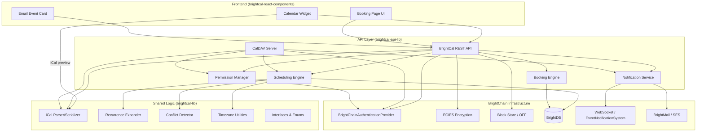

# Design Document: BrightCal Shared Calendar

## Overview

BrightCal is a full-featured shared calendar subsystem for the BrightChain ecosystem, providing RFC 5545 iCalendar compatibility, CalDAV server protocol support, end-to-end encrypted event storage, granular sharing permissions, conflict detection, booking pages, and rich UI widgets. It integrates tightly with BrightMail for invitation delivery (iTIP/iMIP) and leverages existing BrightChain infrastructure for identity, encryption (ECIES), and block storage.

BrightCal follows the established three-tier library decomposition:

- **brightcal-lib** (`@brightchain/brightcal-lib`): Shared interfaces, enumerations, iCal parser/serializer, recurrence expander, conflict detection algorithms, and timezone utilities (pure logic, no Node.js dependencies)
- **brightcal-api-lib** (`@brightchain/brightcal-api-lib`): CalDAV server, REST API controllers, scheduling engine, notification service, permission manager, booking engine, and BrightDB models
- **brightcal-react-components** (`@brightchain/brightcal-react-components`): Calendar widget (month/week/day/agenda views), booking page UI, event detail views, inline email event cards

### Key Design Decisions

1. **iCal parser is pure and shared**: The parser/serializer lives in `brightcal-lib` so both frontend (for .ics file preview) and backend can use it.
2. **Recurrence expansion is lazy**: Occurrences are computed on-demand within a requested time window rather than pre-materialized, avoiding infinite storage for unbounded recurrences.
3. **Encryption at the block level**: Calendar events are stored as ECIES-encrypted blocks in the Owner-Free Filesystem, with per-recipient re-encryption for sharing.
4. **CalDAV as a first-class protocol**: The CalDAV server is a standalone Express middleware that can be mounted alongside the REST API, enabling native sync with Apple Calendar, Thunderbird, and Android clients.
5. **Free/busy data stored separately**: Unencrypted free/busy summaries enable availability queries without decrypting event details.

---

## Architecture



### Request Flow

1. **REST API**: Frontend → Express Router → BrightCalController → Service Layer → BrightDB/Block Store
2. **CalDAV**: Native Client → CalDAV Middleware (WebDAV methods) → Service Layer → BrightDB/Block Store
3. **Notifications**: Service Layer → EventNotificationSystem (WebSocket) + SESEmailService (email)
4. **Booking**: Public Page → Booking Engine → Calendar Engine → Notification Service

---

## Components and Interfaces

### brightcal-lib (Shared)

#### Core Interfaces

```typescript
import { PlatformID } from '@digitaldefiance/ecies-lib';
import { IBasicObjectDTO } from '@brightchain/brightchain-lib';

/**
 * Permission levels for calendar sharing
 */
export enum CalendarPermissionLevel {
  Owner = 'owner',
  Editor = 'editor',
  Viewer = 'viewer',
  FreeBusyOnly = 'freebusy',
}

/**
 * Event visibility classification
 */
export enum EventVisibility {
  Public = 'PUBLIC',
  Private = 'PRIVATE',
  Confidential = 'CONFIDENTIAL',
}

/**
 * Event transparency (affects free/busy)
 */
export enum EventTransparency {
  Opaque = 'OPAQUE',
  Transparent = 'TRANSPARENT',
}

/**
 * Attendee participation status
 */
export enum ParticipationStatus {
  NeedsAction = 'NEEDS-ACTION',
  Accepted = 'ACCEPTED',
  Declined = 'DECLINED',
  Tentative = 'TENTATIVE',
  Delegated = 'DELEGATED',
}

/**
 * Recurrence frequency
 */
export enum RecurrenceFrequency {
  Secondly = 'SECONDLY',
  Minutely = 'MINUTELY',
  Hourly = 'HOURLY',
  Daily = 'DAILY',
  Weekly = 'WEEKLY',
  Monthly = 'MONTHLY',
  Yearly = 'YEARLY',
}

/**
 * Conflict severity classification
 */
export enum ConflictSeverity {
  Hard = 'hard',
  Soft = 'soft',
  Informational = 'informational',
}

/**
 * iTIP method types
 */
export enum ITipMethod {
  Request = 'REQUEST',
  Reply = 'REPLY',
  Cancel = 'CANCEL',
  Counter = 'COUNTER',
  DeclineCounter = 'DECLINECOUNTER',
}

/**
 * Calendar collection DTO
 */
export interface ICalendarCollectionDTO<
  TID extends PlatformID = string,
  TDate extends Date | string = string,
> extends IBasicObjectDTO<TID, TDate> {
  ownerId: TID;
  displayName: string;
  color: string;
  description: string;
  isDefault: boolean;
  isSubscription: boolean;
  subscriptionUrl?: string;
  subscriptionRefreshInterval?: number; // minutes
  defaultPermission: CalendarPermissionLevel;
}

/**
 * Recurrence rule definition (maps to RRULE)
 */
export interface IRecurrenceRule {
  freq: RecurrenceFrequency;
  until?: string; // ISO 8601 datetime
  count?: number;
  interval?: number;
  bySecond?: number[];
  byMinute?: number[];
  byHour?: number[];
  byDay?: string[]; // e.g., ['MO', '2TU', '-1FR']
  byMonthDay?: number[];
  byYearDay?: number[];
  byWeekNo?: number[];
  byMonth?: number[];
  bySetPos?: number[];
  wkst?: string; // e.g., 'MO'
}

/**
 * Attendee on an event
 */
export interface IAttendeeDTO<TID extends PlatformID = string> {
  userId?: TID; // BrightMail user ID (if internal)
  email: string;
  displayName?: string;
  partstat: ParticipationStatus;
  role: 'REQ-PARTICIPANT' | 'OPT-PARTICIPANT' | 'NON-PARTICIPANT' | 'CHAIR';
  rsvp: boolean;
}

/**
 * Reminder/alarm definition
 */
export interface IReminderDTO {
  action: 'DISPLAY' | 'EMAIL' | 'AUDIO';
  triggerMinutesBefore: number;
  duration?: string; // ISO 8601 duration
  repeat?: number;
}

/**
 * Calendar event DTO
 */
export interface ICalendarEventDTO<
  TID extends PlatformID = string,
  TDate extends Date | string = string,
> extends IBasicObjectDTO<TID, TDate> {
  calendarId: TID;
  uid: string; // RFC 4122 UUID, globally unique
  sequence: number;
  summary: string;
  description?: string;
  location?: string;
  dtstart: string; // ISO 8601 with TZID
  dtend?: string; // ISO 8601 with TZID
  dtstartTzid: string; // IANA timezone identifier
  dtendTzid?: string;
  allDay: boolean;
  visibility: EventVisibility;
  transparency: EventTransparency;
  status: 'CONFIRMED' | 'TENTATIVE' | 'CANCELLED';
  organizerId: TID;
  attendees: IAttendeeDTO<TID>[];
  rrule?: IRecurrenceRule;
  exdates?: string[]; // ISO 8601 datetimes
  rdates?: string[]; // ISO 8601 datetimes
  recurrenceId?: string; // For exception instances
  reminders: IReminderDTO[];
  attachmentIds?: TID[]; // Block store references
  categories?: string[];
  dateModified: TDate;
}

/**
 * Free/busy time slot
 */
export interface IFreeBusySlot {
  start: string; // ISO 8601
  end: string; // ISO 8601
  type: 'BUSY' | 'BUSY-TENTATIVE' | 'BUSY-UNAVAILABLE' | 'FREE';
}

/**
 * Free/busy data for a user over a time range
 */
export interface IFreeBusyDataDTO<TID extends PlatformID = string> {
  userId: TID;
  rangeStart: string;
  rangeEnd: string;
  slots: IFreeBusySlot[];
}

/**
 * Conflict detection result
 */
export interface IConflictResult<TID extends PlatformID = string> {
  eventA: { id: TID; summary: string; start: string; end: string; calendarId: TID };
  eventB: { id: TID; summary: string; start: string; end: string; calendarId: TID };
  severity: ConflictSeverity;
  overlapStart: string;
  overlapEnd: string;
}

/**
 * Booking page configuration
 */
export interface IBookingPageDTO<
  TID extends PlatformID = string,
  TDate extends Date | string = string,
> extends IBasicObjectDTO<TID, TDate> {
  ownerId: TID;
  slug: string; // URL-friendly identifier
  title: string;
  description?: string;
  appointmentTypes: IAppointmentTypeDTO[];
  minNoticeMinutes: number; // default 240 (4 hours)
  maxAdvanceDays: number; // max days in advance
  active: boolean;
}

/**
 * Appointment type within a booking page
 */
export interface IAppointmentTypeDTO {
  name: string;
  durationMinutes: number;
  bufferMinutes: number;
  availableWindows: IAvailabilityWindow[];
  questions: IBookingQuestion[];
  color?: string;
}

/**
 * Availability window for booking
 */
export interface IAvailabilityWindow {
  dayOfWeek: number; // 0=Sunday, 6=Saturday
  startTime: string; // HH:mm
  endTime: string; // HH:mm
}

/**
 * Custom question on a booking page
 */
export interface IBookingQuestion {
  label: string;
  type: 'text' | 'email' | 'phone' | 'textarea';
  required: boolean;
}

/**
 * Calendar sharing record
 */
export interface ICalendarShareDTO<
  TID extends PlatformID = string,
  TDate extends Date | string = string,
> extends IBasicObjectDTO<TID, TDate> {
  calendarId: TID;
  grantedToUserId?: TID;
  grantedToGroupId?: TID;
  permission: CalendarPermissionLevel;
  publicLink?: string;
  expiresAt?: TDate;
}

/**
 * Working hours configuration per user
 */
export interface IWorkingHoursDTO {
  timezone: string; // IANA timezone
  windows: IAvailabilityWindow[];
}
```

#### iCal Parser/Serializer (Pure Functions)

```typescript
/**
 * Parse an iCalendar string into internal representations
 */
export function parseICalendar(input: string): ICalParseResult;

/**
 * Serialize internal event representations to iCalendar format
 */
export function serializeToICalendar(events: ICalendarEventDTO[]): string;

/**
 * Parse result containing events, todos, freebusy, and errors
 */
export interface ICalParseResult {
  events: ICalendarEventDTO[];
  todos: ICalendarTodoDTO[];
  freeBusy: IFreeBusyDataDTO[];
  errors: ICalParseError[];
}

export interface ICalParseError {
  line: number;
  message: string;
  severity: 'error' | 'warning';
}
```

#### Recurrence Expander (Pure Function)

```typescript
/**
 * Expand a recurring event into individual occurrences within a time window.
 * Handles RRULE, EXDATE, RDATE, and DST transitions.
 */
export function expandRecurrence(
  event: ICalendarEventDTO,
  windowStart: string,
  windowEnd: string,
  timezone: string,
): ICalendarEventDTO[];
```

#### Conflict Detector (Pure Function)

```typescript
/**
 * Detect scheduling conflicts between a candidate event and existing events.
 */
export function detectConflicts<TID extends PlatformID = string>(
  candidate: ICalendarEventDTO<TID>,
  existingEvents: ICalendarEventDTO<TID>[],
): IConflictResult<TID>[];
```

### brightcal-api-lib (Backend)

#### Controllers

| Controller | Route Prefix | Responsibility |
|---|---|---|
| `CalendarController` | `/api/cal/calendars` | Calendar CRUD, sharing, subscriptions |
| `EventController` | `/api/cal/events` | Event CRUD, recurrence modifications |
| `SchedulingController` | `/api/cal/scheduling` | Free/busy queries, find-available-times |
| `BookingController` | `/api/cal/booking` | Booking page CRUD, public slot queries |
| `InvitationController` | `/api/cal/invitations` | RSVP handling, iTIP counter proposals |
| `SearchController` | `/api/cal/search` | Full-text search and filtering |
| `ExportImportController` | `/api/cal/export` | ICS/JSON export, ICS import |
| `CalDavMiddleware` | `/caldav` | WebDAV/CalDAV protocol handler |

All controllers extend `BaseController<TID, TResponse, IHandlers, LanguageCode>` and are registered on the `ApiRouter`.

#### Services

| Service | Responsibility |
|---|---|
| `CalendarEngineService` | Core calendar/event persistence, encryption, recurrence storage |
| `SchedulingEngineService` | Conflict detection, free/busy computation, time slot ranking |
| `CalendarNotificationService` | iTIP message generation, reminder scheduling, WebSocket push |
| `CalendarPermissionService` | Permission enforcement, share management, visibility filtering |
| `BookingEngineService` | Availability computation, booking creation, confirmation flow |
| `CalDavService` | CalDAV protocol logic, ETag management, REPORT handling |
| `IcsSubscriptionService` | External feed polling, merge logic |

#### Database Models (BrightDB)

| Collection | Document Type |
|---|---|
| `calendar_collections` | Calendar metadata, owner, color, subscription config |
| `calendar_events` | Encrypted event blocks + searchable metadata index |
| `calendar_shares` | Sharing records with permission levels |
| `calendar_reminders` | Scheduled reminder queue (trigger time, channels) |
| `booking_pages` | Booking page configurations |
| `booking_appointments` | Confirmed bookings with booker info |
| `calendar_freebusy` | Pre-computed free/busy summaries (unencrypted) |

#### CalDAV Server Architecture

The CalDAV server is implemented as Express middleware handling WebDAV methods:

```typescript
export class CalDavMiddleware {
  // WebDAV methods
  handlePropfind(req, res): Promise<void>;  // Resource discovery
  handleReport(req, res): Promise<void>;    // calendar-query, calendar-multiget
  handleGet(req, res): Promise<void>;       // Retrieve .ics
  handlePut(req, res): Promise<void>;       // Create/update event
  handleDelete(req, res): Promise<void>;    // Remove event
  handleMkcalendar(req, res): Promise<void>; // Create calendar collection
  handlePost(req, res): Promise<void>;      // Scheduling outbox (RFC 6638)
}
```

URL structure: `/caldav/{userId}/calendars/{calendarId}/{eventUid}.ics`

### brightcal-react-components (Frontend)

#### Components

| Component | Description |
|---|---|
| `CalendarWidget` | Main calendar view container with view switching |
| `MonthView` | Month grid with event indicators |
| `WeekView` | 7-column time grid with event blocks |
| `DayView` | Single-column time grid with 15-min slots |
| `AgendaView` | Chronological event list |
| `MiniCalendar` | Compact date picker for navigation |
| `EventDetailPopover` | Event details with RSVP actions |
| `EventEditor` | Create/edit event form |
| `BookingPageView` | Public booking page with slot selection |
| `BookingForm` | Booker information form |
| `InlineEventCard` | Email-embedded event card with RSVP |
| `CalendarSidebar` | Sidebar panel for BrightMail integration |
| `FreeBusyGrid` | Attendee availability visualization |

#### Hooks

| Hook | Purpose |
|---|---|
| `useCalendars()` | Fetch and manage calendar collections |
| `useEvents(calendarIds, range)` | Fetch events for a time range with recurrence expansion |
| `useFreeBusy(userIds, range)` | Query free/busy data |
| `useBookingSlots(pageId, date)` | Fetch available booking slots |
| `useEventMutation()` | Create/update/delete events with optimistic updates |
| `useCalendarDragDrop()` | Drag-and-drop rescheduling logic |
| `useCalendarKeyboard()` | Keyboard navigation state |

---

## Data Models

### BrightDB Schema Designs

#### CalendarCollection

```typescript
{
  _id: ObjectId,
  ownerId: GuidV4Buffer,
  displayName: string,
  color: string,        // hex color code
  description: string,
  isDefault: boolean,
  isSubscription: boolean,
  subscriptionUrl?: string,
  subscriptionRefreshInterval?: number,
  subscriptionLastRefreshed?: Date,
  defaultPermission: CalendarPermissionLevel,
  dateCreated: Date,
  dateModified: Date,
}
```

#### CalendarEvent (Metadata Index)

The full event body is stored encrypted in the block store. This collection holds searchable metadata:

```typescript
{
  _id: ObjectId,
  calendarId: ObjectId,
  uid: string,              // RFC 4122 UUID
  sequence: number,
  summary: string,          // encrypted at rest via field-level encryption
  dtstart: Date,            // UTC-normalized for range queries
  dtend: Date,
  dtstartTzid: string,
  dtendTzid: string,
  allDay: boolean,
  visibility: EventVisibility,
  transparency: EventTransparency,
  status: string,
  organizerId: GuidV4Buffer,
  attendeeIds: GuidV4Buffer[],
  isRecurring: boolean,
  rrule?: IRecurrenceRule,
  exdates?: Date[],
  rdates?: Date[],
  recurrenceId?: Date,      // For exception instances
  parentEventId?: ObjectId, // Links exception to parent
  blockId: GuidV4Buffer,    // Reference to encrypted block
  dateCreated: Date,
  dateModified: Date,
  // Text search index fields
  searchText: string,       // Concatenated searchable text
}
```

Indexes:
- `{ calendarId: 1, dtstart: 1, dtend: 1 }` — Range queries
- `{ organizerId: 1 }` — Events by organizer
- `{ attendeeIds: 1 }` — Events by attendee
- `{ uid: 1 }` — Unique event lookup
- `{ searchText: 'text' }` — Full-text search

#### CalendarShare

```typescript
{
  _id: ObjectId,
  calendarId: ObjectId,
  grantedToUserId?: GuidV4Buffer,
  grantedToGroupId?: GuidV4Buffer,
  permission: CalendarPermissionLevel,
  publicLink?: string,
  expiresAt?: Date,
  dateCreated: Date,
}
```

#### CalendarReminder (Scheduled Queue)

```typescript
{
  _id: ObjectId,
  eventId: ObjectId,
  userId: GuidV4Buffer,
  triggerAt: Date,          // Absolute trigger time
  channels: ('email' | 'push')[],
  delivered: boolean,
  dateCreated: Date,
}
```

Index: `{ triggerAt: 1, delivered: 1 }` — Polling for due reminders

#### BookingPage

```typescript
{
  _id: ObjectId,
  ownerId: GuidV4Buffer,
  slug: string,             // unique URL slug
  title: string,
  description?: string,
  appointmentTypes: IAppointmentTypeDTO[],
  minNoticeMinutes: number,
  maxAdvanceDays: number,
  active: boolean,
  dateCreated: Date,
  dateModified: Date,
}
```

#### FreeBusySummary (Unencrypted)

```typescript
{
  _id: ObjectId,
  userId: GuidV4Buffer,
  date: Date,               // Day-level granularity
  slots: IFreeBusySlot[],   // 15-min resolution
  dateModified: Date,
}
```

Index: `{ userId: 1, date: 1 }` — Fast free/busy lookups

---


## Correctness Properties

*A property is a characteristic or behavior that should hold true across all valid executions of a system—essentially, a formal statement about what the system should do. Properties serve as the bridge between human-readable specifications and machine-verifiable correctness guarantees.*

### Property 1: iCalendar Round-Trip Fidelity

*For any* valid iCalendar stream containing VEVENT, VTODO, VFREEBUSY, or VALARM components (including RRULE, EXDATE, RDATE, multi-valued properties, property parameters, and folded lines), parsing then serializing then parsing again SHALL produce an equivalent internal representation to the first parse.

**Validates: Requirements 1.1, 1.2, 1.3, 1.4, 1.7, 1.8, 1.9, 1.10**

### Property 2: iCal Serializer Structural Validity

*For any* valid internal Event representation, serializing to iCalendar format SHALL produce output that conforms to RFC 5545 structure (proper BEGIN/END blocks, required properties present, correct line folding, valid property value formats).

**Validates: Requirements 1.6**

### Property 3: Recurrence Expansion Respects Limits

*For any* recurring event with an RRULE containing UNTIL or COUNT constraints, expanding the recurrence SHALL never produce occurrences beyond the UNTIL date or exceeding the COUNT number.

**Validates: Requirements 5.1, 5.2**

### Property 4: EXDATE Exclusions Remove Occurrences

*For any* recurring event with EXDATE values, expanding the recurrence SHALL produce an occurrence set that does not contain any of the excluded dates.

**Validates: Requirements 5.3**

### Property 5: RDATE Additions Include Occurrences

*For any* recurring event with RDATE values, expanding the recurrence SHALL produce an occurrence set that contains all additional dates specified by RDATE.

**Validates: Requirements 5.4**

### Property 6: Single Occurrence Modification Preserves Parent Rule

*For any* recurring event, modifying a single occurrence SHALL create a RECURRENCE-ID exception for that occurrence while the parent event's RRULE remains unchanged and all other occurrences are unaffected.

**Validates: Requirements 5.5**

### Property 7: This-and-Future Split Produces Two Valid Series

*For any* recurring event split at a given occurrence, the original series SHALL have an UNTIL date before the split point, and the new series SHALL start at the split point with its own RRULE, such that the union of both series' occurrences equals the original series' occurrences (minus any modifications).

**Validates: Requirements 5.6**

### Property 8: Single Occurrence Deletion Adds EXDATE

*For any* recurring event, deleting a single occurrence SHALL add that occurrence's date to the EXDATE list rather than removing the entire series, and the series SHALL continue to produce all other occurrences.

**Validates: Requirements 5.7**

### Property 9: DST-Correct Recurrence Expansion

*For any* recurring event with a wall-clock time in a timezone that observes DST, expanding occurrences across a DST transition SHALL maintain the same wall-clock time (e.g., a 9:00 AM daily event stays at 9:00 AM local time regardless of UTC offset changes).

**Validates: Requirements 5.8, 11.3**

### Property 10: Permission-Based Data Filtering

*For any* calendar event and any requesting user: (a) a user with viewer permission SHALL receive full event details; (b) a user with free-busy-only permission SHALL receive only time range and busy/free status without title, description, or attendees; (c) a user without any permission SHALL be denied access; (d) events marked "private" SHALL display only as "busy" to viewers; (e) events marked "confidential" SHALL display title only without description or attendees to viewers.

**Validates: Requirements 6.5, 6.6, 6.7, 6.8**

### Property 11: Conflict Detection Correctness

*For any* set of events on a user's calendars and a candidate event, the conflict detector SHALL report all and only time overlaps between the candidate and existing events, correctly classifying severity as: hard (both require attendance), soft (one is tentative/free), or informational (all-day vs timed), and SHALL exclude events with TRANSP=TRANSPARENT from conflict results entirely.

**Validates: Requirements 7.1, 7.2, 7.3, 7.5**

### Property 12: Multi-Attendee Conflict Aggregation

*For any* event with multiple attendees, the scheduling engine SHALL report per-attendee conflict status by checking each attendee's calendars independently and aggregating results.

**Validates: Requirements 7.6**

### Property 13: Free/Busy Aggregation Correctness

*For any* user and time range, computing free/busy data SHALL include all non-transparent (OPAQUE) events as busy slots and exclude all transparent events, producing a complete and accurate availability picture.

**Validates: Requirements 8.1**

### Property 14: Group Free/Busy Intersection

*For any* group of users, the group free/busy query SHALL return common free slots that are the intersection of all individual users' free times within the requested range.

**Validates: Requirements 8.3**

### Property 15: Time Slot Ranking Preferences

*For any* set of candidate time slots for a meeting, ranking SHALL prefer (in order): slots where all required attendees are free, then slots maximizing optional attendee availability, then slots during configured working hours.

**Validates: Requirements 8.5**

### Property 16: Booking Slot Availability Computation

*For any* booking page configuration and set of existing host events, the available slots SHALL be exactly the configured availability windows minus any time occupied by existing events, and SHALL not include any slot within the minimum notice period from the current time.

**Validates: Requirements 9.2, 9.6, 9.8**

### Property 17: RSVP Tracking Correctness

*For any* set of attendee RSVP responses to an event, processing each response SHALL correctly update the attendee's PARTSTAT, and the attendee summary counts (accepted, declined, tentative, no-response) SHALL always equal the total number of attendees.

**Validates: Requirements 10.2, 10.6**

### Property 18: SEQUENCE Monotonic Increment

*For any* event modified by the organizer, the SEQUENCE number SHALL increment by exactly 1 with each modification, and the outgoing iTIP REQUEST SHALL carry the new SEQUENCE value.

**Validates: Requirements 4.9, 10.5**

### Property 19: Unique UID Assignment

*For any* set of events created by the system, all assigned UIDs SHALL be unique and conform to RFC 4122 UUID format.

**Validates: Requirements 4.8**

### Property 20: Timezone Storage Round-Trip

*For any* valid IANA timezone identifier used in an event's DTSTART or DTEND, storing and retrieving the event SHALL preserve the original TZID exactly, enabling correct timezone conversion on display.

**Validates: Requirements 11.1, 11.4**

### Property 21: Search Filter Correctness

*For any* filter criteria (date range, calendar, attendee, status, recurrence type), applying the filter SHALL return all and only events matching all specified criteria.

**Validates: Requirements 15.2, 15.3**

### Property 22: Full-Text Search Completeness

*For any* search query substring that appears in an event's title, description, location, or attendee name, that event SHALL appear in the search results.

**Validates: Requirements 15.1**

### Property 23: Export/Import Round-Trip

*For any* calendar collection with events, exporting to ICS then importing into a new calendar SHALL produce events equivalent to the originals (matching by UID, with all properties preserved).

**Validates: Requirements 16.1, 16.2**

### Property 24: Duplicate Detection on Import

*For any* ICS import containing events whose UIDs match existing events in the target calendar, the system SHALL detect and report all duplicates.

**Validates: Requirements 16.3**

### Property 25: JSON Export Completeness

*For any* calendar collection, exporting to JSON SHALL produce a document containing all event data fields for every event in the collection.

**Validates: Requirements 16.4**

### Property 26: Encryption at Rest

*For any* stored calendar event, the raw block store content SHALL be encrypted (not readable as plaintext) using the owner's BrightChain encryption key.

**Validates: Requirements 17.1**

### Property 27: Recipient Re-Encryption

*For any* shared calendar, the recipient SHALL be able to decrypt shared event data using their own private key, and the data SHALL not be decryptable by any other user's key.

**Validates: Requirements 17.2**

### Property 28: Key Rotation on Revocation

*For any* calendar where sharing is revoked, new events added after revocation SHALL not be decryptable by the previously-shared recipient's key.

**Validates: Requirements 17.4**

### Property 29: Free/Busy Separation from Encrypted Events

*For any* user's calendar, free/busy data SHALL be queryable without requiring the event encryption key, while event details remain encrypted.

**Validates: Requirements 17.5**

### Property 30: ICS Feed Merge Correctness

*For any* external ICS feed subscription refresh, the merge operation SHALL: add events present in the new feed but not in the local copy, update events whose UID matches but content differs, and remove events present locally but absent from the new feed.

**Validates: Requirements 3.7**

### Property 31: Reminder Cancellation on Event Cancellation

*For any* event with scheduled reminders that is subsequently cancelled, all pending (undelivered) reminders for that event SHALL be cancelled.

**Validates: Requirements 14.5**

---

## Error Handling

### Parser Errors

| Error Condition | Handling Strategy |
|---|---|
| Malformed iCal syntax | Return `ICalParseError` with line number and description; reject the stream |
| Unknown component type | Skip with warning; parse known components |
| Invalid RRULE frequency | Return error; reject the event |
| Invalid TZID reference | Fall back to UTC with warning in parse result |
| Line exceeding fold limit | Auto-unfold per RFC 5545 Section 3.1 |

### API Errors

| Error Condition | HTTP Status | Response |
|---|---|---|
| Unauthorized (no/invalid token) | 401 | `{ error: 'UNAUTHORIZED', message: '...' }` |
| Forbidden (insufficient permission) | 403 | `{ error: 'FORBIDDEN', resource: '...', required: '...' }` |
| Calendar not found | 404 | `{ error: 'NOT_FOUND', resource: 'calendar' }` |
| Event not found | 404 | `{ error: 'NOT_FOUND', resource: 'event' }` |
| Conflict detected (informational) | 200 | Include `conflicts` array in response body |
| Invalid event data | 422 | `{ error: 'VALIDATION_ERROR', fields: [...] }` |
| Duplicate UID on import | 409 | `{ error: 'DUPLICATE_UID', uid: '...', options: ['skip','overwrite','new'] }` |
| Booking slot no longer available | 409 | `{ error: 'SLOT_UNAVAILABLE', message: '...' }` |
| Rate limit exceeded | 429 | `{ error: 'RATE_LIMITED', retryAfter: seconds }` |

### CalDAV Errors

| Error Condition | HTTP Status | DAV Error Element |
|---|---|---|
| Resource not found | 404 | Standard 404 |
| Precondition failed (ETag mismatch) | 412 | `<DAV:error><DAV:no-conflict/>` |
| Forbidden | 403 | `<DAV:error><DAV:need-privileges/>` |
| Insufficient storage | 507 | `<DAV:error><DAV:quota-not-exceeded/>` |

### Encryption Errors

| Error Condition | Handling Strategy |
|---|---|
| Decryption failure (wrong key) | Return 403 with "access denied" (don't reveal crypto details) |
| Key not found for recipient | Queue share for when recipient registers keys |
| Block store unavailable | Retry with exponential backoff; return 503 after max retries |

### Notification Errors

| Error Condition | Handling Strategy |
|---|---|
| Email delivery failure | Retry 3 times with backoff; mark as failed; surface in UI |
| WebSocket disconnected | Queue notification for delivery on reconnect |
| Reminder trigger missed (server downtime) | Deliver immediately on recovery if event hasn't passed |

---

## Testing Strategy

### Property-Based Testing

BrightCal's core logic (iCal parsing/serialization, recurrence expansion, conflict detection, permission filtering, availability computation) is highly amenable to property-based testing due to:
- Large input spaces (arbitrary iCal strings, timezone combinations, recurrence rules)
- Clear universal invariants (round-trips, set operations, ordering guarantees)
- Pure function implementations in `brightcal-lib`

**Library**: [fast-check](https://github.com/dubzzz/fast-check) (TypeScript property-based testing)

**Configuration**:
- Minimum 100 iterations per property test
- Each property test tagged with: `Feature: brightcal-shared-calendar, Property {N}: {title}`
- Custom arbitraries for: valid iCal strings, IRecurrenceRule, ICalendarEventDTO, timezone identifiers, time ranges

**Property Test Organization**:
```
brightcal-lib/src/lib/__tests__/
  ical-parser.property.spec.ts      (Properties 1, 2)
  recurrence-expander.property.spec.ts (Properties 3-9)
  conflict-detector.property.spec.ts   (Properties 11, 12)
  permission-filter.property.spec.ts   (Property 10)
  
brightcal-api-lib/src/lib/__tests__/
  scheduling-engine.property.spec.ts   (Properties 13-16)
  rsvp-tracking.property.spec.ts       (Properties 17, 18, 19)
  search-filter.property.spec.ts       (Properties 21, 22)
  export-import.property.spec.ts       (Properties 23-25)
  encryption.property.spec.ts          (Properties 26-29)
  feed-merge.property.spec.ts          (Property 30)
  reminder-cancel.property.spec.ts     (Property 31)
  timezone-storage.property.spec.ts    (Property 20)
```

### Unit Tests (Example-Based)

Focus areas:
- CalDAV protocol compliance (specific request/response pairs)
- Calendar CRUD operations
- Booking page configuration
- UI component rendering (React Testing Library)
- Specific edge cases: empty calendars, single-event calendars, maximum recurrence counts

### Integration Tests

Focus areas:
- CalDAV client compatibility (Apple Calendar, Thunderbird simulation)
- End-to-end invitation flow (create event → send iTIP → receive RSVP)
- Booking flow (view slots → book → confirm → notify)
- BrightMail integration (inline event card rendering, RSVP from email)
- Encryption round-trip with actual ECIES keys
- WebSocket notification delivery
- BrightDB query performance with large event sets

### Test Infrastructure

- **Generators**: Custom fast-check arbitraries for iCal components, recurrence rules, timezone-aware datetimes
- **Mocks**: In-memory BrightDB (brightdb-memory-server), mock block store, mock email service
- **Fixtures**: Sample .ics files from real calendar clients (Apple, Google, Outlook) for compatibility testing
- **CI**: Property tests run on every PR; integration tests run nightly
