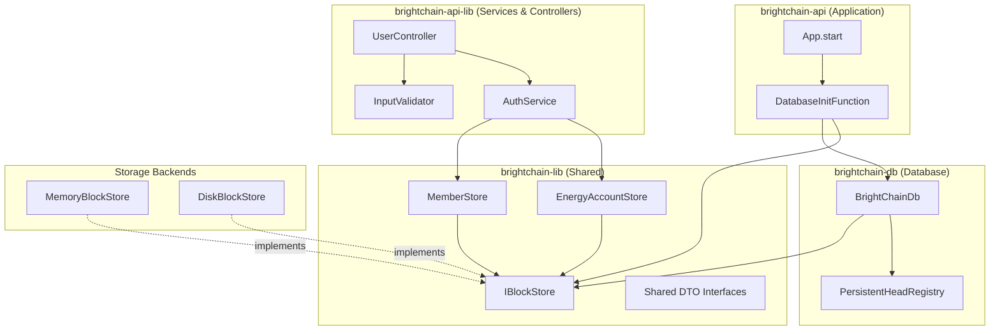
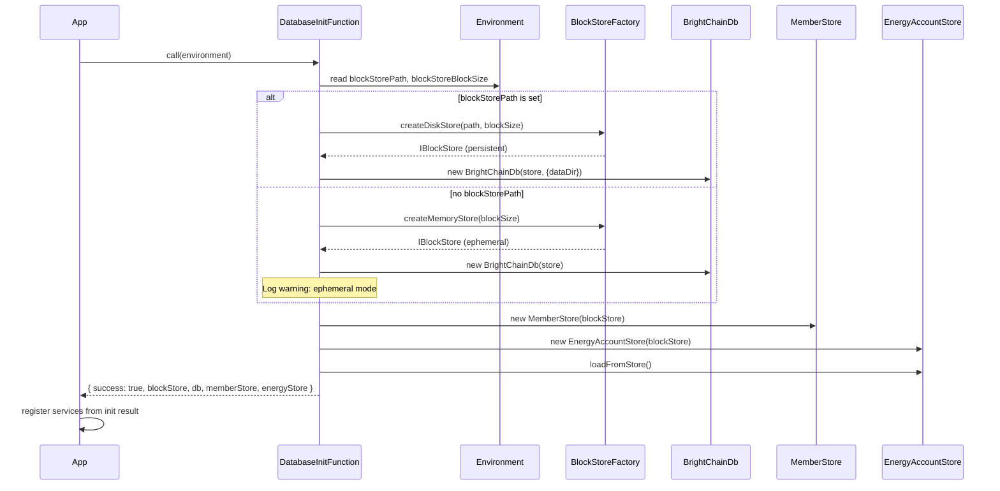

# Design Document: BrightChain Database Initialization & User Endpoints

## Overview

This design introduces persistent database initialization for the BrightChain stack and completes the user management endpoints to feature parity with the previous MongoDB-backed implementation. The key insight from the existing codebase is that most of the infrastructure already exists:

- `Environment` already reads `BRIGHTCHAIN_BLOCKSTORE_PATH` and `blockStoreBlockSize`
- `BlockStoreFactory` has a `createDiskStore` stub that falls back to memory
- `BrightChainDb` already supports `PersistentHeadRegistry` via a `dataDir` option
- `EnergyAccount` already has `toDto()`/`fromDto()`/`toJson()`/`fromJson()` round-trip methods
- `MemberStore` already has full CRUD via CBL blocks
- `UserController` already has all four endpoint handlers wired up

The work is primarily about:
1. Replacing the no-op `DatabaseInitFunction` with a real one that creates persistent stores
2. Implementing a disk-backed `BlockStore` (or using `BrightChainDb` with `PersistentHeadRegistry`)
3. Adding password hashing and proper credential lookup to `AuthService`
4. Adding input validation to `UserController`
5. Making `EnergyAccountStore` persist to the block store
6. Defining shared DTO interfaces in `brightchain-lib`

## Architecture



### Initialization Flow



## Components and Interfaces

### 1. DatabaseInitFunction (brightchain-api-lib)

Replaces `noOpDatabaseInitFunction`. Reads environment config and creates the full storage stack.

```typescript
// brightchain-api-lib/src/lib/databaseInit.ts

import { IBlockStore, MemberStore, EnergyAccountStore } from '@brightchain/brightchain-lib';
import { BrightChainDb } from '@brightchain/brightchain-db';
import { BlockStoreFactory } from '@brightchain/brightchain-lib';
import { Environment } from './environment';

export interface IDatabaseInitResult<TID> {
  blockStore: IBlockStore;
  db: BrightChainDb;
  memberStore: MemberStore;
  energyStore: EnergyAccountStore;
}

export async function brightchainDatabaseInit<TID>(
  environment: Environment<TID>
): Promise<IFailableResult<IDatabaseInitResult<TID>>> {
  try {
    const blockStorePath = environment.blockStorePath;
    const blockSize = environment.blockStoreBlockSize;

    let blockStore: IBlockStore;
    let dbOptions: BrightChainDbOptions;

    if (blockStorePath) {
      // Validate path accessibility
      await validateDataDir(blockStorePath);
      blockStore = BlockStoreFactory.createDiskStore({ storePath: blockStorePath, blockSize });
      dbOptions = { dataDir: blockStorePath };
    } else {
      console.warn('[BrightChain] No BRIGHTCHAIN_BLOCKSTORE_PATH set — using ephemeral MemoryBlockStore');
      blockStore = BlockStoreFactory.createMemoryStore({ blockSize });
      dbOptions = {};
    }

    const db = new BrightChainDb(blockStore, dbOptions);
    await db.connect();

    const memberStore = new MemberStore(blockStore);
    const energyStore = new EnergyAccountStore(blockStore);
    await energyStore.loadFromStore();

    return {
      success: true,
      blockStore,
      db,
      memberStore,
      energyStore,
    };
  } catch (error) {
    return {
      success: false,
      error: error instanceof Error ? error.message : String(error),
    };
  }
}
```

### 2. DiskBlockStore (brightchain-api-lib)

A Node.js-specific `IBlockStore` implementation that persists blocks to the filesystem. This goes in `brightchain-api-lib` because it requires Node.js `fs` APIs.

```typescript
// brightchain-api-lib/src/lib/stores/diskBlockStore.ts

export class DiskBlockStore implements IBlockStore {
  readonly blockSize: BlockSize;
  private readonly basePath: string;

  constructor(basePath: string, blockSize: BlockSize) {
    this.basePath = basePath;
    this.blockSize = blockSize;
  }

  // Blocks stored as files: {basePath}/blocks/{checksumHex}
  // Metadata stored as: {basePath}/meta/{checksumHex}.json

  async has(key: Checksum | string): Promise<boolean> { /* fs.access check */ }
  async getData(key: Checksum): Promise<RawDataBlock> { /* fs.readFile */ }
  async setData(block: RawDataBlock, options?: BlockStoreOptions): Promise<void> { /* fs.writeFile */ }
  async deleteData(key: Checksum): Promise<void> { /* fs.unlink */ }
  // ... remaining IBlockStore methods
}
```

The `BlockStoreFactory.createDiskStore` in `brightchain-lib` currently falls back to `MemoryBlockStore`. We will update it to accept an optional factory function, and `brightchain-api-lib` will register the `DiskBlockStore` factory at startup. This avoids putting Node.js-specific code in `brightchain-lib`.

### 3. Persistent EnergyAccountStore (brightchain-lib)

The current `EnergyAccountStore` is purely in-memory. We extend it to persist via the block store using `BrightChainDb` collections.

```typescript
// Updated EnergyAccountStore constructor signature
export class EnergyAccountStore {
  private accounts: Map<ShortHexGuid, EnergyAccount>;
  private db: BrightChainDb | null;

  constructor(db?: BrightChainDb) {
    this.accounts = new Map();
    this.db = db ?? null;
  }

  async loadFromStore(): Promise<void> {
    if (!this.db) return;
    const collection = this.db.collection<IEnergyAccountDto>('energy_accounts');
    const cursor = await collection.find({});
    const docs = await cursor.toArray();
    for (const doc of docs) {
      const account = EnergyAccount.fromDto(doc);
      const key = doc.memberId as ShortHexGuid;
      this.accounts.set(key, account);
    }
  }

  async set(memberId: Checksum, account: EnergyAccount): Promise<void> {
    const key = uint8ArrayToHex(memberId.toUint8Array()) as ShortHexGuid;
    this.accounts.set(key, account);
    if (this.db) {
      const collection = this.db.collection<IEnergyAccountDto>('energy_accounts');
      await collection.replaceOne({ memberId: key }, account.toDto(), { upsert: true });
    }
  }
}
```

Note: `BrightChainDb` is in `brightchain-db`, and `EnergyAccountStore` is in `brightchain-lib`. To avoid a circular dependency, we'll use an interface `IDocumentStore` in `brightchain-lib` that `BrightChainDb` implements. This keeps the dependency direction clean: `brightchain-db` depends on `brightchain-lib`, not the other way around.

### 4. AuthService Enhancements (brightchain-api-lib)

Add password hashing and proper credential lookup.

```typescript
// Changes to AuthService

import * as bcrypt from 'bcrypt';

const BCRYPT_ROUNDS = 12;

async register(username: string, email: string, password: SecureString): Promise<IAuthToken> {
  // Check for duplicate email
  const existing = await this.memberStore.queryIndex({ email });
  if (existing.length > 0) {
    throw new Error('Email already registered');
  }

  const passwordHash = await bcrypt.hash(password.getValue(), BCRYPT_ROUNDS);

  const { reference } = await this.memberStore.createMember({
    type: MemberType.User,
    name: username,
    contactEmail: new EmailString(email),
  });

  // Store password hash in member's private profile data
  await this.storePasswordHash(reference.id, passwordHash);

  // ... rest of registration (energy account, JWT, etc.)
}

async login(credentials: IAuthCredentials): Promise<IAuthToken> {
  // Look up member by username
  const results = await this.memberStore.queryIndex({ name: credentials.username, limit: 1 });
  if (results.length === 0) {
    throw new Error('Invalid credentials');
  }

  const reference = results[0];
  const storedHash = await this.getPasswordHash(reference.id);

  const isValid = await bcrypt.compare(credentials.password.getValue(), storedHash);
  if (!isValid) {
    throw new Error('Invalid credentials');
  }

  // ... rest of login (energy account, JWT, etc.)
}
```

### 5. Input Validation (brightchain-api-lib)

A validation utility for user endpoint request bodies.

```typescript
// brightchain-api-lib/src/lib/validation/userValidation.ts

export interface IValidationError {
  field: string;
  message: string;
}

export interface IValidationResult {
  valid: boolean;
  errors: IValidationError[];
}

export function validateRegistration(body: unknown): IValidationResult {
  const errors: IValidationError[] = [];
  const data = body as Record<string, unknown>;

  if (!data.username || typeof data.username !== 'string' || data.username.trim().length === 0) {
    errors.push({ field: 'username', message: 'Username is required' });
  } else if (!/^[a-zA-Z0-9_-]+$/.test(data.username)) {
    errors.push({ field: 'username', message: 'Username must contain only alphanumeric characters, hyphens, and underscores' });
  }

  if (!data.email || typeof data.email !== 'string') {
    errors.push({ field: 'email', message: 'Email is required' });
  } else if (!/^[^\s@]+@[^\s@]+\.[^\s@]+$/.test(data.email)) {
    errors.push({ field: 'email', message: 'Email format is invalid' });
  }

  if (!data.password || typeof data.password !== 'string') {
    errors.push({ field: 'password', message: 'Password is required' });
  } else if (data.password.length < 8) {
    errors.push({ field: 'password', message: 'Password must be at least 8 characters' });
  }

  return { valid: errors.length === 0, errors };
}

export function validateLogin(body: unknown): IValidationResult {
  const errors: IValidationError[] = [];
  const data = body as Record<string, unknown>;

  if (!data.username || typeof data.username !== 'string' || data.username.trim().length === 0) {
    errors.push({ field: 'username', message: 'Username is required' });
  }

  if (!data.password || typeof data.password !== 'string') {
    errors.push({ field: 'password', message: 'Password is required' });
  }

  return { valid: errors.length === 0, errors };
}
```

### 6. Shared DTO Interfaces (brightchain-lib)

Following the AGENTS.md pattern for generic templated interfaces.

```typescript
// brightchain-lib/src/lib/interfaces/userDto.ts

/**
 * Base user profile data — shared between frontend and backend.
 * TID is the ID type: string for frontend, Uint8Array/Checksum for backend.
 */
export interface IUserProfile<TID = string> {
  memberId: TID;
  username: string;
  email: string;
  energyBalance: number;
  availableBalance: number;
  earned: number;
  spent: number;
  reserved: number;
  reputation: number;
  createdAt: string;
  lastUpdated: string;
  profile?: IUserProfileMetadata;
}

export interface IUserProfileMetadata {
  status: string;
  storageQuota?: string;
  storageUsed?: string;
  lastActive?: string;
  dateCreated?: string;
}

export interface IAuthResponse<TID = string> {
  token: string;
  memberId: TID;
  energyBalance: number;
}

export interface IRegistrationRequest {
  username: string;
  email: string;
  password: string;
}

export interface ILoginRequest {
  username: string;
  password: string;
}
```

```typescript
// brightchain-api-lib/src/lib/interfaces/userApiResponse.ts

import { IUserProfile, IAuthResponse } from '@brightchain/brightchain-lib';
import { IApiMessageResponse } from '@digitaldefiance/node-express-suite';

export interface IUserProfileApiResponse extends IApiMessageResponse {
  data: IUserProfile<string>;
}

export interface IAuthApiResponse extends IApiMessageResponse {
  data: IAuthResponse<string>;
}
```

### 7. App.start() Refactoring (brightchain-api-lib)

The `App.start()` method currently creates all stores inline. We refactor it to use the `DatabaseInitFunction` result.

```typescript
// Simplified App.start() flow
public override async start(mongoUri?: string): Promise<void> {
  // ... upstream start (HTTP, middleware, greenlock) ...
  await super.start(mongoUri);

  await this.keyStorage.initializeFromEnvironment();

  // Use the real database init function
  const initResult = await brightchainDatabaseInit(this.environment);
  if (!initResult.success) {
    throw new Error(`Database initialization failed: ${initResult.error}`);
  }

  // Register services from init result
  this.services.register('blockStore', () => initResult.blockStore);
  this.services.register('db', () => initResult.db);
  this.services.register('memberStore', () => initResult.memberStore);
  this.services.register('energyStore', () => initResult.energyStore);
  this.services.register('energyLedger', () => new EnergyLedger());

  // ... rest of service registration (email, auth, events, websocket, upnp) ...
}
```

## Data Models

### Block Storage Layout (Disk)

```
{BRIGHTCHAIN_BLOCKSTORE_PATH}/
├── blocks/
│   ├── {checksum_hex_1}       # Raw block data files
│   ├── {checksum_hex_2}
│   └── ...
├── meta/
│   ├── {checksum_hex_1}.json  # Block metadata (JSON)
│   └── ...
├── head-registry.json          # PersistentHeadRegistry state
└── energy_accounts/            # Managed by BrightChainDb collection
    └── (stored as blocks via head registry)
```

### Password Storage

Password hashes are stored in the member's private profile data within the MemberStore CBL structure. The `MemberStore.updateMember` method already supports updating private profile data, so we add a `passwordHash` field to `IPrivateMemberProfileHydratedData`.

```typescript
// Addition to IPrivateMemberProfileHydratedData in brightchain-lib
export interface IPrivateMemberProfileHydratedData<TID> {
  // ... existing fields ...
  passwordHash?: string;  // bcrypt hash
}
```

### IDocumentStore Interface (brightchain-lib)

A minimal interface that `BrightChainDb` satisfies, allowing `EnergyAccountStore` to persist without depending on `brightchain-db` directly.

```typescript
// brightchain-lib/src/lib/interfaces/storage/documentStore.ts

export interface IDocumentCollection<T> {
  find(filter: Partial<T>): Promise<{ toArray(): Promise<T[]> }>;
  replaceOne(filter: Partial<T>, doc: T, options?: { upsert?: boolean }): Promise<void>;
  deleteOne(filter: Partial<T>): Promise<boolean>;
}

export interface IDocumentStore {
  collection<T>(name: string): IDocumentCollection<T>;
  connect(uri?: string): Promise<void>;
  isConnected(): boolean;
}
```

### Initialization Result Interface (brightchain-lib)

```typescript
// brightchain-lib/src/lib/interfaces/initResult.ts

export interface IInitResult<TBackend = unknown> {
  success: boolean;
  error?: string;
  backend?: TBackend;
}

export interface IBrightChainInitData {
  blockStore: IBlockStore;
  db: IDocumentStore;
  memberStore: MemberStore;
  energyStore: EnergyAccountStore;
}
```


## Correctness Properties

*A property is a characteristic or behavior that should hold true across all valid executions of a system — essentially, a formal statement about what the system should do. Properties serve as the bridge between human-readable specifications and machine-verifiable correctness guarantees.*

### Property 1: Registration validation rejects all invalid inputs with field-specific errors

*For any* registration request body where at least one field is invalid (missing username, invalid email format, password shorter than 8 characters, or missing fields), the `validateRegistration` function SHALL return `{ valid: false }` with an `errors` array containing an entry whose `field` matches the invalid field.

**Validates: Requirements 3.2, 9.1, 9.2, 9.3, 9.4**

### Property 2: Password hashing round-trip

*For any* non-empty password string, hashing it with bcrypt and then comparing the original password against the hash using `bcrypt.compare` SHALL return `true`.

**Validates: Requirements 3.3**

### Property 3: Duplicate email rejection

*For any* valid registration data, registering a member and then attempting to register a second member with the same email SHALL result in a conflict error on the second attempt.

**Validates: Requirements 3.4**

### Property 4: Register-then-login round-trip

*For any* valid registration data (username, email, password), after successfully registering, logging in with the same username and password SHALL succeed and return a valid JWT token containing the same member ID.

**Validates: Requirements 3.1, 4.1**

### Property 5: Invalid credentials rejection

*For any* registered user and *for any* password that differs from the registered password, OR *for any* username not present in the MemberStore, calling `login` SHALL throw an "Invalid credentials" error.

**Validates: Requirements 4.2, 4.3**

### Property 6: Login validation rejects incomplete requests

*For any* login request body where username or password is missing or empty, the `validateLogin` function SHALL return `{ valid: false }` with an `errors` array referencing the missing field.

**Validates: Requirements 4.4**

### Property 7: Authentication token enforcement

*For any* request to a protected endpoint (profile GET, profile PUT) where the authorization token is missing or fails JWT verification, the endpoint SHALL return a 401 status code.

**Validates: Requirements 5.3, 6.3**

### Property 8: Profile retrieval returns all required fields

*For any* authenticated user who has been registered, the profile endpoint SHALL return a response containing all of: memberId, energyBalance, availableBalance, earned, spent, reserved, reputation, createdAt, and lastUpdated.

**Validates: Requirements 5.1, 5.2**

### Property 9: Profile settings update persistence round-trip

*For any* authenticated user and *for any* valid settings object (autoReplication boolean, minRedundancy positive integer, preferredRegions string array), updating the profile and then retrieving it SHALL return settings equivalent to those that were submitted.

**Validates: Requirements 6.1, 6.2**

### Property 10: EnergyAccount store persistence round-trip

*For any* set of EnergyAccount objects stored via `EnergyAccountStore.set()`, creating a new `EnergyAccountStore` instance backed by the same `IDocumentStore` and calling `loadFromStore()` SHALL recover all accounts with equivalent field values.

**Validates: Requirements 7.1, 7.2, 7.3**

### Property 11: EnergyAccount serialization round-trip

*For any* valid `EnergyAccount` object, calling `toDto()` then `EnergyAccount.fromDto()` SHALL produce an `EnergyAccount` with equivalent `memberId`, `balance`, `earned`, `spent`, `reserved`, `reputation`, `createdAt`, and `lastUpdated` values.

**Validates: Requirements 7.4**

### Property 12: Backend-agnostic operation equivalence

*For any* sequence of MemberStore operations (create, get, update, delete) and *for any* valid member data, executing that sequence against a `MemoryBlockStore` and against a `DiskBlockStore` SHALL produce equivalent results.

**Validates: Requirements 2.2**

### Property 13: Init result structure uniformity

*For any* valid environment configuration (with or without `blockStorePath`), the `brightchainDatabaseInit` function SHALL return a result object with the same set of keys (`success`, `blockStore`, `db`, `memberStore`, `energyStore`) regardless of which backend was selected.

**Validates: Requirements 2.3, 2.4**

## Error Handling

| Scenario | Component | Behavior |
|---|---|---|
| `dataDir` inaccessible | DatabaseInitFunction | Return `{ success: false, error: "..." }` with descriptive message |
| Missing registration fields | UserController | 400 with field-specific validation errors |
| Invalid email format | UserController | 400 with `{ field: "email", message: "..." }` |
| Password too short | UserController | 400 with `{ field: "password", message: "..." }` |
| Duplicate email | AuthService | Throw conflict error → UserController returns 409 |
| MemberStore.createMember fails | AuthService | Propagate error → UserController returns 500 |
| Invalid credentials (wrong password) | AuthService | Throw "Invalid credentials" → UserController returns 401 |
| Invalid credentials (unknown user) | AuthService | Throw "Invalid credentials" → UserController returns 401 |
| Missing/invalid JWT token | UserController | 401 "Not authenticated" |
| MemberStore.getMemberProfile fails | UserController | Return energy data without profile section (graceful degradation) |
| MemberStore.updateMember fails | UserController | 500 with error message |
| EnergyAccountStore.loadFromStore fails | DatabaseInitFunction | Log warning, continue with empty in-memory store |
| DiskBlockStore filesystem error | DiskBlockStore | Throw StoreError with descriptive message |

## Testing Strategy

### Property-Based Testing

Library: **fast-check** (already available in the monorepo's test infrastructure via Jest)

Each correctness property above maps to a single property-based test with a minimum of 100 iterations. Tests are tagged with:

```
Feature: brightchain-db-init-user-endpoints, Property {N}: {title}
```

Property tests focus on:
- Validation functions (Properties 1, 6) — generate random invalid/valid inputs
- Password hashing (Property 2) — generate random password strings
- Auth flows (Properties 3, 4, 5) — generate random credentials, test against in-memory stores
- Profile operations (Properties 8, 9) — generate random profile data and settings
- Serialization (Properties 10, 11) — generate random EnergyAccount states
- Backend equivalence (Property 12) — generate random operation sequences
- Init uniformity (Property 13) — generate random environment configs

### Unit Testing

Unit tests complement property tests for specific examples and edge cases:
- DatabaseInitFunction with valid/invalid paths (Requirements 1.1–1.6)
- Graceful degradation when MemberStore profile retrieval fails (Requirement 5.4)
- Error propagation from MemberStore failures (Requirement 3.5)
- MemberStore update failure handling (Requirement 6.4)
- Fallback to memory store when no dataDir configured (Requirement 1.5)

### Test Organization

```
brightchain-api-lib/src/__tests__/
├── databaseInit.spec.ts          # Unit: init function scenarios
├── databaseInit.pbt.spec.ts      # PBT: Properties 12, 13
├── validation/
│   └── userValidation.pbt.spec.ts # PBT: Properties 1, 6
├── services/
│   ├── auth.spec.ts              # Unit: error cases, edge cases
│   └── auth.pbt.spec.ts          # PBT: Properties 2, 3, 4, 5
├── controllers/
│   ├── user.spec.ts              # Unit: error propagation, graceful degradation
│   └── user.pbt.spec.ts          # PBT: Properties 7, 8, 9

brightchain-lib/src/__tests__/
├── stores/
│   ├── energyAccountStore.spec.ts     # Unit: edge cases
│   └── energyAccountStore.pbt.spec.ts # PBT: Properties 10, 11
```

### Running Tests

```bash
# All tests for brightchain-api-lib
NX_TUI=false npx nx run brightchain-api-lib:test --outputStyle=stream

# All tests for brightchain-lib
NX_TUI=false npx nx run brightchain-lib:test --outputStyle=stream
```
