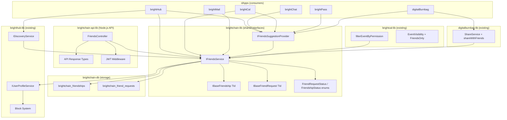
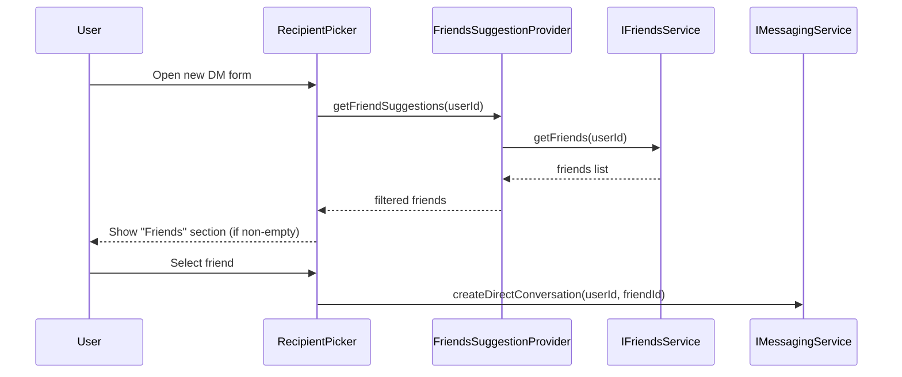
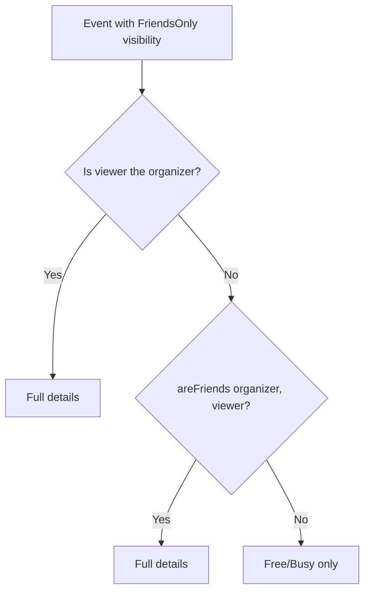

# Design Document: BrightChain Friends System

## Overview

The Friends system introduces symmetric, mutual relationships to BrightChain, complementing the existing asymmetric follow graph in brighthub-lib. Unlike follows (where A follows B unilaterally), a friendship requires explicit consent from both parties.

The system is designed as a cross-cutting concern in `brightchain-lib` so every dApp (brightHub, brightChat, brightCal, brightMail, etc.) can consume it through a single shared interface. The API layer lives in `brightchain-api-lib`, database schemas in `brightchain-db`, and all collections use the `brightchain_` prefix to distinguish them from the `brighthub_`-scoped social graph.

Key design decisions:
- **Symmetric storage**: Friendships are stored once per pair using sorted Member_IDs, avoiding duplicate rows and simplifying queries.
- **Reuse existing block system**: The Friends_Service delegates block checks to the existing `IUserProfileService.isBlocked()` rather than duplicating block logic.
- **Generic TId pattern**: All interfaces use `IBaseFriendship<TId>` / `IBaseFriendRequest<TId>` so frontend uses `string` and backend uses `GuidV4Buffer`/`Uint8Array`.
- **Auto-accept on reciprocal request**: If A sends a request to B while B already has a pending request to A, the system auto-accepts both and creates the friendship.

## Architecture



The architecture follows the existing workspace layering:
1. **brightchain-lib** owns the shared interfaces, enums, the `IFriendsService` contract, and the `IFriendsSuggestionProvider` helper consumed by all dApp recipient/attendee pickers.
2. **brightchain-api-lib** owns the Express controller, route definitions, and API response types that extend `IApiMessageResponse`.
3. **brightchain-db** owns the `CollectionSchema` definitions for `brightchain_friendships` and `brightchain_friend_requests`.
4. **brighthub-lib** is consumed (not modified) for block checks via `IUserProfileService.isBlocked()`. Its `SuggestionReason` enum and `IDiscoveryService` are extended to incorporate mutual-friends data.
5. **brightcal-lib** extends `EventVisibility` with `FriendsOnly` and updates `filterEventByPermission()` to check friendship status.
6. **digitalburnbag-lib** extends `IShareService` with `shareWithFriends()` for batch sharing.
7. **React component libraries** (brightchat-react-components, brighthub-react-components, brightpass-react-components, digitalburnbag-react-components, brightcal-react-components) each add a `FriendsSuggestionSection` component to their respective pickers.

## Components and Interfaces

### Enumerations (brightchain-lib)

```typescript
// brightchain-lib/src/lib/enumerations/friend-request-status.ts
export enum FriendRequestStatus {
  Pending = 'pending',
  Accepted = 'accepted',
  Rejected = 'rejected',
  Cancelled = 'cancelled',
}

// brightchain-lib/src/lib/enumerations/friendship-status.ts
export enum FriendshipStatus {
  None = 'none',
  PendingSent = 'pending_sent',
  PendingReceived = 'pending_received',
  Friends = 'friends',
}
```

### Data Interfaces (brightchain-lib)

```typescript
// brightchain-lib/src/lib/interfaces/friends/base-friendship.ts
export interface IBaseFriendship<TId> {
  _id: TId;
  memberIdA: TId;  // always the lexicographically smaller ID
  memberIdB: TId;  // always the lexicographically larger ID
  createdAt: TId extends string ? string : Date;
}

// brightchain-lib/src/lib/interfaces/friends/base-friend-request.ts
export interface IBaseFriendRequest<TId> {
  _id: TId;
  requesterId: TId;
  recipientId: TId;
  message?: string;
  status: FriendRequestStatus;
  createdAt: TId extends string ? string : Date;
}
```

### Error Handling (brightchain-lib)

```typescript
// brightchain-lib/src/lib/enumerations/friends-error-code.ts
export enum FriendsErrorCode {
  SelfRequestNotAllowed = 'SELF_REQUEST_NOT_ALLOWED',
  AlreadyFriends = 'ALREADY_FRIENDS',
  RequestAlreadyExists = 'REQUEST_ALREADY_EXISTS',
  RequestNotFound = 'REQUEST_NOT_FOUND',
  NotFriends = 'NOT_FRIENDS',
  UserBlocked = 'USER_BLOCKED',
  Unauthorized = 'UNAUTHORIZED',
}

// brightchain-lib/src/lib/errors/friends-service-error.ts
export class FriendsServiceError extends Error {
  constructor(
    public readonly code: FriendsErrorCode,
    message: string,
  ) {
    super(message);
    this.name = 'FriendsServiceError';
  }
}
```

### Service Interface (brightchain-lib)

```typescript
// brightchain-lib/src/lib/interfaces/friends/friends-service.ts
export interface IFriendsService {
  // Friend Requests
  sendFriendRequest(
    requesterId: string,
    recipientId: string,
    message?: string,
  ): Promise<IFriendRequestResult>;

  acceptFriendRequest(userId: string, requestId: string): Promise<void>;
  rejectFriendRequest(userId: string, requestId: string): Promise<void>;
  cancelFriendRequest(userId: string, requestId: string): Promise<void>;

  // Friendship Management
  removeFriend(userId: string, friendId: string): Promise<void>;

  // Queries
  getFriends(
    userId: string,
    options?: IPaginationOptions,
  ): Promise<IPaginatedResult<IBaseFriendship<string>>>;

  getReceivedFriendRequests(
    userId: string,
    options?: IPaginationOptions,
  ): Promise<IPaginatedResult<IBaseFriendRequest<string>>>;

  getSentFriendRequests(
    userId: string,
    options?: IPaginationOptions,
  ): Promise<IPaginatedResult<IBaseFriendRequest<string>>>;

  getFriendshipStatus(
    userId: string,
    otherUserId: string,
  ): Promise<FriendshipStatus>;

  areFriends(userIdA: string, userIdB: string): Promise<boolean>;

  getMutualFriends(
    userId: string,
    otherUserId: string,
    options?: IPaginationOptions,
  ): Promise<IPaginatedResult<IBaseFriendship<string>>>;

  // Block integration
  onUserBlocked(blockerId: string, blockedId: string): Promise<void>;
}

export interface IFriendRequestResult {
  success: boolean;
  autoAccepted?: boolean;
  friendship?: IBaseFriendship<string>;
  friendRequest?: IBaseFriendRequest<string>;
  error?: string;
}
```

The `IPaginationOptions` and `IPaginatedResult<T>` types are reused from the existing `IUserProfileService` definitions in brighthub-lib (they should be extracted to brightchain-lib if not already shared, or re-exported).

### API Response Types (brightchain-api-lib)

```typescript
// brightchain-api-lib/src/lib/interfaces/responses/api-friends-response.ts
import { IBaseFriendship, IBaseFriendRequest } from '@brightchain/brightchain-lib';
import { IApiMessageResponse } from '@digitaldefiance/node-express-suite';

export interface ApiFriendshipResponse extends IApiMessageResponse {
  friendship: IBaseFriendship<string>;
}

export interface ApiFriendRequestResponse extends IApiMessageResponse {
  friendRequest: IBaseFriendRequest<string>;
}

export interface ApiFriendsListResponse extends IApiMessageResponse {
  items: IBaseFriendship<string>[];
  cursor?: string;
  hasMore: boolean;
  totalCount: number;
}

export interface ApiFriendRequestsListResponse extends IApiMessageResponse {
  items: IBaseFriendRequest<string>[];
  cursor?: string;
  hasMore: boolean;
}

export interface ApiFriendshipStatusResponse extends IApiMessageResponse {
  status: string; // FriendshipStatus value
}

export interface ApiMutualFriendsResponse extends IApiMessageResponse {
  items: IBaseFriendship<string>[];
  cursor?: string;
  hasMore: boolean;
  totalCount: number;
}
```

### REST API Endpoints (brightchain-api-lib)

All endpoints require JWT authentication via existing middleware.

| Method | Path | Description | Request Body | Response |
|--------|------|-------------|-------------|----------|
| POST | `/friends/requests` | Send friend request | `{ recipientId, message? }` | `ApiFriendRequestResponse` |
| POST | `/friends/requests/:requestId/accept` | Accept request | — | `ApiFriendshipResponse` |
| POST | `/friends/requests/:requestId/reject` | Reject request | — | `204` |
| POST | `/friends/requests/:requestId/cancel` | Cancel request | — | `204` |
| DELETE | `/friends/:friendId` | Remove friend | — | `204` |
| GET | `/friends` | List friends | query: `cursor`, `limit` | `ApiFriendsListResponse` |
| GET | `/friends/requests/received` | Received requests | query: `cursor`, `limit` | `ApiFriendRequestsListResponse` |
| GET | `/friends/requests/sent` | Sent requests | query: `cursor`, `limit` | `ApiFriendRequestsListResponse` |
| GET | `/friends/status/:userId` | Friendship status | — | `ApiFriendshipStatusResponse` |
| GET | `/friends/mutual/:userId` | Mutual friends | query: `cursor`, `limit` | `ApiMutualFriendsResponse` |

## Data Models

### brightchain_friendships Collection

Stores one record per mutual friendship. The `memberIdA` / `memberIdB` pair is always stored in sorted order (lexicographic) to enforce uniqueness without direction.

```typescript
// brightchain-db/src/lib/schemas/brightchain/friends.schema.ts
export const FRIENDSHIPS_COLLECTION = 'brightchain_friendships';

export const FRIENDSHIPS_SCHEMA: CollectionSchema = {
  name: 'brightchain_friendship',
  properties: {
    _id: { type: 'string', required: true },
    memberIdA: { type: 'string', required: true },
    memberIdB: { type: 'string', required: true },
    createdAt: { type: 'string', required: true },
  },
  required: ['memberIdA', 'memberIdB', 'createdAt'],
  additionalProperties: false,
  validationLevel: 'strict',
  validationAction: 'error',
  indexes: [
    // Unique friendship per pair (sorted order enforced at app level)
    { fields: { memberIdA: 1, memberIdB: 1 }, options: { unique: true } },
    // Query all friends of a member (appears as either A or B)
    { fields: { memberIdA: 1, createdAt: -1 } },
    { fields: { memberIdB: 1, createdAt: -1 } },
  ],
};
```

### brightchain_friend_requests Collection

Stores friend request records with directional requester/recipient.

```typescript
export const FRIEND_REQUESTS_COLLECTION = 'brightchain_friend_requests';

export const FRIEND_REQUEST_STATUS_VALUES = [
  'pending', 'accepted', 'rejected', 'cancelled',
] as const;

export const FRIEND_REQUESTS_SCHEMA: CollectionSchema = {
  name: 'brightchain_friend_request',
  properties: {
    _id: { type: 'string', required: true },
    requesterId: { type: 'string', required: true },
    recipientId: { type: 'string', required: true },
    message: { type: 'string', maxLength: 280 },
    status: {
      type: 'string',
      required: true,
      enum: [...FRIEND_REQUEST_STATUS_VALUES],
    },
    createdAt: { type: 'string', required: true },
  },
  required: ['requesterId', 'recipientId', 'status', 'createdAt'],
  additionalProperties: false,
  validationLevel: 'strict',
  validationAction: 'error',
  indexes: [
    // Pending requests for a recipient
    { fields: { recipientId: 1, status: 1, createdAt: -1 } },
    // Requests sent by a user
    { fields: { requesterId: 1, status: 1, createdAt: -1 } },
    // Unique pending request per directional pair
    {
      fields: { requesterId: 1, recipientId: 1 },
      options: { unique: true },
    },
  ],
};
```

### Sorted-Pair Convention

When creating a friendship record, the service always sorts the two Member_IDs lexicographically:

```typescript
function sortPair(idA: string, idB: string): [string, string] {
  return idA < idB ? [idA, idB] : [idB, idA];
}
```

This ensures that regardless of which member initiated the friendship, the stored record is identical, and the unique compound index on `(memberIdA, memberIdB)` prevents duplicates.


## dApp Integration Points

The `IFriendsService` in brightchain-lib is consumed by each dApp to surface friendship data in context-appropriate ways. Each integration follows a common pattern: the dApp's UI or service layer calls `IFriendsService.getFriends()` (or `areFriends()`) and presents the results in its own recipient picker, suggestion engine, or visibility filter.

### Shared: IFriendsSuggestionProvider (brightchain-lib)

All dApps that show a "Friends" section in a recipient/attendee picker share a common data-fetching pattern. To avoid duplication, a shared helper interface is defined in brightchain-lib:

```typescript
// brightchain-lib/src/lib/interfaces/friends/friends-suggestion-provider.ts
import { IBaseFriendship } from './base-friendship';
import { IPaginatedResult, IPaginationOptions } from './friends-service';

/**
 * Provides friend suggestions for recipient/attendee pickers across dApps.
 * Wraps IFriendsService.getFriends() with search filtering.
 */
export interface IFriendsSuggestionProvider {
  /**
   * Get friends for display in a suggestion picker.
   * @param userId The member requesting suggestions
   * @param searchQuery Optional search string to filter by displayName/username
   * @param options Pagination options
   * @returns Paginated friends matching the query (or all friends if no query)
   */
  getFriendSuggestions(
    userId: string,
    searchQuery?: string,
    options?: IPaginationOptions,
  ): Promise<IPaginatedResult<IBaseFriendship<string>>>;
}
```

The implementation filters the friends list by matching `searchQuery` against display names and usernames (case-insensitive substring match). When the result is empty, the consuming UI omits the "Friends" section entirely.

### BrightChat Integration

**Files to modify:**
- `brightchat-lib/src/lib/interfaces/chatRequests.ts` — No changes needed; `SendDirectMessageParams.recipientId` already accepts the selected friend's ID.
- `brightchat-react-components/` — New `FriendsSuggestionSection` component in the DM recipient picker.

**How it works:**
1. When the user opens the "New Direct Message" form, the recipient picker component calls `IFriendsSuggestionProvider.getFriendSuggestions(currentUserId)`.
2. The "Friends" section renders above other suggestion sources (recent conversations, followed users).
3. As the user types in the search field, the component calls `getFriendSuggestions(currentUserId, searchQuery)` to filter friends by display name or username.
4. Selecting a friend populates `SendDirectMessageParams.recipientId` with the friend's member ID, then proceeds through the existing `IMessagingService.createDirectConversation()` / `createMessageRequest()` flow.
5. If the user has no friends, the "Friends" section is omitted from the picker.



### BrightHub Integration

**Files to modify:**
- `brighthub-lib/src/lib/enumerations/suggestion-reason.ts` — Add `MutualFriends = 'mutual_friends_friendship'` to `SuggestionReason` enum.
- `brighthub-lib/src/lib/interfaces/discovery-service.ts` — `getSuggestions()` implementation updated to query `IFriendsService.getMutualFriends()` and factor mutual friend count into suggestion scoring.
- `brighthub-lib/src/lib/interfaces/base-user-profile.ts` — Add optional `friendCount` field.
- `brightchain-db/src/lib/schemas/brighthub/users.schema.ts` — Add `friendCount` field to user profile schema.
- Post visibility system — Add `friends_only` to post visibility options; the feed query filters posts by checking `IFriendsService.areFriends()`.

**How it works:**

1. **Profile friend count**: The user profile schema gains a `friendCount: number` field (default 0). When a friendship is created or removed, the `IFriendsService` implementation increments/decrements both members' `friendCount`. The profile view displays this alongside follower/following counts.

2. **Discovery suggestions**: The `IDiscoveryService.getSuggestions()` implementation is extended to:
   - Call `IFriendsService.getMutualFriends(userId, candidateId)` for each candidate.
   - If mutual friends exist, set `reason: SuggestionReason.MutualFriends` and populate `mutualConnectionCount` with the mutual friend count.
   - Mutual-friends suggestions are scored higher than interest-based suggestions.

3. **Friends-only post visibility**: A new `friends_only` value is added to the post visibility enum. When a post has `friends_only` visibility, the feed query calls `IFriendsService.areFriends(postAuthorId, viewerId)` and only includes the post if the result is `true`.

4. **Friends tab on profile**: The profile view adds a "Friends" tab that calls `IFriendsService.getFriends(profileUserId)`. The tab respects the viewed user's privacy settings (a new `hideFriendsFromNonFriends` privacy flag).

### BrightPass Integration

**Files to modify:**
- `brightpass-lib/` — Currently minimal (enumerations + i18n). No service interfaces to modify.
- `brightpass-react-components/` — New `FriendsSuggestionSection` component in the credential sharing picker.

**How it works:**
1. When the user initiates sharing a credential/password, the sharing picker calls `IFriendsSuggestionProvider.getFriendSuggestions(currentUserId)`.
2. The "Friends" section renders above other suggestion sources.
3. Selecting a friend populates the share recipient with the friend's member ID.
4. If the user has no friends, the "Friends" section is omitted.

Since brightpass-lib has no existing sharing service interface, the integration is purely at the React component level, consuming `IFriendsSuggestionProvider` from brightchain-lib.

### Digital Burnbag Integration

**Files to modify:**
- `digitalburnbag-lib/src/lib/interfaces/params/share-service-params.ts` — No changes needed; `IInternalShareParams.recipientId` already accepts the friend's ID.
- `digitalburnbag-lib/src/lib/services/share-service.ts` — Add a `shareWithFriends()` method that batch-calls `shareWithUser()` for each friend.
- `digitalburnbag-react-components/` — New `FriendsSuggestionSection` component in the sharing picker, plus a "Share with Friends" quick action button.

**How it works:**
1. When the user initiates sharing a file or vault, the sharing picker calls `IFriendsSuggestionProvider.getFriendSuggestions(currentUserId)`.
2. The "Friends" section renders above other suggestion sources.
3. Selecting a friend populates `IInternalShareParams.recipientId`.
4. The "Share with Friends" quick action:
   - Calls `IFriendsService.getFriends(userId)` to get all friends.
   - Iterates and calls `ShareService.shareWithUser()` for each friend with the specified permission level.
   - Reports success/failure count to the UI.
5. If the user has no friends, both the "Friends" section and the "Share with Friends" button are omitted.

```typescript
// digitalburnbag-lib addition to IShareService
/**
 * Share a file or folder with all of the user's friends.
 * Calls shareWithUser for each friend.
 * @returns The number of friends the item was shared with.
 */
shareWithFriends(
  params: Omit<IInternalShareParams<TID>, 'recipientId'>,
  userId: TID,
): Promise<{ sharedCount: number; failedCount: number }>;
```

### BrightCal Integration

**Files to modify:**
- `brightcal-lib/src/lib/enums/EventVisibility.ts` — Add `FriendsOnly = 'FRIENDS_ONLY'` to the `EventVisibility` enum.
- `brightcal-lib/src/lib/permissions/filterByPermission.ts` — Update `filterEventByPermission()` to handle `FriendsOnly` visibility by checking `IFriendsService.areFriends(organizerId, viewerId)`.
- `brightcal-react-components/` — New `FriendsSuggestionSection` component in the attendee picker.

**How it works:**
1. **Friends-only visibility**: The `EventVisibility` enum gains a `FriendsOnly = 'FRIENDS_ONLY'` value. When an event has this visibility:
   - `filterEventByPermission()` checks `IFriendsService.areFriends(event.organizerId, viewerId)`.
   - Friends see full event details (same as `Public` visibility for friends).
   - Non-friends see only free/busy time (same as `Private` visibility for non-owners).

2. **Attendee picker**: When adding attendees to an event, the picker calls `IFriendsSuggestionProvider.getFriendSuggestions(currentUserId)` and shows a "Friends" section above other suggestions.

3. If the user has no friends, the "Friends" section is omitted from the attendee picker.



## Correctness Properties

*A property is a characteristic or behavior that should hold true across all valid executions of a system — essentially, a formal statement about what the system should do. Properties serve as the bridge between human-readable specifications and machine-verifiable correctness guarantees.*

### Property 1: Send request creates a valid pending record

*For any* two distinct member IDs and any optional message string, sending a friend request SHALL produce a `FriendRequest` with `status=pending`, the correct `requesterId` and `recipientId`, the original message preserved (or undefined), and a valid ISO timestamp.

**Validates: Requirements 1.1**

### Property 2: Self-requests are always rejected

*For any* member ID, sending a friend request where the requester and recipient are the same member SHALL throw a `FriendsServiceError` with code `SELF_REQUEST_NOT_ALLOWED`.

**Validates: Requirements 1.2**

### Property 3: Duplicate friend requests are rejected

*For any* pair of distinct member IDs where a pending friend request already exists from A to B, sending another request from A to B SHALL throw a `FriendsServiceError` with code `REQUEST_ALREADY_EXISTS`.

**Validates: Requirements 1.4**

### Property 4: Already-friends requests are rejected

*For any* pair of members who already have a `FriendRelationship`, sending a friend request in either direction SHALL throw a `FriendsServiceError` with code `ALREADY_FRIENDS`.

**Validates: Requirements 1.3**

### Property 5: Reciprocal requests auto-accept into friendship

*For any* pair of distinct member IDs (A, B), if B has a pending friend request to A and A sends a friend request to B, the service SHALL create a `FriendRelationship` between A and B, and both requests SHALL have status `accepted`.

**Validates: Requirements 1.5**

### Property 6: Blocked members cannot send friend requests

*For any* pair of members where a block exists in either direction, sending a friend request SHALL throw a `FriendsServiceError` with code `USER_BLOCKED`.

**Validates: Requirements 1.6, 10.3**

### Property 7: Accepting a request creates a valid friendship

*For any* pending friend request, when the recipient accepts it, the service SHALL create a `FriendRelationship` containing both member IDs and a valid creation timestamp, and the request status SHALL be updated to `accepted`.

**Validates: Requirements 2.1, 2.2**

### Property 8: Only the authorized party can act on a request

*For any* friend request and any member who is neither the recipient (for accept/reject) nor the requester (for cancel), attempting the operation SHALL throw a `FriendsServiceError` with code `UNAUTHORIZED`.

**Validates: Requirements 2.4, 3.3, 4.3**

### Property 9: Rejecting a request updates status to rejected

*For any* pending friend request, when the recipient rejects it, the request status SHALL be updated to `rejected` and no `FriendRelationship` SHALL be created.

**Validates: Requirements 3.1**

### Property 10: Cancelling a request updates status to cancelled

*For any* pending friend request, when the requester cancels it, the request status SHALL be updated to `cancelled`.

**Validates: Requirements 4.1**

### Property 11: Remove friendship round-trip

*For any* pair of members who are friends, removing the friendship SHALL delete the `FriendRelationship`, and subsequently sending a new friend request between the same pair SHALL succeed.

**Validates: Requirements 5.1, 5.3**

### Property 12: Friends list is ordered and complete

*For any* member with N friends, querying the friends list with pagination SHALL return all N friendships with no duplicates and no missing entries, ordered by creation timestamp descending.

**Validates: Requirements 6.1, 6.2**

### Property 13: Paginated results include accurate total count

*For any* member, the `totalCount` returned in friends list and mutual friends queries SHALL equal the actual number of matching records.

**Validates: Requirements 6.3, 9.3**

### Property 14: Received/sent request queries return only pending requests for the correct party

*For any* member with a mix of pending, accepted, rejected, and cancelled requests, querying received requests SHALL return only pending requests where the member is the recipient, and querying sent requests SHALL return only pending requests where the member is the requester, both ordered by creation timestamp descending.

**Validates: Requirements 7.1, 7.2**

### Property 15: Friendship status reflects actual relationship state

*For any* pair of members, `getFriendshipStatus` SHALL return `friends` if a `FriendRelationship` exists, `pending_sent` if a pending request exists from the querier to the other, `pending_received` if a pending request exists from the other to the querier, and `none` otherwise. The `areFriends` convenience method SHALL return `true` if and only if the status is `friends`.

**Validates: Requirements 8.1, 8.3**

### Property 16: Mutual friends equals the intersection of friend sets

*For any* two members A and B, the mutual friends query SHALL return exactly the set of members who have `FriendRelationships` with both A and B, with no extra or missing entries.

**Validates: Requirements 9.1, 9.2**

### Property 17: Blocking cleans up all friend data

*For any* pair of members, when `onUserBlocked` is called, any existing `FriendRelationship` between them SHALL be removed, and any pending `FriendRequests` between them (in either direction) SHALL have their status set to `cancelled`.

**Validates: Requirements 10.1, 10.2**

### Property 18: Friend search filtering returns correct subset

*For any* friends list and any search query string, the `getFriendSuggestions` filter SHALL return exactly the friends whose display name or username contains the query as a case-insensitive substring, with no extra or missing entries.

**Validates: Requirements 14.3**

### Property 19: Mutual friends boost discovery suggestions

*For any* pair of members with mutual friends, the `IDiscoveryService.getSuggestions()` SHALL include a suggestion with `reason: MutualFriends` and `mutualConnectionCount` equal to the actual number of mutual friends between the two members.

**Validates: Requirements 15.2**

### Property 20: Friends-only post visibility gate

*For any* post with `friends_only` visibility and any viewer member, the post SHALL be visible to the viewer if and only if `IFriendsService.areFriends(postAuthorId, viewerId)` returns `true`.

**Validates: Requirements 15.3**

### Property 21: Share with friends batch covers all friends

*For any* member with N friends (N ≥ 0), the `shareWithFriends` operation SHALL invoke `shareWithUser` exactly N times, once for each friend, and the resulting `sharedCount` SHALL equal N.

**Validates: Requirements 17.3**

### Property 22: Friends-only calendar event visibility gate

*For any* calendar event with `FriendsOnly` visibility and any non-organizer viewer, `filterEventByPermission` SHALL grant full details if and only if `IFriendsService.areFriends(organizerId, viewerId)` returns `true`, and SHALL return free/busy only otherwise.

**Validates: Requirements 18.1**

## Error Handling

All errors from the Friends_Service are thrown as `FriendsServiceError` instances with a typed `FriendsErrorCode`. The API layer catches these and maps them to HTTP status codes:

| FriendsErrorCode | HTTP Status | When |
|---|---|---|
| `SELF_REQUEST_NOT_ALLOWED` | 400 Bad Request | Attempting to friend yourself |
| `ALREADY_FRIENDS` | 409 Conflict | Friendship already exists |
| `REQUEST_ALREADY_EXISTS` | 409 Conflict | Duplicate pending request |
| `REQUEST_NOT_FOUND` | 404 Not Found | Request doesn't exist or isn't pending |
| `NOT_FRIENDS` | 404 Not Found | No friendship to remove |
| `USER_BLOCKED` | 403 Forbidden | Block exists between members |
| `UNAUTHORIZED` | 403 Forbidden | Not the authorized party for the operation |

Unhandled errors (database failures, etc.) bubble up as 500 Internal Server Error via the existing Express error middleware.

The API controller validates request parameters (e.g., valid UUID format for member IDs) using `express-validator` before invoking the service layer, returning 400 for malformed input.

## Testing Strategy

### Unit Tests (example-based)

- Edge cases for non-existent or non-pending request operations (Requirements 2.3, 3.2, 4.2, 5.2)
- Friendship status priority when both friendship and pending request exist (Requirement 8.2)
- Schema validation: verify `FRIENDSHIPS_SCHEMA` and `FRIEND_REQUESTS_SCHEMA` have correct collection names, fields, and indexes (Requirements 12.1–12.4)
- Compile-time type checks for `IBaseFriendship<string>`, `IBaseFriendRequest<string>`, `IFriendsService` (Requirements 11.1–11.4)
- BrightChat: recipient picker renders "Friends" section above other sources when friends exist, omits it when empty (Requirements 14.1, 14.2, 14.4)
- BrightHub: profile displays `friendCount`, "Friends" tab respects privacy settings (Requirements 15.1, 15.4)
- BrightPass: sharing picker renders "Friends" section, omits when empty (Requirements 16.1, 16.2, 16.3)
- Digital Burnbag: sharing picker renders "Friends" section, "Share with Friends" button hidden when no friends (Requirements 17.1, 17.2, 17.4)
- BrightCal: attendee picker renders "Friends" section above other sources, omits when empty (Requirements 18.2, 18.3, 18.4)

### Integration Tests

- REST endpoint routing: verify all `/friends` endpoints exist and respond (Requirements 13.1–13.3)
- JWT authentication: verify unauthenticated requests return 401 (Requirements 13.4, 13.5)
- End-to-end friend request lifecycle through the API layer
- BrightHub discovery: verify `MutualFriends` suggestion reason appears for users with mutual friends
- Digital Burnbag: verify `shareWithFriends` creates ACL entries for all friends
- BrightCal: verify `FriendsOnly` event visibility filters correctly through the permission system

### Property-Based Tests

The project already has `fast-check` (v4.7.0) as a dev dependency. Each property test will:
- Run a minimum of 100 iterations
- Be tagged with a comment referencing the design property
- Tag format: `Feature: brightchain-friends-system, Property {number}: {title}`

Properties 1–22 from the Correctness Properties section above will each be implemented as a single `fast-check` property test against the relevant service implementation, using in-memory mocks for the database layer and external dependencies.

Key generators needed:
- `arbMemberId()`: generates random UUID v4 strings
- `arbMessage()`: generates optional strings up to 280 characters
- `arbFriendGraph(n)`: generates a random social graph of n members with friendships and pending requests for testing queries and mutual friends
- `arbSearchQuery()`: generates random search strings for friend filtering tests
- `arbFriendsList(n)`: generates a list of n friends with random display names and usernames for search filtering tests
- `arbPostVisibility()`: generates random post visibility values including `friends_only`
- `arbCalendarEvent()`: generates random calendar events with `FriendsOnly` visibility for permission filter tests
