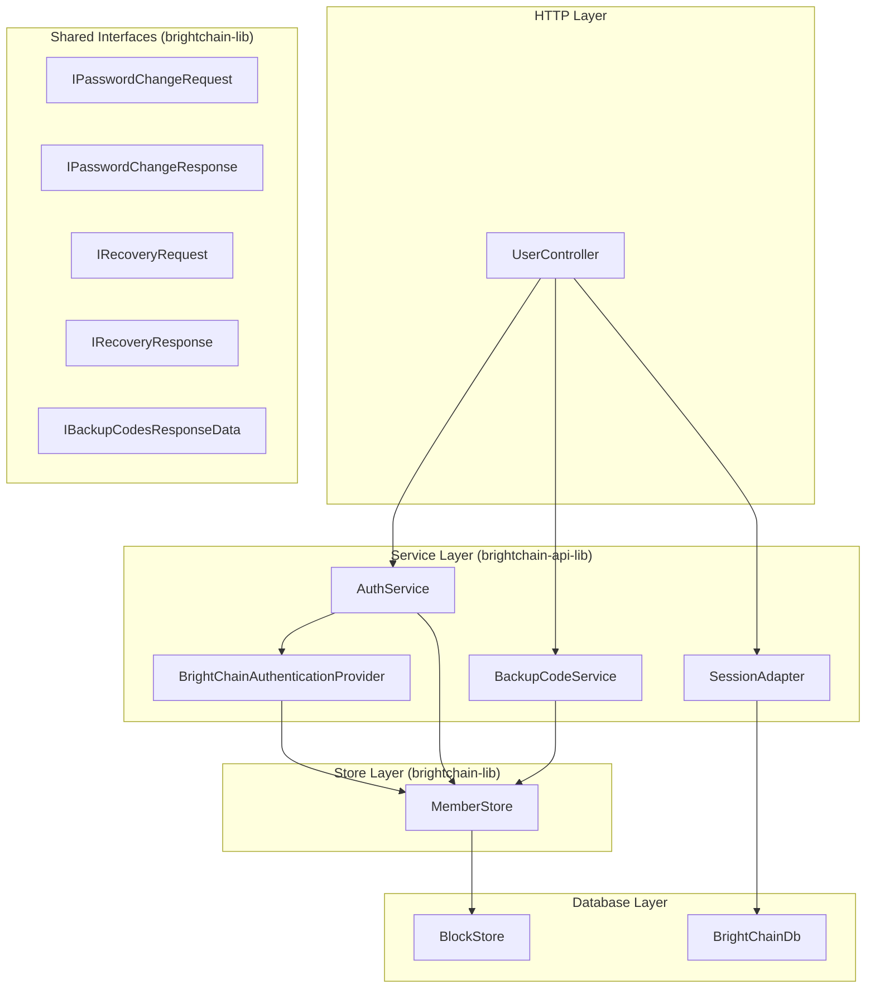

# Design Document: BrightChain User Management

## Overview

This feature completes the BrightChain user management layer by filling gaps left after the migration from Mongoose/MongoDB to the custom BrightChainDb block-store backend. The existing codebase already provides:

- **UserController** (`brightchain-api-lib/src/lib/controllers/api/user.ts`) — `POST /register`, `POST /login`, `GET /profile`, `PUT /profile`
- **AuthService** (`brightchain-api-lib/src/lib/services/auth.ts`) — registration, login, JWT signing/verification, password hash storage via MemberStore
- **BrightChainAuthenticationProvider** (`brightchain-api-lib/src/lib/services/brightchain-authentication-provider.ts`) — `IAuthenticationProvider` implementation with `authenticateWithMnemonic` and `authenticateWithPassword`
- **MemberStore** (`brightchain-lib/src/lib/services/memberStore.ts`) — member CRUD, profile storage, index queries by name/email
- **Environment** (`brightchain-api-lib/src/lib/environment.ts`) — reads `USE_MEMORY_DOCSTORE`, `BRIGHTCHAIN_BLOCKSTORE_PATH`, etc.
- **databaseInit** (`brightchain-api-lib/src/lib/databaseInit.ts`) — creates BlockStore, BrightChainDb, MemberStore, EnergyAccountStore
- **Shared interfaces** in `brightchain-lib/src/lib/interfaces/userDto.ts` — `IAuthResponse<TID>`, `IUserProfile<TID>`, `IRegistrationRequest`, `ILoginRequest`
- **Existing response data interfaces** — `IBackupCodesResponseData`, `ICodeCountResponseData`, `IMnemonicResponseData` in `brightchain-lib`
- **API response wrappers** — `IApiBackupCodesResponse`, `IApiCodeCountResponse` in `brightchain-api-lib`

This design adds: password change, backup code management, mnemonic recovery, a BrightChainDb session adapter, new controller endpoints, `DEV_DATABASE` environment unification, shared generic interfaces, Playwright e2e tests, and round-trip property tests for user document serialization.

## Architecture

The architecture follows the existing layered pattern:



### Design Decisions

1. **BackupCodeService lives in `brightchain-api-lib`** — it depends on bcrypt (Node.js-only) for hashing codes. The data interfaces (`IBackupCodesResponseData`, `ICodeCountResponseData`) already live in `brightchain-lib`.

2. **SessionAdapter lives in `brightchain-api-lib`** — it depends on BrightChainDb collections directly. It implements a new `ISessionAdapter` interface defined locally (no upstream `ISessionAdapter` exists in express-suite; the upstream uses Mongoose sessions via `MongooseSessionAdapter` which implements `IClientSession`). Our adapter manages HTTP session documents, not database transaction sessions.

3. **Password change and mnemonic recovery are AuthService methods** — they follow the existing pattern where AuthService orchestrates credential operations against MemberStore.

4. **`DEV_DATABASE` replaces `USE_MEMORY_DOCSTORE`** — the Environment class already reads `USE_MEMORY_DOCSTORE` as a boolean. We change it to read `DEV_DATABASE` as a string (pool name) and derive `useMemoryDocumentStore` from its presence, matching the express-suite pattern.

5. **Shared interfaces use `<TId>` generic** — following the workspace convention where `TId` is `string` on the frontend and `Uint8Array`/`Checksum` on the backend.

6. **Backup codes are bcrypt-hashed for storage** — raw codes are returned once at generation time. Validation compares submitted codes against stored hashes using `bcrypt.compare`.

## Components and Interfaces

### 1. New Shared Interfaces (brightchain-lib)

Added to `brightchain-lib/src/lib/interfaces/userDto.ts` (or a new `userManagement.ts` file alongside it):

```typescript
/** Password change request — shared between frontend and backend. */
export interface IPasswordChangeRequest {
  currentPassword: string;
  newPassword: string;
}

/** Password change response — TId is string (frontend) or Uint8Array (backend). */
export interface IPasswordChangeResponse<TId = string> {
  memberId: TId;
  success: boolean;
}

/** Mnemonic recovery request — shared between frontend and backend. */
export interface IRecoveryRequest {
  email: string;
  mnemonic: string;
  newPassword?: string;
}

/** Mnemonic recovery response — TId is string (frontend) or Uint8Array (backend). */
export interface IRecoveryResponse<TId = string> {
  token: string;
  memberId: TId;
  passwordReset: boolean;
}
```

The existing `IBackupCodesResponseData` and `ICodeCountResponseData` in `brightchain-lib/src/lib/interfaces/responses/` already cover backup code data shapes. We extend `IBackupCodesResponseData` to include `count`:

```typescript
/** Extended backup codes response data with count. */
export interface IBackupCodesResponseData {
  backupCodes: string[];
  count: number;
}
```

### 2. New API Response Interfaces (brightchain-api-lib)

Added to `brightchain-api-lib/src/lib/interfaces/responses/`:

```typescript
import { IApiMessageResponse } from '@digitaldefiance/node-express-suite';
import { IPasswordChangeResponse, IRecoveryResponse } from '@brightchain/brightchain-lib';

export interface IApiPasswordChangeResponse extends IApiMessageResponse {
  data: IPasswordChangeResponse<string>;
}

export interface IApiRecoveryResponse extends IApiMessageResponse {
  data: IRecoveryResponse<string>;
}
```

### 3. AuthService Extensions

New methods added to the existing `AuthService` class:

```typescript
class AuthService {
  // Existing: register, login, signToken, verifyToken, storePasswordHash, getPasswordHash

  /** Verify current password, hash new password, persist via MemberStore. */
  async changePassword(memberId: Uint8Array, currentPassword: string, newPassword: string): Promise<void>;

  /** Authenticate with mnemonic via BrightChainAuthenticationProvider, issue JWT. */
  async recoverWithMnemonic(email: string, mnemonic: SecureString, newPassword?: string): Promise<IRecoveryResponse<string>>;
}
```

`changePassword` flow:
1. Retrieve stored hash via `getPasswordHash(memberId)`
2. `bcrypt.compare(currentPassword, storedHash)` — throw "Invalid credentials" on mismatch
3. `bcrypt.hash(newPassword, BCRYPT_ROUNDS)`
4. `storePasswordHash(memberId, newHash)`

`recoverWithMnemonic` flow:
1. Call `BrightChainAuthenticationProvider.authenticateWithMnemonic(email, mnemonic)`
2. On success, sign a JWT via `signToken`
3. If `newPassword` provided, hash and persist via `storePasswordHash`
4. Return `{ token, memberId, passwordReset: !!newPassword }`

### 4. BackupCodeService (new, brightchain-api-lib)

```typescript
class BackupCodeService {
  constructor(memberStore: MemberStore, bcryptRounds?: number);

  /** Generate 10 codes, bcrypt-hash each, store hashes in member profile, return plaintext codes. */
  async generateCodes(memberId: Uint8Array): Promise<string[]>;

  /** Return count of unused (not-yet-consumed) backup code hashes. */
  async getCodeCount(memberId: Uint8Array): Promise<number>;

  /** Compare submitted code against stored hashes; mark matched hash as used. */
  async validateCode(memberId: Uint8Array, code: string): Promise<boolean>;

  /** Invalidate all existing codes, generate fresh set. */
  async regenerateCodes(memberId: Uint8Array): Promise<string[]>;
}
```

Storage: backup code hashes are stored in the member's private profile under a `backupCodes` array of `{ hash: string; used: boolean }` objects, persisted via `MemberStore.updateMember`.

Code generation uses `crypto.randomBytes(8)` formatted as `XXXX-XXXX-XXXX-XXXX` hex groups (matching the existing `IBackupCodeConstants.DisplayRegex`).

### 5. SessionAdapter (new, brightchain-api-lib)

```typescript
interface ISessionDocument {
  sessionId: string;
  memberId: string;
  tokenHash: string;
  createdAt: number;   // epoch ms
  expiresAt: number;   // epoch ms
}

class BrightChainSessionAdapter {
  constructor(db: BrightChainDb);

  async createSession(memberId: string, token: string, ttlMs: number): Promise<string>;
  async getSession(sessionId: string): Promise<ISessionDocument | null>;
  async validateToken(token: string): Promise<ISessionDocument | null>;
  async deleteSession(sessionId: string): Promise<void>;
  async cleanExpired(): Promise<number>;
}
```

Sessions are stored in a `sessions` collection in BrightChainDb. Token hashes use SHA-256 (not bcrypt — sessions need fast lookup by hash). `validateToken` hashes the incoming token and queries the collection by `tokenHash`, checking expiration.

### 6. UserController Endpoint Expansion

New route definitions added to `UserController.initRouteDefinitions()`:

| Method | Path | Handler | Auth Required |
|--------|------|---------|---------------|
| PUT | `/user/password` | `handleChangePassword` | Yes |
| POST | `/user/backup-codes` | `handleGenerateBackupCodes` | Yes |
| GET | `/user/backup-codes/count` | `handleBackupCodeCount` | Yes |
| POST | `/auth/recover` | `handleRecover` | No |
| POST | `/auth/logout` | `handleLogout` | Yes |

Note: The `/auth/recover` and `/auth/logout` endpoints are mounted under `/user` in the router (since UserController is mounted at `/user`), so the actual paths become `/user/auth/recover` and `/user/auth/logout`. Alternatively, we can mount a separate `AuthController` at `/auth` — but to minimize changes, we add them to UserController with paths `/recover` and `/logout` (yielding `/user/recover` and `/user/logout`).

**Decision**: Add all new endpoints to UserController. The paths become:
- `PUT /api/user/password`
- `POST /api/user/backup-codes`
- `GET /api/user/backup-codes/count`
- `POST /api/user/recover` (no auth)
- `POST /api/user/logout` (auth required)

### 7. Environment / DEV_DATABASE Unification

Changes to `Environment` constructor:

```typescript
// Before:
this._useMemoryDocumentStore = Boolean(envObj['USE_MEMORY_DOCSTORE']);

// After:
const devDatabase = envObj['DEV_DATABASE'];
this._devDatabasePoolName = devDatabase && devDatabase.trim() !== '' ? devDatabase.trim() : undefined;
this._useMemoryDocumentStore = this._devDatabasePoolName !== undefined;
```

New getter:
```typescript
get devDatabasePoolName(): string | undefined { return this._devDatabasePoolName; }
```

The `useMemoryDocumentStore` getter already falls back to `!this._blockStorePath`, so it continues to work. The `USE_MEMORY_DOCSTORE` env var is deprecated — the getter derives from `DEV_DATABASE` presence.

Changes to `brightchainDatabaseInit`:
- When `environment.devDatabasePoolName` is set: create MemoryBlockStore, use pool name for logging
- When not set and `blockStorePath` exists: create DiskBlockStore (existing behavior)
- When neither is set: throw descriptive error (Requirement 6.3)

### 8. Validation Functions

New validation functions in `brightchain-api-lib/src/lib/validation/userValidation.ts`:

```typescript
export function validatePasswordChange(body: unknown): IValidationResult;
export function validateRecovery(body: unknown): IValidationResult;
```

`validatePasswordChange`: requires `currentPassword` (string, non-empty) and `newPassword` (string, ≥8 chars).
`validateRecovery`: requires `email` (valid format) and `mnemonic` (string, non-empty); `newPassword` optional but if present must be ≥8 chars.

## Data Models

### Member Private Profile (existing, extended)

The member's private profile (stored as a CBL block in MemberStore) gains a `backupCodes` field:

```typescript
interface IPrivateMemberProfileHydratedData<TID> {
  // ... existing fields: trustedPeers, blockedPeers, settings, activityLog, etc.
  passwordHash?: string;
  backupCodes?: IStoredBackupCode[];
}

interface IStoredBackupCode {
  hash: string;      // bcrypt hash of the plaintext code
  used: boolean;     // true once consumed
  createdAt: number; // epoch ms
}
```

### Session Document

```typescript
interface ISessionDocument {
  sessionId: string;    // UUID v4
  memberId: string;     // hex string of member ID
  tokenHash: string;    // SHA-256 hex of the JWT token
  createdAt: number;    // epoch ms
  expiresAt: number;    // epoch ms
}
```

Stored in BrightChainDb `sessions` collection. Indexed by `tokenHash` for fast lookup during token validation.

### Environment Configuration

| Variable | Type | Description |
|----------|------|-------------|
| `DEV_DATABASE` | string | If non-empty, pool name for in-memory store |
| `BRIGHTCHAIN_BLOCKSTORE_PATH` | string | Path for disk-based store (required when `DEV_DATABASE` not set) |
| `USE_MEMORY_DOCSTORE` | boolean | **Deprecated** — derived from `DEV_DATABASE` |


## Correctness Properties

*A property is a characteristic or behavior that should hold true across all valid executions of a system — essentially, a formal statement about what the system should do. Properties serve as the bridge between human-readable specifications and machine-verifiable correctness guarantees.*

### Property 1: Password change round-trip

*For any* authenticated member with a stored password hash, and any valid new password (≥8 characters), calling `changePassword` with the correct current password and the new password, then calling `bcrypt.compare(newPassword, getPasswordHash(memberId))` should return `true`.

**Validates: Requirements 1.1**

### Property 2: Wrong password preserves stored hash

*For any* authenticated member with a stored password hash, and any string that is not the current password, calling `changePassword` with that incorrect string should throw "Invalid credentials" and the stored hash should remain identical to the hash before the call.

**Validates: Requirements 1.2**

### Property 3: Password policy validation rejects short passwords

*For any* string with length less than 8, `validatePasswordChange({ currentPassword: validPassword, newPassword: shortString })` should return `{ valid: false }` with an error on the `newPassword` field.

**Validates: Requirements 1.3**

### Property 4: Backup code generation invariant

*For any* member, calling `generateCodes(memberId)` should return exactly 10 distinct plaintext codes, and immediately calling `getCodeCount(memberId)` should return 10.

**Validates: Requirements 2.1, 2.2**

### Property 5: Valid backup code authentication succeeds and decrements count

*For any* member with generated backup codes, and any one of those plaintext codes that has not been used, calling `validateCode(memberId, code)` should return `true`, and the subsequent `getCodeCount(memberId)` should return one less than before.

**Validates: Requirements 2.3**

### Property 6: Used or invalid backup codes are rejected

*For any* member with generated backup codes, and any code that has already been used OR any random string not in the generated set, calling `validateCode(memberId, code)` should return `false`.

**Validates: Requirements 2.4**

### Property 7: Backup code regeneration invalidates old codes

*For any* member with existing backup codes, calling `regenerateCodes(memberId)` should return 10 new codes, the new count should be 10, and every previously-generated code should now be rejected by `validateCode`.

**Validates: Requirements 2.5**

### Property 8: Backup codes stored as bcrypt hashes

*For any* member after `generateCodes(memberId)`, the stored backup code entries in the member's private profile should all have `hash` fields matching the bcrypt pattern `/^\$2[aby]\$/` and none should equal any of the returned plaintext codes.

**Validates: Requirements 2.6**

### Property 9: Mnemonic recovery round-trip

*For any* member created via `register` (capturing the returned mnemonic), calling `recoverWithMnemonic(email, mnemonic, newPassword)` should return a response with a valid JWT token, the correct `memberId`, and `passwordReset: true`. Subsequently, `bcrypt.compare(newPassword, getPasswordHash(memberId))` should return `true`.

**Validates: Requirements 3.1, 3.2, 3.5**

### Property 10: Invalid mnemonic rejected

*For any* registered member and any mnemonic phrase that is not the member's actual mnemonic, calling `recoverWithMnemonic(email, wrongMnemonic)` should throw "Invalid credentials".

**Validates: Requirements 3.3**

### Property 11: Session create-validate round-trip

*For any* member ID and JWT token string, calling `createSession(memberId, token, ttl)` then `validateToken(token)` (before expiration) should return a session document with the correct `memberId`, a `tokenHash` matching `SHA256(token)`, and `createdAt` ≤ now ≤ `expiresAt`.

**Validates: Requirements 4.2, 4.3**

### Property 12: Expired or missing token returns null

*For any* session that has been created with a TTL that has elapsed (expired), or any random token string that was never used to create a session, calling `validateToken(token)` should return `null`.

**Validates: Requirements 4.4**

### Property 13: Session deletion invalidates token

*For any* active session, calling `deleteSession(sessionId)` then `validateToken(originalToken)` should return `null`.

**Validates: Requirements 4.5**

### Property 14: cleanExpired removes only expired sessions

*For any* set of sessions with mixed expiration timestamps (some in the past, some in the future), calling `cleanExpired()` should remove exactly those sessions whose `expiresAt` is in the past, and all non-expired sessions should remain retrievable via `validateToken`.

**Validates: Requirements 4.6**

### Property 15: Unauthenticated requests return 401

*For any* authenticated endpoint in UserController, and any request that lacks a valid JWT token (missing, malformed, or expired), the response status code should be 401.

**Validates: Requirements 5.6**

### Property 16: DEV_DATABASE controls useMemoryDocumentStore

*For any* environment configuration object, `useMemoryDocumentStore` should be `true` if and only if `DEV_DATABASE` is a non-empty string. When `DEV_DATABASE` is set, `devDatabasePoolName` should equal the trimmed value.

**Validates: Requirements 6.1, 6.2, 6.4**

### Property 17: Member creation round-trip

*For any* valid member creation input (name, email, type), creating a member via `MemberStore.createMember` then retrieving via `MemberStore.getMember` should produce a member whose `name`, `email`, `type`, and `publicKey` match the original input.

**Validates: Requirements 9.1**

### Property 18: Profile update round-trip

*For any* valid profile update input (settings changes), updating a member profile via `MemberStore.updateMember` then retrieving via `MemberStore.getMemberProfile` should produce a profile whose updated fields match the input.

**Validates: Requirements 9.2**

### Property 19: Password hash storage round-trip

*For any* valid bcrypt hash string, storing it via `AuthService.storePasswordHash(memberId, hash)` then retrieving via `AuthService.getPasswordHash(memberId)` should return the identical hash string.

**Validates: Requirements 9.3**

## Error Handling

### AuthService Errors

| Scenario | Error | HTTP Status |
|----------|-------|-------------|
| Wrong current password on change | `Error('Invalid credentials')` | 401 |
| New password fails policy | Validation error (never reaches AuthService) | 400 |
| MemberStore persistence failure | Propagated error | 500 |
| Invalid mnemonic | `Error('Invalid credentials')` | 401 |
| Unknown email on recovery | `Error('Invalid credentials')` (same message — no email enumeration) | 401 |
| Empty password value | `Error('Password value is empty')` | 400 |

### BackupCodeService Errors

| Scenario | Error | HTTP Status |
|----------|-------|-------------|
| Member not found | `Error('Member not found')` | 404 |
| No backup codes stored | `Error('No backup codes found')` | 404 |
| MemberStore update failure | Propagated error | 500 |

### SessionAdapter Errors

| Scenario | Error | HTTP Status |
|----------|-------|-------------|
| Session not found | Returns `null` (not an error) | 401 (at controller level) |
| Session expired | Returns `null` | 401 |
| BrightChainDb write failure | Propagated error | 500 |

### Validation Errors

All validation functions return `{ valid: false, errors: [...] }` with field-level error messages. The controller returns 400 with the errors array in the response body, matching the existing pattern in `handleRegister` and `handleLogin`.

### Error Message Consistency

Recovery and login endpoints must return the same generic "Invalid credentials" message for all failure modes (wrong password, wrong mnemonic, unknown email) to prevent information leakage about which accounts exist.

## Testing Strategy

### Property-Based Testing

**Library**: `fast-check` (already available in the project's test infrastructure via jest)

**Configuration**: Each property test runs a minimum of 100 iterations.

**Tag format**: Each test is tagged with a comment: `// Feature: brightchain-user-management, Property N: <title>`

Each correctness property (1–19) maps to exactly one property-based test. The tests are organized as:

- `brightchain-api-lib/src/__tests__/services/authService.password.property.spec.ts` — Properties 1, 2, 3
- `brightchain-api-lib/src/__tests__/services/backupCodeService.property.spec.ts` — Properties 4, 5, 6, 7, 8
- `brightchain-api-lib/src/__tests__/services/authService.recovery.property.spec.ts` — Properties 9, 10
- `brightchain-api-lib/src/__tests__/services/sessionAdapter.property.spec.ts` — Properties 11, 12, 13, 14
- `brightchain-api-lib/src/__tests__/controllers/userController.auth.property.spec.ts` — Property 15
- `brightchain-api-lib/src/__tests__/services/environment.property.spec.ts` — Property 16
- `brightchain-lib/src/__tests__/memberStore.roundtrip.property.spec.ts` — Properties 17, 18, 19

**Generators**: Custom `fast-check` arbitraries for:
- Valid passwords (strings ≥8 chars with mixed character classes)
- Invalid passwords (strings <8 chars, empty strings, whitespace-only)
- Email addresses (valid format strings)
- Mnemonic phrases (12/24 word BIP39-compatible phrases)
- Backup codes (hex strings in `XXXX-XXXX-XXXX-XXXX` format)
- Environment config objects (with/without `DEV_DATABASE`, with/without `BRIGHTCHAIN_BLOCKSTORE_PATH`)
- Member creation inputs (name, email, MemberType)
- Profile update inputs (settings objects)

### Unit Tests

Unit tests cover specific examples, edge cases, and error conditions not suited to property-based testing:

- **Password change**: 200 response on success (1.4), 500 on MemberStore failure (1.5)
- **Recovery**: Unknown email returns same error as invalid mnemonic (3.4), DEV_DATABASE not set and no blockstore path fails with descriptive error (6.3)
- **Controller endpoints**: Each new endpoint exists and returns expected status codes (5.1–5.5)
- **Validation**: Specific edge cases for validation functions (empty body, missing fields, boundary-length passwords)

### End-to-End Tests (Playwright)

Located in `brightchain-api-e2e/src/brightchain-api/user-management.e2e.spec.ts`:

- Server started with `DEV_DATABASE=test-pool` for in-memory backend
- Tests exercise the full HTTP lifecycle: register → login → profile → password change → backup codes → mnemonic recovery → logout
- No mocks — real BrightChainDb in-memory backend
- Each e2e test maps to Requirements 8.2–8.9

### Test Execution

All tests run via Nx:
```bash
# Property tests
NX_TUI=false npx nx run brightchain-api-lib:test --testFile=src/__tests__/services/authService.password.property.spec.ts --outputStyle=stream
NX_TUI=false npx nx run brightchain-lib:test --testFile=src/__tests__/memberStore.roundtrip.property.spec.ts --outputStyle=stream

# E2E tests
NX_TUI=false npx nx run brightchain-api-e2e:e2e --outputStyle=stream
```
