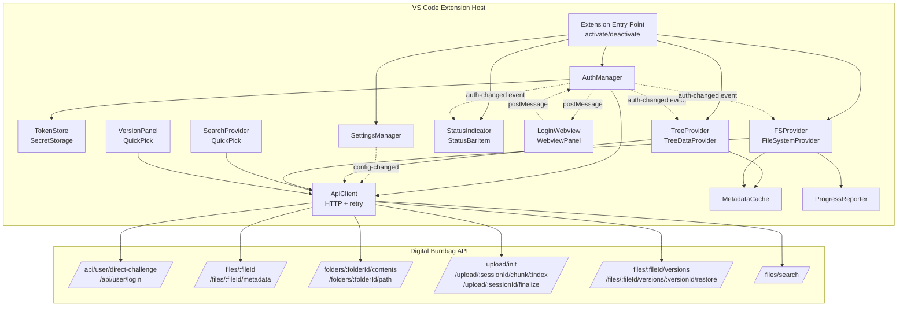
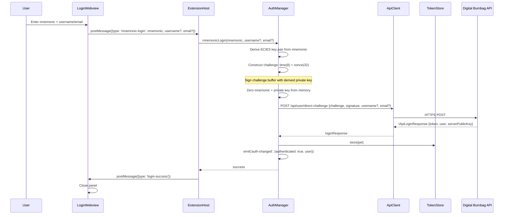
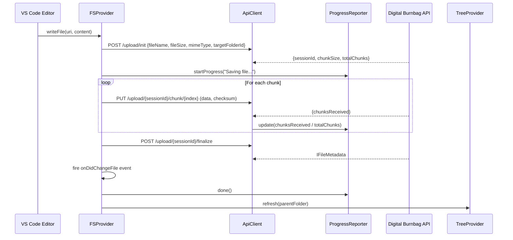

# Design Document: BrightChain VFS Explorer

## Overview

The BrightChain VFS Explorer is a VS Code extension that acts as a native client for the Digital Burnbag File Platform API. It provides folder browsing, file operations (open, save, upload, download), version history, search, and authentication — all within the VS Code editor. The extension integrates deeply with VS Code APIs: `TreeDataProvider` for sidebar navigation, `FileSystemProvider` for the `brightchain://` URI scheme enabling native file open/save, `SecretStorage` for JWT persistence, Webview panels for login UI, and the Progress API for upload/download feedback.

The extension lives in the existing Nx monorepo as a new workspace package (`brightchain-vfs-explorer`). It consumes DTO interfaces from `digitalburnbag-lib` (which uses the `<TID extends PlatformID>` generic pattern — the extension uses `string` as its TID). Node.js-specific utilities (e.g., crypto for ECIES key derivation) are imported from existing packages. The extension itself contains only VS Code-specific code: providers, webview panels, API client, and state management.

### Key Design Decisions

| Decision | Rationale |
|---|---|
| New Nx workspace package `brightchain-vfs-explorer` | Keeps VS Code extension code isolated; follows monorepo conventions |
| DTO interfaces from `digitalburnbag-lib` with `string` TID | Reuses existing typed interfaces; extension is a frontend consumer |
| `brightchain://` URI scheme via FileSystemProvider | Enables native VS Code file operations (open, save, diff, drag-drop) |
| Webview-only login UI with postMessage | VS Code security model: webviews cannot access Node.js APIs or make direct HTTP calls |
| VS Code SecretStorage for JWT tokens | OS-level credential storage; survives restarts; no plaintext on disk |
| Event-driven auth state propagation | Single source of truth (AuthManager) drives TreeProvider, StatusIndicator, FSProvider updates |
| Metadata cache with TTL | Reduces API calls for repeated `stat`/`readDirectory`; invalidated on write operations |
| Chunked upload reusing platform flow | Matches server-side `POST /upload/init` → `PUT /chunk` → `POST /finalize` pattern |
| Mnemonic/private key zeroed after use | Security requirement: sensitive key material must not persist in memory |

## Architecture

### System Architecture



### Authentication Flow: Mnemonic Direct-Challenge



### File Write Flow (Save in Editor → Chunked Upload)



### URI Encoding Scheme

The `brightchain://` URI scheme encodes file and folder identifiers:

```
Files:       brightchain://files/{fileId}/{fileName}
Folders:     brightchain://folders/{folderId}/
Root:        brightchain://folders/root/

Examples:
  brightchain://files/a1b2c3d4-e5f6-7890-abcd-ef1234567890/report.pdf
  brightchain://folders/f9e8d7c6-b5a4-3210-fedc-ba0987654321/
```

- `authority` segment distinguishes files from folders
- `fileId` / `folderId` is the first path segment (UUID string)
- `fileName` is the second path segment for files (used for display and MIME detection)
- Folder URIs end with `/` to distinguish from files

Parsing logic:

```typescript
interface IParsedBrightchainUri {
  type: 'file' | 'folder';
  id: string;        // UUID
  name?: string;     // fileName for files, folder name for folders
}

function parseBrightchainUri(uri: vscode.Uri): IParsedBrightchainUri {
  // uri.authority = 'files' | 'folders'
  // uri.path = '/{id}/{name}' for files, '/{id}/' for folders
  const type = uri.authority === 'files' ? 'file' : 'folder';
  const segments = uri.path.split('/').filter(Boolean);
  return { type, id: segments[0], name: segments[1] };
}

function toFileUri(fileId: string, fileName: string): vscode.Uri {
  return vscode.Uri.parse(`brightchain://files/${fileId}/${encodeURIComponent(fileName)}`);
}

function toFolderUri(folderId: string): vscode.Uri {
  return vscode.Uri.parse(`brightchain://folders/${folderId}/`);
}
```

## Components and Interfaces

### Package Structure

```
brightchain-vfs-explorer/
├── src/
│   ├── extension.ts              # activate() / deactivate()
│   ├── auth/
│   │   ├── auth-manager.ts       # AuthManager class
│   │   ├── token-store.ts        # TokenStore (SecretStorage wrapper)
│   │   └── types.ts              # Auth event types
│   ├── api/
│   │   ├── api-client.ts         # ApiClient (HTTP, retry, rate-limit)
│   │   └── types.ts              # API request/response types
│   ├── providers/
│   │   ├── tree-provider.ts      # BrightchainTreeProvider
│   │   ├── fs-provider.ts        # BrightchainFSProvider
│   │   └── tree-item.ts          # BrightchainTreeItem
│   ├── ui/
│   │   ├── login-webview.ts      # LoginWebview panel
│   │   ├── status-indicator.ts   # StatusBarItem manager
│   │   ├── progress-reporter.ts  # Progress notification wrapper
│   │   └── webview-html/         # HTML/CSS/JS for webview
│   ├── services/
│   │   ├── settings-manager.ts   # Configuration reader + validator
│   │   ├── metadata-cache.ts     # TTL cache for stat/readDirectory
│   │   ├── search-provider.ts    # QuickPick search integration
│   │   └── version-panel.ts      # Version history QuickPick
│   ├── util/
│   │   ├── uri.ts                # URI parse/build helpers
│   │   └── disposable.ts         # Disposable management
│   └── test/
│       ├── unit/                  # Unit tests
│       └── property/             # Property-based tests
├── package.json                  # VS Code extension manifest
├── project.json                  # Nx project config
├── tsconfig.json
├── tsconfig.lib.json
└── tsconfig.spec.json
```

### Extension Entry Point

```typescript
// extension.ts
import * as vscode from 'vscode';

export async function activate(context: vscode.ExtensionContext): Promise<void> {
  const settingsManager = new SettingsManager();
  const tokenStore = new TokenStore(context.secrets);
  const authManager = new AuthManager(tokenStore, settingsManager);
  const apiClient = new ApiClient(settingsManager, authManager);
  const metadataCache = new MetadataCache();

  const treeProvider = new BrightchainTreeProvider(apiClient, authManager, metadataCache);
  const fsProvider = new BrightchainFSProvider(apiClient, metadataCache);
  const statusIndicator = new StatusIndicator(authManager);
  const loginWebview = new LoginWebview(context.extensionUri, authManager);
  const searchProvider = new SearchProvider(apiClient);
  const versionPanel = new VersionPanel(apiClient);
  const progressReporter = new ProgressReporter();

  // Register providers
  context.subscriptions.push(
    vscode.window.registerTreeDataProvider('brightchain-explorer', treeProvider),
    vscode.workspace.registerFileSystemProvider('brightchain', fsProvider, { isCaseSensitive: true }),
    statusIndicator,
    // ... register commands
  );

  // Restore session on activation
  await authManager.restoreSession();
}

export function deactivate(): void {
  // Cleanup handled by disposables
}
```

### AuthManager

```typescript
interface IAuthState {
  authenticated: boolean;
  user?: IRequestUserDTO;
  serverPublicKey?: string;
}

type AuthEvent = 'auth-changed';

class AuthManager extends vscode.Disposable {
  private readonly _onAuthChanged = new vscode.EventEmitter<IAuthState>();
  readonly onAuthChanged: vscode.Event<IAuthState> = this._onAuthChanged.event;

  constructor(
    private readonly tokenStore: TokenStore,
    private readonly settingsManager: SettingsManager,
  ) { ... }

  /** Restore session from stored token on activation */
  async restoreSession(): Promise<void>;

  /** Mnemonic direct-challenge login */
  async mnemonicLogin(mnemonic: string, username?: string, email?: string): Promise<void>;

  /** Password login */
  async passwordLogin(usernameOrEmail: string, password: string): Promise<void>;

  /** Logout: clear token, emit event */
  async logout(): Promise<void>;

  /** Get current JWT token (or null) */
  async getToken(): Promise<string | null>;

  /** Handle 401 from API */
  async handleUnauthorized(): Promise<void>;

  get state(): IAuthState;
}
```

### ApiClient

```typescript
interface IApiClientConfig {
  maxRetries: number;       // default 2 for 5xx, 3 for chunk uploads
  baseRetryDelayMs: number; // default 1000
}

class ApiClient extends vscode.Disposable {
  constructor(
    private readonly settings: SettingsManager,
    private readonly auth: AuthManager,
  ) { ... }

  // File operations
  async getFileContent(fileId: string): Promise<Uint8Array>;
  async getFileMetadata(fileId: string): Promise<IFileMetadataDTO>;
  async updateFile(fileId: string, updates: Partial<IFileMetadataUpdate>): Promise<IFileMetadataDTO>;
  async deleteFile(fileId: string): Promise<void>;

  // Folder operations
  async getFolderContents(folderId: string): Promise<IFolderContentsDTO>;
  async getFolderPath(folderId: string): Promise<IFolderMetadataDTO[]>;
  async createFolder(parentFolderId: string, name: string): Promise<IFolderMetadataDTO>;
  async moveItem(itemId: string, newParentFolderId: string): Promise<void>;

  // Upload (chunked)
  async initUpload(params: IInitUploadParams): Promise<IUploadSessionDTO>;
  async uploadChunk(sessionId: string, index: number, data: Uint8Array, checksum: string): Promise<IChunkReceipt>;
  async finalizeUpload(sessionId: string): Promise<IFileMetadataDTO>;

  // Versions
  async getVersions(fileId: string): Promise<IFileVersionDTO[]>;
  async restoreVersion(fileId: string, versionId: string): Promise<IFileMetadataDTO>;

  // Search
  async searchFiles(query: string, filters?: ISearchFilters): Promise<ISearchResultsDTO>;

  // Auth endpoints
  async directChallenge(payload: IDirectChallengePayload): Promise<ILoginResponseData>;
  async passwordLogin(username: string, password: string): Promise<ILoginResponseData>;

  // Internal: HTTP with retry, rate-limit, auth header injection
  private async request<T>(method: string, path: string, options?: IRequestOptions): Promise<T>;
}
```

### Webview ↔ Extension Host Message Protocol

```typescript
/** Messages from Webview → Extension Host */
type WebviewToHostMessage =
  | { type: 'mnemonic-login'; mnemonic: string; username?: string; email?: string }
  | { type: 'password-login'; usernameOrEmail: string; password: string }
  | { type: 'cancel' };

/** Messages from Extension Host → Webview */
type HostToWebviewMessage =
  | { type: 'login-success' }
  | { type: 'login-error'; message: string }
  | { type: 'loading'; loading: boolean };
```

### TreeProvider

```typescript
class BrightchainTreeProvider implements vscode.TreeDataProvider<BrightchainTreeItem> {
  private readonly _onDidChangeTreeData = new vscode.EventEmitter<BrightchainTreeItem | undefined>();
  readonly onDidChangeTreeData = this._onDidChangeTreeData.event;

  constructor(
    private readonly api: ApiClient,
    private readonly auth: AuthManager,
    private readonly cache: MetadataCache,
  ) {
    // Listen for auth changes to refresh tree
    auth.onAuthChanged(() => this._onDidChangeTreeData.fire(undefined));
  }

  getTreeItem(element: BrightchainTreeItem): vscode.TreeItem;
  getChildren(element?: BrightchainTreeItem): Promise<BrightchainTreeItem[]>;
  getParent(element: BrightchainTreeItem): vscode.ProviderResult<BrightchainTreeItem>;

  /** Refresh a specific folder or the entire tree */
  refresh(element?: BrightchainTreeItem): void;
}

class BrightchainTreeItem extends vscode.TreeItem {
  constructor(
    public readonly itemType: 'file' | 'folder',
    public readonly itemId: string,
    public readonly label: string,
    public readonly mimeType?: string,
    public readonly parentFolderId?: string,
  ) {
    super(
      label,
      itemType === 'folder'
        ? vscode.TreeItemCollapsibleState.Collapsed
        : vscode.TreeItemCollapsibleState.None,
    );

    if (itemType === 'file') {
      this.command = {
        command: 'vscode.open',
        title: 'Open File',
        arguments: [toFileUri(itemId, label)],
      };
      this.contextValue = 'brightchain-file';
    } else {
      this.contextValue = 'brightchain-folder';
    }
  }
}
```

### FileSystemProvider

```typescript
class BrightchainFSProvider implements vscode.FileSystemProvider {
  private readonly _onDidChangeFile = new vscode.EventEmitter<vscode.FileChangeEvent[]>();
  readonly onDidChangeFile = this._onDidChangeFile.event;

  constructor(
    private readonly api: ApiClient,
    private readonly cache: MetadataCache,
  ) { ... }

  watch(uri: vscode.Uri): vscode.Disposable;
  stat(uri: vscode.Uri): Promise<vscode.FileStat>;
  readDirectory(uri: vscode.Uri): Promise<[string, vscode.FileType][]>;
  readFile(uri: vscode.Uri): Promise<Uint8Array>;
  writeFile(uri: vscode.Uri, content: Uint8Array, options: { create: boolean; overwrite: boolean }): Promise<void>;
  delete(uri: vscode.Uri, options: { recursive: boolean }): Promise<void>;
  rename(oldUri: vscode.Uri, newUri: vscode.Uri, options: { overwrite: boolean }): Promise<void>;
  createDirectory(uri: vscode.Uri): Promise<void>;
}
```

### MetadataCache

```typescript
interface ICacheEntry<T> {
  data: T;
  expiresAt: number; // Date.now() + ttlMs
}

class MetadataCache {
  private readonly ttlMs = 30_000; // 30 seconds
  private readonly fileStats = new Map<string, ICacheEntry<vscode.FileStat>>();
  private readonly dirContents = new Map<string, ICacheEntry<[string, vscode.FileType][]>>();

  getFileStat(fileId: string): vscode.FileStat | undefined;
  setFileStat(fileId: string, stat: vscode.FileStat): void;

  getDirContents(folderId: string): [string, vscode.FileType][] | undefined;
  setDirContents(folderId: string, contents: [string, vscode.FileType][]): void;

  /** Invalidate a specific entry or all entries for a folder */
  invalidate(id: string): void;
  invalidateAll(): void;
}
```

### SettingsManager

```typescript
class SettingsManager extends vscode.Disposable {
  private readonly _onConfigChanged = new vscode.EventEmitter<void>();
  readonly onConfigChanged = this._onConfigChanged.event;

  constructor() {
    // Listen for vscode.workspace.onDidChangeConfiguration
  }

  get apiHostUrl(): string; // default: 'https://brightchain.org'

  /** Validate and warn on non-brightchain.org hostnames */
  async validateAndApplyHostUrl(newUrl: string, previousUrl: string): Promise<boolean>;
}
```

### StatusIndicator

```typescript
type ConnectionState = 'disconnected' | 'connecting' | 'connected' | 'error';

class StatusIndicator extends vscode.Disposable {
  private readonly statusBarItem: vscode.StatusBarItem;
  private currentState: ConnectionState = 'disconnected';

  constructor(private readonly auth: AuthManager) {
    this.statusBarItem = vscode.window.createStatusBarItem(vscode.StatusBarAlignment.Left);
    auth.onAuthChanged((state) => this.updateState(state));
  }

  private updateState(authState: IAuthState): void;
  setState(state: ConnectionState, username?: string): void;
}
```


## Data Models

The extension consumes DTO interfaces from `digitalburnbag-lib` with `string` as the TID type parameter. These are the shapes returned by the API and used throughout the extension.

### API Response DTOs (consumed from digitalburnbag-lib)

```typescript
// Re-exported from digitalburnbag-lib with string TID
type IFileMetadataDTO = IFileMetadataBase<string>;
type IFolderMetadataDTO = IFolderMetadataBase<string>;
type IFileVersionDTO = IFileVersionBase<string>;
```

### Extension-Local Types

```typescript
/** Folder contents as returned by GET /folders/{folderId}/contents */
interface IFolderContentsDTO {
  files: IFileMetadataDTO[];
  folders: IFolderMetadataDTO[];
}

/** Upload session initialization params */
interface IInitUploadParams {
  fileName: string;
  fileSize: number;
  mimeType: string;
  targetFolderId: string;
}

/** Upload session response from POST /upload/init */
interface IUploadSessionDTO {
  sessionId: string;
  chunkSize: number;
  totalChunks: number;
}

/** Chunk upload receipt */
interface IChunkReceipt {
  chunksReceived: number;
  totalChunks: number;
}

/** Direct challenge payload sent to POST /api/user/direct-challenge */
interface IDirectChallengePayload {
  challenge: string;  // hex-encoded: time(8) + nonce(32) + serverSignature
  signature: string;  // hex-encoded ECIES signature
  username?: string;
  email?: string;
}

/** Search query filters */
interface ISearchFilters {
  mimeType?: string;
  folderId?: string;
}

/** Search results from GET /files/search */
interface ISearchResultsDTO {
  results: IFileMetadataDTO[];
  totalCount: number;
}

/** File metadata update payload for PUT /files/{fileId} */
interface IFileMetadataUpdate {
  fileName?: string;
  description?: string;
  tags?: string[];
  folderId?: string; // move to different folder
}

/** Parsed brightchain:// URI */
interface IParsedBrightchainUri {
  type: 'file' | 'folder';
  id: string;
  name?: string;
}

/** Auth state emitted by AuthManager */
interface IAuthState {
  authenticated: boolean;
  user?: IRequestUserDTO;
  serverPublicKey?: string;
}

/** Connection states for StatusIndicator */
type ConnectionState = 'disconnected' | 'connecting' | 'connected' | 'error';

/** Webview → Extension Host messages */
type WebviewToHostMessage =
  | { type: 'mnemonic-login'; mnemonic: string; username?: string; email?: string }
  | { type: 'password-login'; usernameOrEmail: string; password: string }
  | { type: 'cancel' };

/** Extension Host → Webview messages */
type HostToWebviewMessage =
  | { type: 'login-success' }
  | { type: 'login-error'; message: string }
  | { type: 'loading'; loading: boolean };
```

### VS Code Extension Manifest (package.json contributes)

```jsonc
{
  "contributes": {
    "configuration": {
      "title": "BrightChain VFS Explorer",
      "properties": {
        "brightchainVfsExplorer.apiHostUrl": {
          "type": "string",
          "default": "https://brightchain.org",
          "description": "API host URL for the BrightChain / Digital Burnbag platform"
        }
      }
    },
    "viewsContainers": {
      "activitybar": [{
        "id": "brightchain-explorer",
        "title": "BrightChain",
        "icon": "resources/brightchain-icon.svg"
      }]
    },
    "views": {
      "brightchain-explorer": [{
        "id": "brightchain-explorer",
        "name": "BrightChain",
        "when": "true"
      }]
    },
    "viewsWelcome": [{
      "view": "brightchain-explorer",
      "contents": "Sign in to BrightChain to browse your files.\n[Sign In](command:brightchain.login)"
    }],
    "commands": [
      { "command": "brightchain.login", "title": "BrightChain: Login" },
      { "command": "brightchain.logout", "title": "BrightChain: Logout" },
      { "command": "brightchain.uploadFile", "title": "BrightChain: Upload File" },
      { "command": "brightchain.downloadFile", "title": "BrightChain: Download File" },
      { "command": "brightchain.searchFiles", "title": "BrightChain: Search Files" },
      { "command": "brightchain.viewVersions", "title": "BrightChain: View Version History" },
      { "command": "brightchain.newFolder", "title": "BrightChain: New Folder" },
      { "command": "brightchain.refreshExplorer", "title": "BrightChain: Refresh Explorer" }
    ],
    "menus": {
      "view/item/context": [
        { "command": "brightchain.newFolder", "when": "viewItem == brightchain-folder", "group": "1_new" },
        { "command": "brightchain.uploadFile", "when": "viewItem == brightchain-folder", "group": "1_new" },
        { "command": "brightchain.refreshExplorer", "when": "viewItem == brightchain-folder", "group": "9_refresh" },
        { "command": "brightchain.downloadFile", "when": "viewItem == brightchain-file", "group": "1_actions" },
        { "command": "brightchain.viewVersions", "when": "viewItem == brightchain-file", "group": "2_versions" }
      ]
    }
  },
  "activationEvents": ["onFileSystem:brightchain", "onView:brightchain-explorer"]
}
```

## Correctness Properties

*A property is a characteristic or behavior that should hold true across all valid executions of a system — essentially, a formal statement about what the system should do. Properties serve as the bridge between human-readable specifications and machine-verifiable correctness guarantees.*

### Property 1: URI round-trip encoding

*For any* valid file ID (UUID string) and file name (non-empty string), encoding them into a `brightchain://` URI via `toFileUri` and then parsing back via `parseBrightchainUri` should produce the original file ID and file name. Similarly, *for any* valid folder ID, `toFolderUri` → `parseBrightchainUri` should recover the original folder ID with type `'folder'`.

**Validates: Requirements 6.1, 6.2, 6.4, 6.5**

### Property 2: Non-brightchain.org hostnames trigger warning

*For any* URL string whose parsed hostname is not `brightchain.org`, the SettingsManager's `validateAndApplyHostUrl` should flag it as requiring a warning confirmation. *For any* URL whose hostname is `brightchain.org`, no warning should be triggered.

**Validates: Requirements 1.3**

### Property 3: Mnemonic key derivation produces valid key pair

*For any* valid BIP-39 mnemonic phrase, deriving the ECIES key pair should produce a non-null private key and a corresponding public key such that signing a random message with the private key and verifying with the public key succeeds.

**Validates: Requirements 2.2**

### Property 4: Challenge payload has correct byte layout

*For any* ECIES key pair and timestamp, the constructed direct-challenge buffer should have exactly `8 + 32 + SIGNATURE_SIZE` bytes, where the first 8 bytes encode the timestamp as a big-endian uint64, the next 32 bytes are a random nonce, and the remaining bytes are the server signature.

**Validates: Requirements 2.3**

### Property 5: Sensitive key material is zeroed after login attempt

*For any* mnemonic login attempt (success or failure), after the `mnemonicLogin` method completes, the mnemonic string buffer and derived private key buffer should be overwritten with zeros.

**Validates: Requirements 2.7**

### Property 6: Successful login stores token and emits auth-changed

*For any* successful login response (from either mnemonic or password flow) containing a JWT token string, the AuthManager should store the token in the TokenStore and emit an `auth-changed` event with `authenticated: true` and the user DTO from the response.

**Validates: Requirements 2.4, 2.5, 3.3**

### Property 7: Login error messages do not expose internals

*For any* API error response (4xx or 5xx), the error message forwarded to the Login Webview via `HostToWebviewMessage` should not contain stack traces, file paths, or raw exception class names.

**Validates: Requirements 2.6, 3.4**

### Property 8: Token persistence round-trip

*For any* JWT token string, storing it via `TokenStore.store()` and then retrieving it via `TokenStore.get()` should return the identical token string.

**Validates: Requirements 4.1**

### Property 9: Session restore respects token expiration

*For any* stored JWT token, `AuthManager.restoreSession()` should restore the authenticated session if and only if the token's `exp` claim is in the future. If the token is expired, the token should be cleared from the TokenStore and the auth state should be `{ authenticated: false }`.

**Validates: Requirements 4.2, 4.3**

### Property 10: 401 response triggers token clearance

*For any* API request that returns HTTP 401, the ApiClient should invoke `AuthManager.handleUnauthorized()`, which clears the stored token and sets the auth state to `{ authenticated: false }`.

**Validates: Requirements 4.4**

### Property 11: File metadata maps correctly to VS Code FileStat

*For any* `IFileMetadataDTO` with valid `sizeBytes`, `createdAt`, and `updatedAt` fields, the FSProvider's `stat` implementation should return a `FileStat` where `type === FileType.File`, `size` equals `sizeBytes`, `ctime` equals the epoch-ms of `createdAt`, and `mtime` equals the epoch-ms of `updatedAt`. *For any* `IFolderMetadataDTO`, `stat` should return `type === FileType.Directory`.

**Validates: Requirements 6.5**

### Property 12: Folder contents map to [name, FileType] tuples

*For any* `IFolderContentsDTO` containing a mix of files and folders, the FSProvider's `readDirectory` should return an array of `[name, FileType]` tuples where each file has `FileType.File` and each folder has `FileType.Directory`, and the names match the `fileName` / `name` fields respectively.

**Validates: Requirements 6.4**

### Property 13: File tree items produce correct open-file URIs

*For any* file metadata (fileId, fileName), the `BrightchainTreeItem` constructed for it should have a `command` whose arguments include a `brightchain://files/{fileId}/{fileName}` URI.

**Validates: Requirements 5.4, 10.3**

### Property 14: Tree items have correct contextValue for menus

*For any* file metadata, the tree item should have `contextValue === 'brightchain-file'`. *For any* folder metadata, the tree item should have `contextValue === 'brightchain-folder'`.

**Validates: Requirements 5.3, 5.6, 5.7**

### Property 15: Upload progress tracks chunk completion

*For any* upload session with `totalChunks > 0`, after receiving chunk `i` (0-indexed), the reported progress fraction should equal `(i + 1) / totalChunks`.

**Validates: Requirements 7.4**

### Property 16: Chunk upload retries do not exceed maximum

*For any* sequence of chunk upload failures, the ApiClient should retry each failed chunk at most 3 times before propagating the error.

**Validates: Requirements 7.6, 14.3**

### Property 17: Rate-limit (429) respects Retry-After header

*For any* HTTP 429 response with a `Retry-After` header value of `N` seconds, the ApiClient should wait at least `N * 1000` milliseconds before retrying the request.

**Validates: Requirements 14.2**

### Property 18: 5xx errors trigger exponential backoff retries

*For any* HTTP 5xx response, the ApiClient should retry up to 2 times. The delay before retry `k` (1-indexed) should be at least `baseRetryDelayMs * 2^(k-1)`.

**Validates: Requirements 14.3**

### Property 19: StatusIndicator renders correct state

*For any* `ConnectionState` value and optional username, the StatusIndicator should display the correct text: "Disconnected" with no username, "Connecting..." during auth, "Connected: {username}" when authenticated, or "Error" when the API is unreachable. The click command should be `brightchain.login` when disconnected, or show a context menu when connected.

**Validates: Requirements 11.1, 11.2, 11.3**

### Property 20: Unauthenticated command guard

*For any* registered command other than `brightchain.login`, when the auth state is `{ authenticated: false }`, executing the command should not perform the command's action and should instead prompt the user to log in.

**Validates: Requirements 15.2, 15.3**

### Property 21: Write operations fire onDidChangeFile events

*For any* successful `writeFile`, `delete`, `rename`, or `createDirectory` operation on the FSProvider, an `onDidChangeFile` event should be emitted with the correct URI and change type (`Changed`, `Deleted`, or `Created`).

**Validates: Requirements 6.9**

### Property 22: Version display includes required fields

*For any* `IFileVersionDTO`, the version panel QuickPick item should include the version number, a human-readable timestamp, the uploader name, and the file size. If `vaultState === 'destroyed'`, the item should be marked as unavailable with a "Destroyed" label.

**Validates: Requirements 9.2, 9.5**

### Property 23: Webview form validation rejects invalid inputs

*For any* mnemonic login form submission where the mnemonic field is empty or the username/email fields are both empty, the webview should reject the submission without sending a postMessage to the extension host. *For any* password login form submission where username or password is empty, the same rejection should apply.

**Validates: Requirements 12.3**

### Property 24: MetadataCache respects TTL

*For any* cached entry, retrieving it before the TTL expires should return the cached data. Retrieving it after the TTL expires should return `undefined`, forcing a fresh API call.

**Validates: Requirements 6.2, 6.4, 6.5**

### Property 25: Network errors set status to Error

*For any* API request that fails with a network error (connection refused, DNS failure, timeout), the StatusIndicator should transition to the `'error'` state and an error notification should be displayed.

**Validates: Requirements 14.1**

## Error Handling

### Error Categories and Responses

| Error Type | HTTP Status | Extension Behavior |
|---|---|---|
| Network unreachable | N/A (connection error) | Show error notification, set StatusIndicator to "Error", cache last-known state |
| Authentication failed | 401 | Clear token, set StatusIndicator to "Disconnected", prompt re-login |
| Token expired | 401 (with expiry message) | Same as authentication failed |
| Rate limited | 429 | Wait for `Retry-After` duration, retry automatically, show progress if > 5s |
| Server error | 5xx | Retry up to 2 times with exponential backoff, then show error notification |
| Quota exceeded | 413 or custom | Show error notification with quota details |
| Folder name conflict | 409 | Show error notification: "A folder with this name already exists" |
| File not found | 404 | Show error notification, remove from tree if cached |
| Permission denied | 403 | Show error notification: "You don't have permission to perform this action" |

### Retry Strategy

```typescript
interface IRetryConfig {
  maxRetries: number;
  baseDelayMs: number;
  maxDelayMs: number;
  retryableStatuses: number[]; // [500, 502, 503, 504]
}

// Exponential backoff: delay = min(baseDelayMs * 2^attempt, maxDelayMs) + jitter
// Chunk uploads: maxRetries = 3
// General API calls: maxRetries = 2
// Rate-limited (429): use Retry-After header, no exponential backoff
```

### Sensitive Data Handling

- Mnemonic phrases: zeroed from memory immediately after ECIES key derivation
- Derived private keys: zeroed from memory immediately after challenge signing
- JWT tokens: stored only in VS Code SecretStorage (OS keychain), never in plaintext files
- Passwords: never stored; sent over HTTPS only, cleared from webview form state after submission
- The extension never logs tokens, mnemonics, or private keys

## Testing Strategy

### Dual Testing Approach

The extension uses both unit tests and property-based tests for comprehensive coverage:

- **Unit tests**: Specific examples, integration points, edge cases, VS Code API mocking
- **Property-based tests**: Universal properties across generated inputs, ensuring correctness for all valid data

### Property-Based Testing Configuration

- **Library**: [fast-check](https://github.com/dubzzz/fast-check) (TypeScript-native, well-supported in Jest)
- **Minimum iterations**: 100 per property test
- **Each property test must reference its design document property with a tag comment**
- **Tag format**: `Feature: brightchain-vfs-explorer, Property {number}: {property_text}`
- **Each correctness property is implemented by a single property-based test**

### Test Organization

```
src/test/
├── unit/
│   ├── auth-manager.test.ts        # Login flows, logout, session restore
│   ├── api-client.test.ts          # HTTP calls, retry logic, error handling
│   ├── tree-provider.test.ts       # Tree rendering, context values
│   ├── fs-provider.test.ts         # FS operations, URI routing
│   ├── settings-manager.test.ts    # Config validation, host URL warning
│   ├── metadata-cache.test.ts      # Cache TTL, invalidation
│   ├── status-indicator.test.ts    # State rendering
│   ├── login-webview.test.ts       # Message protocol, form validation
│   ├── uri.test.ts                 # URI encoding/decoding
│   └── progress-reporter.test.ts   # Progress tracking
├── property/
│   ├── uri-roundtrip.property.test.ts          # Property 1
│   ├── settings-warning.property.test.ts       # Property 2
│   ├── key-derivation.property.test.ts         # Property 3
│   ├── challenge-layout.property.test.ts       # Property 4
│   ├── key-zeroing.property.test.ts            # Property 5
│   ├── login-stores-token.property.test.ts     # Property 6
│   ├── error-no-internals.property.test.ts     # Property 7
│   ├── token-roundtrip.property.test.ts        # Property 8
│   ├── session-restore.property.test.ts        # Property 9
│   ├── unauthorized-clears.property.test.ts    # Property 10
│   ├── filestat-mapping.property.test.ts       # Property 11
│   ├── dir-contents-mapping.property.test.ts   # Property 12
│   ├── tree-item-uri.property.test.ts          # Property 13
│   ├── tree-item-context.property.test.ts      # Property 14
│   ├── upload-progress.property.test.ts        # Property 15
│   ├── chunk-retry-limit.property.test.ts      # Property 16
│   ├── rate-limit-retry.property.test.ts       # Property 17
│   ├── exponential-backoff.property.test.ts    # Property 18
│   ├── status-indicator.property.test.ts       # Property 19
│   ├── unauth-guard.property.test.ts           # Property 20
│   ├── change-events.property.test.ts          # Property 21
│   ├── version-display.property.test.ts        # Property 22
│   ├── form-validation.property.test.ts        # Property 23
│   ├── cache-ttl.property.test.ts              # Property 24
│   └── network-error-status.property.test.ts   # Property 25
```

### Unit Test Focus Areas

- **Activation**: Extension registers all providers and commands without errors (Req 1.1)
- **Default config**: apiHostUrl defaults to `https://brightchain.org` (Req 1.2)
- **Config revert on dismiss**: Setting reverts when warning is dismissed (Req 1.5)
- **Logout flow**: Token cleared, tree reset, status disconnected (Req 4.5)
- **Root folder fetch**: Authenticated state triggers root folder load (Req 5.1)
- **Context menus**: Correct menu items for file vs folder nodes (Req 5.6, 5.7)
- **Upload command**: File picker opens, chunked flow executes (Req 7.1, 7.3)
- **Upload cancel**: Stops chunk sending on cancellation (Req 7.7)
- **Download flow**: Save dialog, stream to disk, completion notification (Req 8.1–8.5)
- **Version restore**: Calls restore endpoint, refreshes tree (Req 9.3)
- **Search flow**: QuickPick displays, results open correct URIs (Req 10.1, 10.4)
- **Folder creation conflict**: 409 error shows descriptive message (Req 13.4)
- **Command registration**: All 8 commands registered (Req 15.1)
- **Welcome message**: "Sign in to BrightChain" shown when unauthenticated (Req 15.2)
