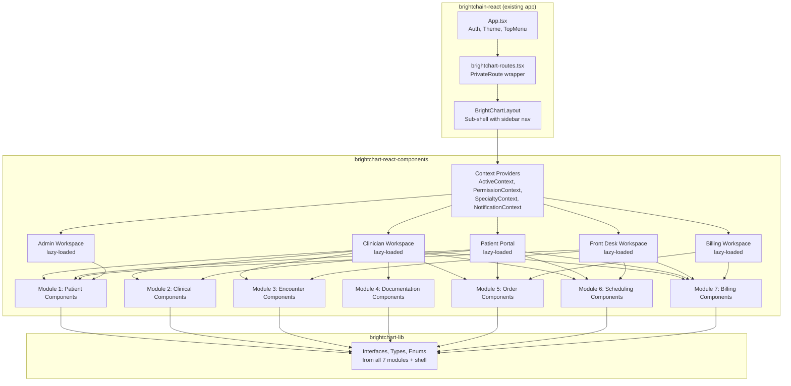
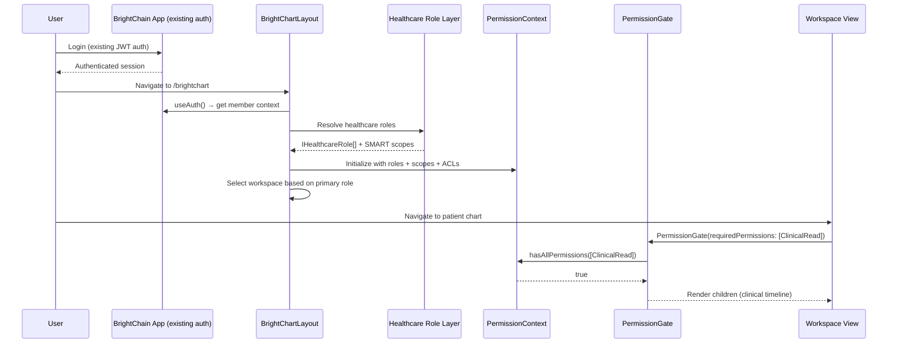
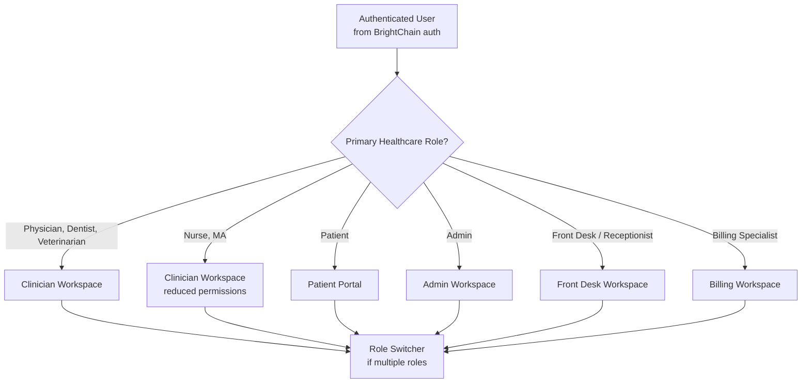
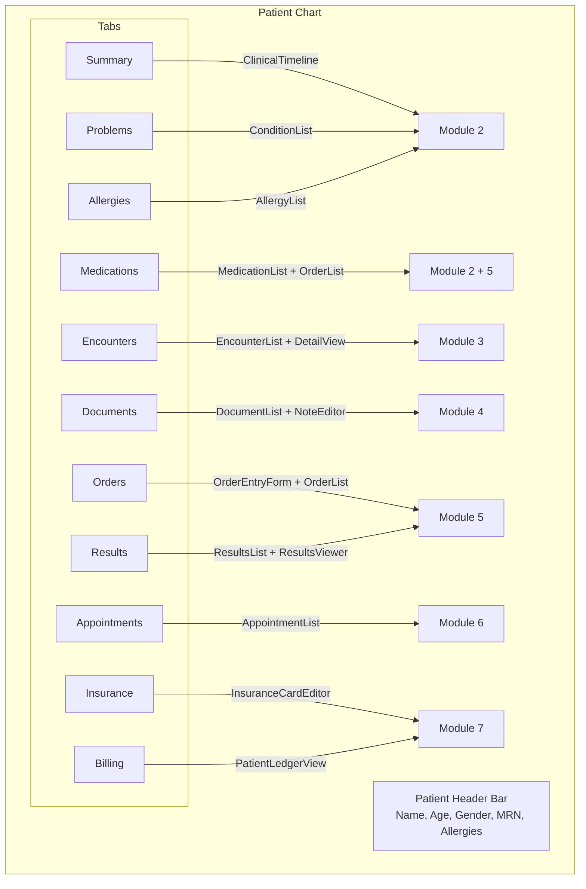
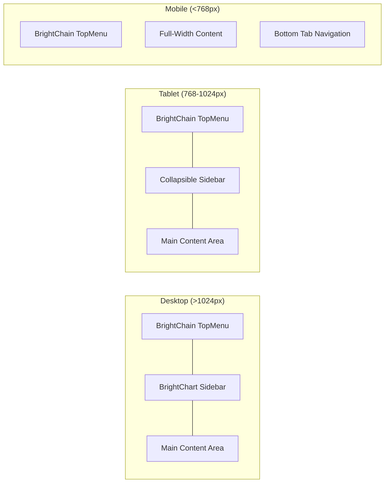

# Design Document: BrightChart Application Shell

## Overview

This design establishes the BrightChart Application Shell — the set of React components, contexts, hooks, and route definitions that compose all BrightChart modules into a unified, role-aware clinical application within the existing `brightchain-react` app. It delivers:

1. A `BrightChartLayout` component (analogous to `BrightMailLayout`) that provides sub-navigation, permission gating, and workspace switching
2. Five role-based workspaces: Clinician, Patient Portal, Front Desk, Billing, Admin
3. A PermissionGate component system for declarative permission-based rendering
4. A comprehensive Patient Chart view aggregating all module data
5. Specialty-driven theming, labeling, and feature availability
6. Responsive layout (desktop/tablet/mobile) with accessibility compliance
7. Offline status indicator with sync state
8. In-app notification system with role-based filtering

The implementation adds components to `brightchart-react-components`, interfaces to `brightchart-lib`, and routes to `brightchain-react/src/app/brightchart-routes.tsx`. No separate Nx application is created.

### Key Design Decisions

- **Same pattern as all other sub-apps**: BrightChart follows the identical architecture as BrightMail, BrightHub, BrightChat, BrightPass, and Digital Burnbag. Interfaces in `-lib`, components in `-react-components`, routes wired into `brightchain-react`. This keeps the monorepo consistent and avoids a separate deployment target.
- **BrightChartLayout as sub-shell**: The `BrightChartLayout` component acts as a sub-shell within the BrightChain app. It provides its own sidebar/workspace navigation while inheriting the top-level BrightChain auth, theme, and menu system. This is exactly how `BrightMailLayout` wraps all mail routes.
- **Reuses existing auth**: The BrightChain app already has JWT auth, session management, and `PrivateRoute`. BrightChart layers healthcare role resolution and permission contexts on top — no duplicate login page.
- **Workspaces are lazy-loaded route groups**: Each workspace (clinician, patient, front desk, billing, admin) is a lazy-loaded route module. The shell loads only the workspace the user needs, keeping initial bundle size small.
- **PermissionGate is the core primitive**: Every view, action button, navigation item, and data section is wrapped in a PermissionGate. This is declarative — developers specify required permissions, and the gate handles evaluation.
- **Active Context drives everything**: A React context provider holds the authenticated member, active role, active specialty, active patient, and active encounter. All child components consume this context.
- **Specialty profile is practice-wide**: Unlike per-user roles, the specialty profile (medical/dental/vet) is a practice-level setting. It changes navigation labels, available templates, billing codes, and scheduling defaults for everyone.
- **Patient Portal enforces self-only access**: The Patient Portal workspace hardcodes the active patient to the authenticated user's patient ID. No patient selector exists — patients can only see their own data.
- **Missing permission enums created in brightchart-lib**: OrderPermission, SchedulingPermission, and BillingPermission enums do not yet exist and will be added to `brightchart-lib` following the same pattern as PatientPermission, ClinicalPermission, EncounterPermission, and DocumentPermission.

### Research Summary

- **Epic MyChart** is the dominant patient portal, offering health summary, test results, medications, appointments, messaging, and billing. It uses a separate app from the clinician-facing Epic Hyperspace. BrightChart's unified approach is a differentiator.
- **SMART on FHIR** apps use launch context (patient, encounter, user) and scopes to determine access. BrightChart's PermissionGate maps directly to this model.
- **Role-based access control (RBAC)** in EHRs typically uses role → permission mappings. BrightChart extends this with SMART scopes for fine-grained resource-level control.
- **Responsive EHR design** is increasingly important as clinicians use tablets at the bedside and patients use phones. Key patterns: collapsible sidebar, bottom navigation on mobile, card-based layouts.


## Architecture

### Integration Architecture



### Permission Flow



### Workspace Selection Logic



### Patient Chart Layout



### Responsive Layout




## Components and Interfaces

### Core Shell Components (in brightchart-react-components)

```typescript
// Permission Gate
interface PermissionGateProps {
  requiredPermissions: string[];
  requireAll?: boolean;          // default true
  fallback?: ReactNode;
  children: ReactNode;
}

// Permission Hook
interface UsePermissionsResult {
  hasPermission(permission: string): boolean;
  hasAnyPermission(permissions: string[]): boolean;
  hasAllPermissions(permissions: string[]): boolean;
  permissions: Set<string>;
  role: IHealthcareRole;
  scopes: SmartScope[];
}

// Active Context (interface in brightchart-lib)
interface IActiveContext<TID = string> {
  member: IMemberContext;
  healthcareRoles: IHealthcareRole<TID>[];
  activeRole: IHealthcareRole<TID>;
  specialtyProfile: ISpecialtyProfile;
  activePatient?: IPatientResource<TID>;
  activeEncounter?: IEncounterResource<TID>;
  setActivePatient(patient: IPatientResource<TID> | undefined): void;
  setActiveEncounter(encounter: IEncounterResource<TID> | undefined): void;
  switchRole(role: IHealthcareRole<TID>): void;
}

// Navigation (interfaces in brightchart-lib)
interface INavigationItem {
  id: string;
  label: string;
  icon: string | ReactNode;
  route: string;
  requiredPermissions: string[];
  children?: INavigationItem[];
  badge?: ReactNode;
  visible: boolean;              // computed from permissions
}

interface INavigationConfig {
  items: INavigationItem[];
  specialtyCode: string;
  roleCode: string;
}

// Notifications (interface in brightchart-lib)
interface INotification {
  id: string;
  type: NotificationType;
  title: string;
  body: string;
  timestamp: Date;
  read: boolean;
  actionRoute?: string;
  priority: 'normal' | 'urgent';
}

enum NotificationType {
  Result = 'result',
  Note = 'note',
  Appointment = 'appointment',
  Claim = 'claim',
  Message = 'message',
  System = 'system',
}
```

### Missing Permission Enums (to add to brightchart-lib)

```typescript
// brightchart-lib/src/lib/orders/access/orderAcl.ts
export enum OrderPermission {
  OrderRead = 'order:read',
  OrderWrite = 'order:write',
  OrderAdmin = 'order:admin',
}

// brightchart-lib/src/lib/scheduling/access/schedulingAcl.ts
export enum SchedulingPermission {
  SchedulingRead = 'scheduling:read',
  SchedulingWrite = 'scheduling:write',
  SchedulingAdmin = 'scheduling:admin',
}

// brightchart-lib/src/lib/billing/access/billingAcl.ts
export enum BillingPermission {
  BillingRead = 'billing:read',
  BillingWrite = 'billing:write',
  BillingSubmit = 'billing:submit',
  BillingAdmin = 'billing:admin',
}
```

### Workspace Views

| Workspace | Key Views | Primary Permissions |
|-----------|-----------|-------------------|
| Clinician | Patient List, Patient Chart, Encounter Dashboard, Schedule, Inbox | PatientRead, ClinicalRead, EncounterRead, DocumentRead, OrderRead, SchedulingRead |
| Patient Portal | My Health, Medications, Allergies, Appointments, Results, Documents, Billing | PatientRead (self-only) |
| Front Desk | Schedule, Check-In, Booking, Waitlist, Insurance, Registration | SchedulingWrite, EncounterWrite, PatientWrite, BillingWrite |
| Billing | Superbills, Claims, EOBs, Payments, Ledger, Fee Schedules | BillingRead, BillingWrite, BillingSubmit |
| Admin | Users, Roles, ACLs, Audit, Specialty Config, Settings | *Admin permissions |


## Directory Structure

```
brightchart-lib/src/lib/
├── ... (existing modules)
├── orders/access/                     # NEW — OrderPermission + ACL
│   ├── orderAcl.ts
│   └── index.ts
├── scheduling/access/                 # NEW — SchedulingPermission + ACL
│   ├── schedulingAcl.ts
│   └── index.ts
├── billing/access/                    # NEW — BillingPermission + ACL
│   ├── billingAcl.ts
│   └── index.ts
└── shell/                             # NEW — shell interfaces
    ├── activeContext.ts
    ├── navigationTypes.ts
    ├── notificationTypes.ts
    └── index.ts

brightchart-react-components/src/lib/
├── ... (existing Module 1–2 components)
├── shell/
│   ├── BrightChartLayout.tsx          # Main layout (like BrightMailLayout)
│   ├── contexts/
│   │   ├── ActiveContext.tsx
│   │   ├── PermissionContext.tsx
│   │   ├── SpecialtyContext.tsx
│   │   └── NotificationContext.tsx
│   ├── components/
│   │   ├── PermissionGate.tsx
│   │   ├── PermissionGuardedRoute.tsx
│   │   ├── AccessDenied.tsx
│   │   ├── PatientHeader.tsx
│   │   ├── Navigation/
│   │   │   ├── Sidebar.tsx
│   │   │   ├── BottomNav.tsx
│   │   │   └── NavigationItem.tsx
│   │   ├── Header/
│   │   │   ├── ChartHeader.tsx
│   │   │   ├── NotificationBell.tsx
│   │   │   ├── RoleSwitcher.tsx
│   │   │   └── ConnectivityIndicator.tsx
│   │   └── NotificationPanel.tsx
│   ├── hooks/
│   │   ├── usePermissions.ts
│   │   ├── useActiveContext.ts
│   │   ├── useSpecialty.ts
│   │   └── useNotifications.ts
│   ├── config/
│   │   ├── navigationConfigs.ts
│   │   ├── workspaceConfigs.ts
│   │   └── specialtyThemes.ts
│   ├── workspaces/
│   │   ├── clinician/
│   │   │   ├── ClinicianWorkspace.tsx
│   │   │   ├── PatientListView.tsx
│   │   │   ├── PatientChart.tsx
│   │   │   ├── EncounterDashboard.tsx
│   │   │   └── InboxView.tsx
│   │   ├── patient/
│   │   │   ├── PatientPortal.tsx
│   │   │   ├── MyHealthSummary.tsx
│   │   │   ├── MyAppointments.tsx
│   │   │   ├── MyResults.tsx
│   │   │   └── MyBilling.tsx
│   │   ├── frontDesk/
│   │   │   ├── FrontDeskWorkspace.tsx
│   │   │   ├── CheckInView.tsx
│   │   │   └── RegistrationView.tsx
│   │   ├── billing/
│   │   │   ├── BillingWorkspace.tsx
│   │   │   ├── ClaimTrackingView.tsx
│   │   │   └── PaymentPostingView.tsx
│   │   └── admin/
│   │       ├── AdminWorkspace.tsx
│   │       ├── UserManagement.tsx
│   │       ├── RoleConfiguration.tsx
│   │       ├── AuditLogViewer.tsx
│   │       └── SpecialtyConfiguration.tsx
│   └── index.ts                       # barrel export for shell

brightchain-react/src/app/
└── brightchart-routes.tsx             # Updated with real routes
```


## Correctness Properties

1. **Permission enforcement completeness**: Every route, view, action button, and data section is wrapped in a PermissionGate. No clinical data is rendered without permission verification.
2. **Patient Portal self-only access**: The Patient Portal workspace always sets activePatient to the authenticated user's patient ID. No mechanism exists to view another patient's data from the portal.
3. **Workspace-role consistency**: The selected workspace matches the user's primary healthcare role. Users cannot access workspaces they lack permissions for.
4. **Specialty context propagation**: All child components receive the active specialty profile. Changing the specialty profile updates all views.
5. **Navigation visibility consistency**: Navigation items with `visible: false` (due to missing permissions) are never rendered and their routes return AccessDenied.
6. **Consistent with monorepo patterns**: BrightChart follows the same lib/components/routes pattern as all other sub-apps, ensuring consistency for developers.


## Error Handling

| Error | Behavior |
|-------|----------|
| Authentication failure | Handled by existing BrightChain auth — redirects to /login |
| Session timeout | Handled by existing BrightChain session management |
| Permission denied (route) | Render AccessDenied view within BrightChartLayout |
| Permission denied (component) | Render fallback or nothing (per PermissionGate config) |
| Offline | Display connectivity banner, serve cached data where available |
| Sync conflict | Display conflict notification with resolution options |
