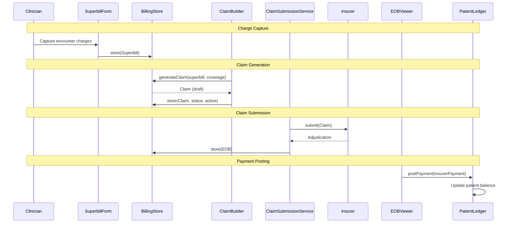
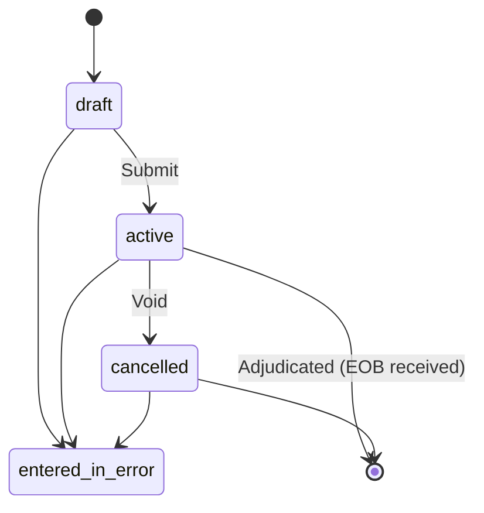
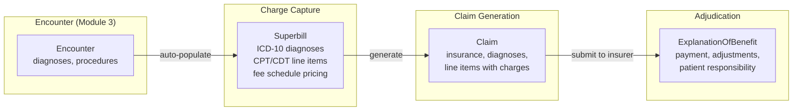

# Design Document: BrightChart Billing & Claims

## Overview

This design establishes the Billing & Claims module — the final module in the BrightChart EHR platform. It delivers:

1. FHIR R4 Coverage, Claim, ExplanationOfBenefit, CoverageEligibilityRequest/Response resource models
2. Fee schedule system mapping procedure codes to charges
3. Claim lifecycle with submission workflow interfaces
4. Real-time insurance eligibility verification interfaces
5. Superbill / encounter charge capture
6. Patient ledger for financial tracking
7. A dedicated BrightChain encrypted pool for billing data
8. Billing serializers, search, ACL, and audit interfaces
9. Specialty billing extensions (medical CPT, dental CDT, veterinary direct invoicing)
10. Six React components: InsuranceCardEditor, ClaimBuilder, EOBViewer, EligibilityChecker, PatientLedgerView, SuperbillForm

All interfaces live in `brightchart-lib` under `src/lib/billing/`. React components live in `brightchart-react-components` under `src/lib/billing/`.

### Key Design Decisions

- **Coverage for insurance, Claim for billing, EOB for adjudication**: Coverage stores insurance card info. Claims are submitted for payment. EOBs are the insurer's response. This three-resource model covers the full billing lifecycle.
- **Superbill bridges clinical and billing**: The superbill captures charges at the encounter level, pulling diagnoses from encounter data and letting clinicians/billers add procedure codes. The superbill then generates a Claim.
- **Fee schedule as configuration**: Fee schedules map codes to charges and are specialty-aware. Medical uses CPT, dental uses CDT, veterinary uses custom codes. Sites can customize fee schedules.
- **Patient ledger is BrightChart-specific**: Not a FHIR resource, but essential for practice management. Tracks charges, payments, adjustments, and running balances per patient.
- **Dental claim line items carry tooth/surface**: CDT codes on dental claims include bodySite (tooth number) and subSite (surface codes) per ADA standards. The Specialty Adapter ensures dental claims are structured correctly.
- **Veterinary billing defaults to direct invoicing**: Most vet practices bill clients directly rather than through insurance. The module supports this via the patient ledger and superbill, with optional pet insurance claim support.

### Research Summary

- **FHIR R4 Coverage** represents insurance card-level information with status, type, subscriber, beneficiary, payor, class (group/plan), period, and cost-to-beneficiary. ([FHIR Coverage](https://build.fhir.org/coverage.html))
- **FHIR R4 Claim** is a complex resource for payment requests with type (oral, pharmacy, vision, professional, institutional), use (claim, preauthorization, predetermination), patient, provider, insurance, diagnosis, procedure, and item (line items with productOrService, quantity, unitPrice, net). ([FHIR Claim](https://build.fhir.org/claim.html))
- **FHIR R4 ExplanationOfBenefit** combines claim details with adjudication results: outcome (queued, complete, error, partial), item adjudication (category, amount), total, and payment. ([FHIR EOB](https://build.fhir.org/explanationofbenefit.html))
- **FHIR R4 CoverageEligibilityRequest/Response** enable real-time eligibility verification with purpose (auth-requirements, benefits, discovery, validation) and benefit details. ([FHIR Eligibility](https://build.fhir.org/coverageeligibilityrequest.html))
- **CPT (Current Procedural Terminology)** codes are maintained by the AMA for medical procedures. **CDT (Code on Dental Procedures)** codes are maintained by the ADA. **HCPCS** codes cover supplies and services not in CPT. **ICD-10-CM** codes are used for diagnoses on all claim types.
- **ADA dental claim form** requires tooth number (ADA universal numbering 1-32) and surface codes (M, D, O, B, L) on procedure line items.


## Architecture

### Billing Data Flow



### Claim Lifecycle



### Superbill to Claim Flow




## Components and Interfaces

### Key Resource Interfaces

```typescript
interface ICoverageResource<TID = string> {
  resourceType: 'Coverage';
  // FHIR metadata + brightchainMetadata
  status: CoverageStatus;
  type?: ICodeableConcept;
  subscriber?: IReference<TID>;
  subscriberId?: string;
  beneficiary: IReference<TID>;
  relationship?: ICodeableConcept;
  period?: IPeriod;
  payor: IReference<TID>[];
  class?: CoverageClass<TID>[];
  order?: number;
  network?: string;
  costToBeneficiary?: CoverageCostToBeneficiary<TID>[];
  subrogation?: boolean;
}

interface IClaimResource<TID = string> {
  resourceType: 'Claim';
  // FHIR metadata + brightchainMetadata
  status: ClaimStatus;
  type: ICodeableConcept;
  use: ClaimUse;
  patient: IReference<TID>;
  billablePeriod?: IPeriod;
  created: string;
  provider: IReference<TID>;
  priority: ICodeableConcept;
  insurance: ClaimInsurance<TID>[];
  diagnosis?: ClaimDiagnosis<TID>[];
  procedure?: ClaimProcedure<TID>[];
  item?: ClaimItem<TID>[];
  total?: IMoney;
  // ... other fields
}

interface IExplanationOfBenefitResource<TID = string> {
  resourceType: 'ExplanationOfBenefit';
  // FHIR metadata + brightchainMetadata
  status: EOBStatus;
  type: ICodeableConcept;
  use: ClaimUse;
  patient: IReference<TID>;
  created: string;
  insurer: IReference<TID>;
  provider: IReference<TID>;
  outcome: RemittanceOutcome;
  claim?: IReference<TID>;
  item?: EOBItem<TID>[];
  total?: EOBTotal[];
  payment?: EOBPayment;
  // ... other fields
}
```

### Billing ACL

```typescript
enum BillingPermission {
  BillingRead = 'billing:read',
  BillingWrite = 'billing:write',
  BillingSubmit = 'billing:submit',
  BillingAdmin = 'billing:admin',
}
```

### React Components

| Component | Props | Key Behavior |
|-----------|-------|-------------|
| `InsuranceCardEditor` | `onSubmit`, `coverage?` | Plan type, subscriber, member ID, group, payor, period, copay/deductible |
| `ClaimBuilder` | `onSubmit`, `superbill?`, `specialtyProfile?`, `feeSchedule?` | Editable claim with diagnoses, line items, insurance, totals |
| `EOBViewer` | `eob` | Outcome display, per-line adjudication, payment details, totals |
| `EligibilityChecker` | `patient`, `coverage`, `onCheck` | Eligibility trigger, response display with benefits/copay/deductible |
| `PatientLedgerView` | `ledger`, `filterDateRange?`, `filterTypes?` | Chronological entries, running balance, type-colored entries |
| `SuperbillForm` | `encounter?`, `onFinalize`, `specialtyProfile?`, `feeSchedule?` | Diagnosis/procedure entry, auto-pricing, encounter auto-populate |


## Data Models

### Pool Layout

All billing resources stored in a dedicated Billing Pool. Audit entries in the shared Audit Pool.

### Specialty Billing Code Systems

| Specialty | Procedure Codes | Diagnosis Codes | Claim Type |
|-----------|----------------|-----------------|------------|
| Medical | CPT (`http://www.ama-assn.org/go/cpt`), HCPCS | ICD-10-CM | professional |
| Dental | CDT (`http://www.ada.org/cdt`) | ICD-10-CM | oral |
| Veterinary | Custom / CPT subset | Custom / ICD-10 subset | professional (or custom) |


## Correctness Properties

1. **Resource type invariants**: Coverage/Claim/EOB resourceType fields match fixed values
2. **Claim status transition validity**: Only valid transitions per the state machine
3. **Superbill-to-Claim consistency**: Generated Claim line items match superbill line items in code, quantity, and charge
4. **Ledger balance integrity**: Running balance after each entry equals previous balance ± entry amount (+ for charges, - for payments/adjustments)
5. **Fee schedule pricing**: Claim line item unitPrice matches fee schedule charge for the given code and modifiers
6. **Serialization round-trip**: For all billing resource types
7. **ACL enforcement**: BillingAdmin implies all; missing permission → 403
8. **Dental claim bodySite/subSite**: Dental claim line items with CDT codes include tooth number in bodySite and surface codes in subSite
