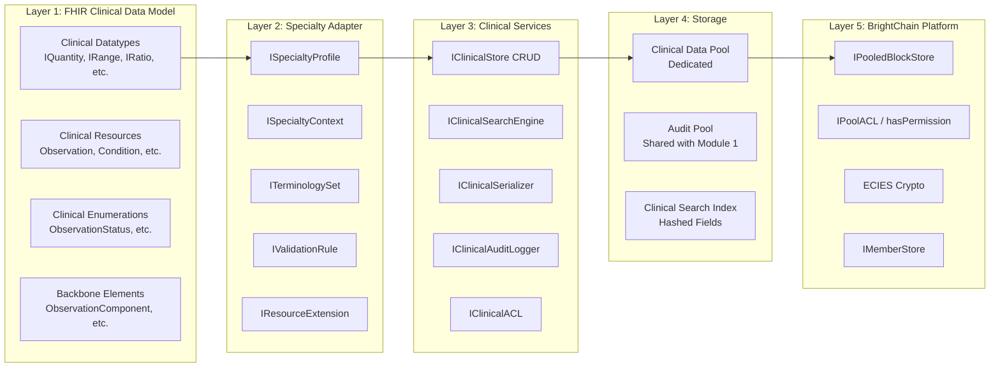
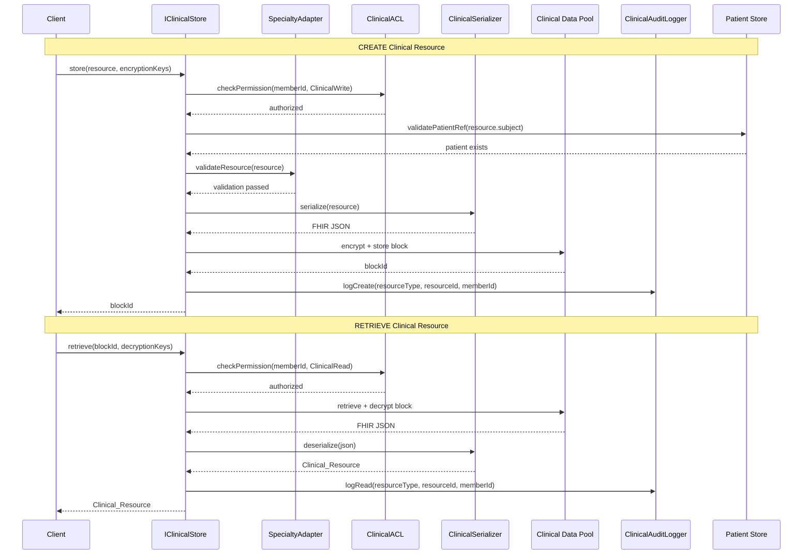
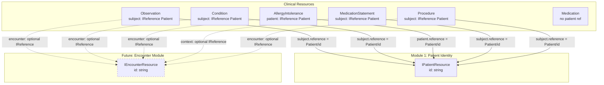
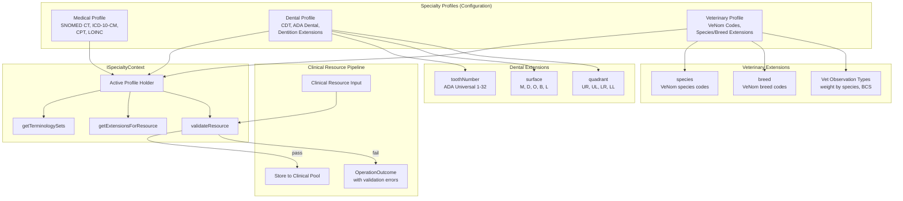
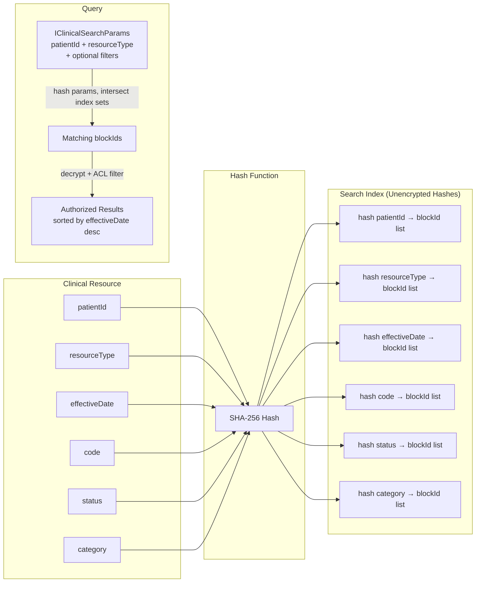
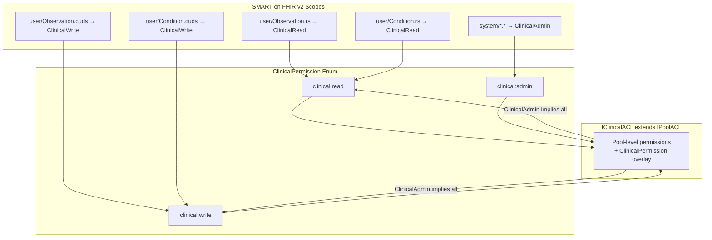

# Design Document: BrightChart Clinical Data Foundation

## Overview

This design establishes the Clinical Data Foundation for BrightChart — the FHIR R4-compliant clinical resource data layer that sits directly on top of the Core Patient Identity (MPI) module. It delivers:

1. Six FHIR R4 clinical resource models (Observation, Condition, AllergyIntolerance, Medication, MedicationStatement, Procedure) with BrightChain storage metadata and TID generics
2. A Specialty Adapter Layer that makes BrightChart Medical, Dental, and Vet configurations of the same codebase — not code forks
3. A dedicated BrightChain encrypted pool for clinical data with CRUD, versioning, and integrity verification
4. Clinical serializers with round-trip properties matching the PatientSerializer pattern
5. Clinical ACL extending IPoolACL with clinical:read/write/admin permissions mapped to SMART on FHIR v2 scopes
6. Clinical audit trail extending the Module 1 audit pattern with hash-linked per-resource chains
7. Portability standard extension for full-fidelity clinical data export/import across all three specialties
8. Five React components: ClinicalTimeline, ObservationEntryForm, ConditionList, AllergyList, MedicationList
9. A zero-knowledge selective disclosure layer enabling patients to prove clinical facts (vaccination status, insurance eligibility) without exposing their full medical history

All interfaces live in `brightchart-lib` (browser-compatible, shared). React components live in `brightchart-react-components`. No Node.js-specific code is introduced — backend implementations will follow the `brightchain-api-lib` pattern in a future module.

### Key Design Decisions

- **Clinical resources are separate blocks, not embedded in Patient**: Each clinical resource is its own encrypted block in a dedicated clinical pool, referencing patients via `IReference` to `IPatientResource.id`. This enables granular access control and independent versioning.
- **Forward-compatible Encounter references**: Clinical resources accept optional `IReference<"Encounter">` fields stored without validation. When the Encounter module ships, these references become resolvable.
- **Specialty as configuration, not code**: `ISpecialtyProfile` objects define terminology sets, resource extensions, and validation rules. Switching from Medical to Dental changes a configuration object, not a code path.
- **Generic IClinicalStore**: A single `IClinicalStore<TID, TResource>` interface serves all six resource types, avoiding per-resource store duplication.
- **Generic IClinicalSerializer**: A single `IClinicalSerializer<TResource>` interface parameterized on resource type, with the same round-trip guarantee as `IPatientSerializer`.
- **Clinical ACL extends IPoolACL**: `IClinicalACL` adds `ClinicalPermission` (clinical:read, clinical:write, clinical:admin) on top of the existing `PoolPermission` model, reusing `hasPermission` and `hasQuorum` functions.
- **Selective disclosure via signed attestations**: Patients can create cryptographic proofs of specific clinical facts (e.g., "has active vaccination", "no known drug allergies") without revealing the underlying records. The initial implementation uses ECIES-signed attestations with a clear migration path to zk-SNARKs. Proofs are time-limited and revocable.
- **Shared audit pool**: Clinical audit entries go into the same audit pool as patient identity audit entries, extending `IAuditLogEntry` with `resourceType` and `clinicalResourceId` fields. One pool, one chain per resource.
- **Hashed search indexes**: Clinical search indexes store field hashes (not plaintext) for patientId, resourceType, effectiveDate, code, status, and category — matching the Patient_Search_Engine pattern.

### Research Summary

- **FHIR R4 Observation** includes status, category, code, subject, effective[x], value[x], interpretation, referenceRange, and component fields. Value types include Quantity, CodeableConcept, string, boolean, integer, Range, Ratio, SampledData, time, dateTime, and Period. ([FHIR Observation](https://build.fhir.org/observation.html))
- **FHIR R4 Condition** models clinical conditions, problems, and diagnoses with clinicalStatus, verificationStatus, category, severity, code, onset[x], abatement[x], stage, and evidence. ([FHIR Condition](https://build.fhir.org/condition.html))
- **FHIR R4 AllergyIntolerance** captures allergy/intolerance records with type (allergy vs intolerance), category (food, medication, environment, biologic), criticality, and reaction details. ([FHIR AllergyIntolerance](https://build.fhir.org/allergyintolerance.html))
- **FHIR R4 Medication** defines medication products with code, form, amount, ingredients, and batch info. **MedicationStatement** records a patient's medication usage with status, medication reference, dosage, and reason. ([FHIR Medication](https://build.fhir.org/medication.html), [FHIR MedicationStatement](https://build.fhir.org/medicationstatement.html))
- **FHIR R4 Procedure** documents clinical procedures with status, code, performer, performed[x], bodySite, outcome, complication, and focalDevice. ([FHIR Procedure](https://build.fhir.org/procedure.html))
- **CDT (Code on Dental Procedures and Nomenclature)** is maintained by the ADA and uses codes like D0120 (periodic oral evaluation), D2391 (resin-based composite). Dental extensions include tooth number (ADA universal numbering 1-32), surface codes (M, D, O, B, L), and quadrant (UR, UL, LR, LL). ([ADA CDT Codes](https://www.ada.org/resources/practice/dental-cdt))
- **VeNom (Veterinary Nomenclature)** provides standardized codes for species, breeds, diagnoses, and procedures in veterinary medicine. It is the UK standard and increasingly adopted internationally. ([VeNom Coding](https://www.venomcoding.org))
- **LOINC** provides universal codes for laboratory and clinical observations. Vital signs use codes like 8310-5 (body temperature), 8867-4 (heart rate), 29463-7 (body weight). ([LOINC](https://loinc.org))


## Architecture

### System Architecture Diagram

```mermaid
graph TB
    subgraph "Frontend (Browser)"
        RC[brightchart-react-components]
        RC --> |uses| CL[brightchart-lib interfaces]
    end

    subgraph "brightchart-lib (Shared, Browser-Compatible)"
        CL --> FHIR_BASE[FHIR R4 Base Datatypes<br/>from Module 1]
        CL --> CLIN_DT[Clinical Datatypes<br/>IQuantity, IRange, IRatio, etc.]
        CL --> OBS[Observation Resource]
        CL --> COND[Condition Resource]
        CL --> ALLERGY[AllergyIntolerance Resource]
        CL --> MED[Medication Resource]
        CL --> MEDSTMT[MedicationStatement Resource]
        CL --> PROC[Procedure Resource]
        CL --> SPEC[Specialty Adapter Interfaces]
        CL --> CSER[Clinical Serializer Interfaces]
        CL --> CSTORE_I[Clinical Store Interfaces]
        CL --> CACL[Clinical ACL Types]
        CL --> CAUDIT[Clinical Audit Types]
        CL --> CSEARCH_I[Clinical Search Interfaces]
        CL --> CPORT[Clinical Portability Types]
    end

    subgraph "Backend Services (Node.js, future)"
        CS[Clinical Store Implementation]
        CSE[Clinical Search Engine]
        CAL[Clinical Audit Logger]
        CACL_S[Clinical ACL Service]
        SA[Specialty Adapter Service]
        CEXP[Clinical Import/Export Service]
    end

    subgraph "BrightChain Platform"
        CPOOL[Clinical Data Pool<br/>IPooledBlockStore]
        PPOOL[Patient Data Pool<br/>from Module 1]
        APOOL[Audit Log Pool<br/>shared with Module 1]
        MS[IMemberStore]
        ECIES[ECIES Encryption]
    end

    CS --> CPOOL
    CS --> SA
    CS --> CAL
    CS --> CACL_S
    CAL --> APOOL
    CACL_S --> CPOOL
    CS --> ECIES
    CS -.-> |validates patient refs| PPOOL
```



### Layer Architecture



### Clinical Data Flow: CRUD Operations



### Clinical Resource Patient & Encounter References



### Specialty Adapter Architecture



### Clinical Search Index Design



### Clinical ACL Integration with SMART Scopes




## Components and Interfaces

### Clinical Datatypes (`brightchart-lib/src/lib/clinical/datatypes.ts`)

New FHIR R4 complex datatypes required by clinical resources, all generic on `<TID = string>`:

| Interface | Key Fields | Used By |
|-----------|-----------|---------|
| `IQuantity` | value, comparator, unit, system, code | Observation (valueQuantity), Dosage |
| `ISimpleQuantity` | value, unit, system, code (no comparator) | MedicationIngredient |
| `IRange` | low (ISimpleQuantity), high (ISimpleQuantity) | Observation (valueRange), Condition (onsetRange) |
| `IRatio` | numerator (IQuantity), denominator (IQuantity) | Observation (valueRatio), Medication (amount) |
| `IAge` | extends IQuantity with age-specific constraints | Condition (onsetAge), Procedure (performedAge) |
| `IAnnotation` | authorReference (IReference), authorString, time, text | Observation, AllergyIntolerance, Procedure (note) |
| `IDosage` | sequence, text, additionalInstruction, patientInstruction, timing, site, route, method, doseAndRate, maxDosePerPeriod, maxDosePerAdministration, maxDosePerLifetime | MedicationStatement |
| `IDosageDoseAndRate` | type (ICodeableConcept), doseRange, doseQuantity, rateRatio, rateRange, rateQuantity | IDosage |
| `ITiming` | event (dateTime[]), repeat (ITimingRepeat), code (ICodeableConcept) | IDosage |
| `ITimingRepeat` | boundsDuration, boundsRange, boundsPeriod, count, countMax, duration, durationMax, durationUnit, frequency, frequencyMax, period, periodMax, periodUnit, dayOfWeek, timeOfDay, when, offset | ITiming |
| `ISampledData` | origin (ISimpleQuantity), period, factor, lowerLimit, upperLimit, dimensions, data | Observation (valueSampledData) |

### Clinical Backbone Elements (`brightchart-lib/src/lib/clinical/backboneElements.ts`)

| Interface | Key Fields | Parent Resource |
|-----------|-----------|----------------|
| `ObservationReferenceRange` | low, high, type, appliesTo, age, text | Observation |
| `ObservationComponent` | code, value[x], dataAbsentReason, interpretation, referenceRange | Observation |
| `ConditionStage` | summary, assessment, type | Condition |
| `ConditionEvidence` | code, detail | Condition |
| `AllergyIntoleranceReaction` | substance, manifestation, description, onset, severity, exposureRoute, note | AllergyIntolerance |
| `MedicationIngredient` | itemCodeableConcept, itemReference, isActive, strength | Medication |
| `MedicationBatch` | lotNumber, expirationDate | Medication |
| `ProcedurePerformer` | function, actor, onBehalfOf | Procedure |
| `ProcedureFocalDevice` | action, manipulated | Procedure |

### Clinical Enumerations (`brightchart-lib/src/lib/clinical/enumerations.ts`)

| Enum | Values | FHIR Binding |
|------|--------|-------------|
| `ObservationStatus` | registered, preliminary, final, amended, corrected, cancelled, entered-in-error, unknown | required |
| `ConditionClinicalStatus` | active, recurrence, relapse, inactive, remission, resolved | required |
| `ConditionVerificationStatus` | unconfirmed, provisional, differential, confirmed, refuted, entered-in-error | required |
| `AllergyIntoleranceType` | allergy, intolerance | required |
| `AllergyIntoleranceCategory` | food, medication, environment, biologic | required |
| `AllergyIntoleranceCriticality` | low, high, unable-to-assess | required |
| `AllergyIntoleranceSeverity` | mild, moderate, severe | required |
| `MedicationStatus` | active, inactive, entered-in-error | required |
| `MedicationStatementStatus` | active, completed, entered-in-error, intended, stopped, on-hold, unknown, not-taken | required |
| `ProcedureStatus` | preparation, in-progress, not-done, on-hold, stopped, completed, entered-in-error, unknown | required |

### Clinical Resource Interfaces

All clinical resources follow a common pattern:
- Generic on `<TID = string>`
- Fixed `resourceType` literal
- FHIR metadata: `id`, `meta` (IMeta), `text` (INarrative), `extension` (IExtension[])
- BrightChain metadata: `brightchainMetadata` with `blockId`, `creatorMemberId`, `createdAt`, `updatedAt`, `poolId`, `encryptionType`
- Patient reference via `subject` or `patient` field (IReference to Patient)
- Optional encounter reference via `encounter` or `context` field (IReference to Encounter)

#### `IObservationResource<TID = string>` (`brightchart-lib/src/lib/clinical/resources/observation.ts`)

```typescript
interface IObservationResource<TID = string> {
  resourceType: 'Observation';
  id?: string;
  meta?: IMeta;
  text?: INarrative;
  extension?: IExtension[];
  brightchainMetadata: IBrightChainMetadata<TID>;
  identifier?: IIdentifier[];
  status: ObservationStatus;
  category?: ICodeableConcept[];
  code: ICodeableConcept;
  subject?: IReference<TID>;          // Patient reference
  encounter?: IReference<TID>;        // Forward-compatible Encounter reference
  effectiveDateTime?: string;
  effectivePeriod?: IPeriod;
  issued?: string;                    // instant
  performer?: IReference<TID>[];
  valueQuantity?: IQuantity;
  valueCodeableConcept?: ICodeableConcept;
  valueString?: string;
  valueBoolean?: boolean;
  valueInteger?: number;
  valueRange?: IRange;
  valueRatio?: IRatio;
  dataAbsentReason?: ICodeableConcept;
  interpretation?: ICodeableConcept[];
  note?: IAnnotation[];
  bodySite?: ICodeableConcept;
  method?: ICodeableConcept;
  referenceRange?: ObservationReferenceRange[];
  component?: ObservationComponent[];
  hasMember?: IReference<TID>[];
}
```

#### `IConditionResource<TID = string>` (`brightchart-lib/src/lib/clinical/resources/condition.ts`)

```typescript
interface IConditionResource<TID = string> {
  resourceType: 'Condition';
  id?: string;
  meta?: IMeta;
  text?: INarrative;
  extension?: IExtension[];
  brightchainMetadata: IBrightChainMetadata<TID>;
  identifier?: IIdentifier[];
  clinicalStatus?: ICodeableConcept;
  verificationStatus?: ICodeableConcept;
  category?: ICodeableConcept[];
  severity?: ICodeableConcept;
  code?: ICodeableConcept;
  bodySite?: ICodeableConcept[];
  subject: IReference<TID>;           // Patient reference (required)
  encounter?: IReference<TID>;
  onsetDateTime?: string;
  onsetAge?: IAge;
  onsetPeriod?: IPeriod;
  onsetRange?: IRange;
  onsetString?: string;
  abatementDateTime?: string;
  abatementAge?: IAge;
  abatementPeriod?: IPeriod;
  abatementRange?: IRange;
  abatementString?: string;
  recordedDate?: string;
  recorder?: IReference<TID>;
  asserter?: IReference<TID>;
  stage?: ConditionStage[];
  evidence?: ConditionEvidence[];
}
```

#### `IAllergyIntoleranceResource<TID = string>` (`brightchart-lib/src/lib/clinical/resources/allergyIntolerance.ts`)

```typescript
interface IAllergyIntoleranceResource<TID = string> {
  resourceType: 'AllergyIntolerance';
  id?: string;
  meta?: IMeta;
  text?: INarrative;
  extension?: IExtension[];
  brightchainMetadata: IBrightChainMetadata<TID>;
  identifier?: IIdentifier[];
  clinicalStatus?: ICodeableConcept;
  verificationStatus?: ICodeableConcept;
  type?: AllergyIntoleranceType;
  category?: AllergyIntoleranceCategory[];
  criticality?: AllergyIntoleranceCriticality;
  code?: ICodeableConcept;
  patient: IReference<TID>;           // Patient reference (required)
  encounter?: IReference<TID>;
  onsetDateTime?: string;
  onsetAge?: IAge;
  onsetPeriod?: IPeriod;
  onsetRange?: IRange;
  onsetString?: string;
  recordedDate?: string;
  recorder?: IReference<TID>;
  asserter?: IReference<TID>;
  lastOccurrence?: string;
  note?: IAnnotation[];
  reaction?: AllergyIntoleranceReaction[];
}
```

#### `IMedicationResource<TID = string>` (`brightchart-lib/src/lib/clinical/resources/medication.ts`)

```typescript
interface IMedicationResource<TID = string> {
  resourceType: 'Medication';
  id?: string;
  meta?: IMeta;
  text?: INarrative;
  extension?: IExtension[];
  brightchainMetadata: IBrightChainMetadata<TID>;
  identifier?: IIdentifier[];
  code?: ICodeableConcept;
  status?: MedicationStatus;
  manufacturer?: IReference<TID>;
  form?: ICodeableConcept;
  amount?: IRatio;
  ingredient?: MedicationIngredient[];
  batch?: MedicationBatch;
}
```

#### `IMedicationStatementResource<TID = string>` (`brightchart-lib/src/lib/clinical/resources/medicationStatement.ts`)

```typescript
interface IMedicationStatementResource<TID = string> {
  resourceType: 'MedicationStatement';
  id?: string;
  meta?: IMeta;
  text?: INarrative;
  extension?: IExtension[];
  brightchainMetadata: IBrightChainMetadata<TID>;
  identifier?: IIdentifier[];
  status: MedicationStatementStatus;
  statusReason?: ICodeableConcept[];
  category?: ICodeableConcept;
  medicationCodeableConcept?: ICodeableConcept;
  medicationReference?: IReference<TID>;  // Reference to Medication
  subject: IReference<TID>;               // Patient reference (required)
  context?: IReference<TID>;              // Encounter reference
  effectiveDateTime?: string;
  effectivePeriod?: IPeriod;
  dateAsserted?: string;
  informationSource?: IReference<TID>;
  reasonCode?: ICodeableConcept[];
  reasonReference?: IReference<TID>[];
  note?: IAnnotation[];
  dosage?: IDosage[];
}
```

#### `IProcedureResource<TID = string>` (`brightchart-lib/src/lib/clinical/resources/procedure.ts`)

```typescript
interface IProcedureResource<TID = string> {
  resourceType: 'Procedure';
  id?: string;
  meta?: IMeta;
  text?: INarrative;
  extension?: IExtension[];
  brightchainMetadata: IBrightChainMetadata<TID>;
  identifier?: IIdentifier[];
  status: ProcedureStatus;
  statusReason?: ICodeableConcept;
  category?: ICodeableConcept;
  code?: ICodeableConcept;
  subject: IReference<TID>;           // Patient reference (required)
  encounter?: IReference<TID>;
  performedDateTime?: string;
  performedPeriod?: IPeriod;
  performedString?: string;
  performedAge?: IAge;
  performedRange?: IRange;
  recorder?: IReference<TID>;
  asserter?: IReference<TID>;
  performer?: ProcedurePerformer<TID>[];
  location?: IReference<TID>;
  reasonCode?: ICodeableConcept[];
  reasonReference?: IReference<TID>[];
  bodySite?: ICodeableConcept[];
  outcome?: ICodeableConcept;
  report?: IReference<TID>[];
  complication?: ICodeableConcept[];
  complicationDetail?: IReference<TID>[];
  followUp?: ICodeableConcept[];
  note?: IAnnotation[];
  focalDevice?: ProcedureFocalDevice<TID>[];
  usedCode?: ICodeableConcept[];
}
```

### Union Type for All Clinical Resources

```typescript
type ClinicalResource<TID = string> =
  | IObservationResource<TID>
  | IConditionResource<TID>
  | IAllergyIntoleranceResource<TID>
  | IMedicationResource<TID>
  | IMedicationStatementResource<TID>
  | IProcedureResource<TID>;

type ClinicalResourceType =
  | 'Observation'
  | 'Condition'
  | 'AllergyIntolerance'
  | 'Medication'
  | 'MedicationStatement'
  | 'Procedure';
```

### Specialty Adapter Interfaces (`brightchart-lib/src/lib/clinical/specialty/`)

```typescript
interface ITerminologySet {
  system: string;       // URI identifying the code system
  name: string;         // Display name
  version?: string;     // Optional version
  codes?: string[];     // Commonly used codes for validation hints
}

interface IResourceExtension {
  resourceType: ClinicalResourceType | 'Patient';
  url: string;          // Extension URI
  valueType: string;    // FHIR datatype of the extension value
  description: string;  // Human-readable description
}

interface IValidationResult {
  valid: boolean;
  errors: Array<{ field: string; message: string; rule: string }>;
}

interface IValidationRule {
  resourceType: ClinicalResourceType;
  field: string;        // Field path (e.g., "code.coding[0].system")
  rule: (value: unknown) => IValidationResult;
  description: string;
}

interface ISpecialtyProfile {
  specialtyCode: string;    // e.g., "medical", "dental", "veterinary"
  displayName: string;      // e.g., "BrightChart Medical"
  terminologySets: ITerminologySet[];
  resourceExtensions: IResourceExtension[];
  validationRules: IValidationRule[];
}

interface ISpecialtyContext {
  profile: ISpecialtyProfile;
  getTerminologySets(): ITerminologySet[];
  getExtensionsForResource(resourceType: ClinicalResourceType | 'Patient'): IResourceExtension[];
  validateResource(resource: ClinicalResource): IValidationResult;
}
```

#### Predefined Specialty Profiles

**Medical Profile:**
- Terminology: SNOMED CT (`http://snomed.info/sct`), ICD-10-CM (`http://hl7.org/fhir/sid/icd-10-cm`), CPT (`http://www.ama-assn.org/go/cpt`), LOINC (`http://loinc.org`)
- Extensions: none (standard FHIR fields suffice)
- Validation: code.coding[].system must be one of the medical terminology URIs

**Dental Profile:**
- Terminology: CDT (`http://www.ada.org/cdt`), ADA Dental (`http://www.ada.org/dental`)
- Extensions:
  - `toothNumber` (valueInteger, ADA universal numbering 1-32) on Procedure, Condition
  - `surface` (valueCodeableConcept: M, D, O, B, L) on Procedure, Condition
  - `quadrant` (valueCode: UR, UL, LR, LL) on Procedure, Condition
- Validation: toothNumber must be 1-32 when present; surface codes must be valid ADA surface codes

**Veterinary Profile:**
- Terminology: VeNom (`http://www.venomcoding.org`)
- Extensions:
  - `species` (valueCodeableConcept, VeNom species codes) on Patient
  - `breed` (valueCodeableConcept, VeNom breed codes) on Patient
  - `bodyConditionScore` (valueInteger, 1-9 scale) on Observation
- Validation: species must be present on Patient resources; bodyConditionScore must be 1-9

### Clinical Store Interface (`brightchart-lib/src/lib/clinical/store/clinicalStore.ts`)

```typescript
interface IClinicalStore<TID = string, TResource extends ClinicalResource<TID> = ClinicalResource<TID>> {
  store(resource: TResource, encryptionKeys: Uint8Array, memberId: TID): Promise<TID>;
  retrieve(blockId: TID, decryptionKeys: Uint8Array, memberId: TID): Promise<TResource>;
  update(resource: TResource, encryptionKeys: Uint8Array, memberId: TID): Promise<TID>;
  delete(resourceId: string, memberId: TID): Promise<void>;
  getVersionHistory(resourceId: string): Promise<TID[]>;
  getPoolId(): string;
}
```

### Clinical Serializer Interface (`brightchart-lib/src/lib/clinical/serializer/clinicalSerializer.ts`)

```typescript
interface IClinicalSerializer<TResource extends ClinicalResource> {
  serialize(resource: TResource): string;
  deserialize(json: string): TResource;
}
```

One concrete serializer class per resource type, all implementing `IClinicalSerializer<T>`. Additionally, a bundle serializer for `IClinicalExportBundle`.

### Clinical Search Interface (`brightchart-lib/src/lib/clinical/search/clinicalSearch.ts`)

```typescript
interface IClinicalSearchParams {
  patientId: string;                    // Required
  resourceType: ClinicalResourceType;   // Required
  dateRange?: { start?: string; end?: string };
  code?: string | ICodeableConcept;
  status?: string;
  category?: string | ICodeableConcept;
  offset?: number;
  count?: number;
}

interface IClinicalSearchResult<TID = string> {
  entries: ClinicalResource<TID>[];
  total: number;
  offset: number;
  count: number;
}

interface IClinicalSearchEngine<TID = string> {
  search(params: IClinicalSearchParams, memberId: TID): Promise<IClinicalSearchResult<TID>>;
  indexResource(resource: ClinicalResource<TID>): Promise<void>;
  removeIndex(resourceId: string): Promise<void>;
}
```

### Clinical ACL Interface (`brightchart-lib/src/lib/clinical/access/clinicalAcl.ts`)

```typescript
enum ClinicalPermission {
  ClinicalRead = 'clinical:read',
  ClinicalWrite = 'clinical:write',
  ClinicalAdmin = 'clinical:admin',
}

interface IClinicalACL<TID = string> extends IPoolACL<TID> {
  clinicalPermissions: Array<{
    memberId: TID;
    permissions: ClinicalPermission[];
  }>;
}
```

`ClinicalAdmin` implies `ClinicalRead` and `ClinicalWrite`. The `hasPermission` function from `IPoolACL` is extended with a `hasClinicalPermission` helper that checks clinical-specific permissions and maps `ClinicalAdmin` to all.

SMART scope mapping:
- Read scopes on clinical resource types (`user/Observation.rs`, `patient/Condition.rs`) → `ClinicalRead`
- Create/Update/Delete scopes (`user/Observation.cuds`) → `ClinicalWrite`
- `system/*.*` → `ClinicalAdmin`

### Clinical Audit Interface (`brightchart-lib/src/lib/clinical/audit/clinicalAudit.ts`)

```typescript
enum ClinicalAuditOperationType {
  Create = 'create',
  Read = 'read',
  Update = 'update',
  Delete = 'delete',
  Search = 'search',
}

interface IClinicalAuditEntry<TID = string> extends IAuditLogEntry {
  resourceType: ClinicalResourceType;
  clinicalResourceId?: string;          // undefined for search operations
  searchParams?: IClinicalSearchParams; // present for search operations
  memberId: TID;
  timestamp: Date;
  requestId: string;
  signature: Uint8Array;
  previousEntryBlockId?: TID;          // hash-linked chain per resource
}
```

### Clinical Portability Interface (`brightchart-lib/src/lib/clinical/portability/clinicalPortability.ts`)

```typescript
interface IClinicalExportBundle<TID = string> extends IBrightChartExportBundle<TID> {
  observations: IObservationResource<TID>[];
  conditions: IConditionResource<TID>[];
  allergies: IAllergyIntoleranceResource<TID>[];
  medications: IMedicationResource<TID>[];
  medicationStatements: IMedicationStatementResource<TID>[];
  procedures: IProcedureResource<TID>[];
  specialtyProfile: ISpecialtyProfile;
}
```

### React Components (`brightchart-react-components/src/lib/clinical/`)

| Component | Props | Key Behavior |
|-----------|-------|-------------|
| `ClinicalTimeline` | `patientId: string`, `resources: ClinicalResource<string>[]`, `onSelect: (resource) => void`, `filterTypes?: ClinicalResourceType[]` | Reverse-chronological timeline grouped by date, resource type icons, filter controls |
| `ObservationEntryForm` | `onSubmit: (obs) => void`, `observation?: IObservationResource<string>`, `specialtyProfile?: ISpecialtyProfile` | Category selector, searchable code input, type-appropriate value input, validation |
| `ConditionList` | `conditions: IConditionResource<string>[]`, `onSelect: (cond) => void`, `onAdd: () => void`, `specialtyProfile?: ISpecialtyProfile` | Active/resolved styling, code display, clinical status, severity |
| `AllergyList` | `allergies: IAllergyIntoleranceResource<string>[]`, `onSelect: (allergy) => void`, `onAdd: () => void` | High-criticality highlighting, "No Known Allergies" indicator |
| `MedicationList` | `medications: IMedicationStatementResource<string>[]`, `onSelect: (med) => void` | Status grouping (active/completed/stopped), collapsible headers, dosage summary |


## Data Models

### BrightChain Metadata (Shared Across All Clinical Resources)

```typescript
interface IBrightChainMetadata<TID = string> {
  blockId: TID;
  creatorMemberId: TID;
  createdAt: Date;
  updatedAt: Date;
  poolId: string;
  encryptionType: BlockEncryptionType;  // from brightchain-lib
}
```

This is the same structure used by `IPatientResource.brightchainMetadata` from Module 1. All six clinical resources include this field.

### Clinical Data Pool Layout

| Pool | Purpose | Contents |
|------|---------|----------|
| Patient Data Pool (Module 1) | Patient identity records | Encrypted `IPatientResource` blocks |
| **Clinical Data Pool** (this module) | Clinical resource records | Encrypted `ClinicalResource` blocks (all 6 types) |
| Audit Log Pool (shared) | Audit trail | Encrypted `IAuditLogEntry` + `IClinicalAuditEntry` blocks |

Each clinical resource version is stored as a separate encrypted block. The block metadata includes a `previousVersionBlockId` linking to the prior version, forming a version chain per resource.

### Search Index Schema

The clinical search index stores SHA-256 hashes of field values mapped to block IDs. The index is unencrypted (hashes only, no plaintext) and supports intersection queries.

| Index Key | Hash Input | Purpose |
|-----------|-----------|---------|
| `patient:{hash(patientId)}` | patientId string | Find all resources for a patient |
| `type:{hash(resourceType)}` | resourceType string | Filter by resource type |
| `date:{hash(effectiveDate)}` | effectiveDate (YYYY-MM-DD) | Date range queries (hash per day) |
| `code:{hash(code.coding[0].code)}` | Primary code value | Find resources by clinical code |
| `status:{hash(status)}` | Status enum value | Filter by status |
| `category:{hash(category[0].coding[0].code)}` | Primary category code | Filter by category |
| `composite:{hash(patientId+resourceType)}` | Composite key | Fast patient+type lookup |

A search query hashes the provided parameters and intersects the matching block ID sets. Results are then decrypted, ACL-filtered, and sorted by effective date descending.

### Version History Model

```
Block N (current) → previousVersionBlockId → Block N-1 → ... → Block 1 (original)
```

`getVersionHistory(resourceId)` traverses the chain from the most recent block backward, returning an ordered array of block IDs from newest to oldest.

### Portability Bundle Structure

```json
{
  "version": "2.0.0",
  "exportDate": "2025-01-15T10:30:00Z",
  "sourceSystem": "BrightChart",
  "patients": [ /* IPatientResource[] from Module 1 */ ],
  "auditTrail": [ /* IAuditLogEntry[] */ ],
  "accessPolicies": [ /* IPatientACL[] */ ],
  "roles": [ /* IHealthcareRole[] */ ],
  "metadata": {},
  "observations": [ /* IObservationResource[] */ ],
  "conditions": [ /* IConditionResource[] */ ],
  "allergies": [ /* IAllergyIntoleranceResource[] */ ],
  "medications": [ /* IMedicationResource[] */ ],
  "medicationStatements": [ /* IMedicationStatementResource[] */ ],
  "procedures": [ /* IProcedureResource[] */ ],
  "specialtyProfile": { /* ISpecialtyProfile */ }
}
```

Patient references in clinical resources use `"reference": "Patient/{patientId}"` format. On import, the import service resolves these references against the bundle's patient array or the existing Patient_Store.


## Correctness Properties

*A property is a characteristic or behavior that should hold true across all valid executions of a system — essentially, a formal statement about what the system should do. Properties serve as the bridge between human-readable specifications and machine-verifiable correctness guarantees.*

### Property 1: Clinical resource type invariant

*For any* clinical resource of any type (Observation, Condition, AllergyIntolerance, Medication, MedicationStatement, Procedure), the `resourceType` field SHALL equal the expected fixed string value for that resource type.

**Validates: Requirements 1.3, 2.3, 3.3, 4.4, 5.3**

### Property 2: Clinical enum exhaustiveness and uniqueness

*For any* clinical status enumeration (ObservationStatus, ConditionClinicalStatus, ConditionVerificationStatus, AllergyIntoleranceType, AllergyIntoleranceCategory, AllergyIntoleranceCriticality, AllergyIntoleranceSeverity, MedicationStatus, MedicationStatementStatus, ProcedureStatus), all FHIR R4 required values SHALL be present and no two enum members SHALL share the same string value.

**Validates: Requirements 6.3**

### Property 3: Clinical resource version chain integrity

*For any* sequence of updates to a clinical resource, `getVersionHistory(resourceId)` SHALL return an ordered array of block IDs where each block's metadata links to the previous block's ID, forming an unbroken chain from newest to oldest.

**Validates: Requirements 7.6**

### Property 4: Patient reference validation on create

*For any* clinical resource submitted for creation, if the patient reference (subject or patient field) points to a patient ID that does not exist in the Patient_Store, the Clinical_Store SHALL reject the resource with a FHIR OperationOutcome containing severity "error" and code "not-found"; if the patient ID exists, the resource SHALL be accepted.

**Validates: Requirements 8.1, 8.4**

### Property 5: Encounter reference forward-compatibility

*For any* clinical resource with any encounter reference string value, the Clinical_Store SHALL accept and store the reference without validation error, regardless of whether the referenced encounter exists.

**Validates: Requirements 8.2**

### Property 6: Clinical search result correctness and ordering

*For any* collection of clinical resources and valid search parameters (patientId, resourceType, and optional filters), all returned results SHALL match every specified search criterion, and results SHALL be ordered by effective date with most recent first.

**Validates: Requirements 9.2, 9.6**

### Property 7: Clinical search ACL filtering

*For any* clinical search result set, every returned resource SHALL be one that the requesting member has ClinicalRead permission for according to the Clinical_ACL. No resource that the member lacks ClinicalRead permission for SHALL appear in results.

**Validates: Requirements 9.4**

### Property 8: Clinical search pagination completeness

*For any* clinical search result set with total count T, iterating through all pages using offset and count parameters SHALL yield exactly T results with no duplicates and no omissions.

**Validates: Requirements 9.5**

### Property 9: Specialty validation enforcement

*For any* clinical resource and active specialty profile, if the resource violates any of the profile's validation rules, the Specialty_Adapter SHALL return a FHIR OperationOutcome listing all validation errors with field paths and rule descriptions; if the resource passes all rules, validation SHALL succeed.

**Validates: Requirements 10.6, 10.7**

### Property 10: Clinical serialization round-trip

*For any* valid clinical resource of any type (Observation, Condition, AllergyIntolerance, Medication, MedicationStatement, Procedure) and for any valid IClinicalExportBundle, serializing then deserializing then serializing SHALL produce byte-identical JSON output.

**Validates: Requirements 11.5, 14.6**

### Property 11: Invalid JSON produces descriptive error

*For any* string that is not valid JSON or does not conform to a FHIR R4 clinical resource schema, the Clinical_Serializer SHALL return an error indicating the parsing failure location and reason.

**Validates: Requirements 11.4**

### Property 12: Null/undefined field omission

*For any* clinical resource with fields that are undefined or null, the serialized JSON output SHALL not contain keys for those fields.

**Validates: Requirements 11.6**

### Property 13: Date formatting conformance

*For any* clinical resource containing date or dateTime fields, the serialized output SHALL format date fields as FHIR R4 date strings (YYYY, YYYY-MM, or YYYY-MM-DD) and dateTime fields as ISO 8601 with timezone.

**Validates: Requirements 11.7**

### Property 14: Clinical ACL permission enforcement

*For any* BrightChain member and clinical data operation (create, read, update, delete, search), if the member lacks the required ClinicalPermission, the operation SHALL return a FHIR OperationOutcome with severity "error", code "security", and HTTP status 403. ClinicalAdmin SHALL imply both ClinicalRead and ClinicalWrite.

**Validates: Requirements 12.3, 12.4, 13.5**

### Property 15: SMART scope to ClinicalPermission mapping

*For any* SMART on FHIR v2 scope string on a clinical resource type, the mapped ClinicalPermission SHALL be: read scopes → ClinicalRead, create/update/delete scopes → ClinicalWrite, system/*.* → ClinicalAdmin.

**Validates: Requirements 12.5**

### Property 16: Clinical audit entry completeness

*For any* clinical data operation (create, read, update, delete, search), the resulting audit entry SHALL contain: operation type, resource type, resource id (or search params for search), member id, timestamp, request id, and cryptographic signature.

**Validates: Requirements 13.1**

### Property 17: Clinical audit chain linking

*For any* sequence of operations on the same clinical resource, each audit entry's `previousEntryBlockId` SHALL point to the immediately preceding audit entry for that resource, forming an unbroken hash-linked chain.

**Validates: Requirements 13.3**

### Property 18: Export bundle referential integrity

*For any* clinical export bundle, every patient reference in every clinical resource SHALL resolve to a patient in the bundle's patients array, and the bundle SHALL contain all clinical resources for the specified patients.

**Validates: Requirements 14.2, 14.3**

### Property 19: Import reference validation

*For any* clinical import bundle, if all patient references in clinical resources resolve to patients in the import bundle or existing Patient_Store, the import SHALL succeed; if any patient reference is unresolved, the import SHALL return a FHIR OperationOutcome listing all unresolved references.

**Validates: Requirements 14.4, 14.5**

### Property 20: Selective disclosure proof integrity

*For any* set of DisclosureClaims and a patient with matching clinical resources, `createProof` SHALL produce an IDisclosureProof that contains the claims and a cryptographic proof blob but SHALL NOT contain any clinical resource data. `verifyProof` on a valid proof SHALL confirm each claim. After `revokeProof` is called, subsequent `verifyProof` calls on the same proof SHALL fail.

**Validates: Requirements 21.1, 21.3, 21.4, 21.6**


## Error Handling

All errors in the clinical data layer use FHIR R4 `OperationOutcome` responses, consistent with Module 1.

### Error Categories

| Error | Severity | Code | HTTP Status | Trigger |
|-------|----------|------|-------------|---------|
| Patient reference not found | error | not-found | 404 | Clinical resource references a patient ID not in Patient_Store (Req 8.4) |
| Clinical resource not found | error | not-found | 404 | Requested blockId does not exist in Clinical Data Pool |
| Block integrity failure | error | processing | 500 | Checksum mismatch during block retrieval (Req 7.5) |
| Insufficient permission | error | security | 403 | Member lacks required ClinicalPermission (Req 12.4) |
| Specialty validation failure | error | invalid | 422 | Resource fails specialty-specific validation rules (Req 10.7) |
| FHIR structural validation failure | error | invalid | 422 | Resource fails FHIR R4 structural validation |
| Serialization failure | error | invalid | 400 | Invalid JSON or non-conformant FHIR structure (Req 11.4) |
| Import reference failure | error | not-found | 422 | Import bundle contains unresolved patient references (Req 14.5) |

### Error Response Format

```typescript
{
  resourceType: 'OperationOutcome',
  issue: [{
    severity: 'error',
    code: 'not-found' | 'security' | 'invalid' | 'processing',
    diagnostics: string,  // Human-readable description
    location: string[],   // FHIR path to the problematic field
  }]
}
```

### Error Propagation

- **Clinical Store** catches storage-layer errors (checksum failures, encryption errors) and wraps them in OperationOutcome.
- **Specialty Adapter** collects all validation errors before returning, so a single OperationOutcome may contain multiple issues.
- **Clinical ACL** short-circuits before any data operation if permission check fails.
- **Clinical Serializer** returns descriptive errors with the JSON parse failure location.
- **Import Service** collects all unresolved references before returning, listing them all in a single OperationOutcome.

## Testing Strategy

### Dual Testing Approach

This module uses both unit tests and property-based tests for comprehensive coverage:

- **Property-based tests** verify the 20 correctness properties defined above using generated inputs across the full input space
- **Unit tests** verify specific examples, edge cases, integration points, and UI component behavior

### Property-Based Testing Configuration

- **Library**: [fast-check](https://github.com/dubzzz/fast-check) (already used in the workspace — see `brightchain-api-lib` property tests)
- **Minimum iterations**: 100 per property test
- **Tag format**: `Feature: brightchart-clinical-data-foundation, Property {number}: {property_text}`

### Test Organization

| Test Category | Location | Framework | Coverage |
|--------------|----------|-----------|----------|
| Clinical resource model properties | `brightchart-lib/src/lib/clinical/__tests__/*.property.spec.ts` | Jest + fast-check | Properties 1, 2 |
| Clinical serializer properties | `brightchart-lib/src/lib/clinical/serializer/__tests__/*.property.spec.ts` | Jest + fast-check | Properties 10, 11, 12, 13 |
| Clinical store properties | `brightchart-lib/src/lib/clinical/store/__tests__/*.property.spec.ts` | Jest + fast-check | Properties 3, 4, 5 |
| Clinical search properties | `brightchart-lib/src/lib/clinical/search/__tests__/*.property.spec.ts` | Jest + fast-check | Properties 6, 7, 8 |
| Specialty adapter properties | `brightchart-lib/src/lib/clinical/specialty/__tests__/*.property.spec.ts` | Jest + fast-check | Property 9 |
| Clinical ACL properties | `brightchart-lib/src/lib/clinical/access/__tests__/*.property.spec.ts` | Jest + fast-check | Properties 14, 15 |
| Clinical audit properties | `brightchart-lib/src/lib/clinical/audit/__tests__/*.property.spec.ts` | Jest + fast-check | Properties 16, 17 |
| Portability properties | `brightchart-lib/src/lib/clinical/portability/__tests__/*.property.spec.ts` | Jest + fast-check | Properties 18, 19 |
| Selective disclosure properties | `brightchart-lib/src/lib/clinical/disclosure/__tests__/*.property.spec.ts` | Jest + fast-check | Property 20 |
| React component unit tests | `brightchart-react-components/src/lib/clinical/__tests__/*.spec.tsx` | Jest + React Testing Library | UI behavior, callbacks, rendering |

### fast-check Arbitrary Generators

Custom generators needed for clinical resource testing:

- `arbObservationResource()` — generates valid `IObservationResource` with random fields, status, codes, values
- `arbConditionResource()` — generates valid `IConditionResource` with random clinical/verification status, onset types
- `arbAllergyIntoleranceResource()` — generates valid `IAllergyIntoleranceResource` with random type, category, criticality
- `arbMedicationResource()` — generates valid `IMedicationResource` with random ingredients, batch
- `arbMedicationStatementResource()` — generates valid `IMedicationStatementResource` with random dosage, status
- `arbProcedureResource()` — generates valid `IProcedureResource` with random performers, body sites
- `arbClinicalResource()` — `fc.oneof()` across all six resource type generators
- `arbClinicalExportBundle()` — generates valid export bundles with consistent patient references
- `arbSpecialtyProfile()` — generates valid specialty profiles with random terminology sets and validation rules
- `arbClinicalSearchParams()` — generates valid search parameter combinations
- `arbClinicalACL()` — generates valid ACL configurations with random member permissions
- `arbSmartScope()` — generates valid SMART on FHIR v2 scope strings
- `arbDisclosureClaim()` — generates valid `DisclosureClaim` objects with random predicates and field paths
- `arbDisclosureProof()` — generates valid `IDisclosureProof` with random claims, proof blobs, and expiration times

### Unit Test Coverage

Unit tests complement property tests for:

- **Predefined specialty profiles**: Verify Medical, Dental, and Veterinary profiles have correct terminology sets and extensions (Req 10.2, 10.9, 10.10)
- **React components**: Render testing, callback verification, accessibility (Req 15-19)
- **Interface structure**: Verify exported types compile correctly (Req 1-6, 20)
- **Edge cases**: Empty arrays, missing optional fields, boundary values
- **Error messages**: Verify OperationOutcome diagnostics are descriptive

