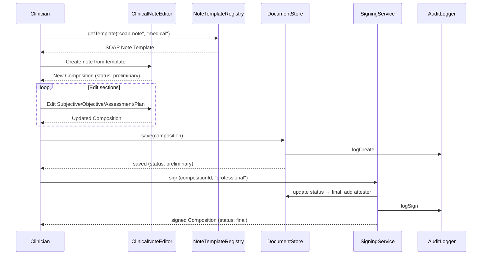
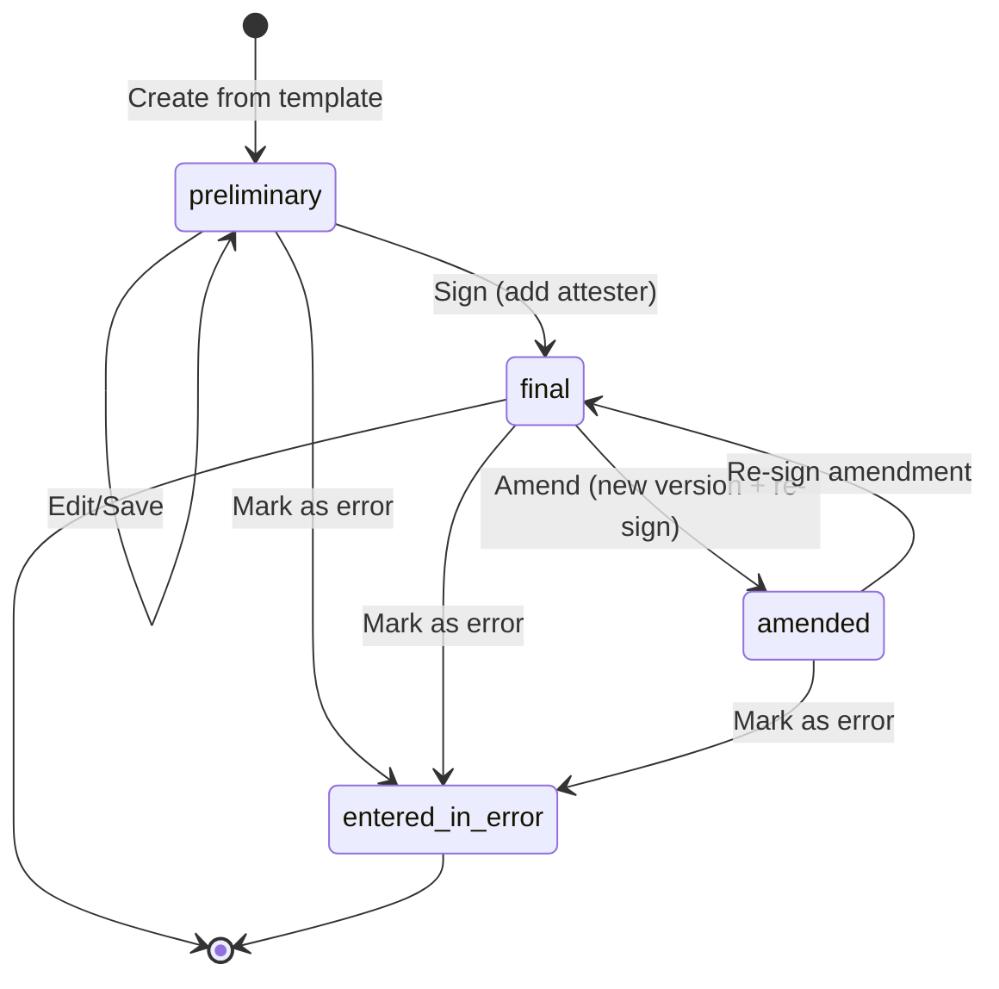

# Design Document: BrightChart Clinical Documentation

## Overview

This design establishes the Clinical Documentation module for BrightChart — the FHIR R4-compliant clinical note authoring, document management, and signing system. It delivers:

1. FHIR R4 Composition resource model for structured clinical notes with typed sections
2. FHIR R4 DocumentReference resource model for document metadata and attachments
3. A note template system with predefined templates (SOAP, H&P, Discharge Summary, Procedure Note) and specialty-specific templates
4. Document signing/attestation workflow with cryptographic signatures
5. A dedicated BrightChain encrypted pool for document data
6. Document serializers with round-trip properties
7. Document ACL with document:read/write/sign/admin permissions
8. Document audit trail with signing event tracking
9. C-CDA generation and consumption interfaces for interoperability
10. Documentation specialty extensions for medical, dental, and veterinary
11. Portability standard extension for document export/import
12. Four React components: ClinicalNoteEditor, DocumentList, DocumentViewer, NoteTemplateSelector

All interfaces live in `brightchart-lib` under `src/lib/documentation/`. React components live in `brightchart-react-components` under `src/lib/documentation/`.

### Key Design Decisions

- **Composition for structured notes, DocumentReference for everything else**: Compositions are the authoring format for clinical notes — they have typed sections, attestation, and encounter context. DocumentReferences are the metadata wrapper for any document (scanned paper, PDFs, C-CDA XML, external reports). A signed Composition can also be referenced by a DocumentReference for document management purposes.
- **Template-driven note creation**: Clinicians select a note template (SOAP, H&P, etc.) which pre-populates the Composition sections. Templates are specialty-aware and site-customizable.
- **Signing = status transition + cryptographic attestation**: Signing a note transitions it from `preliminary` to `final`, adds a `CompositionAttester` entry, and creates an ECIES cryptographic signature stored as a FHIR extension. This provides both FHIR-compliant attestation and BrightChain-native cryptographic proof.
- **C-CDA as an interface, not a storage format**: Clinical notes are stored as FHIR Compositions on BrightChain. C-CDA XML is generated on-demand for export/exchange and consumed on-demand for import. The C-CDA generator/consumer interfaces are defined here; implementations follow in a future backend module.
- **Separate DocumentSign permission**: Unlike clinical resources and encounters which have read/write/admin, documents add a `document:sign` permission because signing carries legal weight and should be independently controllable.

### Research Summary

- **FHIR R4 Composition** is a structured clinical document with status (preliminary, final, amended, entered-in-error), type (LOINC code), subject, encounter, author, attester, and sections. Sections have title, code, text (Narrative), and entry references. ([FHIR Composition](https://build.fhir.org/composition.html))
- **FHIR R4 DocumentReference** provides metadata about any document with status, type, subject, content (attachment with MIME type), and context (encounter, period, facility). ([FHIR DocumentReference](https://www.hl7.org/FHIR/R4/documentreference.html))
- **US Core Clinical Notes** guidance uses DocumentReference for exchanging clinical notes, with LOINC codes for document types. Required note types include Consultation Note, Discharge Summary, History and Physical, Progress Note, and Procedure Note. ([US Core Clinical Notes](https://build.fhir.org/ig/HL7/US-Core/clinical-notes.html))
- **SOAP Notes** follow the Subjective-Objective-Assessment-Plan structure. In FHIR, each SOAP section maps to a Composition.section with LOINC section codes (e.g., 10164-2 for History of Present Illness, 29545-1 for Physical Examination). ([Medplum SOAP Notes](https://www.medplum.com/docs/charting/soap-notes))
- **C-CDA** (Consolidated Clinical Document Architecture) is the HL7 standard for clinical document exchange using XML. Required under the 21st Century Cures Act for interoperability. Document types include CCD, Discharge Summary, H&P, Progress Note, Consultation Note, and Procedure Note.
- **LOINC Document Type Codes**: 11488-4 (Consultation Note), 18842-5 (Discharge Summary), 34117-2 (H&P), 11506-3 (Progress Note), 28570-0 (Procedure Note), 11504-8 (Operative Note), 34746-8 (Nurse Note), 57133-1 (Referral Note).


## Architecture

### System Architecture Diagram

```mermaid
graph TB
    subgraph "Frontend (Browser)"
        RC[brightchart-react-components]
        RC --> |uses| CL[brightchart-lib interfaces]
    end

    subgraph "brightchart-lib (Shared, Browser-Compatible)"
        CL --> COMP[Composition Resource]
        CL --> DOCREF[DocumentReference Resource]
        CL --> TMPL[Note Template System]
        CL --> SIGN[Signing/Attestation Types]
        CL --> DSTORE[Document Store Interface]
        CL --> DSEARCH[Document Search Interface]
        CL --> DSER[Document Serializer Interface]
        CL --> DACL[Document ACL Types]
        CL --> DAUDIT[Document Audit Types]
        CL --> CCDA[C-CDA Interfaces]
        CL --> DSPEC[Documentation Specialty Extensions]
        CL --> DPORT[Documentation Portability Types]
    end

    subgraph "Backend Services (Node.js, future)"
        DS[Document Store Implementation]
        DSE[Document Search Engine]
        DAL[Document Audit Logger]
        DACL_S[Document ACL Service]
        DSIGN[Document Signing Service]
        CCDA_G[C-CDA Generator]
        CCDA_C[C-CDA Consumer]
    end

    subgraph "BrightChain Platform"
        DPOOL[Document Data Pool]
        EPOOL[Encounter Pool<br/>from Module 3]
        CPOOL[Clinical Pool<br/>from Module 2]
        PPOOL[Patient Pool<br/>from Module 1]
        APOOL[Audit Pool<br/>shared]
        ECIES[ECIES Encryption]
    end

    DS --> DPOOL
    DS --> DSIGN
    DS --> DAL
    DS --> DACL_S
    DAL --> APOOL
    DS --> ECIES
    DS -.-> |validates refs| PPOOL
    DS -.-> |validates refs| EPOOL
```



### Note Authoring Workflow



### Document Signing Flow




## Components and Interfaces

### Composition Resource Interface

```typescript
interface ICompositionResource<TID = string> {
  resourceType: 'Composition';
  id?: string;
  meta?: IMeta;
  text?: INarrative;
  extension?: IExtension[];
  brightchainMetadata: IBrightChainMetadata<TID>;
  identifier?: IIdentifier;
  status: CompositionStatus;
  type: ICodeableConcept;              // LOINC document type
  category?: ICodeableConcept[];
  subject?: IReference<TID>;           // Patient reference
  encounter?: IReference<TID>;         // Encounter reference
  date: string;                        // dateTime
  author: IReference<TID>[];           // Required
  title: string;                       // Required
  confidentiality?: string;
  attester?: CompositionAttester<TID>[];
  custodian?: IReference<TID>;
  relatesTo?: CompositionRelatesTo<TID>[];
  event?: CompositionEvent<TID>[];
  section?: CompositionSection<TID>[];
}
```

### DocumentReference Resource Interface

```typescript
interface IDocumentReferenceResource<TID = string> {
  resourceType: 'DocumentReference';
  id?: string;
  meta?: IMeta;
  text?: INarrative;
  extension?: IExtension[];
  brightchainMetadata: IBrightChainMetadata<TID>;
  masterIdentifier?: IIdentifier;
  identifier?: IIdentifier[];
  status: DocumentReferenceStatus;
  docStatus?: CompositionStatus;
  type?: ICodeableConcept;
  category?: ICodeableConcept[];
  subject?: IReference<TID>;
  date?: string;                       // instant
  author?: IReference<TID>[];
  authenticator?: IReference<TID>;
  custodian?: IReference<TID>;
  relatesTo?: DocumentReferenceRelatesTo<TID>[];
  description?: string;
  securityLabel?: ICodeableConcept[];
  content: DocumentReferenceContent<TID>[];  // Required
  context?: DocumentReferenceContext<TID>;
}
```

### Note Template Interfaces

```typescript
interface INoteTemplateSection {
  title: string;
  code: ICodeableConcept;             // LOINC section code
  required: boolean;
  defaultText?: string;
  subsections?: INoteTemplateSection[];
  entryTypes?: ClinicalResourceType[];
}

interface INoteTemplate {
  templateId: string;
  name: string;
  description: string;
  loincTypeCode: string;
  specialtyCode: string;
  sections: INoteTemplateSection[];
  isDefault: boolean;
}

interface INoteTemplateRegistry {
  getTemplate(templateId: string): INoteTemplate;
  getTemplatesForType(loincTypeCode: string, specialtyCode?: string): INoteTemplate[];
  registerTemplate(template: INoteTemplate): void;
  getDefaultTemplate(loincTypeCode: string, specialtyCode: string): INoteTemplate;
}
```

### Document Signing Interface

```typescript
interface IDocumentSigningService<TID = string> {
  sign(compositionId: string, mode: AttestationMode, signerRef: IReference<TID>,
       signerKeys: Uint8Array, memberId: TID): Promise<ICompositionResource<TID>>;
  cosign(compositionId: string, cosignerRef: IReference<TID>,
         cosignerKeys: Uint8Array, memberId: TID): Promise<ICompositionResource<TID>>;
  amend(compositionId: string, amendments: Partial<ICompositionResource<TID>>,
        memberId: TID): Promise<ICompositionResource<TID>>;
}
```

### Document Store Interface

```typescript
interface IDocumentStore<TID = string> {
  storeComposition(composition: ICompositionResource<TID>, encryptionKeys: Uint8Array, memberId: TID): Promise<TID>;
  retrieveComposition(blockId: TID, decryptionKeys: Uint8Array, memberId: TID): Promise<ICompositionResource<TID>>;
  updateComposition(composition: ICompositionResource<TID>, encryptionKeys: Uint8Array, memberId: TID): Promise<TID>;
  storeDocumentReference(docRef: IDocumentReferenceResource<TID>, encryptionKeys: Uint8Array, memberId: TID): Promise<TID>;
  retrieveDocumentReference(blockId: TID, decryptionKeys: Uint8Array, memberId: TID): Promise<IDocumentReferenceResource<TID>>;
  updateDocumentReference(docRef: IDocumentReferenceResource<TID>, encryptionKeys: Uint8Array, memberId: TID): Promise<TID>;
  delete(resourceId: string, memberId: TID): Promise<void>;
  getVersionHistory(resourceId: string): Promise<TID[]>;
  getPoolId(): string;
}
```

### C-CDA Interfaces

```typescript
interface ICCDAGenerator<TID = string> {
  generate(composition: ICompositionResource<TID>, patient: IPatientResource<TID>,
           encounter?: IEncounterResource<TID>,
           clinicalResources?: ClinicalResource<TID>[]): Promise<string>;
}

interface ICCDAImportResult<TID = string> {
  composition: ICompositionResource<TID>;
  patient?: IPatientResource<TID>;
  encounter?: IEncounterResource<TID>;
  clinicalResources: ClinicalResource<TID>[];
  warnings: string[];
}

interface ICCDAConsumer<TID = string> {
  consume(ccdaXml: string): Promise<ICCDAImportResult<TID>>;
}
```

### Document ACL

```typescript
enum DocumentPermission {
  DocumentRead = 'document:read',
  DocumentWrite = 'document:write',
  DocumentSign = 'document:sign',
  DocumentAdmin = 'document:admin',
}

interface IDocumentACL<TID = string> extends IPoolACL<TID> {
  documentPermissions: Array<{
    memberId: TID;
    permissions: DocumentPermission[];
  }>;
}
```

### React Components

| Component | Props | Key Behavior |
|-----------|-------|-------------|
| `ClinicalNoteEditor` | `composition?: ICompositionResource<string>`, `template?: INoteTemplate`, `specialtyProfile?`, `onSave`, `onSign` | Section-based rich text editor, status indicators, sign button |
| `DocumentList` | `documents: (ICompositionResource \| IDocumentReferenceResource)[]`, `onSelect`, `filterTypes?`, `filterStatuses?` | List with type/title/date/author/status, signed indicators |
| `DocumentViewer` | `composition?: ICompositionResource<string>`, `documentReference?: IDocumentReferenceResource<string>`, `onResourceSelect?` | Read-only section display, PDF/image viewer for attachments |
| `NoteTemplateSelector` | `templates: INoteTemplate[]`, `specialtyProfile?`, `onSelect` | Template cards grouped by type, section preview |


## Data Models

### Document Data Pool Layout

| Pool | Purpose | Contents |
|------|---------|----------|
| Patient Data Pool (Module 1) | Patient identity | Encrypted IPatientResource blocks |
| Clinical Data Pool (Module 2) | Clinical resources | Encrypted ClinicalResource blocks |
| Encounter Data Pool (Module 3) | Encounters | Encrypted IEncounterResource blocks |
| **Document Data Pool** (this module) | Documents | Encrypted ICompositionResource + IDocumentReferenceResource blocks |
| Audit Log Pool (shared) | Audit trail | All audit entry blocks |

### Predefined Note Templates

#### SOAP Note (Medical Default)

| Section | LOINC Code | Required |
|---------|-----------|----------|
| Subjective | 10164-2 (History of Present Illness) | Yes |
| Objective | 29545-1 (Physical Examination) | Yes |
| Assessment | 51848-0 (Assessment) | Yes |
| Plan | 18776-5 (Plan of Care) | Yes |

#### History & Physical (Medical)

| Section | LOINC Code | Required |
|---------|-----------|----------|
| Chief Complaint | 10154-3 | Yes |
| History of Present Illness | 10164-2 | Yes |
| Past Medical History | 11348-0 | Yes |
| Review of Systems | 10187-3 | No |
| Physical Examination | 29545-1 | Yes |
| Assessment | 51848-0 | Yes |
| Plan | 18776-5 | Yes |


## Correctness Properties

### Property 1: Composition resource type invariant
*For any* composition, `resourceType` SHALL equal "Composition".

### Property 2: Composition status transition validity
*For any* composition status transition, only valid transitions SHALL be allowed: preliminary → final (sign), final → amended (amend), any → entered-in-error.

### Property 3: Attestation on sign
*For any* sign operation, the resulting composition SHALL have status "final" and at least one CompositionAttester entry with the signer's reference and timestamp.

### Property 4: Document serialization round-trip
*For any* valid ICompositionResource or IDocumentReferenceResource, serialize → deserialize → serialize SHALL produce byte-identical JSON.

### Property 5: Template instantiation completeness
*For any* note template, creating a Composition from the template SHALL produce a Composition with one section per template section, matching titles and codes.

### Property 6: Document ACL enforcement
*For any* member and document operation, if the member lacks the required DocumentPermission, the operation SHALL be denied. DocumentAdmin implies all other permissions.


## Error Handling

| Error | Severity | Code | HTTP Status | Trigger |
|-------|----------|------|-------------|---------|
| Patient reference not found | error | not-found | 404 | Document references non-existent patient |
| Encounter reference not found | error | not-found | 404 | Document references non-existent encounter |
| Invalid status transition | error | invalid | 422 | Attempted invalid composition status change |
| Signing permission denied | error | security | 403 | Member lacks DocumentSign permission |
| Amendment not allowed | error | security | 403 | Non-author without DocumentAdmin tries to amend |
| Template not found | error | not-found | 404 | Requested template ID does not exist |
| C-CDA parse failure | error | invalid | 400 | Invalid C-CDA XML provided to consumer |
| Serialization failure | error | invalid | 400 | Invalid JSON or non-conformant structure |


## Testing Strategy

### Property-Based Tests
- Composition/DocumentReference resource type invariants
- Status transition validity
- Serialization round-trip
- Template instantiation completeness
- ACL permission enforcement

### Unit Tests
- Predefined note templates (SOAP, H&P, Discharge Summary, Procedure Note)
- LOINC document type constants
- Specialty documentation extensions
- React component rendering, callbacks, and accessibility
