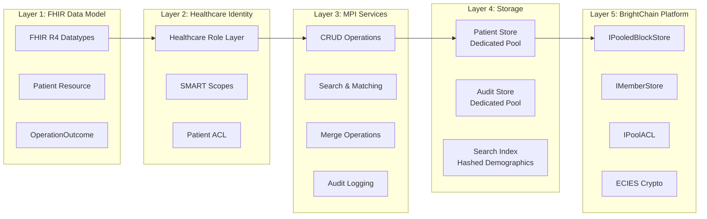

# Design Document: BrightChart Core Patient Identity (MPI)

## Overview

This design establishes the foundational patient identity module for BrightChart — a modular, open-standard EHR system built on BrightChain's decentralized, encrypted storage platform. The module delivers:

1. A FHIR R4-compliant Patient resource model with BrightChain storage metadata
2. A Master Patient Index (MPI) service with CRUD, search, matching, and merge operations
3. A healthcare role layer (FHIR PractitionerRole + SNOMED CT codes) mapped onto BrightChain members without modifying the core `MemberType` enum
4. SMART on FHIR v2-style scopes for granular permission control
5. A dedicated BrightDB encrypted pool for patient data with cross-pool member access
6. An open standard specification for patient records portability (`docs/papers/brightchart-open-standard.md`)
7. React UI components for patient search, demographics display, and creation/editing
8. An offline-capable data access layer with encrypted local caching and sync-on-reconnect

The architecture is designed as the first module in a trajectory toward a full EHR platform competing with Epic. All interfaces are extensible so future modules (Clinical Data Foundation, Encounter Management, Clinical Documentation, Orders & Results, Scheduling, Billing/Claims) can reference patient identities without tight coupling.

### Key Design Decisions

- **Patients are first-class BrightChain members**: Patients hold ECIES keys, authenticate, and access their own records via a patient portal experience. The "patient" healthcare role grants scoped access to their own data.
- **Healthcare roles are metadata, not core types**: BrightChart defines its own role hierarchy (Physician, MA, Nurse, Patient, Admin, etc.) stored as claims/metadata on BrightChain members. The `MemberType` enum (Admin, System, User, Anonymous) is NOT modified.
- **FHIR PractitionerRole + SNOMED CT**: Role taxonomy uses FHIR PractitionerRole resource structure with SNOMED CT role codes (e.g., `309343006` for Physician, `224535009` for Registered Nurse).
- **SMART on FHIR v2 scopes**: Permissions use the SMART v2 scope syntax (`patient/Patient.cruds`, `user/Patient.rs`) for granular access control, mapped onto BrightChain's existing `IPoolACL` and `PoolPermission` infrastructure.
- **Dedicated encrypted pool**: Patient data lives in its own BrightDB pool, leveraging `IPooledBlockStore` for isolation. Cross-pool member resolution uses the existing `IMemberStore` interface.
- **Open portability standard**: A formal specification document enables full-fidelity import/export of patient demographics, clinical data references, access policies, audit trails, and role definitions — supporting medical practices, dentists, and veterinarians.
- **Offline-capable with encrypted caching**: Patient records can be cached locally in encrypted form for offline access. When connectivity is restored, local changes sync back to the Patient_Store with version conflict resolution. Plaintext data is never persisted locally.

### Research Summary

- **SMART on FHIR v2 scopes** follow the pattern `context/ResourceType.cruds` where context is `patient`, `user`, or `system`, and CRUDS maps to Create, Read, Update, Delete, Search operations. ([HL7 SMART Scopes](https://www.hl7.org/fhir/us/core/scopes.html))
- **FHIR PractitionerRole** binds a practitioner to an organization with role codes from SNOMED CT or NUCC taxonomy. Key SNOMED CT codes: `309343006` (Physician), `224535009` (Registered Nurse), `309453006` (Medical Assistant). ([FHIR PractitionerRole](https://fhir.org/guides/argonaut/r2/1.0/ValueSet-provider-role.html))
- **Epic interoperability** uses FHIR R4 USCDI APIs and C-CDA for clinical document exchange. The 21st Century Cures Act mandates patient data portability via standardized APIs. ([Epic Design Overview](https://open.epic.com/DesignOverview))
- **FHIR R4 Patient resource** includes identifier, name, telecom, gender, birthDate, address, contact, communication, generalPractitioner, managingOrganization, and link fields. ([FHIR Patient](https://build.fhir.org/patient-definitions.html))

## Architecture

### System Architecture Diagram

```mermaid
graph TB
    subgraph "Frontend (Browser)"
        RC[brightchart-react-components]
        RC --> |uses| CL[brightchart-lib interfaces]
    end

    subgraph "brightchart-lib (Shared, Browser-Compatible)"
        CL --> FHIR[FHIR R4 Datatypes]
        CL --> PR[Patient Resource Model]
        CL --> HRL[Healthcare Role Layer]
        CL --> SCOPE[SMART Scope Definitions]
        CL --> MPI_I[MPI Service Interfaces]
        CL --> SER[Patient Serializer Interface]
        CL --> SEARCH_I[Search Engine Interface]
        CL --> AUDIT_I[Audit Log Interfaces]
        CL --> PORT[Portability Standard Types]
    end

    subgraph "Backend Services (Node.js)"
        MPI[MPI Service Implementation]
        PS[Patient Store]
        SE[Patient Search Engine]
        AL[Audit Logger]
        ACL[Patient ACL Service]
        EXP[Import/Export Service]
    end

    subgraph "BrightChain Platform"
        POOL[Patient Data Pool<br/>IPooledBlockStore]
        APOOL[Audit Log Pool<br/>IPooledBlockStore]
        MS[IMemberStore]
        AUTH[JWT Auth Middleware]
        ECIES[ECIES Encryption]
    end

    MPI --> PS
    MPI --> SE
    MPI --> AL
    MPI --> ACL
    MPI --> EXP
    PS --> POOL
    AL --> APOOL
    ACL --> POOL
    MPI --> AUTH
    PS --> ECIES
    ACL --> MS
```

### Layer Architecture

### Cross-Pool Member Access

Patients and practitioners are BrightChain members in the platform's member pool. Patient clinical data lives in a separate dedicated pool. Cross-pool access works as follows:

1. **Authentication**: Member authenticates via JWT (existing `createJwtAuthMiddleware`), producing an `IMemberContext` with `memberId` and `type`.
2. **Role Resolution**: The healthcare role layer resolves the member's BrightChart roles from metadata stored on their member record (not from `MemberType`).
3. **Scope Evaluation**: SMART scopes attached to the member's healthcare role are evaluated against the requested operation.
4. **Pool ACL Check**: The Patient ACL (extending `IPoolACL`) verifies the member has the required `PoolPermission` on the patient data pool.
5. **ECIES Decryption**: If authorized, the member's ECIES keys decrypt the patient record from the dedicated pool.

