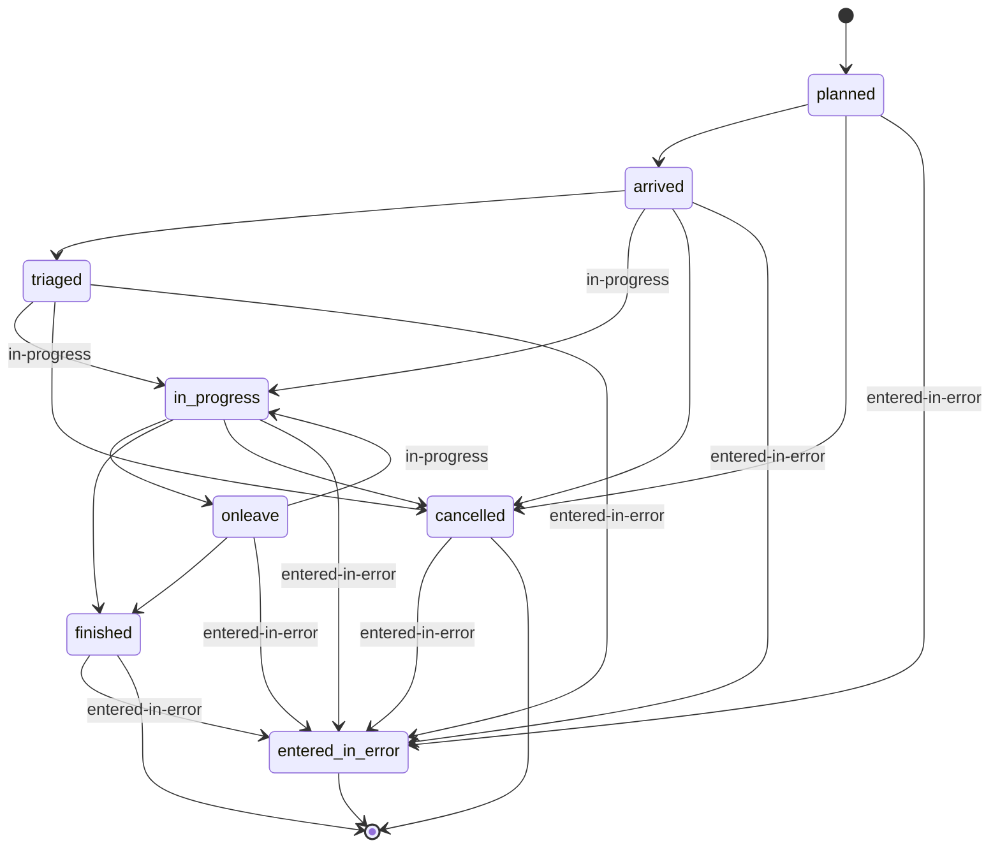
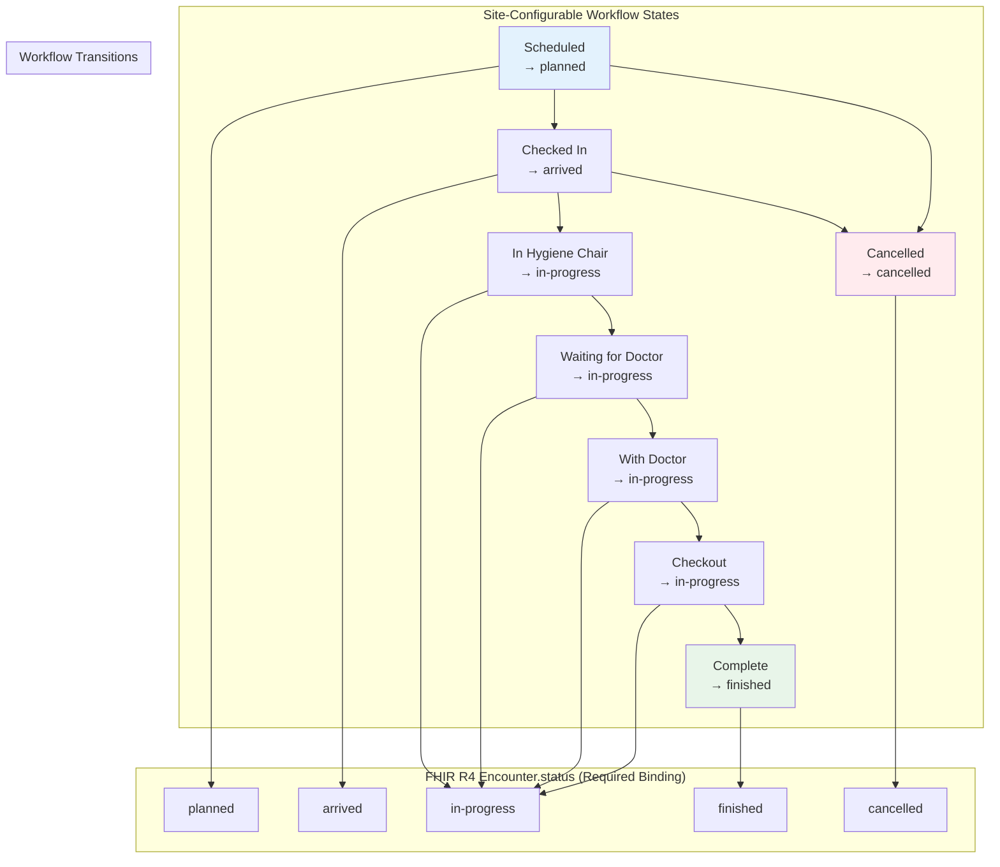
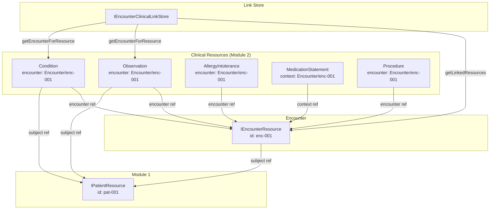
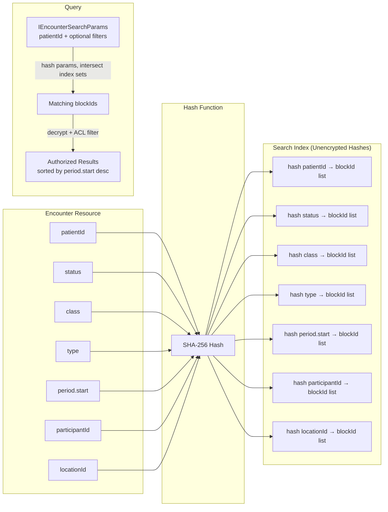
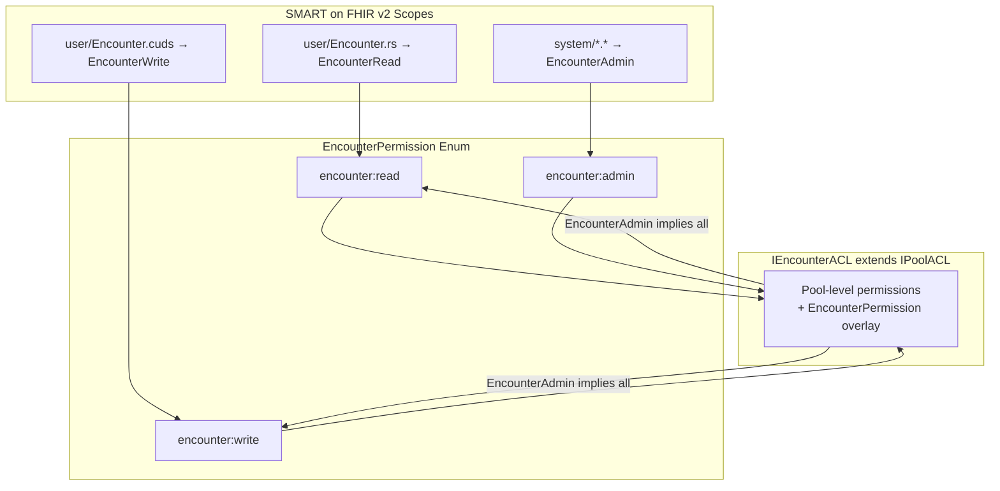

# Design Document: BrightChart Encounter Management

## Overview

This design establishes the Encounter Management module for BrightChart — the FHIR R4-compliant encounter tracking layer that resolves the forward-compatible encounter references stubbed in Module 2 (Clinical Data Foundation). It delivers:

1. A FHIR R4 Encounter resource model with BrightChain storage metadata and TID generics
2. Encounter backbone elements (participant, diagnosis, hospitalization, location, status/class history)
3. An encounter lifecycle state machine with FHIR-compliant status transitions
4. A site-configurable workflow state layer mapping practice-specific steps to FHIR statuses
5. A dedicated BrightChain encrypted pool for encounter data with CRUD, versioning, and integrity verification
6. Encounter serializer with round-trip properties matching the Clinical_Serializer pattern
7. Encounter-to-clinical-resource bidirectional linking
8. Encounter ACL extending IPoolACL with encounter:read/write/admin permissions
9. Encounter audit trail extending the Module 2 audit pattern
10. Encounter specialty extensions with default workflow configs for medical, dental, and veterinary
11. Portability standard extension for encounter data export/import
12. Four React components: EncounterList, EncounterDetailView, EncounterCheckInForm, EncounterWorkflowBoard

All interfaces live in `brightchart-lib` (browser-compatible, shared) under `src/lib/encounter/`. React components live in `brightchart-react-components` under `src/lib/encounter/`. No Node.js-specific code is introduced.

### Key Design Decisions

- **Encounters are separate blocks, not embedded in Patient or Clinical resources**: Each encounter is its own encrypted block in a dedicated encounter pool, referencing patients via `IReference` to `IPatientResource.id`. Clinical resources reference encounters via their existing `encounter` / `context` fields.
- **Two-layer status model**: `Encounter.status` always holds a FHIR R4 required-binding value (planned, arrived, triaged, in-progress, onleave, finished, cancelled, entered-in-error, unknown). A `workflowState` FHIR extension carries the site-specific sub-status. This preserves interoperability while giving practices the granularity they need.
- **Workflow states are configuration, not code**: `IEncounterWorkflowConfig` objects define ordered state lists, display labels, FHIR status mappings, and valid transitions. Switching from a medical workflow to a dental workflow changes a configuration object, not a code path. Sites can further customize.
- **Bidirectional encounter-clinical linking**: An `IEncounterClinicalLinkStore` provides both "encounter → clinical resources" and "clinical resource → encounter" lookups, resolving the forward-compatible references from Module 2.
- **Encounter ACL extends IPoolACL**: `IEncounterACL` adds `EncounterPermission` (encounter:read, encounter:write, encounter:admin) on top of the existing `PoolPermission` model, following the `IClinicalACL` pattern.
- **Shared audit pool**: Encounter audit entries go into the same audit pool as patient identity and clinical audit entries, extending `IClinicalAuditEntry` with encounter-specific fields.
- **Specialty-aware encounters**: Each specialty (medical, dental, veterinary) ships with default encounter class/type extensions and a default workflow config. The dental workflow includes operatory/chair tracking; the veterinary workflow includes species-aware triage and herd/flock group encounters.

### Research Summary

- **FHIR R4 Encounter** represents an interaction between a patient and healthcare provider(s). Key fields include status (required, 9 values), class (required, HL7 v3 ActCode), type, subject, participant, period, diagnosis, hospitalization, and location. The resource is Normative (FMM level 5). ([FHIR Encounter](https://build.fhir.org/encounter.html))
- **FHIR R4 Encounter Status** uses a required binding with values: planned, arrived, triaged, in-progress, onleave, finished, cancelled, entered-in-error, unknown. Status transitions follow clinical workflow patterns. ([HL7 Encounter Status](https://www.hl7.org/fhir/codesystem-encounter-status.html))
- **HL7 v3 ActCode** provides encounter class codes: IMP (inpatient), AMB (ambulatory), EMER (emergency), HH (home health), VR (virtual), FLD (field), SS (short stay), OBSENC (observation encounter), PRENC (pre-admission). ([HL7 v3 ActCode](http://terminology.hl7.org/CodeSystem/v3-ActCode))
- **US Core Encounter Profile** sets minimum expectations for the Encounter resource including status, class, type, subject, and period as must-support elements. ([US Core Encounter](https://healthedata1.github.io/TEMPUSCORE4/StructureDefinition-us-core-encounter.html))
- **Dental encounter workflows** typically follow: Scheduled → Checked In → Hygiene → Waiting for Doctor → With Doctor → Checkout → Complete, with operatory/chair assignment as a key location concept.
- **Veterinary encounter workflows** include species-aware triage, herd/flock group encounters, and recovery tracking. Common flow: Appointment → Waiting Room → Triage/Weigh-in → Exam Room → Surgery → Recovery → Owner Pickup → Discharged.


## Architecture

### System Architecture Diagram

```mermaid
graph TB
    subgraph "Frontend (Browser)"
        RC[brightchart-react-components]
        RC --> |uses| CL[brightchart-lib interfaces]
    end

    subgraph "brightchart-lib (Shared, Browser-Compatible)"
        CL --> FHIR_BASE[FHIR R4 Base Datatypes<br/>from Module 1]
        CL --> CLIN[Clinical Types<br/>from Module 2]
        CL --> ENC[Encounter Resource]
        CL --> ENC_BB[Encounter Backbone Elements]
        CL --> ENC_ENUM[Encounter Enumerations]
        CL --> ENC_LC[Encounter Lifecycle]
        CL --> ENC_WF[Workflow State Layer]
        CL --> ENC_SER[Encounter Serializer Interface]
        CL --> ENC_STORE[Encounter Store Interface]
        CL --> ENC_SEARCH[Encounter Search Interface]
        CL --> ENC_LINK[Encounter-Clinical Linking]
        CL --> ENC_ACL[Encounter ACL Types]
        CL --> ENC_AUDIT[Encounter Audit Types]
        CL --> ENC_SPEC[Encounter Specialty Extensions]
        CL --> ENC_PORT[Encounter Portability Types]
    end

    subgraph "Backend Services (Node.js, future)"
        ES[Encounter Store Implementation]
        ESE[Encounter Search Engine]
        EAL[Encounter Audit Logger]
        EACL_S[Encounter ACL Service]
        ELS[Encounter Lifecycle Service]
        ELINK[Encounter-Clinical Link Service]
        EEXP[Encounter Import/Export Service]
    end

    subgraph "BrightChain Platform"
        EPOOL[Encounter Data Pool<br/>IPooledBlockStore]
        CPOOL[Clinical Data Pool<br/>from Module 2]
        PPOOL[Patient Data Pool<br/>from Module 1]
        APOOL[Audit Log Pool<br/>shared with Modules 1 & 2]
        MS[IMemberStore]
        ECIES[ECIES Encryption]
    end

    ES --> EPOOL
    ES --> ELS
    ES --> EAL
    ES --> EACL_S
    EAL --> APOOL
    EACL_S --> EPOOL
    ES --> ECIES
    ES -.-> |validates patient refs| PPOOL
    ELINK -.-> |resolves clinical refs| CPOOL
```



### Encounter Lifecycle State Machine



### Workflow State Layer Architecture



### Encounter-Clinical Resource Linking



### Encounter Search Index Design



### Encounter ACL Integration




## Components and Interfaces

### Encounter Resource Interface (`brightchart-lib/src/lib/encounter/encounterResource.ts`)

```typescript
interface IEncounterResource<TID = string> {
  resourceType: 'Encounter';
  id?: string;
  meta?: IMeta;
  text?: INarrative;
  extension?: IExtension[];
  brightchainMetadata: IBrightChainMetadata<TID>;
  identifier?: IIdentifier[];
  status: EncounterStatus;
  statusHistory?: EncounterStatusHistory[];
  class: ICoding;
  classHistory?: EncounterClassHistory[];
  type?: ICodeableConcept[];
  serviceType?: ICodeableConcept;
  priority?: ICodeableConcept;
  subject?: IReference<TID>;           // Patient reference
  episodeOfCare?: IReference<TID>[];
  basedOn?: IReference<TID>[];         // ServiceRequest references
  participant?: EncounterParticipant<TID>[];
  appointment?: IReference<TID>[];     // Appointment references
  period?: IPeriod;
  length?: IDuration;
  reasonCode?: ICodeableConcept[];
  reasonReference?: IReference<TID>[]; // Condition, Procedure, Observation refs
  diagnosis?: EncounterDiagnosis<TID>[];
  account?: IReference<TID>[];
  hospitalization?: EncounterHospitalization<TID>;
  location?: EncounterLocation<TID>[];
  serviceProvider?: IReference<TID>;   // Organization reference
  partOf?: IReference<TID>;            // Parent Encounter reference
}
```

### Encounter Backbone Elements (`brightchart-lib/src/lib/encounter/backboneElements.ts`)

| Interface | Key Fields | Purpose |
|-----------|-----------|---------|
| `EncounterParticipant<TID>` | type (ICodeableConcept[]), period (IPeriod), individual (IReference) | Practitioners/persons involved |
| `EncounterDiagnosis<TID>` | condition (IReference, required), use (ICodeableConcept), rank (number) | Diagnoses linked to encounter |
| `EncounterHospitalization<TID>` | preAdmissionIdentifier, origin, admitSource, reAdmission, dietPreference, specialCourtesy, specialArrangement, destination, dischargeDisposition | Admission/discharge details |
| `EncounterLocation<TID>` | location (IReference, required), status (EncounterLocationStatus), physicalType, period | Where encounter occurred |
| `EncounterStatusHistory` | status (EncounterStatus, required), period (IPeriod, required) | Status change history |
| `EncounterClassHistory` | class (ICoding, required), period (IPeriod, required) | Class change history |

### Encounter Enumerations (`brightchart-lib/src/lib/encounter/enumerations.ts`)

| Enum/Constant | Values | FHIR Binding |
|---------------|--------|-------------|
| `EncounterStatus` | planned, arrived, triaged, in-progress, onleave, finished, cancelled, entered-in-error, unknown | required |
| `EncounterLocationStatus` | planned, active, reserved, completed | required |
| `ENCOUNTER_CLASS_*` | IMP, AMB, EMER, HH, VR, FLD, SS, OBSENC, PRENC (ICoding constants with system URI) | preferred |
| `DiagnosisRole` | AD, DD, CC, CM, pre-op, post-op, billing | example |

### Workflow State Interfaces (`brightchart-lib/src/lib/encounter/workflow/`)

```typescript
interface IEncounterWorkflowState {
  code: string;                        // Unique within a workflow config
  displayName: string;                 // Practice-facing label
  mappedFhirStatus: EncounterStatus;   // The FHIR status this maps to
  description?: string;
  sortOrder: number;                   // UI ordering
  isTerminal: boolean;                 // true for Complete, Cancelled, etc.
}

interface IEncounterWorkflowTransition {
  fromState: string;                   // Workflow state code
  toState: string;                     // Workflow state code
  requiredPermission?: EncounterPermission; // Optional elevated permission
}

interface IEncounterWorkflowConfig {
  configId: string;
  specialtyCode: string;               // Matches ISpecialtyProfile.specialtyCode
  siteName?: string;                   // Optional site-specific label
  states: IEncounterWorkflowState[];
  transitions: IEncounterWorkflowTransition[];
  defaultInitialState: string;         // Workflow state code for new encounters
}
```

### Encounter Lifecycle Interface (`brightchart-lib/src/lib/encounter/lifecycle/`)

```typescript
interface IEncounterLifecycle<TID = string> {
  isValidTransition(fromStatus: EncounterStatus, toStatus: EncounterStatus): boolean;
  transition(
    encounter: IEncounterResource<TID>,
    toStatus: EncounterStatus,
    memberId: TID
  ): IEncounterResource<TID> | IOperationOutcome;
  isValidWorkflowTransition(
    config: IEncounterWorkflowConfig,
    fromState: string,
    toState: string
  ): boolean;
  workflowTransition(
    encounter: IEncounterResource<TID>,
    config: IEncounterWorkflowConfig,
    toState: string,
    memberId: TID
  ): IEncounterResource<TID> | IOperationOutcome;
}

// Default FHIR status transition map
const ENCOUNTER_STATUS_TRANSITIONS: Record<EncounterStatus, EncounterStatus[]>;
```

### Encounter Store Interface (`brightchart-lib/src/lib/encounter/store/`)

```typescript
interface IEncounterStore<TID = string> {
  store(encounter: IEncounterResource<TID>, encryptionKeys: Uint8Array, memberId: TID): Promise<TID>;
  retrieve(blockId: TID, decryptionKeys: Uint8Array, memberId: TID): Promise<IEncounterResource<TID>>;
  update(encounter: IEncounterResource<TID>, encryptionKeys: Uint8Array, memberId: TID): Promise<TID>;
  delete(encounterId: string, memberId: TID): Promise<void>;
  getVersionHistory(encounterId: string): Promise<TID[]>;
  getPoolId(): string;
}
```

### Encounter Search Interface (`brightchart-lib/src/lib/encounter/search/`)

```typescript
interface IEncounterSearchParams {
  patientId: string;                    // Required
  status?: EncounterStatus | EncounterStatus[];
  classCode?: string | string[];
  type?: string | ICodeableConcept;
  dateRange?: { start?: string; end?: string };
  participantId?: string;
  locationId?: string;
  offset?: number;
  count?: number;
}

interface IEncounterSearchResult<TID = string> {
  entries: IEncounterResource<TID>[];
  total: number;
  offset: number;
  count: number;
}

interface IEncounterSearchEngine<TID = string> {
  search(params: IEncounterSearchParams, memberId: TID): Promise<IEncounterSearchResult<TID>>;
  indexEncounter(encounter: IEncounterResource<TID>): Promise<void>;
  removeIndex(encounterId: string): Promise<void>;
}
```

### Encounter Serializer Interface (`brightchart-lib/src/lib/encounter/serializer/`)

```typescript
interface IEncounterSerializer {
  serialize(encounter: IEncounterResource): string;
  deserialize(json: string): IEncounterResource;
}

interface IEncounterBundleSerializer {
  serialize(bundle: IEncounterExportBundle): string;
  deserialize(json: string): IEncounterExportBundle;
}
```

### Encounter-Clinical Linking Interface (`brightchart-lib/src/lib/encounter/linking/`)

```typescript
interface IEncounterClinicalLink<TID = string> {
  encounterId: string;
  clinicalResourceId: string;
  clinicalResourceType: ClinicalResourceType;
  linkedAt: Date;
  linkedBy: TID;
}

interface IEncounterClinicalLinkStore<TID = string> {
  linkResource(encounterId: string, clinicalResourceId: string, clinicalResourceType: ClinicalResourceType, memberId: TID): Promise<void>;
  unlinkResource(encounterId: string, clinicalResourceId: string, memberId: TID): Promise<void>;
  getLinkedResources(encounterId: string, resourceType?: ClinicalResourceType): Promise<IEncounterClinicalLink<TID>[]>;
  getEncounterForResource(clinicalResourceId: string): Promise<string | null>;
}
```

### Encounter ACL Interface (`brightchart-lib/src/lib/encounter/access/`)

```typescript
enum EncounterPermission {
  EncounterRead = 'encounter:read',
  EncounterWrite = 'encounter:write',
  EncounterAdmin = 'encounter:admin',
}

interface IEncounterACL<TID = string> extends IPoolACL<TID> {
  encounterPermissions: Array<{
    memberId: TID;
    permissions: EncounterPermission[];
  }>;
}
```

### Encounter Audit Interface (`brightchart-lib/src/lib/encounter/audit/`)

```typescript
interface IEncounterAuditEntry<TID = string> extends IClinicalAuditEntry<TID> {
  encounterStatus: EncounterStatus;
  statusTransition?: {
    fromStatus: EncounterStatus;
    toStatus: EncounterStatus;
    fromWorkflowState?: string;
    toWorkflowState?: string;
  };
}
```

### Encounter Specialty Extensions (`brightchart-lib/src/lib/encounter/specialty/`)

```typescript
interface IEncounterSpecialtyExtension {
  specialtyCode: string;
  encounterClassExtensions: ICoding[];
  encounterTypeExtensions: ICodeableConcept[];
  validationRules: IValidationRule[];
  defaultWorkflowConfig: IEncounterWorkflowConfig;
}
```

### Encounter Portability Interface (`brightchart-lib/src/lib/encounter/portability/`)

```typescript
interface IEncounterExportBundle<TID = string> extends IClinicalExportBundle<TID> {
  encounters: IEncounterResource<TID>[];
  encounterClinicalLinks: IEncounterClinicalLink<TID>[];
}
```

### React Components (`brightchart-react-components/src/lib/encounter/`)

| Component | Props | Key Behavior |
|-----------|-------|-------------|
| `EncounterList` | `encounters: IEncounterResource<string>[]`, `onSelect`, `workflowConfig?: IEncounterWorkflowConfig`, `filterStatuses?`, `filterClasses?` | List with class/type/status/period, grouping by class, workflow state labels |
| `EncounterDetailView` | `encounter: IEncounterResource<string>`, `linkedResources?: ClinicalResource<string>[]`, `workflowConfig?`, `onResourceSelect` | Full detail with status timeline, participants, diagnoses, locations, linked resources |
| `EncounterCheckInForm` | `onSubmit`, `encounter?`, `specialtyProfile?`, `workflowConfig?` | Create/edit form with patient selector, class/type/priority, participants, location |
| `EncounterWorkflowBoard` | `encounters: IEncounterResource<string>[]`, `workflowConfig: IEncounterWorkflowConfig`, `onTransition`, `onSelect` | Kanban-style board with columns per workflow state, drag-to-transition |


## Data Models

### Encounter Data Pool Layout

| Pool | Purpose | Contents |
|------|---------|----------|
| Patient Data Pool (Module 1) | Patient identity records | Encrypted `IPatientResource` blocks |
| Clinical Data Pool (Module 2) | Clinical resource records | Encrypted `ClinicalResource` blocks |
| **Encounter Data Pool** (this module) | Encounter records | Encrypted `IEncounterResource` blocks |
| Audit Log Pool (shared) | Audit trail | All audit entry blocks |

### Search Index Schema

| Index Key | Hash Input | Purpose |
|-----------|-----------|---------|
| `patient:{hash(patientId)}` | patientId string | Find all encounters for a patient |
| `status:{hash(status)}` | EncounterStatus value | Filter by status |
| `class:{hash(class.code)}` | Class code string | Filter by encounter class |
| `type:{hash(type[0].coding[0].code)}` | Primary type code | Filter by encounter type |
| `date:{hash(period.start)}` | Period start (YYYY-MM-DD) | Date range queries |
| `participant:{hash(participantId)}` | Participant reference | Find encounters by provider |
| `location:{hash(locationId)}` | Location reference | Find encounters by location |
| `composite:{hash(patientId+status)}` | Composite key | Fast patient+status lookup |

### Default Workflow Configs

#### Medical Default

| Workflow State | FHIR Status | Sort |
|---------------|-------------|------|
| Scheduled | planned | 1 |
| Checked In | arrived | 2 |
| Triage | triaged | 3 |
| With Provider | in-progress | 4 |
| Checkout | in-progress | 5 |
| Complete | finished | 6 |
| Cancelled | cancelled | 7 |

#### Dental Default

| Workflow State | FHIR Status | Sort |
|---------------|-------------|------|
| Scheduled | planned | 1 |
| Checked In | arrived | 2 |
| In Hygiene Chair | in-progress | 3 |
| Waiting for Doctor | in-progress | 4 |
| With Doctor | in-progress | 5 |
| Checkout | in-progress | 6 |
| Complete | finished | 7 |
| Cancelled | cancelled | 8 |

#### Veterinary Default

| Workflow State | FHIR Status | Sort |
|---------------|-------------|------|
| Appointment Booked | planned | 1 |
| In Waiting Room | arrived | 2 |
| Triage/Weigh-in | triaged | 3 |
| In Exam Room | in-progress | 4 |
| In Surgery | in-progress | 5 |
| In Recovery | in-progress | 6 |
| Owner Pickup | in-progress | 7 |
| Discharged | finished | 8 |
| Cancelled | cancelled | 9 |


## Correctness Properties

### Property 1: Encounter resource type invariant

*For any* encounter resource, the `resourceType` field SHALL equal "Encounter".

**Validates: Requirement 1.3**

### Property 2: Encounter status transition validity

*For any* encounter status transition from status A to status B, `isValidTransition(A, B)` SHALL return true if and only if the transition is in the defined valid transition set. The `entered-in-error` status SHALL be reachable from any other status.

**Validates: Requirements 4.1, 4.2**

### Property 3: Status history append-only growth

*For any* sequence of N valid status transitions on an encounter, the statusHistory array SHALL contain exactly N entries, each with the previous status and its active period, in chronological order.

**Validates: Requirement 4.4**

### Property 4: Workflow state to FHIR status consistency

*For any* workflow state transition, the resulting `Encounter.status` SHALL equal the `mappedFhirStatus` of the target workflow state, and the FHIR-level transition from the old mapped status to the new mapped status SHALL be valid per the FHIR transition rules.

**Validates: Requirements 4.9, 4.10**

### Property 5: Workflow config completeness

*For any* valid IEncounterWorkflowConfig, every workflow state's `mappedFhirStatus` SHALL be a valid EncounterStatus value, and every workflow transition SHALL map to a valid FHIR status transition.

**Validates: Requirements 4.8, 11.6**

### Property 6: Patient reference validation on create

*For any* encounter submitted for creation, if the patient reference does not exist in the Patient_Store, the Encounter_Store SHALL reject with OperationOutcome severity "error" code "not-found"; if it exists, the encounter SHALL be accepted.

**Validates: Requirements 5.4, 5.5**

### Property 7: Encounter serialization round-trip

*For any* valid IEncounterResource, serializing then deserializing then serializing SHALL produce byte-identical JSON output.

**Validates: Requirement 7.2**

### Property 8: Bidirectional link consistency

*For any* encounter-clinical link, `getLinkedResources(encounterId)` SHALL include the link, and `getEncounterForResource(clinicalResourceId)` SHALL return the encounterId.

**Validates: Requirements 8.1, 8.4**

### Property 9: Encounter ACL permission enforcement

*For any* member and encounter operation, if the member lacks the required EncounterPermission, the operation SHALL return OperationOutcome with severity "error" code "security" status 403. EncounterAdmin SHALL imply EncounterRead and EncounterWrite.

**Validates: Requirements 9.1, 9.3**

### Property 10: Encounter audit entry completeness

*For any* encounter operation, the resulting audit entry SHALL contain operation type, encounter id (or search params), member id, timestamp, request id, signature, encounter status, and status transition (if applicable).

**Validates: Requirements 10.1, 10.2**

### Property 11: Export bundle referential integrity

*For any* encounter export bundle, every patient reference in every encounter SHALL resolve to a patient in the bundle's patients array.

**Validates: Requirements 12.2, 12.3**


## Error Handling

| Error | Severity | Code | HTTP Status | Trigger |
|-------|----------|------|-------------|---------|
| Patient reference not found | error | not-found | 404 | Encounter references patient not in Patient_Store |
| Encounter not found | error | not-found | 404 | Requested blockId does not exist |
| Invalid status transition | error | invalid | 422 | Attempted FHIR status transition not in valid set |
| Invalid workflow transition | error | invalid | 422 | Attempted workflow state transition not in config |
| Insufficient permission | error | security | 403 | Member lacks required EncounterPermission |
| Block integrity failure | error | processing | 500 | Checksum mismatch during retrieval |
| Serialization failure | error | invalid | 400 | Invalid JSON or non-conformant structure |
| Import reference failure | error | not-found | 422 | Import bundle has unresolved patient references |


## Testing Strategy

### Property-Based Testing

| Test Category | Location | Properties |
|--------------|----------|------------|
| Encounter resource model | `brightchart-lib/src/lib/encounter/__tests__/*.property.spec.ts` | 1 |
| Encounter lifecycle | `brightchart-lib/src/lib/encounter/lifecycle/__tests__/*.property.spec.ts` | 2, 3, 4, 5 |
| Encounter store | `brightchart-lib/src/lib/encounter/store/__tests__/*.property.spec.ts` | 6 |
| Encounter serializer | `brightchart-lib/src/lib/encounter/serializer/__tests__/*.property.spec.ts` | 7 |
| Encounter linking | `brightchart-lib/src/lib/encounter/linking/__tests__/*.property.spec.ts` | 8 |
| Encounter ACL | `brightchart-lib/src/lib/encounter/access/__tests__/*.property.spec.ts` | 9 |
| Encounter audit | `brightchart-lib/src/lib/encounter/audit/__tests__/*.property.spec.ts` | 10 |
| Encounter portability | `brightchart-lib/src/lib/encounter/portability/__tests__/*.property.spec.ts` | 11 |

### Unit Tests

| Test Category | Location | Coverage |
|--------------|----------|----------|
| Specialty workflow configs | `brightchart-lib/src/lib/encounter/specialty/__tests__/*.spec.ts` | Default configs for medical/dental/vet |
| React components | `brightchart-react-components/src/lib/encounter/__tests__/*.spec.tsx` | UI behavior, callbacks, rendering |
| Enumeration completeness | `brightchart-lib/src/lib/encounter/__tests__/enumerations.spec.ts` | All FHIR values present |
