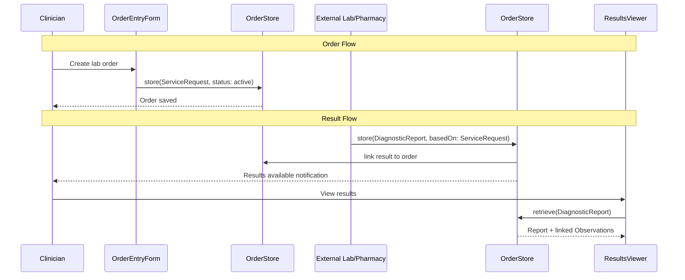
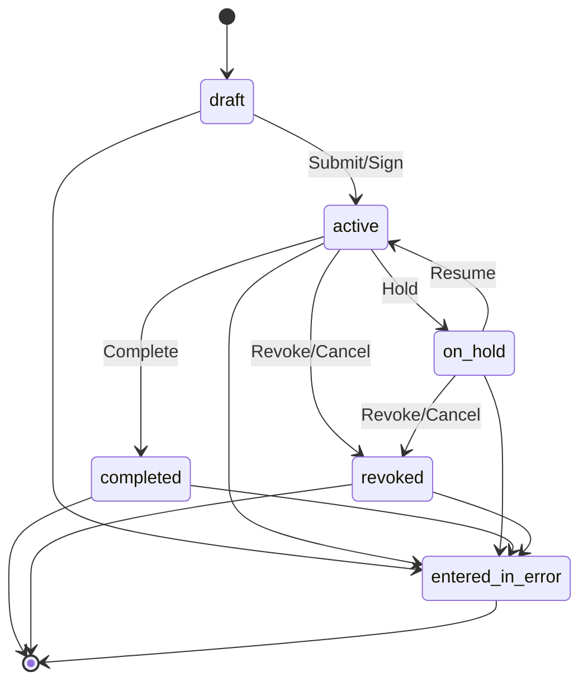
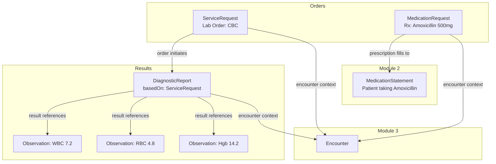
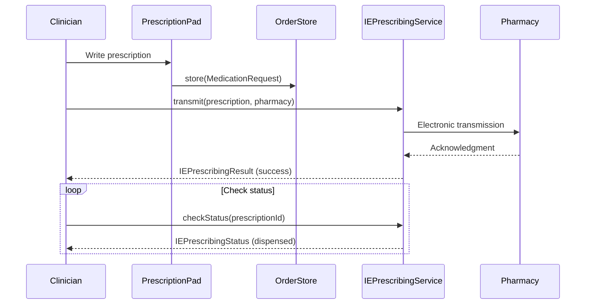

# Design Document: BrightChart Orders & Results

## Overview

This design establishes the Orders & Results module for BrightChart — the FHIR R4-compliant order entry, prescription management, and diagnostic results system. It delivers:

1. FHIR R4 ServiceRequest resource model for lab/imaging/referral/procedure orders
2. FHIR R4 MedicationRequest resource model for prescriptions and medication orders
3. FHIR R4 DiagnosticReport resource model for lab/radiology/pathology results
4. Order lifecycle state machines for ServiceRequest and MedicationRequest
5. Order-to-result bidirectional linking (ServiceRequest → DiagnosticReport → Observation)
6. E-prescribing interface types for electronic prescription transmission
7. A dedicated BrightChain encrypted pool for order/result data
8. Order serializers, search, ACL, and audit interfaces
9. Specialty order extensions for medical (CPT/LOINC), dental (CDT), and veterinary
10. Five React components: OrderEntryForm, PrescriptionPad, OrderList, ResultsViewer, ResultsList

All interfaces live in `brightchart-lib` under `src/lib/orders/`. React components live in `brightchart-react-components` under `src/lib/orders/`.

### Key Design Decisions

- **ServiceRequest for orders, MedicationRequest for prescriptions**: ServiceRequest covers lab orders, imaging orders, referrals, and procedure requests. MedicationRequest covers prescriptions. Both are "request" resources that initiate workflows.
- **DiagnosticReport groups Observations**: Lab results are individual Observations (from Module 2). DiagnosticReport groups them into a coherent report with interpretation, conclusion, and presented form. The `basedOn` field links back to the originating ServiceRequest.
- **MedicationRequest vs. MedicationStatement**: MedicationRequest (this module) = what was prescribed. MedicationStatement (Module 2) = what the patient is taking. A prescription (MedicationRequest) may result in a MedicationStatement when the patient fills and takes it.
- **E-prescribing as interfaces only**: The e-prescribing service interfaces define the contract for electronic prescription transmission. Actual NCPDP SCRIPT or Surescripts integration is a backend implementation concern.
- **Separate OrderSign permission**: Like DocumentSign in Module 4, OrderSign controls who can authorize/sign orders, which carries clinical and legal significance.

### Research Summary

- **FHIR R4 ServiceRequest** represents an order for a service (diagnostic, procedure, referral). Key fields: status (draft, active, on-hold, revoked, completed, entered-in-error, unknown), intent (proposal, plan, order, etc.), code, subject, encounter, requester, performer. ([FHIR ServiceRequest](https://build.fhir.org/servicerequest.html))
- **FHIR R4 MedicationRequest** represents a prescription or medication order. Key fields: status (active, on-hold, cancelled, completed, entered-in-error, stopped, draft, unknown), intent, medication[x], subject, encounter, requester, dosageInstruction, dispenseRequest, substitution. ([FHIR MedicationRequest](https://build.fhir.org/medicationrequest.html))
- **FHIR R4 DiagnosticReport** represents results of diagnostic services. Key fields: status (registered, partial, preliminary, final, amended, corrected, appended, cancelled, entered-in-error, unknown), code, subject, encounter, result (Observation references), conclusion, presentedForm. ([FHIR DiagnosticReport](https://build.fhir.org/diagnosticreport.html))
- **NCPDP SCRIPT** is the US standard for electronic prescribing, supporting NewRx, RxRenewal, CancelRx, and RxFill messages. Surescripts is the primary network.
- **Common lab order panels**: Basic Metabolic Panel (BMP), Complete Blood Count (CBC), Comprehensive Metabolic Panel (CMP), Lipid Panel, Thyroid Panel, Urinalysis — each identified by LOINC codes.


## Architecture

### Order-Result Data Flow



### Order Lifecycle State Machines



### Order-Result Linking



### E-Prescribing Flow




## Components and Interfaces

### ServiceRequest Resource Interface

```typescript
interface IServiceRequestResource<TID = string> {
  resourceType: 'ServiceRequest';
  id?: string;
  meta?: IMeta;
  text?: INarrative;
  extension?: IExtension[];
  brightchainMetadata: IBrightChainMetadata<TID>;
  identifier?: IIdentifier[];
  status: ServiceRequestStatus;
  intent: ServiceRequestIntent;
  category?: ICodeableConcept[];
  priority?: RequestPriority;
  doNotPerform?: boolean;
  code?: ICodeableConcept;
  orderDetail?: ICodeableConcept[];
  quantityQuantity?: IQuantity;
  quantityRatio?: IRatio;
  quantityRange?: IRange;
  subject: IReference<TID>;
  encounter?: IReference<TID>;
  occurrenceDateTime?: string;
  occurrencePeriod?: IPeriod;
  occurrenceTiming?: ITiming;
  asNeededBoolean?: boolean;
  asNeededCodeableConcept?: ICodeableConcept;
  authoredOn?: string;
  requester?: IReference<TID>;
  performerType?: ICodeableConcept;
  performer?: IReference<TID>[];
  reasonCode?: ICodeableConcept[];
  reasonReference?: IReference<TID>[];
  insurance?: IReference<TID>[];
  supportingInfo?: IReference<TID>[];
  specimen?: IReference<TID>[];
  bodySite?: ICodeableConcept[];
  note?: IAnnotation[];
  patientInstruction?: string;
}
```

### MedicationRequest Resource Interface

```typescript
interface IMedicationRequestResource<TID = string> {
  resourceType: 'MedicationRequest';
  id?: string;
  meta?: IMeta;
  text?: INarrative;
  extension?: IExtension[];
  brightchainMetadata: IBrightChainMetadata<TID>;
  identifier?: IIdentifier[];
  status: MedicationRequestStatus;
  statusReason?: ICodeableConcept;
  intent: MedicationRequestIntent;
  category?: ICodeableConcept[];
  priority?: RequestPriority;
  doNotPerform?: boolean;
  medicationCodeableConcept?: ICodeableConcept;
  medicationReference?: IReference<TID>;
  subject: IReference<TID>;
  encounter?: IReference<TID>;
  authoredOn?: string;
  requester?: IReference<TID>;
  performer?: IReference<TID>;
  reasonCode?: ICodeableConcept[];
  reasonReference?: IReference<TID>[];
  note?: IAnnotation[];
  dosageInstruction?: IDosage[];
  dispenseRequest?: MedicationRequestDispenseRequest<TID>;
  substitution?: MedicationRequestSubstitution<TID>;
  priorPrescription?: IReference<TID>;
}
```

### DiagnosticReport Resource Interface

```typescript
interface IDiagnosticReportResource<TID = string> {
  resourceType: 'DiagnosticReport';
  id?: string;
  meta?: IMeta;
  text?: INarrative;
  extension?: IExtension[];
  brightchainMetadata: IBrightChainMetadata<TID>;
  identifier?: IIdentifier[];
  basedOn?: IReference<TID>[];
  status: DiagnosticReportStatus;
  category?: ICodeableConcept[];
  code: ICodeableConcept;
  subject?: IReference<TID>;
  encounter?: IReference<TID>;
  effectiveDateTime?: string;
  effectivePeriod?: IPeriod;
  issued?: string;
  performer?: IReference<TID>[];
  resultsInterpreter?: IReference<TID>[];
  specimen?: IReference<TID>[];
  result?: IReference<TID>[];
  media?: DiagnosticReportMedia<TID>[];
  conclusion?: string;
  conclusionCode?: ICodeableConcept[];
  presentedForm?: IAttachment[];
}
```

### Order ACL

```typescript
enum OrderPermission {
  OrderRead = 'order:read',
  OrderWrite = 'order:write',
  OrderSign = 'order:sign',
  OrderAdmin = 'order:admin',
}
```

### React Components

| Component | Props | Key Behavior |
|-----------|-------|-------------|
| `OrderEntryForm` | `onSubmit`, `serviceRequest?`, `specialtyProfile?`, `encounter?` | Order type selector, searchable code, priority, performer, reason, validation |
| `PrescriptionPad` | `onSubmit`, `medicationRequest?`, `specialtyProfile?`, `interactionChecker?` | Medication search, dosage builder, dispense/refills, pharmacy selector, interaction warnings |
| `OrderList` | `orders: (IServiceRequestResource \| IMedicationRequestResource)[]`, `onSelect`, `filterTypes?`, `filterStatuses?` | Unified order list, type icons, status/priority styling, filtering |
| `ResultsViewer` | `report: IDiagnosticReportResource`, `observations?: IObservationResource[]`, `onObservationSelect?` | Report details, observation values with abnormal flagging, attachment viewer |
| `ResultsList` | `reports: IDiagnosticReportResource[]`, `onSelect`, `filterCategories?` | Report list, category/status filtering, abnormal result flagging |


## Data Models

### Pool Layout

| Pool | Purpose |
|------|---------|
| Patient Pool (Module 1) | Patient identity |
| Clinical Pool (Module 2) | Clinical resources (Observation, Condition, etc.) |
| Encounter Pool (Module 3) | Encounters |
| Document Pool (Module 4) | Compositions, DocumentReferences |
| **Order Pool** (this module) | ServiceRequest, MedicationRequest, DiagnosticReport |
| Audit Pool (shared) | All audit entries |


## Correctness Properties

1. **Resource type invariants**: ServiceRequest.resourceType = "ServiceRequest", MedicationRequest.resourceType = "MedicationRequest", DiagnosticReport.resourceType = "DiagnosticReport"
2. **Order status transition validity**: Only valid transitions per the defined state machines
3. **Order-result link consistency**: Bidirectional — getResultsForOrder and getOrderForResult are consistent
4. **Serialization round-trip**: For all three resource types
5. **ACL enforcement**: OrderAdmin implies all; missing permission → 403
6. **DiagnosticReport.basedOn integrity**: Every basedOn reference resolves to an existing ServiceRequest


## Error Handling

| Error | Code | HTTP | Trigger |
|-------|------|------|---------|
| Patient/encounter ref not found | not-found | 404 | Invalid reference |
| Invalid status transition | invalid | 422 | Bad order state change |
| Insufficient permission | security | 403 | Missing OrderPermission |
| E-prescribing transmission failure | processing | 502 | Pharmacy communication error |
| Drug interaction detected | warning | 200 | Interaction checker flags issue (non-blocking) |
