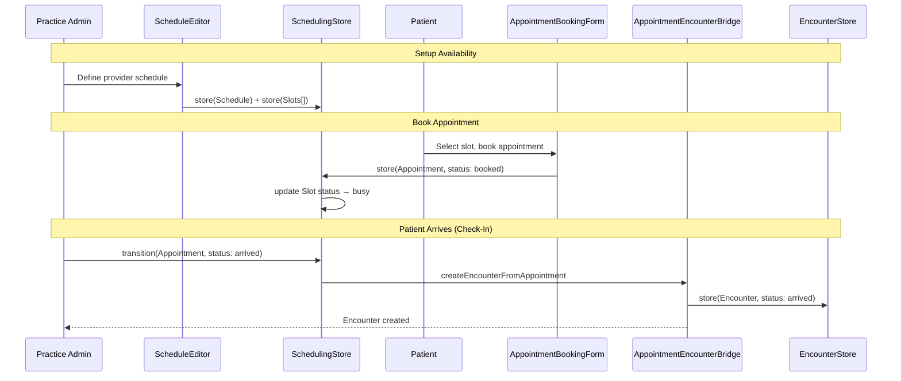
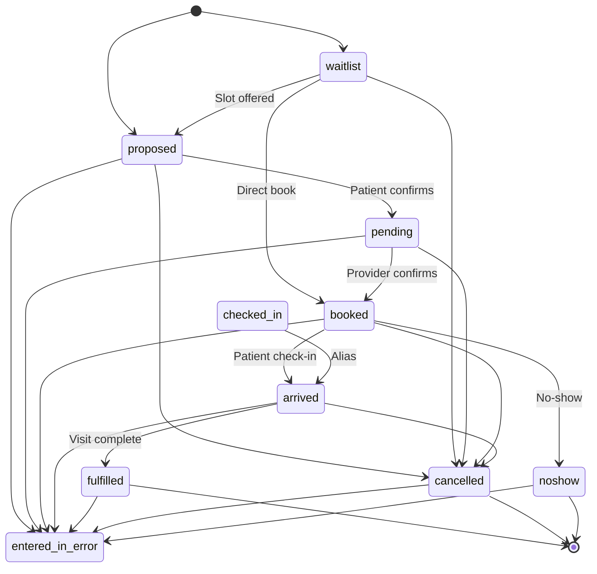
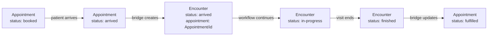

# Design Document: BrightChart Scheduling

## Overview

This design establishes the Scheduling module for BrightChart — the FHIR R4-compliant appointment booking, provider availability, and waitlist management system. It delivers:

1. FHIR R4 Schedule, Slot, and Appointment resource models with BrightChain metadata
2. Appointment lifecycle state machine with Encounter bridging
3. Waitlist management with priority-based slot matching
4. Appointment reminder configuration interfaces
5. A dedicated BrightChain encrypted pool for scheduling data
6. Scheduling serializers, search, ACL, and audit interfaces
7. Specialty scheduling extensions for medical, dental, and veterinary
8. Four React components: ScheduleCalendar, AppointmentBookingForm, ScheduleEditor, WaitlistManager

All interfaces live in `brightchart-lib` under `src/lib/scheduling/`. React components live in `brightchart-react-components` under `src/lib/scheduling/`.

### Key Design Decisions

- **Schedule → Slot → Appointment hierarchy**: Schedules define availability windows for actors (providers, locations). Slots are the atomic bookable units within a Schedule. Appointments book one or more Slots for a patient.
- **Appointment → Encounter bridge**: When a patient arrives (appointment status → "arrived"), the bridge creates an Encounter from the Appointment data. This connects the scheduling and clinical workflows seamlessly.
- **Waitlist as a first-class concept**: The waitlist is not a FHIR resource but a BrightChart-specific feature. When a slot opens, the waitlist service matches waiting patients and creates proposed Appointments.
- **Reminders as configuration, not implementation**: Reminder interfaces define what to send and when. Actual delivery (SMS, email, push) is a backend concern.
- **Specialty-aware durations and sequencing**: Dental scheduling supports hygienist-then-doctor sequencing (two linked appointments). Veterinary scheduling supports species-aware durations and farm call block scheduling.

### Research Summary

- **FHIR R4 Schedule** provides a container for time-slots. Key fields: active, serviceCategory, serviceType, specialty, actor (required — who/what the schedule is for), planningHorizon, comment. ([FHIR Schedule](http://hl7.org/fhir/r4/schedule.html))
- **FHIR R4 Slot** represents a bookable time window. Key fields: schedule (required), status (required: busy, free, busy-unavailable, busy-tentative, entered-in-error), start (required), end (required), overbooked, serviceType, specialty. ([FHIR Slot](https://build.fhir.org/slot.html))
- **FHIR R4 Appointment** represents a booking. Key fields: status (required: proposed, pending, booked, arrived, fulfilled, cancelled, noshow, entered-in-error, checked-in, waitlist), participant (required — patient, provider, location), start, end, slot references, basedOn (ServiceRequest), reasonCode. ([FHIR Appointment](https://build.fhir.org/appointment.html))
- **Dental scheduling** typically involves operatory/chair assignment, hygienist-then-doctor sequencing, and procedure-specific durations (cleaning 60min, filling 30min, crown 90min).
- **Veterinary scheduling** includes species-aware durations, farm call scheduling with travel time, and herd vaccination block appointments.


## Architecture

### Scheduling Data Flow



### Appointment Lifecycle



### Appointment-Encounter Bridge




## Components and Interfaces

### Resource Interfaces

```typescript
interface IScheduleResource<TID = string> {
  resourceType: 'Schedule';
  // ... FHIR metadata + brightchainMetadata
  identifier?: IIdentifier[];
  active?: boolean;
  serviceCategory?: ICodeableConcept[];
  serviceType?: ICodeableConcept[];
  specialty?: ICodeableConcept[];
  actor: IReference<TID>[];
  planningHorizon?: IPeriod;
  comment?: string;
}

interface ISlotResource<TID = string> {
  resourceType: 'Slot';
  // ... FHIR metadata + brightchainMetadata
  identifier?: IIdentifier[];
  serviceCategory?: ICodeableConcept[];
  serviceType?: ICodeableConcept[];
  specialty?: ICodeableConcept[];
  appointmentType?: ICodeableConcept;
  schedule: IReference<TID>;
  status: SlotStatus;
  start: string;  // instant
  end: string;    // instant
  overbooked?: boolean;
  comment?: string;
}

interface IAppointmentResource<TID = string> {
  resourceType: 'Appointment';
  // ... FHIR metadata + brightchainMetadata
  identifier?: IIdentifier[];
  status: AppointmentStatus;
  cancelationReason?: ICodeableConcept;
  serviceCategory?: ICodeableConcept[];
  serviceType?: ICodeableConcept[];
  specialty?: ICodeableConcept[];
  appointmentType?: ICodeableConcept;
  reasonCode?: ICodeableConcept[];
  reasonReference?: IReference<TID>[];
  priority?: number;
  description?: string;
  start?: string;
  end?: string;
  minutesDuration?: number;
  slot?: IReference<TID>[];
  created?: string;
  comment?: string;
  patientInstruction?: string;
  basedOn?: IReference<TID>[];
  participant: AppointmentParticipant<TID>[];
  requestedPeriod?: IPeriod[];
}
```

### Scheduling ACL

```typescript
enum SchedulingPermission {
  SchedulingRead = 'scheduling:read',
  SchedulingWrite = 'scheduling:write',
  SchedulingAdmin = 'scheduling:admin',
}
```

### React Components

| Component | Props | Key Behavior |
|-----------|-------|-------------|
| `ScheduleCalendar` | `appointments`, `slots`, `onSlotSelect`, `onAppointmentSelect`, `viewMode`, `filters` | Day/week/month calendar, colored appointment blocks, free slot areas |
| `AppointmentBookingForm` | `onSubmit`, `appointment?`, `availableSlots`, `specialtyProfile?` | Patient/provider/slot selection, reason, priority, validation |
| `ScheduleEditor` | `schedule`, `slots`, `onSave` | Availability grid editor, recurring patterns, slot generation |
| `WaitlistManager` | `entries`, `onOfferSlot`, `onRemove` | Priority-sorted list, patient/service/preference display, offer/remove actions |


## Data Models

### Pool Layout

All scheduling resources (Schedule, Slot, Appointment) stored in a dedicated Scheduling Pool. Audit entries in the shared Audit Pool.

### Default Specialty Durations

| Specialty | Appointment Type | Default Duration |
|-----------|-----------------|-----------------|
| Medical | New Patient | 60 min |
| Medical | Follow-up | 15 min |
| Medical | Physical Exam | 30 min |
| Dental | Cleaning/Prophylaxis | 60 min |
| Dental | Filling | 30 min |
| Dental | Crown Prep | 90 min |
| Dental | Emergency | 30 min |
| Veterinary | Cat Exam | 20 min |
| Veterinary | Dog Exam | 30 min |
| Veterinary | Equine Exam | 60 min |
| Veterinary | Farm Call | 120 min |


## Correctness Properties

1. **Resource type invariants**: Schedule/Slot/Appointment resourceType fields match their fixed values
2. **Appointment status transition validity**: Only valid transitions per the state machine
3. **Slot-Appointment consistency**: When an Appointment books a Slot, the Slot status becomes busy; when cancelled, the Slot returns to free
4. **Appointment-Encounter bridge consistency**: Bidirectional — getEncounterForAppointment and getAppointmentForEncounter are consistent
5. **Serialization round-trip**: For all three resource types
6. **ACL enforcement**: SchedulingAdmin implies all; missing permission → 403
7. **Waitlist priority ordering**: Waitlist entries are always returned sorted by priority then createdAt
