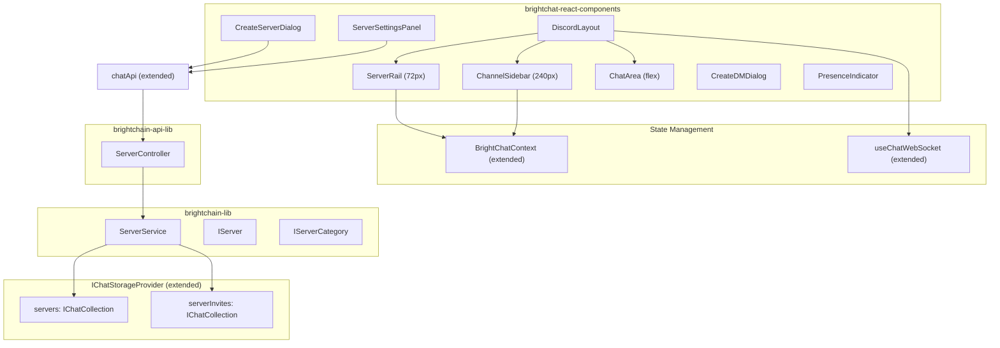
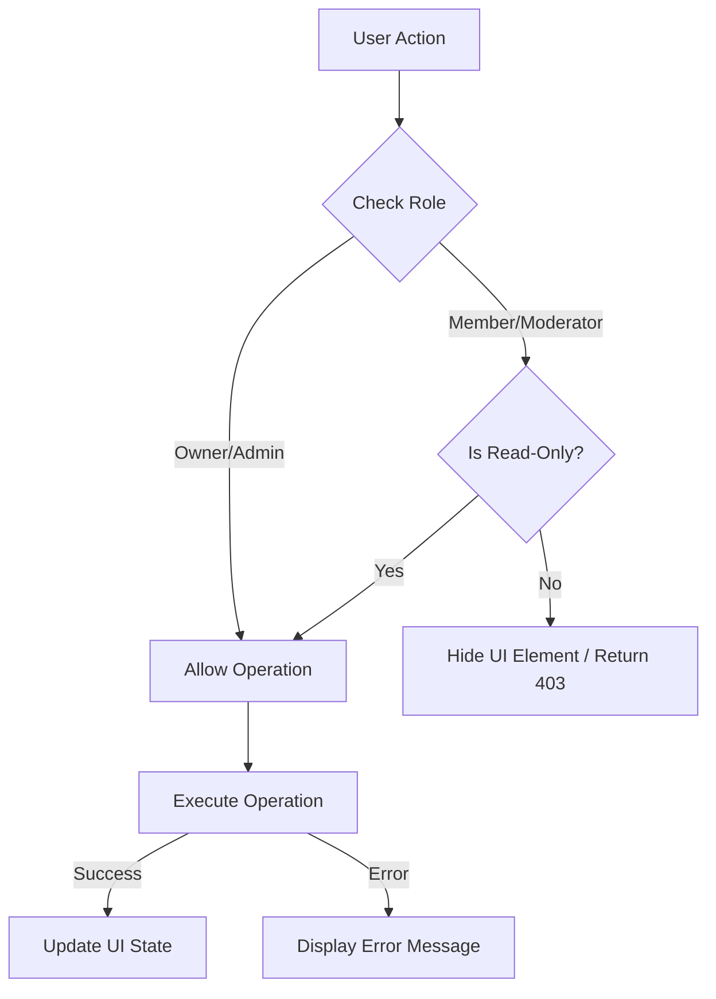

# Design Document: BrightChat Discord Experience

## Overview

This design introduces a "Server" organizational layer on top of the existing BrightChat channel infrastructure, along with a Discord-style three-panel navigation UI. The Server concept groups channels into communities with categories, membership, and invite systems. The frontend adopts a Server Rail → Channel Sidebar → Chat Area layout pattern familiar to Discord users.

The design leverages existing patterns extensively: the generic `<TId, TData>` interface pattern, `IChatCollection<T>` storage abstraction, `BaseController` API pattern, `handleApiCall` frontend wrapper, and MUI component library. New components integrate with the existing `BrightChatContext`, `useChatWebSocket`, and `createChatApiClient` infrastructure.

## Architecture



## Components and Interfaces

### Data Interfaces (brightchain-lib)

#### IServer<TId, TData>

```typescript
export interface IServer<TId = string, TData = string> {
  id: TId;
  name: string;
  iconUrl?: string;
  ownerId: TId;
  memberIds: TId[];
  channelIds: TId[];
  categories: IServerCategory<TId>[];
  createdAt: Date;
  updatedAt: Date;
}
```

#### IServerCategory<TId>

```typescript
export interface IServerCategory<TId = string> {
  id: TId;
  name: string;
  position: number;
  channelIds: TId[];
}
```

#### IChannel Extension

The existing `IChannel` interface gains a `serverId` field:

```typescript
export interface IChannel<TId = string, TData = string> {
  // ... existing fields ...
  serverId?: TId; // Links channel to its parent Server
}
```

#### IServerInviteToken<TId>

```typescript
export interface IServerInviteToken<TId = string> {
  token: string;
  serverId: TId;
  createdBy: TId;
  createdAt: Date;
  expiresAt?: Date;
  maxUses?: number;
  currentUses: number;
}
```

#### IServerUpdate

```typescript
export interface IServerUpdate {
  name?: string;
  iconUrl?: string;
  categories?: IServerCategory[];
}
```

### Response Interfaces (brightchain-lib)

```typescript
export type ICreateServerResponse<TId = string, TData = string> = IApiEnvelope<IServer<TId, TData>>;
export type IListServersResponse<TId = string, TData = string> = IApiEnvelope<IPaginatedResult<IServer<TId, TData>>>;
export type IGetServerResponse<TId = string, TData = string> = IApiEnvelope<IServer<TId, TData>>;
export type IUpdateServerResponse<TId = string, TData = string> = IApiEnvelope<IServer<TId, TData>>;
export type IDeleteServerResponse = IApiEnvelope<{ deleted: boolean }>;
export type IAddServerMembersResponse = IApiEnvelope<{ added: string[] }>;
export type IRemoveServerMemberResponse = IApiEnvelope<{ removed: string }>;
export type ICreateServerInviteResponse<TId = string> = IApiEnvelope<IServerInviteToken<TId>>;
export type IRedeemServerInviteResponse = IApiEnvelope<{ redeemed: boolean }>;
```

### Request Interfaces (brightchat-lib)

```typescript
export interface CreateServerParams {
  name: string;
  iconUrl?: string;
}

export interface UpdateServerParams {
  name?: string;
  iconUrl?: string;
  categories?: IServerCategory[];
}

export interface CreateServerInviteParams {
  maxUses?: number;
  expiresInMs?: number;
}

export interface AddServerMembersParams {
  memberIds: string[];
}
```

### ServerService (brightchain-lib/services/communication)

Follows the same pattern as `ChannelService`:

```typescript
export class ServerService {
  private readonly servers: Map<string, IServer>;
  private readonly serverInviteTokens: Map<string, IServerInviteToken>;
  private readonly serverCollection: IChatCollection<IServer> | undefined;
  private readonly serverInviteCollection: IChatCollection<IServerInviteToken> | undefined;
  private readonly channelService: ChannelService;
  private readonly eventEmitter: ICommunicationEventEmitter;

  constructor(options: {
    channelService: ChannelService;
    storageProvider?: IChatStorageProvider;
    eventEmitter?: ICommunicationEventEmitter;
  });

  // CRUD
  createServer(ownerId: string, params: CreateServerParams): Promise<IServer>;
  getServer(serverId: string): Promise<IServer>;
  updateServer(serverId: string, userId: string, update: IServerUpdate): Promise<IServer>;
  deleteServer(serverId: string, userId: string): Promise<void>;
  listServersForMember(memberId: string, pagination?: PaginationParams): Promise<IPaginatedResult<IServer>>;

  // Membership
  addMembers(serverId: string, userId: string, memberIds: string[]): Promise<string[]>;
  removeMember(serverId: string, userId: string, memberId: string): Promise<void>;
  getMemberRole(serverId: string, memberId: string): DefaultRole | null;

  // Invites
  createInvite(serverId: string, userId: string, params: CreateServerInviteParams): Promise<IServerInviteToken>;
  redeemInvite(serverId: string, token: string, userId: string): Promise<void>;

  // Channel management within server
  createChannelInServer(serverId: string, userId: string, params: CreateChannelParams, categoryId?: string): Promise<IChannel>;
  removeChannelFromServer(serverId: string, channelId: string, userId: string): Promise<void>;
}
```

### ServerController (brightchain-api-lib)

Mounted at `/brightchat/servers`, extends `BaseController`:

| Method | Path | Description |
|--------|------|-------------|
| POST | `/` | Create server |
| GET | `/` | List user's servers |
| GET | `/:serverId` | Get server details |
| PUT | `/:serverId` | Update server |
| DELETE | `/:serverId` | Delete server |
| POST | `/:serverId/members` | Add members |
| DELETE | `/:serverId/members/:memberId` | Remove member |
| POST | `/:serverId/invites` | Create invite |
| POST | `/:serverId/invites/:token/redeem` | Redeem invite |

### Frontend Components (brightchat-react-components)

#### DiscordLayout

Replaces `BrightChatLayout` as the primary layout. Three-panel structure:

```typescript
interface DiscordLayoutProps {
  // No props needed - reads from context
}
```

- Renders `ServerRail` | `ChannelSidebar` | `ChatArea`
- Responsive: collapses to hamburger overlay below 768px
- Wraps with `BrightChatProvider`

#### ServerRail

```typescript
interface ServerRailProps {
  servers: IServer[];
  activeServerId: string | null;
  onServerSelect: (serverId: string) => void;
  onHomeClick: () => void;
  onCreateServer: () => void;
}
```

- 72px wide vertical strip
- Circular server icons with tooltip on hover
- Home icon at top (DM view)
- "+" button at bottom (Create Server)
- Active server has pill indicator
- Keyboard navigation with Arrow keys

#### ChannelSidebar

```typescript
interface ChannelSidebarProps {
  server: IServer | null;
  channels: IChannel[];
  activeChannelId: string | null;
  onChannelSelect: (channelId: string) => void;
  onCreateChannel: () => void;
  userRole: DefaultRole | null;
}
```

- 240px wide
- Server name header with settings gear icon
- Collapsible category sections
- Channel list items with # prefix
- "Create Channel" button (visible to admin/owner only)
- Right-click context menu for channel actions

#### CreateServerDialog

```typescript
interface CreateServerDialogProps {
  open: boolean;
  onClose: () => void;
  onCreated: (server: IServer) => void;
}
```

- MUI Dialog with name input (1-100 chars) and optional icon upload
- Validation feedback inline
- Calls `chatApi.createServer()`
- On success: closes dialog, navigates to new server's general channel

#### CreateDMDialog

```typescript
interface CreateDMDialogProps {
  open: boolean;
  onClose: () => void;
  onConversationStarted: (conversationId: string) => void;
}
```

- MUI Dialog with searchable user list
- Debounced search input
- Checks for existing conversation before creating
- Navigates to conversation thread on completion

#### ServerSettingsPanel

```typescript
interface ServerSettingsPanelProps {
  serverId: string;
  open: boolean;
  onClose: () => void;
}
```

- MUI Drawer or full-page panel
- Tabs: Overview, Members, Categories, Invites
- Role assignment controls (owner/admin/member)
- Category reorder via drag or up/down buttons

#### PresenceIndicator

```typescript
interface PresenceIndicatorProps {
  status: PresenceStatus;
  size?: 'small' | 'medium';
}
```

- Colored dot badge on avatars
- Green (online), Yellow (idle), Red (dnd), Gray (offline)
- Used in DM list, member lists, message threads

### Extended BrightChatContext

```typescript
export interface BrightChatContextValue {
  // ... existing fields ...
  
  // Server navigation state
  activeServerId: string | null;
  setActiveServerId: (serverId: string | null) => void;
  
  // Cached server data
  serverChannels: IChannel[];
  serverCategories: IServerCategory[];
}
```

SessionStorage keys:
- `brightchat:activeServerId`
- `brightchat:activeChannelId`

### Extended WebSocket Events

New `CommunicationEventType` values:

```typescript
export enum CommunicationEventType {
  // ... existing ...
  SERVER_CHANNEL_CREATED = 'communication:server_channel_created',
  SERVER_CHANNEL_DELETED = 'communication:server_channel_deleted',
  SERVER_MEMBER_JOINED = 'communication:server_member_joined',
  SERVER_MEMBER_REMOVED = 'communication:server_member_removed',
  SERVER_UPDATED = 'communication:server_updated',
}
```

New event interfaces:

```typescript
export interface IServerChannelCreatedEvent extends ICommunicationEventBase {
  type: CommunicationEventType.SERVER_CHANNEL_CREATED;
  data: { serverId: string; channelId: string; channelName: string; categoryId: string };
}

export interface IServerChannelDeletedEvent extends ICommunicationEventBase {
  type: CommunicationEventType.SERVER_CHANNEL_DELETED;
  data: { serverId: string; channelId: string };
}

export interface IServerMemberJoinedEvent extends ICommunicationEventBase {
  type: CommunicationEventType.SERVER_MEMBER_JOINED;
  data: { serverId: string; memberId: string };
}

export interface IServerMemberRemovedEvent extends ICommunicationEventBase {
  type: CommunicationEventType.SERVER_MEMBER_REMOVED;
  data: { serverId: string; memberId: string };
}
```

### Extended chatApi Client

```typescript
// Added to createChatApiClient return object:
{
  // Server CRUD
  createServer(params: CreateServerParams): Promise<IServer>;
  listServers(params?: PaginationParams): Promise<IPaginatedResult<IServer>>;
  getServer(serverId: string): Promise<IServer>;
  updateServer(serverId: string, params: UpdateServerParams): Promise<IServer>;
  deleteServer(serverId: string): Promise<{ deleted: boolean }>;
  
  // Server membership
  addServerMembers(serverId: string, params: AddServerMembersParams): Promise<{ added: string[] }>;
  removeServerMember(serverId: string, memberId: string): Promise<{ removed: string }>;
  
  // Server invites
  createServerInvite(serverId: string, params: CreateServerInviteParams): Promise<IServerInviteToken>;
  redeemServerInvite(serverId: string, token: string): Promise<{ redeemed: boolean }>;
}
```

### Extended IChatStorageProvider

```typescript
export interface IChatStorageProvider {
  // ... existing collections ...
  
  /** Collection for server entities (`brightchat_servers`). */
  readonly servers: IChatCollection<IServer>;
  
  /** Collection for server invite tokens (`brightchat_server_invites`). */
  readonly serverInvites: IChatCollection<IServerInviteToken>;
}
```

## Data Models

### Server Entity

| Field | Type | Description |
|-------|------|-------------|
| id | TId | Unique identifier |
| name | string | Server display name (1-100 chars) |
| iconUrl | string? | URL to server icon image |
| ownerId | TId | User who created the server |
| memberIds | TId[] | All server members |
| channelIds | TId[] | All channels in this server |
| categories | IServerCategory[] | Channel groupings |
| createdAt | Date | Creation timestamp |
| updatedAt | Date | Last modification timestamp |

### ServerCategory Entity

| Field | Type | Description |
|-------|------|-------------|
| id | TId | Unique identifier |
| name | string | Category display name |
| position | number | Sort order (0-based) |
| channelIds | TId[] | Channels in this category |

### ServerInviteToken Entity

| Field | Type | Description |
|-------|------|-------------|
| token | string | Unique invite token string |
| serverId | TId | Target server |
| createdBy | TId | User who generated the invite |
| createdAt | Date | Creation timestamp |
| expiresAt | Date? | Optional expiration |
| maxUses | number? | Optional usage limit |
| currentUses | number | Times redeemed |

### Channel Extension

The existing `IChannel` gains an optional `serverId` field. Channels without a `serverId` remain standalone (backward compatible).

### State Persistence (sessionStorage)

| Key | Value | Purpose |
|-----|-------|---------|
| `brightchat:activeServerId` | string | Last selected server |
| `brightchat:activeChannelId` | string | Last selected channel within server |
| `brightchat:sidebarOpen` | boolean | (existing) Sidebar visibility |

</text>
</invoke>


## Correctness Properties

*A property is a characteristic or behavior that should hold true across all valid executions of a system — essentially, a formal statement about what the system should do. Properties serve as the bridge between human-readable specifications and machine-verifiable correctness guarantees.*

### Property 1: Server creation produces default category and channel

*For any* valid server creation request (any name 1-100 chars, any ownerId), the resulting server SHALL contain exactly one category named "General" with position 0, and that category SHALL contain exactly one channel named "general".

**Validates: Requirements 1.3**

### Property 2: Channel serverId matches parent server

*For any* channel created via `createChannelInServer(serverId, ...)`, the resulting channel's `serverId` field SHALL equal the provided `serverId`.

**Validates: Requirements 1.4**

### Property 3: Server listing membership filter

*For any* set of servers and any memberId, `listServersForMember(memberId)` SHALL return only servers whose `memberIds` array contains that memberId, and SHALL return all such servers.

**Validates: Requirements 2.2**

### Property 4: Server mutation authorization

*For any* server and any user, `updateServer` SHALL succeed if and only if the user's role is owner or admin; `deleteServer` SHALL succeed if and only if the user is the owner. All other users SHALL receive a permission error.

**Validates: Requirements 2.4, 2.5, 2.6**

### Property 5: Adding members grows server membership

*For any* server and any list of new memberIds (not already in the server), after `addMembers` succeeds, the server's `memberIds` SHALL contain all previously existing members plus all newly added members, with no duplicates.

**Validates: Requirements 2.7**

### Property 6: Member removal cascades to server channels

*For any* server with a member who belongs to one or more of the server's channels, after `removeMember` succeeds, that member SHALL not appear in the server's `memberIds` nor in any channel's `members` array within that server.

**Validates: Requirements 2.8**

### Property 7: Invite token uniqueness

*For any* sequence of `createInvite` calls on the same server, all returned tokens SHALL be distinct strings.

**Validates: Requirements 3.1**

### Property 8: Invite redemption round-trip with max-use enforcement

*For any* invite with `maxUses = N` (where N ≥ 1), the first N distinct users who redeem the invite SHALL be successfully added to the server's memberIds. The (N+1)th redemption attempt SHALL fail with an expiration/exhaustion error.

**Validates: Requirements 3.2, 3.3**

### Property 9: Channel-to-category grouping

*For any* server with categories and channels, the grouping function SHALL assign each channel to exactly one category (the category whose `channelIds` contains that channel's id), and no channel SHALL appear in more than one category.

**Validates: Requirements 4.3, 7.3**

### Property 10: Keyboard navigation index wrapping

*For any* list of N server items (N ≥ 1) and current focused index I, pressing ArrowDown SHALL yield index `(I + 1) % N`, and pressing ArrowUp SHALL yield `(I - 1 + N) % N`.

**Validates: Requirements 4.7**

### Property 11: Server name validation

*For any* string of length 1 to 100 (inclusive), server name validation SHALL accept it. *For any* empty string or string with length > 100, validation SHALL reject it.

**Validates: Requirements 5.2**

### Property 12: User search filtering

*For any* list of users and any non-empty search query, the filtered results SHALL contain only users whose display name contains the query as a case-insensitive substring, and SHALL contain all such users from the original list.

**Validates: Requirements 6.2**

### Property 13: Conversation deduplication

*For any* recipient where a conversation already exists in the conversation list, initiating a DM SHALL return the existing conversation's ID rather than creating a new conversation.

**Validates: Requirements 6.4**

### Property 14: Role-based UI element visibility

*For any* user with role MEMBER or MODERATOR (not OWNER or ADMIN), the UI visibility function SHALL return `false` for: Create Channel, Delete Channel, Server Settings entry point. *For any* user with OWNER or ADMIN role, it SHALL return `true`.

**Validates: Requirements 7.4, 7.5, 8.5**

### Property 15: Presence status color mapping

*For all* values of `PresenceStatus`, the color mapping function SHALL return: green for ONLINE, yellow for IDLE, red for DO_NOT_DISTURB, and gray for OFFLINE. The mapping SHALL be total (no undefined results).

**Validates: Requirements 9.2**

### Property 16: Presence change state transform

*For any* presence map and a presence-changed event for memberId M with new status S, `applyPresenceChanged` SHALL update only M's status to S and leave all other members' statuses unchanged.

**Validates: Requirements 9.3**

### Property 17: DND notification suppression

*For any* notification event, if the current user's presence status is DO_NOT_DISTURB, the notification display function SHALL suppress (not show) the notification. If the status is any other value, it SHALL allow the notification.

**Validates: Requirements 9.5**

### Property 18: Channel-created state transform

*For any* current channel list and a SERVER_CHANNEL_CREATED event with channelId C, applying the transform SHALL produce a list that contains C and all previously existing channels.

**Validates: Requirements 10.1**

### Property 19: Channel-deleted state transform

*For any* current channel list containing channelId C and a SERVER_CHANNEL_DELETED event for C, applying the transform SHALL produce a list that does not contain C but contains all other previously existing channels.

**Validates: Requirements 10.2**

### Property 20: Member-joined state transform

*For any* current member list and a SERVER_MEMBER_JOINED event for memberId M, applying the transform SHALL produce a list containing M and all previously existing members, with length increased by exactly 1 (assuming M was not already present).

**Validates: Requirements 10.3**

### Property 21: Server removal on member-removed event

*For any* current server list containing serverId S and a SERVER_MEMBER_REMOVED event where the removed member is the current user, applying the transform SHALL produce a list that does not contain S but contains all other servers.

**Validates: Requirements 10.4**

### Property 22: SessionStorage navigation state round-trip

*For any* valid serverId and channelId strings, writing them to sessionStorage via the persistence helpers and then reading them back SHALL produce the same values.

**Validates: Requirements 11.3**

### Property 23: Conditional state restoration based on membership

*For any* stored serverId and a membership list, the restoration function SHALL return the stored serverId if and only if the user's server list contains that serverId. Otherwise it SHALL return null.

**Validates: Requirements 11.4**

## Error Handling

### Backend (ServerService)

| Error Class | Condition | HTTP Status |
|-------------|-----------|-------------|
| `ServerNotFoundError` | Server ID does not exist | 404 |
| `ServerPermissionError` | User lacks required role for operation | 403 |
| `NotServerMemberError` | User is not a member of the server | 403 |
| `ServerInviteExpiredError` | Invite token expired or max uses exceeded | 410 |
| `ServerInviteNotFoundError` | Invite token does not exist | 404 |
| `MemberAlreadyInServerError` | User is already a server member | 409 |
| `ServerNameValidationError` | Name empty or exceeds 100 characters | 400 |

Error classes follow the existing pattern in `ChannelService` (extending `Error` with a descriptive `name` property).

### Frontend Error Handling

- API errors are caught by `handleApiCall` and surfaced via the existing error envelope pattern
- Dialog components display inline error messages without closing on failure (Requirements 5.4)
- Network errors trigger a toast/snackbar notification
- WebSocket disconnection triggers reconnection with exponential backoff (existing `useChatWebSocket` pattern)
- Stale sessionStorage references (user removed from server) are handled gracefully by falling back to Home view

### Authorization Error Flow



## Testing Strategy

### Property-Based Testing

This feature is suitable for property-based testing. The pure service logic (ServerService), state transform functions, validation functions, and mapping functions all have clear input/output behavior with universal properties.

**Library**: `fast-check` (already available in the workspace via Jest)

**Configuration**:
- Minimum 100 iterations per property test
- Each test tagged with: `Feature: brightchat-discord-experience, Property {N}: {title}`

**Property tests target**:
- `ServerService` methods (Properties 1-8): Pure service logic with in-memory storage
- State transform helpers (Properties 16, 18-21): Pure functions exported from hooks
- Validation/mapping functions (Properties 9-12, 14-15, 22-23): Pure utility functions
- Authorization logic (Property 4, 14): Pure role-checking functions

### Unit Tests (Example-Based)

Unit tests cover specific scenarios, UI interactions, and integration points:

- Layout rendering (Requirements 4.1, 4.2, 4.4, 4.5, 4.6)
- Dialog open/close behavior (Requirements 5.1, 5.4, 5.5, 6.1, 6.5, 7.1, 8.1, 8.2, 8.4)
- Presence indicator rendering (Requirement 9.1, 9.4)
- Context menu rendering (Requirement 7.4)
- Responsive breakpoint behavior (Requirement 4.6)

### Integration Tests

Integration tests verify API endpoint wiring and end-to-end flows:

- Server CRUD via HTTP (Requirements 2.1, 2.3)
- Invite creation and redemption flow (Requirements 3.1, 3.2)
- Channel creation within server via API (Requirement 7.2)
- WebSocket event delivery for real-time updates (Requirements 10.1-10.4)
- SessionStorage persistence across page loads (Requirement 11.2)

### Test Organization

```
brightchain-lib/src/lib/services/communication/__tests__/
  serverService.spec.ts          — Unit + property tests for ServerService
  serverService.properties.ts    — fast-check property definitions

brightchat-react-components/src/lib/__tests__/
  DiscordLayout.spec.tsx         — Layout rendering tests
  ServerRail.spec.tsx            — Server rail interaction tests
  ChannelSidebar.spec.tsx        — Channel sidebar tests
  CreateServerDialog.spec.tsx    — Dialog tests
  CreateDMDialog.spec.tsx        — DM dialog tests
  ServerSettingsPanel.spec.tsx   — Settings panel tests
  PresenceIndicator.spec.tsx     — Presence badge tests
  stateTransforms.properties.ts  — Property tests for pure WebSocket transforms
  navigation.properties.ts      — Property tests for keyboard nav + validation

brightchain-api-lib/src/lib/controllers/api/__tests__/
  servers.integration.spec.ts   — API endpoint integration tests
```
