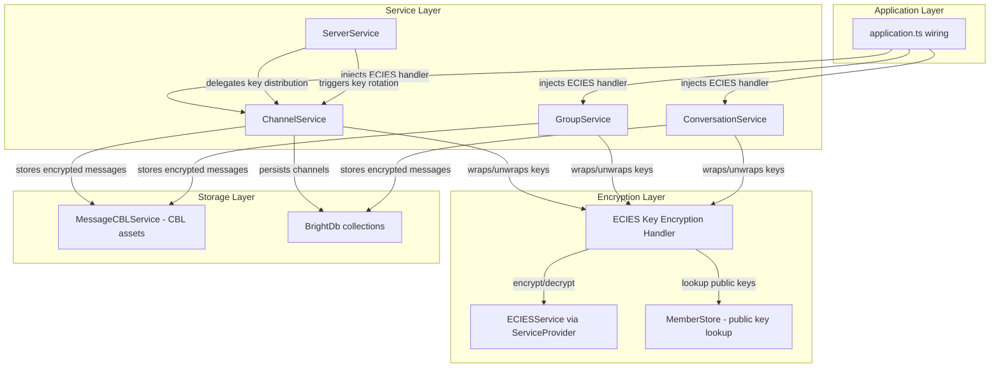
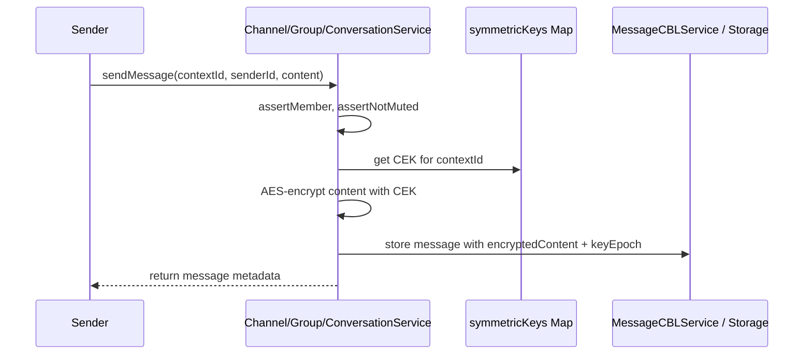
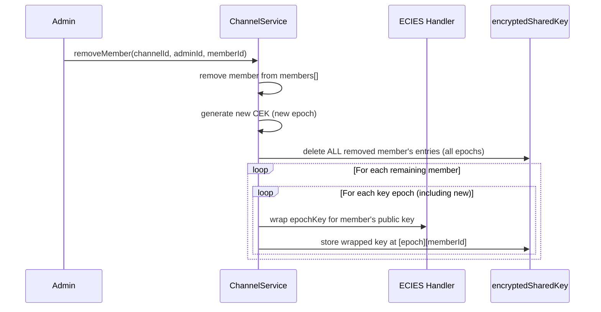

# Design Document: BrightChat E2E Encryption

## Overview

This design adds end-to-end encryption (E2EE) to all BrightChat communication contexts — channels, groups, and DMs — using a unified symmetric key model with ECIES key wrapping. Every context (channel, group, or DM conversation) holds a 256-bit AES content-encryption key (CEK). The CEK is wrapped per-member under their ECIES public key and stored in the context's `encryptedSharedKey` map. Messages and attachments are encrypted with the CEK before storage. When membership changes, key rotation generates a new epoch and re-wraps all epoch keys for remaining members only, revoking the removed member's server-side access to historical ciphertext without re-encrypting stored messages.

The design builds on existing infrastructure:
- `ECIESService` (via `ServiceProvider.getInstance().eciesService`) for asymmetric encrypt/decrypt
- `ChannelService` and `GroupService` already have `symmetricKeys`, `encryptKey` handler, `encryptKeyForMembers()`, and `rotateKey()` — currently using placeholder base64 encoding
- `KeyWrappingService` in digitalburnbag-lib demonstrates the production pattern: `eciesEncrypt(publicKey, plaintext)`, `getUserPublicKey(userId)`, `recordOnLedger`
- `MemberStore.getMemberPublicKeyHex(id)` for public key lookup

The core change is replacing the placeholder `defaultKeyEncryption` handlers with real ECIES-backed handlers, extending `IConversation` and `ICommunicationMessage` with encryption fields, introducing a key epoch model for forward secrecy on member removal, and adding encrypted attachment support.

## Architecture



### Key Flow: Message Send



### Key Flow: Member Removal & Key Rotation



## Components and Interfaces

### 1. ECIES Key Encryption Handler Factory

A factory function that creates `ChannelKeyEncryptionHandler` / `KeyEncryptionHandler` callbacks backed by real ECIES encryption. Injected at application startup.

```typescript
// brightchain-lib/src/lib/services/communication/eciesKeyEncryptionHandler.ts

import { ECIESService } from '@digitaldefiance/ecies-lib';

/**
 * Async key encryption handler type — replaces the sync placeholder.
 * Returns encrypted key as Uint8Array (not string) for proper binary handling.
 */
export type AsyncKeyEncryptionHandler = (
  memberId: string,
  symmetricKey: Uint8Array,
) => Promise<Uint8Array>;

/**
 * Async key decryption handler type — unwraps a wrapped key using a member's private key.
 */
export type AsyncKeyDecryptionHandler = (
  memberId: string,
  wrappedKey: Uint8Array,
) => Promise<Uint8Array>;

/**
 * Dependencies for creating the ECIES key encryption handler.
 */
export interface IEciesHandlerDeps {
  eciesService: {
    encryptBasic: (publicKey: Uint8Array, plaintext: Uint8Array) => Promise<Uint8Array>;
  };
  getMemberPublicKey: (memberId: string) => Promise<Uint8Array>;
}

/**
 * Creates an async ECIES-backed key encryption handler.
 * Looks up the member's public key, then encrypts the symmetric key under it.
 */
export function createEciesKeyEncryptionHandler(
  deps: IEciesHandlerDeps,
): AsyncKeyEncryptionHandler {
  return async (memberId: string, symmetricKey: Uint8Array): Promise<Uint8Array> => {
    const publicKey = await deps.getMemberPublicKey(memberId);
    return deps.eciesService.encryptBasic(publicKey, symmetricKey);
  };
}
```

### 2. Key Epoch Manager

Manages versioned symmetric keys per context. Each key rotation creates a new epoch. Messages record which epoch they were encrypted under.

```typescript
// brightchain-lib/src/lib/services/communication/keyEpochManager.ts

/**
 * Tracks key epochs for a communication context.
 * epoch 0 = initial key, epoch N = Nth rotation.
 *
 * encryptedEpochKeys: Map<epoch, Map<memberId, wrappedKey>>
 */
export interface IKeyEpochState<TData = Uint8Array> {
  currentEpoch: number;
  /** epoch → raw symmetric key (server-side only, in-memory) */
  epochKeys: Map<number, Uint8Array>;
  /** epoch → memberId → wrapped key (persisted) */
  encryptedEpochKeys: Map<number, Map<string, TData>>;
}

export class KeyEpochManager {
  /**
   * Initialize epoch state for a new context.
   */
  static createInitial(
    symmetricKey: Uint8Array,
    memberIds: string[],
    encryptKeyForMembers: (ids: string[], key: Uint8Array) => Map<string, Uint8Array>,
  ): IKeyEpochState {
    const epochKeys = new Map<number, Uint8Array>();
    epochKeys.set(0, symmetricKey);

    const wrappedKeys = encryptKeyForMembers(memberIds, symmetricKey);
    const encryptedEpochKeys = new Map<number, Map<string, Uint8Array>>();
    encryptedEpochKeys.set(0, wrappedKeys);

    return { currentEpoch: 0, epochKeys, encryptedEpochKeys };
  }

  /**
   * Rotate: generate new epoch, re-wrap ALL epoch keys for remaining members,
   * delete removed member's entries from all epochs.
   */
  static rotate(
    state: IKeyEpochState,
    newKey: Uint8Array,
    remainingMemberIds: string[],
    removedMemberId: string,
    encryptKeyForMembers: (ids: string[], key: Uint8Array) => Map<string, Uint8Array>,
  ): IKeyEpochState {
    const newEpoch = state.currentEpoch + 1;

    // Add new epoch key
    state.epochKeys.set(newEpoch, newKey);

    // Delete removed member from ALL epochs
    for (const [, memberMap] of state.encryptedEpochKeys) {
      memberMap.delete(removedMemberId);
    }

    // Re-wrap ALL epoch keys for remaining members
    for (const [epoch, rawKey] of state.epochKeys) {
      state.encryptedEpochKeys.set(epoch, encryptKeyForMembers(remainingMemberIds, rawKey));
    }

    return { ...state, currentEpoch: newEpoch };
  }

  /**
   * Add a member: wrap ALL epoch keys for the new member.
   */
  static addMember(
    state: IKeyEpochState,
    newMemberId: string,
    encryptKeyForMember: (memberId: string, key: Uint8Array) => Uint8Array,
  ): void {
    for (const [epoch, rawKey] of state.epochKeys) {
      const epochMap = state.encryptedEpochKeys.get(epoch) ?? new Map();
      epochMap.set(newMemberId, encryptKeyForMember(newMemberId, rawKey));
      state.encryptedEpochKeys.set(epoch, epochMap);
    }
  }
}
```

### 3. Updated Service Interfaces

Services transition from sync `string`-returning handlers to async `Uint8Array`-returning handlers. The `encryptedSharedKey` maps change from `Map<string, string>` to `Map<number, Map<string, TData>>` (epoch-aware).

### 4. Attachment Encryption

Attachments are encrypted with the same CEK as the message content, stored as CBL assets, and referenced by metadata in the message's `attachments` array.

```typescript
// Addition to communication.ts interfaces

/**
 * Metadata for an encrypted inline attachment stored as a CBL asset.
 */
export interface IAttachmentMetadata<TId = string> {
  /** CBL asset ID referencing the encrypted attachment content */
  assetId: TId;
  /** Original file name */
  fileName: string;
  /** MIME type (e.g., "image/png", "application/pdf") */
  mimeType: string;
  /** Size of the encrypted content in bytes */
  encryptedSize: number;
  /** Size of the original content in bytes (before encryption) */
  originalSize: number;
}
```


### 5. Application Wiring Changes

`application.ts` must inject ECIES-backed handlers into all three services at initialization:

```typescript
// In brightchain-api-lib/src/lib/application.ts — BrightChat initialization block

const eciesService = ServiceProvider.getInstance().eciesService;
const memberStore = /* existing MemberStore instance */;

const eciesHandler = createEciesKeyEncryptionHandler({
  eciesService: { encryptBasic: (pk, pt) => eciesService.encryptBasic(pk, pt) },
  getMemberPublicKey: async (memberId: string) => {
    const hexKey = await memberStore.getMemberPublicKeyHex(memberId);
    if (!hexKey) throw new MissingPublicKeyError(memberId);
    return Buffer.from(hexKey, 'hex');
  },
});

const channelService = new ChannelService(
  permissionService,
  eciesHandler,  // replaces undefined (default placeholder)
  /* ... */
);
const groupService = new GroupService(
  permissionService,
  eciesHandler,  // replaces undefined (default placeholder)
  /* ... */
);
const conversationService = new ConversationService(
  eciesHandler,  // new parameter
  /* ... */
);
```

## Data Models

### Interface Changes

#### `IConversation` — Add encryption fields

```typescript
export interface IConversation<TId = string, TData = string> {
  id: TId;
  participants: [TId, TId];
  /** Per-participant wrapped DM key: Map<epoch, Map<participantId, wrappedKey>> */
  encryptedSharedKey: Map<number, Map<string, TData>>;
  createdAt: Date;
  lastMessageAt: Date;
  lastMessagePreview?: string;
}
```

#### `ICommunicationMessage` — Add attachments and keyEpoch

```typescript
export interface ICommunicationMessage<TId = string, TData = string> {
  // ... existing fields ...
  
  /** Key epoch this message was encrypted under */
  keyEpoch: number;
  
  /** Inline attachments encrypted with the context's CEK */
  attachments: IAttachmentMetadata<TId>[];
}
```

#### `IChannel` and `IGroup` — Epoch-aware encryptedSharedKey

The `encryptedSharedKey` field changes from `Map<string, TData>` to `Map<number, Map<string, TData>>` where the outer key is the epoch number:

```typescript
export interface IChannel<TId = string, TData = string> {
  // ... existing fields ...
  /** epoch → memberId → wrapped key */
  encryptedSharedKey: Map<number, Map<string, TData>>;
}

export interface IGroup<TId = string, TData = string> {
  // ... existing fields ...
  /** epoch → memberId → wrapped key */
  encryptedSharedKey: Map<number, Map<string, TData>>;
}
```

### Key Epoch Data Flow

| Event | Epoch Change | Key Actions |
|-------|-------------|-------------|
| Context created | epoch 0 | Generate CEK, wrap for all initial members |
| Member added | no change | Wrap ALL epoch keys for new member |
| Member removed | epoch N+1 | Generate new CEK, delete removed member from all epochs, re-wrap ALL epoch keys for remaining members |
| Message sent | records current epoch | Encrypt content with current epoch's CEK |
| Message read | uses message's epoch | Decrypt content with the epoch's CEK |

### Attachment Storage Model

```mermaid
graph LR
    MSG[ICommunicationMessage] -->|attachments[]| META[IAttachmentMetadata]
    META -->|assetId| CBL[CBL Asset - encrypted content]
    MSG -->|keyEpoch| EPOCH[Key Epoch]
    EPOCH -->|CEK| ENC[Same key encrypts message + attachments]
```

### Platform-Level Configuration

```typescript
export interface IAttachmentConfig {
  /** Maximum size per attachment in bytes (default: 25MB) */
  maxFileSizeBytes: number;
  /** Maximum number of attachments per message (default: 10) */
  maxAttachmentsPerMessage: number;
}
```


## Correctness Properties

*A property is a characteristic or behavior that should hold true across all valid executions of a system — essentially, a formal statement about what the system should do. Properties serve as the bridge between human-readable specifications and machine-verifiable correctness guarantees.*

### Property 1: Key wrapping round-trip

*For any* 256-bit symmetric key and *for any* valid ECIES key pair (public key, private key), wrapping the symmetric key under the public key using `ECIESService.encryptBasic` and then unwrapping with the private key SHALL produce the original symmetric key byte-for-byte.

**Validates: Requirements 10.1, 10.2, 10.3, 8.5**

### Property 2: Message content encrypt/decrypt round-trip

*For any* communication context (channel, group, or DM) with a valid CEK, and *for any* non-empty message content, encrypting the content with the CEK on send and decrypting on retrieval SHALL produce the original plaintext content byte-for-byte.

**Validates: Requirements 1.1, 1.2, 1.4, 4.2, 4.3, 4.5**

### Property 3: Context creation wraps keys for all initial members

*For any* newly created context (channel, group, or DM conversation) with N initial members each having a valid ECIES key pair, the context's `encryptedSharedKey` map at epoch 0 SHALL contain exactly N entries, and unwrapping each entry with the corresponding member's private key SHALL produce the same 256-bit CEK.

**Validates: Requirements 2.1, 4.1, 5.1, 1.3**

### Property 4: Member addition distributes all epoch keys

*For any* context with E key epochs and *for any* new member with a valid ECIES key pair, after the member is added, the member SHALL have a valid wrapped key entry in every epoch (0 through E), and unwrapping each entry SHALL produce the correct epoch key.

**Validates: Requirements 2.2, 5.2, 6.1, 6.2, 6.3**

### Property 5: Key rotation invariants on member removal

*For any* context with N members (N ≥ 2) and E key epochs, after removing one member: (a) the current epoch SHALL increment to E+1, (b) a new CEK SHALL exist for epoch E+1 that differs from all previous epoch keys, (c) the removed member SHALL have zero wrapped key entries across ALL epochs, and (d) each of the N-1 remaining members SHALL have a valid wrapped key entry in every epoch (0 through E+1).

**Validates: Requirements 3.1, 3.2, 3.3, 3.4, 3.5, 5.3, 7.1, 7.2, 7.3**

### Property 6: Wrapped key count equals member count

*For any* context and *for any* epoch, the number of entries in `encryptedSharedKey[epoch]` SHALL equal the number of current members in that context.

**Validates: Requirements 2.4, 4.4**

### Property 7: Ciphertext preservation after key rotation

*For any* context containing stored messages and/or attachment CBL assets, after a key rotation event, all previously stored `encryptedContent` bytes and attachment CBL asset bytes SHALL be byte-identical to their pre-rotation values.

**Validates: Requirements 3.6, 11.5**

### Property 8: Attachment encrypt/decrypt round-trip

*For any* attachment content (up to the configured size limit) and *for any* valid CEK, encrypting the attachment with the CEK, storing as a CBL asset, then retrieving and decrypting SHALL produce the original attachment content byte-for-byte, and the message's `attachments` array SHALL contain metadata (assetId, fileName, mimeType, sizes) matching the original attachment.

**Validates: Requirements 11.1, 11.2, 11.3**

### Property 9: Attachment limits enforcement

*For any* attachment exceeding `maxFileSizeBytes`, the service SHALL reject the send operation with an error. *For any* message with more than `maxAttachmentsPerMessage` attachments, the service SHALL reject the send operation with an error. *For any* attachment within limits, the service SHALL accept it.

**Validates: Requirements 11.4**

### Property 10: Missing public key produces descriptive error

*For any* member ID that has no registered ECIES public key, any operation that requires wrapping a key for that member (channel creation, member addition, DM creation) SHALL throw an error whose message contains the affected member ID.

**Validates: Requirements 4.6, 12.1, 12.2**

### Property 11: Decryption failure produces descriptive error

*For any* corrupted wrapped key data or corrupted ciphertext, attempting to unwrap or decrypt SHALL throw an error whose message contains the affected context ID (channel ID or conversation ID).

**Validates: Requirements 12.3, 12.4**

## Error Handling

### Error Types

| Error Class | Trigger | Contains |
|---|---|---|
| `MissingPublicKeyError` | Member's ECIES public key not found during key wrapping | `memberId` |
| `KeyUnwrapError` | ECIES decryption of a wrapped key fails | `contextId`, `memberId`, `epoch` |
| `MessageDecryptionError` | AES decryption of message content fails | `contextId`, `messageId`, `keyEpoch` |
| `AttachmentTooLargeError` | Attachment exceeds `maxFileSizeBytes` | `fileName`, `size`, `maxSize` |
| `TooManyAttachmentsError` | Message exceeds `maxAttachmentsPerMessage` | `count`, `maxCount` |
| `KeyEpochNotFoundError` | Message references a key epoch that doesn't exist | `contextId`, `keyEpoch` |

### Error Propagation Strategy

1. **Key wrapping errors** (missing public key) — propagate immediately, abort the operation (channel creation, member addition, etc.). The caller receives a descriptive error. No partial state is committed.
2. **Decryption errors** (corrupted key or ciphertext) — propagate to the caller with context IDs. The service does not silently return empty/null content.
3. **Attachment errors** (size/count limits) — reject before encryption. No CBL assets are created for rejected attachments.
4. **Epoch errors** — if a message references a non-existent epoch, throw `KeyEpochNotFoundError`. This indicates data corruption or a migration issue.

### Graceful Degradation

- If a single member's public key is missing during bulk key distribution (e.g., server member addition across many channels), the service should wrap keys for all other members and report the failure for the specific member, rather than failing the entire operation.
- The `ServerService.addMembers` method should collect per-channel errors and return a summary of successes and failures.

## Testing Strategy

### Property-Based Testing

Property-based testing is appropriate for this feature because:
- The core operations (key wrapping, encryption, decryption) are pure functions with clear input/output behavior
- Universal properties (round-trips, invariants) hold across a wide input space (arbitrary key material, message content, member configurations)
- The input space is large (256-bit keys, arbitrary-length messages, variable member counts)

**Library**: [fast-check](https://github.com/dubzzz/fast-check) (already available in the workspace via Jest)

**Configuration**:
- Minimum 100 iterations per property test
- Each test tagged with: `Feature: brightchat-e2e-encryption, Property {N}: {title}`

**Property tests to implement** (one test per correctness property):

| Property | Generator Strategy |
|---|---|
| P1: Key wrapping round-trip | Random 32-byte keys, random ECIES key pairs via `eciesService.core.generatePrivateKey()` |
| P2: Message content round-trip | Random byte arrays (1–10KB), random 32-byte CEKs |
| P3: Context creation key distribution | Random member counts (1–20), random key pairs per member |
| P4: Member addition epoch distribution | Random epoch counts (1–5), random new member key pair |
| P5: Key rotation invariants | Random member counts (2–10), random removal target |
| P6: Wrapped key count invariant | Random member add/remove sequences |
| P7: Ciphertext preservation | Random messages stored, then rotation triggered |
| P8: Attachment round-trip | Random binary content (1–1MB), random metadata |
| P9: Attachment limits | Random sizes around boundary, random counts around boundary |
| P10: Missing key error | Random member IDs with no registered key |
| P11: Decryption failure error | Random corrupted byte arrays |

### Unit Tests (Example-Based)

Unit tests complement property tests for specific scenarios:

- **Wiring verification**: `application.ts` injects ECIES handlers (not placeholder) into all three services (Req 8.4)
- **Access control after removal**: removed member cannot retrieve messages or keys (Req 3.7)
- **Voluntary leave triggers rotation**: same behavior as forced removal (Req 3.5)
- **Conversation promotion**: group gets fresh CEK after promotion from DM (Req 5.4)
- **Server invite redemption**: joining member gets keys for all server channels (Req 6.2)
- **Encryption-by-default**: no opt-in flag needed; messages are always encrypted (Req 9.1, 9.2, 9.3)

### Integration Tests

- **End-to-end message flow**: create channel → add members → send message → retrieve and decrypt → verify content
- **Server-wide key rotation**: remove server member → verify all channels rotated → verify removed member locked out
- **Attachment lifecycle**: send message with attachment → retrieve → decrypt attachment → verify content
