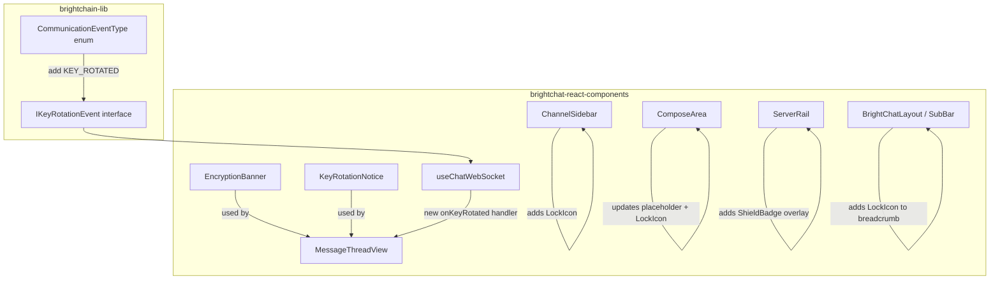

# Design Document: BrightChat Encryption Indicators

## Overview

This feature adds visual encryption indicators throughout the BrightChat frontend to communicate end-to-end encryption status to users. The indicators span five UI surfaces — Channel Sidebar, Message Thread Header, Compose Area, Sub-AppBar Breadcrumb, and Server Rail — plus a system message for key rotation events. All indicators use MUI theme-aware styling, are fully accessible via ARIA attributes, and carry `data-testid` attributes for automated testing.

The implementation lives entirely within the `brightchat-react-components` library, modifying existing components and introducing two new shared components: `EncryptionBanner` and `KeyRotationNotice`.

## Architecture

The encryption indicators are purely presentational — they do not introduce new data fetching or state management beyond consuming a new `KEY_ROTATED` WebSocket event. The architecture follows the existing component patterns in `brightchat-react-components`:



**Key design decisions:**

1. **Shared components over inline duplication**: `EncryptionBanner` and `KeyRotationNotice` are extracted as reusable components so the encryption indicator styling and accessibility attributes are defined once.
2. **Modify existing components in-place**: Rather than wrapping existing components, we add the indicators directly into `ChannelSidebar`, `ComposeArea`, `ServerRail`, and `BrightChatLayout` to avoid unnecessary component nesting.
3. **New enum value in brightchain-lib**: A `KEY_ROTATED` event type is added to `CommunicationEventType` in `brightchain-lib` (shared library), following the existing pattern for WebSocket events.
4. **Pure insertion function for key rotation**: The chronological insertion of `KeyRotationNotice` into the message list is implemented as a pure function (like the existing `applyMessageSent`, `applyMessageEdited`, etc.) to enable property-based testing.

## Components and Interfaces

### New Components

#### `EncryptionBanner`
A small, static banner displaying a lock icon and "End-to-end encrypted" text.

```typescript
// brightchat-react-components/src/lib/EncryptionBanner.tsx
interface EncryptionBannerProps {
  /** data-testid override, defaults to "encryption-banner" */
  testId?: string;
}
```

- Renders `LockIcon` (aria-hidden, since adjacent text conveys meaning) + `Typography` caption "End-to-end encrypted"
- Uses `role="status"`, `aria-label="This conversation is end-to-end encrypted"`
- Styled with `text.secondary` color, `caption` variant, bottom border using `divider` color
- `data-testid="encryption-banner"`

#### `KeyRotationNotice`
A system message displayed inline in the message thread when a key rotation event occurs.

```typescript
// brightchat-react-components/src/lib/KeyRotationNotice.tsx
type KeyRotationReason = 'member_joined' | 'member_left' | 'member_removed';

interface KeyRotationNoticeProps {
  reason: KeyRotationReason;
  timestamp: Date | string;
}
```

- Renders `LockIcon` + descriptive text (e.g., "Encryption key updated — a member joined")
- Uses `role="status"`, `aria-live="polite"`
- Styled with `caption` variant, `text.secondary` color, centered, no bubble background
- Not selectable (`userSelect: 'none'`), no edit/delete affordances
- `data-testid="key-rotation-notice"`

### New Interface (brightchain-lib)

```typescript
// Added to brightchain-lib/src/lib/interfaces/events.ts
export interface IKeyRotationEvent {
  contextId: string;
  contextType: 'conversation' | 'group' | 'channel';
  reason: 'member_joined' | 'member_left' | 'member_removed';
  newEpoch: number;
  timestamp: string; // ISO 8601
}
```

### New Enum Value (brightchain-lib)

```typescript
// Added to CommunicationEventType enum
KEY_ROTATED = 'communication:key_rotated',
```

### Modified Components

#### `ChannelSidebar.tsx`
- Add `LockIcon` (14px, `text.secondary`) between `TagIcon` and channel name in each `ListItemButton`
- Wrap `LockIcon` in `Tooltip` with title "End-to-end encrypted"
- `LockIcon` gets `aria-label="End-to-end encrypted"` and `data-testid="encryption-icon-channel"`

#### `ComposeArea.tsx`
- Change placeholder from `"Type a message..."` to `"Type an encrypted message..."`
- Add `LockIcon` in the placeholder area (via `InputAdornment` startAdornment)
- Update `aria-label` from `"Message input"` to `"Encrypted message input"`
- `LockIcon` gets `data-testid="encryption-icon-compose"`

#### `ServerRail.tsx`
- Add a `ShieldBadge` (16px circular, `success.main` bg, white `VerifiedUserIcon`) overlaid on the bottom-right of each server `IconButton` using absolute positioning
- `ShieldBadge` gets `aria-label="Encrypted server"` and `data-testid="encryption-badge-server"`
- Modify `Tooltip` title from `server.name` to `` `${server.name} · Encrypted` ``

#### `BrightChatLayout.tsx` (BrightChatSubBar)
- After the `Breadcrumbs` component, conditionally render a `LockIcon` (16px, `inherit` color) when the route indicates an active context (channel, group, or conversation)
- Wrap in `Tooltip` with title "End-to-end encrypted"
- `LockIcon` gets `aria-label="End-to-end encrypted"` and `data-testid="encryption-icon-breadcrumb"`
- Do NOT render when at `/brightchat` root (no active context — determined by breadcrumb items length ≤ 1)

#### `MessageThreadView.tsx`
- Insert `EncryptionBanner` at the top of the message area (after loading/error states, before scrollable list)
- Handle new `onKeyRotated` WebSocket event: insert `KeyRotationNotice` into the message list at the correct chronological position
- Add `KeyRotationNotice` rendering in the message list loop (differentiated from regular messages by a type discriminator)

#### `useChatWebSocket.ts`
- Add `onKeyRotated` handler to `ChatWebSocketHandlers` interface
- Add `KEY_ROTATED` event listener in the WebSocket connection setup
- Export a pure `applyKeyRotation` function for inserting key rotation notices into a message/notice list chronologically

### Pure Helper Function

```typescript
// Exported from useChatWebSocket.ts for property-based testing
export interface KeyRotationNoticeItem {
  type: 'key_rotation';
  reason: 'member_joined' | 'member_left' | 'member_removed';
  timestamp: string;
  epoch: number;
}

export type ThreadItem = 
  | (ICommunicationMessage & { type?: 'message' })
  | KeyRotationNoticeItem;

/**
 * Insert a key rotation notice into a chronologically sorted list of thread items.
 * Returns a new sorted array.
 */
export function applyKeyRotation(
  items: ThreadItem[],
  notice: KeyRotationNoticeItem,
): ThreadItem[];
```

## Data Models

### Existing Models (no changes)

- `ICommunicationMessage` — already has `keyEpoch: number` field
- `IKeyEpochState` — epoch management in `brightchain-lib`
- `IServer`, `IChannel`, `IServerCategory` — server/channel models

### New Models

#### `IKeyRotationEvent` (brightchain-lib)
```typescript
export interface IKeyRotationEvent {
  contextId: string;
  contextType: 'conversation' | 'group' | 'channel';
  reason: 'member_joined' | 'member_left' | 'member_removed';
  newEpoch: number;
  timestamp: string;
}
```

#### `KeyRotationNoticeItem` (brightchat-react-components)
```typescript
export interface KeyRotationNoticeItem {
  type: 'key_rotation';
  reason: 'member_joined' | 'member_left' | 'member_removed';
  timestamp: string;
  epoch: number;
}
```

#### `KeyRotationReason` type
```typescript
export type KeyRotationReason = 'member_joined' | 'member_left' | 'member_removed';
```


## Correctness Properties

*A property is a characteristic or behavior that should hold true across all valid executions of a system — essentially, a formal statement about what the system should do. Properties serve as the bridge between human-readable specifications and machine-verifiable correctness guarantees.*

### Property 1: Every channel row renders a lock icon

*For any* non-empty array of channels and categories, rendering the `ChannelSidebar` SHALL produce exactly one element with `data-testid="encryption-icon-channel"` per visible (non-collapsed) channel in the list.

**Validates: Requirements 1.1**

### Property 2: Every server icon renders a shield badge

*For any* non-empty array of servers, rendering the `ServerRail` SHALL produce exactly one element with `data-testid="encryption-badge-server"` per server in the array.

**Validates: Requirements 5.1**

### Property 3: Server tooltip includes encryption suffix

*For any* server with a non-empty name, the tooltip text for that server's icon in the `ServerRail` SHALL equal `"{serverName} · Encrypted"`.

**Validates: Requirements 5.4**

### Property 4: Key rotation notice is inserted in chronological order

*For any* chronologically sorted list of thread items and any key rotation notice with a valid timestamp, calling `applyKeyRotation` SHALL return a list that is still sorted chronologically and contains the new notice at the correct position.

**Validates: Requirements 6.1**

## Error Handling

This feature is purely presentational and does not introduce new failure modes. Error handling considerations:

1. **Missing WebSocket event data**: If a `KEY_ROTATED` event arrives with missing or malformed fields (`reason`, `timestamp`, `newEpoch`), the `onKeyRotated` handler silently ignores the event and does not insert a notice. A `console.warn` is emitted in development mode.

2. **Theme palette fallback**: All color references use MUI theme tokens (`text.secondary`, `success.main`, etc.). If a custom theme omits these tokens, MUI's default palette provides fallback values — no additional error handling is needed.

3. **Empty server/channel lists**: When `servers` or `channels` arrays are empty, no encryption indicators are rendered for those surfaces. The components already handle empty arrays gracefully.

4. **Route mismatch for breadcrumb lock**: The `buildBrightChatBreadcrumbs` function already returns an empty array for non-BrightChat routes. The lock icon rendering is gated on breadcrumb items length > 1, so it naturally does not appear outside of active contexts.

## Testing Strategy

### Unit Tests (Example-Based)

Unit tests cover the majority of acceptance criteria, which specify concrete attribute values, styling, and accessibility properties:

- **ChannelSidebar**: Lock icon styling (14px, text.secondary), aria-label, tooltip text, data-testid (Requirements 1.2, 1.3, 1.4, 9.1)
- **MessageThreadView**: EncryptionBanner presence, content, styling, ARIA attributes, rendering across all 3 context types (Requirements 2.1–2.5, 9.2)
- **ComposeArea**: Updated placeholder text, Lock icon presence, aria-label, data-testid (Requirements 3.1–3.3, 9.3)
- **BrightChatSubBar**: Lock icon conditional rendering (present for channel/group/conversation, absent at root), styling, tooltip, aria-label, data-testid (Requirements 4.1–4.5, 9.4)
- **ServerRail**: Shield badge styling (16px, success.main, circular), aria-label, data-testid (Requirements 5.2, 5.3, 9.5)
- **KeyRotationNotice**: Content per reason type, styling, ARIA attributes (role, aria-live), non-selectability, data-testid (Requirements 6.2–6.5, 9.6)
- **Accessibility cross-check**: All indicators have aria-label/aria-labelledby, decorative icons have aria-hidden (Requirements 7.1–7.4)
- **Theming**: Render in light and dark themes, verify theme-aware colors (Requirements 8.1, 8.2)

### Property-Based Tests

Property-based tests use `fast-check` (already available in the workspace) with a minimum of 100 iterations per property:

- **Property 1**: Generate random channel/category arrays → render ChannelSidebar → assert lock icon count matches visible channel count
  - Tag: `Feature: brightchat-encryption-indicators, Property 1: Every channel row renders a lock icon`
- **Property 2**: Generate random server arrays → render ServerRail → assert shield badge count matches server count
  - Tag: `Feature: brightchat-encryption-indicators, Property 2: Every server icon renders a shield badge`
- **Property 3**: Generate random server names → render ServerRail → assert each tooltip text equals `"{name} · Encrypted"`
  - Tag: `Feature: brightchat-encryption-indicators, Property 3: Server tooltip includes encryption suffix`
- **Property 4**: Generate random sorted thread item lists + random key rotation notices → call `applyKeyRotation` → assert output is sorted and contains the notice
  - Tag: `Feature: brightchat-encryption-indicators, Property 4: Key rotation notice is inserted in chronological order`

### Integration Tests

- WebSocket `KEY_ROTATED` event end-to-end: simulate a WebSocket event, verify `KeyRotationNotice` appears in the rendered message thread at the correct position.
