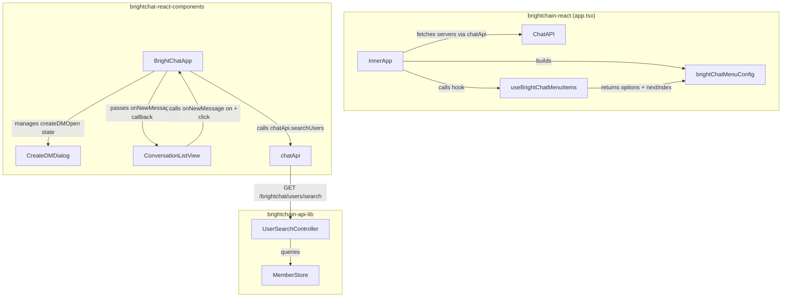

# Design Document: BrightChat Navigation UX

## Overview

This feature closes two UX gaps in BrightChat:

1. **Dynamic server menu items** — A new `useBrightChatMenuItems` hook in `brightchat-react-components` generates `IMenuOption` entries from the user's server list, following the exact pattern of `useBrightHubMenuItems`. The hook is consumed in `app.tsx` where the BrightChat menu config is built, so servers appear in the TopMenu/SideMenu alongside the static "BrightChat", "Groups", and "Channels" items.

2. **DM creation flow** — The existing `CreateDMDialog` is wired to the "+ New Message" button in `ConversationListView` via a callback prop, replacing the broken navigation to `/brightchat/conversation/new`. A new `searchUsers` method on `ChatApiClient` and a backend `GET /brightchat/users/search` endpoint provide the user list for the dialog.

Both changes are additive — no existing behavior is removed.

## Architecture



### Data Flow — Dynamic Menu

1. `InnerApp` (app.tsx) fetches servers via `chatApi.listServers()` (same API already used by `BrightChatApp`)
2. `useBrightChatMenuItems(chatMenu, servers, startingIndex)` returns `{ options, nextIndex }`
3. `brightChatMenuConfig.options` spreads static items + hook options
4. `MenuProvider` distributes items to TopMenu and SideMenu

### Data Flow — DM Creation

1. User clicks "+ New Message" in `ConversationListView`
2. `ConversationListView` calls `onNewMessage()` prop (instead of `navigate`)
3. `BrightChatApp` sets `createDMOpen = true`
4. `BrightChatApp` calls `chatApi.searchUsers('')` to fetch initial user list
5. `CreateDMDialog` renders with users, existing conversations, and currentUserId
6. On conversation start, `BrightChatApp` navigates to `/brightchat/conversation/{id}`

## Components and Interfaces

### 1. `useBrightChatMenuItems` Hook

**Location:** `brightchat-react-components/src/lib/hooks/useBrightChatMenuItems.ts`

```typescript
import { IServer } from '@brightchain/brightchain-lib';
import { IMenuOption, MenuType, MenuTypes } from '@digitaldefiance/express-suite-react-components';

export function useBrightChatMenuItems(
  chatMenu: MenuType,
  servers: IServer<string>[],
  startingIndex: number,
): { options: IMenuOption[]; nextIndex: number };
```

**Behavior:**
- Wraps logic in `useMemo` keyed on `[chatMenu, servers, startingIndex]`
- Iterates `servers.slice(0, 5)` (max 5 to prevent menu overflow)
- For each server, generates an `IMenuOption`:
  - `id`: `brightchat-server-${server.id}`
  - `label`: `server.name`
  - `link`: `/brightchat/server/${server.id}`
  - `requiresAuth`: `true`
  - `includeOnMenus`: `[chatMenu, MenuTypes.SideMenu]`
  - `index`: `startingIndex + (i * 10)` where `i` is 0-based position
- Returns `{ options, nextIndex: startingIndex + (count * 10) }`

### 2. `ConversationListView` — New `onNewMessage` Prop

**Location:** `brightchat-react-components/src/lib/ConversationListView.tsx`

```typescript
interface ConversationListViewProps {
  onNewMessage?: () => void;
}
```

- When `onNewMessage` is provided, the "+ New Message" button calls it instead of `navigate('/brightchat/conversation/new')`
- Backward compatible: if `onNewMessage` is not provided, falls back to navigation (though this path is currently broken)

### 3. `BrightChatApp` — Wiring Changes

**Location:** `brightchat-react-components/src/lib/BrightChatApp.tsx`

Changes:
- Add `handleNewMessage` callback that sets `createDMOpen = true`
- Add `useEffect` to fetch users via `chatApi.searchUsers('')` when `createDMOpen` becomes `true`
- Pass `onNewMessage={handleNewMessage}` to `ConversationListView` via Outlet context or direct render
- Pass `currentUserId` from `useAuth().userData.id`
- Pass fetched conversations as `existingConversations` (map from `IConversation` to `DMConversation`)
- Read `serverId` from URL params via `useParams()` and sync to `activeServerId`

### 4. `chatApi.searchUsers` Method

**Location:** `brightchat-react-components/src/lib/services/chatApi.ts`

```typescript
searchUsers: (query?: string) =>
  handleApiCall<{ users: Array<{ id: string; displayName: string; avatarUrl?: string }> }>(
    () => api.get('/brightchat/users/search', { params: { query } })
  );
```

### 5. `server/:serverId` Route

**Location:** `brightchain-react/src/app/brightchat-routes.tsx`

Add inside the `<Route element={<BrightChatApp />}>` group:

```tsx
<Route path="server/:serverId" element={<ConversationListView />} />
```

`BrightChatApp` reads `serverId` from `useParams()` and sets `activeServerId`, which triggers channel fetching and ChannelSidebar display.

### 6. User Search Controller

**Location:** `brightchain-api-lib/src/lib/controllers/api/userSearch.ts`

A new controller mounted at `/brightchat/users/search` in the API router. Uses `MemberStore.queryIndex()` to find users matching the search query. Returns results as `{ id, displayName, avatarUrl }` objects, excluding the requesting user.

### 7. `app.tsx` Integration

**Location:** `brightchain-react/src/app/app.tsx`

In `InnerApp`:
- Import `useBrightChatMenuItems` from `@brightchain/brightchat-react-components`
- Add state + effect to fetch BrightChat servers (similar to existing `subscribedHubs` pattern)
- Call `useBrightChatMenuItems(chatMenu, chatServers, nextIndex + 15)` after static items
- Spread returned options into `brightChatMenuConfig.options`

## Data Models

### IMenuOption (existing, from express-suite-react-components)

```typescript
interface IMenuOption {
  id: string;
  label: string;
  includeOnMenus: MenuType[];
  index: number;
  icon?: ReactNode;
  link?: To;
  requiresAuth: boolean;
}
```

### DMUser (existing, from CreateDMDialog)

```typescript
interface DMUser {
  id: string;
  displayName: string;
  avatarUrl?: string;
}
```

### DMConversation (existing, from CreateDMDialog)

```typescript
interface DMConversation {
  id: string;
  participantIds: string[];
}
```

### User Search Response (new)

```typescript
// GET /brightchat/users/search?query=foo
// Response body (wrapped in IApiEnvelope):
interface IUserSearchResult {
  users: Array<{
    id: string;
    displayName: string;
    avatarUrl?: string;
  }>;
}
```

### ConversationListView Props (updated)

```typescript
interface ConversationListViewProps {
  onNewMessage?: () => void;
}
```

## Correctness Properties

*A property is a characteristic or behavior that should hold true across all valid executions of a system — essentially, a formal statement about what the system should do. Properties serve as the bridge between human-readable specifications and machine-verifiable correctness guarantees.*

### Property 1: Hook generates correct menu option fields

*For any* array of `IServer<string>` objects (up to any length) and any valid menu type, each `IMenuOption` generated by `useBrightChatMenuItems` SHALL have `id` equal to `brightchat-server-{server.id}`, `link` equal to `/brightchat/server/{server.id}`, `label` equal to `server.name`, `requiresAuth` equal to `true`, and `includeOnMenus` containing both the provided menu type and `MenuTypes.SideMenu`.

**Validates: Requirements 1.2, 1.3**

### Property 2: Hook limits output to maximum 5 servers

*For any* array of `IServer<string>` objects of any length (0 to N), the `options` array returned by `useBrightChatMenuItems` SHALL have length equal to `min(servers.length, 5)`.

**Validates: Requirements 1.4**

### Property 3: Hook index arithmetic is correct

*For any* starting index and any array of `IServer<string>` objects, the `index` field of the i-th option (0-based) SHALL equal `startingIndex + (i * 10)`, and `nextIndex` SHALL equal `startingIndex + (min(servers.length, 5) * 10)`.

**Validates: Requirements 1.1, 1.5**

### Property 4: Existing conversation deduplication

*For any* list of existing conversations and any recipient ID, if there exists a conversation where `participantIds` contains both the current user and the recipient and has exactly 2 participants, then `findExistingConversation` SHALL return that conversation's ID. If no such conversation exists, it SHALL return `null`.

**Validates: Requirements 6.1, 6.2**

### Property 5: User search returns matching users with correct fields

*For any* set of users and any search query string, the user search function SHALL return only users whose `displayName` contains the query (case-insensitive), and each returned user SHALL have `id` (string), `displayName` (string), and optionally `avatarUrl` (string) fields.

**Validates: Requirements 7.2, 7.4**

### Property 6: User search excludes requesting user

*For any* authenticated user and any set of users (including the requesting user), the user search results SHALL never contain the requesting user's ID.

**Validates: Requirements 7.6**

## Error Handling

| Scenario | Handling |
|---|---|
| `chatApi.listServers()` fails in `app.tsx` | Catch silently, render menu with static items only (Req 2.4) |
| `chatApi.searchUsers()` fails when dialog opens | Set empty user list, dialog remains functional for retry (Req 5.5) |
| `serverId` URL param doesn't match any server | `activeServerId` is set but `activeServer` resolves to `null`, ChannelSidebar shows empty |
| `sendDirectMessage` fails in CreateDMDialog | Existing error handling in CreateDMDialog displays error message |
| User search endpoint receives unauthenticated request | Return 401 (Req 7.5) |
| User search endpoint receives no query param | Return default list of up to 20 users (Req 7.3) |

## Testing Strategy

### Property-Based Tests (PBT)

Use `fast-check` for property-based testing. Each property test runs a minimum of 100 iterations.

**Library:** `fast-check` (already available in the workspace)

Tests to implement:
- **Property 1–3**: Test `useBrightChatMenuItems` hook logic. Extract the pure computation into a helper function (`generateBrightChatMenuOptions`) for direct testing without React rendering. Generate random `IServer` arrays and starting indices.
  - Tag: `Feature: brightchat-navigation-ux, Property 1: Hook generates correct menu option fields`
  - Tag: `Feature: brightchat-navigation-ux, Property 2: Hook limits output to maximum 5 servers`
  - Tag: `Feature: brightchat-navigation-ux, Property 3: Hook index arithmetic is correct`
- **Property 4**: Test `findExistingConversation` helper. Generate random conversation lists and recipient IDs.
  - Tag: `Feature: brightchat-navigation-ux, Property 4: Existing conversation deduplication`
- **Property 5–6**: Test user search filtering logic. Extract the search/filter logic into a pure function for testing.
  - Tag: `Feature: brightchat-navigation-ux, Property 5: User search returns matching users with correct fields`
  - Tag: `Feature: brightchat-navigation-ux, Property 6: User search excludes requesting user`

### Unit Tests (Example-Based)

- `ConversationListView` calls `onNewMessage` when button clicked (Req 4.1, 4.2)
- `BrightChatApp` opens `CreateDMDialog` when `onNewMessage` fires (Req 4.3)
- `BrightChatApp` passes `currentUserId` from auth context (Req 5.4)
- `server/:serverId` route sets `activeServerId` (Req 3.2)
- User search endpoint returns 401 for unauthenticated requests (Req 7.5)
- User search endpoint returns up to 20 users when no query provided (Req 7.3)

### Integration Tests

- Menu renders with dynamic server items after successful fetch (Req 2.2, 2.3)
- Menu renders with only static items when fetch fails (Req 2.4)
- Full DM creation flow: open dialog → search user → select → create conversation → navigate (Req 4.1, 5.1, 6.3)
- Server route navigation loads channels in sidebar (Req 3.3)
