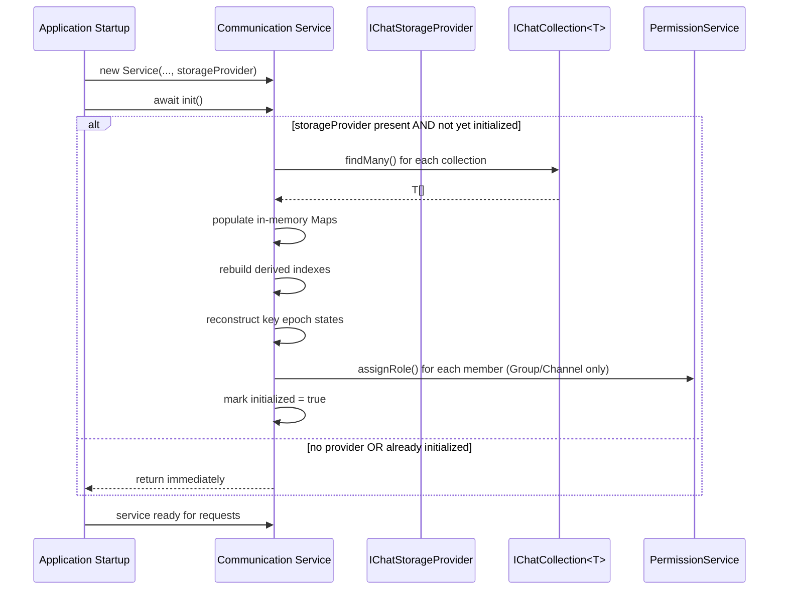

# Design Document: BrightChat Persistence Rehydration

## Overview

This feature adds startup rehydration to the four BrightChat communication services — `ConversationService`, `GroupService`, `ChannelService`, and `ServerService`. Each service already maintains in-memory `Map` instances for runtime state and supports optional write-through persistence via `IChatStorageProvider`. The missing piece is the reverse path: loading persisted data back into memory on startup.

The design introduces an async `init()` method on each service. When an `IChatStorageProvider` is present, `init()` calls `findMany()` on the relevant storage collections and populates the service's private Maps, derived indexes (participant index, name index), key epoch states, and permission registrations. When no provider is present (unit-test path), `init()` is a no-op.

Key design goals:
- **Faithful reconstruction**: after `init()`, in-memory state is indistinguishable from state built up through normal runtime mutations.
- **Backward compatibility**: services without a storage provider behave identically to today.
- **Graceful error handling**: storage failures propagate to the caller; malformed entities are skipped with warnings.
- **Idempotency**: calling `init()` more than once is safe — only the first call performs rehydration.

## Architecture



Each service follows the same rehydration pattern:

1. Guard: if no storage provider or already initialized, return early.
2. Load entities from primary collection(s) via `findMany()`.
3. Insert into the corresponding `Map` keyed by entity ID (or token string for invite tokens).
4. Rebuild any derived indexes from the loaded entities.
5. Reconstruct `IKeyEpochState` from each entity's `encryptedSharedKey` map (conversations, groups, channels only).
6. Load messages, group by `contextId`, sort each group by `createdAt` ascending.
7. Register member permissions in `PermissionService` (groups, channels only).

## Components and Interfaces

### Modified Services

All four services gain the same two members:

```typescript
// Added to each service class
private initialized = false;

public async init(): Promise<void> {
  if (this.initialized) return;
  if (!this.storageProvider) return; // or check individual collection refs
  this.initialized = true;
  // ... rehydration logic
}
```

No new classes or interfaces are introduced. The `init()` method is added directly to each existing service class.

### ConversationService.init()

Loads from:
- `storageProvider.conversations` → `this.conversations` (keyed by `id`)
- `storageProvider.messages` → `this.messages` (grouped by `contextId`, sorted by `createdAt`)

Rebuilds:
- `this.participantIndex` — for each conversation, compute `participantKey(participants[0], participants[1])` → conversation ID
- `this.keyEpochStates` — reconstruct from each conversation's `encryptedSharedKey`

### GroupService.init()

Loads from:
- `storageProvider.groups` → `this.groups` (keyed by `id`)
- `storageProvider.groupMessages` → `this.messages` (grouped by `contextId`, sorted by `createdAt`)

Rebuilds:
- `this.keyEpochStates` — reconstruct from each group's `encryptedSharedKey`
- `this.permissionService.assignRole()` — for each member in each group

### ChannelService.init()

Loads from:
- `storageProvider.channels` → `this.channels` (keyed by `id`)
- `storageProvider.channelMessages` → `this.messages` (grouped by `contextId`, sorted by `createdAt`)
- `storageProvider.inviteTokens` → `this.inviteTokens` (keyed by `token`)

Rebuilds:
- `this.nameIndex` — `channel.name.toLowerCase()` → channel ID
- `this.keyEpochStates` — reconstruct from each channel's `encryptedSharedKey`
- `this.permissionService.assignRole()` — for each member in each channel

### ServerService.init()

Loads from:
- `storageProvider.servers` → `this.servers` (keyed by `id`)
- `storageProvider.serverInvites` → `this.serverInviteTokens` (keyed by `token`)

No key epoch states or permission registration needed for servers.

### Key Epoch State Reconstruction

A shared helper (private method or standalone utility) reconstructs `IKeyEpochState<string>` from an entity's `encryptedSharedKey: Map<number, Map<string, string>>`:

```typescript
function reconstructKeyEpochState(
  encryptedSharedKey: Map<number, Map<string, string>>
): IKeyEpochState<string> {
  const epochs = Array.from(encryptedSharedKey.keys());
  const currentEpoch = epochs.length > 0 ? Math.max(...epochs) : 0;
  return {
    currentEpoch,
    epochKeys: new Map(),           // raw keys are never persisted
    encryptedEpochKeys: encryptedSharedKey,
  };
}
```

If `encryptedSharedKey` is null, undefined, or not a Map, the reconstruction is skipped for that entity and a warning is logged.

### Message Grouping and Sorting

A shared helper groups messages by `contextId` and sorts each group:

```typescript
function groupAndSortMessages(
  messages: ICommunicationMessage[]
): Map<string, ICommunicationMessage[]> {
  const grouped = new Map<string, ICommunicationMessage[]>();
  for (const msg of messages) {
    const list = grouped.get(msg.contextId) ?? [];
    list.push(msg);
    grouped.set(msg.contextId, list);
  }
  for (const [, list] of grouped) {
    list.sort((a, b) => a.createdAt.getTime() - b.createdAt.getTime());
  }
  return grouped;
}
```

### Error Handling Strategy

Each `findMany()` call is wrapped in a try/catch:
- On error: log with service name, collection name, and error message, then re-throw so the `init()` caller can decide whether to abort or continue.
- Malformed `encryptedSharedKey`: skip epoch state reconstruction for that entity, log a warning, continue with remaining entities.

## Data Models

No new data models are introduced. The feature operates entirely on existing interfaces:

| Interface | Location | Role in Rehydration |
|---|---|---|
| `IConversation<string, string>` | `communication.ts` | Loaded into `conversations` Map; `encryptedSharedKey` used for epoch reconstruction; `participants` used for participant index |
| `IGroup<string, string>` | `communication.ts` | Loaded into `groups` Map; `encryptedSharedKey` for epochs; `members` for permission registration |
| `IChannel<string, string>` | `communication.ts` | Loaded into `channels` Map; `encryptedSharedKey` for epochs; `members` for permissions; `name` for name index |
| `ICommunicationMessage<string, string>` | `communication.ts` | Loaded into `messages` Maps; grouped by `contextId`, sorted by `createdAt` |
| `IServer<string, string>` | `server.ts` | Loaded into `servers` Map |
| `IServerInviteToken<string>` | `server.ts` | Loaded into `serverInviteTokens` Map keyed by `token` |
| `IInviteToken<string>` | `communication.ts` | Loaded into `inviteTokens` Map keyed by `token` |
| `IKeyEpochState<string>` | `keyEpochManager.ts` | Reconstructed from `encryptedSharedKey`; stored in `keyEpochStates` Map |
| `IChatStorageProvider` | `chatStorageProvider.ts` | Provides `IChatCollection<T>` accessors for all entity types |
| `IChatCollection<T>` | `chatStorageProvider.ts` | `findMany()` used to load all documents |


## Correctness Properties

*A property is a characteristic or behavior that should hold true across all valid executions of a system — essentially, a formal statement about what the system should do. Properties serve as the bridge between human-readable specifications and machine-verifiable correctness guarantees.*

### Property 1: Entity rehydration completeness

*For any* set of entities persisted in a storage collection, after calling `init()`, the corresponding in-memory Map SHALL contain every entity, keyed correctly (by `id` for entities, by `token` for invite tokens), and the Map's size SHALL equal the number of entities returned by `findMany()`.

**Validates: Requirements 2.1, 3.1, 4.1, 4.3, 5.1, 5.2, 9.1**

### Property 2: Message grouping and count preservation

*For any* set of persisted messages with varying `contextId` values, after calling `init()`, each `contextId` key in the messages Map SHALL contain exactly the messages with that `contextId`, and the total count of messages across all Map entries SHALL equal the total number of messages returned by `findMany()`.

**Validates: Requirements 2.2, 3.2, 4.2, 9.4**

### Property 3: Message chronological ordering

*For any* set of persisted messages, after rehydration and grouping by `contextId`, each message array SHALL be sorted by `createdAt` in ascending order — i.e., for consecutive messages `m[i]` and `m[i+1]`, `m[i].createdAt <= m[i+1].createdAt`.

**Validates: Requirements 2.5, 3.4, 4.6**

### Property 4: Key epoch state reconstruction round-trip

*For any* entity with a valid `encryptedSharedKey` map containing one or more epoch entries, the reconstructed `IKeyEpochState` SHALL have `currentEpoch` equal to the maximum epoch number in the map, `encryptedEpochKeys` identical to the original `encryptedSharedKey` map, and `epochKeys` empty.

**Validates: Requirements 6.1, 6.2, 6.3, 6.4, 2.4, 3.3, 4.5**

### Property 5: Participant index completeness

*For any* set of persisted conversations, after rehydration the participant index SHALL contain an entry for each conversation mapping the sorted participant pair key to the conversation ID, and the index size SHALL equal the number of loaded conversations.

**Validates: Requirements 2.3, 9.2**

### Property 6: Channel name index completeness

*For any* set of persisted channels, after rehydration the name index SHALL map each channel's lowercase name to its channel ID, and the index size SHALL equal the number of loaded channels.

**Validates: Requirements 4.4, 9.3**

### Property 7: Permission registration completeness

*For any* set of persisted groups or channels with members, after rehydration the `PermissionService` SHALL have the correct role assigned for every member in every group/channel — i.e., `permissionService.getMemberRole(memberId, entityId)` SHALL return the member's role from the persisted entity.

**Validates: Requirements 3.5, 4.7**

### Property 8: Init idempotence

*For any* service with a storage provider and persisted data, calling `init()` N times (N ≥ 1) SHALL produce the same in-memory state as calling it exactly once — `f(x) = f(f(x))`.

**Validates: Requirements 1.6**

### Property 9: No-provider init is a no-op

*For any* service constructed without an `IChatStorageProvider`, calling `init()` SHALL leave all in-memory Maps empty and perform no storage operations.

**Validates: Requirements 1.5, 7.1, 7.2, 7.3, 7.4, 7.5**

### Property 10: Storage error propagation

*For any* error thrown by a storage collection's `findMany()` call during rehydration, `init()` SHALL reject with that same error, allowing the caller to handle it.

**Validates: Requirements 8.2**

## Error Handling

| Scenario | Behavior |
|---|---|
| `findMany()` throws on any collection | Log error with service name, collection name, and error message. Re-throw the error so `init()` rejects and the application can decide to abort or retry. |
| Entity has `null`/`undefined`/non-Map `encryptedSharedKey` | Skip `IKeyEpochState` reconstruction for that entity. Log a warning with entity ID and the nature of the malformation. Continue processing remaining entities. |
| `init()` called without storage provider | Return immediately (no-op). No error. |
| `init()` called multiple times | Only the first call performs rehydration. Subsequent calls return immediately. |
| Empty collections (no persisted data) | `findMany()` returns `[]`. Maps remain empty. No error. |

## Testing Strategy

### Property-Based Tests (fast-check)

Each correctness property above maps to a single property-based test using `fast-check`. Tests use an in-memory mock implementation of `IChatStorageProvider` that stores entities in arrays and returns them from `findMany()`.

**Configuration:**
- Minimum 100 iterations per property test
- Tag format: `Feature: brightchat-persistence-rehydration, Property {N}: {title}`
- Library: `fast-check` (already used across the monorepo)

**Generators needed:**
- `arbConversation()` — generates `IConversation` with random participants, `encryptedSharedKey` maps with 1–5 epochs
- `arbGroup()` — generates `IGroup` with random members (1–10), roles, and `encryptedSharedKey` maps
- `arbChannel()` — generates `IChannel` with random members, names, visibility, and `encryptedSharedKey` maps
- `arbServer()` — generates `IServer` with random members and channel IDs
- `arbMessage(contextId?)` — generates `ICommunicationMessage` with random `createdAt`, `contextId`, and content
- `arbInviteToken()` / `arbServerInviteToken()` — generates invite tokens with random token strings and metadata
- `arbEncryptedSharedKey(minEpochs, maxEpochs)` — generates `Map<number, Map<string, string>>` with random epoch numbers and member keys

**Mock storage provider:**
A simple in-memory `IChatStorageProvider` implementation where each collection is backed by an array. `findMany()` returns the full array. `create()` pushes to the array. This avoids any external dependencies in tests.

### Unit Tests (example-based)

- `init()` method exists and returns `Promise<void>` on all four services (Requirements 1.1–1.4)
- Service without provider: `init()` resolves, maps are empty (Requirements 7.1–7.5)
- `findMany()` error: verify error is logged with context and propagated (Requirements 8.1, 8.2)
- Malformed `encryptedSharedKey`: verify warning logged and entity skipped (Requirement 8.3)
- Empty collections: `init()` resolves, maps are empty

### Integration Tests

- End-to-end rehydration with `ChatStorageAdapter` backed by a real BrightDb instance: persist entities through normal service operations, restart the service, call `init()`, verify all entities are accessible through the service's public API.
