# Design Document: BrightChat Server Icon Upload

## Overview

This design replaces the plain-text `iconUrl` field on BrightChat servers with a full image upload pipeline built on top of the **Temporary Upload Staging System** (`/api/temp-upload`). Users select an image, the frontend stages it via the generic staging API, previews the crop using the staging preview URL, and on confirmation the server controller commits the staged file to a permanent vault container with 256×256 PNG processing. The existing `ServerRail` rendering logic (`<Avatar src={server.iconUrl}>`) continues to work unchanged — only the source of `iconUrl` changes from an external URL to a platform-hosted endpoint.

**Key difference from the original design**: The server icon controller no longer accepts multipart uploads directly. Instead, the frontend uses the shared staging system for upload and preview, then calls `POST /api/servers/:serverId/icon` with a `{ commitToken }` JSON body. The server handler validates authorization, calls the staging commit endpoint internally with the appropriate processing parameters, updates the server record, and returns the updated `IServer`. This keeps the API surface clean while leveraging the staging system's preview-before-commit semantics.

The design follows existing patterns: the `IServer<TId, TData>` generic interface pattern, `BaseController` API pattern, Digital Burnbag's vault container and upload pipeline, the `TempUploadController` / `StagingService` for staging lifecycle, and MUI component conventions in `brightchat-react-components`.

## Architecture

```mermaid
graph TB
    subgraph Frontend ["brightchat-react-components"]
        IconCropDialog["IconCropDialog"]
        CreateServerDialog["CreateServerDialog (modified)"]
        ServerSettingsPanel["ServerSettingsPanel (modified)"]
        ServerIconUploadArea["ServerIconUploadArea"]
    end

    subgraph StagingAPI ["Temp Upload Staging System (shared)"]
        StageEndpoint["POST /api/temp-upload"]
        PreviewEndpoint["GET /api/temp-upload/:token/preview"]
        StagingService["StagingService"]
        StagingStore["Staging Store (filesystem)"]
    end

    subgraph ServerAPI ["brightchain-api-lib — Server Icon Endpoints"]
        IconCommitHandler["POST /:serverId/icon\n(accepts commitToken)"]
        IconServeHandler["GET /:serverId/icon"]
        IconDeleteHandler["DELETE /:serverId/icon"]
    end

    subgraph Services ["brightchain-lib / digitalburnbag-lib"]
        ServerService["ServerService (extended)"]
        VaultContainerService["IVaultContainerService"]
        UploadService["IUploadService"]
        FileService["IFileService"]
    end

    subgraph Storage ["Digital Burnbag Storage"]
        VaultContainer["Icon Vault Container\n(public, per-server)"]
        BlockStore["IBlockStore\n(encrypted blocks)"]
    end

    %% Frontend → Staging
    ServerIconUploadArea -->|"1. Upload raw file"| StageEndpoint
    StageEndpoint --> StagingService
    StagingService --> StagingStore
    IconCropDialog -->|"2. Preview via URL"| PreviewEndpoint
    PreviewEndpoint --> StagingService

    %% Frontend → Server Icon API
    ServerIconUploadArea -->|"3. POST {commitToken}"| IconCommitHandler

    %% Server Icon API → Staging + Vault
    IconCommitHandler -->|"read staged file"| StagingService
    IconCommitHandler -->|"processImage()"| IconCommitHandler
    IconCommitHandler -->|"create/reuse vault"| VaultContainerService
    IconCommitHandler -->|"init→chunk→finalize"| UploadService
    IconCommitHandler -->|"remove staged file"| StagingService
    IconCommitHandler -->|"update server record"| ServerService

    %% Serving & Deletion
    IconServeHandler -->|"read file content"| FileService
    IconServeHandler -->|"read blocks"| BlockStore
    IconDeleteHandler -->|"delete file"| FileService
    IconDeleteHandler -->|"clear icon fields"| ServerService

    %% Storage
    VaultContainerService --> VaultContainer
    UploadService --> BlockStore
    FileService --> BlockStore

    %% Frontend wiring
    IconCropDialog -->|"cropped region coords"| ServerIconUploadArea
    CreateServerDialog --> ServerIconUploadArea
    ServerSettingsPanel --> ServerIconUploadArea
```



### Upload Flow (Staging-Based)

```
1. User selects image file in IconCropDialog
2. Frontend uploads raw file → POST /api/temp-upload → gets commitToken + previewUrl
3. IconCropDialog loads preview from previewUrl (no vault blocks in circulation)
4. User crops/zooms the image, previews the circular result
5. User confirms → ServerIconUploadArea calls POST /api/servers/:serverId/icon
   with JSON body: { commitToken }
6. Server handler:
   a. Validates auth (owner/admin)
   b. Reads staged file via StagingService.getRecord() + readFile()
   c. Validates MIME type ∈ allowedMimeTypes
   d. Processes image: sharp resize 256×256, PNG, strip EXIF
   e. Creates or reuses vault container: "brightchat-server-{serverId}-assets"
   f. Uploads processed PNG via UploadService pipeline
   g. Removes staged file via StagingService.remove()
   h. Updates server record: iconAssetId, iconVaultContainerId, iconUrl
   i. Returns updated IServer
7. If user cancels at any point, staged file expires automatically via
   StagingCleanupScheduler (or frontend can call DELETE /api/temp-upload/:token)
```

## Components and Interfaces

### Data Model Extensions (brightchain-lib)

#### IServer Extension (already implemented)

```typescript
// In brightchain-lib/src/lib/interfaces/communication/server.ts
export interface IServer<TId = string, TData = string> {
  id: TId;
  name: string;
  iconUrl?: string;              // existing — auto-populated with serving endpoint URL
  iconAssetId?: TId;             // Digital Burnbag file metadata ID
  iconVaultContainerId?: TId;    // vault container holding the icon
  ownerId: TId;
  memberIds: TId[];
  channelIds: TId[];
  categories: IServerCategory<TId>[];
  createdAt: Date;
  updatedAt: Date;
}
```

#### IServerUpdate Extension (already implemented)

```typescript
export interface IServerUpdate {
  name?: string;
  iconUrl?: string;
  iconAssetId?: string;
  iconVaultContainerId?: string;
  categories?: IServerCategory[];
}
```

#### Icon Upload Request (NEW — replaces multipart)

```typescript
// In brightchain-lib/src/lib/interfaces/communication/serverIconRequest.ts

/**
 * Request body for the server icon upload endpoint.
 * The frontend stages the file via /api/temp-upload first,
 * then passes the commit token here.
 */
export interface IServerIconUploadRequest {
  /** Commit token from the staging system */
  commitToken: string;
}
```

#### Icon Upload Response (already implemented)

```typescript
// In brightchain-lib/src/lib/interfaces/communication/communicationResponses.ts
export type IUploadServerIconResponse<TId = string, TData = string> =
  IApiEnvelope<IServer<TId, TData>>;

export type IDeleteServerIconResponse<TId = string, TData = string> =
  IApiEnvelope<IServer<TId, TData>>;
```

### Icon Upload Configuration (already implemented)

```typescript
// In brightchain-lib/src/lib/interfaces/communication/serverIconConfig.ts

export interface IServerIconConfig {
  maxFileSizeBytes: number;    // 5MB
  outputSizePx: number;        // 256
  allowedMimeTypes: string[];   // ['image/png', 'image/jpeg', 'image/gif', 'image/webp']
  outputMimeType: string;       // 'image/png'
}

export const DEFAULT_SERVER_ICON_CONFIG: IServerIconConfig = {
  maxFileSizeBytes: 5 * 1024 * 1024,
  outputSizePx: 256,
  allowedMimeTypes: ['image/png', 'image/jpeg', 'image/gif', 'image/webp'],
  outputMimeType: 'image/png',
};

export function isAllowedIconMimeType(mimeType: string): boolean;
export function isAllowedIconFileSize(sizeBytes: number): boolean;
```

### Staging System Integration (already built)

The icon upload flow depends on these staging system components:

| Component | Location | Purpose |
|-----------|----------|---------|
| `StagingService` | `brightchain-api-lib/src/lib/services/staging/stagingService.ts` | Stage/read/remove files from filesystem |
| `TempUploadController` | `brightchain-api-lib/src/lib/controllers/api/tempUploadController.ts` | REST endpoints for staging lifecycle |
| `processImage()` | `brightchain-api-lib/src/lib/utils/stagingImageProcessor.ts` | Sharp-based image processing at commit time |
| `IProcessingParams` | `brightchain-lib/src/lib/interfaces/staging/processingParams.ts` | Width, height, format, stripExif params |
| `ICommitRequest` | `brightchain-lib/src/lib/interfaces/staging/commitRequest.ts` | Vault target + processing params |
| `ICommitResponse` | `brightchain-lib/src/lib/interfaces/staging/commitResponse.ts` | fileId, vaultContainerId, etc. |
| `IStagingConfig` | `brightchain-lib/src/lib/interfaces/staging/stagingConfig.ts` | Staging directory, TTL, size limits |

The server icon handler does **not** call the staging commit endpoint via HTTP. Instead, it directly uses the `StagingService` and `processImage()` function to read the staged file, process it, upload to vault, and clean up. This avoids an unnecessary HTTP round-trip and gives the handler full control over error handling and the server record update.

### Server Controller Extensions (brightchain-api-lib)

Routes added to the existing `ServerController`:

| Method | Path | Auth | Body | Description |
|--------|------|------|------|-------------|
| POST | `/:serverId/icon` | Required (owner/admin) | `{ commitToken: string }` (JSON) | Commit staged file as server icon |
| GET | `/:serverId/icon` | None (public) | — | Serve icon image with cache headers |
| DELETE | `/:serverId/icon` | Required (owner/admin) | — | Remove server icon |

#### POST /:serverId/icon — Staging-Based Upload Flow

```
1. Authenticate user, verify owner/admin role on server
2. Parse JSON body, extract commitToken
3. Validate commitToken is present and non-empty
4. StagingService.getRecord(commitToken)
   → 404 if not found
   → 410 if expired
   → 403 if record.uploaderId !== req.user.id
5. Validate record.mimeType ∈ DEFAULT_SERVER_ICON_CONFIG.allowedMimeTypes
   → 400 INVALID_FILE_TYPE if not
6. Validate record.sizeBytes ≤ DEFAULT_SERVER_ICON_CONFIG.maxFileSizeBytes
   → 400 FILE_TOO_LARGE if not
7. StagingService.readFile(commitToken) → raw buffer
8. processImage(buffer, {
     width: 256, height: 256, format: 'png', stripExif: true
   }) → processed PNG buffer
9. Create or reuse vault container:
   - Name: "brightchat-server-{serverId}-assets"
   - Visibility: VaultVisibility.Public
   - Owner: server.ownerId
10. Upload processed PNG via UploadService pipeline:
    createSession → receiveChunk → finalize
11. StagingService.remove(commitToken) — clean up staged file
12. Update server record:
    - iconAssetId = new file metadata ID
    - iconVaultContainerId = vault container ID
    - iconUrl = `/api/servers/${serverId}/icon`
13. Return updated IServer in IApiEnvelope
```

**Error handling**: If image processing or vault upload fails, the staged file is **not** removed — the user can retry. The staged file is only cleaned up after the entire flow succeeds.

#### GET /:serverId/icon — Serving Flow (unchanged)

```
1. Look up server by serverId
2. If no iconAssetId → 404
3. Check If-None-Match header against ETag (iconAssetId string)
4. If match → 304 Not Modified
5. Read file content from vault via FileService
6. Reconstruct plaintext from encrypted blocks
7. Return image bytes with headers:
   - Content-Type: image/png
   - Cache-Control: public, max-age=86400, immutable
   - ETag: "{iconAssetId}"
```

#### DELETE /:serverId/icon — Removal Flow (unchanged)

```
1. Authenticate user, verify owner/admin role
2. If no iconAssetId → 404
3. Delete file from vault via FileService
4. Clear server fields: iconAssetId, iconVaultContainerId, iconUrl
5. Return updated IServer
```

### Image Processing

The server icon handler reuses the staging system's `processImage()` from `stagingImageProcessor.ts` with icon-specific parameters:

```typescript
import { processImage } from '../../utils/stagingImageProcessor';

// In the icon upload handler:
const processed = await processImage(stagedFileBuffer, {
  width: DEFAULT_SERVER_ICON_CONFIG.outputSizePx,   // 256
  height: DEFAULT_SERVER_ICON_CONFIG.outputSizePx,   // 256
  format: 'png',
  stripExif: true,
});
```

The existing `processServerIcon()` in `imageProcessing.ts` is preserved for backward compatibility but the handler uses the staging system's `processImage()` which accepts `IProcessingParams` — a more flexible interface.

The `getServerIconVaultName()` helper in `imageProcessing.ts` is still used for vault container naming:

```typescript
import { getServerIconVaultName } from '../../utils/imageProcessing';

const containerName = getServerIconVaultName(serverId);
// → "brightchat-server-{serverId}-assets"
```

### Server Icon Controller Dependencies

```typescript
export interface IServerIconControllerDeps {
  stagingService: StagingService;
  vaultContainerService: IVaultContainerService;
  uploadService: IUploadService;
  fileService: IFileService;
  serverService: ServerService;
  parseId: (idString: string) => PlatformID;
}
```

### Frontend Components (brightchat-react-components)

#### IconCropDialog

```typescript
export interface IconCropDialogProps {
  open: boolean;
  onClose: () => void;
  /** Called with the commit token and preview URL after staging succeeds */
  onImageStaged: (commitToken: string, previewUrl: string) => void;
  /** Called when the user confirms the crop — passes commit token to parent */
  onCropComplete: (commitToken: string) => void;
  /** Optional initial preview URL for re-cropping an existing staged file */
  initialPreviewUrl?: string;
  /** Optional initial commit token (for re-opening with an already-staged file) */
  initialCommitToken?: string;
}
```

Implementation approach:
- Uses `react-easy-crop` for the crop UI (lightweight, well-maintained, supports circular crop guide)
- File selection via hidden `<input type="file" accept="image/*">`
- **On file select**: immediately uploads raw file to `POST /api/temp-upload` via the staging API client, gets back `commitToken` + `previewUrl`
- **Crop preview**: loads the image from the staging `previewUrl` (no vault blocks in circulation)
- Crop state: `{ x, y, zoom }` controlled by the crop component
- On confirm: passes the `commitToken` to the parent via `onCropComplete` — the parent (ServerIconUploadArea) handles the server icon commit
- Circular crop guide is visual only — the actual crop is square (1:1), and server-side processing handles the final 256×256 resize
- On cancel: optionally calls `DELETE /api/temp-upload/:token` to free staging space immediately (or lets TTL handle cleanup)

**Key change from original design**: The crop dialog no longer produces a `Blob` for the parent to upload. Instead, it stages the raw file immediately and passes the `commitToken`. Server-side processing handles the final resize/format conversion, which means the crop coordinates are visual guidance only — the server always produces a 256×256 center-cropped PNG from the full staged image.

#### ServerIconUploadArea

```typescript
export interface ServerIconUploadAreaProps {
  /** Current icon URL (if any) */
  currentIconUrl?: string;
  /** Server name for letter avatar fallback */
  serverName: string;
  /** Server ID — needed for the icon commit call */
  serverId?: string;
  /** Called when icon upload completes successfully — returns updated IServer */
  onIconUploaded?: (server: IServer) => void;
  /** Called when user clicks "Remove Icon" */
  onIconRemove?: () => void;
  /** Whether an icon is currently set (controls Remove button visibility) */
  hasIcon: boolean;
  /** Whether upload is in progress */
  uploading?: boolean;
  /** Error message to display */
  error?: string | null;
  /** Whether the component is disabled (e.g., during form submission) */
  disabled?: boolean;
}
```

This component manages the staging lifecycle:
1. Opens `IconCropDialog` on "Upload Icon" / "Change Icon" click
2. Receives `commitToken` from the dialog on crop confirm
3. Calls `chatApi.uploadServerIcon(serverId, commitToken)` to commit
4. Shows upload progress during the commit call
5. Calls `onIconUploaded` with the updated server on success
6. If the user cancels, the staged file expires automatically

#### CreateServerDialog Modifications

The existing `CreateServerDialog` is modified to:
1. Replace the `iconUrl` `<TextField>` with `<ServerIconUploadArea>`
2. Store the `commitToken` in local state (instead of a Blob or URL string)
3. On submit: create server first (no icon), then call `chatApi.uploadServerIcon(newServerId, commitToken)` if a token is present
4. If icon upload fails after server creation, show a warning toast but still navigate to the new server

#### ServerSettingsPanel Modifications

The existing `ServerSettingsPanel` Overview tab is modified to:
1. Replace the `iconUrl` `<TextField>` with `<ServerIconUploadArea>`
2. Wire "Change Icon" to open `IconCropDialog`, stage the file, then commit via the server icon endpoint
3. Wire "Remove Icon" to show a confirmation dialog, then DELETE the icon
4. Update the displayed icon immediately on success

### Extended chatApi Client

```typescript
// Added to createChatApiClient return object:
{
  /** Stage a file for upload (calls /api/temp-upload) */
  stageFile(file: File): Promise<ITempUploadResponse>;

  /** Upload a server icon using a staging commit token */
  uploadServerIcon(serverId: string, commitToken: string): Promise<IServer>;

  /** Remove a server icon */
  removeServerIcon(serverId: string): Promise<IServer>;

  /** Get the icon serving URL for a server (utility, no API call) */
  getServerIconUrl(serverId: string): string;
}
```

The `stageFile` method constructs a `FormData` with the file and POSTs to `/api/temp-upload`. The `uploadServerIcon` method sends a JSON `{ commitToken }` body to `POST /api/servers/:serverId/icon` — no multipart needed.

### I18n String Keys (unchanged)

New keys added to `BrightChatStrings` enum:

```typescript
Server_Icon_Upload, Server_Icon_Change, Server_Icon_Remove,
Server_Icon_RemoveConfirm, Server_Icon_RemoveConfirmTitle,
Server_Icon_Uploading, Server_Icon_UploadFailed, Server_Icon_UploadSuccess,
Server_Icon_FileTooLarge, Server_Icon_InvalidType,
Server_Icon_CropTitle, Server_Icon_CropConfirm, Server_Icon_CropCancel,
Server_Icon_ZoomLabel, Server_Icon_PreviewAlt, Server_Icon_UploadLabel,
Server_Icon_DropOrBrowse,
Server_Icon_StagingFailed,   // NEW — staging upload failure
Server_Icon_StagingExpired,  // NEW — staged file expired before commit
```

## Data Models

### Server Entity (Extended — already implemented)

| Field | Type | Description |
|-------|------|-------------|
| id | TId | Unique identifier |
| name | string | Server display name (1-100 chars) |
| iconUrl | string? | Serving endpoint URL (auto-populated on upload) |
| iconAssetId | TId? | Digital Burnbag file metadata ID |
| iconVaultContainerId | TId? | Vault container ID |
| ownerId | TId | User who created the server |
| memberIds | TId[] | All server members |
| channelIds | TId[] | All channels in this server |
| categories | IServerCategory[] | Channel groupings |
| createdAt | Date | Creation timestamp |
| updatedAt | Date | Last modification timestamp |

### Icon Vault Container (per server)

| Field | Value |
|-------|-------|
| name | `brightchat-server-{serverId}-assets` |
| visibility | `VaultVisibility.Public` |
| ownerId | Server owner's ID |
| state | `VaultContainerState.Active` |
| approvalGoverned | `false` |

### Processed Icon File

| Field | Value |
|-------|-------|
| fileName | `icon.png` |
| mimeType | `image/png` |
| dimensions | 256×256 pixels |
| format | PNG (quality 90) |
| maxRawSize | 5MB (input), ~200KB typical (output) |

### Server Icon Upload Request

| Field | Type | Description |
|-------|------|-------------|
| commitToken | string | UUID v4 commit token from staging system |


## Correctness Properties

*A property is a characteristic or behavior that should hold true across all valid executions of a system — essentially, a formal statement about what the system should do. Properties serve as the bridge between human-readable specifications and machine-verifiable correctness guarantees.*

### Property 1: Icon upload produces valid serving URL

*For any* successful icon upload on server S, the resulting `server.iconUrl` SHALL equal `/api/servers/${S.id}/icon`, `server.iconAssetId` SHALL be a non-empty string, and `server.iconVaultContainerId` SHALL be a non-empty string.

**Validates: Requirements 1.3, 1.5, 2.6**

### Property 2: Icon MIME type validation

*For any* MIME type string M, the validation function `isAllowedIconMimeType(M)` SHALL return `true` if and only if M is one of `['image/png', 'image/jpeg', 'image/gif', 'image/webp']`. All other MIME types SHALL be rejected.

**Validates: Requirements 2.2**

### Property 3: Icon file size validation

*For any* non-negative integer S representing file size in bytes, the validation function `isAllowedIconFileSize(S)` SHALL return `true` if and only if S ≤ 5,242,880 (5MB). Files exceeding this limit SHALL be rejected both client-side and server-side.

**Validates: Requirements 2.3, 5.10**

### Property 4: Icon removal clears all icon fields

*For any* server with an uploaded icon, after successful icon removal, `server.iconUrl` SHALL be undefined, `server.iconAssetId` SHALL be undefined, and `server.iconVaultContainerId` SHALL be undefined.

**Validates: Requirements 4.1, 4.3**

### Property 5: Icon upload and removal authorization

*For any* server and any user, icon upload and removal SHALL succeed if and only if the user's role is owner or admin. All other users SHALL receive a 403 error.

**Validates: Requirements 2.1, 2.9, 4.4**

### Property 6: Icon endpoints return 404 for servers without icons

*For any* server where `iconAssetId` is undefined, a GET request to the icon serving endpoint SHALL return HTTP 404, and a DELETE request to the icon removal endpoint SHALL return HTTP 404.

**Validates: Requirements 3.4, 4.5**

### Property 7: ETag-based conditional request

*For any* server with an uploaded icon, a GET request with `If-None-Match` header equal to the current `iconAssetId` SHALL return HTTP 304 with no body. A request with a different or missing `If-None-Match` SHALL return HTTP 200 with the image bytes.

**Validates: Requirements 3.3, 3.6**

### Property 8: Crop aspect ratio lock

*For any* crop operation in the IconCropDialog, the output crop area SHALL have equal width and height (1:1 aspect ratio). The width SHALL never differ from the height.

**Validates: Requirements 5.2**

### Property 9: Processed image dimensions

*For any* valid input image (any dimensions, any supported format), the processed output SHALL be exactly 256×256 pixels in PNG format.

**Validates: Requirements 2.4**

### Property 10: Vault container naming convention

*For any* server with ID S, the icon vault container name SHALL equal `brightchat-server-${S}-assets` and its visibility SHALL be `VaultVisibility.Public`.

**Validates: Requirements 2.5**

### Property 11: Icon upload idempotency

*For any* server, uploading an icon N times (N ≥ 1) SHALL result in exactly one icon file in the vault container. The `iconAssetId` SHALL reference the most recently uploaded version.

**Validates: Requirements 2.7**

## Error Handling

### Backend Errors

| Error Condition | HTTP Status | Error Code |
|----------------|-------------|------------|
| User not owner/admin | 403 | `SERVER_PERMISSION_ERROR` |
| Server not found | 404 | `SERVER_NOT_FOUND` |
| No icon to serve | 404 | `SERVER_ICON_NOT_FOUND` |
| No icon to remove | 404 | `SERVER_ICON_NOT_FOUND` |
| Invalid MIME type | 400 | `INVALID_FILE_TYPE` |
| File too large | 400 | `FILE_TOO_LARGE` |
| Missing commitToken | 400 | `VALIDATION_ERROR` |
| Commit token not found (staging) | 404 | `STAGED_FILE_NOT_FOUND` |
| Staged file expired | 410 | `STAGED_FILE_EXPIRED` |
| Uploader mismatch (staging) | 403 | `STAGING_PERMISSION_ERROR` |
| Image processing failed | 500 | `IMAGE_PROCESSING_ERROR` |
| Vault creation failed | 500 | `VAULT_CREATION_ERROR` |
| Upload pipeline failed | 500 | `UPLOAD_FAILED` |

### Staging-Specific Error Handling

The icon upload handler interacts with the staging system and must handle its error conditions:

- **Commit token not found**: The staged file may have been discarded or never existed. Return 404 with a clear message indicating the staged file was not found.
- **Staged file expired**: The user took too long between staging and committing. Return 410 Gone. The frontend should prompt the user to re-upload.
- **Uploader mismatch**: The authenticated user doesn't match the user who staged the file. Return 403. This prevents one user from committing another user's staged file.

### Frontend Error Handling

- File size validation happens client-side before staging upload (immediate feedback via `isAllowedIconFileSize`)
- MIME type validation happens client-side via `<input accept>` and server-side via `isAllowedIconMimeType`
- **Staging upload failure**: If `POST /api/temp-upload` fails, the error is displayed inline in the `IconCropDialog` without closing it. The user can retry.
- **Staging expiry**: If the commit fails with 410 Gone, the frontend shows a message asking the user to re-select and re-upload the image.
- Upload progress is shown via a loading indicator in the `ServerIconUploadArea` during the commit call
- In `CreateServerDialog`: if server creation succeeds but icon commit fails, the dialog closes and a non-blocking warning is shown (the server is still usable without an icon)
- **Automatic cleanup**: If the user cancels at any point after staging, the staged file is cleaned up automatically by the `StagingCleanupScheduler` when its TTL expires. The frontend may also call `DELETE /api/temp-upload/:token` for immediate cleanup.
- Network errors during icon serving are handled by the existing `<Avatar>` fallback (letter avatar)

## Dependencies

### New Dependencies

| Package | Version | Purpose | Location |
|---------|---------|---------|----------|
| `react-easy-crop` | `^5.x` | Frontend crop UI component | `brightchat-react-components` |

### Existing Dependencies Used

- `sharp` — Server-side image resize/convert (already in `brightchain-api-lib`)
- `multer` — Multipart form parsing for staging upload (already in `brightchain-api-lib`)
- `axios` — HTTP client for staging and icon API requests
- `@mui/material` — Dialog, Slider, Avatar, Button components
- Digital Burnbag services — `IVaultContainerService`, `IUploadService`, `IFileService`
- Staging system — `StagingService`, `processImage()`, `TempUploadController`

## Testing Strategy

### Property-Based Testing

**Library**: `fast-check` (existing in workspace)

**Configuration**: Minimum 100 iterations per property test. Each test tagged with:
```
Feature: brightchat-server-icon-upload, Property {number}: {property_text}
```

Property tests target:
- MIME type validation function (Property 2)
- File size validation function (Property 3)
- Icon field clearing logic (Property 4)
- Authorization check logic (Property 5)
- Vault container naming function (Property 10)
- Crop aspect ratio enforcement (Property 8)

### Unit Tests

- `processImage()` with icon-specific params — verify output dimensions and format for various inputs
- `getServerIconVaultName()` — verify naming convention
- `isAllowedIconMimeType()` / `isAllowedIconFileSize()` — boundary cases
- Server controller icon handlers:
  - POST with valid commitToken → reads staged file, processes, stores, returns updated server
  - POST with missing commitToken → 400
  - POST with expired commitToken → 410
  - POST with invalid MIME type in staged file → 400
  - POST with oversized staged file → 400
  - POST by non-admin → 403
  - POST with uploader mismatch → 403
  - GET with icon → 200 with correct headers
  - GET without icon → 404
  - GET with matching ETag → 304
  - DELETE with icon → 200 with cleared fields
  - DELETE without icon → 404
  - DELETE by non-admin → 403
- `ServerIconUploadArea` — render states (no icon, with icon, uploading, error)
- `IconCropDialog` — file selection triggers staging upload, crop interaction, zoom controls, confirm passes commitToken, cancel behavior
- `CreateServerDialog` — icon staging + commit flow during server creation
- `ServerSettingsPanel` — icon change and removal flows
- `chatApi.stageFile()` — constructs FormData correctly
- `chatApi.uploadServerIcon()` — sends JSON body with commitToken
- `chatApi.removeServerIcon()` — sends DELETE request

### Integration Tests

- Full staging-based upload flow: stage file → commit via icon endpoint → verify vault storage → verify serving
- Icon replacement: stage → commit → stage again → commit again → verify single file in vault
- Icon removal: stage → commit → delete → verify 404 on serve
- Cache behavior: stage → commit → GET (200) → GET with ETag (304)
- Staging expiry: stage file → wait for TTL → attempt icon commit → verify 410
- Cancel flow: stage file → cancel (or let expire) → verify no vault entry created

### Test Organization

```
brightchain-lib/src/lib/interfaces/communication/__tests__/
  serverIconConfig.spec.ts           — Validation function tests + properties 2, 3

brightchain-api-lib/src/lib/controllers/api/__tests__/
  serverIcon.spec.ts                 — Controller handler unit tests (staging-based)
  serverIcon.integration.spec.ts     — Full staging → commit → serve → delete flow
  serverIcon.property.spec.ts        — Properties 1, 4, 5, 6, 7, 11

brightchain-api-lib/src/lib/utils/__tests__/
  imageProcessing.spec.ts            — processServerIcon unit tests
  imageProcessing.property.spec.ts   — Property 9 (processed image dimensions)

brightchat-react-components/src/lib/__tests__/
  IconCropDialog.spec.tsx            — Crop UI + staging interaction tests
  IconCropDialog.property.spec.tsx   — Property 8 (crop aspect ratio)
  ServerIconUploadArea.spec.tsx      — Upload area render state tests
  CreateServerDialog.icon.spec.tsx   — Icon staging + commit during creation
  ServerSettingsPanel.icon.spec.tsx  — Icon change/remove in settings
```
