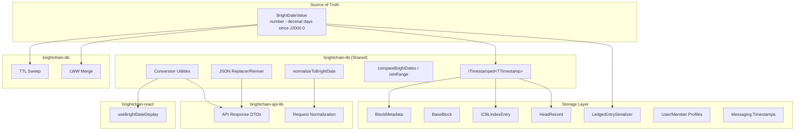

# Design Document: BrightDate as Default Timestamp

## Overview

This design establishes `BrightDateValue` (decimal days since J2000.0) as the native timestamp type across the entire Brightchain ecosystem. The migration inverts the current pattern where `Date` objects are the source of truth and BrightDate is derived for display. After this change, `BrightDateValue` (a plain `number`) becomes the stored, compared, and transmitted representation, with traditional dates derived on demand.

The change touches four layers:
1. **Type system** — Generic timestamp interfaces defaulting to `BrightDateValue`
2. **Storage** — Block metadata, CBL index, head registry, ledger entries, user/member profiles, and messaging records store numeric BrightDate values
3. **Transport** — JSON serialization preserves numbers; API DTOs carry BrightDate natively
4. **Presentation** — Frontend derives locale strings from BrightDateValue via a React hook

Since the datastore can be wiped (confirmed by the user), no backward-compatible migration path is needed. All interfaces are updated in-place with no legacy overloads. The ledger serialization format does not need a version bump since nobody is using it yet.

## Architecture



## Components and Interfaces

### 1. Core Type Definitions (`brightchain-lib`)

```typescript
// src/lib/types/brightDateTimestamp.ts
import type { BrightDateValue } from '@brightchain/brightdate';

/**
 * The canonical timestamp type for all Brightchain schemas.
 * Decimal days since J2000.0 epoch.
 */
export type BrightDateTimestamp = BrightDateValue;

/**
 * Generic timestamped interface. Defaults to BrightDateTimestamp.
 * Parameterize with `string` for ISO 8601 DTOs or `Date` for legacy consumers.
 */
export interface ITimestamped<TTimestamp = BrightDateTimestamp> {
  createdAt: TTimestamp;
  updatedAt: TTimestamp;
}
```

### 2. Conversion Utilities (`brightchain-lib`)

```typescript
// src/lib/utils/brightDateConversions.ts
import { BrightDate } from '@brightchain/brightdate';
import type { BrightDateValue } from '@brightchain/brightdate';
import type { BrightDateTimestamp } from '@brightchain/brightdate';

/** Convert a BrightDateValue to a JavaScript Date. */
export function brightDateToDate(value: BrightDateValue): Date {
  return BrightDate.fromValue(value).toDate();
}

/** Convert a JavaScript Date to a BrightDateValue. */
export function dateToBrightDate(date: Date): BrightDateValue {
  return BrightDate.fromDate(date).value;
}

/** Convert a BrightDateValue to an ISO 8601 string. */
export function brightDateToISO(value: BrightDateValue): string {
  return BrightDate.fromValue(value).toISO();
}

/** Convert an ISO 8601 string to a BrightDateValue. */
export function isoToBrightDate(iso: string): BrightDateValue {
  return BrightDate.fromISO(iso).value;
}

/**
 * Normalize any timestamp input to BrightDateValue.
 * Use at system boundaries where external data may arrive as Date or string.
 */
export function normalizeToBrightDate(
  input: BrightDateValue | Date | string,
): BrightDateValue {
  if (typeof input === 'number') return input;
  if (input instanceof Date) return dateToBrightDate(input);
  return isoToBrightDate(input);
}

/**
 * Generate the current timestamp as BrightDateValue.
 * This is the canonical way to create "now" timestamps in the system.
 */
export function brightDateNow(): BrightDateTimestamp {
  return BrightDate.now().value;
}
```

### 3. Comparison Utilities (`brightchain-lib`)

```typescript
// src/lib/utils/brightDateComparison.ts
import type { BrightDateValue } from '@brightchain/brightdate';

/**
 * Compare two BrightDateValues.
 * Returns negative if a < b, zero if equal, positive if a > b.
 */
export function compareBrightDates(
  a: BrightDateValue,
  b: BrightDateValue,
): number {
  return a - b;
}

/**
 * Check if a BrightDateValue falls within an inclusive range [start, end].
 */
export function isInBrightDateRange(
  value: BrightDateValue,
  start: BrightDateValue,
  end: BrightDateValue,
): boolean {
  return value >= start && value <= end;
}
```

### 4. JSON Serialization (`brightchain-lib`)

```typescript
// src/lib/utils/brightDateJson.ts
import type { BrightDateValue } from '@brightchain/brightdate';

/**
 * Marker prefix for annotated BrightDate fields in JSON.
 * Used when BrightDateValue fields must be distinguished from
 * other numeric fields during deserialization.
 */
const BD_ANNOTATION = '__bd__';

/**
 * Set of field names that are known BrightDateTimestamp fields.
 * Used by the replacer/reviver for type-safe round-tripping.
 */
const BRIGHT_DATE_FIELDS = new Set([
  'createdAt', 'updatedAt', 'deletedAt', 'expiresAt',
  'lastAccessedAt', 'dateCreated', 'timestamp', 'sentAt',
  'deliveredAt', 'lastLogin', 'lastActive', 'lastSeen',
  'registeredAt', 'deactivatedAt', 'queuedAt', 'readAt',
  'joinedAt', 'dateUpdated', 'failedAt', 'enqueuedAt',
  'nextAttemptAt', 'lastAttemptAt', 'receivedAt',
  'vaultCreatedAt', 'vaultModifiedAt', 'validFrom', 'validTo',
  'creationDate', 'modificationDate', 'readDate', 'resentDate',
  'startDate', 'endDate', 'generatedAt', 'locationUpdatedAt',
  'lastSyncTimestamp', 'last_run',
]);

/**
 * JSON replacer that annotates BrightDateValue fields.
 * Wraps known timestamp fields as { __bd__: value } for unambiguous revival.
 */
export function brightDateReplacer(key: string, value: unknown): unknown {
  if (BRIGHT_DATE_FIELDS.has(key) && typeof value === 'number') {
    return { [BD_ANNOTATION]: value };
  }
  return value;
}

/**
 * JSON reviver that reconstructs BrightDateValue from annotated JSON.
 */
export function brightDateReviver(key: string, value: unknown): unknown {
  if (
    value !== null &&
    typeof value === 'object' &&
    BD_ANNOTATION in (value as Record<string, unknown>)
  ) {
    return (value as Record<string, unknown>)[BD_ANNOTATION] as BrightDateValue;
  }
  return value;
}
```

### 5. Migrated Block Interfaces

#### IBaseBlockMetadata

```typescript
// interfaces/blocks/metadata/blockMetadata.ts
import type { BrightDateTimestamp } from '../@brightchain/brightdate';

export interface IBaseBlockMetadata {
  get size(): BlockSize;
  get type(): BlockType;
  get dataType(): BlockDataType;
  get lengthWithoutPadding(): number;
  /** Block creation timestamp as BrightDateValue. */
  get dateCreated(): BrightDateTimestamp;
}
```

#### BlockMetadata class

```typescript
// blockMetadata.ts (key changes)
import { BrightDate } from '@brightchain/brightdate';
import type { BrightDateTimestamp } from '@brightchain/brightdate';

export class BlockMetadata implements IBaseBlockMetadata {
  private readonly _dateCreated: BrightDateTimestamp;

  constructor(
    size: BlockSize,
    type: BlockType,
    dataType: BlockDataType,
    lengthWithoutPadding: number,
    dateCreated: BrightDateTimestamp = BrightDate.now().value,
  ) {
    // ...
    this._dateCreated = dateCreated;
  }

  public get dateCreated(): BrightDateTimestamp {
    return this._dateCreated;
  }

  public toJson(): string {
    return JSON.stringify({
      size: this.size,
      type: this.type,
      dataType: this.dataType,
      lengthWithoutPadding: this.lengthWithoutPadding,
      dateCreated: this.dateCreated, // stored as number directly
    });
  }

  public static fromJson(json: string): BlockMetadata {
    const data = parseBlockMetadataJson(json);
    // dateCreated is now a number in JSON
    const dateCreated: BrightDateTimestamp =
      typeof data.dateCreated === 'number'
        ? data.dateCreated
        : dateToBrightDate(parseDate(data.dateCreated));
    return new BlockMetadata(
      data.size as BlockSize,
      data.type as BlockType,
      data.dataType as BlockDataType,
      data.lengthWithoutPadding,
      dateCreated,
    );
  }
}
```

#### BaseBlock

```typescript
// blocks/base.ts (key changes)
import { BrightDate } from '@brightchain/brightdate';
import type { BrightDateTimestamp } from '@brightchain/brightdate';
import { brightDateNow } from '../utils/brightDateConversions';

export abstract class BaseBlock implements IBaseBlock {
  protected readonly _dateCreated: BrightDateTimestamp;

  protected constructor(/* ... */) {
    // Validate date — no future dates
    const now = brightDateNow();
    this._dateCreated = metadata?.dateCreated ?? now;
    if (this._dateCreated > now) {
      throw new BlockValidationError(
        BlockValidationErrorType.FutureCreationDate,
      );
    }
    // ...
  }

  public get dateCreated(): BrightDateTimestamp {
    return this._dateCreated;
  }
}
```

#### IBlockMetadata (storage)

```typescript
// interfaces/storage/blockMetadata.ts (key changes)
import type { BrightDateTimestamp } from '@brightchain/brightdate';

export interface IBlockMetadata {
  blockId: BlockId;
  createdAt: BrightDateTimestamp;
  expiresAt: BrightDateTimestamp | null;
  // ... other fields unchanged ...
  lastAccessedAt: BrightDateTimestamp;
  // ...
}

export interface BlockStoreOptions {
  expiresAt?: BrightDateTimestamp;
  // ...
}

export function createDefaultBlockMetadata(
  blockId: BlockId,
  size: number,
  checksum: string,
  options?: BlockStoreOptions,
  poolId?: PoolId,
): IBlockMetadata {
  const now = brightDateNow();
  return {
    blockId,
    createdAt: now,
    expiresAt: options?.expiresAt ?? null,
    // ...
    lastAccessedAt: now,
    // ...
  };
}
```

### 6. CBL Index Migration

```typescript
// interfaces/storage/cblIndex.ts (key changes)
import type { BrightDateTimestamp } from '@brightchain/brightdate';

export interface ICBLIndexEntry<TId = string> {
  _id: string;
  magnetUrl: string;
  // ...
  /** When the CBL was stored (BrightDateValue) */
  createdAt: BrightDateTimestamp;
  /** Soft-delete timestamp (undefined = not deleted) */
  deletedAt?: BrightDateTimestamp;
  // ... rest unchanged ...
}
```

### 7. Head Registry Migration

#### HeadRecord

```typescript
// interfaces/storage/headRegistryDriver.ts
import type { BrightDateTimestamp } from '@brightchain/brightdate';

export interface HeadRecord {
  blockId: string;
  /** BrightDateValue for last-writer-wins merge (replaces ISO 8601 string). */
  timestamp: BrightDateTimestamp;
  prevHeadBlockId?: string;
}
```

#### IHeadRegistry / DeferredHeadUpdate

```typescript
// interfaces/storage/headRegistry.ts
import type { BrightDateTimestamp } from '@brightchain/brightdate';

export interface DeferredHeadUpdate {
  dbName: string;
  collectionName: string;
  blockId: string;
  timestamp: BrightDateTimestamp;
}

export interface IHeadRegistry {
  // ...
  getHeadTimestamp(dbName: string, collectionName: string): BrightDateTimestamp | undefined;
  mergeHeadUpdate(
    dbName: string,
    collectionName: string,
    blockId: string,
    timestamp: BrightDateTimestamp,
  ): Promise<boolean>;
  // ...
}
```

#### InMemoryHeadRegistry LWW merge

```typescript
// LWW comparison changes from Date.getTime() to direct numeric comparison:
async mergeHeadUpdate(
  dbName: string,
  collectionName: string,
  blockId: string,
  timestamp: BrightDateTimestamp,
): Promise<boolean> {
  const key = this.makeKey(dbName, collectionName);
  const localTimestamp = this.timestamps.get(key);

  // Direct numeric comparison — no Date parsing needed
  if (!localTimestamp || timestamp > localTimestamp) {
    this.heads.set(key, blockId);
    this.timestamps.set(key, timestamp);
    this.notifyHeadChange(key, blockId);
    return true;
  }
  return false;
}
```

### 8. BrightDB TTL Sweep Migration

The `sweepTTL` method in `Collection` currently constructs a `Date` cutoff and compares document field values as Dates. After migration:

```typescript
async sweepTTL(field: string, expireAfterSeconds: number): Promise<number> {
  await this.ensureLoaded();
  // Convert seconds to days for BrightDate comparison
  const expireDays = expireAfterSeconds / 86400;
  const cutoff = brightDateNow() - expireDays;
  const expired: DocumentId[] = [];

  for (const id of this.docIndex.keys()) {
    const doc = await this.readDoc(id);
    if (!doc) continue;
    const value = doc[field];
    let bdValue: BrightDateTimestamp | null = null;
    if (typeof value === 'number') {
      bdValue = value;
    } else if (value instanceof Date) {
      bdValue = dateToBrightDate(value);
    } else if (typeof value === 'string') {
      bdValue = isoToBrightDate(value);
    }
    if (bdValue !== null && bdValue <= cutoff) {
      expired.push(id);
    }
  }

  for (const id of expired) {
    const doc = await this.readDoc(id);
    if (doc) {
      await this.removeDoc(id);
      this.emitChange('delete', doc);
    }
  }
  return expired.length;
}
```

### 9. Ledger Entry Serialization

The `LedgerEntrySerializer` currently stores `timestamp` as a `uint64 BE` representing milliseconds since Unix epoch. After migration, it stores a `float64 BE` representing the BrightDateValue.

#### ILedgerEntry change

```typescript
// interfaces/ledger/ledgerEntry.ts
import type { BrightDateTimestamp } from '@brightchain/brightdate';

export interface ILedgerEntry<TID extends PlatformID = Uint8Array> {
  readonly payload: Uint8Array;
  readonly previousEntryHash: Checksum | null;
  readonly entryHash: Checksum;
  readonly signature: SignatureUint8Array;
  readonly signerPublicKey: Uint8Array;
  /** Timestamp as BrightDateValue (decimal days since J2000.0). */
  readonly timestamp: BrightDateTimestamp;
  readonly sequenceNumber: number;
  readonly _platformId?: TID;
}
```

#### Serialization format change

```
Binary format (hashable content) — UPDATED:
  sequenceNumber  uint32 BE   (4 bytes)
  timestamp       float64 BE  (8 bytes, BrightDateValue)
  hasPreviousHash uint8       (0x00 = null, 0x01 = present)
  ...rest unchanged...
```

```typescript
// In serializeForHashing():
// OLD: view.setBigUint64(offset, BigInt(entry.timestamp.getTime()), false);
// NEW:
view.setFloat64(offset, entry.timestamp, false);
offset += 8;

// In deserialize():
// OLD: const timestamp = new Date(Number(view.getBigUint64(offset, false)));
// NEW:
const timestamp = view.getFloat64(offset, false);
offset += 8;
```

Since nobody is using the ledger yet, the version number remains `0x0001` and the magic bytes remain `"LEDG"`. The 8-byte timestamp slot simply changes interpretation from uint64 (ms since epoch) to float64 (BrightDateValue). No backward-compatible reading of old formats is needed.

### 10. User/Member Profile and Messaging Timestamps

All user-facing timestamp fields across the system are migrated to `BrightDateTimestamp`. Key interfaces affected:

#### IRequestUser (`brightchain-api-lib`)

```typescript
// The generic D parameter changes from `Date | string` to include BrightDateTimestamp
export interface IRequestUser<
  I extends DefaultBackendIdType | string = string,
  R extends Array<IRoleDTO> | Array<IRoleFrontendObject> | Array<IRoleBackendObject> = Array<IRoleDTO>,
  S extends StringLanguage | string = string,
  D = BrightDateTimestamp,  // was: Date | string = string
> {
  // ...
  lastLogin?: D;
  // ...
}
```

#### Member Public Profile (`brightchain-lib`)

Fields like `lastActive`, `dateCreated`, `dateUpdated` become `BrightDateTimestamp`:

```typescript
export interface IMemberPublicProfile {
  // ...
  lastActive: BrightDateTimestamp;
  dateCreated: BrightDateTimestamp;
  dateUpdated: BrightDateTimestamp;
  // ...
}
```

#### Messaging Timestamps (`brightchain-lib`)

Email delivery receipts and metadata timestamps migrate:

```typescript
// emailDelivery interfaces
export interface IDeliveryReceipt {
  // ...
  queuedAt?: BrightDateTimestamp;
  sentAt?: BrightDateTimestamp;
  deliveredAt?: BrightDateTimestamp;
  readAt?: BrightDateTimestamp;
  // ...
}

// emailMetadata — RFC 5322 date field
export interface IEmailMetadata {
  // ...
  date: BrightDateTimestamp;
  // ...
  readReceipts: Map<TID, BrightDateTimestamp>;
  // ...
}
```

#### Alias Records (`brightchain-lib`)

```typescript
export interface IAliasRecord {
  // ...
  registeredAt: BrightDateTimestamp;
  deactivatedAt?: BrightDateTimestamp;
  // ...
}
```

#### Presence (`digitalburnbag-api-lib`)

```typescript
export interface IPresenceViewer {
  // ...
  joinedAt: BrightDateTimestamp;
  lastSeen: BrightDateTimestamp;
}
```

The pattern is consistent: every `Date` or date-string field that represents a point in time becomes `BrightDateTimestamp`. Fields that represent durations (e.g., `expireAfterSeconds`) remain as numbers in their original units.

#### Additional Interfaces Requiring Migration

The following interfaces in `brightchain-lib` also contain `Date` timestamp fields that must migrate to `BrightDateTimestamp`:

**Block headers:**
- `ICblHeader.dateCreated` — CBL creation timestamp
- `ISuperCblHeader.dateCreated` — SuperCBL creation timestamp
- `ICblBase.dateCreated` — CBL base interface
- `IEphemeralBlock.dateCreated` — ephemeral block creation
- `IVcbl.vaultCreatedAt`, `vaultModifiedAt` — vault CBL timestamps

**Messaging & email gateway:**
- `IEmailGatewayQueueEntry`: `nextAttemptAt`, `enqueuedAt`, `lastAttemptAt`
- `IEmailGatewayBounce.timestamp`
- `IEmailGatewayInboundMessage.receivedAt`
- `IEmailMetadata.date`, `resentDate`
- `IEmailDeliveryReceipt`: `failedAt` (in addition to the ones already listed)
- `IGpgKey`: `createdAt`, `expiresAt`
- `IKeyStoreEntry`: `createdAt`, `updatedAt`
- `ISmimeCertificate`: `validFrom`, `validTo`
- `IContentDisposition`: `creationDate`, `modificationDate`, `readDate`
- `MessageQueryOptions`: `startDate`, `endDate`
- `IMessageMetadataStore.markAsRead()` timestamp parameter

**Services & infrastructure:**
- `IBrightTrustService` interfaces: `createdAt`, `updatedAt`
- `IOperatorPrompt.expiresAt`
- `IBrightTrustDataRecordActionLog.dateCreated`
- `IBrightTrustMetrics.expiration.last_run`
- `IKeyringEntry`: `created`, `lastAccessed`
- `IReconciliationService` interfaces: `lastSyncTimestamp`, `timestamp`, `generatedAt`
- `ILocationRecord`: `lastSeen`, `locationUpdatedAt`

**Other:**
- `IBasicDataObjectDTO.dateCreated`
- `IRequestUser.lastLogin` (in brightchain-lib version)
- `IBaseFriendRequest.createdAt`
- `IServer.createdAt`
- `ICblServices.getDateCreated()` return type
- `IBlockEncryption` method parameter `dateCreated`

**Member interfaces (`brightchain-lib`):**
- `IMemberPublicProfile`: `lastActive`, `dateCreated`, `dateUpdated`
- `IMemberPrivateProfile`: `dateCreated`, `dateUpdated`, `activityLog[].timestamp`
- `IMemberData`: `dateCreated`, `dateUpdated`, `lastSeen`, `activityLog[].timestamp`
- `IMemberVerification`: `dateVerified`
- `IMemberNetworkStatus`: `lastUpdate`
- `IHydratedMember`: `dateCreated`, `dateUpdated`
- `IMemberOperational`: `dateCreated`, `dateUpdated`
- `IMemberDTO<D>`: generic `D` parameter defaults to `BrightDateTimestamp`
- `IBrightChainInitResult`: all `IRoleBase<TID, Date>` and `IUserBase<TID, Date>` type parameters become `BrightDateTimestamp`

**Event system (`brightchain-api-lib`):**
- `IPresenceChangeEvent.timestamp`
- `IMessageEvent.timestamp`
- `IBlockAvailabilityEvent.timestamp`
- `IBlockReplicatedEvent.timestamp`
- `IPartitionEnteredEvent.timestamp`
- `IPartitionExitedEvent.timestamp`

**BrightPass (`brightchain-api-lib`):**
- `VaultIndexEntry`: `createdAt`, `updatedAt`

**BrightDB (`brightchain-db`):**
- `ChangeStreamEvent.timestamp` (in types.ts)
- `HeadRegistry.getHeadTimestamp()` return type

All follow the same migration pattern: replace `Date` with `BrightDateTimestamp` and use `brightDateNow()` where `new Date()` was previously called.

### 11. Frontend Display Hook (`brightchain-react`)

```typescript
// src/hooks/useBrightDateDisplay.ts
import { useMemo } from 'react';
import { BrightDate } from '@brightchain/brightdate';
import type { BrightDateValue } from '@brightchain/brightdate';
import { brightDateToDate } from '@brightchain/brightchain-lib';

export interface BrightDateDisplayResult {
  /** BrightDate string representation (e.g., "9622.50417") */
  brightDateString: string;
  /** Locale-formatted date string */
  localeString: string;
  /** The underlying Date for custom formatting */
  date: Date;
}

/**
 * Hook that derives display strings from a BrightDateValue.
 * BrightDate is the primary format; locale date is derived.
 */
export function useBrightDateDisplay(
  value: BrightDateValue,
  locale?: string,
  options?: Intl.DateTimeFormatOptions,
): BrightDateDisplayResult {
  return useMemo(() => {
    const bd = BrightDate.fromValue(value);
    const date = brightDateToDate(value);
    const localeString = date.toLocaleDateString(locale, options);
    return {
      brightDateString: bd.toString(),
      localeString,
      date,
    };
  }, [value, locale, options]);
}
```

### 12. API DTO Pattern (`brightchain-api-lib`)

```typescript
// src/lib/interfaces/baseResponse.ts
import type { BrightDateTimestamp } from '@brightchain/brightchain-lib';

/**
 * Generic base response with parameterized timestamp type.
 * Default: BrightDateTimestamp (number).
 * For clients needing ISO strings: IBaseResponse<string>.
 */
export interface IBaseResponse<TTimestamp = BrightDateTimestamp> {
  createdAt: TTimestamp;
  updatedAt: TTimestamp;
}

/**
 * Enriched response that includes both BrightDate and ISO representations.
 * Used when the API serves clients that need traditional dates.
 */
export interface IEnrichedTimestampResponse {
  createdAt: BrightDateTimestamp;
  updatedAt: BrightDateTimestamp;
  /** Derived ISO 8601 string for createdAt */
  createdAtISO: string;
  /** Derived ISO 8601 string for updatedAt */
  updatedAtISO: string;
}
```

## Data Models

### BrightDateTimestamp Value Space

| Property | Value |
|----------|-------|
| Type | `number` (IEEE 754 float64) |
| Epoch | J2000.0 = January 1, 2000, 12:00:00 UTC |
| Unit | Decimal days |
| Precision | ~86 nanoseconds (float64 at current epoch values) |
| Range | ±2^53 days (~24.6 million years) |
| Current value (approx) | ~9300 (mid-2025) |

### JSON Representation

BrightDateValue fields serialize as plain JSON numbers:

```json
{
  "createdAt": 9296.9375,
  "updatedAt": 9297.12345,
  "expiresAt": null
}
```

When annotated (for mixed-numeric disambiguation):

```json
{
  "createdAt": { "__bd__": 9296.9375 },
  "size": 4096
}
```

### Ledger Binary Format (unchanged version 0x0001, reinterpreted timestamp slot)

```
Offset  Size    Field
0       4       Magic (0x4C454447 "LEDG")
4       2       Version (0x0001)
6       4       sequenceNumber (uint32 BE)
10      8       timestamp (float64 BE, BrightDateValue)
18      1       hasPreviousHash flag
19      0|64    previousEntryHash
...     ...     (rest unchanged)
```

## Correctness Properties

*A property is a characteristic or behavior that should hold true across all valid executions of a system — essentially, a formal statement about what the system should do. Properties serve as the bridge between human-readable specifications and machine-verifiable correctness guarantees.*

### Property 1: BrightDateValue-to-Date Round-Trip

*For any* valid BrightDateValue `v` in the range [-365250, 365250] (±1000 years from J2000), converting to a Date via `brightDateToDate(v)` and back via `dateToBrightDate(result)` SHALL produce a value within 0.000001 (1 microday) of the original.

**Validates: Requirements 4.5**

### Property 2: Date-to-BrightDateValue Round-Trip

*For any* valid JavaScript Date `d` (with a finite getTime() value within ±1000 years of J2000), converting to BrightDateValue via `dateToBrightDate(d)` and back via `brightDateToDate(result)` SHALL produce a Date whose getTime() differs from the original by at most 86 milliseconds (1 microday).

**Validates: Requirements 4.6**

### Property 3: JSON Serialization Round-Trip

*For any* valid BrightDateValue `v`, serializing an object `{ createdAt: v }` with `brightDateReplacer` and deserializing with `brightDateReviver` SHALL produce an object whose `createdAt` field is exactly equal to `v`.

**Validates: Requirements 5.5**

### Property 4: Ordering Preservation (Metamorphic)

*For any* two BrightDateValues `a` and `b`, `Math.sign(compareBrightDates(a, b))` SHALL equal `Math.sign(brightDateToDate(a).getTime() - brightDateToDate(b).getTime())`. That is, numeric ordering of BrightDateValues preserves chronological ordering.

**Validates: Requirements 3.4, 9.1, 9.4**

### Property 5: compareBrightDates Antisymmetry

*For any* two BrightDateValues `a` and `b`:
- `compareBrightDates(a, a)` SHALL equal 0 (reflexivity)
- `Math.sign(compareBrightDates(a, b))` SHALL equal `-Math.sign(compareBrightDates(b, a))` (antisymmetry)

**Validates: Requirements 9.2**

### Property 6: isInBrightDateRange Correctness

*For any* BrightDateValue `t` and range bounds `start ≤ end`, `isInBrightDateRange(t, start, end)` SHALL return `true` if and only if `start <= t && t <= end`.

**Validates: Requirements 9.3**

### Property 7: normalizeToBrightDate Consistency

*For any* valid BrightDateValue `v`, `normalizeToBrightDate(v)` SHALL return `v` exactly (idempotence). Furthermore, *for any* valid Date `d`, `normalizeToBrightDate(d)` SHALL equal `normalizeToBrightDate(d.toISOString())` within 1 microday tolerance (consistency across input types).

**Validates: Requirements 3.3, 7.4, 10.4**

### Property 8: Ledger Serialization Round-Trip

*For any* valid `ILedgerEntry` with a BrightDateValue timestamp, `deserialize(serialize(entry)).timestamp` SHALL equal the original `entry.timestamp` exactly (float64 bit-exact round-trip through DataView).

**Validates: Requirements 5.1, 5.2 (binary serialization context)**

## Error Handling

| Scenario | Handling |
|----------|----------|
| `normalizeToBrightDate` receives invalid string | Throw `TypeError` with descriptive message ("Invalid date string: ...") |
| `normalizeToBrightDate` receives `NaN` | Throw `TypeError` ("BrightDateValue must be a finite number") |
| `normalizeToBrightDate` receives `Infinity` | Throw `TypeError` ("BrightDateValue must be a finite number") |
| Block created with future timestamp | Throw `BlockValidationError(FutureCreationDate)` — unchanged behavior, now uses numeric comparison |
| JSON reviver encounters malformed annotation | Return value as-is (graceful degradation) |
| Ledger deserializer encounters invalid float64 | Throw `LedgerSerializationError(FieldOverflow)` — same as current behavior for corrupted data |
| TTL sweep encounters non-numeric timestamp field | Attempt conversion via `normalizeToBrightDate`; skip document if conversion fails |
| HeadRecord with ISO string timestamp (legacy) | `normalizeToBrightDate` converts on read; write always uses BrightDateValue |

## Testing Strategy

### Property-Based Tests (fast-check)

Property-based testing is appropriate for this feature because:
- The conversion utilities are pure functions with clear input/output behavior
- Universal properties (round-trips, ordering preservation) hold across a wide input space
- The input space is large (all valid float64 values in range)

**Library:** `fast-check` (already used in the project for ledger PBT)

**Configuration:**
- Minimum 100 iterations per property test
- Each test tagged with: `Feature: brightdate-default-timestamp, Property {N}: {title}`

**Properties to implement:**
1. BrightDateValue → Date → BrightDateValue round-trip (tolerance: 0.000001)
2. Date → BrightDateValue → Date round-trip (tolerance: 86ms)
3. JSON replacer/reviver round-trip (exact equality)
4. Ordering metamorphic property
5. compareBrightDates antisymmetry/reflexivity
6. isInBrightDateRange correctness
7. normalizeToBrightDate idempotence and consistency
8. Ledger serialization round-trip

### Unit Tests (Jest)

Unit tests cover specific examples and edge cases:
- Known epoch values (J2000.0 = 0, Unix epoch = -10957.5)
- Boundary values (very large/small BrightDateValues)
- Error cases (NaN, Infinity, invalid strings)
- BlockMetadata JSON serialization with BrightDate
- BaseBlock future-date validation with BrightDate
- HeadRegistry LWW merge with numeric timestamps
- TTL sweep with BrightDate cutoff values
- API DTO enrichment (BrightDate → ISO derivation)

### Integration Tests

- End-to-end block creation → storage → retrieval with BrightDate timestamps
- Ledger append → read-back with v2 serialization format
- HeadRegistry snapshot export/merge with BrightDate timestamps
- CBL index CRUD operations with BrightDate fields
- TTL sweep correctly expires documents based on BrightDate comparison
