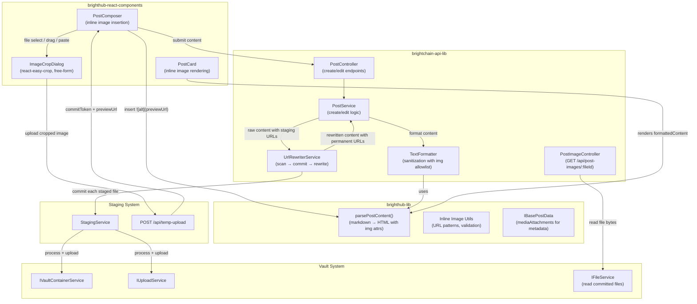
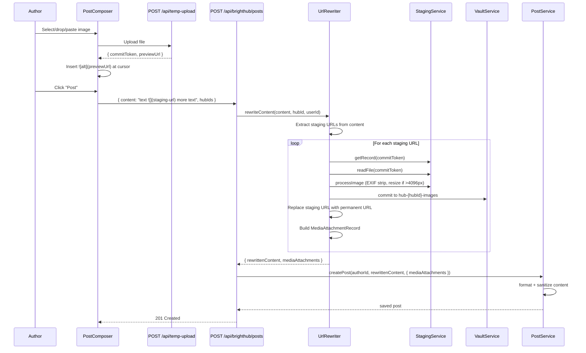

# Design Document: BrightHub Post Images (Inline)

## Overview

This design replaces BrightHub's grid-based media attachment model with inline images embedded directly in post markdown content. Authors place images anywhere in the post body using standard markdown image syntax (``), preview them via the staging system during composition, and on publish the backend commits staged images to permanent vault storage and rewrites staging URLs to permanent serving URLs.

The feature touches four layers:

1. **PostComposer (frontend)** — Replaces the file-input-to-grid flow with inline staging insertion. Supports toolbar button, drag-and-drop, and clipboard paste. Provides an optional crop/resize dialog (free-form aspect ratio) before staging. Inserts `` at the cursor position.
2. **URL Rewriter (backend)** — New service in `brightchain-api-lib` that scans post content for staging URLs, commits each to the hub's vault container, and rewrites them to permanent serving URLs. Handles rollback on partial failure.
3. **PostCard (frontend)** — Removes the separate media attachment grid. Inline images render naturally from `formattedContent` HTML produced by `parsePostContent()`.
4. **parsePostContent / TextFormatter (shared/backend)** — Enhanced to render `` tags with `loading="lazy"`, `max-width: 100%`, and dimension attributes. Backend sanitization updated to allow `` tags with whitelisted `src` patterns.

Key design decisions:
- **No backward compatibility needed** — There are no existing users, so the `mediaAttachments` grid rendering in PostCard is removed, and the old file-input-to-grid flow in PostComposer is replaced entirely.
- **`mediaAttachments` retained as metadata** — The array on `IBasePostData` is kept but repurposed: it stores committed image metadata (file ID, permanent URL, dimensions, alt text) for each inline image, enabling future features like image galleries or dimension-based layout hints.
- **Staging URLs as the composition-time format** — During editing, the content contains staging preview URLs. On publish/edit-save, the URL Rewriter commits and rewrites them to permanent URLs. This keeps the staging system as the single upload path.
- **Content sanitization at save time** — External image URLs (not staging or permanent) are stripped from content before saving. The `parsePostContent()` function on the frontend only renders `` tags whose `src` matches the permanent URL pattern.
- **Per-hub vault containers** — Images are committed to `hub-{hubId}-images` containers (or `user-{userId}-post-images` for top-level posts), created on first use with public visibility.

## Architecture



### Request Flow: Post Creation with Inline Images



## Components and Interfaces

### Shared Interfaces (brighthub-lib)

#### Inline Image URL Utilities

```typescript
// brighthub-lib/src/lib/utils/inlineImageUrls.ts

/**
 * Regex pattern matching staging preview URLs.
 * Format: /api/temp-upload/{uuid-v4}/preview
 */
export const STAGING_URL_PATTERN =
  /\/api\/temp-upload\/([0-9a-f]{8}-[0-9a-f]{4}-4[0-9a-f]{3}-[89ab][0-9a-f]{3}-[0-9a-f]{12})\/preview/gi;

/**
 * Regex pattern matching permanent post image URLs.
 * Format: /api/post-images/{uuid-v4}
 */
export const PERMANENT_URL_PATTERN =
  /\/api\/post-images\/([0-9a-f]{8}-[0-9a-f]{4}-4[0-9a-f]{3}-[89ab][0-9a-f]{3}-[0-9a-f]{12})/gi;

/**
 * Markdown image syntax regex — captures alt text and URL.
 * Matches: 
 */
export const MARKDOWN_IMAGE_PATTERN =
  /!\[([^\]]*)\]\(([^)]+)\)/g;

/** Maximum number of inline images per post */
export const MAX_INLINE_IMAGES = 20;

/** Accepted image MIME types for inline images */
export const INLINE_IMAGE_MIME_TYPES = [
  'image/jpeg',
  'image/png',
  'image/gif',
  'image/webp',
] as const;

/** Maximum image dimension (pixels) before auto-resize at commit */
export const MAX_IMAGE_DIMENSION = 4096;

/**
 * Extract all staging commit tokens from markdown content.
 */
export function extractStagingTokens(content: string): string[] {
  const tokens: string[] = [];
  let match: RegExpExecArray | null;
  const regex = new RegExp(STAGING_URL_PATTERN.source, 'gi');
  while ((match = regex.exec(content)) !== null) {
    tokens.push(match[1]);
  }
  return tokens;
}

/**
 * Extract all permanent file IDs from markdown content.
 */
export function extractPermanentFileIds(content: string): string[] {
  const ids: string[] = [];
  let match: RegExpExecArray | null;
  const regex = new RegExp(PERMANENT_URL_PATTERN.source, 'gi');
  while ((match = regex.exec(content)) !== null) {
    ids.push(match[1]);
  }
  return ids;
}

/**
 * Count the number of inline images (both staging and permanent) in content.
 */
export function countInlineImages(content: string): number {
  const regex = new RegExp(MARKDOWN_IMAGE_PATTERN.source, 'g');
  let count = 0;
  while (regex.exec(content) !== null) count++;
  return count;
}

/**
 * Check if a URL is a valid staging preview URL.
 */
export function isStagingUrl(url: string): boolean {
  const regex = new RegExp(`^${STAGING_URL_PATTERN.source}$`, 'i');
  return regex.test(url);
}

/**
 * Check if a URL is a valid permanent post image URL.
 */
export function isPermanentUrl(url: string): boolean {
  const regex = new RegExp(`^${PERMANENT_URL_PATTERN.source}$`, 'i');
  return regex.test(url);
}

/**
 * Strip image markdown whose URL is neither a staging URL nor a permanent URL.
 * Returns the content with external image markdown removed.
 */
export function stripExternalImageUrls(content: string): string {
  return content.replace(
    new RegExp(MARKDOWN_IMAGE_PATTERN.source, 'g'),
    (match, _alt, url) => {
      if (isStagingUrl(url) || isPermanentUrl(url)) return match;
      return ''; // Strip external image markdown
    },
  );
}
```

#### IBasePostData Changes

The `mediaAttachments` field is retained but the `max 4` comment is updated. The field now stores metadata for committed inline images (no limit change on the interface itself — the 20-image limit is enforced at the API level).

```typescript
// brighthub-lib/src/lib/interfaces/base-post-data.ts (modified field)

/** Media attachment metadata for committed inline images */
mediaAttachments: IBaseMediaAttachment<TId>[];
```

No structural changes to `IBaseMediaAttachment<TId>` — the existing fields (`_id`, `url`, `mimeType`, `size`, `width`, `height`, `altText`, `blurhash`) already cover everything needed.

### URL Rewriter Service (brightchain-api-lib)

The core new backend component. Scans content for staging URLs, commits each to the vault, and rewrites the content.

```typescript
// brightchain-api-lib/src/lib/services/brighthub/urlRewriterService.ts

import { IBaseMediaAttachment } from '@brightchain/brighthub-lib';
import {
  extractStagingTokens,
  stripExternalImageUrls,
  MAX_INLINE_IMAGES,
  MAX_IMAGE_DIMENSION,
} from '@brightchain/brighthub-lib/lib/utils/inlineImageUrls';
import { StagingService } from '../staging/stagingService';
import { processImage, isSupportedImageType } from '../../utils/stagingImageProcessor';
import type { ICommitResponse } from '@brightchain/brightchain-lib';

export interface IUrlRewriterDeps {
  stagingService: StagingService;
  /** Commit a staged file to vault, returning commit response */
  commitToVault: (
    commitToken: string,
    vaultContainerId: string | undefined,
    createContainer: { name: string; ownerId: string; visibility: 'public' } | undefined,
  ) => Promise<ICommitResponse<string>>;
}

export interface IRewriteResult {
  /** Content with staging URLs replaced by permanent URLs */
  rewrittenContent: string;
  /** Media attachment records for each committed image */
  mediaAttachments: IBaseMediaAttachment<string>[];
}

export class UrlRewriterService {
  constructor(private readonly deps: IUrlRewriterDeps) {}

  /**
   * Rewrite staging URLs in post content to permanent vault URLs.
   *
   * 1. Strip external image URLs (not staging or permanent)
   * 2. Extract staging tokens
   * 3. Validate count ≤ MAX_INLINE_IMAGES
   * 4. For each staging token: read, process, commit, collect metadata
   * 5. Replace staging URLs with permanent URLs in content
   * 6. On any commit failure: roll back all previously committed images
   *
   * @param content - Raw post content with staging URLs
   * @param hubId - Hub ID (null for top-level posts)
   * @param userId - Author's user ID
   * @param existingContainerId - Existing vault container ID (if hub already has one)
   */
  async rewriteContent(
    content: string,
    hubId: string | null,
    userId: string,
    existingContainerId?: string,
  ): Promise<IRewriteResult>;
}
```

#### Rewrite Algorithm Detail

```
1. content = stripExternalImageUrls(content)
2. stagingTokens = extractStagingTokens(content)
3. if stagingTokens.length > MAX_INLINE_IMAGES → throw TooManyImagesError
4. if stagingTokens.length === 0 → return { rewrittenContent: content, mediaAttachments: [] }
5. committedTokens: Map<string, ICommitResponse> = new Map()
6. for each token in stagingTokens:
   a. record = stagingService.getRecord(token)
   b. if !record → throw ImageExpiredError(token)
   c. if stagingService.isExpired(record) → throw ImageExpiredError(token)
   d. fileBuffer = stagingService.readFile(token)
   e. Determine processing params:
      - Always: stripExif = true
      - If image dimensions > MAX_IMAGE_DIMENSION: resize to fit within 4096×4096
   f. Process image with sharp (get dimensions from sharp metadata)
   g. Commit to vault:
      - If existingContainerId → use it
      - Else if hubId → createContainer { name: hub-{hubId}-images, ownerId: userId, visibility: public }
      - Else → createContainer { name: user-{userId}-post-images, ownerId: userId, visibility: public }
      - After first commit, cache the vaultContainerId for subsequent images
   h. On commit failure → rollback all previously committed (best-effort) → throw
   i. committedTokens.set(token, commitResponse)
   j. Build IBaseMediaAttachment from commitResponse + sharp metadata
7. Replace each staging URL in content with /api/post-images/{fileId}
8. Return { rewrittenContent, mediaAttachments }
```

### Post Image Serving Endpoint (brightchain-api-lib)

A new controller that serves committed post images from the vault. Follows the same pattern as the server icon serving endpoint in `servers.ts`.

```typescript
// brightchain-api-lib/src/lib/controllers/api/brighthub/postImageController.ts

/**
 * GET /api/post-images/:fileId
 *
 * Serves a committed post image from the vault.
 * Public endpoint (no auth required) — images in public vault containers.
 * Supports ETag-based caching (Cache-Control: public, max-age=31536000, immutable).
 */
```

Route: `GET /api/post-images/:fileId`
- Looks up the file in the vault by fileId
- Returns file bytes with appropriate Content-Type, Cache-Control, and ETag headers
- Returns 404 if file not found

### PostComposer Changes (brighthub-react-components)

The PostComposer is refactored to replace the file-input-to-grid flow with inline image insertion.

#### Removed
- `mediaFiles` state and `mediaPreviews` state
- Grid-based media preview rendering
- `handleFileSelect` that adds to `mediaFiles` array
- `PostComposerSubmitData.mediaFiles` field
- `MAX_ATTACHMENTS = 4` constant

#### Added

```typescript
// New props added to PostComposerProps
export interface PostComposerProps {
  // ... existing props ...
  /** API client for staging file uploads */
  stagingApi?: {
    stageFile: (file: File) => Promise<ITempUploadResponse>;
    discardFile: (commitToken: string) => Promise<void>;
  };
}

// Updated submit data — no more mediaFiles
export interface PostComposerSubmitData {
  content: string;
  hubIds: string[];
  replyToId?: string;
  quotedPostId?: string;
  isBlogPost: boolean;
}
```

#### New Internal State

```typescript
// Track staged images for cleanup on discard
const [stagedTokens, setStagedTokens] = useState<string[]>([]);
const [uploadingCount, setUploadingCount] = useState(0);
```

#### Image Insertion Flow

1. **Toolbar button click**: Opens file picker (`image/jpeg,image/png,image/gif,image/webp`). On file select, optionally opens `ImageCropDialog`. After crop (or skip), uploads to staging API, inserts `` at cursor.
2. **Drag-and-drop**: `onDrop` handler on the textarea. Extracts image files from `DataTransfer`, uploads each, inserts at drop position.
3. **Clipboard paste**: `onPaste` handler. Checks `clipboardData.items` for image types, uploads, inserts at cursor.
4. **Loading indicator**: While uploading, inserts a placeholder `` that is replaced with the actual markdown on success.
5. **Image limit**: Before each insertion, checks `countInlineImages(content) < MAX_INLINE_IMAGES`. If at limit, shows a snackbar/tooltip message.
6. **Cancel/navigate away**: Calls `stagingApi.discardFile(token)` for each token in `stagedTokens`.

#### Alt Text Editing

A small inline popover triggered by clicking on image markdown in the textarea (or a dedicated "Edit alt text" option in a context menu). Updates the `` to `` in the content string. This is a text manipulation — no API call needed.

### ImageCropDialog (brighthub-react-components)

Adapted from BrightChat's `IconCropDialog` with these differences:

| Aspect | IconCropDialog | ImageCropDialog |
|--------|---------------|-----------------|
| Aspect ratio | 1:1 (circular) | Free-form (rectangular) |
| Crop shape | `cropShape="round"` | `cropShape="rect"` |
| Preview | 48px circular avatar | Scaled rectangular preview |
| Output | Commit token only | Cropped image blob for staging |
| Skip option | No | Yes — author can skip cropping |

```typescript
// brighthub-react-components/src/lib/posts/ImageCropDialog.tsx

export interface ImageCropDialogProps {
  open: boolean;
  onClose: () => void;
  /** The image file to crop */
  imageFile: File;
  /** Called with the cropped image blob when confirmed */
  onCropComplete: (croppedBlob: Blob) => void;
  /** Called when the author skips cropping */
  onSkip: () => void;
}
```

The dialog:
1. Creates an object URL from the `imageFile` for the crop preview
2. Uses `react-easy-crop` with `aspect={undefined}` (free-form)
3. On confirm, uses `canvas` to extract the cropped region as a Blob
4. Passes the Blob back to PostComposer, which uploads it to staging

### PostCard Changes (brighthub-react-components)

#### Removed
- The entire `{post.mediaAttachments.length > 0 && ...}` grid rendering block

#### Unchanged
- The `dangerouslySetInnerHTML={{ __html: post.formattedContent }}` block — inline images are already rendered as `` tags in the formatted HTML by `parsePostContent()`.

The PostCard becomes simpler: it just renders `formattedContent` and the images appear inline.

### parsePostContent Changes (brighthub-lib)

The `parsePostContent()` function currently strips all HTML first, then parses markdown. Since `MarkdownIt` is configured with `html: true`, it already converts `` to `` tags. The key change is in the sanitization step.

#### Changes

1. **Phase 1 (strip HTML)**: No change — raw user input HTML is still stripped.
2. **Phase 2 (parse markdown)**: `MarkdownIt` already handles `` → ``. No change needed.
3. **Phase 3 (post-processing)**: Add a new phase that enhances `` tags with `loading="lazy"` and `style="max-width: 100%"` attributes.

```typescript
// New phase added to parsePostContent after markdown parsing:

// Phase 3.5: Enhance img tags for performance and responsive display
content = content.replace(
  /]*)>/gi,
  (match, attrs) => {
    let enhanced = match;
    if (!attrs.includes('loading=')) {
      enhanced = enhanced.replace(' {
    const src = attribs['src'] || '';
    // Only allow permanent post image URLs
    if (!isPermanentUrl(src)) {
      return { tagName: '', attribs: {} }; // Strip the tag
    }
    return {
      tagName,
      attribs: {
        ...attribs,
        loading: 'lazy',
        style: 'max-width: 100%',
      },
    };
  },
},
```

### PostService Integration (brightchain-api-lib)

The `createPost` and `editPost` methods in `PostService` are updated to call the URL Rewriter before formatting.

#### createPost Changes

```
1. Validate content (existing)
2. Auto-moderation check (existing)
3. NEW: Strip external image URLs from content
4. NEW: Validate inline image count ≤ 20
5. NEW: Call urlRewriter.rewriteContent(content, hubId, userId)
6. NEW: Use rewritten content for formatting
7. NEW: Store returned mediaAttachments on the post record
8. Format content (existing, now with rewritten content)
9. Save post (existing)
```

#### editPost Changes

```
1. Validate edit window (existing)
2. NEW: Extract staging URLs from new content (new images)
3. NEW: Extract permanent URLs from new content (existing images)
4. NEW: Call urlRewriter.rewriteContent() for new staging URLs only
5. NEW: Merge new mediaAttachments with retained ones
6. NEW: Remove mediaAttachments for images no longer in content
7. Format and save (existing)
```

### Vault Container Naming

| Context | Container Name | Created By |
|---------|---------------|------------|
| Hub post | `hub-{hubId}-images` | URL Rewriter on first image commit |
| Top-level post (no hub) | `user-{userId}-post-images` | URL Rewriter on first image commit |

Containers are created with `visibility: 'public'` so images can be served without authentication.

### Post Error Codes (brighthub-lib)

New error codes added to `PostErrorCode`:

```typescript
/** Too many inline images (max 20) */
TooManyInlineImages = 'TOO_MANY_INLINE_IMAGES',
/** A staged image has expired */
StagedImageExpired = 'STAGED_IMAGE_EXPIRED',
/** Image commit to vault failed */
ImageCommitFailed = 'IMAGE_COMMIT_FAILED',
```

## Data Models

### Post Record (updated)

| Field | Type | Change | Description |
|-------|------|--------|-------------|
| content | string | Updated | Raw markdown with permanent image URLs (after rewrite) |
| formattedContent | string | Updated | HTML with `` tags for inline images |
| mediaAttachments | IBaseMediaAttachment[] | Repurposed | Metadata for committed inline images (was grid attachments) |

### IBaseMediaAttachment (unchanged)

| Field | Type | Description |
|-------|------|-------------|
| _id | TId | Vault file ID |
| url | string | Permanent serving URL (`/api/post-images/{fileId}`) |
| mimeType | string | Image MIME type |
| size | number | File size in bytes |
| width | number? | Image width in pixels |
| height | number? | Image height in pixels |
| altText | string? | Alt text from markdown |
| blurhash | string? | Placeholder hash (future enhancement) |

### URL Patterns

| URL Type | Pattern | Example |
|----------|---------|---------|
| Staging preview | `/api/temp-upload/{uuid}/preview` | `/api/temp-upload/a1b2c3d4-e5f6-7890-abcd-ef1234567890/preview` |
| Permanent image | `/api/post-images/{uuid}` | `/api/post-images/f9e8d7c6-b5a4-3210-fedc-ba0987654321` |

### Vault Container Naming

| Context | Container Name |
|---------|---------------|
| Hub post | `hub-{hubId}-images` |
| User post | `user-{userId}-post-images` |


## Correctness Properties

*A property is a characteristic or behavior that should hold true across all valid executions of a system — essentially, a formal statement about what the system should do. Properties serve as the bridge between human-readable specifications and machine-verifiable correctness guarantees.*

### Property 1: Markdown image insertion at cursor position

*For any* non-empty content string, any valid cursor position within that string (0 ≤ pos ≤ content.length), and any valid staging preview URL, inserting image markdown at the cursor position SHALL produce a new content string where: (a) the substring `` appears starting at position `pos`, (b) all content before `pos` is unchanged, and (c) all content after `pos` is shifted by the length of the inserted markdown.

**Validates: Requirements 1.3, 1.4**

### Property 2: Frontend image count limit enforcement

*For any* content string containing N markdown image entries (where N ranges from 0 to 25), the PostComposer SHALL allow image insertion if and only if N < 20. When N ≥ 20, the insert image button SHALL be disabled and drag/paste insertion SHALL be rejected.

**Validates: Requirements 2.1, 2.2, 2.3**

### Property 3: Backend image count limit enforcement

*For any* post content string containing N staging URLs (where N ranges from 0 to 25), the URL Rewriter SHALL accept the content if and only if N ≤ 20. When N > 20, the rewriter SHALL throw a TooManyInlineImages error.

**Validates: Requirements 2.4**

### Property 4: Markdown image rendering with correct attributes

*For any* markdown image syntax `` where `altText` is any string (including empty) and `url` is any valid URL, `parsePostContent()` SHALL produce HTML containing an `` tag where: (a) the `src` attribute equals the URL, (b) the `alt` attribute equals the alt text (or `alt=""` when alt text is empty), (c) the `loading` attribute equals `"lazy"`, and (d) the `style` attribute includes `max-width: 100%`.

**Validates: Requirements 3.1, 3.4, 4.3, 4.4, 9.1, 9.2**

### Property 5: Alt text update preserves URL and surrounding content

*For any* content string containing one or more markdown image entries ``, and any new alt text string, updating the alt text SHALL produce content where: (a) the image URL is unchanged, (b) the alt text is replaced with the new value, and (c) all non-image content before and after the image markdown is unchanged.

**Validates: Requirements 4.2**

### Property 6: Staging URL extraction correctness

*For any* content string containing a mix of staging URLs (`/api/temp-upload/{uuid}/preview`), permanent URLs (`/api/post-images/{uuid}`), and arbitrary other text, `extractStagingTokens()` SHALL return exactly the set of UUID v4 tokens from staging URLs and no others.

**Validates: Requirements 5.1**

### Property 7: URL rewriting produces correct permanent URLs and media attachments

*For any* content string containing N staging URLs (where 1 ≤ N ≤ 20), after the URL Rewriter commits all staged files, the rewritten content SHALL: (a) contain zero staging URLs, (b) contain exactly N permanent URLs corresponding to the committed file IDs, (c) preserve all non-image text unchanged, and (d) produce a `mediaAttachments` array of length N where each record contains the file ID, permanent URL, MIME type, size, and alt text from the original markdown.

**Validates: Requirements 5.3, 5.6**

### Property 8: Image processing parameters correctness

*For any* image with dimensions (width, height) and MIME type, the URL Rewriter SHALL: (a) always set `stripExif: true` in processing parameters, (b) set resize parameters if and only if `width > 4096 OR height > 4096`, with the resize fitting within 4096×4096 while preserving aspect ratio, and (c) preserve the original image format (not specify a format override) unless explicitly requested.

**Validates: Requirements 6.1, 6.2, 6.3**

### Property 9: Edit removes metadata for deleted images

*For any* post with N committed inline images and an edit that retains a subset S of those images (where S ⊂ N), the resulting `mediaAttachments` array SHALL contain exactly the records corresponding to the permanent URLs still present in the edited content, and no records for removed images.

**Validates: Requirements 7.3**

### Property 10: Edit does not re-commit permanent URLs

*For any* edited post content containing M permanent URLs from the original post and K new staging URLs, the URL Rewriter SHALL make exactly K commit calls (one per new staging URL) and zero commit calls for the M existing permanent URLs.

**Validates: Requirements 7.4**

### Property 11: Vault container naming convention

*For any* hub ID, the vault container name SHALL equal `hub-{hubId}-images`. *For any* user ID (when no hub context), the vault container name SHALL equal `user-{userId}-post-images`. The naming function SHALL be deterministic — the same input always produces the same output.

**Validates: Requirements 10.3, 10.4**

### Property 12: Staging URL validation

*For any* string, `isStagingUrl()` SHALL return `true` if and only if the string exactly matches the pattern `/api/temp-upload/{uuid}/preview` where `{uuid}` is a valid UUID v4 (lowercase hex, correct version/variant bits). All other strings, including near-misses (wrong UUID format, extra path segments, query parameters), SHALL return `false`.

**Validates: Requirements 11.1**

### Property 13: External URL stripping

*For any* content string containing markdown image entries with a mix of staging URLs, permanent URLs, and external URLs (http/https/data/other), `stripExternalImageUrls()` SHALL: (a) preserve all image markdown with staging URLs, (b) preserve all image markdown with permanent URLs, (c) remove all image markdown with external URLs, and (d) preserve all non-image-markdown text unchanged.

**Validates: Requirements 11.2, 11.4**

## Error Handling

### Frontend Errors (PostComposer)

| Error Condition | User-Facing Behavior |
|----------------|---------------------|
| Staging upload fails (network/server error) | Snackbar error message; no markdown inserted; loading indicator removed |
| Image limit reached (20 images) | Insert Image button disabled; tooltip "Maximum 20 images per post"; drag/paste rejected with snackbar |
| Staged image expired in preview | Broken image placeholder with "Image expired — re-upload" text |
| Crop dialog error | Error message in dialog; author can retry or cancel |
| Discard fails on cancel/navigate | Silent failure — staging cleanup scheduler handles expiry |

### Backend Errors (URL Rewriter / PostService)

| Error Condition | HTTP Status | Error Code | Description |
|----------------|-------------|------------|-------------|
| Content has > 20 staging URLs | 400 | `TOO_MANY_INLINE_IMAGES` | Exceeds maximum inline image limit |
| Staging URL references expired file | 410 | `STAGED_IMAGE_EXPIRED` | Staged file TTL expired; author must re-upload |
| Staging URL references unknown token | 404 | `STAGED_IMAGE_EXPIRED` | Staged file not found (already cleaned up) |
| Single image commit fails | 500 | `IMAGE_COMMIT_FAILED` | Vault upload failed; all committed images rolled back |
| Vault container creation fails | 500 | `IMAGE_COMMIT_FAILED` | Could not create hub/user image container |
| Image processing fails (corrupt file) | 422 | `UNPROCESSABLE_ENTITY` | Sharp could not process the image |

### Rollback Strategy

When the URL Rewriter encounters a commit failure for any image in a post:

1. Record the failure
2. For each previously committed image in this batch: attempt to delete from vault (best-effort)
3. Return error to the client with the specific failure reason
4. The staged files are NOT deleted — the author can retry

This ensures atomicity at the post level: either all images are committed or none are.

### Edit Window Errors

| Error Condition | HTTP Status | Error Code |
|----------------|-------------|------------|
| Edit window expired | 403 | `EDIT_WINDOW_EXPIRED` |
| New staging URL in edit is expired | 410 | `STAGED_IMAGE_EXPIRED` |

## Testing Strategy

### Property-Based Testing

**Library**: `fast-check` (already used in the workspace)

**Configuration**: Minimum 100 iterations per property test. Each test tagged with:
```
Feature: brighthub-post-images, Property {number}: {property_text}
```

**Property tests target two layers:**

#### brighthub-lib (shared utilities)
- Property 4: `parsePostContent()` image rendering (markdown → img tags with attributes)
- Property 5: Alt text update function
- Property 6: `extractStagingTokens()` correctness
- Property 11: Vault container naming functions
- Property 12: `isStagingUrl()` validation
- Property 13: `stripExternalImageUrls()` correctness

#### brightchain-api-lib (backend services)
- Property 3: Backend image count limit in URL Rewriter
- Property 7: URL rewriting (staging → permanent) with mocked staging/vault services
- Property 8: Image processing parameter computation
- Property 9: Edit metadata cleanup logic
- Property 10: Edit skips permanent URLs

#### brighthub-react-components (frontend)
- Property 1: Markdown insertion at cursor position (unit test the insertion function)
- Property 2: Frontend image count limit enforcement

### Unit Tests

Unit tests cover specific examples, edge cases, and integration points:

**brighthub-lib:**
- `parsePostContent()` with specific markdown image examples
- `countInlineImages()` with 0, 1, 20, 21 images
- `isStagingUrl()` / `isPermanentUrl()` with edge cases (empty string, partial match, wrong UUID version)
- `stripExternalImageUrls()` with mixed content

**brightchain-api-lib:**
- `UrlRewriterService.rewriteContent()` happy path with mocked dependencies
- Rollback on partial commit failure (fail on 2nd of 3 images)
- Expired staging file handling
- Container creation on first image (hub context vs user context)
- `PostService.createPost()` integration with URL rewriter
- `PostService.editPost()` with new images, removed images, and unchanged images
- `TextFormatter` sanitization allowing permanent URL img tags, stripping external

**brighthub-react-components:**
- `PostComposer` toolbar button opens file picker
- `PostComposer` drag-and-drop triggers upload
- `PostComposer` paste triggers upload
- `PostComposer` loading indicator during upload
- `PostComposer` error display on upload failure
- `PostComposer` discard on cancel/unmount
- `PostComposer` image limit disables button at 20
- `ImageCropDialog` renders with free-form aspect ratio
- `ImageCropDialog` skip button bypasses cropping
- `PostCard` renders inline images from formattedContent (no grid)

### Integration Tests

- Full post creation flow: stage images → create post → verify saved content has permanent URLs
- Full post edit flow: add new image to existing post → verify new image committed, old images retained
- Full post edit flow: remove image from existing post → verify metadata cleaned up
- Image serving: commit image → GET /api/post-images/{fileId} → verify correct bytes and headers

### Test Organization

```
brighthub-lib/src/lib/utils/__tests__/
  inlineImageUrls.spec.ts                    — Unit tests for URL utilities
  inlineImageUrls.property.spec.ts           — Properties 6, 11, 12, 13

brighthub-lib/src/lib/__tests__/
  brighthub-lib.inline-images.property.spec.ts — Property 4 (parsePostContent image rendering)

brighthub-react-components/src/lib/posts/__tests__/
  PostComposer.inline-images.spec.tsx        — Unit tests for inline image insertion
  PostComposer.inline-images.property.spec.tsx — Properties 1, 2
  ImageCropDialog.spec.tsx                   — Unit tests for crop dialog
  PostCard.inline-images.spec.tsx            — Unit tests for inline rendering

brightchain-api-lib/src/lib/services/brighthub/__tests__/
  urlRewriterService.spec.ts                 — Unit tests for URL rewriter
  urlRewriterService.property.spec.ts        — Properties 3, 7, 8, 9, 10
  postService.inline-images.spec.ts          — Integration tests for post creation/edit with images

brightchain-api-lib/src/lib/services/brighthub/__tests__/
  textFormatter.inline-images.spec.ts        — Sanitization tests for img tags

brightchain-api-lib/src/lib/controllers/api/brighthub/__tests__/
  postImageController.spec.ts                — Image serving endpoint tests
```
