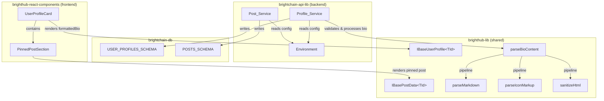

# Design Document: BrightHub Profile Enhancements

## Overview

This feature enhances BrightHub user profiles in two ways:

1. **Rich Bio Field** — Upgrades the existing 160-character plain text `bio` to a markdown-rendered field with FontAwesome icon markup support and a configurable maximum length (default 2000, controlled by `BRIGHTHUB_PROFILE_LENGTH`). A new `formattedBio` field stores pre-rendered HTML, following the same pattern as `content`/`formattedContent` on posts. Image markdown syntax is explicitly rejected to keep bios text-focused.

2. **Pinned Post** — Lets users pin a single post to the top of their profile. A `pinnedPostId` on the user profile references the pinned post, and an `isPinned` boolean on the post model marks the post itself. The feature is gated by the `BRIGHTHUB_PROFILE_PINNED_POST` environment variable.

Both features follow existing architectural patterns: shared base interfaces in `brighthub-lib`, API-specific extensions in `brightchain-api-lib`, database schemas in `brightchain-db`, and React components in `brighthub-react-components`.

## Architecture



### Design Decisions

1. **Bio processing in shared lib** — `parseBioContent()` lives in `brighthub-lib` alongside `parsePostContent()` so both frontend preview and backend processing use the same pipeline. This follows the existing pattern where `parsePostContent()` is already in the shared lib.

2. **Image rejection at parse time** — Rather than stripping images silently, the bio parser rejects markdown image syntax (``  and `![...][...]`) and returns an error. This gives users clear feedback rather than surprising content loss.

3. **Pre-rendered HTML pattern** — `formattedBio` mirrors the `content`/`formattedContent` pattern on posts. The backend stores pre-rendered HTML so the frontend never needs to parse markdown at render time.

4. **Single pinned post via dual fields** — `pinnedPostId` on the profile provides O(1) lookup for display, while `isPinned` on the post enables the post itself to show a pinned indicator without a join. This denormalization is acceptable because only one post can be pinned at a time.

5. **Environment variable gating** — Both features use environment variables following the existing `Environment` class pattern. `BRIGHTHUB_PROFILE_LENGTH` controls bio length; `BRIGHTHUB_PROFILE_PINNED_POST` gates the entire pinned post feature.

## Components and Interfaces

### 1. `parseBioContent()` — Bio Processing Pipeline

**Location:** `brighthub-lib/src/lib/brighthub-lib.ts`

A new function following the same 3-phase pipeline as `parsePostContent()`, but tailored for bio content:

```typescript
/**
 * Parses bio content through a 3-phase pipeline:
 * Phase 1: Sanitize HTML (strip all tags)
 * Phase 2: Parse markdown (always uses full markdown, no blog/non-blog distinction)
 * Phase 3: Parse custom icon markup
 *
 * Rejects image markdown syntax before processing.
 *
 * @param content - Raw bio text
 * @param maxLength - Maximum character count (from BRIGHTHUB_PROFILE_LENGTH)
 * @returns Parsed HTML string
 * @throws Error if content contains image markdown or exceeds maxLength
 */
export function parseBioContent(content: string, maxLength: number): string;
```

**Image rejection:** Before entering the pipeline, the function checks for markdown image patterns:
- Inline images: `` — regex: `/!\[([^\]]*)\]\(([^)]+)\)/`
- Reference images: `![alt][ref]` — regex: `/!\[([^\]]*)\]\[([^\]]*)\]/`

If either pattern is found, the function throws a descriptive error.

**Pipeline phases:**
1. `sanitizeHtml(content, { allowedTags: [], allowedAttributes: {} })` — strip embedded HTML
2. `parseMarkdown(content)` — convert markdown to HTML (bios always use full markdown rendering)
3. `parseIconMarkup(content)` — convert `{{ }}` icon syntax to FontAwesome `<i>` elements

This mirrors `parsePostContent()` but omits the `isBlogPost` branch (bios always render markdown) and the `` enhancement step (images are rejected).

### 2. `IBaseUserProfile<TId>` Changes

**Location:** `brighthub-lib/src/lib/interfaces/base-user-profile.ts`

```typescript
export interface IBaseUserProfile<TId> {
  // ... existing fields ...

  /** User bio — markdown + icon markup, max length from BRIGHTHUB_PROFILE_LENGTH */
  bio: string;

  /** Pre-rendered HTML of the bio field */
  formattedBio?: string;

  /** ID of the user's pinned post */
  pinnedPostId?: TId;
}
```

Changes:
- `bio` comment updated to reflect new max length (configurable, no longer hardcoded 160)
- `formattedBio?: string` added — optional because existing profiles won't have it
- `pinnedPostId?: TId` added — generic type matches the existing `_id` pattern

### 3. `IBasePostData<TId>` Changes

**Location:** `brighthub-lib/src/lib/interfaces/base-post-data.ts`

```typescript
export interface IBasePostData<TId> {
  // ... existing fields ...

  /** Whether this post is pinned to the author's profile */
  isPinned?: boolean;
}
```

### 4. `USER_PROFILES_SCHEMA` Changes

**Location:** `brightchain-db/src/lib/schemas/brighthub/users.schema.ts`

```typescript
// In properties:
bio: { type: 'string', maxLength: 2000 },  // was 160; runtime validation uses env var
formattedBio: { type: 'string' },           // new, optional
pinnedPostId: { type: 'string' },           // new, optional
```

**Note:** The schema `maxLength` is set to the default (2000). Runtime validation in the Profile_Service uses the actual `BRIGHTHUB_PROFILE_LENGTH` value, which may differ per deployment. The schema serves as a safety net at the database level.

### 5. `POSTS_SCHEMA` Changes

**Location:** `brightchain-db/src/lib/schemas/brighthub/posts.schema.ts`

```typescript
// In properties:
isPinned: { type: 'boolean' },  // new, optional
```

An index on `authorId + isPinned` enables efficient lookup of a user's pinned post:

```typescript
// In indexes:
{ fields: { authorId: 1, isPinned: 1 } },
```

### 6. `Environment` Class Changes

**Location:** `brightchain-api-lib/src/lib/environment.ts`

Two new private fields and getters:

```typescript
private _profileLength: number;
private _profilePinnedPostEnabled: boolean;

// In constructor:
const rawProfileLength = envObj['BRIGHTHUB_PROFILE_LENGTH'];
const parsedProfileLength = rawProfileLength ? parseInt(rawProfileLength, 10) : NaN;
if (rawProfileLength && (isNaN(parsedProfileLength) || parsedProfileLength <= 0)) {
  console.warn(
    `[ warning ] BRIGHTHUB_PROFILE_LENGTH is not a valid positive integer: "${rawProfileLength}" — using default 2000`
  );
}
this._profileLength = (!isNaN(parsedProfileLength) && parsedProfileLength > 0)
  ? parsedProfileLength
  : 2000;

const rawPinnedPost = envObj['BRIGHTHUB_PROFILE_PINNED_POST'];
this._profilePinnedPostEnabled = rawPinnedPost !== 'false'; // defaults to true

// Getters:
public get profileLength(): number {
  return this._profileLength;
}

public get profilePinnedPostEnabled(): boolean {
  return this._profilePinnedPostEnabled;
}
```

### 7. `UserProfileCard` Component Changes

**Location:** `brighthub-react-components/src/lib/profiles/UserProfileCard.tsx`

The bio section changes from plain text `Typography` to rendered HTML:

```tsx
{/* Bio — rendered as HTML from formattedBio, fallback to plain text bio */}
{(user.formattedBio || user.bio) && (
  <Box
    sx={{ mt: 1, wordBreak: 'break-word', '& p': { m: 0 }, '& p:last-child': { mb: 0 } }}
    dangerouslySetInnerHTML={{ __html: user.formattedBio || user.bio }}
  />
)}
```

This follows the same `dangerouslySetInnerHTML` pattern used by `PostCard` for `formattedContent`. The fallback to `user.bio` handles profiles that haven't been re-processed yet.

### 8. `PinnedPostSection` Component

**Location:** `brighthub-react-components/src/lib/profiles/PinnedPostSection.tsx`

A new component that renders the pinned post above the timeline:

```typescript
export interface PinnedPostSectionProps {
  /** The pinned post data */
  pinnedPost: IBasePostData<string>;
  /** Author of the pinned post (same as profile owner) */
  author: IBaseUserProfile<string>;
  /** Whether the pinned post feature is enabled */
  featureEnabled: boolean;
  /** Whether the current user is the profile owner */
  isSelf?: boolean;
  /** Callback when unpin is clicked (only shown for profile owner) */
  onUnpin?: (postId: string) => void;
  /** Callback when the post is clicked */
  onPostClick?: (postId: string) => void;
}
```

**Rendering logic:**
- If `!featureEnabled` or `pinnedPost.isDeleted`, render nothing
- Renders a "Pinned" label with a pin icon (`PushPin` from MUI icons)
- Delegates to the existing `PostCard` component for the actual post content
- Shows an "Unpin" action button when `isSelf` is true
- Uses `useBrightHubTranslation()` for all labels

### 9. `EditProfileDialog` Component

**Location:** `brighthub-react-components/src/lib/profiles/EditProfileDialog.tsx`

A new dialog component that lets users edit their own profile:

```typescript
export interface EditProfileDialogProps {
  /** Whether the dialog is open */
  open: boolean;
  /** The current user profile data to pre-populate the form */
  profile: IBaseUserProfile<string>;
  /** Maximum bio character length (from BRIGHTHUB_PROFILE_LENGTH) */
  bioMaxLength: number;
  /** Callback when the user saves changes */
  onSave: (updates: EditProfileUpdates) => Promise<void>;
  /** Callback when the dialog is closed/cancelled */
  onClose: () => void;
}

export interface EditProfileUpdates {
  displayName: string;
  bio: string;
  location?: string;
  websiteUrl?: string;
}
```

**Rendering logic:**
- Fields: `displayName` (required), `bio` (multiline, with live character count and markdown preview), `location` (optional), `websiteUrl` (optional)
- Live character count on the bio field: `{current}/{maxLength}` — turns red when over limit
- Live markdown preview tab (same pattern as `PostComposer`) using `parseBioContent()` for preview rendering
- Validation: bio length, image markdown rejection — display localized error messages via `useBrightHubTranslation()`
- Submit button disabled while saving or when validation fails
- Uses `useBrightHubTranslation()` for all labels, placeholders, and error messages

### 10. i18n String Keys

New keys to add to `BrightHubStrings` in `brighthub-lib/src/lib/enumerations/brightHubStrings.ts`:

```typescript
// PinnedPostSection
PinnedPostSection_Pinned: 'PinnedPostSection_Pinned',
PinnedPostSection_Unpin: 'PinnedPostSection_Unpin',
PinnedPostSection_AriaLabel: 'PinnedPostSection_AriaLabel',

// EditProfileDialog
EditProfileDialog_Title: 'EditProfileDialog_Title',
EditProfileDialog_DisplayName: 'EditProfileDialog_DisplayName',
EditProfileDialog_Bio: 'EditProfileDialog_Bio',
EditProfileDialog_BioPlaceholder: 'EditProfileDialog_BioPlaceholder',
EditProfileDialog_BioCharCountTemplate: 'EditProfileDialog_BioCharCountTemplate',
EditProfileDialog_BioPreview: 'EditProfileDialog_BioPreview',
EditProfileDialog_Location: 'EditProfileDialog_Location',
EditProfileDialog_WebsiteUrl: 'EditProfileDialog_WebsiteUrl',
EditProfileDialog_Save: 'EditProfileDialog_Save',
EditProfileDialog_Cancel: 'EditProfileDialog_Cancel',
EditProfileDialog_Saving: 'EditProfileDialog_Saving',
EditProfileDialog_ErrorBioTooLong: 'EditProfileDialog_ErrorBioTooLong',
EditProfileDialog_ErrorBioContainsImage: 'EditProfileDialog_ErrorBioContainsImage',

// UserProfileCard edit button (shown when isSelf)
UserProfileCard_EditProfile: 'UserProfileCard_EditProfile',
```

English translations to add to `brighthub-lib/src/lib/i18n/strings/englishUs.ts` and `englishUK.ts`:

```typescript
// PinnedPostSection
[BrightHubStrings.PinnedPostSection_Pinned]: 'Pinned',
[BrightHubStrings.PinnedPostSection_Unpin]: 'Unpin',
[BrightHubStrings.PinnedPostSection_AriaLabel]: 'Pinned post',

// EditProfileDialog
[BrightHubStrings.EditProfileDialog_Title]: 'Edit Profile',
[BrightHubStrings.EditProfileDialog_DisplayName]: 'Display name',
[BrightHubStrings.EditProfileDialog_Bio]: 'Bio',
[BrightHubStrings.EditProfileDialog_BioPlaceholder]: 'Tell people about yourself. Markdown and icons supported.',
[BrightHubStrings.EditProfileDialog_BioCharCountTemplate]: '{CURRENT}/{MAX}',
[BrightHubStrings.EditProfileDialog_BioPreview]: 'Preview',
[BrightHubStrings.EditProfileDialog_Location]: 'Location',
[BrightHubStrings.EditProfileDialog_WebsiteUrl]: 'Website',
[BrightHubStrings.EditProfileDialog_Save]: 'Save',
[BrightHubStrings.EditProfileDialog_Cancel]: 'Cancel',
[BrightHubStrings.EditProfileDialog_Saving]: 'Saving…',
[BrightHubStrings.EditProfileDialog_ErrorBioTooLong]: 'Bio exceeds the maximum length of {MAX} characters.',
[BrightHubStrings.EditProfileDialog_ErrorBioContainsImage]: 'Bio cannot contain image markdown syntax.',

// UserProfileCard
[BrightHubStrings.UserProfileCard_EditProfile]: 'Edit Profile',
```

## Data Models

### IBaseUserProfile<TId> — Updated Fields

| Field | Type | Required | Description |
|-------|------|----------|-------------|
| `bio` | `string` | No | Markdown + icon markup content. Max length controlled by `BRIGHTHUB_PROFILE_LENGTH` (default 2000). |
| `formattedBio` | `string` | No | Pre-rendered HTML output of `bio`. Absent on legacy profiles. |
| `pinnedPostId` | `TId` | No | Reference to the user's pinned post. Absent when no post is pinned. |

### IBasePostData<TId> — Updated Fields

| Field | Type | Required | Description |
|-------|------|----------|-------------|
| `isPinned` | `boolean` | No | `true` when this post is pinned to the author's profile. Defaults to `undefined`/`false`. |

### USER_PROFILES_SCHEMA — Updated Properties

| Property | Type | MaxLength | Notes |
|----------|------|-----------|-------|
| `bio` | `string` | 2000 (was 160) | Schema uses default; runtime uses env var |
| `formattedBio` | `string` | — | Optional, stores pre-rendered HTML |
| `pinnedPostId` | `string` | — | Optional, references a post `_id` |

### POSTS_SCHEMA — Updated Properties

| Property | Type | Notes |
|----------|------|-------|
| `isPinned` | `boolean` | Optional. New index: `{ authorId: 1, isPinned: 1 }` |

### Environment Variables

| Variable | Type | Default | Description |
|----------|------|---------|-------------|
| `BRIGHTHUB_PROFILE_LENGTH` | positive integer | `2000` | Max character count for bio field |
| `BRIGHTHUB_PROFILE_PINNED_POST` | `"true"` / `"false"` | `"true"` | Enables/disables pinned post feature |


## Correctness Properties

*A property is a characteristic or behavior that should hold true across all valid executions of a system — essentially, a formal statement about what the system should do. Properties serve as the bridge between human-readable specifications and machine-verifiable correctness guarantees.*

### Property 1: Bio length validation

*For any* bio string and *for any* positive integer max length configuration, `parseBioContent(bio, maxLength)` SHALL accept the bio if and only if its character count is less than or equal to `maxLength`, and SHALL reject it with a validation error otherwise.

**Validates: Requirements 1.1, 2.6**

### Property 2: Bio content round-trip text preservation

*For any* valid bio string (containing no image markdown syntax, within the configured length limit, and containing no raw HTML tags), parsing the bio through `parseBioContent()` and then extracting the text content from the resulting HTML SHALL produce a string whose text content matches the original input text content (whitespace-normalized).

**Validates: Requirements 2.7**

### Property 3: Bio HTML sanitization

*For any* bio string containing embedded HTML tags, `parseBioContent()` SHALL produce output where none of the original raw HTML tags survive — they are stripped in phase 1 before markdown and icon parsing occur.

**Validates: Requirements 2.3**

### Property 4: Bio image markdown rejection

*For any* bio string containing markdown image syntax (`` or `![alt][ref]`), `parseBioContent()` SHALL reject the input with an error, regardless of the surrounding content.

**Validates: Requirements 2.5**

### Property 5: Bio icon markup rendering

*For any* bio string containing valid FontAwesome icon markup (`{{ style iconName [classes] [; CSS] }}`), `parseBioContent()` SHALL produce output containing a corresponding `<i>` element with the correct `fa-` CSS classes for each valid icon markup instance.

**Validates: Requirements 2.1, 2.2**

### Property 6: Pin authorization — only post owner can pin

*For any* user ID and *for any* post, if the post's `authorId` does not equal the user's ID, then a pin request SHALL be rejected with an authorization error.

**Validates: Requirements 5.1, 5.7**

### Property 7: Pin/unpin round-trip

*For any* user and *for any* non-deleted post owned by that user, pinning the post and then unpinning it SHALL result in: the post's `isPinned` being `false` (or undefined), and the user profile's `pinnedPostId` being cleared (undefined/null).

**Validates: Requirements 5.2, 5.4, 5.5, 5.6**

### Property 8: At most one pinned post invariant

*For any* user and *for any* sequence of pin operations on posts owned by that user, after each pin operation, exactly one post SHALL have `isPinned === true` (the most recently pinned post), and the user profile's `pinnedPostId` SHALL reference that post's `_id`.

**Validates: Requirements 5.3, 5.4**

### Property 9: Soft-deleted posts cannot be pinned

*For any* post where `isDeleted === true`, a pin request SHALL be rejected with a validation error, regardless of whether the requesting user is the post's author.

**Validates: Requirements 5.8**

### Property 10: Environment variable profile length parsing

*For any* string value set as the `BRIGHTHUB_PROFILE_LENGTH` environment variable, the `Environment.profileLength` getter SHALL return the parsed positive integer if the string represents a valid positive integer, and SHALL return the default value of 2000 otherwise.

**Validates: Requirements 7.1, 7.6**

## Error Handling

### Bio Processing Errors

| Error Condition | Error Type | Error Key | Description |
|----------------|------------|-----------|-------------|
| Bio exceeds max length | Validation | `bio_exceeds_max_length` | Bio content exceeds `BRIGHTHUB_PROFILE_LENGTH` limit |
| Bio contains image markdown | Validation | `bio_contains_image_markdown` | Bio contains ``  or `![...][...]` syntax |
| Bio contains invalid icon markup | Passthrough | — | Invalid `{{ }}` markup is left as-is (matches `parseIconMarkup` behavior) |

### Pinned Post Errors

| Error Condition | Error Type | Error Key | Description |
|----------------|------------|-----------|-------------|
| Pin non-owned post | Authorization | `pin_post_not_owned` | User attempted to pin a post they don't own |
| Pin deleted post | Validation | `pin_post_deleted` | User attempted to pin a soft-deleted post |
| Pin when feature disabled | Feature | `pin_post_feature_disabled` | `BRIGHTHUB_PROFILE_PINNED_POST` is `false` |

### Environment Variable Errors

| Error Condition | Behavior | Description |
|----------------|----------|-------------|
| `BRIGHTHUB_PROFILE_LENGTH` is non-numeric or negative | Fallback + warning | Falls back to 2000, logs `[ warning ]` |
| `BRIGHTHUB_PROFILE_PINNED_POST` is unset | Default to `true` | Feature enabled by default |

All validation error keys are translatable via the existing i18n system (`useBrightHubTranslation` / `BrightHubStrings`).

## Testing Strategy

### Unit Tests (Example-Based)

Unit tests cover specific scenarios, edge cases, and integration points:

**Bio Processing:**
- `parseBioContent` with empty string returns empty/minimal HTML
- `parseBioContent` with plain text (no markdown) produces expected HTML
- `parseBioContent` with bold/italic/link markdown produces correct HTML tags
- `parseBioContent` with valid icon markup `{{ solid heart }}` produces `<i class="fa-solid fa-heart" ...>`
- `parseBioContent` with mixed markdown and icon markup
- `parseBioContent` rejects `` inline image syntax
- `parseBioContent` rejects `![alt][ref]` reference image syntax
- Default bio value is empty string on new profiles

**Pinned Post:**
- Pin a post successfully (happy path)
- Unpin a post successfully
- Pin replaces previously pinned post
- Reject pin for non-owned post (authorization error)
- Reject pin for deleted post (validation error)
- Reject pin when feature is disabled

**Environment:**
- `BRIGHTHUB_PROFILE_LENGTH` parses valid positive integer
- `BRIGHTHUB_PROFILE_LENGTH` defaults to 2000 when unset
- `BRIGHTHUB_PROFILE_LENGTH` falls back to 2000 for "abc", "-5", "0"
- `BRIGHTHUB_PROFILE_PINNED_POST` parses "true" and "false"
- `BRIGHTHUB_PROFILE_PINNED_POST` defaults to true when unset

**Components:**
- `UserProfileCard` renders `formattedBio` as HTML when present
- `UserProfileCard` falls back to plain `bio` when `formattedBio` is absent
- `UserProfileCard` applies word-break styling to bio section
- `PinnedPostSection` renders pinned post with pin indicator
- `PinnedPostSection` renders nothing when `featureEnabled` is false
- `PinnedPostSection` renders nothing when pinned post is deleted
- `PinnedPostSection` shows unpin button for profile owner

**Schema:**
- `USER_PROFILES_SCHEMA` accepts documents with `formattedBio` and `pinnedPostId`
- `USER_PROFILES_SCHEMA` bio maxLength is 2000
- `POSTS_SCHEMA` accepts documents with `isPinned`

### Property-Based Tests

Property-based tests verify universal correctness properties across many generated inputs. Each test runs a minimum of 100 iterations.

The project should use [fast-check](https://github.com/dubzzz/fast-check) as the property-based testing library, which integrates with the existing Jest test runner.

| Property | Test Tag | Generator Strategy |
|----------|----------|-------------------|
| Property 1: Bio length validation | `Feature: brighthub-profile-enhancements, Property 1: Bio length validation` | Generate random strings (0–5000 chars) and random positive max lengths (1–5000). Assert acceptance iff length ≤ max. |
| Property 2: Bio round-trip text preservation | `Feature: brighthub-profile-enhancements, Property 2: Bio content round-trip text preservation` | Generate random alphanumeric strings with markdown formatting (bold, italic, links — no images). Parse, extract text, compare. |
| Property 3: Bio HTML sanitization | `Feature: brighthub-profile-enhancements, Property 3: Bio HTML sanitization` | Generate random strings with injected HTML tags (`<script>`, `<div>`, `<b>`). Verify none survive in output. |
| Property 4: Bio image markdown rejection | `Feature: brighthub-profile-enhancements, Property 4: Bio image markdown rejection` | Generate random strings with `` or `![randomAlt][randomRef]` injected. Verify rejection. |
| Property 5: Bio icon markup rendering | `Feature: brighthub-profile-enhancements, Property 5: Bio icon markup rendering` | Generate random valid icon names from `FontAwesomeIconNames`, random styles from `FontAwesomeIconStyleStrings`, embed in random text. Verify output contains `<i>` with correct classes. |
| Property 6: Pin authorization | `Feature: brighthub-profile-enhancements, Property 6: Pin authorization` | Generate pairs of random user IDs where userId ≠ post.authorId. Verify rejection. |
| Property 7: Pin/unpin round-trip | `Feature: brighthub-profile-enhancements, Property 7: Pin/unpin round-trip` | Generate random user+post pairs (user owns post, post not deleted). Pin then unpin. Verify state restored. |
| Property 8: At most one pinned post | `Feature: brighthub-profile-enhancements, Property 8: At most one pinned post invariant` | Generate random sequences of 2–10 pin operations on different posts owned by the same user. After each, verify exactly one isPinned=true. |
| Property 9: Soft-deleted pin rejection | `Feature: brighthub-profile-enhancements, Property 9: Soft-deleted posts cannot be pinned` | Generate random posts with isDeleted=true. Verify pin rejection. |
| Property 10: Env var profile length parsing | `Feature: brighthub-profile-enhancements, Property 10: Environment variable profile length parsing` | Generate random strings (valid positive ints, negative ints, non-numeric). Verify correct parsing or fallback to 2000. |

### Test Configuration

- **Library:** `fast-check` (property-based testing for TypeScript/JavaScript)
- **Runner:** Jest (existing project test runner via `npx nx test`)
- **Minimum iterations:** 100 per property test
- **Each property test must include a comment referencing the design property number and tag**
