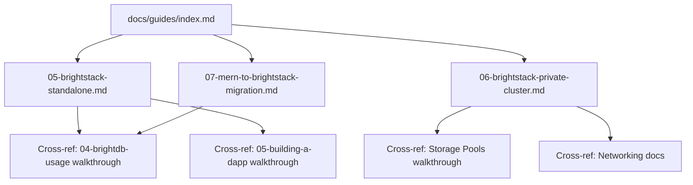

# Design Document: BrightStack Standalone Documentation

## Overview

This design describes the documentation architecture for enabling developers to use BrightDB and the BrightStack paradigm (BrightDB + Express + React + Node.js) without joining or participating in the BrightChain network. The documentation set consists of three primary guides placed in `docs/guides/` and integrated into the existing Jekyll-based documentation site.

The documentation targets two deployment models:
1. **Single-node standalone** — A developer runs BrightDB locally with a persistent block store, no network participation required.
2. **Private cluster** — Multiple BrightDB nodes replicate data among themselves using private pools and gossip, isolated from the public BrightChain network.

A third artifact, the MERN Migration Reference, provides a side-by-side mapping from MongoDB/Mongoose patterns to BrightDB equivalents, enabling developers to convert existing MERN applications with minimal friction.

### Design Rationale

The existing BrightDB documentation (walkthroughs 04 and 05) assumes developers have completed the Quickstart and Node Setup guides — meaning they've cloned the full monorepo, installed all dependencies, and potentially joined the network. This creates a significant barrier for developers who simply want a document database.

The standalone guides break this dependency by documenting how to use `@brightchain/db` as an npm package with no monorepo or network prerequisites. The guides are self-contained, reference only public npm packages, and produce working applications within 15 minutes.

## Architecture

### Documentation Site Integration



The three new guides are placed in `docs/guides/` with sequential numbering starting at `05` to follow the existing guides (01–04). Each guide uses Jekyll front matter with `parent: "Guides"` and appropriate `nav_order` values.

### Document Hierarchy

| Document | Path | nav_order | Audience |
|----------|------|-----------|----------|
| BrightStack Standalone Setup | `docs/guides/05-brightstack-standalone.md` | 20 | Web developers new to BrightDB |
| Private Cluster Setup | `docs/guides/06-brightstack-private-cluster.md` | 21 | DevOps / multi-server developers |
| MERN Migration Reference | `docs/guides/07-mern-to-brightstack-migration.md` | 22 | Developers migrating from MongoDB |

### Content Architecture

Each guide follows a consistent structure:

```
---
title: "..."
parent: "Guides"
nav_order: N
---
# Title

| Field | Value |
|-------|-------|
| Prerequisites | ... |
| Estimated Time | ... |
| Difficulty | ... |

## Introduction
## Prerequisites
## Steps (numbered sections)
## Production Considerations (where applicable)
## Troubleshooting
## Next Steps (cross-references)
```

## Components and Interfaces

### Component 1: Single-Node Standalone Guide (`05-brightstack-standalone.md`)

**Responsibility:** Walk a developer from `npm init` to a running BrightStack application with persistent storage, covering all core BrightDB features in standalone mode.

**Sections:**
1. Introduction — What BrightStack is, explicit "no network required" statement
2. Prerequisites — Node.js 20+, npm/yarn, no monorepo needed
3. Project Setup — `npm init`, install `@brightchain/db`, `express`, `cors`
4. Block Store Configuration
   - InMemoryDatabase for development
   - LocalDiskStore (persistent file-based) for production
   - PersistentHeadRegistry configuration
   - Storage directory structure documentation
5. Creating a BrightDB Instance — Connection code, collection creation
6. CRUD Operations — insertOne, findOne, updateOne, deleteOne, insertMany, find, updateMany, deleteMany with complete code examples
7. Schema Validation — CollectionSchema definition, field types, required fields, defaults, enums, patterns, nested objects, array items, Model usage, ValidationError handling
8. Indexing — Single-field, compound, unique, sparse, TTL indexes; query optimization guidance; rebuild behavior on restart
9. Transactions — DbSession manual control, withTransaction helper, read-committed isolation explanation
10. Aggregation Pipeline — All 14 stages documented with examples, multi-stage pipeline example, $lookup cross-collection join
11. Express Middleware — createDbRouter mounting, REST endpoint table, allowedCollections configuration
12. React Frontend — Minimal React app performing CRUD against the Express API
13. Change Streams — watch() usage for real-time updates
14. Production Deployment — Persistent storage, environment variables, process management, deployment checklist
15. Unavailable Features — Gossip, discovery, replication not available in standalone; pointer to cluster guide
16. Troubleshooting — Common issues and solutions
17. Next Steps — Cross-references to BrightDB Usage walkthrough, Building a dApp walkthrough, and cluster guide

**Key Design Decisions:**
- The guide uses `@brightchain/db` as an npm package, not a monorepo import
- InMemoryDatabase is the default for development; LocalDiskStore for production
- The guide explicitly states no BrightChain node or network is required
- Code examples are complete and copy-pasteable (not fragments)

### Component 2: Private Cluster Guide (`06-brightstack-private-cluster.md`)

**Responsibility:** Walk a developer through setting up a private multi-node BrightDB cluster with data replication restricted to cluster members.

**Sections:**
1. Introduction — What a private cluster provides, explicit "no public network" statement
2. Prerequisites — Multiple machines or containers, Node.js 20+, network connectivity between nodes
3. Cluster Architecture Overview — Diagram showing nodes, pools, gossip connections
4. Creating a Private BrightPool — Pool namespace creation, PooledStoreAdapter configuration
5. Configuring Gossip — Explicit peer lists (no public discovery), gossip protocol configuration
6. Reconciliation — Configuring reconciliation for partition recovery
7. Write Access Control — ACL configuration, writer lists, administrator lists
8. Adding a Node — ACL configuration, pool key distribution, initial sync
9. Removing a Node — ACL revocation, key rotation procedure
10. Pool-Shared Encryption — AES-256-GCM shared key configuration for data at rest
11. Security — Rejecting unauthorized connection attempts, cluster isolation verification
12. Production Deployment — Node redundancy, encryption configuration, reconciliation scheduling, health monitoring checklist
13. Troubleshooting
14. Next Steps — Cross-references to networking docs, storage pools walkthrough

**Key Design Decisions:**
- Gossip uses explicit peer lists, not public network discovery
- The cluster is completely isolated from the BrightChain network
- ACL enforcement is mandatory for cluster security
- Key rotation is documented as part of node removal

### Component 3: MERN Migration Reference (`07-mern-to-brightstack-migration.md`)

**Responsibility:** Provide a side-by-side mapping from MERN stack patterns to BrightStack equivalents.

**Sections:**
1. Introduction — BrightStack as a MERN replacement, key differences
2. Connection Comparison — MongoDB connection string vs BrightDB block store initialization
3. Method Mapping Table — MongoDB driver methods → BrightDB equivalents (connect, insertOne, findOne, find, updateOne, updateMany, deleteOne, deleteMany, aggregate, createIndex, watch)
4. Schema Comparison — Mongoose schema definitions vs BrightDB CollectionSchema
5. Route Handler Migration — Before/after Express route handler example
6. Feature Support Matrix — What's supported, what's not yet supported
7. Persistence Differences — MongoDB disk-based vs BrightDB InMemoryDatabase/LocalDiskStore
8. Migration Checklist — Step-by-step conversion process

**Key Design Decisions:**
- Side-by-side code comparisons use two-column format where possible
- The feature support matrix is honest about gaps (e.g., no replica sets, no sharding in standalone)
- The migration path is incremental — developers can migrate one collection at a time

### Component 4: Guides Index Update

The existing `docs/guides/index.md` must be updated to include the three new guides in its table, with descriptions that don't require prior BrightChain knowledge.

## Data Models

This feature produces documentation artifacts (Markdown files), not runtime data structures. The relevant "data models" are the document structures used in code examples within the guides:

### Example Document Schema (used in guide code examples)

```typescript
// User document used throughout the standalone guide
interface User {
  _id?: string;
  name: string;
  email: string;
  role: 'admin' | 'developer' | 'designer';
  age: number;
  department?: string;
  createdAt?: string;
}

// Order document used in aggregation examples
interface Order {
  _id?: string;
  userId: string;
  items: Array<{ product: string; qty: number; price: number }>;
  status: 'placed' | 'completed' | 'cancelled';
  createdAt: string;
}
```

### BrightDB Configuration Models (documented in guides)

```typescript
// Standalone single-node configuration
interface StandaloneConfig {
  blockStore: 'InMemoryDatabase' | 'LocalDiskStore';
  headRegistry: 'InMemoryHeadRegistry' | 'PersistentHeadRegistry';
  storagePath?: string; // For LocalDiskStore
  registryPath?: string; // For PersistentHeadRegistry
}

// Private cluster node configuration
interface ClusterNodeConfig {
  blockStore: 'LocalDiskStore';
  headRegistry: 'PersistentHeadRegistry';
  poolId: string;
  gossipPeers: string[]; // Explicit peer addresses
  acl: {
    writers: string[]; // Public keys
    admins: string[]; // Public keys
  };
  encryption: {
    mode: 'PoolShared';
    algorithm: 'AES-256-GCM';
  };
}
```

## Error Handling

Since this feature produces documentation, error handling refers to how errors are documented within the guides:

### Documented Error Scenarios

| Error | Guide Section | Documentation Approach |
|-------|--------------|----------------------|
| `ValidationError` (code 121) | Schema Validation | Show error structure, field-level details, how to handle |
| `DuplicateKeyError` (code 11000) | Indexing | Show unique constraint violation and resolution |
| `TransactionError` (code 251) | Transactions | Show abort/commit lifecycle, error recovery |
| `DocumentNotFoundError` (code 404) | CRUD Operations | Show findOne returning null, defensive patterns |
| Connection/initialization failures | Block Store Config | Show directory creation, permission issues |
| ACL rejection | Cluster Guide | Show unauthorized node connection attempt |

### Error Documentation Pattern

Each error scenario in the guides follows this pattern:
1. Show the code that triggers the error
2. Show the error object structure
3. Show the recommended handling pattern
4. Link to the Troubleshooting section for edge cases

## Testing Strategy

### Documentation Testing Approach

Since this feature produces documentation (not executable code), property-based testing is **not applicable**. The testing strategy focuses on:

1. **Code Example Validation** — All TypeScript code examples in the guides must compile and execute correctly against the `@brightchain/db` package API.

2. **Link Validation** — All cross-references to existing documentation must resolve to valid pages.

3. **Content Completeness Review** — Each acceptance criterion maps to a specific section in the documentation. A manual review checklist verifies coverage.

4. **Jekyll Build Verification** — The documentation site must build without errors after adding the new guides, and navigation must render correctly.

### Why PBT Does Not Apply

Property-based testing is not appropriate for this feature because:
- The deliverables are Markdown documentation files, not executable code
- There are no pure functions, parsers, or algorithms to test
- The acceptance criteria verify content presence and structure, not computational behavior
- Validation is best done through manual review, link checking, and code example compilation

### Validation Checklist

| Validation | Method | Automated? |
|-----------|--------|-----------|
| Code examples compile | TypeScript compilation of extracted snippets | Yes |
| Code examples execute | Run extracted snippets against @brightchain/db | Yes |
| Internal links resolve | Jekyll build + link checker | Yes |
| Jekyll builds without errors | `bundle exec jekyll build` | Yes |
| Navigation renders correctly | Visual inspection of built site | No |
| Content covers all acceptance criteria | Manual review against requirements | No |
| Guides are self-contained (no monorepo dependency) | Manual review | No |
| 15-minute completion time is realistic | Timed walkthrough | No |
