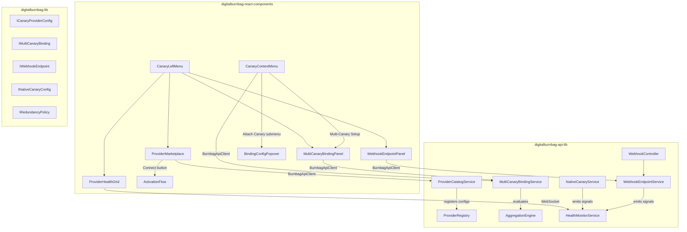
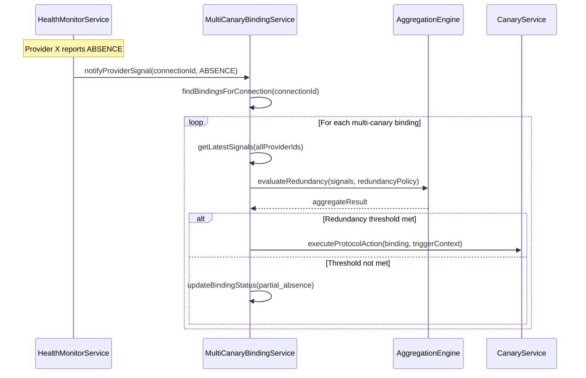
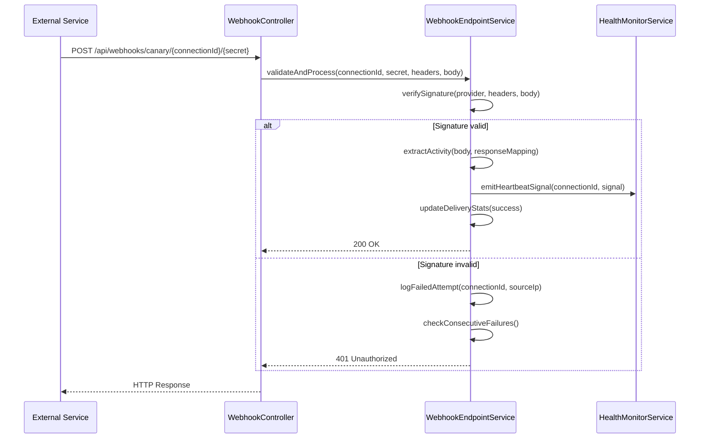
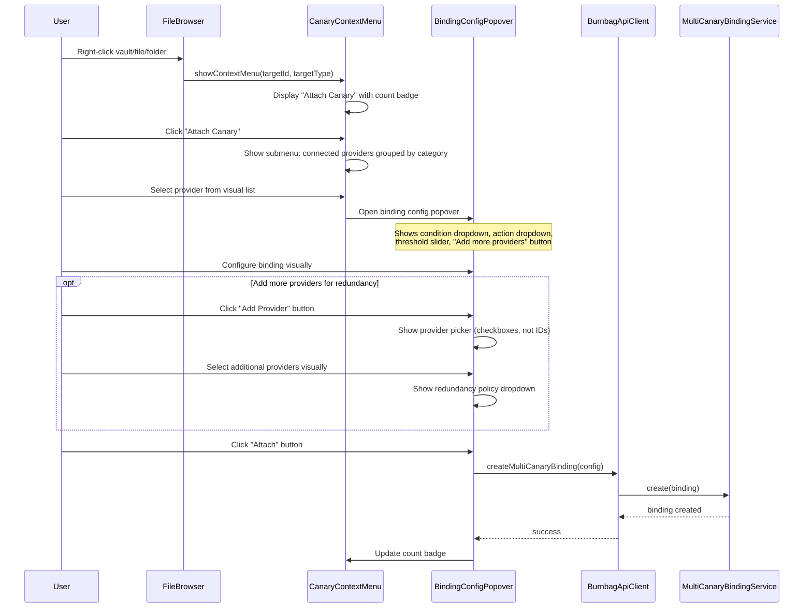

# Design Document: Canary Provider Expansion

## Overview

The Canary Provider Expansion scales the DigitalBurnbag canary provider ecosystem from a handful of built-in providers into a comprehensive catalog of 50+ real-world API integrations spanning health/fitness, communication, social media, development, smart home, financial, entertainment, and platform-native categories. It introduces four major new subsystems on top of the existing canary-provider-system:

1. **Provider Catalog Service** — manages the expanded library of `ICanaryProviderConfig` definitions, organized by category with marketplace-style browsing
2. **Multi-Canary Binding Service** — enables attaching 2–20 providers to a single vault/file/folder with configurable redundancy policies (all_must_fail, majority_must_fail, any_fails, weighted_consensus)
3. **Webhook Endpoint Service** — generates unique HTTPS endpoints for push-based providers, with signature verification, rate limiting, and secret rotation
4. **Native Canary Service** — monitors BrightChain platform activity (logins, duress codes, file access, API usage, vault interactions) without external network dependencies

### Key Design Decisions

| Decision | Rationale |
|---|---|
| All binding creation via visual UI (context menus, buttons, drag-and-drop) | User feedback: manual ID entry is unacceptable. Every binding operation uses provider selection dropdowns, right-click menus, and visual pickers — never raw identifier input |
| Provider configs remain JSON-driven (`ICanaryProviderConfig`) | Consistent with existing `ConfigDrivenProviderAdapter` pattern; new providers are data, not code |
| Multi-canary bindings as separate collection from single bindings | Keeps existing `ICanaryBindingBase` unchanged; multi-canary is a higher-level orchestration layer that references multiple single bindings |
| Webhook secrets use crypto.randomBytes(32) hex-encoded | 256-bit entropy; hex encoding for URL-safe transport and easy copy-paste |
| Native canaries use internal event bus, not HTTP | No network dependency; immediate signal propagation for duress codes |
| `ProviderCategory` enum extended with LOCATION and ENTERTAINMENT | Requirements specify these as distinct categories; existing enum already has most others |
| Redundancy policy evaluation happens before protocol action execution | Safety-critical: prevents premature vault destruction from single-provider false positives |

### Relationship to Existing canary-provider-system

This expansion builds directly on the existing system's components:
- **ProviderRegistry** — receives 50+ new `ICanaryProviderConfig` entries via `BUILTIN_PROVIDER_CONFIGS`
- **HealthMonitorService** — unchanged; monitors all providers including new ones
- **AggregationEngine** — extended with multi-canary binding evaluation
- **CredentialService** — unchanged; encrypts credentials for all new providers
- **FailurePolicyManager** — unchanged; applies to all providers
- **BindingAssistant** — enhanced with context menu integration and multi-canary setup

## Architecture



### Data Flow: Multi-Canary Binding Evaluation



### Data Flow: Webhook Endpoint Receive



### Data Flow: Context Menu Canary Attachment (Visual UX)



## Components and Interfaces

### 1. New Shared Interfaces (digitalburnbag-lib)

#### IMultiCanaryBindingBase

```typescript
export interface IMultiCanaryBindingBase<TID extends PlatformID = string> {
  id: TID;
  /** User who created this binding */
  userId: TID;
  /** Display name for this binding group */
  name: string;
  /** Target vault container IDs */
  vaultContainerIds: TID[];
  /** Target file IDs */
  fileIds: TID[];
  /** Target folder IDs */
  folderIds: TID[];
  /** Provider connection IDs in this binding (2-20) */
  providerConnectionIds: TID[];
  /** Redundancy policy */
  redundancyPolicy: RedundancyPolicy;
  /** Per-provider weights (for weighted_consensus policy) */
  providerWeights?: Record<string, number>;
  /** Trigger threshold percentage for weighted_consensus (default: 75) */
  weightedThresholdPercent?: number;
  /** Protocol action to execute when triggered */
  protocolAction: ProtocolAction;
  /** Canary condition type */
  canaryCondition: CanaryCondition;
  /** Absence threshold duration in ms */
  absenceThresholdMs?: number;
  /** Current aggregate status */
  aggregateStatus: MultiCanaryAggregateStatus;
  /** Per-provider latest signal */
  providerSignals: Record<string, HeartbeatSignalType>;
  /** Whether this binding is active */
  isActive: boolean;
  createdAt: Date | string;
  updatedAt: Date | string;
}

export type RedundancyPolicy =
  | 'all_must_fail'
  | 'majority_must_fail'
  | 'any_fails'
  | 'weighted_consensus';

export type MultiCanaryAggregateStatus =
  | 'all_present'
  | 'partial_absence'
  | 'threshold_met'
  | 'triggered'
  | 'check_failed';
```

#### IWebhookEndpointBase

```typescript
export interface IWebhookEndpointBase<TID extends PlatformID = string> {
  id: TID;
  /** Provider connection this endpoint serves */
  connectionId: TID;
  /** User who owns this endpoint */
  userId: TID;
  /** Provider ID for signature verification method lookup */
  providerId: string;
  /** The generated webhook URL path segment (connectionId/secret) */
  urlPath: string;
  /** Current active secret (hex-encoded, 32 bytes) */
  secret: string;
  /** Previous secret during rotation grace period */
  previousSecret?: string;
  /** When the previous secret expires */
  previousSecretExpiresAt?: Date | string;
  /** Signature verification method */
  signatureMethod: WebhookSignatureMethod;
  /** Custom signature header name (if not standard) */
  signatureHeader?: string;
  /** IP allowlist (CIDR ranges) */
  ipAllowlist?: string[];
  /** Whether this endpoint is currently active */
  isActive: boolean;
  /** Delivery statistics */
  stats: IWebhookDeliveryStats;
  /** Consecutive failed signature validations */
  consecutiveSignatureFailures: number;
  /** Whether endpoint is temporarily disabled due to failures */
  isDisabledByFailures: boolean;
  /** Rate limit: max requests per minute */
  rateLimitPerMinute: number;
  /** Timeout period: ms without webhook before CHECK_FAILED */
  timeoutMs: number;
  /** Last received timestamp */
  lastReceivedAt?: Date | string;
  createdAt: Date | string;
  updatedAt: Date | string;
}

export type WebhookSignatureMethod =
  | 'hmac_sha256'
  | 'hmac_sha1'
  | 'ed25519'
  | 'custom_header';

export interface IWebhookDeliveryStats {
  totalReceived: number;
  successfullyProcessed: number;
  failedValidation: number;
  lastReceivedAt?: Date | string;
  lastSuccessAt?: Date | string;
}
```

#### INativeCanaryConfigBase

```typescript
export type NativeCanaryType =
  | 'login_activity'
  | 'duress_code'
  | 'file_access'
  | 'api_usage'
  | 'vault_interaction';

export interface INativeCanaryConfigBase<TID extends PlatformID = string> {
  id: TID;
  userId: TID;
  /** Which native canary type */
  type: NativeCanaryType;
  /** Whether this native canary is enabled */
  isEnabled: boolean;
  /** For login_activity: minimum logins per period */
  loginThreshold?: number;
  /** For login_activity: period in ms */
  loginPeriodMs?: number;
  /** For duress_code: the configured duress codes (encrypted at rest) */
  encryptedDuressCodes?: string[];
  /** For file_access: minimum file operations per period */
  fileAccessThreshold?: number;
  /** For file_access: period in ms */
  fileAccessPeriodMs?: number;
  /** For api_usage: minimum API calls per period */
  apiUsageThreshold?: number;
  /** For api_usage: period in ms */
  apiUsagePeriodMs?: number;
  /** For vault_interaction: minimum vault operations per period */
  vaultInteractionThreshold?: number;
  /** For vault_interaction: period in ms */
  vaultInteractionPeriodMs?: number;
  /** Provider connection ID (for integration with health monitor) */
  connectionId?: TID;
  createdAt: Date | string;
  updatedAt: Date | string;
}
```

#### Extended ProviderCategory Enum

Two new values added to the existing `ProviderCategory` enum:

```typescript
export enum ProviderCategory {
  // ... existing values ...
  /** Location and mapping services */
  LOCATION = 'location',
  /** Entertainment and streaming */
  ENTERTAINMENT = 'entertainment',
}
```

### 2. New Backend Services (digitalburnbag-api-lib)

#### ProviderCatalogService

Manages the expanded provider catalog, including search, filtering, and category organization.

```typescript
export interface IProviderCatalogService<TID extends PlatformID = string> {
  /** Get all providers in the catalog, optionally filtered */
  getProviders(filters?: IProviderCatalogFilters): ICanaryProviderConfig<TID>[];
  /** Search providers by name/description */
  searchProviders(query: string): ICanaryProviderConfig<TID>[];
  /** Get providers grouped by category */
  getProvidersByCategory(): Map<ProviderCategory, ICanaryProviderConfig<TID>[]>;
  /** Get a single provider config by ID */
  getProvider(providerId: string): ICanaryProviderConfig<TID> | undefined;
  /** Get provider count per category */
  getCategoryCounts(): Record<ProviderCategory, number>;
  /** Get recommended providers (highest reliability) */
  getRecommendedProviders(): ICanaryProviderConfig<TID>[];
}

export interface IProviderCatalogFilters {
  category?: ProviderCategory;
  authType?: IProviderAuthConfig['type'];
  supportsWebhooks?: boolean;
  searchQuery?: string;
}
```

#### MultiCanaryBindingService

Manages multi-canary redundancy bindings and evaluates redundancy policies.

```typescript
export interface IMultiCanaryBindingService<TID extends PlatformID = string> {
  /** Create a multi-canary binding (validates 2-20 providers, all connected) */
  createBinding(params: ICreateMultiCanaryBindingParams<TID>): Promise<IMultiCanaryBindingBase<TID>>;
  /** Update a binding (add/remove providers, change policy) */
  updateBinding(bindingId: TID, updates: Partial<IMultiCanaryBindingUpdate<TID>>): Promise<IMultiCanaryBindingBase<TID>>;
  /** Delete a binding */
  deleteBinding(bindingId: TID, userId: TID): Promise<void>;
  /** Get all bindings for a user */
  getBindingsForUser(userId: TID): Promise<IMultiCanaryBindingBase<TID>[]>;
  /** Get bindings for a specific target (vault/file/folder) */
  getBindingsForTarget(targetId: TID, targetType: 'vault' | 'file' | 'folder'): Promise<IMultiCanaryBindingBase<TID>[]>;
  /** Evaluate redundancy policy for a binding given current signals */
  evaluateRedundancy(bindingId: TID): Promise<IRedundancyEvaluationResult>;
  /** Handle provider signal update (called by HealthMonitor) */
  onProviderSignal(connectionId: TID, signal: HeartbeatSignalType): Promise<void>;
  /** Remove a provider from all bindings (on disconnect) */
  removeProviderFromBindings(connectionId: TID): Promise<IBindingImpactReport>;
}

export interface IRedundancyEvaluationResult {
  bindingId: string;
  shouldTrigger: boolean;
  policy: RedundancyPolicy;
  providerStatuses: Record<string, HeartbeatSignalType>;
  absenceCount: number;
  totalActive: number;
  weightedScore?: number;
}

export interface IBindingImpactReport {
  affectedBindings: string[];
  bindingsReducedBelowMinimum: string[];
  bindingsStillValid: string[];
}
```

#### WebhookEndpointService

Manages webhook endpoint lifecycle, signature verification, and delivery tracking.

```typescript
export interface IWebhookEndpointService<TID extends PlatformID = string> {
  /** Create a webhook endpoint for a provider connection */
  createEndpoint(connectionId: TID, providerId: string, userId: TID): Promise<IWebhookEndpointBase<TID>>;
  /** Get the full webhook URL for an endpoint */
  getWebhookUrl(endpointId: TID): string;
  /** Validate and process an inbound webhook payload */
  processWebhook(
    connectionId: TID,
    secret: string,
    headers: Record<string, string>,
    body: Buffer,
    sourceIp: string
  ): Promise<IWebhookProcessResult>;
  /** Rotate the webhook secret (with grace period) */
  rotateSecret(endpointId: TID, gracePeriodMs?: number): Promise<{ newSecret: string }>;
  /** Get delivery stats for an endpoint */
  getDeliveryStats(endpointId: TID): Promise<IWebhookDeliveryStats>;
  /** Update IP allowlist */
  updateIpAllowlist(endpointId: TID, cidrs: string[]): Promise<void>;
  /** Check for timed-out endpoints and emit CHECK_FAILED */
  checkTimeouts(): Promise<void>;
  /** Disable endpoint after consecutive signature failures */
  disableEndpoint(endpointId: TID, reason: string): Promise<void>;
  /** Re-enable a disabled endpoint */
  enableEndpoint(endpointId: TID): Promise<void>;
  /** Send test webhook payload */
  sendTestWebhook(endpointId: TID): Promise<IWebhookProcessResult>;
}

export interface IWebhookProcessResult {
  success: boolean;
  signal?: HeartbeatSignalType;
  error?: string;
  processingTimeMs: number;
}
```

#### NativeCanaryService

Monitors BrightChain platform activity and emits heartbeat signals without external network access.

```typescript
export interface INativeCanaryService<TID extends PlatformID = string> {
  /** Configure a native canary for a user */
  configure(params: IConfigureNativeCanaryParams<TID>): Promise<INativeCanaryConfigBase<TID>>;
  /** Update native canary configuration */
  updateConfig(configId: TID, updates: Partial<INativeCanaryConfigBase<TID>>): Promise<INativeCanaryConfigBase<TID>>;
  /** Get all native canary configs for a user */
  getConfigs(userId: TID): Promise<INativeCanaryConfigBase<TID>[]>;
  /** Handle a platform event (login, file access, etc.) */
  onPlatformEvent(event: IPlatformEvent<TID>): Promise<void>;
  /** Handle duress code authentication (IMMEDIATE signal) */
  onDuressCodeLogin(userId: TID, duressCode: string): Promise<void>;
  /** Evaluate native canary status (called on schedule) */
  evaluateStatus(configId: TID): Promise<HeartbeatSignalType>;
  /** Set duress codes for a user (encrypted at rest) */
  setDuressCodes(userId: TID, codes: string[]): Promise<void>;
  /** Validate that a code is a duress code (during auth) */
  isDuressCode(userId: TID, code: string): Promise<boolean>;
}

export interface IPlatformEvent<TID extends PlatformID = string> {
  userId: TID;
  type: 'login' | 'file_access' | 'api_call' | 'vault_interaction';
  timestamp: Date;
  metadata?: Record<string, unknown>;
}
```

### 3. Frontend Components (digitalburnbag-react-components)

#### ProviderMarketplace

Browsable card-based UI for discovering and connecting providers.

- **Category sidebar/tabs** with provider counts per category
- **Search bar** with real-time filtering across names and descriptions
- **Provider cards** showing: icon, name, category badge, description, auth methods, "Connect" button
- **Connected badge** (green) on already-connected providers
- **Recommended badge** on high-reliability providers
- **Collapsible category sections** with provider counts
- **Connect button** launches `ActivationFlow` wizard (auth → test → config → optional multi-canary)

#### ProviderHealthGrid

Real-time visual grid of all connected providers.

- **Responsive grid layout** of `ProviderConnectionCard` components
- **Each card shows**: icon, name, status color (green/amber/red/purple), time since last heartbeat, mini sparkline of recent history
- **WebSocket-driven updates** — no polling, instant status transitions
- **Sort controls**: by name, last activity, status severity, category
- **View toggle**: compact (icon + color dot) vs expanded (full card)
- **Status transition animation**: brief pulse on CHECK_FAILED or ABSENCE transitions
- **Aggregate health bar** at top: percentage breakdown by status

#### CanaryContextMenu

Right-click integration for visual canary attachment.

- **"Attach Canary" menu item** with canary icon and count badge showing existing bindings
- **Provider submenu**: connected providers grouped by category, each showing status indicator
- **BindingConfigPopover**: compact panel with:
  - Condition dropdown (ABSENCE, DURESS) — no typing
  - Protocol action dropdown — no typing
  - Threshold slider — visual, not numeric input
  - "Add more providers" button → opens provider checkbox picker
  - Redundancy policy dropdown (appears when 2+ providers selected)
  - "Attach" button to confirm
- **"Multi-Canary Setup"** option → opens full `MultiCanaryBindingPanel`
- **"Manage Canaries"** option (when bindings exist) → shows existing bindings with edit/remove buttons
- **"Connect a Provider First"** message with marketplace link (when no providers connected)

**Critical UX constraint**: NO manual ID entry anywhere. All targets are selected by clicking in the file browser. All providers are selected from visual lists. All configuration uses dropdowns, sliders, and buttons.

#### CanaryLeftMenu

Left navigation section for canary provider management.

- **"My Providers"** — compact list with status indicators, warning badge for attention-needed count
- **"Provider Marketplace"** — link to full marketplace
- **"Multi-Canary Bindings"** — list with target names, provider count, aggregate status
- **"Webhook Endpoints"** — list with provider name, last received, success rate
- **Overall health indicator** — healthy/degraded/critical based on aggregate

#### MultiCanaryBindingPanel

Full configuration panel for multi-canary redundancy.

- **Provider picker** — checkboxes next to connected providers (visual, not ID-based)
- **Redundancy policy selector** — dropdown with descriptions of each policy
- **Weight sliders** (for weighted_consensus) — per-provider visual sliders (0.1–10.0)
- **Threshold percentage slider** (for weighted_consensus) — default 75%
- **Target selector** — file/folder browser tree with checkboxes (visual selection)
- **Status display** — per-provider signal indicators and aggregate result

#### WebhookEndpointPanel

Management UI for webhook endpoints.

- **Endpoint list** with provider name, URL (copy button), last received, success rate
- **Secret display** with show/hide toggle and copy button
- **"Rotate Secret"** button with grace period configuration
- **"Test Webhook"** button with result display
- **IP allowlist editor** — add/remove CIDR ranges
- **Delivery stats** — total, successful, failed, chart over time

### 4. New API Endpoints

| Method | Path | Description |
|--------|------|-------------|
| GET | `/api/providers/catalog` | Get full provider catalog with optional filters |
| GET | `/api/providers/catalog/search?q={query}` | Search providers |
| GET | `/api/providers/catalog/categories` | Get providers grouped by category |
| GET | `/api/providers/catalog/recommended` | Get recommended providers |
| POST | `/api/multi-canary-bindings` | Create multi-canary binding |
| GET | `/api/multi-canary-bindings` | List user's multi-canary bindings |
| GET | `/api/multi-canary-bindings/:id` | Get binding details |
| PUT | `/api/multi-canary-bindings/:id` | Update binding |
| DELETE | `/api/multi-canary-bindings/:id` | Delete binding |
| GET | `/api/multi-canary-bindings/target/:targetId` | Get bindings for a target |
| POST | `/api/webhooks/canary/:connectionId/:secret` | Receive webhook payload |
| POST | `/api/webhook-endpoints` | Create webhook endpoint |
| GET | `/api/webhook-endpoints` | List user's webhook endpoints |
| PUT | `/api/webhook-endpoints/:id/rotate-secret` | Rotate secret |
| PUT | `/api/webhook-endpoints/:id/ip-allowlist` | Update IP allowlist |
| POST | `/api/webhook-endpoints/:id/test` | Send test webhook |
| GET | `/api/webhook-endpoints/:id/stats` | Get delivery stats |
| POST | `/api/native-canaries` | Configure native canary |
| GET | `/api/native-canaries` | List user's native canary configs |
| PUT | `/api/native-canaries/:id` | Update native canary config |
| PUT | `/api/native-canaries/duress-codes` | Set duress codes |


## Data Models

All data models use BrightDB collections via `@brightchain/db`, following the existing repository pattern in `digitalburnbag-api-lib/src/lib/collections/`. Each collection uses the `Collection` type from `@brightchain/db`, with `IdSerializer<TID>` for round-tripping TID values through BrightDB's JSON-based storage.

### Multi-Canary Bindings (BrightDB Collection: `multi_canary_bindings`)

```typescript
// BrightDB Collection: multi_canary_bindings
// Repository: BrightDBMultiCanaryBindingRepository<TID>
{
  _id: string,                           // TID serialized
  userId: string,                        // TID serialized
  name: string,                          // User-provided display name
  // Targets (visual selection — never manually entered IDs)
  vaultContainerIds: string[],           // TID[] serialized
  fileIds: string[],                     // TID[] serialized
  folderIds: string[],                   // TID[] serialized
  // Provider connections (2-20, selected via visual picker)
  providerConnectionIds: string[],       // TID[] serialized
  // Redundancy configuration
  redundancyPolicy: string,              // RedundancyPolicy value
  providerWeights: Record<string, number>, // connectionId → weight (0.1-10.0)
  weightedThresholdPercent: number,      // Default: 75
  // Protocol configuration
  protocolAction: string,                // ProtocolAction value
  canaryCondition: string,               // CanaryCondition value
  absenceThresholdMs: number,
  // Status tracking
  aggregateStatus: string,               // MultiCanaryAggregateStatus value
  providerSignals: Record<string, string>, // connectionId → HeartbeatSignalType
  isActive: boolean,
  lastEvaluatedAt: Date,
  createdAt: Date,
  updatedAt: Date
}
```

### Webhook Endpoints (BrightDB Collection: `webhook_endpoints`)

```typescript
// BrightDB Collection: webhook_endpoints
// Repository: BrightDBWebhookEndpointRepository<TID>
{
  _id: string,                           // TID serialized
  connectionId: string,                  // TID serialized
  userId: string,                        // TID serialized
  providerId: string,                    // Provider config ID
  urlPath: string,                       // "{connectionId}/{secret}" path segment
  // Secrets (hex-encoded, 32 bytes each)
  secret: string,                        // Current active secret
  previousSecret: string,               // Previous secret during rotation
  previousSecretExpiresAt: Date,        // Grace period expiry
  // Signature verification
  signatureMethod: string,               // WebhookSignatureMethod value
  signatureHeader: string,               // e.g. "X-Hub-Signature-256"
  // Security
  ipAllowlist: string[],                 // CIDR ranges
  rateLimitPerMinute: number,            // Default: 100
  consecutiveSignatureFailures: number,
  isDisabledByFailures: boolean,
  // Timeout
  timeoutMs: number,                     // ms without webhook → CHECK_FAILED
  lastReceivedAt: Date,
  // Delivery stats
  stats: {
    totalReceived: number,
    successfullyProcessed: number,
    failedValidation: number,
    lastReceivedAt: Date,
    lastSuccessAt: Date
  },
  isActive: boolean,
  createdAt: Date,
  updatedAt: Date
}
```

### Native Canary Configs (BrightDB Collection: `native_canary_configs`)

```typescript
// BrightDB Collection: native_canary_configs
// Repository: BrightDBNativeCanaryConfigRepository<TID>
{
  _id: string,                           // TID serialized
  userId: string,                        // TID serialized
  type: string,                          // NativeCanaryType value
  isEnabled: boolean,
  // Type-specific thresholds
  loginThreshold: number,                // For login_activity
  loginPeriodMs: number,
  fileAccessThreshold: number,           // For file_access
  fileAccessPeriodMs: number,
  apiUsageThreshold: number,             // For api_usage
  apiUsagePeriodMs: number,
  vaultInteractionThreshold: number,     // For vault_interaction
  vaultInteractionPeriodMs: number,
  // Duress codes (encrypted at rest via CredentialService)
  encryptedDuressCodes: string[],        // For duress_code type
  // Integration
  connectionId: string,                  // TID serialized — virtual provider connection
  createdAt: Date,
  updatedAt: Date
}
```

### Provider Catalog Entries (Extended BUILTIN_PROVIDER_CONFIGS)

The 50+ provider configs are defined as `ICanaryProviderConfig<string>` constants in `digitalburnbag-lib/src/lib/providers/builtin-provider-configs.ts`. Below are representative examples by category showing the JSON structure pattern:

#### Health & Fitness — Oura Ring (representative)

```typescript
export const OURA_PROVIDER_CONFIG: ICanaryProviderConfig<string> = {
  id: 'oura',
  name: 'Oura Ring',
  description: 'Monitor sleep, readiness, and activity from Oura Ring',
  category: ProviderCategory.HEALTH_FITNESS,
  icon: 'oura',
  baseUrl: 'https://api.ouraring.com',
  auth: {
    type: 'oauth2',
    oauth2: {
      authorizationUrl: 'https://cloud.ouraring.com/oauth/authorize',
      tokenUrl: 'https://api.ouraring.com/oauth/token',
      clientId: '',
      clientSecret: '',
      scopes: ['daily', 'personal'],
      redirectUri: '',
    },
  },
  rateLimit: { maxRequests: 5000, windowMs: 300000, minDelayMs: 200 },
  endpoints: {
    activity: {
      path: '/v2/usercollection/daily_activity',
      method: 'GET',
      queryParams: { start_date: '{since_date}', end_date: '{until_date}' },
      responseMapping: {
        eventsPath: '$.data',
        timestampPath: 'day',
        timestampFormat: 'iso8601',
        activityTypePath: 'class_5_min',
        eventIdPath: 'id',
      },
    },
    healthCheck: { path: '/v2/usercollection/personal_info', method: 'GET', expectedStatus: 200 },
    userProfile: { path: '/v2/usercollection/personal_info', method: 'GET', userIdPath: 'id', usernamePath: 'email' },
  },
  defaultLookbackMs: 2 * 24 * 60 * 60 * 1000,
  minCheckIntervalMs: 4 * 60 * 60 * 1000,
  supportsWebhooks: true,
  enabledByDefault: true,
  retry: { maxAttempts: 3, backoffMs: 2000, backoffMultiplier: 2 },
};
```

#### Communication — Telegram (representative)

```typescript
export const TELEGRAM_PROVIDER_CONFIG: ICanaryProviderConfig<string> = {
  id: 'telegram',
  name: 'Telegram',
  description: 'Monitor Telegram message activity via Bot API',
  category: ProviderCategory.COMMUNICATION,
  icon: 'telegram',
  baseUrl: 'https://api.telegram.org/bot{apiKey}',
  auth: {
    type: 'api_key',
    apiKey: { headerName: '', queryParamName: '', placement: 'url_path' },
  },
  rateLimit: { maxRequests: 30, windowMs: 1000, minDelayMs: 34 },
  endpoints: {
    activity: {
      path: '/getUpdates',
      method: 'GET',
      queryParams: { offset: '-10', limit: '10' },
      responseMapping: {
        eventsPath: '$.result',
        timestampPath: 'message.date',
        timestampFormat: 'unix',
        activityTypePath: 'message.text',
        eventIdPath: 'update_id',
      },
    },
    healthCheck: { path: '/getMe', method: 'GET', expectedStatus: 200 },
  },
  defaultLookbackMs: 24 * 60 * 60 * 1000,
  minCheckIntervalMs: 5 * 60 * 1000,
  supportsWebhooks: true,
  enabledByDefault: true,
  retry: { maxAttempts: 3, backoffMs: 1000, backoffMultiplier: 2 },
};
```

#### Smart Home — Home Assistant (representative)

```typescript
export const HOME_ASSISTANT_PROVIDER_CONFIG: ICanaryProviderConfig<string> = {
  id: 'home_assistant',
  name: 'Home Assistant',
  description: 'Monitor smart home entity state changes and presence detection',
  category: ProviderCategory.IOT_SMART_HOME,
  icon: 'home-assistant',
  baseUrl: '{custom_url}',
  auth: {
    type: 'api_key',
    apiKey: { headerName: 'Authorization', queryParamName: '', placement: 'header' },
  },
  rateLimit: { maxRequests: 100, windowMs: 60000, minDelayMs: 500 },
  endpoints: {
    activity: {
      path: '/api/history/period/{since_iso}',
      method: 'GET',
      queryParams: { filter_entity_id: 'binary_sensor.motion', minimal_response: 'true' },
      responseMapping: {
        eventsPath: '$[0]',
        timestampPath: 'last_changed',
        timestampFormat: 'iso8601',
        activityTypePath: 'state',
        eventIdPath: 'entity_id',
      },
    },
    healthCheck: { path: '/api/', method: 'GET', expectedStatus: 200 },
  },
  defaultLookbackMs: 12 * 60 * 60 * 1000,
  minCheckIntervalMs: 5 * 60 * 1000,
  supportsWebhooks: true,
  enabledByDefault: true,
  customHeaders: { 'Content-Type': 'application/json' },
  retry: { maxAttempts: 3, backoffMs: 2000, backoffMultiplier: 2 },
};
```

#### Financial — Plaid (representative)

```typescript
export const PLAID_PROVIDER_CONFIG: ICanaryProviderConfig<string> = {
  id: 'plaid',
  name: 'Plaid',
  description: 'Monitor bank transaction activity across linked accounts',
  category: ProviderCategory.FINANCIAL,
  icon: 'plaid',
  baseUrl: 'https://production.plaid.com',
  auth: {
    type: 'api_key',
    apiKey: { headerName: 'PLAID-CLIENT-ID', queryParamName: '', placement: 'header' },
  },
  rateLimit: { maxRequests: 100, windowMs: 60000, minDelayMs: 600 },
  endpoints: {
    activity: {
      path: '/transactions/get',
      method: 'POST',
      bodyTemplate: '{"client_id":"{clientId}","secret":"{apiKey}","access_token":"{accessToken}","start_date":"{since_date}","end_date":"{until_date}"}',
      responseMapping: {
        eventsPath: '$.transactions',
        timestampPath: 'date',
        timestampFormat: 'iso8601',
        activityTypePath: 'category[0]',
        numericValuePath: 'amount',
        eventIdPath: 'transaction_id',
      },
    },
    healthCheck: { path: '/institutions/get', method: 'POST', expectedStatus: 200 },
  },
  defaultLookbackMs: 7 * 24 * 60 * 60 * 1000,
  minCheckIntervalMs: 6 * 60 * 60 * 1000,
  supportsWebhooks: true,
  enabledByDefault: true,
  retry: { maxAttempts: 3, backoffMs: 3000, backoffMultiplier: 2 },
};
```

#### Entertainment — Spotify (representative)

```typescript
export const SPOTIFY_PROVIDER_CONFIG: ICanaryProviderConfig<string> = {
  id: 'spotify',
  name: 'Spotify',
  description: 'Monitor recently played tracks and listening activity',
  category: ProviderCategory.ENTERTAINMENT,
  icon: 'spotify',
  baseUrl: 'https://api.spotify.com/v1',
  auth: {
    type: 'oauth2',
    oauth2: {
      authorizationUrl: 'https://accounts.spotify.com/authorize',
      tokenUrl: 'https://accounts.spotify.com/api/token',
      clientId: '',
      clientSecret: '',
      scopes: ['user-read-recently-played', 'user-read-currently-playing'],
      redirectUri: '',
    },
  },
  rateLimit: { maxRequests: 180, windowMs: 30000, minDelayMs: 167 },
  endpoints: {
    activity: {
      path: '/me/player/recently-played',
      method: 'GET',
      queryParams: { limit: '50', after: '{since_unix_ms}' },
      responseMapping: {
        eventsPath: '$.items',
        timestampPath: 'played_at',
        timestampFormat: 'iso8601',
        activityTypePath: 'track.name',
        eventIdPath: 'played_at',
      },
    },
    healthCheck: { path: '/me', method: 'GET', expectedStatus: 200 },
    userProfile: { path: '/me', method: 'GET', userIdPath: 'id', usernamePath: 'display_name' },
  },
  defaultLookbackMs: 24 * 60 * 60 * 1000,
  minCheckIntervalMs: 30 * 60 * 1000,
  supportsWebhooks: false,
  enabledByDefault: true,
  retry: { maxAttempts: 3, backoffMs: 1000, backoffMultiplier: 2 },
};
```

#### Location — Google Maps Timeline (representative)

```typescript
export const GOOGLE_MAPS_TIMELINE_PROVIDER_CONFIG: ICanaryProviderConfig<string> = {
  id: 'google_maps_timeline',
  name: 'Google Maps Timeline',
  description: 'Monitor location history and place visits',
  category: ProviderCategory.LOCATION,
  icon: 'google-maps',
  baseUrl: 'https://www.googleapis.com',
  auth: {
    type: 'oauth2',
    oauth2: {
      authorizationUrl: 'https://accounts.google.com/o/oauth2/v2/auth',
      tokenUrl: 'https://oauth2.googleapis.com/token',
      clientId: '',
      clientSecret: '',
      scopes: ['https://www.googleapis.com/auth/location.read'],
      redirectUri: '',
    },
  },
  rateLimit: { maxRequests: 100, windowMs: 60000, minDelayMs: 600 },
  endpoints: {
    activity: {
      path: '/location/v1/currentLocation',
      method: 'GET',
      responseMapping: {
        eventsPath: '$.locations',
        timestampPath: 'timestampMs',
        timestampFormat: 'unix_ms',
        activityTypePath: 'activity.type',
        eventIdPath: 'timestampMs',
        locationPaths: { latitude: 'latitudeE7', longitude: 'longitudeE7', accuracy: 'accuracy' },
      },
    },
    healthCheck: { path: '/location/v1/currentLocation', method: 'GET', expectedStatus: 200 },
  },
  defaultLookbackMs: 24 * 60 * 60 * 1000,
  minCheckIntervalMs: 60 * 60 * 1000,
  supportsWebhooks: false,
  enabledByDefault: true,
  retry: { maxAttempts: 3, backoffMs: 2000, backoffMultiplier: 2 },
};
```

#### Development — Notion (representative)

```typescript
export const NOTION_PROVIDER_CONFIG: ICanaryProviderConfig<string> = {
  id: 'notion',
  name: 'Notion',
  description: 'Monitor page edits and database updates in Notion workspace',
  category: ProviderCategory.PRODUCTIVITY,
  icon: 'notion',
  baseUrl: 'https://api.notion.com/v1',
  auth: {
    type: 'oauth2',
    oauth2: {
      authorizationUrl: 'https://api.notion.com/v1/oauth/authorize',
      tokenUrl: 'https://api.notion.com/v1/oauth/token',
      clientId: '',
      clientSecret: '',
      scopes: [],
      redirectUri: '',
    },
  },
  rateLimit: { maxRequests: 3, windowMs: 1000, minDelayMs: 334 },
  endpoints: {
    activity: {
      path: '/search',
      method: 'POST',
      bodyTemplate: '{"filter":{"property":"object","value":"page"},"sort":{"direction":"descending","timestamp":"last_edited_time"}}',
      responseMapping: {
        eventsPath: '$.results',
        timestampPath: 'last_edited_time',
        timestampFormat: 'iso8601',
        activityTypePath: 'object',
        eventIdPath: 'id',
      },
    },
    healthCheck: { path: '/users/me', method: 'GET', expectedStatus: 200 },
    userProfile: { path: '/users/me', method: 'GET', userIdPath: 'id', usernamePath: 'name' },
  },
  defaultLookbackMs: 3 * 24 * 60 * 60 * 1000,
  minCheckIntervalMs: 30 * 60 * 1000,
  supportsWebhooks: false,
  enabledByDefault: true,
  customHeaders: { 'Notion-Version': '2022-06-28' },
  retry: { maxAttempts: 3, backoffMs: 1000, backoffMultiplier: 2 },
};
```

### Complete Provider Catalog Summary

| Category | Providers | Auth Type |
|----------|-----------|-----------|
| HEALTH_FITNESS | Fitbit, Strava, Apple Health, Google Fit, Garmin, Oura, Whoop, Peloton, MyFitnessPal | OAuth2 (most), Session (Peloton) |
| COMMUNICATION | Gmail, Outlook, Slack, Discord, Telegram, Signal, WhatsApp, Teams | OAuth2 (most), API Key (Telegram, Signal) |
| SOCIAL_MEDIA | Twitter/X, Reddit, YouTube, Instagram, LinkedIn, Mastodon, Twitch | OAuth2 |
| DEVELOPER | GitHub, GitLab, Jira, Notion, Trello, Google Drive, Dropbox, Todoist | OAuth2, PAT (GitHub/GitLab), API Key+Token (Trello) |
| IOT_SMART_HOME | SmartThings, Home Assistant, Philips Hue, Ring, Nest, Alexa | OAuth2 (most), API Key (Home Assistant, Hue) |
| FINANCIAL | Plaid, Coinbase, PayPal, Venmo, Google Maps Timeline, Life360, Foursquare | OAuth2, API Key (Plaid) |
| ENTERTAINMENT | Spotify, Netflix, Steam, Xbox, PlayStation, Last.fm, Plex | OAuth2 (most), API Key (Steam, Last.fm), Token (Plex) |
| LOCATION | Google Maps Timeline, Life360, Foursquare | OAuth2, Session (Life360) |
| PLATFORM_NATIVE | Login Activity, Duress Code, File Access, API Usage, Vault Interaction | Internal (no external auth) |


## Correctness Properties

*A property is a characteristic or behavior that should hold true across all valid executions of a system — essentially, a formal statement about what the system should do. Properties serve as the bridge between human-readable specifications and machine-verifiable correctness guarantees.*

### Property 1: Native canary threshold evaluation correctness

*For any* native canary type (login_activity, file_access, api_usage, vault_interaction), *for any* configured threshold N and period P, and *for any* sequence of platform events within period P: if the event count ≥ N, the signal SHALL be PRESENCE; if the event count < N, the signal SHALL be ABSENCE.

**Validates: Requirements 8.1, 8.4, 8.5, 8.6**

### Property 2: Duress code detection correctness

*For any* set of configured duress codes and *for any* authentication code, the `isDuressCode` function SHALL return true if and only if the authentication code exactly matches one of the configured duress codes.

**Validates: Requirements 8.2, 8.7**

### Property 3: Multi-canary binding provider count validation

*For any* number of provider connection IDs N, creating a multi-canary binding SHALL succeed if and only if 2 ≤ N ≤ 20. Creation with N < 2 or N > 20 SHALL be rejected.

**Validates: Requirements 9.1, 9.8**

### Property 4: Redundancy policy evaluation correctness

*For any* set of provider signals and *for any* redundancy policy:
- Under `all_must_fail`: trigger if and only if ALL active providers report ABSENCE
- Under `majority_must_fail`: trigger if and only if more than half of active providers report ABSENCE
- Under `any_fails`: trigger if and only if at least one active provider reports ABSENCE
- Under `weighted_consensus`: trigger if and only if the weighted absence score exceeds the configured threshold percentage

**Validates: Requirements 9.3, 9.4, 9.5**

### Property 5: CHECK_FAILED exclusion from consensus

*For any* multi-canary binding evaluation where some providers report CHECK_FAILED, those providers SHALL be excluded from the active provider count and SHALL NOT be treated as ABSENCE. The consensus calculation SHALL only consider providers reporting PRESENCE or ABSENCE.

**Validates: Requirements 9.7**

### Property 6: Paused providers excluded from aggregation

*For any* set of provider connections where some are paused (`isPaused = true`), paused providers SHALL be excluded from multi-canary binding evaluation and aggregate health calculations. The active provider count SHALL not include paused providers.

**Validates: Requirements 16.2**

### Property 7: Webhook URL uniqueness and format

*For any* number of webhook endpoint creations, every generated URL path SHALL be unique, and every generated secret SHALL be exactly 64 hexadecimal characters (32 bytes).

**Validates: Requirements 10.1, 17.1**

### Property 8: Webhook signature verification round-trip

*For any* payload bytes, *for any* secret, and *for any* supported signature method (hmac_sha256, hmac_sha1, ed25519): computing the signature and then verifying it SHALL succeed. Verifying with a mutated signature (any single byte changed) SHALL fail.

**Validates: Requirements 10.2, 17.2**

### Property 9: Webhook secret rotation grace period

*For any* webhook endpoint during secret rotation, *for any* payload: verification SHALL succeed when signed with either the current secret OR the previous secret (while within the grace period). After the grace period expires, verification with the previous secret SHALL fail.

**Validates: Requirements 10.6**

### Property 10: Webhook delivery statistics accuracy

*For any* sequence of webhook delivery attempts (each either successful or failed validation), the delivery stats SHALL satisfy: `totalReceived = successfullyProcessed + failedValidation`, and each counter SHALL equal the count of the corresponding outcomes in the sequence.

**Validates: Requirements 10.7**

### Property 11: Webhook consecutive failure disable threshold

*For any* sequence of signature validation results for an endpoint, the endpoint SHALL be disabled if and only if there are 10 or more consecutive failures. Any successful validation SHALL reset the consecutive failure counter to 0.

**Validates: Requirements 17.5**

### Property 12: Webhook IP allowlist enforcement

*For any* webhook endpoint with a configured IP allowlist (set of CIDR ranges) and *for any* source IP address, the webhook SHALL be accepted if and only if the source IP falls within at least one of the allowed CIDR ranges. An empty allowlist SHALL accept all IPs.

**Validates: Requirements 17.6**

### Property 13: Webhook rate limiting

*For any* webhook endpoint and *for any* sequence of requests with timestamps, requests SHALL be accepted if and only if the count of requests within the most recent 60-second window does not exceed the configured `rateLimitPerMinute` (default: 100).

**Validates: Requirements 17.3**

### Property 14: Provider catalog search correctness

*For any* search query string and *for any* set of provider configs in the catalog, all returned providers SHALL have the query as a case-insensitive substring of either their name or description. No provider matching the query SHALL be omitted from results.

**Validates: Requirements 11.4**

### Property 15: Provider catalog category filtering

*For any* category filter applied to the provider catalog, all returned providers SHALL have their `category` field equal to the filter value. No provider with a matching category SHALL be omitted.

**Validates: Requirements 11.3**

### Property 16: Provider config schema validation completeness

*For any* `ICanaryProviderConfig` in the expanded BUILTIN_PROVIDER_CONFIGS array, the config SHALL pass validation with all required fields present: id, name, description, category, baseUrl, auth (with complete sub-config for its type), endpoints.activity (with responseMapping containing eventsPath, timestampPath, timestampFormat), and endpoints.healthCheck.

**Validates: Requirements 15.1, 15.3, 15.4, 15.5, 15.7**

### Property 17: Provider config validation error specificity

*For any* `ICanaryProviderConfig` with one or more missing required fields, the validation result SHALL include a specific error message referencing each missing field. The number of errors SHALL equal the number of missing required fields.

**Validates: Requirements 15.2, 15.6**

### Property 18: Provider health grid aggregate percentage calculation

*For any* set of provider connection statuses, the aggregate health bar percentages SHALL sum to 100% (within floating-point tolerance), and each status category's percentage SHALL equal `(count_in_category / total_providers) * 100`.

**Validates: Requirements 12.7**

### Property 19: Provider health grid sorting correctness

*For any* set of provider connections and *for any* sort criterion (name, lastActivity, statusSeverity, category), the sorted result SHALL be in the correct order according to that criterion, and SHALL contain exactly the same elements as the unsorted input.

**Validates: Requirements 12.4**

### Property 20: Multi-canary binding display completeness

*For any* multi-canary binding, the rendered display SHALL include: target vault/file/folder names (not IDs), bound provider count, current aggregate status, and per-provider signal indicators.

**Validates: Requirements 9.6, 14.4**

### Property 21: Context menu binding count badge accuracy

*For any* vault, file, or folder with N canary bindings attached (where N ≥ 0), the context menu count badge SHALL display exactly N.

**Validates: Requirements 13.5, 13.6**

### Property 22: Provider disconnect removes from all bindings

*For any* provider connection that is a member of K multi-canary bindings, disconnecting that provider SHALL remove it from all K bindings. Any binding reduced to fewer than 2 providers SHALL be flagged in the impact report.

**Validates: Requirements 16.4, 16.5, 16.6**

### Property 23: Overall system health classification

*For any* set of connected provider statuses: the overall health SHALL be "critical" if all providers have status CHECK_FAILED or ABSENCE and total > 0; "degraded" if any provider has CHECK_FAILED or ABSENCE but not all; "healthy" if all providers show PRESENCE or the set is empty.

**Validates: Requirements 14.7**

### Property 24: Attention-needed badge count accuracy

*For any* set of connected providers, the warning badge count SHALL equal the number of providers with status CHECK_FAILED, ABSENCE, "error", "expired", or "paused".

**Validates: Requirements 14.6**


## Error Handling

### Webhook Endpoint Errors

| Error Type | Detection | Response |
|---|---|---|
| Invalid signature | Signature mismatch after HMAC/Ed25519 computation | HTTP 401, increment `consecutiveSignatureFailures`, log attempt with source IP |
| Rate limit exceeded | Request count > `rateLimitPerMinute` within 60s window | HTTP 429 with `Retry-After` header |
| IP not in allowlist | Source IP not within any configured CIDR range | HTTP 403, log blocked attempt |
| Endpoint disabled | `isDisabledByFailures = true` | HTTP 503, include re-enable instructions in response |
| Malformed payload | JSON parse failure or missing required fields | HTTP 400, log error, do NOT increment signature failure counter |
| Endpoint not found | Unknown connectionId/secret combination | HTTP 404, do not reveal whether connectionId exists |
| Processing timeout | Activity extraction exceeds 5s | HTTP 200 (acknowledge receipt), process asynchronously |
| Secret rotation conflict | Request during rotation with neither secret matching | HTTP 401, suggest user check webhook configuration |

### Multi-Canary Binding Errors

| Error Type | Detection | Response |
|---|---|---|
| Provider count < 2 | Validation on create/update | Reject with specific error: "Multi-canary bindings require at least 2 providers" |
| Provider count > 20 | Validation on create/update | Reject with specific error: "Maximum 20 providers per binding" |
| Provider not connected | Provider status ≠ "connected" | Reject binding creation, show which providers need attention with links to fix |
| Provider disconnected mid-binding | Provider removed while binding active | Remove from binding, recalculate consensus, warn if below minimum |
| Weighted threshold invalid | Threshold < 0 or > 100 | Reject with validation error |
| Weight out of range | Weight < 0.1 or > 10.0 | Reject with validation error |
| All providers CHECK_FAILED | Every provider in binding reports CHECK_FAILED | Set aggregate to CHECK_FAILED, do NOT trigger protocol, notify user |
| Circular cascade | Binding A cascades to B which cascades to A | Detect during creation, reject with cycle explanation |

### Native Canary Errors

| Error Type | Detection | Response |
|---|---|---|
| Duress code matches normal credential | Code equality check during setup | Reject with error: "Duress code must differ from normal credentials" |
| Duplicate duress codes | Duplicate detection in code list | Deduplicate silently, warn user |
| Platform event processing failure | Exception during event handling | Log error, do not affect canary status (fail-open for native events) |
| Duress code decryption failure | Crypto error during comparison | Log error (without code values), mark native canary as CHECK_FAILED |

### Provider Catalog Errors

| Error Type | Detection | Response |
|---|---|---|
| Config validation failure | Missing required fields on registration | Return detailed validation errors listing each missing field |
| Duplicate provider ID | ID collision on registration | Reject with error identifying the conflicting provider |
| Invalid auth configuration | Auth type specified but sub-config missing | Return specific error: "OAuth2 config requires authorizationUrl, tokenUrl, scopes" |
| Invalid response mapping | Missing eventsPath or timestampPath | Return specific error identifying missing mapping fields |

### UI Error States (Visual UX)

| Scenario | User Experience |
|---|---|
| No providers connected + context menu | "Connect a Provider First" message with button linking to Marketplace |
| Provider in error state + binding attempt | Warning banner: "This provider needs attention" with "Fix Now" button navigating to provider settings |
| Webhook endpoint disabled | Yellow warning card with "Re-enable" button and explanation of why it was disabled |
| Multi-canary binding degraded | Amber status indicator with tooltip showing which providers are failing |
| Secret rotation in progress | Info banner showing grace period countdown |
| Marketplace search no results | "No providers found" with suggested categories and popular providers |

## Testing Strategy

### Property-Based Testing

The feature contains significant pure logic suitable for property-based testing: redundancy policy evaluation, webhook signature verification, rate limiting, threshold-based signal classification, catalog search/filter, statistics computation, and IP allowlist matching.

**Library**: [fast-check](https://github.com/dubzzz/fast-check) (already used in the project for canary-provider-system tests)

**Configuration**:
- Minimum 100 iterations per property test
- Each test tagged with: `Feature: canary-provider-expansion, Property {N}: {title}`

**Custom Arbitraries**:
- `arbitraryRedundancyPolicy`: `fc.constantFrom('all_must_fail', 'majority_must_fail', 'any_fails', 'weighted_consensus')`
- `arbitraryHeartbeatSignalSet`: `fc.array(fc.constantFrom('PRESENCE', 'ABSENCE', 'CHECK_FAILED', 'DURESS'), { minLength: 2, maxLength: 20 })`
- `arbitraryProviderWeights`: `fc.dictionary(fc.uuid(), fc.double({ min: 0.1, max: 10.0, noNaN: true }))`
- `arbitraryWebhookSecret`: `fc.hexaString({ minLength: 64, maxLength: 64 })`
- `arbitraryPayloadBytes`: `fc.uint8Array({ minLength: 1, maxLength: 10000 })`
- `arbitraryCidrRange`: custom arbitrary generating valid CIDR notation
- `arbitraryIpAddress`: custom arbitrary generating valid IPv4/IPv6 addresses
- `arbitraryNativeCanaryEvents`: `fc.array(fc.record({ type: fc.constantFrom('login', 'file_access', 'api_call', 'vault_interaction'), timestamp: fc.date() }))`
- `arbitraryProviderConfig`: extends existing `minimalProviderConfigArb` with new categories
- `arbitraryMultiCanaryBinding`: generates valid binding with 2-20 providers

**Property Tests** (from Correctness Properties above):
- Properties 1–24 each implemented as a single `fc.assert(fc.property(...))` test
- Tests organized in files by subsystem:
  - `multi-canary-binding.property.spec.ts` — Properties 3, 4, 5, 6, 20, 21, 22
  - `webhook-endpoint.property.spec.ts` — Properties 7, 8, 9, 10, 11, 12, 13
  - `native-canary.property.spec.ts` — Properties 1, 2
  - `provider-catalog.property.spec.ts` — Properties 14, 15, 16, 17
  - `provider-health-grid.property.spec.ts` — Properties 18, 19, 23, 24

### Unit Tests (Example-Based)

| Area | Tests |
|---|---|
| Activation flow wizard | Steps render in correct order (Req 16.1) |
| Paused provider visual state | Grayed out with pause icon (Req 16.3) |
| Context menu "Attach Canary" | Menu item appears on right-click (Req 13.1) |
| Binding config popover | Opens on provider selection, shows dropdowns not text inputs (Req 13.3) |
| Multi-Canary Setup option | Opens full panel (Req 13.4) |
| No providers message | Shows marketplace link when empty (Req 13.7) |
| Marketplace navigation | Accessible from left nav (Req 11.1) |
| Connect button | Launches activation flow (Req 11.5) |
| Connected badge | Green indicator on connected providers (Req 11.6) |
| Recommended badge | Shows on high-reliability providers (Req 11.7) |
| Compact/expanded toggle | Switches view mode (Req 12.5) |
| Status animation | Pulse class applied on transition (Req 12.6) |
| WebSocket status update | Real-time update without refresh (Req 12.3) |
| Left menu sub-sections | All four sections render (Req 14.1) |
| Marketplace link | Navigates correctly (Req 14.3) |
| Duress code immediate signal | Emits without waiting for schedule (Req 8.3) |
| Native canary no network | No HTTP calls made (Req 8.8) |
| Webhook 5s response | Response within timeout (Req 10.4) |
| Webhook 401 on bad signature | Correct HTTP status (Req 10.5) |
| Webhook timeout CHECK_FAILED | Signal emitted after timeout (Req 10.8) |
| Test webhook button | Sends sample and displays result (Req 17.7) |
| Webhook delivery logging | All attempts logged with required fields (Req 17.4) |
| Disconnect warning | Warning shown when provider in binding (Req 16.5) |
| Below-minimum warning | Warning when binding would have < 2 providers (Req 16.6) |

### Integration Tests

| Area | Tests |
|---|---|
| Webhook end-to-end | POST to webhook URL → signature verification → signal emission → stats update |
| Multi-canary evaluation | Provider signal change → binding evaluation → protocol trigger (or not) |
| Provider disconnect cascade | Disconnect → credential deletion → binding removal → status update |
| Native canary event flow | Platform event → native canary evaluation → signal emission |
| Duress code auth flow | Login with duress code → immediate DURESS signal → protocol execution |
| Secret rotation flow | Rotate → both secrets accepted → grace period expires → old secret rejected |
| Context menu → binding creation | Right-click → select provider → configure → create binding (full visual flow) |
| Marketplace → activation → binding | Browse → connect → configure → attach to vault (full flow) |

### Smoke Tests

| Area | Tests |
|---|---|
| All 50+ provider configs exist | Each provider ID in BUILTIN_PROVIDER_CONFIGS (Req 1–7) |
| Provider configs pass validation | All configs validate against ICanaryProviderConfig schema (Req 15.1) |
| Category enum coverage | All categories used by at least one provider |
| Webhook endpoint creation | Endpoint created with valid URL format |
| Native canary config creation | Each type configurable |

