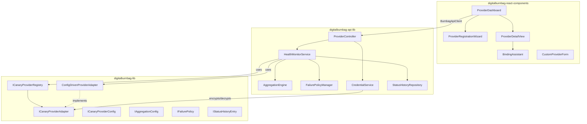
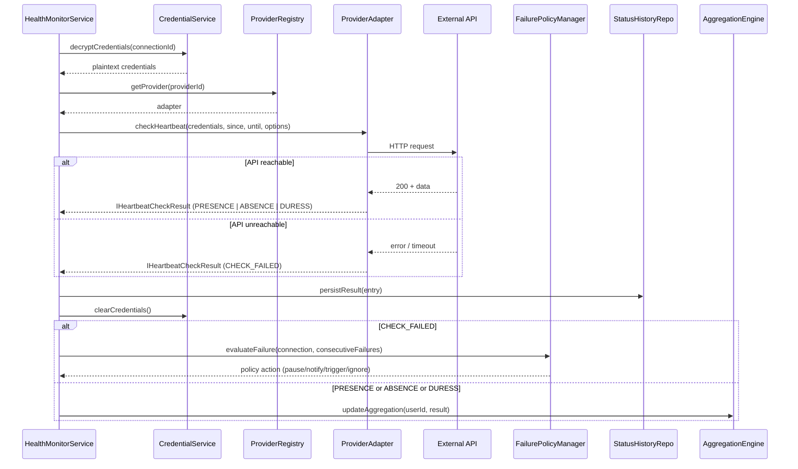

# Design Document: Canary Provider System

## Overview

The Canary Provider System elevates external API provider management to a first-class subsystem within DigitalBurnbag. It orchestrates the full lifecycle of connecting, monitoring, and evaluating heartbeat signals from external services (GitHub, Fitbit, Slack, etc.) to drive dead man's switch, duress detection, and presence confirmation protocols.

The system's most critical design constraint is the distinction between **feed failure** (API unreachable) and **user absence** (API reachable, no activity). Conflating these two states could trigger unintended data release or destruction — a life-safety concern.

### Key Design Decisions

1. **Config-driven architecture**: New providers are added via `ICanaryProviderConfig` JSON — no code changes required. The existing `ConfigDrivenProviderAdapter` already implements this pattern; the design extends it with registry lifecycle, validation, and import/export.

2. **Three-package split**: Following workspace conventions, shared interfaces/enums live in `digitalburnbag-lib`, Node.js backend services in `digitalburnbag-api-lib`, and React UI in `digitalburnbag-react-components`.

3. **Existing component evolution**: The design builds on existing components (`ProviderRegistrationWizard`, `ProviderCard`, `ProviderConnectionStatus`, `MyConnections`, `CanaryConfigPanel`) rather than replacing them, adding the Provider Dashboard, Binding Assistant, and Health Monitor as new layers.

4. **Credential isolation**: Provider credentials are encrypted at rest and decrypted only in-memory for the duration of an API call. The encryption service is injected, keeping the provider system decoupled from specific crypto implementations.

## Architecture



### Data Flow: Heartbeat Check



## Components and Interfaces

### 1. Shared Interfaces (digitalburnbag-lib)

#### IFailurePolicyConfig (new)

Configures how the system responds when a provider's consecutive `CHECK_FAILED` count reaches the threshold.

```typescript
export type FailurePolicyAction =
  | 'pause_and_notify'
  | 'notify_only'
  | 'trigger_protocol'
  | 'ignore';

export interface IFailurePolicyConfig {
  /** Consecutive CHECK_FAILED results before escalation. Default: 5 */
  failureThreshold: number;
  /** Action to take when threshold is reached */
  failurePolicy: FailurePolicyAction;
}
```

#### IStatusHistoryEntry (new)

A single audit record for a heartbeat check.

```typescript
export interface IStatusHistoryEntry<TID extends PlatformID = string> {
  id: TID;
  connectionId: TID;
  userId: TID;
  timestamp: Date;
  signalType: HeartbeatSignalType;
  eventCount: number;
  confidence: number;
  timeSinceLastActivityMs: number | null;
  httpStatusCode?: number;
  errorMessage?: string;
  /** Raw check result for debugging */
  rawResult?: Partial<IHeartbeatCheckResult<TID>>;
  createdAt: Date;
}
```

#### IProviderConnectionBase (new)

Base interface for a user's connection to a provider, shared between frontend and backend.

```typescript
export interface IProviderConnectionBase<TID extends PlatformID = string> {
  id: TID;
  userId: TID;
  providerId: TID;
  status: 'connected' | 'expired' | 'error' | 'paused' | 'pending';
  providerUserId?: string;
  providerUsername?: string;
  connectedAt?: Date | string;
  lastCheckedAt?: Date | string;
  lastCheckSignalType?: HeartbeatSignalType;
  lastActivityAt?: Date | string;
  isEnabled: boolean;
  checkIntervalMs?: number;
  /** Failure tracking */
  consecutiveFailures: number;
  failurePolicyConfig: IFailurePolicyConfig;
  /** Absence/duress config */
  absenceConfig?: IAbsenceDetectionConfig;
  duressConfig?: IDuressDetectionConfig;
  /** Pause state */
  isPaused: boolean;
  pauseReason?: string;
  createdAt: Date | string;
  updatedAt: Date | string;
}
```

#### Extended IAggregationConfig

The existing `IAggregationConfig` already supports `any`, `all`, `majority`, `weighted` strategies with category weights and duress handling. No changes needed — the design uses it as-is.

### 2. Backend Services (digitalburnbag-api-lib)

#### HealthMonitorService

Orchestrates scheduled heartbeat checks, token refresh, failure policy evaluation, and status history persistence.

```typescript
export interface IHealthMonitorService<TID extends PlatformID = string> {
  /** Start monitoring a connection */
  startMonitoring(connectionId: TID): Promise<void>;
  /** Stop monitoring a connection */
  stopMonitoring(connectionId: TID): Promise<void>;
  /** Execute a single heartbeat check for a connection */
  executeCheck(connectionId: TID): Promise<IHeartbeatCheckResult<TID>>;
  /** Refresh tokens if within 10 minutes of expiry */
  refreshTokensIfNeeded(connectionId: TID): Promise<boolean>;
  /** Get status history for a connection */
  getStatusHistory(
    connectionId: TID,
    options?: { signalTypes?: HeartbeatSignalType[]; since?: Date; until?: Date; limit?: number }
  ): Promise<IStatusHistoryEntry<TID>[]>;
}
```

#### FailurePolicyManager

Evaluates consecutive failure counts against thresholds and executes the configured policy action.

```typescript
export interface IFailurePolicyManager<TID extends PlatformID = string> {
  /** Evaluate a failure and return the action to take */
  evaluateFailure(
    connection: IProviderConnectionBase<TID>,
    consecutiveFailures: number
  ): Promise<{ shouldEscalate: boolean; action?: FailurePolicyAction }>;
  /** Execute the policy action */
  executePolicy(
    connection: IProviderConnectionBase<TID>,
    action: FailurePolicyAction
  ): Promise<void>;
}
```

#### CredentialService

Handles encryption/decryption of provider credentials. Credentials are decrypted only in-memory for the duration of an API call. Encrypted data is stored as base64-encoded strings in BrightDB's JSON-based storage (not raw Buffer).

```typescript
export interface ICredentialService<TID extends PlatformID = string> {
  /** Store encrypted credentials */
  storeCredentials(credentials: IProviderCredentials<TID>): Promise<void>;
  /** Retrieve and decrypt credentials for an API call */
  getDecryptedCredentials(connectionId: TID): Promise<IProviderCredentials<TID>>;
  /** Permanently delete credentials for a connection */
  deleteCredentials(connectionId: TID): Promise<void>;
  /** Validate that credentials are not expired */
  validateCredentialFreshness(connectionId: TID): Promise<{ valid: boolean; expiresInMs?: number }>;
}
```

#### AggregationEngine

Computes aggregate heartbeat status across multiple providers for a user using the configured strategy.

```typescript
export interface IAggregationEngine<TID extends PlatformID = string> {
  /** Compute aggregate status from individual provider results */
  aggregate(
    results: Map<TID, IHeartbeatCheckResult<TID>>,
    config: IAggregationConfig
  ): IAggregatedHeartbeatStatus<TID>;
}
```

#### ProviderConfigValidator

Validates custom provider configurations before registration.

```typescript
export interface IProviderConfigValidator<TID extends PlatformID = string> {
  /** Validate a provider config has all required fields */
  validate(config: ICanaryProviderConfig<TID>): { valid: boolean; errors: string[] };
}
```

### 3. Frontend Components (digitalburnbag-react-components)

#### ProviderDashboard (new)

Top-level page component displaying aggregate health, provider cards, and "Add Provider" entry point.

- Renders `IApiProviderConnectionsSummaryDTO` as aggregate health banner
- Lists connected providers as `ConnectionCard` components (from existing `MyConnections`)
- Shows visual status indicator on navigation item when degraded/critical
- Provides "Add Provider" button opening `ProviderRegistrationWizard`

#### ProviderDetailView (new)

Detail page for a single provider connection showing status history, configuration, and binding management.

- Renders `IStatusHistoryEntry[]` as chronological list with signal type filtering
- Displays timeline/chart visualization of signal types over time
- Shows current connection settings with edit capability
- Highlights duress entries with urgent visual treatment

#### BindingAssistant (new)

UI component for creating provider-to-vault/file bindings via context menus and drag-and-drop.

- Context menu integration: right-click vault/file → "Bind to Provider" → provider dropdown
- Drag-and-drop: drag provider card onto vault/file in file browser
- Configuration panel: condition (PRESENCE/ABSENCE/DURESS), action (ProtocolAction), thresholds, cascades
- Searchable multi-select for target vaults/files/folders (displays names, not IDs)
- Validates provider connection status before allowing binding creation

#### CustomProviderForm (new)

Form for creating/editing custom `ICanaryProviderConfig` JSON configurations.

- Fields for all `ICanaryProviderConfig` properties
- Endpoint path configuration with placeholder documentation
- Response mapping builder with JSONPath preview
- Import from JSON / Export to JSON buttons

### 4. API Endpoints (ProviderController extensions)

The existing `BurnbagApiClient` already defines most needed endpoints. New additions:

| Method | Path | Description |
|--------|------|-------------|
| GET | `/api/providers/connections/:id/history` | Get status history for a connection |
| POST | `/api/providers/connections/:id/check` | Trigger immediate heartbeat check |
| PUT | `/api/providers/connections/:id/failure-policy` | Update failure policy config |
| POST | `/api/providers/custom` | Register custom provider config |
| GET | `/api/providers/custom/:id/export` | Export provider config as JSON |
| POST | `/api/providers/custom/import` | Import provider config from JSON |
| GET | `/api/providers/aggregate-status` | Get aggregate heartbeat status |

## Data Models

All data models use BrightDB collections via `@brightchain/db`, following the existing repository pattern in `digitalburnbag-api-lib/src/lib/collections/`. Each collection uses the `Collection` type from `@brightchain/db`, with `IdSerializer<TID>` for round-tripping TID values through BrightDB's JSON-based storage, and the shared `filter`/`toDoc`/`fromDoc` helpers from `brightdb-helpers.ts`.

### Provider Connection (BrightDB Collection: `provider_connections`)

```typescript
// BrightDB Collection: provider_connections
// Repository: BrightDBProviderConnectionRepository<TID>
{
  _id: string,                           // TID serialized via IdSerializer
  userId: string,                        // TID serialized
  providerId: string,                    // e.g. "github", "fitbit", or custom ID
  status: "connected" | "expired" | "error" | "paused" | "pending",
  // Provider identity
  providerUserId: string,
  providerUsername: string,
  providerDisplayName: string,
  providerAvatarUrl: string,
  // Encrypted credentials (stored separately)
  credentialsId: string,                 // TID serialized — reference to provider_credentials collection
  // Timing
  connectedAt: Date,
  lastCheckedAt: Date,
  lastCheckSignalType: string,           // HeartbeatSignalType value
  lastActivityAt: Date,
  tokenExpiresAt: Date,
  // Check configuration
  isEnabled: boolean,
  checkIntervalMs: number,
  // Failure tracking
  consecutiveFailures: number,
  failurePolicyConfig: {
    failureThreshold: number,            // Default: 5
    failurePolicy: string                // FailurePolicyAction value
  },
  // Absence/duress config
  absenceConfig: {
    thresholdMs: number,
    gracePeriodMs: number,
    consecutiveAbsenceChecksRequired: number,
    sendWarningNotifications: boolean,
    warningIntervalsMs: number[],
    warningChannels: string[]
  },
  duressConfig: {
    enabled: boolean,
    duressKeywords: string[],
    duressPatterns: string[],
    duressActivityTypes: string[]
  },
  // Pause state
  isPaused: boolean,
  pauseReason: string,
  // Metadata
  createdAt: Date,
  updatedAt: Date
}
```

### Provider Credentials (BrightDB Collection: `provider_credentials`)

```typescript
// BrightDB Collection: provider_credentials
// Repository: BrightDBProviderCredentialRepository<TID>
{
  _id: string,                           // TID serialized
  userId: string,                        // TID serialized
  connectionId: string,                  // TID serialized
  providerId: string,
  // All token fields are AES-256-GCM encrypted, stored as base64 strings in BrightDB's JSON storage
  encryptedAccessToken: string,          // base64-encoded encrypted bytes
  encryptedRefreshToken: string,         // base64-encoded encrypted bytes
  encryptedApiKey: string,               // base64-encoded encrypted bytes
  // Encryption metadata
  encryptionKeyId: string,               // Key rotation support
  iv: string,                            // base64-encoded
  authTag: string,                       // base64-encoded
  // Provider identity (not encrypted — needed for lookups)
  providerUserId: string,
  providerUsername: string,
  // Validity
  tokenExpiresAt: Date,
  lastValidatedAt: Date,
  isValid: boolean,
  validationError: string,
  createdAt: Date,
  updatedAt: Date
}
```

### Status History (BrightDB Collection: `status_history`)

```typescript
// BrightDB Collection: status_history
// Repository: BrightDBStatusHistoryRepository<TID>
// Note: 90-day retention enforced at application level (BrightDB does not support TTL indexes natively)
{
  _id: string,                           // TID serialized
  connectionId: string,                  // TID serialized
  userId: string,                        // TID serialized
  timestamp: Date,
  signalType: string,                    // HeartbeatSignalType value
  eventCount: number,
  confidence: number,
  timeSinceLastActivityMs: number,
  httpStatusCode: number,
  errorMessage: string,
  createdAt: Date
}
```

### Custom Provider Configs (BrightDB Collection: `custom_provider_configs`)

```typescript
// BrightDB Collection: custom_provider_configs
// Repository: BrightDBCustomProviderConfigRepository<TID>
{
  _id: string,                           // TID serialized
  userId: string,                        // TID serialized — Owner
  config: ICanaryProviderConfig,         // Full config JSON
  isShared: boolean,                     // Whether other users can see it
  createdAt: Date,
  updatedAt: Date
}
```


## Correctness Properties

*A property is a characteristic or behavior that should hold true across all valid executions of a system — essentially, a formal statement about what the system should do. Properties serve as the bridge between human-readable specifications and machine-verifiable correctness guarantees.*

### Property 1: Provider grouping preserves all providers with correct categories

*For any* set of `ICanaryProviderConfig` objects with various `ProviderCategory` values, grouping them by category SHALL produce groups where every provider in each group has the matching category, no providers are lost, and no providers are duplicated.

**Validates: Requirements 1.1**

### Property 2: Webhook URL and secret uniqueness

*For any* number of webhook setup invocations, every generated webhook URL SHALL be unique and every generated secret SHALL be non-empty.

**Validates: Requirements 1.4**

### Property 3: Dashboard health summary computation

*For any* set of provider connections with various statuses and last check results, the aggregate health summary SHALL correctly compute: total connected count equals the number of connections, healthy count equals connections with status "connected" and last check PRESENCE, needs-attention count equals connections with status "error", "expired", or "paused", and overall status follows the rules (critical if healthy=0 and total>0, degraded if needsAttention>0, healthy otherwise).

**Validates: Requirements 2.2**

### Property 4: Provider card rendering includes all required fields

*For any* valid `IProviderConnectionBase` object, the rendered provider card output SHALL contain the provider name, connection status, last check time, last check result signal type, and time since last detected activity.

**Validates: Requirements 2.4**

### Property 5: Heartbeat signal classification correctness

*For any* heartbeat check execution: if the HTTP call fails (error, timeout, or auth failure), the signal type SHALL be `CHECK_FAILED`; if the call succeeds with a valid response containing no user activity within the lookback window, the signal type SHALL be `ABSENCE`; if the call succeeds with activity within the lookback window, the signal type SHALL be `PRESENCE`. The signal type SHALL never be `ABSENCE` when the API call itself failed.

**Validates: Requirements 3.1, 3.2, 3.3**

### Property 6: CHECK_FAILED does not increment absence counter

*For any* sequence of heartbeat check results applied to a provider connection, the consecutive absence counter SHALL only increment on `ABSENCE` results and SHALL remain unchanged on `CHECK_FAILED` results.

**Validates: Requirements 3.5**

### Property 7: Failure policy validation accepts only valid values

*For any* string value, the failure policy validator SHALL accept it if and only if it is one of `"pause_and_notify"`, `"notify_only"`, `"trigger_protocol"`, or `"ignore"`.

**Validates: Requirements 4.2**

### Property 8: Failure threshold triggers policy at exact count

*For any* failure threshold N (1 ≤ N ≤ 100), the failure policy manager SHALL not escalate when consecutive failures < N, and SHALL escalate when consecutive failures = N.

**Validates: Requirements 4.3**

### Property 9: Successful check resets failure counter

*For any* provider connection with K consecutive failures (K ≥ 1), when a heartbeat check succeeds (PRESENCE or ABSENCE), the consecutive failure counter SHALL reset to 0 and the connection status SHALL become "connected".

**Validates: Requirements 4.4**

### Property 10: Binding creation requires connected provider status

*For any* provider connection status, binding creation SHALL succeed only when the status is `"connected"` and SHALL be rejected for all other statuses (`"expired"`, `"error"`, `"paused"`, `"pending"`).

**Validates: Requirements 5.5**

### Property 11: Status change events emitted on signal type transitions

*For any* sequence of heartbeat check results for a provider connection, a status change event SHALL be emitted if and only if the current result's signal type differs from the previous result's signal type.

**Validates: Requirements 6.3**

### Property 12: Rate limit compliance

*For any* sequence of heartbeat checks for a provider, the number of requests within any sliding window of `windowMs` milliseconds SHALL not exceed `maxRequests`, and the delay between consecutive requests SHALL be at least `minDelayMs`.

**Validates: Requirements 6.4**

### Property 13: Token refresh timing

*For any* provider connection with OAuth2 tokens, the health monitor SHALL attempt token refresh if and only if the token expiry time minus the current time is ≤ 10 minutes (600,000 ms) and > 0.

**Validates: Requirements 6.5**

### Property 14: Status history entry completeness

*For any* `IHeartbeatCheckResult`, the corresponding `IStatusHistoryEntry` SHALL contain: connection ID, timestamp, signal type, event count, confidence score, time since last activity, and HTTP status code (when applicable). No required field SHALL be null or undefined.

**Validates: Requirements 7.1**

### Property 15: Status history filtering and ordering

*For any* set of `IStatusHistoryEntry` objects and any filter (by signal type and/or date range), the filtered result SHALL contain only entries matching the filter criteria and SHALL be sorted in chronological order by timestamp.

**Validates: Requirements 7.2**

### Property 16: Provider registry registration and retrieval

*For any* valid `ICanaryProviderConfig` (built-in or custom), after registration the provider SHALL be retrievable by its ID, and the retrieved config SHALL be equivalent to the registered config.

**Validates: Requirements 8.1, 8.2**

### Property 17: Provider config validation rejects incomplete configs

*For any* `ICanaryProviderConfig` object missing one or more required fields (id, name, baseUrl, auth, endpoints.activity, endpoints.activity.responseMapping), validation SHALL fail. *For any* config with all required fields present, validation SHALL succeed.

**Validates: Requirements 8.3**

### Property 18: Provider config export/import round-trip

*For any* valid registered `ICanaryProviderConfig`, exporting to JSON and then importing from that JSON SHALL produce a provider config equivalent to the original.

**Validates: Requirements 8.4, 8.5**

### Property 19: Aggregation strategy correctness

*For any* set of provider heartbeat results and any aggregation strategy: under `"any"`, the aggregate SHALL be PRESENCE if at least one provider shows PRESENCE; under `"all"`, PRESENCE only if all providers show PRESENCE; under `"majority"`, PRESENCE if more than half show PRESENCE; under `"weighted"`, PRESENCE if the weighted score exceeds the threshold, where weights are applied per category (PLATFORM_NATIVE: 2.0, HEALTH_FITNESS: 1.5, COMMUNICATION: 1.2, others: 1.0) with per-provider overrides.

**Validates: Requirements 9.1, 9.3**

### Property 20: Duress detection safety invariant

*For any* aggregation strategy and *for any* set of provider results where at least one provider reports `DURESS`, the aggregate result SHALL have `duressDetected = true` regardless of the aggregation strategy or other providers' results.

**Validates: Requirements 9.4**

### Property 21: All-failures aggregate safety invariant

*For any* number of providers (≥ 1) where all providers return `CHECK_FAILED`, the aggregate signal type SHALL be `CHECK_FAILED` and SHALL NOT be `ABSENCE`, regardless of the aggregation strategy.

**Validates: Requirements 9.5**

### Property 22: Credential encryption round-trip

*For any* valid credential string (access token, refresh token, or API key), encrypting and then decrypting SHALL produce the original string.

**Validates: Requirements 10.1**

### Property 23: Credentials never appear in outputs

*For any* credential value and *for any* error scenario during a heartbeat check, the error message, API response body, and log output SHALL NOT contain the credential value as a substring.

**Validates: Requirements 10.3**

### Property 24: OAuth state parameter validation

*For any* generated OAuth state parameter, the callback handler SHALL accept a callback with a matching state parameter and SHALL reject a callback with any non-matching state parameter.

**Validates: Requirements 10.5**

## Error Handling

### Feed Failure Errors

| Error Type | Detection | Response |
|---|---|---|
| HTTP 4xx/5xx | Response status code | Classify as `CHECK_FAILED`, increment consecutive failure counter, log error details without credentials |
| Network timeout | HTTP client timeout | Classify as `CHECK_FAILED`, use provider's retry config (backoffMs × backoffMultiplier) |
| Authentication failure (401/403) | Response status code | Classify as `CHECK_FAILED`, mark connection for token refresh or re-authentication |
| Rate limit exceeded (429) | Response status + `Retry-After` header | Classify as `CHECK_FAILED`, back off using `Retry-After` or provider's `minDelayMs` |
| DNS resolution failure | HTTP client error | Classify as `CHECK_FAILED`, continue retrying at configured interval |

### Credential Errors

| Error Type | Detection | Response |
|---|---|---|
| Token expired | `tokenExpiresAt < now` | Attempt refresh via `refreshTokens()`. If refresh fails, mark status "expired", notify user |
| Refresh token revoked | 401 on refresh attempt | Mark status "expired", notify user to re-authenticate |
| Decryption failure | Crypto error during decrypt | Log error (without credential data), mark connection "error", notify user |
| Missing credentials | Null credential fields | Prevent check execution, mark connection "error" |

### Failure Policy Escalation

| Policy | Threshold Reached Action |
|---|---|
| `pause_and_notify` | Set `isPaused=true`, record `pauseReason`, send notification via configured warning channels |
| `notify_only` | Send notification, continue checks |
| `trigger_protocol` | Treat as ABSENCE, evaluate all bound canary bindings, execute matching protocol actions |
| `ignore` | Log the event, take no action |

### Aggregation Edge Cases

- **Mixed results with duress**: Duress takes priority — if any provider reports DURESS, aggregate reports duress regardless of other results
- **All providers paused**: Aggregate status is INCONCLUSIVE, not ABSENCE
- **Single provider**: Aggregate result equals that provider's result (no aggregation logic applied)
- **No providers configured**: Aggregate status is INCONCLUSIVE with zero confidence

### UI Error States

- Connection wizard: display error inline with retry button, preserve entered credentials across retries
- Dashboard: show error badge on navigation item, display error details on provider card
- Binding creation: block creation for non-connected providers, show actionable warning with link to fix

## Testing Strategy

### Property-Based Testing

The feature contains significant pure logic suitable for property-based testing: signal classification, aggregation strategies, failure counter state machine, config validation, credential encryption, and filtering/sorting.

**Library**: [fast-check](https://github.com/dubzzz/fast-check) (TypeScript PBT library, already compatible with the project's Jest/Vitest setup)

**Configuration**:
- Minimum 100 iterations per property test
- Each test tagged with: `Feature: canary-provider-system, Property {N}: {title}`

**Property tests** (from Correctness Properties above):
- Properties 1–24 each implemented as a single `fc.assert(fc.property(...))` test
- Custom arbitraries for: `ICanaryProviderConfig`, `IHeartbeatCheckResult`, `IProviderConnectionBase`, `IAggregationConfig`, `HeartbeatSignalType`, `FailurePolicyAction`

### Unit Tests (Example-Based)

| Area | Tests |
|---|---|
| OAuth flow | URL construction with correct scopes and state parameter (Req 1.2) |
| API key connection | Input validation, persistence (Req 1.3) |
| Webhook setup | URL/secret generation, instructions display (Req 1.4) |
| Test connection | Success/failure display, retry behavior (Req 1.5, 1.6) |
| Absence config form | Default values, field rendering (Req 1.8) |
| Duress config form | Toggle behavior, keyword/pattern fields (Req 1.9) |
| Navigation | Dashboard appears at top level (Req 2.1) |
| Status badge | Visual indicator for degraded/critical (Req 2.3) |
| Provider detail | Navigation from card click (Req 2.5) |
| Add Provider button | Opens wizard (Req 2.6) |
| Visual distinction | CHECK_FAILED vs ABSENCE different colors/icons (Req 3.4) |
| Default threshold | Default failure threshold is 5 (Req 4.1) |
| pause_and_notify | isPaused=true, pauseReason set, notification sent (Req 4.5) |
| trigger_protocol | Bindings evaluated as ABSENCE (Req 4.6) |
| Context menu | "Bind to Provider" option appears (Req 5.1, 5.2) |
| Drag-and-drop | Binding creation initiated (Req 5.3) |
| Name display | Names shown instead of IDs (Req 5.4) |
| Error/expired warning | Warning displayed with fix link (Req 5.6) |
| Token refresh failure | Status becomes "expired", notification sent (Req 6.6) |
| Timeline chart | Renders with sample data (Req 7.3) |
| Duress highlighting | Urgent visual treatment (Req 7.5) |
| Default strategy | "any" used when no config set (Req 9.2) |
| Aggregate display | Contributing providers shown (Req 9.6) |
| Custom provider form | All config fields present (Req 8.6) |

### Integration Tests

| Area | Tests |
|---|---|
| OAuth redirect/callback | Full flow with mocked provider (Req 1.2) |
| Connection persistence | Encrypted credentials stored after successful test (Req 1.7) |
| Scheduled checks | Checks execute at configured intervals (Req 6.1) |
| Status history persistence | Entry created after each check (Req 6.2) |
| Retry during failure | Checks continue during feed failure state (Req 3.6) |
| Credential lifecycle | Decrypt before call, clear after (Req 10.2) |
| Credential deletion | All credentials removed on disconnect (Req 10.4) |

### Smoke Tests

| Area | Tests |
|---|---|
| TTL index | Status history 90-day TTL configured (Req 7.4) |
