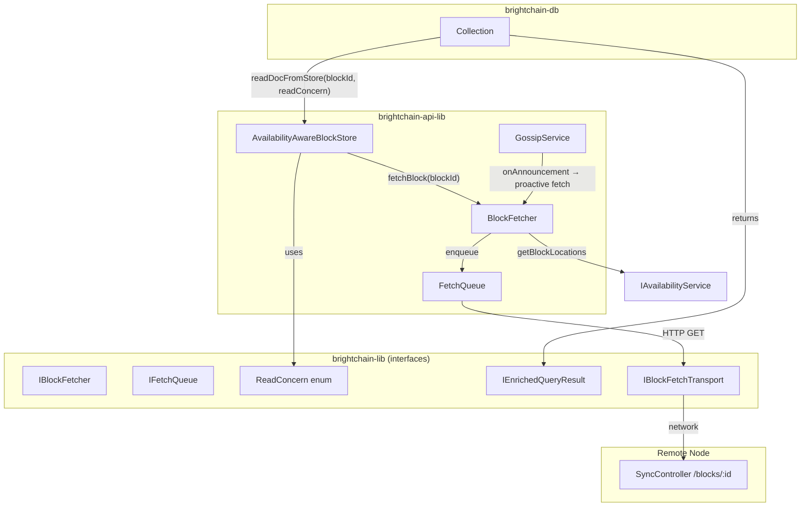

# Design Document: Cross-Node Eventual Consistency for Block Retrieval

## Overview

This design adds remote block fetching and eventual consistency semantics to BrightChain's block retrieval path. Today, `AvailabilityAwareBlockStore.getData()` delegates to the local inner store and fails if the block isn't present locally — even when the availability service knows the block exists on a remote node. The `Collection` layer catches all errors and returns `null`, silently hiding the fact that data exists but hasn't been fetched yet.

The design introduces four key components:

1. **IBlockFetcher / BlockFetcher** — a service that retrieves block data from remote nodes over HTTP, with checksum verification, retry logic, and node health tracking.
2. **FetchQueue** — a priority queue with deduplication that coalesces concurrent requests for the same block and limits concurrency.
3. **ReadConcern** — a caller-specified consistency level (Local, Available, Consistent) that controls whether reads block on remote fetches, return pending indicators, or fail fast.
4. **EnrichedQueryResult** — an extended query result type from Collection that communicates partial results and pending block metadata.

These components integrate with the existing `AvailabilityAwareBlockStore`, `IAvailabilityService`, `GossipService`, and `Collection` without breaking current contracts.

## Architecture



### Data Flow: Read with Remote Fetch

1. `Collection.findOne(query, { readConcern: 'consistent' })` calls `readDocFromStore(blockId, readConcern)`.
2. `AvailabilityAwareBlockStore.getData(key, readConcern)` checks the inner (local) store first.
3. If the block is not local, it checks `IAvailabilityService.getAvailabilityState(blockId)`.
4. If state is `Remote` and readConcern allows fetching, it calls `IBlockFetcher.fetchBlock(blockId)`.
5. `BlockFetcher` queries `IAvailabilityService.getBlockLocations(blockId)` for node addresses.
6. `FetchQueue` deduplicates the request and dispatches via `IBlockFetchTransport.fetchBlockFromNode(nodeId, blockId)`.
7. The transport issues an HTTP GET to the remote node's `SyncController`.
8. On success, the block data is checksum-verified, stored locally as Cached, and returned to the caller.
9. On failure with `readConcern: 'available'`, a `PendingBlock` indicator is returned instead of an error.

## Components and Interfaces

### 1. ReadConcern Enum (brightchain-lib)

```typescript
/**
 * Read concern levels for block retrieval.
 * Controls how the system handles blocks not available locally.
 */
export enum ReadConcern {
  /** Return only locally available blocks. Fail for remote/unknown blocks. */
  Local = 'local',
  /** Return local blocks immediately; attempt remote fetch but return pending indicator on timeout. */
  Available = 'available',
  /** Block until the block is fetched or timeout is reached. */
  Consistent = 'consistent',
}
```

### 2. IBlockFetchTransport (brightchain-lib)

The transport abstraction allows testing without real HTTP. The interface lives in brightchain-lib; the HTTP implementation lives in brightchain-api-lib.

```typescript
export interface IBlockFetchTransport {
  /**
   * Fetch raw block data from a specific remote node.
   * @param nodeId - The target node
   * @param blockId - The block to fetch
   * @param poolId - Optional pool scope
   * @returns The raw block bytes
   * @throws BlockFetchError on failure
   */
  fetchBlockFromNode(
    nodeId: string,
    blockId: string,
    poolId?: PoolId,
  ): Promise<Uint8Array>;
}
```

### 3. IBlockFetcher (brightchain-lib)

```typescript
export interface BlockFetchResult {
  success: boolean;
  data?: Uint8Array;
  error?: string;
  attemptedNodes: Array<{ nodeId: string; error?: string }>;
}

export interface BlockFetcherConfig {
  fetchTimeoutMs: number;          // Default: 10000
  maxRetries: number;              // Default: 3
  retryBaseDelayMs: number;        // Default: 500
  nodeCooldownMs: number;          // Default: 60000
  proactiveFetchEnabled: boolean;  // Default: false
  initialWaitMs: number;           // Default: 200 (for Available read concern)
}

export interface IBlockFetcher {
  fetchBlock(blockId: string, poolId?: PoolId): Promise<BlockFetchResult>;
  isNodeAvailable(nodeId: string): boolean;
  markNodeUnavailable(nodeId: string): void;
  getConfig(): BlockFetcherConfig;
  start(): void;
  stop(): void;
}
```

### 4. IFetchQueue (brightchain-lib)

```typescript
export interface FetchRequest {
  blockId: string;
  poolId?: PoolId;
  priority: number;
  resolve: (result: BlockFetchResult) => void;
  reject: (error: Error) => void;
  enqueuedAt: number;
}

export interface FetchQueueConfig {
  maxConcurrency: number;    // Default: 5
  fetchTimeoutMs: number;    // Default: 10000
}

export interface IFetchQueue {
  enqueue(blockId: string, poolId?: PoolId): Promise<BlockFetchResult>;
  getPendingCount(): number;
  getActiveCount(): number;
  cancelAll(reason: string): void;
  getConfig(): FetchQueueConfig;
}
```

### 5. IEnrichedQueryResult (brightchain-lib)

This is the base data structure for query results with availability metadata. Per workspace rules, the core interface goes in brightchain-lib so both frontend and backend can use it.

```typescript
export interface IPendingBlockInfo {
  blockId: string;
  state: AvailabilityState;
  knownLocations: string[];  // node IDs
}

export interface IEnrichedQueryResult<TDoc> {
  /** Documents that were successfully retrieved */
  documents: TDoc[];
  /** Whether all requested blocks were available */
  isComplete: boolean;
  /** Blocks that could not be retrieved */
  pendingBlocks: IPendingBlockInfo[];
  /** The read concern used for this query */
  readConcern: ReadConcern;
}
```

### 6. Extended AvailabilityAwareBlockStore (brightchain-api-lib)

The existing `getData()` method gains an optional `readConcern` parameter. The default is `ReadConcern.Local` to preserve backward compatibility.

```typescript
// Extended signature (backward compatible)
async getData(key: Checksum, readConcern?: ReadConcern): Promise<RawDataBlock>;
```

Logic:
1. Try inner store first.
2. If not found and `readConcern === Local`, throw `BlockNotFoundError`.
3. If not found and state is `Remote`:
   - `Consistent`: call `blockFetcher.fetchBlock()`, await result, store locally, return.
   - `Available`: call `blockFetcher.fetchBlock()` with `initialWaitMs` timeout. If resolved in time, return. Otherwise throw `PendingBlockError` with block metadata.
4. If in partition mode and state is `Remote`, throw `PartitionModeError` regardless of read concern.

### 7. Extended SyncController (brightchain-api-lib)

Add a new endpoint for block data retrieval:

```
GET /api/sync/blocks/:blockId
Query params: ?poolId=<optional>
Response: 200 with raw block data, or 404
```

### 8. Extended Collection (brightchain-db)

Add `readConcern` to query options and return `IEnrichedQueryResult<T>` from a new method:

```typescript
// New method alongside existing find/findOne
async findWithAvailability(
  filter: FilterQuery<T>,
  options?: FindOptions & { readConcern?: ReadConcern },
): Promise<IEnrichedQueryResult<T>>;
```

The existing `findOne`/`find` methods remain unchanged for backward compatibility. `readDocFromStore` gains an internal `readConcern` parameter.

### 9. BlockFetcher Implementation (brightchain-api-lib)

```typescript
class BlockFetcher implements IBlockFetcher {
  constructor(
    private readonly transport: IBlockFetchTransport,
    private readonly availabilityService: IAvailabilityService,
    private readonly fetchQueue: IFetchQueue,
    private readonly config: BlockFetcherConfig,
  ) {}
}
```

Key behaviors:
- Queries `availabilityService.getBlockLocations(blockId)` to get candidate nodes.
- Filters out nodes marked unavailable (cooldown tracking via `Map<string, number>`).
- Tries nodes in order; on transient failure, retries with exponential backoff.
- On success, verifies checksum matches `blockId`.
- On all-nodes-exhausted, returns `BlockFetchResult` with `success: false` and per-node errors.

### 10. FetchQueue Implementation (brightchain-api-lib)

```typescript
class FetchQueue implements IFetchQueue {
  // Map from blockId to list of waiting promises (deduplication)
  private pending: Map<string, Array<{ resolve; reject }>>;
  // Currently executing fetches
  private active: Set<string>;
}
```

Key behaviors:
- If `blockId` is already in `pending` or `active`, the new caller's promise is appended to the existing waiters list.
- When a fetch completes, all waiters for that `blockId` are resolved with the same result.
- Concurrency is bounded by `maxConcurrency`.
- Timeout per request; on timeout, all waiters receive a timeout error.

### 11. Gossip-Triggered Proactive Fetching (brightchain-api-lib)

When `proactiveFetchEnabled` is true, `BlockFetcher.start()` subscribes to `gossipService.onAnnouncement()`. On receiving a block announcement:
- Check if the block is already local.
- If not, and the proactive fetch policy allows it (e.g., block's `targetReplicationFactor` > current replica count), enqueue a low-priority fetch.

## Data Models

### New Types in brightchain-lib

```typescript
// ReadConcern enum (see above)
// IBlockFetchTransport interface (see above)
// IBlockFetcher interface + BlockFetchResult + BlockFetcherConfig (see above)
// IFetchQueue interface + FetchQueueConfig (see above)
// IEnrichedQueryResult<T> + IPendingBlockInfo (see above)
```

### New Error Types in brightchain-lib

```typescript
export class BlockFetchError extends Error {
  constructor(
    public readonly blockId: string,
    public readonly attemptedNodes: Array<{ nodeId: string; error?: string }>,
    message: string,
  ) {
    super(message);
    this.name = 'BlockFetchError';
  }
}

export class PendingBlockError extends Error {
  constructor(
    public readonly blockId: string,
    public readonly state: AvailabilityState,
    public readonly knownLocations: string[],
  ) {
    super(`Block ${blockId} is pending remote fetch (state: ${state})`);
    this.name = 'PendingBlockError';
  }
}

export class FetchTimeoutError extends BlockFetchError {
  constructor(blockId: string, timeoutMs: number) {
    super(blockId, [], `Fetch for block ${blockId} timed out after ${timeoutMs}ms`);
    this.name = 'FetchTimeoutError';
  }
}

export class PoolMismatchError extends BlockFetchError {
  constructor(blockId: string, expectedPoolId: string, actualPoolId: string) {
    super(blockId, [], `Pool mismatch for block ${blockId}: expected ${expectedPoolId}, got ${actualPoolId}`);
    this.name = 'PoolMismatchError';
  }
}
```

### Extended Config in brightchain-api-lib

```typescript
interface AvailabilityAwareBlockStoreConfig {
  // ... existing fields ...
  localNodeId: string;
  autoAnnounce?: boolean;
  trackAccess?: boolean;
  // New fields:
  defaultReadConcern?: ReadConcern;
  blockFetcherConfig?: BlockFetcherConfig;
  fetchQueueConfig?: FetchQueueConfig;
}
```


## Correctness Properties

*A property is a characteristic or behavior that should hold true across all valid executions of a system — essentially, a formal statement about what the system should do. Properties serve as the bridge between human-readable specifications and machine-verifiable correctness guarantees.*

### Property 1: Checksum verification rejects tampered blocks

*For any* block ID and any block data whose checksum does not match that block ID, the Block_Fetcher SHALL reject the data and not store it locally.

**Validates: Requirements 1.3**

### Property 2: Failover exhausts all candidate nodes and reports attempts

*For any* set of location records for a block where some or all nodes fail, the Block_Fetcher SHALL attempt each non-cooldown node in order, and the resulting `BlockFetchResult.attemptedNodes` array SHALL contain an entry for every node that was tried, each with an error description.

**Validates: Requirements 1.4, 1.5**

### Property 3: Successful fetch transitions state to Cached

*For any* block with Remote availability state, if the Block_Fetcher successfully retrieves the block data, the availability state SHALL transition to Cached and the block SHALL be present in the local store.

**Validates: Requirements 1.2**

### Property 4: Local read concern returns only locally available blocks

*For any* block and any availability state, when Read_Concern is Local: if the state is Local or Cached, getData SHALL return the block data; if the state is Remote, Unknown, or Orphaned, getData SHALL return an error.

**Validates: Requirements 2.2**

### Property 5: Available read concern returns local blocks and attempts fetch for remote

*For any* block with Local or Cached state, getData with Available read concern SHALL return the block immediately. *For any* block with Remote state, getData with Available read concern SHALL trigger a fetch attempt.

**Validates: Requirements 2.3**

### Property 6: Consistent read concern blocks until fetch completes or times out

*For any* block with Remote state, getData with Consistent read concern SHALL either return the block data (if fetch succeeds within timeout) or return a FetchTimeoutError (if fetch exceeds timeout). It SHALL never return incomplete data.

**Validates: Requirements 2.4, 2.5**

### Property 7: EnrichedQueryResult isComplete flag is consistent with pendingBlocks

*For any* query result, `isComplete` SHALL equal `(pendingBlocks.length === 0)`. The total of `documents.length + pendingBlocks.length` SHALL equal the number of blocks the query attempted to read.

**Validates: Requirements 3.1, 3.2, 3.3**

### Property 8: FetchQueue deduplication — concurrent requests for the same block produce one fetch

*For any* number N > 1 of concurrent `enqueue(blockId)` calls for the same blockId, the underlying transport SHALL be invoked exactly once, and all N callers SHALL receive the same `BlockFetchResult`.

**Validates: Requirements 4.1**

### Property 9: FetchQueue concurrency bound

*For any* sequence of enqueued fetch requests, the number of simultaneously active transport calls SHALL never exceed `maxConcurrency`.

**Validates: Requirements 4.2**

### Property 10: Pool-scoped fetch stores block in correct namespace

*For any* block with a pool ID, after a successful remote fetch, the block SHALL be stored under the pool-scoped key (`${poolId}:${blockId}`) and SHALL be retrievable via the PooledStoreAdapter for that pool.

**Validates: Requirements 5.1, 5.2**

### Property 11: Pool mismatch rejection

*For any* fetch where the requested pool ID differs from the pool ID in the fetched block's metadata, the Block_Fetcher SHALL reject the block with a PoolMismatchError.

**Validates: Requirements 5.3**

### Property 12: Proactive fetch disabled means no data transfers on announcements

*For any* block announcement received when `proactiveFetchEnabled` is false, the FetchQueue SHALL not receive any new enqueue calls as a result of that announcement.

**Validates: Requirements 6.3**

### Property 13: Retry count respects maxRetries configuration

*For any* block fetch where the transport consistently fails with transient errors, the total number of transport invocations for a single node SHALL be at most `maxRetries + 1` (1 initial attempt + maxRetries retries).

**Validates: Requirements 7.1**

### Property 14: Node cooldown excludes failed nodes from candidate list

*For any* node that has been marked unavailable, subsequent fetch attempts within the cooldown period SHALL not include that node in the candidate list. After the cooldown period expires, the node SHALL be eligible again.

**Validates: Requirements 7.2**

### Property 15: Partition mode suspends all remote fetches

*For any* fetch request issued while the system is in partition mode, the Block_Fetcher SHALL return a PartitionModeError immediately without invoking the transport.

**Validates: Requirements 7.3**

## Error Handling

### Error Hierarchy

All new errors extend the base `Error` class:

| Error | When Thrown | Recovery |
|-------|-----------|----------|
| `BlockFetchError` | Generic fetch failure | Caller retries or uses fallback |
| `FetchTimeoutError` | Fetch exceeds configured timeout | Caller may retry with longer timeout or switch to Available concern |
| `PendingBlockError` | Available concern, block not yet fetched | Caller receives partial result, can poll later |
| `PoolMismatchError` | Fetched block's pool doesn't match request | Block is rejected; may indicate data corruption or misconfiguration |
| `PartitionModeError` (existing) | Remote fetch during partition | Caller waits for partition to resolve |

### Error Propagation

- `BlockFetcher` catches transport errors and wraps them in `BlockFetchError` with per-node details.
- `AvailabilityAwareBlockStore` translates `BlockFetchResult.success === false` into the appropriate error based on read concern.
- `Collection.findWithAvailability` catches `PendingBlockError` and adds the block to `pendingBlocks` in the enriched result. Other errors propagate to the caller.
- `Collection.readDocFromStore` (existing) continues to catch all errors and return `null` for backward compatibility.

### Partition Mode

- During partition mode, `BlockFetcher` short-circuits all requests with `PartitionModeError`.
- On partition exit, `BlockFetcher` resumes queue processing. Requests that were queued before partition are re-evaluated (their target nodes may have changed state).

## Testing Strategy

### Property-Based Testing

Use **fast-check** for property-based tests. Each property from the Correctness Properties section maps to a single property-based test.

Configuration:
- Minimum 100 iterations per property test
- Each test tagged with: `Feature: cross-node-eventual-consistency, Property N: <title>`

Key generators needed:
- `arbBlockId`: generates valid hex-encoded checksum strings
- `arbLocationRecords`: generates arrays of `ILocationRecord` with random node IDs
- `arbAvailabilityState`: generates one of the `AvailabilityState` enum values
- `arbReadConcern`: generates one of the `ReadConcern` enum values
- `arbPoolId`: generates valid pool ID strings
- `arbBlockData`: generates random `Uint8Array` of valid block sizes
- `arbFetcherConfig`: generates valid `BlockFetcherConfig` with reasonable bounds

### Unit Testing

Unit tests complement property tests for specific examples and edge cases:
- Timeout behavior with controlled delays (Req 1.6)
- ReadConcern enum has exactly three values (Req 2.1)
- Read concern propagation from Collection to store (Req 3.4)
- FetchQueue timeout cancellation (Req 4.4)
- Gossip-triggered proactive fetch evaluation (Req 6.1)
- Partition exit resumes queue (Req 7.4)

### Test Organization

```
brightchain-lib/src/lib/interfaces/blockFetcher.property.spec.ts    — Properties 1-3, 13-14
brightchain-lib/src/lib/interfaces/fetchQueue.property.spec.ts      — Properties 8-9
brightchain-lib/src/lib/interfaces/readConcern.property.spec.ts     — Properties 4-6
brightchain-lib/src/lib/interfaces/enrichedResult.property.spec.ts  — Property 7
brightchain-api-lib/src/__tests__/blockFetcher.spec.ts              — Unit tests for BlockFetcher
brightchain-api-lib/src/__tests__/fetchQueue.spec.ts                — Unit tests for FetchQueue
brightchain-api-lib/src/__tests__/availabilityAwareBlockStore.spec.ts — Properties 4-6, 15 + unit tests
brightchain-db/src/__tests__/collection.availability.spec.ts        — Property 7 + unit tests
brightchain-api-lib/src/__tests__/poolFetch.property.spec.ts        — Properties 10-11
brightchain-api-lib/src/__tests__/gossipFetch.property.spec.ts      — Property 12
```

### Testing Libraries

- **Jest** — test runner (already configured via Nx)
- **fast-check** — property-based testing (already a dependency)
- Mock implementations of `IBlockFetchTransport`, `IAvailabilityService`, `IBlockStore` for isolated testing
