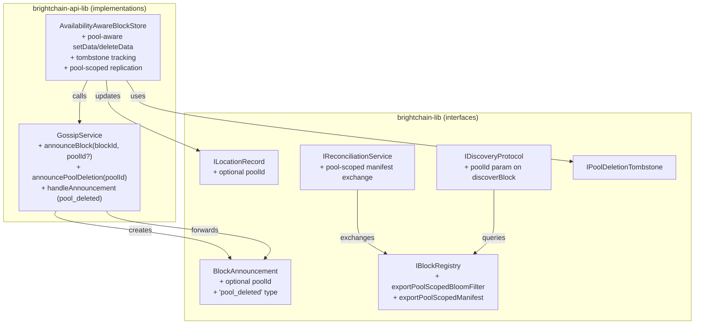

# Design Document: Cross-Node Pool Coordination

## Overview

This design adds pool awareness to BrightChain's cross-node networking layer. The three preceding specs established pool-based storage isolation (storage namespace), pool-scoped whitening (XOR integrity), and cross-node eventual consistency (remote block fetching). However, the networking primitives — gossip announcements, reconciliation manifests, discovery Bloom filters, and location records — remain pool-blind.

This creates five concrete problems:
1. A block announced via gossip has no pool context, so receiving nodes store it in the wrong pool (or the default pool).
2. Pool deletion on one node leaves replicated copies on other nodes with no cleanup mechanism.
3. Reconciliation after partition recovery exchanges flat manifests, so blocks can be synchronized into incorrect pools.
4. Discovery uses global Bloom filters, producing false positives when the same block exists in different pools on different nodes.
5. Location records don't track pool membership, making it impossible to distinguish "block X in Pool A on Node 1" from "block X in Pool B on Node 2."

The design extends five existing interfaces with optional pool fields and adds one new gossip announcement type (`pool_deleted`), maintaining full backward compatibility.

## Architecture



### Data Flow: Pool-Aware Block Announcement

1. `AvailabilityAwareBlockStore.setData(block, { poolId })` stores the block in the inner store.
2. If `autoAnnounce` is enabled and not in partition mode, it calls `gossipService.announceBlock(blockId, poolId)`.
3. `GossipService` creates a `BlockAnnouncement` with `type: 'add'`, `blockId`, and `poolId`.
4. The announcement is batched and sent to peers.
5. Receiving nodes' `handleAnnouncement` sees the `poolId` and updates location records with pool context.
6. If the receiving node stores the block (via proactive fetch or reconciliation), it uses `putInPool(poolId, data)`.

### Data Flow: Pool Deletion Propagation

1. Node A calls `deletePool(poolId)` (after `validatePoolDeletion` passes from pool-scoped-whitening).
2. `AvailabilityAwareBlockStore` calls `gossipService.announcePoolDeletion(poolId)`.
3. `GossipService` creates a `BlockAnnouncement` with `type: 'pool_deleted'`, `blockId: ''`, and `poolId`.
4. Receiving nodes' `handleAnnouncement` processes the `pool_deleted` type:
   - Removes all blocks in that pool from the local store via `forceDeletePool(poolId)`.
   - Removes all pool entries from the block registry.
   - Records a `PoolDeletionTombstone` to reject future storage of blocks with that pool ID.
5. The announcement is forwarded with decremented TTL.

### Data Flow: Pool-Scoped Reconciliation

1. On partition exit, `ReconciliationService.reconcile(peerIds)` is called.
2. Instead of exchanging a flat `BlockManifest`, it exchanges a `PoolScopedManifest` — a `Map<PoolId, string[]>`.
3. The receiving node compares per-pool: for each pool, it identifies blocks the peer has that it doesn't.
4. Missing blocks are fetched and stored in the correct pool via `putInPool`.
5. If a pool in the peer's manifest has a local tombstone, that pool is skipped entirely.

## Components and Interfaces

### 1. Extended BlockAnnouncement (brightchain-lib)

Add an optional `poolId` field and extend the `type` union:

```typescript
export interface BlockAnnouncement {
  type: 'add' | 'remove' | 'ack' | 'pool_deleted';
  blockId: string;
  nodeId: string;
  timestamp: Date;
  ttl: number;
  messageDelivery?: MessageDeliveryMetadata;
  deliveryAck?: DeliveryAckMetadata;
  /** Optional pool ID for pool-scoped announcements */
  poolId?: PoolId;
}
```

The `validateBlockAnnouncement` function is extended:
- `pool_deleted` type requires `poolId` to be present and valid.
- `pool_deleted` type must not have `messageDelivery` or `deliveryAck`.
- `poolId` on `add`/`remove` types is optional and validated if present.

### 2. Pool Deletion Tombstone (brightchain-lib)

New interface for tracking deleted pools:

```typescript
export interface IPoolDeletionTombstone {
  /** The deleted pool's ID */
  poolId: PoolId;
  /** When the deletion was recorded */
  deletedAt: Date;
  /** When this tombstone expires (after which the pool ID can be reused) */
  expiresAt: Date;
  /** The node that originated the deletion */
  originNodeId: string;
}

export interface PoolDeletionTombstoneConfig {
  /** How long tombstones persist before expiring. Default: 7 days */
  tombstoneTtlMs: number;
}

export const DEFAULT_TOMBSTONE_CONFIG: PoolDeletionTombstoneConfig = {
  tombstoneTtlMs: 7 * 24 * 60 * 60 * 1000, // 7 days
};
```

### 3. Extended IGossipService (brightchain-lib)

Add two new methods to the existing interface:

```typescript
export interface IGossipService {
  // ... existing methods ...

  /**
   * Announce a block with optional pool context.
   * @param blockId - The block ID to announce
   * @param poolId - Optional pool the block belongs to
   */
  announceBlock(blockId: string, poolId?: PoolId): Promise<void>;

  /**
   * Announce that a pool has been deleted.
   * Creates a pool_deleted announcement propagated as a tombstone.
   * @param poolId - The pool that was deleted
   */
  announcePoolDeletion(poolId: PoolId): Promise<void>;

  /**
   * Announce block removal with optional pool context.
   * @param blockId - The block ID being removed
   * @param poolId - Optional pool the block belonged to
   */
  announceRemoval(blockId: string, poolId?: PoolId): Promise<void>;
}
```

The existing `announceBlock(blockId: string)` signature is backward compatible — `poolId` is optional.

### 4. Extended ILocationRecord (brightchain-lib)

Add an optional `poolId` field:

```typescript
export interface ILocationRecord {
  nodeId: string;
  lastSeen: Date;
  isAuthoritative: boolean;
  latencyMs?: number;
  /** Pool the block is stored in on this node */
  poolId?: PoolId;
}
```

The serialization/deserialization functions (`locationRecordToJSON`, `locationRecordFromJSON`) are extended to handle the optional `poolId` field. The `SerializedLocationRecord` interface gains an optional `poolId?: string` field.

### 5. Extended IBlockRegistry (brightchain-lib)

Add pool-scoped export methods:

```typescript
export interface PoolScopedBloomFilter {
  /** Per-pool Bloom filters using keys in format "poolId:blockId" */
  filters: Map<PoolId, BloomFilter>;
  /** Global filter for backward compatibility */
  globalFilter: BloomFilter;
}

export interface PoolScopedManifest {
  nodeId: string;
  /** Block IDs grouped by pool */
  pools: Map<PoolId, string[]>;
  generatedAt: Date;
  checksum: string;
}

export interface IBlockRegistry {
  // ... existing methods ...

  /**
   * Export a pool-scoped Bloom filter.
   * Each pool gets its own filter with keys in "poolId:blockId" format.
   * Also includes a global filter for backward compatibility.
   */
  exportPoolScopedBloomFilter(): PoolScopedBloomFilter;

  /**
   * Export a pool-scoped manifest grouping block IDs by pool.
   */
  exportPoolScopedManifest(): PoolScopedManifest;
}
```

To support this, the `IBlockRegistry` needs pool awareness in its internal index. The `addLocal` and `removeLocal` methods gain an optional `poolId` parameter:

```typescript
addLocal(blockId: string, poolId?: PoolId): void;
removeLocal(blockId: string, poolId?: PoolId): void;
```

### 6. Extended IDiscoveryProtocol (brightchain-lib)

Add pool-scoped discovery:

```typescript
export interface DiscoveryResult {
  blockId: string;
  found: boolean;
  locations: ILocationRecord[];
  queriedPeers: number;
  duration: number;
  /** Pool context used for this discovery, if any */
  poolId?: PoolId;
}

export interface IDiscoveryProtocol {
  // ... existing methods ...

  /**
   * Discover locations for a block, optionally scoped to a pool.
   * When poolId is provided, uses pool-scoped Bloom filters and
   * includes poolId in peer queries.
   */
  discoverBlock(blockId: string, poolId?: PoolId): Promise<DiscoveryResult>;

  /**
   * Get the pool-scoped Bloom filter from a peer.
   */
  getPeerPoolScopedBloomFilter(peerId: string): Promise<PoolScopedBloomFilter>;
}
```

### 7. Extended IReconciliationService (brightchain-lib)

The `reconcile` method uses pool-scoped manifests internally. The interface change is minimal — the method signature stays the same, but the implementation exchanges `PoolScopedManifest` instead of `BlockManifest`:

```typescript
export interface ReconciliationResult {
  // ... existing fields ...
  /** Per-pool reconciliation statistics */
  poolStats?: Map<PoolId, {
    blocksDiscovered: number;
    blocksUpdated: number;
  }>;
  /** Pools skipped due to deletion tombstones */
  skippedPools?: PoolId[];
}
```

### 8. Extended AvailabilityAwareBlockStore (brightchain-api-lib)

The store gains tombstone tracking and pool-aware announcement methods:

```typescript
interface AvailabilityAwareBlockStoreConfig {
  // ... existing fields ...
  /** Tombstone configuration for pool deletion tracking */
  tombstoneConfig?: PoolDeletionTombstoneConfig;
}
```

Key behavioral changes:

**setData**: When the block has pool metadata, include `poolId` in the gossip announcement.

```typescript
async setData(block: RawDataBlock, options?: BlockStoreOptions): Promise<void> {
  const blockId = this.keyToHex(block.idChecksum);
  const poolId = block.metadata?.poolId;

  // Check tombstone — reject if pool was deleted
  if (poolId && this.hasTombstone(poolId)) {
    throw new PoolDeletionTombstoneError(poolId);
  }

  await this.innerStore.setData(block, options);
  this.registry.addLocal(blockId, poolId);
  // ... existing availability/location updates, but with poolId in location record ...

  if (!this.availabilityService.isInPartitionMode() && this.config.autoAnnounce) {
    await this.gossipService.announceBlock(blockId, poolId);
  }
}
```

**handlePoolDeletion**: New method triggered by gossip `pool_deleted` announcements:

```typescript
async handlePoolDeletion(poolId: PoolId, originNodeId: string): Promise<void> {
  // Record tombstone
  this.tombstones.set(poolId, {
    poolId,
    deletedAt: new Date(),
    expiresAt: new Date(Date.now() + this.config.tombstoneConfig.tombstoneTtlMs),
    originNodeId,
  });

  // Remove all blocks in the pool from local store
  if (isPooledBlockStore(this.innerStore)) {
    await this.innerStore.forceDeletePool(poolId);
  }

  // Remove from registry
  // (registry needs to support bulk removal by pool)
}
```

**Pool-aware replication tracking**: `recordReplication` and `getBlocksPendingReplication` use pool-scoped location records to count replicas per pool.

### 9. Extended GossipService (brightchain-api-lib)

```typescript
class GossipService implements IGossipService {
  async announceBlock(blockId: string, poolId?: PoolId): Promise<void> {
    const announcement: BlockAnnouncement = {
      type: 'add',
      blockId,
      nodeId: this.peerProvider.getLocalNodeId(),
      timestamp: new Date(),
      ttl: this.config.defaultTtl,
      ...(poolId && { poolId }),
    };
    this.queueAnnouncement(announcement);
  }

  async announcePoolDeletion(poolId: PoolId): Promise<void> {
    const announcement: BlockAnnouncement = {
      type: 'pool_deleted',
      blockId: '',  // No specific block — this is a pool-level event
      poolId,
      nodeId: this.peerProvider.getLocalNodeId(),
      timestamp: new Date(),
      ttl: this.config.defaultTtl,
    };
    this.queueAnnouncement(announcement);
  }

  async announceRemoval(blockId: string, poolId?: PoolId): Promise<void> {
    const announcement: BlockAnnouncement = {
      type: 'remove',
      blockId,
      nodeId: this.peerProvider.getLocalNodeId(),
      timestamp: new Date(),
      ttl: this.config.defaultTtl,
      ...(poolId && { poolId }),
    };
    this.queueAnnouncement(announcement);
  }

  async handleAnnouncement(announcement: BlockAnnouncement): Promise<void> {
    // New case: pool_deleted
    if (announcement.type === 'pool_deleted') {
      if (!announcement.poolId) return; // Invalid, ignore

      for (const handler of this.handlers) {
        try { handler(announcement); } catch { /* ignore */ }
      }

      // Forward with decremented TTL
      if (announcement.ttl > 0) {
        this.queueAnnouncement({ ...announcement, ttl: announcement.ttl - 1 });
      }
      return;
    }

    // Existing cases unchanged, but poolId is preserved during forwarding
    // ...
  }
}
```

### 10. Extended validateBlockAnnouncement (brightchain-lib)

```typescript
export function validateBlockAnnouncement(announcement: BlockAnnouncement): boolean {
  const VALID_TYPES = ['add', 'remove', 'ack', 'pool_deleted'] as const;

  if (!VALID_TYPES.includes(announcement.type as typeof VALID_TYPES[number])) {
    return false;
  }

  // pool_deleted requires poolId, must not have messageDelivery or deliveryAck
  if (announcement.type === 'pool_deleted') {
    if (!announcement.poolId || !isValidPoolId(announcement.poolId)) return false;
    if (announcement.messageDelivery || announcement.deliveryAck) return false;
    return true;
  }

  // Validate poolId format if present on any type
  if (announcement.poolId !== undefined && !isValidPoolId(announcement.poolId)) {
    return false;
  }

  // ... existing validation for add/remove/ack ...
}
```

## Data Models

### New Types in brightchain-lib

```typescript
// Pool deletion tombstone
interface IPoolDeletionTombstone {
  poolId: PoolId;
  deletedAt: Date;
  expiresAt: Date;
  originNodeId: string;
}

// Pool-scoped Bloom filter container
interface PoolScopedBloomFilter {
  filters: Map<PoolId, BloomFilter>;
  globalFilter: BloomFilter;
}

// Pool-scoped manifest
interface PoolScopedManifest {
  nodeId: string;
  pools: Map<PoolId, string[]>;
  generatedAt: Date;
  checksum: string;
}

// Tombstone configuration
interface PoolDeletionTombstoneConfig {
  tombstoneTtlMs: number;
}
```

### Extended Types

```typescript
// BlockAnnouncement — type union extended, optional poolId added
// ILocationRecord — optional poolId added
// SerializedLocationRecord — optional poolId added
// ReconciliationResult — optional poolStats and skippedPools added
// DiscoveryResult — optional poolId added
// AvailabilityAwareBlockStoreConfig — optional tombstoneConfig added
```

### New Error Types

```typescript
export class PoolDeletionTombstoneError extends Error {
  constructor(public readonly poolId: PoolId) {
    super(`Cannot store block in pool "${poolId}": pool has been deleted (tombstone active)`);
    this.name = 'PoolDeletionTombstoneError';
  }
}
```


## Correctness Properties

*A property is a characteristic or behavior that should hold true across all valid executions of a system — essentially, a formal statement about what the system should do. Properties serve as the bridge between human-readable specifications and machine-verifiable correctness guarantees.*

### Property 1: Block announcements include pool context

*For any* block stored in a pool via `AvailabilityAwareBlockStore.setData`, the resulting `BlockAnnouncement` SHALL have its `poolId` field set to the pool the block was stored in. For blocks stored without pool context, the `poolId` field SHALL be undefined.

**Validates: Requirements 1.1, 6.3**

### Property 2: Gossip preserves poolId during forwarding

*For any* `BlockAnnouncement` with a `poolId` field (regardless of type: add, remove, pool_deleted), when the announcement is forwarded by `GossipService.handleAnnouncement`, the forwarded announcement SHALL have the same `poolId` value as the original. The `poolId` SHALL never be modified or dropped during forwarding.

**Validates: Requirements 1.2, 2.7**

### Property 3: Announcement validation rejects invalid poolIds

*For any* `BlockAnnouncement` where the `poolId` field is present but does not conform to the Pool_ID format (`/^[a-zA-Z0-9_-]{1,64}$/`), `validateBlockAnnouncement` SHALL return false. For announcements of type `pool_deleted`, a missing or invalid `poolId` SHALL cause validation to return false. For announcements of type `pool_deleted` with `messageDelivery` or `deliveryAck` metadata, validation SHALL return false.

**Validates: Requirements 1.6, 2.1**

### Property 4: Pool deletion creates correct announcement

*For any* valid Pool_ID, calling `announcePoolDeletion(poolId)` SHALL produce a `BlockAnnouncement` with `type: 'pool_deleted'`, the specified `poolId`, an empty `blockId`, and no `messageDelivery` or `deliveryAck` metadata.

**Validates: Requirements 2.2**

### Property 5: Pool deletion cleanup removes all pool blocks and registry entries

*For any* node with blocks stored in multiple pools, when a `pool_deleted` announcement is processed for pool P, all blocks in pool P SHALL be removed from the local store and all entries for pool P SHALL be removed from the block registry. Blocks in other pools SHALL remain unaffected.

**Validates: Requirements 2.3, 2.4**

### Property 6: Tombstone blocks storage in deleted pool

*For any* pool P with an active deletion tombstone, attempting to store a block with `poolId: P` via `AvailabilityAwareBlockStore.setData` SHALL throw a `PoolDeletionTombstoneError`. After the tombstone expires (based on `tombstoneTtlMs`), storage SHALL succeed.

**Validates: Requirements 2.5, 2.6**

### Property 7: Pool-scoped manifest groups blocks by pool

*For any* `IBlockRegistry` containing blocks across N pools, `exportPoolScopedManifest()` SHALL return a `PoolScopedManifest` where the union of all block IDs across all pools equals the set of all block IDs in the registry, and each block ID appears only under its correct pool.

**Validates: Requirements 3.1, 3.5**

### Property 8: Reconciliation stores blocks in correct pool

*For any* two nodes with different block sets across multiple pools, after reconciliation using pool-scoped manifests, each synchronized block SHALL be stored in the same pool on the receiving node as it was on the sending node.

**Validates: Requirements 3.2, 3.3**

### Property 9: Reconciliation skips tombstoned pools

*For any* pool P with an active deletion tombstone on the local node, when a peer's `PoolScopedManifest` includes pool P, the reconciliation process SHALL skip all blocks in pool P and include P in the `skippedPools` list of the `ReconciliationResult`.

**Validates: Requirements 3.4**

### Property 10: Pool-scoped Bloom filter eliminates cross-pool false positives

*For any* block B stored in pool P on a node, the pool-scoped Bloom filter SHALL return `mightContain("P:B") === true`. For any pool Q ≠ P where block B is not stored, the pool-scoped Bloom filter SHALL return `mightContain("Q:B") === false` (no false positives from cross-pool entries, only from the probabilistic nature of the filter itself).

**Validates: Requirements 4.2, 4.5, 4.6**

### Property 11: Location records include pool context

*For any* block stored in a pool via `AvailabilityAwareBlockStore`, the resulting `ILocationRecord` SHALL have its `poolId` field set to the pool the block is stored in.

**Validates: Requirements 5.2**

### Property 12: Location record poolId round-trip serialization

*For any* `ILocationRecord` with a valid `poolId`, serializing via `locationRecordToJSON` and deserializing via `locationRecordFromJSON` SHALL produce a record with the same `poolId` value.

**Validates: Requirements 5.4**

### Property 13: Distinct location records for different pool placements

*For any* block ID with location records in two different pools (P1 and P2) on different nodes, the availability service SHALL maintain both location records as distinct entries. Querying locations filtered by P1 SHALL not return the P2 record, and vice versa.

**Validates: Requirements 5.5**

### Property 14: Pool-scoped replication counting

*For any* block with location records across multiple pools and nodes, the replication count for pool P SHALL equal only the number of distinct nodes that have the block in pool P. Nodes that have the block in a different pool SHALL not be counted toward pool P's replication factor.

**Validates: Requirements 6.1, 6.2**

### Property 15: Received blocks stored in announced pool

*For any* `BlockAnnouncement` of type `add` with a `poolId`, when the receiving node stores the block locally (via proactive fetch or reconciliation), the block SHALL be stored in the pool matching the announced `poolId`.

**Validates: Requirements 1.3**

## Error Handling

### New Error Types

| Error | When Thrown | Recovery |
|-------|-----------|----------|
| `PoolDeletionTombstoneError` | Attempt to store a block in a pool with an active deletion tombstone | Wait for tombstone to expire, or use a different pool |

### Error Propagation

- `AvailabilityAwareBlockStore.setData` checks for tombstones before storing. If a tombstone exists for the block's pool, it throws `PoolDeletionTombstoneError` before any storage or announcement occurs.
- `GossipService.handleAnnouncement` silently ignores `pool_deleted` announcements with missing or invalid `poolId` (logs a warning but does not throw).
- `ReconciliationService.reconcile` skips tombstoned pools without throwing — the skip is recorded in `ReconciliationResult.skippedPools`.
- `validateBlockAnnouncement` returns `false` for invalid announcements rather than throwing, consistent with existing behavior.
- All existing error types from the three preceding specs remain unchanged.

### Backward Compatibility

- All new fields (`poolId` on `BlockAnnouncement`, `ILocationRecord`, etc.) are optional. Existing code that doesn't set them continues to work.
- `announceBlock(blockId)` without `poolId` produces the same announcement as before.
- `discoverBlock(blockId)` without `poolId` uses the global Bloom filter as before.
- `exportManifest()` and `exportBloomFilter()` continue to work alongside the new pool-scoped variants.
- `validateBlockAnnouncement` accepts existing announcement types without `poolId`.
- The `pool_deleted` announcement type is new but ignored by older nodes that don't handle it (they'll skip the unknown type in `handleAnnouncement`).

## Testing Strategy

### Property-Based Testing

Use **fast-check** for property-based tests. Each correctness property maps to a single property-based test with a minimum of 100 iterations.

Each test is tagged with: `Feature: cross-node-pool-coordination, Property N: <title>`

Key generators needed:
- `arbPoolId`: generates valid pool ID strings matching `/^[a-zA-Z0-9_-]{1,64}$/` (reuse from pool-based-storage-isolation)
- `arbInvalidPoolId`: generates strings that do NOT match the pool ID format
- `arbBlockId`: generates valid hex-encoded checksum strings
- `arbBlockAnnouncement`: generates valid `BlockAnnouncement` objects with optional `poolId`
- `arbPoolDeletedAnnouncement`: generates `pool_deleted` type announcements with valid `poolId`
- `arbLocationRecord`: generates `ILocationRecord` objects with optional `poolId`
- `arbPoolScopedManifest`: generates `PoolScopedManifest` with multiple pools and block IDs
- `arbTombstone`: generates `IPoolDeletionTombstone` with configurable TTL

### Unit Testing

Unit tests complement property tests for specific examples and edge cases:
- `pool_deleted` announcement with TTL=0 is not forwarded (Req 2.7)
- `pool_deleted` announcement with missing poolId is ignored (validation)
- Tombstone expiration allows storage after TTL (Req 2.6)
- Reconciliation with empty peer manifest (no-op)
- Discovery with poolId on a peer that has the block in a different pool (Req 4.6)
- Location record serialization with undefined poolId (backward compat)
- `announceBlock` without poolId produces announcement without poolId field (Req 1.4)

### Test Organization

```
brightchain-lib/src/lib/interfaces/availability/gossipService.poolCoordination.property.spec.ts
  — Properties 1, 2, 3, 4

brightchain-lib/src/lib/interfaces/availability/locationRecord.poolCoordination.property.spec.ts
  — Properties 11, 12, 13

brightchain-lib/src/lib/interfaces/availability/blockRegistry.poolCoordination.property.spec.ts
  — Properties 7, 10

brightchain-api-lib/src/__tests__/availabilityAwareBlockStore.poolCoordination.property.spec.ts
  — Properties 5, 6, 14, 15

brightchain-api-lib/src/__tests__/reconciliation.poolCoordination.property.spec.ts
  — Properties 8, 9
```

### Testing Libraries

- **Jest** — test runner (already configured via Nx)
- **fast-check** — property-based testing (already a dependency)
- Mock implementations of `IGossipService`, `IAvailabilityService`, `IBlockRegistry`, `IPooledBlockStore` for isolated testing

### Test Execution

```bash
NX_TUI=false npx nx test brightchain-lib --outputStyle=stream
NX_TUI=false npx nx test brightchain-api-lib --outputStyle=stream
```
