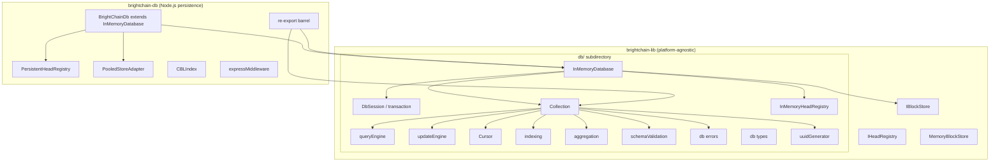
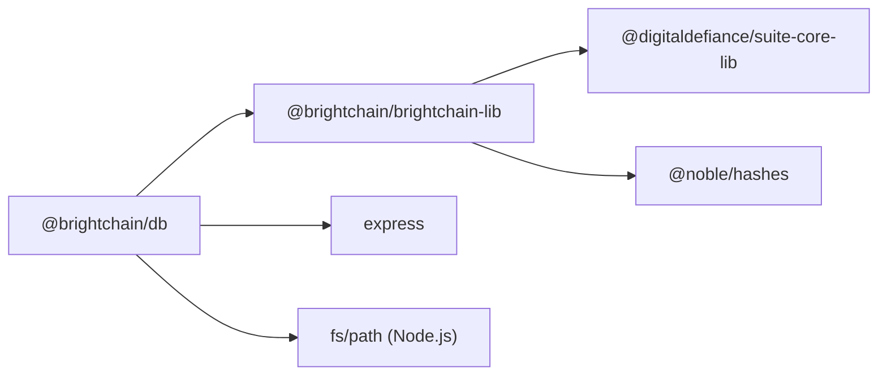

# Design Document: db-core-to-lib

## Overview

This design describes how to extract the platform-agnostic core database engine from `brightchain-db` into `brightchain-lib`, placing the relocated modules under a `db/` subdirectory (`brightchain-lib/src/lib/db/`). After migration, `brightchain-db` becomes a thin persistence shell that re-exports the core engine and adds Node.js-specific disk I/O.

The migration touches 10 source modules (queryEngine, updateEngine, cursor, indexing, aggregation, schemaValidation, errors, transaction, collection, headRegistry/InMemoryHeadRegistry), their associated types, and the `BrightChainDb` class which is split into an `InMemoryDatabase` base in `brightchain-lib` and a persistence-aware subclass remaining in `brightchain-db`.

### Key Design Decisions

1. **`db/` subdirectory in brightchain-lib** — All relocated modules live under `brightchain-lib/src/lib/db/` with a barrel `index.ts`. This keeps the database engine self-contained and makes a future `@digitaldefiance/brightchain-db-core` library extraction trivial.

2. **UUID injection via constructor options** — Instead of importing `crypto.randomUUID` directly, `InMemoryDatabase`, `Collection`, and `DbSession` accept an optional `UuidGenerator` function. The default uses `globalThis.crypto.randomUUID()` with a fallback to `crypto.getRandomValues`-based UUID v4.

3. **`@noble/hashes/sha3` for block ID calculation** — Already a dependency of `brightchain-lib`. The `calculateBlockId` helper moves as-is with no new dependencies.

4. **Re-export layer in brightchain-db** — `brightchain-db/src/index.ts` re-exports everything from `brightchain-lib`'s `db/` barrel plus its own persistence-specific modules, preserving the existing public API surface.

## Architecture



### Module Relocation Map

| Current Location (brightchain-db) | New Location (brightchain-lib) |
|---|---|
| `src/lib/queryEngine.ts` | `src/lib/db/queryEngine.ts` |
| `src/lib/updateEngine.ts` | `src/lib/db/updateEngine.ts` |
| `src/lib/cursor.ts` | `src/lib/db/cursor.ts` |
| `src/lib/indexing.ts` | `src/lib/db/indexing.ts` |
| `src/lib/aggregation.ts` | `src/lib/db/aggregation.ts` |
| `src/lib/schemaValidation.ts` | `src/lib/db/schemaValidation.ts` |
| `src/lib/errors.ts` | `src/lib/db/errors.ts` |
| `src/lib/transaction.ts` | `src/lib/db/transaction.ts` |
| `src/lib/collection.ts` | `src/lib/db/collection.ts` |
| `src/lib/headRegistry.ts` (InMemoryHeadRegistry only) | `src/lib/db/inMemoryHeadRegistry.ts` |
| `src/lib/types.ts` (platform-agnostic subset) | `src/lib/db/types.ts` |
| N/A (new) | `src/lib/db/inMemoryDatabase.ts` |
| N/A (new) | `src/lib/db/uuidGenerator.ts` |
| N/A (new) | `src/lib/db/index.ts` (barrel) |

### Modules Remaining in brightchain-db

| Module | Reason |
|---|---|
| `PersistentHeadRegistry` | Uses `fs`, `path` for disk I/O |
| `PooledStoreAdapter` | Adapts pool-scoped block store ops specific to Node.js backend |
| `CBLIndex` | Uses `crypto.randomUUID`, couples to persistence/gossip |
| `expressMiddleware` | Depends on Express types |
| `BrightChainDb` | Extends `InMemoryDatabase`, adds persistence options |


## Components and Interfaces

### 1. `uuidGenerator.ts` (new)

Platform-agnostic UUID generation utility.

```typescript
/**
 * Type alias for a function that produces a UUID v4 string.
 */
export type UuidGenerator = () => string;

/**
 * Returns a default UuidGenerator that uses globalThis.crypto.randomUUID()
 * when available, falling back to a crypto.getRandomValues-based UUID v4.
 */
export function createDefaultUuidGenerator(): UuidGenerator {
  if (
    typeof globalThis !== 'undefined' &&
    globalThis.crypto &&
    typeof globalThis.crypto.randomUUID === 'function'
  ) {
    return () => globalThis.crypto.randomUUID();
  }
  // Fallback: use crypto.getRandomValues (available in all modern browsers and Node 15+)
  return () => {
    const bytes = new Uint8Array(16);
    globalThis.crypto.getRandomValues(bytes);
    bytes[6] = (bytes[6] & 0x0f) | 0x40; // version 4
    bytes[8] = (bytes[8] & 0x3f) | 0x80; // variant 10
    const hex = Array.from(bytes, (b) => b.toString(16).padStart(2, '0')).join('');
    return `${hex.slice(0, 8)}-${hex.slice(8, 12)}-${hex.slice(12, 16)}-${hex.slice(16, 20)}-${hex.slice(20)}`;
  };
}
```

### 2. `InMemoryDatabase` (new, in brightchain-lib)

Implements `IDatabase` using `MemoryBlockStore` and `InMemoryHeadRegistry`. This is the base class that `BrightChainDb` in `brightchain-db` will extend.

```typescript
export interface InMemoryDatabaseOptions {
  name?: string;                    // default: 'brightchain'
  headRegistry?: IHeadRegistry;     // default: new InMemoryHeadRegistry()
  uuidGenerator?: UuidGenerator;    // default: createDefaultUuidGenerator()
  cursorTimeoutMs?: number;         // default: 300000
}

export class InMemoryDatabase implements IDatabase {
  constructor(
    blockStore: IBlockStore,
    options?: InMemoryDatabaseOptions,
  );

  // IDatabase methods
  connect(uri?: string): Promise<void>;
  disconnect(): Promise<void>;
  isConnected(): boolean;
  collection<T extends BsonDocument>(name: string, options?: CollectionOptions): ICollection<T>;
  startSession(): IClientSession;
  withTransaction<R>(fn: (session: IClientSession) => Promise<R>): Promise<R>;
  listCollections(): string[];
  dropCollection(name: string): Promise<boolean>;

  // Additional methods carried over from BrightChainDb
  getHeadRegistry(): IHeadRegistry;
  dropDatabase(): Promise<void>;
  createCursorSession(collectionName: string, docIds: DocumentId[], batchSize?: number): CursorSession;
  getCursorSession(cursorId: string): CursorSession | null;
  getNextBatch(cursorId: string): DocumentId[] | null;
  closeCursorSession(cursorId: string): boolean;
}
```

The implementation is essentially the current `BrightChainDb` class with:
- `import { randomUUID } from 'crypto'` replaced by `UuidGenerator`
- `PooledStoreAdapter` and `PersistentHeadRegistry` references removed
- `isPooledBlockStore` check removed (handled by the subclass)

### 3. `Collection` (relocated)

The existing `Collection` class moves to `brightchain-lib/src/lib/db/collection.ts` with these changes:

- `import { randomUUID } from 'crypto'` → accepts `UuidGenerator` via constructor options or database context
- `import { sha3_512 } from '@noble/hashes/sha3'` stays as-is (already a brightchain-lib dependency)
- All internal imports (`./queryEngine`, `./updateEngine`, etc.) become relative within the `db/` directory
- `calculateBlockId` helper moves alongside the Collection

### 4. `DbSession` (relocated)

The `DbSession` class moves to `brightchain-lib/src/lib/db/transaction.ts` with:
- `import { randomUUID } from 'crypto'` → accepts `UuidGenerator` via constructor parameter
- Exports `JournalOp`, `CommitCallback`, `RollbackCallback` types

### 5. `InMemoryHeadRegistry` (relocated)

Extracted from `headRegistry.ts` into `brightchain-lib/src/lib/db/inMemoryHeadRegistry.ts`. The class already implements `IHeadRegistry` (defined in `brightchain-lib/src/lib/interfaces/storage/headRegistry.ts`) and has zero Node.js imports. `PersistentHeadRegistry` stays in `brightchain-db`.

### 6. Pure-Logic Modules (relocated as-is)

These modules have zero Node.js dependencies and move with only import path changes:

- **queryEngine.ts** — `matchesFilter`, `applyProjection`, `sortDocuments`, `tokenize`, `matchesTextSearch`, etc.
- **updateEngine.ts** — `applyUpdate`, `isOperatorUpdate` (imports `deepEquals` from queryEngine)
- **cursor.ts** — `Cursor` class (imports from queryEngine)
- **indexing.ts** — `CollectionIndex`, `IndexManager`, `DuplicateKeyError`
- **aggregation.ts** — `runAggregation` and pipeline stage functions (imports from queryEngine; `$lookup` stage uses a `CollectionResolver`)
- **schemaValidation.ts** — `validateDocument`, `applyDefaults`, `matchesSchemaType`
- **errors.ts** — `BrightChainDbError`, `DocumentNotFoundError`, `ValidationError`, `TransactionError`, `IndexError`, `WriteConcernError`, `BulkWriteError`

### 7. `BrightChainDb` (remains in brightchain-db, refactored)

```typescript
import { InMemoryDatabase, InMemoryDatabaseOptions } from '@brightchain/brightchain-lib';

export interface BrightChainDbOptions extends InMemoryDatabaseOptions {
  dataDir?: string;       // for PersistentHeadRegistry
  poolId?: PoolId;        // for PooledStoreAdapter
}

export class BrightChainDb extends InMemoryDatabase {
  constructor(blockStore: IBlockStore, options?: BrightChainDbOptions) {
    // If poolId provided and store is pooled, wrap with PooledStoreAdapter
    // If dataDir provided and no explicit headRegistry, create PersistentHeadRegistry
    super(resolvedStore, resolvedOptions);
  }
}
```

### 8. Re-export Barrel in brightchain-db

`brightchain-db/src/index.ts` re-exports everything from `@brightchain/brightchain-lib`'s db barrel plus its own persistence modules, ensuring no removed exports.

### 9. brightchain-lib Barrel Update

`brightchain-lib/src/lib/index.ts` adds:
```typescript
export * from './db';
```

This exposes all core engine types and classes from the top-level `@brightchain/brightchain-lib` import.


## Data Models

### Types Relocation

The `brightchain-db/src/lib/types.ts` file currently re-exports types from two sources:

1. **From `@brightchain/brightchain-lib`** (already platform-agnostic): `BsonDocument`, `DocumentId`, `FieldSchema`, `ValidationFieldError`
2. **From `@digitaldefiance/suite-core-lib`** (storage interfaces): `AggregationStage`, `BulkWriteOperation`, `FilterQuery`, `IClientSession`, `CollectionOptions`, `CollectionSchema`, etc.

The relocated `brightchain-lib/src/lib/db/types.ts` will re-export the same types from the same sources. No type definitions change — only the file location moves.

### New Types

```typescript
// brightchain-lib/src/lib/db/uuidGenerator.ts
export type UuidGenerator = () => string;

// brightchain-lib/src/lib/db/inMemoryDatabase.ts
export interface InMemoryDatabaseOptions {
  name?: string;
  headRegistry?: IHeadRegistry;
  uuidGenerator?: UuidGenerator;
  cursorTimeoutMs?: number;
}
```

### Existing Types (unchanged, relocated)

```typescript
// brightchain-lib/src/lib/db/errors.ts — all error classes preserve their shape
export class BrightChainDbError extends Error { code: number; }
export class DocumentNotFoundError extends BrightChainDbError { documentId: string; collection: string; }
export class ValidationError extends BrightChainDbError { validationErrors: ValidationFieldError[]; collection: string; }
export class TransactionError extends BrightChainDbError { sessionId?: string; }
export class IndexError extends BrightChainDbError { indexName?: string; }
export class WriteConcernError extends BrightChainDbError { writeConcern: WriteConcernSpec; }
export class BulkWriteError extends BrightChainDbError { writeErrors: BulkWriteOperationError[]; successCount: number; }

// brightchain-lib/src/lib/db/transaction.ts — journal types preserved
export type JournalOp = { type: 'insert'; ... } | { type: 'update'; ... } | { type: 'delete'; ... };
export type CommitCallback = (journal: JournalOp[]) => Promise<void>;
export type RollbackCallback = (journal: JournalOp[]) => Promise<void>;
```

### Dependency Graph After Migration



`brightchain-lib` gains no new dependencies. `@noble/hashes` is already present. The `@digitaldefiance/suite-core-lib` dependency is already declared (it provides `IDatabase`, `ICollection`, and all the document/query types).


## Correctness Properties

*A property is a characteristic or behavior that should hold true across all valid executions of a system — essentially, a formal statement about what the system should do. Properties serve as the bridge between human-readable specifications and machine-verifiable correctness guarantees.*

### Property 1: Custom UUID generator injection

*For any* `UuidGenerator` function provided to `InMemoryDatabase` (or `Collection` / `DbSession`), all IDs generated by that component (session IDs, document `_id` values) should be produced by calling the injected generator, not by any other source.

**Validates: Requirements 2.4, 3.2, 5.2**

### Property 2: Default UUID generator produces valid UUID v4

*For any* number of invocations of the default `UuidGenerator` (created by `createDefaultUuidGenerator`), every returned string should match the UUID v4 format: `xxxxxxxx-xxxx-4xxx-[89ab]xxx-xxxxxxxxxxxx`.

**Validates: Requirements 7.3, 7.4**

### Property 3: DbSession commit/abort journal semantics

*For any* sequence of `JournalOp` entries added to a `DbSession`, committing the transaction should invoke the commit callback with all journal entries in order, and aborting should invoke the rollback callback and leave the journal empty. After either operation, `inTransaction` should be `false`.

**Validates: Requirements 5.3**

### Property 4: Document storage round-trip

*For any* valid `BsonDocument` (with string, number, boolean, nested object, and array fields), inserting it via `insertOne` on a `Collection` backed by `MemoryBlockStore` and retrieving it via `findById` using the returned `_id` should produce a document with field values equivalent to the original (ignoring the assigned `_id`).

**Validates: Requirements 8.5, 3.4**

### Property 5: calculateBlockId matches sha3_512

*For any* byte array, `calculateBlockId(data)` should produce the same hex string as `Buffer.from(sha3_512(data)).toString('hex')`, confirming the relocated helper uses `@noble/hashes/sha3` correctly.

**Validates: Requirements 10.1**

## Error Handling

### Error Class Hierarchy (relocated as-is)

All error classes in `brightchain-db/src/lib/errors.ts` move to `brightchain-lib/src/lib/db/errors.ts` with identical behavior:

| Error Class | Code | When Thrown |
|---|---|---|
| `BrightChainDbError` | varies | Base class for all db errors |
| `DocumentNotFoundError` | 404 | `findById` with non-existent ID |
| `ValidationError` | 121 | Document fails schema validation |
| `TransactionError` | 251 | Invalid transaction operation (e.g., commit without active txn) |
| `IndexError` | 86 | Index operation failure |
| `WriteConcernError` | 64 | Write concern unsatisfied |
| `BulkWriteError` | 65 | One or more bulk write ops fail |
| `DuplicateKeyError` | (from indexing) | Unique index constraint violated |

### Error Handling Strategy

- **No new error types** are introduced. The migration preserves the existing error hierarchy.
- **InMemoryDatabase** throws the same errors as `BrightChainDb` for invalid operations (e.g., `startSession` on ended session).
- **UUID generation fallback** — if neither `globalThis.crypto.randomUUID` nor `globalThis.crypto.getRandomValues` is available, the `createDefaultUuidGenerator` function throws a descriptive `Error` at construction time rather than failing silently at runtime.
- **Re-export compatibility** — consumers catching `instanceof BrightChainDbError` from `@brightchain/db` will still work because the re-export points to the same class definition in `brightchain-lib`.

## Testing Strategy

### Dual Testing Approach

Both unit tests and property-based tests are required for comprehensive coverage.

**Unit tests** focus on:
- IDatabase conformance (InMemoryDatabase has all IDatabase methods)
- ICollection conformance (Collection has all ICollection methods)
- IHeadRegistry conformance (InMemoryHeadRegistry has all IHeadRegistry methods)
- Connection lifecycle state transitions (connect/disconnect idempotency)
- Re-export verification (brightchain-db barrel exports match pre-migration surface)
- No Node.js imports in relocated modules (static analysis)
- Edge case: UUID fallback when `globalThis.crypto.randomUUID` is unavailable

**Property-based tests** focus on:
- Universal properties that hold for all valid inputs (see Correctness Properties above)
- Each property test runs a minimum of 100 iterations

### Property-Based Testing Configuration

- **Library**: `fast-check` (already used in the project — see existing `*.property.spec.ts` files)
- **Minimum iterations**: 100 per property (`{ numRuns: 100 }`)
- **Tag format**: Each test is annotated with a comment: `Feature: db-core-to-lib, Property {N}: {title}`
- **Each correctness property is implemented by a single property-based test**

### Test File Locations

| Test | Location |
|---|---|
| InMemoryDatabase IDatabase conformance | `brightchain-lib/src/lib/db/__tests__/idatabase-conformance.spec.ts` |
| Collection ICollection conformance | `brightchain-lib/src/lib/db/__tests__/icollection-conformance.spec.ts` |
| Document round-trip property | `brightchain-lib/src/lib/db/__tests__/document-roundtrip.property.spec.ts` |
| UUID generator property | `brightchain-lib/src/lib/db/__tests__/uuid-generator.property.spec.ts` |
| DbSession journal property | `brightchain-lib/src/lib/db/__tests__/transaction-journal.property.spec.ts` |
| calculateBlockId property | `brightchain-lib/src/lib/db/__tests__/calculate-block-id.property.spec.ts` |
| Re-export compatibility | `brightchain-db/src/lib/__tests__/reexport-compat.spec.ts` |
| Existing relocated tests | `brightchain-lib/src/lib/db/__tests__/` (moved from `brightchain-db/src/lib/__tests__/`) |

### Test Migration Strategy

1. Move existing pure-logic tests from `brightchain-db/src/lib/__tests__/` to `brightchain-lib/src/lib/db/__tests__/`
2. Update imports in moved tests to use relative paths within `brightchain-lib`
3. Add new conformance and property tests for `InMemoryDatabase`
4. Keep persistence-specific tests (e.g., `PersistentHeadRegistry` tests) in `brightchain-db`
5. Add a re-export compatibility test in `brightchain-db` that verifies all expected symbols are still exported
