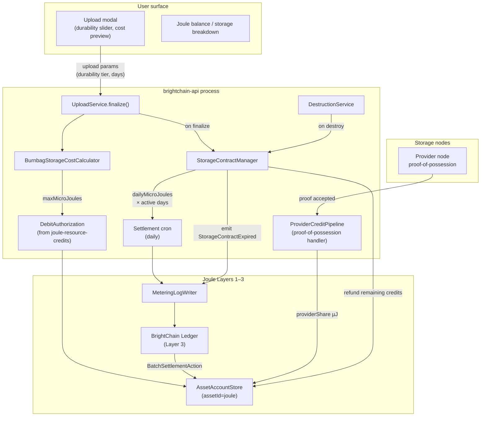

# Design — Digital Burnbag Joule Storage Economy

## Overview

This spec wires the three-layer Joule infrastructure
(`asset-account-store-generalization` → `metering-log` → `programmable-asset-ledger`)
into Digital Burnbag's upload, storage, and destruction lifecycle.

The result: every Burnbag file costs Joules to store (charged upfront for the
committed duration, then daily thereafter), storage nodes earn Joules for
successfully serving proof-of-possession challenges, and users who set a burn
date automatically receive a reduced-cost FROZEN tier that refunds their
remaining contract credits upon destruction.

**No new ledger primitives are introduced.** This spec is application code on
top of Layers 1–3 exactly as `joule-resource-credits` is — it just extends
the same capture pipeline with a `storage` resource class and a new
`StorageContractManager` for the recurring settlement side.

### Layer position

```
L3  programmable-asset-ledger     (settlement, issuance, governance)
L2  metering-log                  (capture, batching, hash-chain)
L1  AssetAccountStore(joule)      (operational balance, reservations)
    ↑
    joule-resource-credits        (rate table, capture middleware, debit-auth)
    ↑
 ── THIS SPEC ──────────────────────────────────────────────────────
    digitalburnbag-joule-storage-economy
      BurnbagStorageCostCalculator  (Burnbag-to-energy-protocol adapter)
      StorageContractManager        (recurring daily settlement)
      ProviderCreditPipeline        (earn Joules for hosting)
      Upload flow integration       (debit-auth at upload, refund on destroy)
      React upload modal extensions (durability + cost preview)
```

## Architecture



## Components

### `digitalburnbag-lib/src/lib/joule/`

Browser-safe, shared with desktop client and React.

#### `burnbagDurability.ts`

Maps Burnbag user-facing concepts to the existing `DurabilityLevel` enum and
cost multipliers defined in the energy protocol:

```ts
import { DurabilityLevel } from '@digitaldefiance/brightchain-lib';

/** User-visible storage tier choices in the upload UI. */
export type BurnbagStorageTier =
  | 'performance'   // maps to DurabilityLevel.HOT   — 2.0×
  | 'standard'      // maps to DurabilityLevel.WARM  — 1.0×
  | 'archive'       // maps to DurabilityLevel.COLD  — 0.5×
  | 'pending-burn'; // maps to DurabilityLevel.FROZEN — 0.25×

export const BURNBAG_TIER_TO_DURABILITY: Record<BurnbagStorageTier, DurabilityLevel> = {
  'performance': DurabilityLevel.HOT,
  'standard':    DurabilityLevel.WARM,
  'archive':     DurabilityLevel.COLD,
  'pending-burn': DurabilityLevel.FROZEN,
};

/**
 * Reed-Solomon parameters for each storage tier.
 * k = data shards, m = parity shards.
 * Any k shards (out of k+m) are sufficient to reconstruct the file.
 * Overhead factor = (k+m)/k — this directly drives the storage cost multiplier.
 *
 * | Tier         | k  | m | overhead | node failures tolerated |
 * |---|---|---|---|---|
 * | performance  | 10 | 6 | 1.60×    | 6                       |
 * | standard     |  8 | 4 | 1.50×    | 4                       |
 * | archive      |  6 | 2 | 1.33×    | 2                       |
 * | pending-burn |  4 | 1 | 1.25×    | 1                       |
 *
 * Encoding is performed by FecServiceFactory.getBestAvailable() — NativeRsFecService
 * on Apple Silicon, WasmFecService on all other platforms.
 */
export interface IBurnbagRsParams {
  readonly k: number;   // data shards
  readonly m: number;   // parity shards
}

export const BURNBAG_TIER_RS_PARAMS: Record<BurnbagStorageTier, IBurnbagRsParams> = {
  'performance': { k: 10, m: 6 },
  'standard':    { k:  8, m: 4 },
  'archive':     { k:  6, m: 2 },
  'pending-burn':{ k:  4, m: 1 },
};

/**
 * When a burn date is set on a file, its effective tier is automatically
 * downgraded to FROZEN regardless of what the user originally selected.
 * This makes burn-dated files cheaper and incentivises users to commit.
 */
export function effectiveTier(
  userTier: BurnbagStorageTier,
  hasBurnDate: boolean,
): BurnbagStorageTier {
  return hasBurnDate ? 'pending-burn' : userTier;
}
```

#### `burnbagStorageCost.ts`

The Burnbag-specific adapter over the generic energy-protocol constants.
All arithmetic in `bigint` microjoules.

```ts
export interface IBurnbagStorageCostParams {
  /** File size in bytes */
  bytes: bigint;
  /** User-selected or effective storage tier. RS params are derived from this. */
  tier: BurnbagStorageTier;
  /** Committed storage duration in days */
  durationDays: number;
  /**
   * Override RS data shards (defaults to BURNBAG_TIER_RS_PARAMS[tier].k).
   * Only used during auto-RS-upgrade transitions; normal callers omit this.
   */
  rsK?: number;
  /**
   * Override RS parity shards (defaults to BURNBAG_TIER_RS_PARAMS[tier].m).
   * Only used during auto-RS-upgrade transitions; normal callers omit this.
   */
  rsM?: number;
}

export interface IBurnbagStorageCost {
  /** Up-front charge covering the full committed duration */
  upfrontMicroJoules: bigint;
  /** Ongoing charge per day (used for contract renewal / settlement) */
  dailyMicroJoules: bigint;
  /** Actual data shards used (k) */
  rsK: number;
  /** Actual parity shards used (m) */
  rsM: number;
  /** Overhead fraction as a display string, e.g. "1.50×" */
  overheadDisplay: string;
  /** Display-safe effective tier used (may differ from user selection) */
  effectiveTier: BurnbagStorageTier;
}

export function calculateBurnbagStorageCost(
  params: IBurnbagStorageCostParams,
): IBurnbagStorageCost;
```

**Formula (exact integer arithmetic):**

Let:

- $B$ = `bytes`
- $D_{tier}$ = durability multiplier × 1000 (integer)  
  (HOT=2000, WARM=1000, COLD=500, FROZEN=250)
- $k$ = `rsK` (data shards, default from `BURNBAG_TIER_RS_PARAMS[tier].k`)
- $m$ = `rsM` (parity shards, default from `BURNBAG_TIER_RS_PARAMS[tier].m`)
- $\text{BASE\_RATE}$ = 500 µJ per GB-day (= $5 \times 10^{-7}$ J/byte/day, integer-scaled)

$$
\text{daily}_{\mu J} = \left\lceil \frac{B \times \text{BASE\_RATE} \times D_{tier} \times (k + m)}{10^9 \times 1000 \times k} \right\rceil
$$

$$
\text{upfront}_{\mu J} = \text{daily}_{\mu J} \times \text{durationDays}
$$

In BigInt TypeScript:

```ts
const rsOverheadNum = BigInt(rsK + rsM);   // numerator of (k+m)/k
const rsOverheadDen = BigInt(rsK);          // denominator
const daily = ceilDiv(
  bytes * BASE_RATE * durabilityMul1000 * rsOverheadNum,
  1_000_000_000n * 1000n * rsOverheadDen,
);
```

All divisions round up (ceiling) to prevent a zero charge for sub-GB files.

#### `burnbagStorageRates.ts`

Named constants matching `ENERGY_CONSTANTS` in `brightchain-lib`:

```ts
export const STORAGE_BASE_RATE_UJ_PER_GB_DAY = 500n;      // µJ
export const STORAGE_HOT_MUL_1000    = 2000n;
export const STORAGE_WARM_MUL_1000   = 1000n;
export const STORAGE_COLD_MUL_1000   =  500n;
export const STORAGE_FROZEN_MUL_1000 =  250n;
export const STORAGE_MIN_CHARGE_UJ   = 1n;        // floor: never zero

// RS tier overhead factors (k+m)/k expressed as exact fractions:
// performance (HOT)  RS(10,6): 16/10 = 1.60×
// standard    (WARM) RS(8,4):  12/8  = 1.50×
// archive     (COLD) RS(6,2):   8/6  = 1.33×
// pending-burn(FRZN) RS(4,1):   5/4  = 1.25×
// These are NOT separate constants — derived from IBurnbagRsParams at call time.
```

---

### `digitalburnbag-lib/src/lib/joule/storageContract.ts`

The `StorageContract` record type, adapted from Section 5 of the energy
protocol for the Burnbag context. Stored in BrightDB under the
`burnbag_storage_contracts` collection.

```ts
export interface IBurnbagStorageContract {
  readonly contractId: string;         // UUID
  readonly fileId: string;
  readonly ownerId: string;
  readonly createdAt: Date;
  expiresAt: Date;                     // updated on renewal
  readonly committedDays: number;      // original up-front window

  // Storage parameters
  readonly bytes: bigint;
  tier: BurnbagStorageTier;            // mutable: can downgrade on burn-date set
  rsK: number;                         // mutable: upgraded by AUTO_RS_UPGRADE
  rsM: number;                         // mutable: upgraded by AUTO_RS_UPGRADE

  // Joule economics
  readonly upfrontMicroJoules: bigint;
  readonly dailyMicroJoules: bigint;
  remainingCreditMicroJoules: bigint;  // decremented daily; refundable on destroy
  survivalFundMicroJoules: bigint;      // accumulates from download bandwidth fees
  autoRenew: boolean;

  // Provider tracking
  providerNodeIds: string[];           // nodes currently hosting this file

  // Lifecycle
  status: 'active' | 'expired' | 'destroyed' | 'suspended';
  lastSettledAt: Date;
}
```

---

### `digitalburnbag-api-lib/src/lib/joule/`

Server-side services. All depend on `DebitAuthorization` and `JouleEarnService`
from `joule-resource-credits`.

#### `BurnbagStorageContractManager`

```ts
class BurnbagStorageContractManager {
  /** Called by UploadService.finalize after file is written. */
  async createContract(params: ICreateContractParams): Promise<IBurnbagStorageContract>;

  /** Daily cron: charge `dailyMicroJoules` from owner; update `lastSettledAt`. */
  async settleDaily(contractId: string): Promise<void>;

  /** Called by DestructionService.destroyFile. Refunds remaining credits. */
  async expireOnDestruction(contractId: string): Promise<void>;

  /** Called when user sets a burn date: downgrade tier to 'pending-burn'. */
  async applyBurnDateDowngrade(contractId: string): Promise<void>;

  /** Extend contract duration (owner pays additional upfront). */
  async extendContract(contractId: string, additionalDays: number): Promise<void>;

  /** Reaper: expire contracts with zero credits and autoRenew=false. */
  async expireStaleContracts(): Promise<string[]>;
}
```

Settlement flow for daily cron:

1. Load active contracts whose `lastSettledAt < now - 24h`.
2. For each: `DebitAuthorization.capture(opId, dailyMicroJoules)` from owner account.
3. If capture fails (`INSUFFICIENT_JOULE`): mark contract `status: 'suspended'`; notify owner.
4. Emit `resource_event` to metering-log with `resourceClass: 'storage'`, `units: bytes`, so Layer 3 ledger records the debit.
5. Distribute `providerShare` of the daily fee to provider nodes via `JouleEarnService.grant()`.

#### `ProviderCreditPipeline`

Called when a storage node passes a proof-of-possession (PoP) challenge.

```ts
class ProviderCreditPipeline {
  /**
   * Award the node its proportional share of the daily storage fee for
   * the contracts it currently hosts.
   *
   * earns = dailyMicroJoules * PROVIDER_SHARE_FRACTION
   * split evenly across all active provider nodes for the contract.
   */
  async awardProviderEarning(
    nodeId: string,
    contractId: string,
    periodEndMs: number,
  ): Promise<void>;
}
```

Revenue split constants (from energy-protocol `DEFAULT_REVENUE_SHARE`):

```ts
export const PROVIDER_SHARE_FRACTION  = 30n;   // 30% to storage providers
export const OWNER_SHARE_FRACTION     = 40n;   // 40% to file owner
export const NETWORK_SHARE_FRACTION   = 20n;   // 20% to bandwidth/network fund
export const PROTOCOL_SHARE_FRACTION  = 10n;   // 10% to protocol maintenance fund
// All out of 100n
```

#### `BurnbagUploadCostEstimator`

Optional early-reject pre-screen used on `POST /upload/init` to fail fast when
the declared `totalSizeBytes` clearly exceeds the member's Joule balance.
**This is an estimate only** — the authoritative cost and Joule reservation are
computed inside `UploadService.quote()` using `blockAlignedBytes` (the actual
encrypted, block-aligned byte count after assembly).

```ts
export function burnbagUploadCostEstimator(req: Request): bigint {
  const { totalSizeBytes, durabilityTier, durationDays } = req.body;
  const cost = calculateBurnbagStorageCost({
    bytes: BigInt(totalSizeBytes),
    tier: durabilityTier,
    durationDays,
    // Uses declared file size — actual charge at quote() may differ due to
    // block alignment and AES-GCM overhead.
  });
  return cost.upfrontMicroJoules;
}
```

---

### `IFileMetadataBase` extensions

Two new fields added to `digitalburnbag-lib/src/lib/interfaces/bases/file-metadata.ts`:

```ts
/** User-selected durability tier; auto-downgraded to 'pending-burn' when burnDate set */
storageTier?: BurnbagStorageTier;
/** RS data shards (k). Defaults to BURNBAG_TIER_RS_PARAMS[storageTier].k if absent. */
rsK?: number;
/** RS parity shards (m). Defaults to BURNBAG_TIER_RS_PARAMS[storageTier].m if absent. */
rsM?: number;
```

These are optional so existing records are valid without migration.
`storageTier` defaults to `'standard'` when absent. `rsK`/`rsM` default to the
tier's canonical RS params; they diverge only when `AUTO_RS_UPGRADE` has run.

---

### Upload escrow model

When `BURNBAG_JOULE_ENABLED=true`, upload commit is split into three explicit
phases instead of a single `finalize` call. The declared `totalSizeBytes` is
only an approximation; the actual storage cost depends on the block-aligned
encrypted size and RS shard layout. The escrow pattern lets the server compute
exact costs before any Joules are permanently spent, giving the user a chance
to approve or cancel.

**Upload escrow phases:**

| Phase | Client call | Session state transition |
|---|---|---|
| 1 — quote | `POST /upload/{id}/quote` | `uploading` → `quoted` |
| 2 — commit | `POST /upload/{id}/commit` | `quoted` → committed (session deleted) |
| 2alt — discard | `POST /upload/{id}/discard` | `quoted` → discarded (session deleted) |

**Exact cost inputs (computed inside `quote()`):**

| Symbol | Meaning |
|---|---|
| `encryptedBytes` | `plaintextBytes + 12` (IV) `+ 16` (GCM tag) |
| `blockAlignedBytes` | `ceil(encryptedBytes / BLOCK_SIZE) × BLOCK_SIZE` — actual disk footprint |
| `shardSize` | `blockAlignedBytes / rsK` — bytes per data shard |
| `totalStoredBytes` | `blockAlignedBytes × (rsK + rsM) / rsK` — bytes written across all shards |

The cost calculator receives `bytes = blockAlignedBytes` (not the declared
`totalSizeBytes`), giving a charge tied to actual disk use rather than the
pre-upload estimate.

#### `IUploadCostQuoteDTO`

Returned by `POST /upload/{sessionId}/quote` (in `digitalburnbag-lib`):

```ts
export interface IUploadCostQuoteDTO {
  sessionId: string;
  // Exact measurements (computed during assembly + encryption)
  plaintextBytes: number;
  encryptedBytes: number;
  blockAlignedBytes: number;
  blockCount: number;             // blockAlignedBytes / BLOCK_SIZE
  shardSize: number;              // blockAlignedBytes / rsK
  rsK: number;
  rsM: number;
  totalShardsStored: number;      // rsK + rsM
  totalStoredBytes: string;       // bigint as string
  // Exact cost (based on blockAlignedBytes, NOT declared file size)
  durabilityTier: BurnbagStorageTier;
  durationDays: number;
  upfrontMicroJoules: string;     // bigint as string
  dailyMicroJoules: string;       // bigint as string
  overheadDisplay: string;        // e.g. "RS(8,4) · 1.50×"
  // Approval window
  quoteExpiresAt: string;         // ISO timestamp: now + BURNBAG_QUOTE_TTL_MS
}
```

#### Session escrow extensions

The following fields are added to `IUploadSessionBase<TID>` in
`digitalburnbag-lib/src/lib/interfaces/bases/upload-session.ts`.
Fields marked `[init]` are required at session creation; fields marked `[quote]`
are populated by `UploadService.quote()`.

```ts
durabilityTier: BurnbagStorageTier;    // [init] from POST /upload/init body
durationDays: number;                   // [init] from POST /upload/init body
state: 'uploading' | 'quoted';          // [init: 'uploading']
// Populated by quote():
quotedAt?: string;                      // ISO timestamp
quoteExpiresAt?: string;                // ISO timestamp: now + BURNBAG_QUOTE_TTL_MS
quotedUpfrontMicroJoules?: string;      // bigint as string — locked at quote time
quotedDailyMicroJoules?: string;        // bigint as string — locked at quote time
quotedBlockAlignedBytes?: number;
quotedRsK?: number;
quotedRsM?: number;
jouleOpId?: string;                     // DebitAuthorization op ID for capture/release
```

The assembled+encrypted ciphertext is stored separately in a
`burnbag_upload_escrow` BrightDB collection indexed on `sessionId` with a TTL
equal to `BURNBAG_QUOTE_TTL_MS`. BrightDB auto-purges it on expiry; the
purge trigger also fires the background Joule reservation release.

---

### Upload flow integration

```mermaid
sequenceDiagram
  participant U as User
  participant CTL as UploadController
  participant SVC as UploadService
  participant CALC as BurnbagStorageCostCalculator
  participant DA as DebitAuthorization
  participant L1 as AssetAccountStore(joule)
  participant SCM as StorageContractManager
  participant L2 as MeteringLog

  U->>CTL: POST /upload/init { fileName, mimeType, totalSizeBytes, durabilityTier, durationDays }
  CTL->>SVC: createSession(userId, ..., durabilityTier, durationDays)
  SVC-->>U: { sessionId, chunkSize, totalChunks }

  loop Upload chunks
    U->>CTL: PUT /upload/{id}/chunk/{n} (data, checksum)
    CTL->>SVC: receiveChunk(...)
    SVC-->>U: progress
  end

  U->>CTL: POST /upload/{id}/quote
  CTL->>SVC: quote(sessionId)
  SVC->>SVC: reassemble chunks → plaintextBytes
  SVC->>SVC: encrypt → encryptedBytes
  SVC->>SVC: blockAlignedBytes = ceil(encryptedBytes / BLOCK_SIZE) × BLOCK_SIZE
  SVC->>CALC: calculateBurnbagStorageCost({ bytes: blockAlignedBytes, tier, durationDays })
  CALC-->>SVC: { upfrontµJ, dailyµJ }
  SVC->>DA: authorize(memberId, opId, upfrontµJ × 1.25)
  DA->>L1: reserve(upfrontµJ × 1.25)
  alt INSUFFICIENT_JOULE
    DA-->>SVC: throw
    SVC-->>U: 402 INSUFFICIENT_JOULE_FOR_STORAGE
  else funds reserved
    SVC->>SVC: store ciphertext in burnbag_upload_escrow (TTL: BURNBAG_QUOTE_TTL_MS)
    SVC->>SVC: session.state = 'quoted'; session.quoteExpiresAt = now + TTL
    SVC-->>U: 200 IUploadCostQuoteDTO (exact amounts + quoteExpiresAt)
  end

  note over U: User reviews exact cost

  alt User approves
    U->>CTL: POST /upload/{id}/commit
    CTL->>SVC: commit(sessionId)
    SVC->>SVC: verify state='quoted' AND quoteExpiresAt > now
    SVC->>SVC: retrieve ciphertext from escrow
    SVC->>SVC: write blocks to permanent IBlockStore
    SVC->>DA: capture(opId, quotedUpfrontMicroJoules)
    DA->>L1: settle(quotedUpfrontMicroJoules)
    DA->>L2: emit resource_event(storage, blockAlignedBytes×durationDays)
    SVC->>SCM: createContract(fileId, upfrontµJ, dailyµJ, ...)
    SVC->>SVC: delete escrow + session
    SVC-->>U: 201 { fileId, metadata }
  else User cancels
    U->>CTL: POST /upload/{id}/discard
    CTL->>SVC: discard(sessionId)
    SVC->>DA: release(opId)
    SVC->>SVC: delete escrow + session
    SVC-->>U: 204 No Content
  else Quote TTL elapsed
    SVC->>DA: release(opId) (background cleanup)
    SVC->>SVC: delete escrow + session
  end
```

When `BURNBAG_JOULE_ENABLED=false`, the legacy `POST /upload/{sessionId}/finalize`
remains available and behaves as before this spec (no approval step, byte-quota only).

### Destruction flow (refund)

When `DestructionService.destroyFile()` is called:

1. Lookup the file's `StorageContract` by `fileId`.
2. Compute `refundMicroJoules = contract.remainingCreditMicroJoules`.
3. If `refund > 0`: call `AssetAccountStore.credit(ownerId, 'joule', refund)` directly (this is a local-only Layer 1 adjustment, not a mint; unused-period return).
4. Mark contract `status: 'destroyed'`; emit `StorageContractDestroyed` to metering-log so Layer 3 audit trail records the refund event.
5. Notify provider nodes they may reclaim disk space.

---

### React upload modal extensions (`digitalburnbag-react-components`)

New components in `digitalburnbag-react-components/src/joule/`:

```
joule/
  StorageTierSelector.tsx       # Radio group with RS params & overhead shown per option
  RsParamsDisplay.tsx           # Read-only: shows RS(k,m), overhead ×, failure tolerance
  StorageDurationPicker.tsx     # Days input (min 1, recommended: 30/90/365)
  StorageCostPreview.tsx        # Live µJ display using formatJoule()
  BurnDateCostNote.tsx          # "Setting a burn date reduces cost to FROZEN tier"
  hooks/
    useStorageCostEstimate.ts   # Calls calculateBurnbagStorageCost client-side
  index.ts
```

`StorageCostPreview` is purely presentational: it calls
`calculateBurnbagStorageCost` directly in the browser (no API round-trip for
the estimate) and displays the result formatted by `formatJoule()`.

---

### Proof-of-possession challenge integration

The existing Burnbag storage provider system performs periodic PoP challenges
(not detailed in this spec; defined in the storage provider spec). This spec
defines only the **earning hook**:

- When a challenge is passed, the provider's node ID and contract ID are
  forwarded to `ProviderCreditPipeline.awardProviderEarning()`.
- The credit is issued via `JouleEarnService.grant()` with
  `reason: 'storage-pop:${contractId}:${periodEnd}'`.
- The `quorumSig` is the existing BrightTrust seal on the PoP challenge result.

---

### Settlement cron

Runs once per 24 hours (configurable via `BURNBAG_SETTLEMENT_INTERVAL_MS`).

```
1. Query StorageContracts where status='active' AND lastSettledAt < now - settlementInterval
2. For each contract:
   a. Compute due = min(dailyMicroJoules, remainingCreditMicroJoules)
   b. Debit owner L1 account by `due` (no reserve — daily settlement is non-optional)
   c. remainingCreditMicroJoules -= due
   d. lastSettledAt = now
   e. Emit resource_event(storage, bytes) to metering-log
   f. Award provider nodes their PROVIDER_SHARE_FRACTION of `due`
3. Expire contracts where remainingCreditMicroJoules=0 AND autoRenew=false
4. Suspend contracts where owner balance insufficient (status='suspended')
5. Emit summary metric: contracts_settled, contracts_expired, contracts_suspended
```

---

### Configuration

```env
BURNBAG_JOULE_ENABLED=true
BURNBAG_SETTLEMENT_INTERVAL_MS=86400000        # 24h
BURNBAG_DEFAULT_TIER=standard                  # implies RS(8,4)
BURNBAG_DEFAULT_DURATION_DAYS=30
BURNBAG_MAX_DURATION_DAYS=3650                 # 10 years
BURNBAG_CONTRACT_SUSPENSION_GRACE_DAYS=3       # warn before suspend
BURNBAG_PROVIDER_SHARE_FRACTION=30             # % of daily fee to storage providers
BURNBAG_RS_UPGRADE_THRESHOLD_DAYS=30           # survival fund must cover 30 days of extra cost
BURNBAG_MAX_BURN_DEFERRAL_DAYS=365             # max days burn date can be pushed by survival fund
BURNBAG_QUOTE_TTL_MS=900000                    # 15 min approval window for upload cost quotes
```

---

### Error codes

| Code | HTTP | Meaning |
|---|---|---|
| `INSUFFICIENT_JOULE_FOR_STORAGE` | 402 | member cannot cover upfront storage cost |
| `CONTRACT_NOT_FOUND` | 404 | no StorageContract for given fileId |
| `CONTRACT_SUSPENDED` | 402 | daily settlement failed; file access restricted |
| `CONTRACT_EXPIRED` | 410 | contract ended; file is pending destruction |
| `INVALID_DURATION` | 422 | duration < 1 or > `BURNBAG_MAX_DURATION_DAYS` |
| `INVALID_TIER` | 422 | unknown `BurnbagStorageTier` value |
| `BURN_DATE_TIER_CONFLICT` | 409 | user attempted to upgrade tier after burn date set |
| `UPLOAD_NOT_QUOTED` | 409 | `commit()` called before `quote()`; must quote first |
| `UPLOAD_QUOTE_EXPIRED` | 409 | approval window elapsed; call `quote()` again to get a fresh quote |

---

### Out of scope

- Peer-to-peer storage market (users selling unused quota to each other).
- Dynamic repricing of active contracts mid-term (rate table changes only apply to new contracts or renewals).
- Per-chunk granular accounting (contract covers the whole file; chunk-level metering is Layer 2 detail).
- Fiat purchase of Joules (earn path is operator grant only per `joule-resource-credits` Requirement 4).
- Storage provider onboarding / PoP challenge protocol (separate spec).
