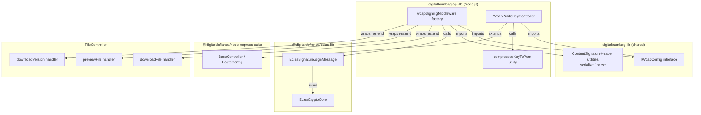
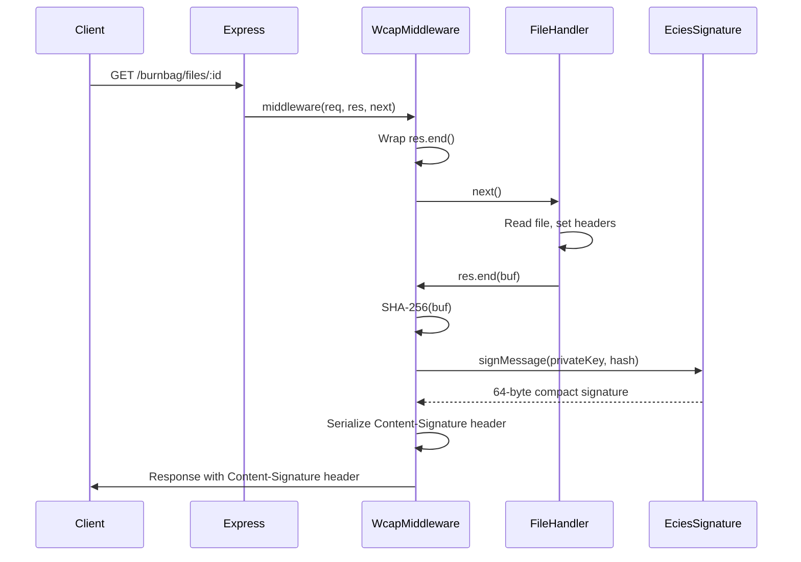

# Design Document: Digital Burnbag WCAP Signing

## Overview

This design adds WCAP (Web Content Authenticity Protocol) signing to the Digital Burnbag's file-serving pipeline. When the Burnbag serves file content via its Express API, the response includes a `Content-Signature` header containing an ECDSA-secp256k1-SHA256 signature of the response body, signed with the authenticated member's identity key.

The implementation consists of four components:

1. **`IWcapConfig` interface** in `digitalburnbag-lib` — shared configuration type for WCAP signing parameters.
2. **`wcapSigningMiddleware` factory** in `digitalburnbag-api-lib` — Express middleware that intercepts `res.end()`, computes SHA-256 of the body, signs it via `EciesSignature.signMessage()`, and attaches the `Content-Signature` header.
3. **`WcapPublicKeyController`** in `digitalburnbag-api-lib` — serves the member's compressed secp256k1 public key in PEM format at `/.well-known/wcap-public-key-secp256k1.pem`.
4. **Header serialization utilities** in `digitalburnbag-lib` — pure functions to serialize and parse `Content-Signature` header values, shared between server and potential future client verifiers.

### Design Rationale

The middleware approach was chosen over modifying each handler because:
- The three file-serving handlers (`downloadFile`, `previewFile`, `downloadVersion`) all call `this.res.status(200).end(buf)` with a buffered body — the middleware can intercept `res.end()` to capture the exact bytes.
- The `RouteConfig` type in `@digitaldefiance/node-express-suite` already supports a `middleware?: RequestHandler[]` field, so per-route middleware can be injected without modifying the BaseController framework.
- Signing is transparent to the handlers — they don't need to know about WCAP.

The `EciesSignature.signMessage()` API accepts `(privateKey: Uint8Array, data: Uint8Array)` and returns a 64-byte compact signature `[r(32) | s(32)]`. The middleware computes `SHA-256(body)` using Node.js `crypto.createHash('sha256')` and passes the 32-byte hash to `signMessage()`. This matches the WCAP protocol flow: hash the body, sign the hash.

## Architecture



### Request Flow



## Components and Interfaces

### IWcapConfig (digitalburnbag-lib)

```typescript
// digitalburnbag-lib/src/lib/interfaces/wcap-config.ts

/**
 * Configuration for WCAP signing on file-serving responses.
 * Shared between frontend and backend — no Node.js dependencies.
 */
export interface IWcapConfig {
  /** Algorithm suite identifier. Default: 'dd-ecies-secp256k1-sha256' */
  algorithmSuite: string;
  /** Relative URI path to the public key endpoint. Default: '/.well-known/wcap-public-key-secp256k1.pem' */
  keyUriPath: string;
  /** Optional key ID for signers with multiple keys */
  kid?: string;
  /** Whether WCAP signing is enabled. Default: true */
  enabled: boolean;
  /**
   * Optional signing policy token to include in the Content-Signature header.
   * MUST be a registered token from the WCAP Signing Policy Registry (Section 13).
   * When set, the Signer declares it performed the verifications described by the policy
   * before signing. Default: undefined (no policy claim).
   * For the Burnbag, use 'decryption-verified'.
   */
  policy?: string;
}

/** Default WCAP configuration values */
export const WCAP_DEFAULTS: Readonly<IWcapConfig> = {
  algorithmSuite: 'dd-ecies-secp256k1-sha256',
  keyUriPath: '/.well-known/wcap-public-key-secp256k1.pem',
  enabled: true,
};
```

### Content-Signature Header Utilities (digitalburnbag-lib)

```typescript
// digitalburnbag-lib/src/lib/interfaces/wcap-header.ts

/**
 * Parsed Content-Signature header parameters.
 */
export interface IContentSignatureParams {
  alg: string;
  key_uri: string;
  sig: string;
  kid?: string;
  /** Optional signing policy token (WCAP Section 13). e.g. 'decryption-verified' */
  policy?: string;
}

/**
 * Serializes Content-Signature header parameters into the WCAP header string format.
 * Format: alg=<alg>; key_uri=<key_uri>; sig=<sig>[; kid=<kid>][; policy=<policy>]
 */
export function serializeContentSignature(params: IContentSignatureParams): string;

/**
 * Parses a Content-Signature header string into its component parameters.
 * Splits on '; ' and extracts key=value pairs.
 * Returns undefined if the header is malformed.
 */
export function parseContentSignature(header: string): IContentSignatureParams | undefined;
```

These are pure functions with no Node.js dependencies, so they live in `digitalburnbag-lib` and can be used by both server-side middleware and future client-side verifiers.

### wcapSigningMiddleware Factory (digitalburnbag-api-lib)

```typescript
// digitalburnbag-api-lib/src/lib/middleware/wcap-signing-middleware.ts

import { createHash } from 'crypto';
import { Request, Response, NextFunction } from 'express';
import { EciesSignature, EciesCryptoCore } from '@digitaldefiance/ecies-lib';
import { IWcapConfig, serializeContentSignature } from '@brightchain/digitalburnbag-lib';

export interface IWcapSigningContext {
  /** Returns the signing member's private key bytes, or undefined if not available */
  getPrivateKey: (req: Request) => Uint8Array | undefined;
  /** WCAP configuration */
  config: IWcapConfig;
  /** Logger for warnings and errors */
  logger?: { warn: (msg: string) => void; error: (msg: string, err?: unknown) => void };
}

/**
 * Creates Express middleware that signs response bodies with WCAP Content-Signature headers.
 *
 * The middleware wraps res.end() to intercept the response body bytes. When the handler
 * calls res.end(buf), the middleware:
 * 1. Checks if the status code is 200
 * 2. Computes SHA-256(buf)
 * 3. Signs the hash with EciesSignature.signMessage()
 * 4. Adds the Content-Signature header
 * 5. Calls the original res.end(buf)
 */
export function createWcapSigningMiddleware(
  context: IWcapSigningContext,
): (req: Request, res: Response, next: NextFunction) => void;
```

**Key implementation details:**

- The middleware wraps `res.end()` by saving the original and replacing it with a function that buffers the body, computes the signature, sets the header, then calls the original `res.end()`.
- If `config.enabled` is `false`, the middleware calls `next()` immediately (no-op).
- If `getPrivateKey(req)` returns `undefined`, the middleware logs a warning and serves without signing.
- If signing throws, the middleware catches the error, logs it, and serves without signing.
- The `EciesSignature` instance is created once in the factory closure (it's stateless aside from its `EciesCryptoCore` dependency).

### Route Integration in FileController

The middleware is applied to the three file-serving routes via the existing `middleware` field on `RouteConfig`:

```typescript
// In FileController.initRouteDefinitions():
protected initRouteDefinitions(): void {
  const auth = { useAuthentication: true, useCryptoAuthentication: false };
  const wcapMiddleware = this.wcapMiddleware ? [this.wcapMiddleware] : [];

  this.routeDefinitions = [
    // Non-file routes — no WCAP middleware
    routeConfig('get', '/search', { handlerKey: 'searchFiles', ...auth }),
    routeConfig('get', '/:id/metadata', { handlerKey: 'getFileMetadata', ...auth }),
    // ...

    // File-serving routes — WCAP middleware applied
    routeConfig('get', '/:id/versions/:versionId/download', {
      handlerKey: 'downloadVersion', ...auth, middleware: wcapMiddleware,
    }),
    routeConfig('get', '/:id/preview', {
      handlerKey: 'previewFile', ...auth, middleware: wcapMiddleware,
    }),
    routeConfig('get', '/:id', {
      handlerKey: 'downloadFile', ...auth, middleware: wcapMiddleware,
    }),
    // ...
  ];
}
```

The `wcapMiddleware` is passed into `FileController` via an extended `IFileControllerDeps` interface:

```typescript
export interface IFileControllerDeps<TID extends PlatformID> {
  fileService: IFileService<TID>;
  parseId: (idString: string) => TID;
  /** Optional WCAP signing middleware — applied to file-serving routes */
  wcapMiddleware?: RequestHandler;
}
```

This keeps the middleware optional and avoids breaking existing code that doesn't use WCAP.

### WcapPublicKeyController (digitalburnbag-api-lib)

```typescript
// digitalburnbag-api-lib/src/lib/controllers/wcap-public-key-controller.ts

/**
 * Serves the signing member's compressed secp256k1 public key in PEM format.
 * Mounted at /.well-known/wcap-public-key-secp256k1.pem
 *
 * - No authentication required (WCAP verifiers fetch independently)
 * - Returns 503 if the member's public key is not available
 * - Sets Cache-Control: public, max-age=86400
 * - Content-Type: application/x-pem-file
 */
```

This controller extends `BaseRouter` (not `BaseController`) since it's a simple GET endpoint with no authentication, no validation, and no handler pipeline. It's registered directly on the Express router in `registerBurnbagRoutesOnRouter()`.

### compressedKeyToPem Utility (digitalburnbag-api-lib)

```typescript
// digitalburnbag-api-lib/src/lib/middleware/compressed-key-to-pem.ts

/**
 * Converts a 33-byte compressed secp256k1 public key to PEM format.
 *
 * Wraps the raw key bytes in a DER-encoded SubjectPublicKeyInfo structure
 * (OID 1.2.840.10045.2.1 for EC, OID 1.3.132.0.10 for secp256k1),
 * then base64-encodes with 64-char line wrapping and PEM armor.
 *
 * The DER prefix for a compressed secp256k1 key is fixed (26 bytes),
 * so the total DER structure is 59 bytes (26 + 33).
 */
export function compressedKeyToPem(compressedKey: Uint8Array): string;

/**
 * Parses a PEM-encoded secp256k1 public key back to the 33-byte compressed form.
 * Returns undefined if the PEM is malformed or the key is not secp256k1.
 */
export function pemToCompressedKey(pem: string): Uint8Array | undefined;
```

The DER prefix for a compressed secp256k1 SubjectPublicKeyInfo is:

```
30 39                          -- SEQUENCE (57 bytes)
  30 10                        -- SEQUENCE (16 bytes)
    06 07 2a 86 48 ce 3d 02 01  -- OID 1.2.840.10045.2.1 (EC)
    06 05 2b 81 04 00 0a        -- OID 1.3.132.0.10 (secp256k1)
  03 25 00                     -- BIT STRING (37 bytes, 0 unused bits)
    <33 bytes compressed key>
```

This is a fixed 26-byte prefix. The utility concatenates this prefix with the 33-byte key, base64-encodes, wraps at 64 characters, and adds PEM armor.

### File Placement Summary

| Component | File Path | Library |
|-----------|-----------|---------|
| `IWcapConfig`, `WCAP_DEFAULTS` | `digitalburnbag-lib/src/lib/interfaces/wcap-config.ts` | digitalburnbag-lib |
| `IContentSignatureParams`, `serializeContentSignature`, `parseContentSignature` | `digitalburnbag-lib/src/lib/interfaces/wcap-header.ts` | digitalburnbag-lib |
| `createWcapSigningMiddleware`, `IWcapSigningContext` | `digitalburnbag-api-lib/src/lib/middleware/wcap-signing-middleware.ts` | digitalburnbag-api-lib |
| `compressedKeyToPem`, `pemToCompressedKey` | `digitalburnbag-api-lib/src/lib/middleware/compressed-key-to-pem.ts` | digitalburnbag-api-lib |
| `WcapPublicKeyController` | `digitalburnbag-api-lib/src/lib/controllers/wcap-public-key-controller.ts` | digitalburnbag-api-lib |
| `validateWcapConfig` | `digitalburnbag-api-lib/src/lib/config/wcapConfig.ts` | digitalburnbag-api-lib |

## Data Models

### IWcapConfig

| Field | Type | Default | Description |
|-------|------|---------|-------------|
| `algorithmSuite` | `string` | `'dd-ecies-secp256k1-sha256'` | WCAP algorithm suite identifier |
| `keyUriPath` | `string` | `'/.well-known/wcap-public-key-secp256k1.pem'` | Relative URI to public key endpoint |
| `kid` | `string \| undefined` | `undefined` | Optional key ID for multi-key signers |
| `enabled` | `boolean` | `true` | Whether WCAP signing is active |
| `policy` | `string \| undefined` | `undefined` | Optional signing policy token (WCAP Section 13). Set to `'decryption-verified'` for the Burnbag. |

### IContentSignatureParams

| Field | Type | Required | Description |
|-------|------|----------|-------------|
| `alg` | `string` | Yes | Algorithm suite identifier |
| `key_uri` | `string` | Yes | Public key URI |
| `sig` | `string` | Yes | Base64-encoded signature |
| `kid` | `string \| undefined` | No | Optional key ID |
| `policy` | `string \| undefined` | No | Optional signing policy token (WCAP Section 13). For the Burnbag, `'decryption-verified'`. |

### Content-Signature Header Wire Format

```
Content-Signature: alg=dd-ecies-secp256k1-sha256; key_uri=/.well-known/wcap-public-key-secp256k1.pem; sig=<88 chars base64>[; kid=<key-id>][; policy=<policy-token>]
```

- Parameters are separated by `; ` (semicolon + space).
- Parameter values are not quoted.
- The `sig` value is standard base64 (RFC 4648 §4) of 64 bytes = 88 characters (with `=` padding).
- The `kid` parameter is appended only when configured.
- The `policy` parameter is appended only when configured. For the Burnbag, this will be `decryption-verified` (WCAP Section 13.3.4), reflecting that the response body was decrypted from ECIES-encrypted block storage before signing.

### PEM Wire Format

```
-----BEGIN PUBLIC KEY-----
MDkwEAYHKoZIzj0CAQYFK4EEAAoDJQA<base64 of 33-byte compressed key>
-----END PUBLIC KEY-----
```

Total DER: 59 bytes (26-byte prefix + 33-byte key). Base64 of 59 bytes = 80 characters, fitting in two 64-char lines.

### Signing Pipeline Data Flow

| Step | Input | Output | Size |
|------|-------|--------|------|
| 1. Buffer body | `res.end(chunk, encoding)` | `Buffer` | Variable |
| 2. SHA-256 hash | `Buffer` (body) | `Uint8Array` (hash) | 32 bytes |
| 3. ECDSA sign | `Uint8Array` (hash) + `Uint8Array` (privateKey) | `Uint8Array` (signature) | 64 bytes |
| 4. Base64 encode | `Uint8Array` (signature) | `string` (base64) | 88 chars |
| 5. Serialize header | `IContentSignatureParams` | `string` (header value) | ~180 chars |

## Correctness Properties

*A property is a characteristic or behavior that should hold true across all valid executions of a system — essentially, a formal statement about what the system should do. Properties serve as the bridge between human-readable specifications and machine-verifiable correctness guarantees.*

### Property 1: Sign-then-verify round-trip

*For any* random body buffer (1 byte to 1 MB) and any valid secp256k1 key pair, computing SHA-256 of the body, signing the hash with `EciesSignature.signMessage(privateKey, hash)`, and then verifying the signature with `EciesSignature.verifyMessage(publicKey, hash, signature)` SHALL return `true`.

**Validates: Requirements 1.1, 1.2, 5.3**

### Property 2: Content-Signature header serialization round-trip

*For any* valid `IContentSignatureParams` object (with `alg` as a non-empty ASCII string containing no `=` or `;` characters, `key_uri` as a non-empty ASCII string containing no `=` or `;` characters, `sig` as a base64 encoding of a random 64-byte buffer, and optionally `kid` as a non-empty ASCII string containing no `=` or `;` characters), calling `serializeContentSignature(params)` and then `parseContentSignature(result)` SHALL produce an object with identical `alg`, `key_uri`, `sig`, and `kid` values.

**Validates: Requirements 1.3, 1.4, 7.1, 7.2, 7.5, 11.1, 11.2, 11.3**

### Property 3: Middleware preserves response integrity

*For any* set of pre-existing response headers (random key-value pairs), any HTTP 200 status code, and any body buffer, the WCAP signing middleware SHALL preserve all pre-existing headers, the status code, and the exact body bytes in the response sent to the client. The only addition SHALL be the `Content-Signature` header.

**Validates: Requirements 2.3**

### Property 4: Public key PEM encoding round-trip

*For any* valid 33-byte compressed secp256k1 public key (first byte 0x02 or 0x03, remaining 32 bytes arbitrary), calling `compressedKeyToPem(key)` and then `pemToCompressedKey(pem)` SHALL produce a byte sequence identical to the original key.

**Validates: Requirements 3.2, 8.1, 8.2, 8.3**

### Property 5: Non-200 responses are not signed

*For any* HTTP status code that is not 200 (randomly chosen from 100–199, 201–599), the WCAP signing middleware SHALL NOT add a `Content-Signature` header to the response.

**Validates: Requirements 6.2**

## Error Handling

| Error Condition | Behavior | Requirement |
|----------------|----------|-------------|
| `config.enabled === false` | Middleware calls `next()` immediately, no signing | 4.2 |
| `getPrivateKey(req)` returns `undefined` | Log warning, serve response without `Content-Signature` header | 1.6 |
| `EciesSignature.signMessage()` throws | Catch error, log error, serve response without `Content-Signature` header | 1.7 |
| `crypto.createHash('sha256')` throws | Caught by the same try/catch as signing, same behavior | 1.7 |
| `config.algorithmSuite` is not `dd-ecies-secp256k1-sha256` | Log warning at startup (via `validateWcapConfig`), middleware still operates | 4.3 |
| Public key not available (member not loaded) | `WcapPublicKeyController` returns HTTP 503 with descriptive JSON error | 3.4 |
| Response status is not 200 | Middleware skips signing, calls original `res.end()` unchanged | 6.2 |
| Response body is empty (0 bytes) | Middleware skips signing (no body to sign) | Implicit from 1.1 |

### Error Logging

The middleware accepts an optional `logger` in `IWcapSigningContext`. When no logger is provided, it falls back to `console.warn` / `console.error`. Log messages include:

- `[WCAP] Signing skipped: private key not available for request ${req.method} ${req.path}`
- `[WCAP] Signing failed for request ${req.method} ${req.path}: ${error.message}`
- `[WCAP] Warning: unsupported algorithm suite '${config.algorithmSuite}'`

## Testing Strategy

### Overview

Testing uses a dual approach: example-based unit tests for specific scenarios and edge cases, and property-based tests for universal correctness guarantees. The project already uses `fast-check` for property-based testing (see existing `*.property.spec.ts` files in `digitalburnbag-api-lib`).

### Property-Based Tests

Each property test runs a minimum of 100 iterations using `fast-check`.

| Property | Test File | Generator Strategy |
|----------|-----------|-------------------|
| Property 1: Sign-then-verify | `wcap-signing-middleware.property.spec.ts` | `fc.uint8Array({ minLength: 1, maxLength: 1_000_000 })` for body, generate secp256k1 key pair via `EciesCryptoCore` |
| Property 2: Header round-trip | `wcap-header.property.spec.ts` | `fc.record({ alg: fc.stringOf(fc.char().filter(c => c !== '=' && c !== ';' && c !== ' '), { minLength: 1 }), key_uri: ..., sig: fc.uint8Array({ minLength: 64, maxLength: 64 }).map(b => Buffer.from(b).toString('base64')), kid: fc.option(...) })` |
| Property 3: Middleware preserves response | `wcap-signing-middleware.property.spec.ts` | Random headers (key-value string pairs), random body buffer, status 200 |
| Property 4: PEM round-trip | `compressed-key-to-pem.property.spec.ts` | `fc.uint8Array({ minLength: 33, maxLength: 33 })` with first byte constrained to 0x02 or 0x03 |
| Property 5: Non-200 not signed | `wcap-signing-middleware.property.spec.ts` | `fc.integer({ min: 100, max: 599 }).filter(s => s !== 200)` for status codes |

Tag format: `Feature: digitalburnbag-wcap-signing, Property {N}: {property text}`

### Unit Tests (Example-Based)

| Test | What It Verifies | File |
|------|------------------|------|
| Middleware adds Content-Signature on 200 | Happy path with known key pair and body | `wcap-signing-middleware.spec.ts` |
| Middleware skips when `enabled=false` | No-op pass-through | `wcap-signing-middleware.spec.ts` |
| Middleware skips when private key missing | Graceful degradation, warning logged | `wcap-signing-middleware.spec.ts` |
| Middleware skips when signing throws | Error caught, error logged | `wcap-signing-middleware.spec.ts` |
| Middleware skips for non-200 status | No header on 404, 500, etc. | `wcap-signing-middleware.spec.ts` |
| Header includes kid when configured | kid parameter present | `wcap-signing-middleware.spec.ts` |
| Header excludes kid when not configured | kid parameter absent | `wcap-signing-middleware.spec.ts` |
| Public key endpoint returns PEM | Correct Content-Type, valid PEM | `wcap-public-key-controller.spec.ts` |
| Public key endpoint returns 503 when unavailable | Descriptive error message | `wcap-public-key-controller.spec.ts` |
| Public key endpoint sets cache headers | `Cache-Control: public, max-age=86400` | `wcap-public-key-controller.spec.ts` |
| Public key endpoint requires no auth | Accessible without token | `wcap-public-key-controller.spec.ts` |
| Config validation warns on unknown algorithm | Warning logged | `wcapConfig.spec.ts` |
| Large body (>10MB) still signed | Edge case for performance requirement | `wcap-signing-middleware.spec.ts` |

### Integration Tests

| Test | What It Verifies |
|------|------------------|
| File download includes Content-Signature | End-to-end through FileController |
| File preview includes Content-Signature | End-to-end through FileController |
| Version download includes Content-Signature | End-to-end through FileController |
| Search endpoint does NOT include Content-Signature | Middleware not applied to non-file routes |
| Metadata endpoint does NOT include Content-Signature | Middleware not applied to non-file routes |

### Test File Locations

All test files go in `digitalburnbag-api-lib/src/lib/__tests__/`:

- `middleware/wcap-signing-middleware.spec.ts`
- `middleware/wcap-signing-middleware.property.spec.ts`
- `middleware/wcap-header.property.spec.ts`
- `middleware/compressed-key-to-pem.property.spec.ts`
- `controller-integration/wcap-public-key-controller.spec.ts`
- `config/wcapConfig.spec.ts`

Shared header utility tests go in `digitalburnbag-lib/src/lib/__tests__/`:

- `wcap-header.spec.ts`
- `wcap-header.property.spec.ts`
