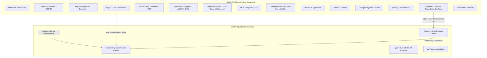

# Design Document: DD-ECIES Specification & WCAP Algorithm Suite Integration

## Overview

This design covers the creation of two specification documents — not code libraries:

1. **DD-ECIES Specification** (`express-suite/packages/digitaldefiance-ecies-lib/docs/DD-ECIES-SPECIFICATION.md`) — A formal, language-agnostic specification that documents the existing `ecies-lib` implementation so any developer can build a compatible implementation without reading the TypeScript source. This is the canonical location, living alongside the library it specifies.

2. **WCAP Algorithm Suite Registry Update** — Modifications to the existing WCAP spec (`WCAP/Web Content Authenticity Protocol (WCAP).md`) to introduce pluggable algorithm suites and register DD-ECIES as the first non-default suite.

3. **ecies-lib README Update** (`express-suite/packages/digitaldefiance-ecies-lib/README.md`) — Add a prominent reference/link to the DD-ECIES specification document in the package README so consumers can find the formal spec.

4. **BrightChain Docs Copy** (`docs/DD-ECIES-SPECIFICATION.md`) — A copy of the DD-ECIES specification placed in the BrightChain project-level docs directory for discoverability by BrightChain contributors. This copy references the canonical version in ecies-lib.

All deliverables are Markdown documents. The DD-ECIES spec is owned and published by Digital Defiance. BrightChain is a consumer, not the owner. The canonical spec lives in the ecies-lib package; the BrightChain docs copy is a convenience reference.

### Design Rationale

The existing `ecies-lib` TypeScript implementation is the source of truth for all cryptographic parameters, wire formats, and algorithms. This design extracts those details into a normative specification document, using RFC 2119 language, byte-level wire format diagrams, and test vectors. The WCAP update introduces an algorithm suite registry modeled after TLS cipher suites, keeping the core protocol algorithm-agnostic while allowing DD-ECIES (and future suites) to be registered without modifying protocol logic.

## Architecture

The deliverables are specification documents, so "architecture" here refers to document structure and cross-referencing, not software components.



### File Location Strategy

| Deliverable | Path | Role |
|-------------|------|------|
| DD-ECIES Specification (canonical) | `express-suite/packages/digitaldefiance-ecies-lib/docs/DD-ECIES-SPECIFICATION.md` | Authoritative spec, lives with the library |
| DD-ECIES Specification (BrightChain copy) | `docs/DD-ECIES-SPECIFICATION.md` | Convenience copy for BrightChain contributors |
| WCAP Specification (updated) | `WCAP/Web Content Authenticity Protocol (WCAP).md` | Protocol spec with new algorithm suite registry |
| ecies-lib README (updated) | `express-suite/packages/digitaldefiance-ecies-lib/README.md` | Links to the DD-ECIES spec |

The canonical DD-ECIES spec lives in the ecies-lib package because it specifies that library's behavior. The BrightChain docs copy includes a header note indicating it is a copy and pointing to the canonical location.

### Cross-Reference Strategy

- The WCAP spec references the DD-ECIES spec by document title and section number for signature format, key format, and cipher suite details.
- The DD-ECIES spec is self-contained — it does not depend on WCAP. WCAP is a consumer.
- Both documents use RFC 2119 key words consistently.
- The ecies-lib README links to the DD-ECIES spec with a brief description of what it covers.
- The BrightChain docs copy includes a header: "This is a copy of the canonical specification at `express-suite/packages/digitaldefiance-ecies-lib/docs/DD-ECIES-SPECIFICATION.md`. If they differ, the canonical version takes precedence."

## Components and Interfaces

Since the deliverables are documents, "components" are document sections and "interfaces" are the wire formats and header structures that implementations must conform to.

### DD-ECIES Specification Sections

| Section | Purpose | Source of Truth |
|---------|---------|-----------------|
| Elliptic Curve Parameters | secp256k1 curve, key formats, validation rules | `constants.ts` — `ECIES.CURVE_NAME`, `PUBLIC_KEY_LENGTH`, `RAW_PUBLIC_KEY_LENGTH` |
| Key Management | BIP39 mnemonic → BIP32/44 HD derivation path | `crypto-core.ts` — `walletAndSeedFromMnemonic()`, path `m/44'/60'/0'/0/0` |
| Signature Scheme | ECDSA-secp256k1-SHA256, RFC 6979, 64-byte compact | `signature.ts` — `signMessage()`, `verifyMessage()` |
| ECDH & KDF | Shared secret (x-coordinate), HKDF-SHA256 | `crypto-core.ts` — `computeSharedSecret()`, `deriveSharedKey()` |
| Symmetric Encryption | AES-256-GCM, 12-byte IV, 16-byte tag | `constants.ts` — `ECIES.SYMMETRIC`, `IV_SIZE`, `AUTH_TAG_SIZE` |
| Basic Mode (0x21) | Single-recipient, no length prefix | `single-recipient.ts` — `encrypt()` with `EciesEncryptionTypeEnum.Basic` |
| WithLength Mode (0x42) | Single-recipient, 8-byte length prefix | `single-recipient.ts` — `encrypt()` with `EciesEncryptionTypeEnum.WithLength` |
| Multiple Mode (0x63) | Multi-recipient key encapsulation | `multi-recipient.ts` — `encryptMultiple()`, `buildHeader()` |
| Checksum | SHA3-512, hex encoding | `constants.ts` — `CHECKSUM` |
| PBKDF2 Profiles | Named parameter sets | `constants.ts` — `PBKDF2_PROFILES` |
| Voting Subsystem | Paillier 3072-bit, deterministic DRBG | `constants.ts` — `VOTING` |
| Registries | Version, CipherSuite, EncryptionType enums | Enum files — `EciesVersionEnum`, `EciesCipherSuiteEnum`, `EciesEncryptionTypeEnum` |

### WCAP Specification Updates

| Update | Purpose |
|--------|---------|
| New Section 12: Algorithm Suite Registry | Defines the registry structure and registers `ecdsa-p256-sha256` (existing default) and `dd-ecies-secp256k1-sha256` (new) |
| Section 6.3 Update: Content-Signature Header | Lists `dd-ecies-secp256k1-sha256` as valid `alg` value, adds optional `kid` parameter |
| Section 4 Update: Quick Start | Adds DD-ECIES example alongside existing P-256 example |
| Section 7 Update: Verifier Requirements | Specifies behavior for unrecognized `alg` values |

### Wire Format Diagrams

#### Basic Mode (0x21) Wire Format

```
 0                   1                   2                   3
 0 1 2 3 4 5 6 7 8 9 0 1 2 3 4 5 6 7 8 9 0 1 2 3 4 5 6 7 8 9 0 1
+-+-+-+-+-+-+-+-+-+-+-+-+-+-+-+-+-+-+-+-+-+-+-+-+-+-+-+-+-+-+-+-+
| [Optional Preamble ... variable length]                       |
+-+-+-+-+-+-+-+-+-+-+-+-+-+-+-+-+-+-+-+-+-+-+-+-+-+-+-+-+-+-+-+-+
|   Version(1)  | CipherSuite(1)|    Type(1)    |               |
+-+-+-+-+-+-+-+-+-+-+-+-+-+-+-+-+-+-+-+-+-+-+-+-+               +
|                                                               |
+              Ephemeral Public Key (33 bytes)                  +
|                                                               |
+-+-+-+-+-+-+-+-+-+-+-+-+-+-+-+-+-+-+-+-+-+-+-+-+-+-+-+-+-+-+-+-+
|                    IV (12 bytes)                              |
+-+-+-+-+-+-+-+-+-+-+-+-+-+-+-+-+-+-+-+-+-+-+-+-+-+-+-+-+-+-+-+-+
|                  Auth Tag (16 bytes)                          |
+-+-+-+-+-+-+-+-+-+-+-+-+-+-+-+-+-+-+-+-+-+-+-+-+-+-+-+-+-+-+-+-+
|                Ciphertext (variable length)                   |
+-+-+-+-+-+-+-+-+-+-+-+-+-+-+-+-+-+-+-+-+-+-+-+-+-+-+-+-+-+-+-+-+
```

**Fixed overhead**: 64 bytes (1 + 1 + 1 + 33 + 12 + 16), excluding preamble.

**AAD**: `preamble || version || cipherSuite || type || ephemeralPublicKey`

#### WithLength Mode (0x42) Wire Format

Same as Basic, with an 8-byte big-endian data length field inserted after the auth tag:

```
... [same as Basic through Auth Tag] ...
+-+-+-+-+-+-+-+-+-+-+-+-+-+-+-+-+-+-+-+-+-+-+-+-+-+-+-+-+-+-+-+-+
|              Data Length (8 bytes, big-endian)                 |
+-+-+-+-+-+-+-+-+-+-+-+-+-+-+-+-+-+-+-+-+-+-+-+-+-+-+-+-+-+-+-+-+
|                Ciphertext (variable length)                   |
+-+-+-+-+-+-+-+-+-+-+-+-+-+-+-+-+-+-+-+-+-+-+-+-+-+-+-+-+-+-+-+-+
```

**Fixed overhead**: 72 bytes (64 + 8), excluding preamble.

**AAD**: Same as Basic mode (data length is NOT included in AAD).

#### Multiple Mode (0x63) Wire Format

```
+-- HEADER (used as AAD for message encryption) ---------------+
|  Version(1) | CipherSuite(1) | Type(1)                       |
|  Ephemeral Public Key (33 bytes)                              |
|  DataLength (8 bytes) [MSB = recipientIdSize, lower 56 = len] |
|  RecipientCount (2 bytes, big-endian)                         |
|  RecipientIDs (recipientIdSize × count bytes)                 |
|  EncryptedKeys (60 × count bytes)                             |
|    Per key: IV(12) || AuthTag(16) || EncryptedSymKey(32)      |
+---------------------------------------------------------------+
+-- MESSAGE PAYLOAD -------------------------------------------+
|  [Optional Preamble]                                          |
|  IV (12 bytes)                                                |
|  Auth Tag (16 bytes)                                          |
|  Ciphertext (variable)                                        |
+---------------------------------------------------------------+
```

### WCAP Algorithm Suite Registry Structure

Each entry in the registry contains:

| Field | Type | Description |
|-------|------|-------------|
| `identifier` | string | Token for `alg` parameter (e.g., `ecdsa-p256-sha256`) |
| `curve` | string | Elliptic curve name |
| `signatureAlgorithm` | string | Signature algorithm |
| `hashAlgorithm` | string | Hash function |
| `keyFormat` | string | Public key encoding |
| `signatureFormat` | string | Signature encoding and size |
| `reference` | string | Defining specification document |

### Updated Content-Signature Header Format

```
Content-Signature: alg=<algorithm>; key_uri=<uri>; sig=<base64 signature>[; kid=<key-id>]
```

- `alg`: REQUIRED. Must be a registered Algorithm Suite identifier.
- `key_uri`: REQUIRED. Public key location.
- `sig`: REQUIRED. Base64-encoded signature.
- `kid`: OPTIONAL. Key ID for signers with multiple keys.

## Data Models

The specification documents define the following data models (byte-level structures, not code types):

### DD-ECIES Registry Values

| Registry | Name | Value | Notes |
|----------|------|-------|-------|
| Version | V1 | `0x01` | Current and only version |
| CipherSuite | Secp256k1_Aes256Gcm_Sha256 | `0x01` | secp256k1 + HKDF-SHA256 + AES-256-GCM |
| EncryptionType | Basic | `0x21` (33) | No length prefix |
| EncryptionType | WithLength | `0x42` (66) | 8-byte length prefix |
| EncryptionType | Multiple | `0x63` (99) | Multi-recipient |

### Cryptographic Parameters

| Parameter | Value | Source |
|-----------|-------|--------|
| Curve | secp256k1 (SEC 2 §2.4.1) | `ECIES.CURVE_NAME` |
| Curve Order (n) | `0xFFFFFFFFFFFFFFFFFFFFFFFFFFFFFFFEBAAEDCE6AF48A03BBFD25E8CD0364141` | secp256k1 spec |
| Compressed Public Key | 33 bytes (0x02/0x03 prefix) | `ECIES.PUBLIC_KEY_LENGTH` |
| Private Key | 32 bytes, range [1, n-1] | `crypto-core.ts` |
| Signature | 64 bytes compact (r‖s) | `ECIES.SIGNATURE_SIZE` |
| Symmetric Key | 32 bytes (AES-256) | `ECIES.SYMMETRIC.KEY_SIZE` |
| IV | 12 bytes | `ECIES.IV_SIZE` |
| Auth Tag | 16 bytes | `ECIES.AUTH_TAG_SIZE` |
| HKDF Info | `ecies-v2-key-derivation` (UTF-8) | `crypto-core.ts` |
| HKDF Salt | empty | `crypto-core.ts` |
| HD Derivation Path | `m/44'/60'/0'/0/0` | `ECIES.PRIMARY_KEY_DERIVATION_PATH` |
| Mnemonic Strength | 256 bits (24 words, BIP39 English) | `ECIES.MNEMONIC_STRENGTH` |

### PBKDF2 Profile Parameters

| Profile | hashBytes | saltBytes | iterations | algorithm |
|---------|-----------|-----------|------------|-----------|
| BROWSER_PASSWORD | 32 | 64 | 2,000,000 | SHA-512 |
| HIGH_SECURITY | 64 | 32 | 5,000,000 | SHA-256 |
| TEST_FAST | 32 | 64 | 1,000 | SHA-512 |

### Voting Subsystem Parameters

| Parameter | Value |
|-----------|-------|
| Paillier Key Length | 3072 bits |
| HKDF Algorithm | SHA-512 |
| HKDF Info | `PaillierPrimeGen` |
| HKDF Output Length | 64 bytes |
| DRBG | HMAC-DRBG with SHA-512 |
| Miller-Rabin Iterations | 256 |
| Key Magic | `BCVK` |
| Key Version | 2 |
| Key ID Length | 32 bytes |
| Instance ID Length | 32 bytes |
| Checksum Length | 32 bytes (SHA-256) |
| Public Key Offset | 768 bytes |

### WCAP Algorithm Suite Registry Entries

| Identifier | Curve | Signature | Hash | Key Format | Sig Format | Reference |
|------------|-------|-----------|------|------------|------------|-----------|
| `ecdsa-p256-sha256` | P-256 (secp256r1) | ECDSA | SHA-256 | PEM (uncompressed) | DER-encoded | RFC 6979, FIPS 186-4 |
| `dd-ecies-secp256k1-sha256` | secp256k1 | ECDSA | SHA-256 | PEM (33-byte compressed) | 64-byte compact (r‖s), base64 | DD-ECIES Specification |

### Wire Format Summary Table

| Mode | Offset 0 | +1 | +2 | +3..+35 | +36..+47 | +48..+63 | +64..+71 | +72.. |
|------|----------|----|----|---------|----------|----------|----------|-------|
| Basic (0x21) | version | cipherSuite | type | ephPubKey(33) | iv(12) | authTag(16) | ciphertext... | — |
| WithLength (0x42) | version | cipherSuite | type | ephPubKey(33) | iv(12) | authTag(16) | dataLen(8) | ciphertext... |


## Correctness Properties

*A property is a characteristic or behavior that should hold true across all valid executions of a system — essentially, a formal statement about what the system should do. Properties serve as the bridge between human-readable specifications and machine-verifiable correctness guarantees.*

Most acceptance criteria for this feature are document content checks (verifying that specific text, tables, or sections exist in the generated Markdown files). These are best tested as example-based tests. However, three properties emerge from the behavioral requirements that the specification documents impose on conforming implementations.

### Property 1: Wire Format Header Round-Trip

*For any* valid DD-ECIES encrypted message header (Basic, WithLength, or Multiple mode) with arbitrary valid field values (valid version, cipher suite, encryption type, random ephemeral public key on secp256k1, random IV, random auth tag, random data length, random recipient count and IDs), parsing the serialized header bytes and re-serializing the parsed components SHALL produce a byte sequence identical to the original.

**Validates: Requirements 19.1, 19.2**

### Property 2: DD-ECIES Registry Value Rejection

*For any* byte value not present in the DD-ECIES Version Registry ({0x01}), Cipher Suite Registry ({0x01}), or Encryption Type Registry ({0x21, 0x42, 0x63}), a conforming parser encountering that value in the corresponding header field SHALL reject the message with a descriptive error rather than silently accepting or misinterpreting it.

**Validates: Requirements 10.4**

### Property 3: WCAP Unrecognized Algorithm Suite Rejection

*For any* string value for the `alg` parameter in a WCAP `Content-Signature` header that is not a registered Algorithm Suite identifier (`ecdsa-p256-sha256` or `dd-ecies-secp256k1-sha256`), a conforming verifier SHALL reject the signature and report the unsupported algorithm.

**Validates: Requirements 14.5**

## Error Handling

Since the deliverables are specification documents, error handling describes what the specifications *require* of conforming implementations:

### DD-ECIES Specification Error Requirements

| Error Condition | Required Behavior | Spec Section |
|----------------|-------------------|--------------|
| Unrecognized version byte | MUST reject with descriptive error | Registries |
| Unrecognized cipher suite byte | MUST reject with descriptive error | Registries |
| Unrecognized encryption type byte | MUST reject with descriptive error | Registries |
| Public key not on secp256k1 curve | MUST reject before any crypto operation | Security Considerations |
| Private key = 0 or ≥ n | MUST reject | Security Considerations |
| Public key wrong length (not 33, 64, or 65 bytes) | MUST reject with format error | Elliptic Curve Parameters |
| AES-GCM auth tag verification failure | MUST reject (tampered ciphertext) | Symmetric Encryption |
| Data length mismatch (WithLength mode) | MUST reject | ECIES Encryption (Single Recipient) |
| Recipient not found (Multiple mode) | MUST reject | ECIES Encryption (Multi-Recipient) |
| Recipient count > 65535 | MUST reject | ECIES Encryption (Multi-Recipient) |
| Data too short for header | MUST reject | Message Framing |

### WCAP Specification Error Requirements

| Error Condition | Required Behavior | Spec Section |
|----------------|-------------------|--------------|
| Unrecognized `alg` value | MUST reject signature, SHOULD report | Algorithm Suite Registry |
| Missing `Content-Signature` header (when expected) | SHOULD treat as untrusted | Verifier Requirements |
| Signature verification failure | MUST NOT render/use resource | Verifier Requirements |
| Public key fetch failure | MUST NOT verify, SHOULD warn | Verifier Requirements |

### Document Authoring Error Prevention

| Risk | Mitigation |
|------|------------|
| Parameter values in spec don't match implementation | All values extracted directly from `constants.ts` and source code |
| Wire format diagram byte offsets are wrong | Offsets cross-checked against `BASIC.FIXED_OVERHEAD_SIZE` and `WITH_LENGTH.FIXED_OVERHEAD_SIZE` constants |
| Test vectors are incorrect | Test vectors generated by running the actual `ecies-lib` implementation with fixed inputs |
| WCAP spec update breaks existing content | Changes are additive — new section, updated header docs, no removal of existing content |

## Testing Strategy

### Overview

This feature produces specification documents, not executable code. Testing focuses on two areas:

1. **Document validation** — Verifying the generated Markdown files contain all required sections, parameters, wire format diagrams, and test vectors as specified in the requirements.
2. **Implementation conformance** — Verifying that the existing `ecies-lib` implementation conforms to the specification (i.e., the spec accurately describes what the code does).

### Unit Tests (Example-Based)

Unit tests verify specific document content and structure:

| Test Category | What It Verifies | Count |
|--------------|------------------|-------|
| DD-ECIES document structure | All required sections present in correct order (Req 1.1) | 1 |
| RFC 2119 usage | Key words appear in normative sections (Req 1.2) | 1 |
| File location | Document exists at correct path in ecies-lib/docs (Req 1.3) | 1 |
| BrightChain docs copy | Copy exists at docs/DD-ECIES-SPECIFICATION.md with canonical reference header (Req 1.5) | 1 |
| README reference | ecies-lib README contains link to DD-ECIES spec (Req 1.6) | 1 |
| Cryptographic parameters | All parameter values match `constants.ts` (Reqs 2-6) | ~15 |
| Wire format diagrams | Basic, WithLength, Multiple formats documented with correct byte offsets (Reqs 7-9) | 3 |
| Registry tables | Version, CipherSuite, EncryptionType registries present with correct values (Req 10) | 3 |
| PBKDF2 profiles | All three profiles with exact parameters (Req 12) | 1 |
| Voting subsystem | Paillier parameters match `VOTING` constants (Req 13) | 1 |
| Test vectors | Appendix exists with vectors for all operations (Req 17) | 1 |
| Security considerations | All five topics covered (Req 18) | 1 |
| WCAP Algorithm Suite Registry | New section exists with both suites registered (Req 14) | 1 |
| WCAP header update | `dd-ecies-secp256k1-sha256` listed, `kid` parameter added (Reqs 15-16) | 1 |
| WCAP Quick Start | DD-ECIES example added (Req 15.4) | 1 |

### Property-Based Tests

Property-based tests verify universal behavioral requirements using a PBT library (e.g., `fast-check` for TypeScript). Each test runs a minimum of 100 iterations.

| Property | What It Verifies | Generator Strategy |
|----------|------------------|-------------------|
| Property 1: Wire format header round-trip | Parse → re-serialize = identity for all valid headers | Generate random valid version (0x01), cipher suite (0x01), encryption type (0x21/0x42/0x63), random 33-byte compressed public key, random 12-byte IV, random 16-byte auth tag, random data length, random recipient count (1-100) with random IDs and encrypted key blocks |
| Property 2: DD-ECIES registry value rejection | All invalid registry bytes are rejected | Generate random bytes ∉ {valid set} for each registry field |
| Property 3: WCAP algorithm suite rejection | All unrecognized `alg` strings are rejected | Generate random ASCII strings ≠ registered identifiers |

**PBT Library**: `fast-check` (already available in the project's test infrastructure)

**Tag Format**: Each property test is tagged with:
```
Feature: ecies-spec-and-wcap-integration, Property {N}: {property text}
```

### Integration Tests

| Test | What It Verifies |
|------|------------------|
| Test vector validation | Run each test vector from the spec through `ecies-lib` and verify outputs match |
| Cross-reference consistency | Verify WCAP spec references to DD-ECIES spec use correct section numbers |
| Parameter consistency | Verify all numeric values in the spec documents match `constants.ts` |

### Test Execution

- Document validation tests parse the generated Markdown files and assert on content.
- Implementation conformance tests run `ecies-lib` functions with test vector inputs and compare outputs.
- Property tests use `fast-check` with `fc.assert(fc.property(...), { numRuns: 100 })`.
