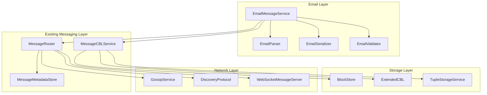
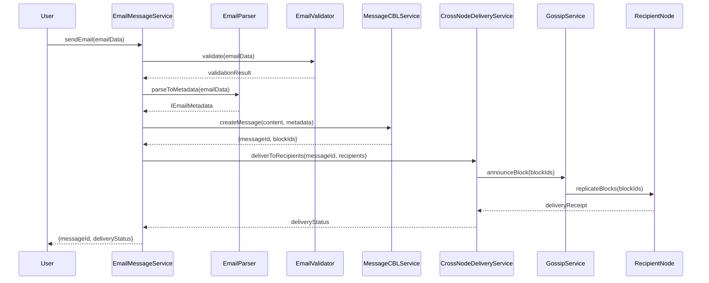
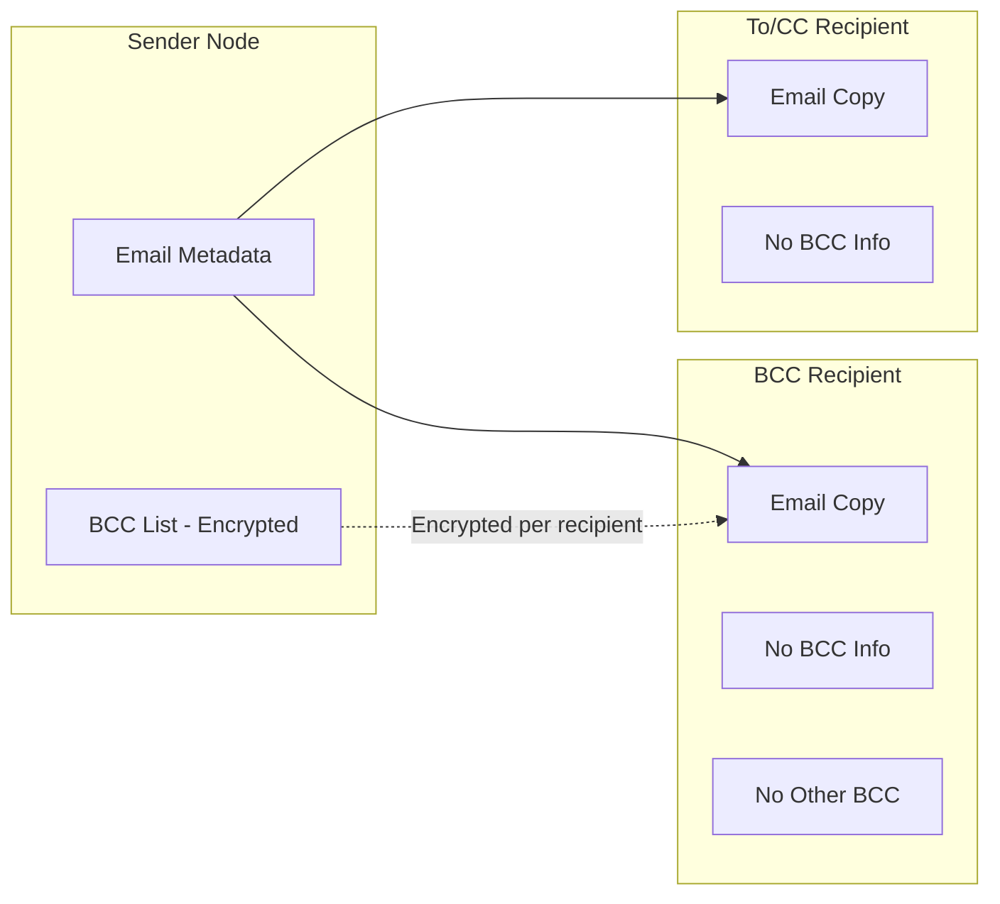

# Design Document: Email Messaging Protocol

## Overview

The BrightChain Email Messaging Protocol extends the existing messaging infrastructure to provide RFC 5322/MIME compliant email functionality. This design leverages the existing `IMessageMetadata` interface, `MessageCBLService`, `MessageRouter`, and cross-node block replication to deliver a decentralized email system.

### Design Goals

1. **RFC Compliance**: Full compliance with RFC 5322 (Internet Message Format) and RFC 2045/2046 (MIME)
2. **Extension over Replacement**: Extend existing `IMessageMetadata` rather than creating parallel structures
3. **Block-Based Storage**: Store email content as CBL blocks for efficient distributed storage
4. **Cross-Node Delivery**: Leverage existing gossip and discovery protocols for email delivery
5. **Privacy by Design**: BCC handling and encryption integrated at the protocol level

### Key Design Decisions

1. **Extend IMessageMetadata**: Create `IEmailMetadata` interface extending `IMessageMetadata` with email-specific fields
2. **Leverage Existing Libraries**: Use battle-tested TypeScript libraries for RFC 5322/MIME parsing and serialization instead of implementing from scratch
3. **MIME Part Storage**: Store large MIME parts as separate CBL blocks, small parts inline
4. **Delivery Tracking**: Extend existing delivery status tracking with email-specific states

## Recommended TypeScript Libraries

To avoid reinventing the wheel and ensure RFC compliance, the implementation SHALL leverage the following TypeScript libraries:

### Email Parsing: `postal-mime`

**Package**: `postal-mime` (npm)
**Purpose**: Parse raw RFC 822/5322 email messages into structured objects

**Features**:
- Zero dependencies
- Full TypeScript support with comprehensive type definitions
- RFC 2822/5322 compliant
- Handles complex MIME structures including nested multipart
- Extracts headers, recipients, attachments
- Works in Node.js, browsers, and serverless environments
- Built-in security limits against deeply nested messages

**Usage in EmailParser**:
```typescript
import PostalMime from 'postal-mime';
import type { Email } from 'postal-mime';

// Use postal-mime for heavy lifting, wrap with our interfaces
const parsed: Email = await PostalMime.parse(rawEmail);
```

### Email Serialization: `mimetext`

**Package**: `mimetext` (npm)
**Purpose**: Generate RFC 5322 compliant email messages

**Features**:
- RFC 5322 compliant message generation
- Full TypeScript support
- Handles multipart messages (mixed, alternative, related)
- Proper header encoding (RFC 2047 encoded-words)
- Attachment support with inline content-id references
- Automatic boundary generation

**Usage in EmailSerializer**:
```typescript
import { createMimeMessage } from 'mimetext';

const msg = createMimeMessage();
msg.setSender({ name: 'Sender', addr: 'sender@example.com' });
msg.setRecipient('recipient@example.com');
msg.setSubject('Subject with UTF-8 🚀');
msg.addMessage({ contentType: 'text/plain', data: 'Hello' });
const raw = msg.asRaw();
```

### Email Address Parsing: `email-addresses`

**Package**: `email-addresses` (npm)
**Purpose**: Parse RFC 5322 email addresses including display names and groups

**Features**:
- Parses addresses using RFC 5322 grammar
- Supports display names, quoted local-parts, group addresses
- Returns structured address objects
- Handles edge cases in address formats

**Usage in EmailValidator/EmailParser**:
```typescript
import * as emailAddresses from 'email-addresses';

const parsed = emailAddresses.parseOneAddress('John Doe <john@example.com>');
// { name: 'John Doe', address: 'john@example.com', local: 'john', domain: 'example.com' }
```

### Address Validation: `validator`

**Package**: `validator` (already in project dependencies)
**Purpose**: Validate email address format

**Usage**:
```typescript
import validator from 'validator';

validator.isEmail('test@example.com'); // true
validator.isEmail('invalid'); // false
```

### Library Integration Strategy

The implementation wraps these libraries with BrightChain-specific interfaces:

1. **EmailParser**: Uses `postal-mime` internally, converts output to `IEmailMetadata`
2. **EmailSerializer**: Uses `mimetext` internally, accepts `IEmailMetadata` as input
3. **EmailValidator**: Uses `email-addresses` for address parsing, `validator` for format validation
4. **Custom Logic**: BrightChain-specific features (CBL storage, delivery tracking, encryption) are implemented on top

This approach provides:
- **Reliability**: Battle-tested RFC compliance
- **Maintainability**: Library updates bring bug fixes and improvements
- **Focus**: Development effort on BrightChain-specific features
- **Type Safety**: All libraries have TypeScript definitions

## Architecture



### Component Interaction Flow



## Components and Interfaces

### IEmailMetadata Interface

Extends `IMessageMetadata` with RFC 5322 compliant email fields:

```typescript
/**
 * Email-specific metadata extending the base message metadata.
 * Provides RFC 5322 compliant email header fields.
 */
interface IEmailMetadata extends IMessageMetadata {
  // RFC 5322 Originator Fields (Section 3.6.2)
  from: IMailbox;                    // Required: sender mailbox
  sender?: IMailbox;                 // Optional: actual sender if different from From
  replyTo?: IMailbox[];              // Optional: reply addresses
  
  // RFC 5322 Destination Fields (Section 3.6.3)
  to: IMailbox[];                    // Primary recipients
  cc?: IMailbox[];                   // Carbon copy recipients
  bcc?: IMailbox[];                  // Blind carbon copy (stored separately)
  
  // RFC 5322 Identification Fields (Section 3.6.4)
  messageId: string;                 // Unique message identifier <id@domain>
  inReplyTo?: string;                // Parent message ID for threading
  references?: string[];             // Thread reference chain
  
  // RFC 5322 Informational Fields (Section 3.6.5)
  subject?: string;                  // Email subject (UTF-8)
  comments?: string[];               // Optional comments
  keywords?: string[];               // Optional keywords
  
  // RFC 5322 Date Field (Section 3.6.1)
  date: Date;                        // Origination date
  
  // MIME Headers (RFC 2045)
  mimeVersion: string;               // Always "1.0"
  contentType: IContentType;         // Content-Type header
  contentTransferEncoding?: ContentTransferEncoding;
  
  // Email-specific extensions
  customHeaders: Map<string, string[]>;  // X-* and other headers
  parts?: IMimePart[];               // MIME parts for multipart messages
  attachments?: IAttachmentMetadata[];   // Attachment references
  
  // Delivery tracking extensions
  deliveryReceipts: Map<string, IDeliveryReceipt>;
  readReceipts: Map<string, Date>;
  
  // Resent headers for forwarding (RFC 5322 Section 3.6.6)
  resentHeaders?: IResentHeaderBlock[];
}
```

### IMailbox Interface

```typescript
/**
 * RFC 5322 mailbox representation.
 * Supports both simple addr-spec and name-addr formats.
 */
interface IMailbox {
  displayName?: string;              // Optional display name
  localPart: string;                 // Local part before @
  domain: string;                    // Domain after @
  
  // Computed property
  readonly address: string;          // Full addr-spec: localPart@domain
}

/**
 * RFC 5322 group address representation.
 */
interface IAddressGroup {
  displayName: string;               // Group name
  mailboxes: IMailbox[];             // Group members (can be empty)
}

type IAddress = IMailbox | IAddressGroup;
```

### IContentType Interface

```typescript
/**
 * RFC 2045 Content-Type header representation.
 */
interface IContentType {
  type: string;                      // Primary type (text, image, etc.)
  subtype: string;                   // Subtype (plain, html, jpeg, etc.)
  parameters: Map<string, string>;   // Parameters (charset, boundary, etc.)
  
  // Computed property
  readonly mediaType: string;        // Full type/subtype
}

/**
 * Content-Transfer-Encoding values per RFC 2045.
 */
enum ContentTransferEncoding {
  SevenBit = '7bit',
  EightBit = '8bit',
  Binary = 'binary',
  QuotedPrintable = 'quoted-printable',
  Base64 = 'base64'
}
```

### IMimePart Interface

```typescript
/**
 * MIME entity/part representation per RFC 2045/2046.
 */
interface IMimePart {
  contentType: IContentType;
  contentTransferEncoding?: ContentTransferEncoding;
  contentDisposition?: IContentDisposition;
  contentId?: string;                // For inline references <id>
  contentDescription?: string;
  
  // Content storage
  body?: Uint8Array;                 // Inline content for small parts
  bodyBlockIds?: string[];           // CBL block IDs for large parts
  
  // Nested parts for multipart
  parts?: IMimePart[];
  
  // Metadata
  size: number;                      // Content size in bytes
}

/**
 * RFC 2183 Content-Disposition header.
 */
interface IContentDisposition {
  type: 'inline' | 'attachment';
  filename?: string;
  creationDate?: Date;
  modificationDate?: Date;
  readDate?: Date;
  size?: number;
}
```

### IAttachmentMetadata Interface

```typescript
/**
 * Attachment metadata with CBL storage reference.
 */
interface IAttachmentMetadata {
  filename: string;                  // Original filename
  mimeType: string;                  // MIME type
  size: number;                      // Size in bytes
  contentId?: string;                // For inline attachments
  
  // Storage reference
  cblMagnetUrl: string;              // ExtendedCBL magnet URL
  blockIds: string[];                // Constituent block IDs
  
  // Integrity
  checksum: string;                  // SHA-3 checksum
  contentMd5?: string;               // Optional MD5 for RFC 1864
}
```

### IDeliveryReceipt Interface

```typescript
/**
 * Delivery receipt for tracking email delivery status.
 */
interface IDeliveryReceipt {
  recipientId: string;               // Recipient identifier
  recipientNode: string;             // Recipient's home node
  status: EmailDeliveryStatus;
  
  // Timestamps
  queuedAt?: Date;
  sentAt?: Date;
  deliveredAt?: Date;
  readAt?: Date;
  failedAt?: Date;
  
  // Failure information
  failureReason?: string;
  failureCode?: string;
  retryCount: number;
}

enum EmailDeliveryStatus {
  Pending = 'pending',
  Queued = 'queued',
  InTransit = 'in_transit',
  Delivered = 'delivered',
  Failed = 'failed',
  Bounced = 'bounced',
  Read = 'read'
}
```

### EmailMessageService Class

```typescript
/**
 * Main service for email operations.
 * Coordinates parsing, validation, storage, and delivery.
 */
class EmailMessageService {
  constructor(
    private readonly messageCBLService: MessageCBLService,
    private readonly messageRouter: MessageRouter,
    private readonly metadataStore: IEmailMetadataStore,
    private readonly crossNodeDelivery: CrossNodeDeliveryService,
    private readonly config: IEmailServiceConfig
  ) {}
  
  // Core operations
  async sendEmail(email: IEmailInput): Promise<ISendEmailResult>;
  async getEmail(messageId: string): Promise<IEmailMetadata | null>;
  async getEmailContent(messageId: string): Promise<IEmailContent>;
  async deleteEmail(messageId: string): Promise<void>;
  
  // Inbox operations
  async queryInbox(userId: string, query: IInboxQuery): Promise<IInboxResult>;
  async markAsRead(messageId: string, userId: string): Promise<void>;
  async getUnreadCount(userId: string): Promise<number>;
  
  // Threading operations
  async getThread(messageId: string): Promise<IEmailMetadata[]>;
  async getRootMessage(messageId: string): Promise<IEmailMetadata | null>;
  
  // Reply/Forward operations
  async createReply(originalId: string, replyContent: IReplyInput): Promise<ISendEmailResult>;
  async forwardEmail(originalId: string, forwardTo: IMailbox[]): Promise<ISendEmailResult>;
  
  // Delivery tracking
  async getDeliveryStatus(messageId: string): Promise<Map<string, IDeliveryReceipt>>;
}
```

### EmailParser Class

```typescript
/**
 * RFC 5322/MIME compliant email parser.
 * Parses raw email strings into IEmailMetadata objects.
 */
class EmailParser {
  // Main parsing entry point
  parse(rawEmail: string | Uint8Array): IEmailMetadata;
  
  // Header parsing
  parseHeaders(headerSection: string): Map<string, string[]>;
  parseMailbox(mailboxString: string): IMailbox;
  parseAddressList(addressListString: string): IAddress[];
  parseMessageId(messageIdString: string): string;
  parseDate(dateString: string): Date;
  parseContentType(contentTypeString: string): IContentType;
  
  // Body parsing
  parseBody(body: Uint8Array, contentType: IContentType, encoding: ContentTransferEncoding): Uint8Array;
  parseMultipart(body: Uint8Array, boundary: string): IMimePart[];
  
  // Decoding
  decodeEncodedWord(encodedWord: string): string;  // RFC 2047
  decodeQuotedPrintable(data: Uint8Array): Uint8Array;
  decodeBase64(data: Uint8Array): Uint8Array;
  
  // Utility
  unfoldHeaders(rawHeaders: string): string;
}
```

### EmailSerializer Class

```typescript
/**
 * RFC 5322/MIME compliant email serializer.
 * Serializes IEmailMetadata objects to raw email format.
 */
class EmailSerializer {
  // Main serialization entry point
  serialize(email: IEmailMetadata): Uint8Array;
  
  // Header serialization
  serializeHeaders(email: IEmailMetadata): string;
  serializeMailbox(mailbox: IMailbox): string;
  serializeAddressList(addresses: IAddress[]): string;
  serializeMessageId(messageId: string): string;
  serializeDate(date: Date): string;
  serializeContentType(contentType: IContentType): string;
  
  // Body serialization
  serializeBody(parts: IMimePart[], contentType: IContentType): Uint8Array;
  serializeMultipart(parts: IMimePart[], boundary: string): Uint8Array;
  
  // Encoding
  encodeEncodedWord(text: string, charset: string, encoding: 'B' | 'Q'): string;
  encodeQuotedPrintable(data: Uint8Array): Uint8Array;
  encodeBase64(data: Uint8Array): Uint8Array;
  
  // Utility
  foldHeader(headerLine: string, maxLength: number): string;
  generateBoundary(): string;
}
```

### CrossNodeDeliveryService Class

```typescript
/**
 * Handles cross-node email delivery via block replication.
 */
class CrossNodeDeliveryService {
  constructor(
    private readonly gossipService: GossipService,
    private readonly discoveryProtocol: DiscoveryProtocol,
    private readonly blockStore: IBlockStore,
    private readonly nodeRegistry: INodeRegistry,
    private readonly config: IDeliveryConfig
  ) {}
  
  // Delivery operations
  async deliverToRecipients(
    messageId: string,
    blockIds: string[],
    recipients: IRecipientInfo[]
  ): Promise<Map<string, IDeliveryReceipt>>;
  
  async replicateBlocksToNode(
    blockIds: string[],
    targetNodeId: string
  ): Promise<IReplicationResult>;
  
  // Status tracking
  async updateDeliveryStatus(
    messageId: string,
    recipientId: string,
    status: EmailDeliveryStatus
  ): Promise<void>;
  
  // Receipt handling
  async handleDeliveryReceipt(receipt: IDeliveryReceipt): Promise<void>;
  async handleReadReceipt(messageId: string, recipientId: string): Promise<void>;
  
  // Retry logic
  async retryFailedDeliveries(messageId: string): Promise<void>;
}
```

### EmailValidator Class

```typescript
/**
 * Validates email messages against RFC 5322/MIME requirements.
 */
class EmailValidator {
  // Full validation
  validate(email: IEmailInput): IValidationResult;
  
  // Header validation
  validateHeaders(headers: Map<string, string[]>): IValidationResult;
  validateHeaderName(name: string): boolean;
  validateMailbox(mailbox: IMailbox): IValidationResult;
  validateMessageId(messageId: string): boolean;
  validateDate(date: Date): boolean;
  
  // Content validation
  validateContentType(contentType: IContentType): IValidationResult;
  validateMultipartBoundary(boundary: string, content: Uint8Array): boolean;
  validateContentTransferEncoding(encoding: string): boolean;
  
  // Size validation
  validateMessageSize(email: IEmailInput): IValidationResult;
  validateAttachmentSize(attachment: IAttachmentInput): IValidationResult;
}

interface IValidationResult {
  valid: boolean;
  errors: IValidationError[];
}

interface IValidationError {
  code: string;
  field: string;
  message: string;
}
```

## Data Models

### Email Storage Model

Emails are stored using a hierarchical block structure:

```
Email Message
├── Email Metadata Block (JSON)
│   ├── Headers (RFC 5322)
│   ├── MIME structure
│   ├── Delivery tracking
│   └── Block references
├── Body Content Blocks
│   ├── Text part (if small, inline in metadata)
│   ├── HTML part (if small, inline in metadata)
│   └── Large parts → separate CBL
└── Attachment Blocks
    ├── Attachment 1 → ExtendedCBL
    ├── Attachment 2 → ExtendedCBL
    └── ...
```

### Storage Thresholds

```typescript
interface IEmailStorageConfig {
  // Parts smaller than this are stored inline in metadata
  inlinePartThreshold: number;       // Default: 64KB
  
  // Maximum sizes
  maxAttachmentSize: number;         // Default: 25MB
  maxTotalMessageSize: number;       // Default: 50MB
  maxInlinePartsTotal: number;       // Default: 256KB
  
  // Block configuration
  preferredBlockSize: BlockSize;     // Default: BlockSize.Medium (1MB)
}
```

### Email Metadata JSON Schema

```typescript
// Internal storage format (JSON serializable)
interface IEmailMetadataStorage {
  version: '1.0';
  
  // Core identification
  messageId: string;
  brightchainMessageId: string;      // Internal CBL message ID
  
  // Headers (stored as arrays for multi-value support)
  headers: {
    from: string;
    sender?: string;
    replyTo?: string[];
    to: string[];
    cc?: string[];
    // Note: BCC stored separately for privacy
    date: string;                    // ISO 8601
    subject?: string;
    inReplyTo?: string;
    references?: string[];
    mimeVersion: string;
    contentType: string;
    contentTransferEncoding?: string;
    custom: Record<string, string[]>;
  };
  
  // MIME structure
  bodyStructure: IMimePartStorage;
  
  // Attachment references
  attachments: IAttachmentStorage[];
  
  // Delivery tracking
  delivery: {
    recipients: IRecipientDeliveryStorage[];
    bccRecipients?: IRecipientDeliveryStorage[];  // Stored encrypted
  };
  
  // Timestamps
  createdAt: string;
  updatedAt: string;
}
```

### BCC Privacy Model

BCC recipients require special handling to maintain privacy:



Each BCC recipient receives:
1. A copy of the email without any BCC header
2. Their own delivery tracking (not visible to others)
3. Encrypted separately with their public key


## Error Handling

### Error Types

```typescript
enum EmailErrorType {
  // Validation errors
  INVALID_HEADER_NAME = 'INVALID_HEADER_NAME',
  INVALID_MAILBOX = 'INVALID_MAILBOX',
  INVALID_MESSAGE_ID = 'INVALID_MESSAGE_ID',
  INVALID_DATE = 'INVALID_DATE',
  INVALID_CONTENT_TYPE = 'INVALID_CONTENT_TYPE',
  INVALID_BOUNDARY = 'INVALID_BOUNDARY',
  MISSING_REQUIRED_HEADER = 'MISSING_REQUIRED_HEADER',
  NO_RECIPIENTS = 'NO_RECIPIENTS',
  
  // Size errors
  ATTACHMENT_TOO_LARGE = 'ATTACHMENT_TOO_LARGE',
  MESSAGE_TOO_LARGE = 'MESSAGE_TOO_LARGE',
  
  // Parsing errors
  PARSE_ERROR = 'PARSE_ERROR',
  MALFORMED_HEADER = 'MALFORMED_HEADER',
  MALFORMED_MIME = 'MALFORMED_MIME',
  ENCODING_ERROR = 'ENCODING_ERROR',
  
  // Delivery errors
  RECIPIENT_NOT_FOUND = 'RECIPIENT_NOT_FOUND',
  NODE_UNREACHABLE = 'NODE_UNREACHABLE',
  REPLICATION_FAILED = 'REPLICATION_FAILED',
  DELIVERY_TIMEOUT = 'DELIVERY_TIMEOUT',
  
  // Storage errors
  STORAGE_FAILED = 'STORAGE_FAILED',
  MESSAGE_NOT_FOUND = 'MESSAGE_NOT_FOUND',
  
  // Security errors
  ENCRYPTION_FAILED = 'ENCRYPTION_FAILED',
  DECRYPTION_FAILED = 'DECRYPTION_FAILED',
  SIGNATURE_INVALID = 'SIGNATURE_INVALID'
}

class EmailError extends Error {
  constructor(
    public readonly type: EmailErrorType,
    message: string,
    public readonly details?: Record<string, unknown>
  ) {
    super(message);
    this.name = 'EmailError';
  }
}
```

### Error Recovery Strategies

| Error Type | Recovery Strategy |
|------------|-------------------|
| REPLICATION_FAILED | Exponential backoff retry (1s, 2s, 4s, 8s, 16s) up to 3 attempts |
| NODE_UNREACHABLE | Queue for later delivery, retry when node comes online |
| DELIVERY_TIMEOUT | Mark as failed after 24 hours, notify sender |
| STORAGE_FAILED | Retry with different block size, cleanup partial state |
| ENCODING_ERROR | Fall back to base64 encoding |

### Validation Error Response Format

```typescript
interface IEmailValidationResponse {
  success: false;
  errors: Array<{
    code: EmailErrorType;
    field: string;           // e.g., "headers.from", "attachments[0].size"
    message: string;         // Human-readable message
    value?: unknown;         // The invalid value (if safe to include)
  }>;
}
```

## Testing Strategy

### Dual Testing Approach

The email messaging protocol requires both unit tests and property-based tests for comprehensive coverage:

**Unit Tests** focus on:
- Specific RFC 5322 parsing examples from the specification
- Edge cases in header folding/unfolding
- Known problematic email formats
- Error condition handling
- Integration between components

**Property-Based Tests** focus on:
- Round-trip serialization/parsing consistency
- Invariants that must hold for all valid emails
- Boundary generation uniqueness
- Address parsing completeness

### Property-Based Testing Configuration

- **Library**: fast-check (TypeScript)
- **Minimum iterations**: 100 per property
- **Shrinking**: Enabled for finding minimal failing cases
- **Seed**: Configurable for reproducibility

### Test Tag Format

Each property test must be tagged with:
```typescript
// Feature: email-messaging-protocol, Property N: [property description]
```

### Generator Requirements

Custom generators needed for:
- Valid RFC 5322 mailbox addresses
- Valid header field names
- Valid MIME boundaries
- Valid Message-IDs
- Multi-part MIME structures
- Email metadata objects


## Correctness Properties

*A property is a characteristic or behavior that should hold true across all valid executions of a system—essentially, a formal statement about what the system should do. Properties serve as the bridge between human-readable specifications and machine-verifiable correctness guarantees.*

The following properties are derived from the acceptance criteria and will be validated through property-based testing.

### Property 1: Email Metadata Round-Trip

*For any* valid `IEmailMetadata` object, serializing it to RFC 5322 format using `EmailSerializer` and then parsing it back using `EmailParser` SHALL produce an `IEmailMetadata` object that is semantically equivalent to the original.

**Validates: Requirements 14.6, 14.7, 4.6, 7.1-7.8, 1.1-1.6**

This is the core round-trip property that ensures serialization and parsing are inverse operations. Semantic equivalence means:
- All header fields have the same values (order may differ for unordered fields)
- All MIME parts have the same content and structure
- All metadata fields are preserved

### Property 2: Address Parsing Round-Trip

*For any* valid RFC 5322 mailbox address (including display names, quoted local-parts, and group addresses), parsing with `EmailParser.parseMailbox()` or `EmailParser.parseAddressList()` and then serializing with `EmailSerializer.serializeMailbox()` or `EmailSerializer.serializeAddressList()` SHALL produce a string that, when parsed again, yields an equivalent `IMailbox` or `IAddress` object.

**Validates: Requirements 2.1, 2.2, 2.3, 2.4**

### Property 3: Message-ID Uniqueness and Format

*For any* set of emails created by `EmailMessageService.sendEmail()`, all generated Message-IDs SHALL:
1. Match the format `<id-left@id-right>` (enclosed in angle brackets, exactly one @ character)
2. Be globally unique (no duplicates in the set)
3. Contain the sender's node identifier in the id-right portion

**Validates: Requirements 3.1, 3.2, 3.3, 3.4, 3.5**

### Property 4: Multipart Boundary Uniqueness

*For any* multipart email created by `EmailSerializer`, the generated boundary string SHALL NOT appear anywhere in the content of any MIME part within that email.

**Validates: Requirements 6.5**

### Property 5: BCC Privacy Invariant

*For any* email sent with BCC recipients, the email copy delivered to any To or Cc recipient SHALL NOT contain:
1. The Bcc header field
2. Any information that could identify BCC recipients
3. Any delivery tracking information for BCC recipients

Additionally, each BCC recipient's copy SHALL NOT contain information about other BCC recipients.

**Validates: Requirements 9.2, 9.3, 16.2**

### Property 6: Attachment Round-Trip

*For any* email with attachments, storing the email using `EmailMessageService.sendEmail()` and then retrieving it using `EmailMessageService.getEmailContent()` SHALL produce attachments with:
1. Identical binary content (byte-for-byte)
2. Identical filename
3. Identical MIME type
4. Identical file size

**Validates: Requirements 8.1, 8.3, 8.7**

### Property 7: Threading Consistency

*For any* reply created using `EmailMessageService.createReply()`:
1. The In-Reply-To header SHALL equal the parent message's Message-ID
2. The References header SHALL contain all Message-IDs from the parent's References header plus the parent's Message-ID
3. The References header SHALL contain at most 20 Message-IDs (truncated from the beginning if necessary)

**Validates: Requirements 10.1, 10.2, 10.3**

### Property 8: Header Name Validation

*For any* string containing characters outside printable US-ASCII (33-126) or containing a colon character, `EmailValidator.validateHeaderName()` SHALL return false, and `EmailParser.parseHeaders()` SHALL reject it with an appropriate error.

**Validates: Requirements 1.7, 15.3**

### Property 9: Address Length Validation

*For any* email address string:
1. If total length exceeds 254 characters, validation SHALL fail
2. If local-part length exceeds 64 characters, validation SHALL fail

**Validates: Requirements 2.5, 2.6**

### Property 10: Size Limit Enforcement

*For any* email where:
1. Any single attachment exceeds the configured maximum attachment size (default 25MB), creation SHALL fail with error code `ATTACHMENT_TOO_LARGE`
2. Total message size exceeds the configured maximum (default 50MB), creation SHALL fail with error code `MESSAGE_TOO_LARGE`

**Validates: Requirements 8.5, 8.6, 8.8, 15.9**

### Property 11: Delivery Status State Machine

*For any* recipient of an email, the delivery status SHALL only transition through valid states:
- PENDING → QUEUED → IN_TRANSIT → DELIVERED → READ
- PENDING → QUEUED → IN_TRANSIT → FAILED
- PENDING → QUEUED → IN_TRANSIT → BOUNCED

No other transitions are valid. Status SHALL never regress to an earlier state.

**Validates: Requirements 12.1, 12.4**

### Property 12: Inbox Query Correctness

*For any* user and any email in the system:
1. If the user is in the To, Cc, or Bcc field, the email SHALL appear in their inbox query results
2. If the user is NOT in any recipient field, the email SHALL NOT appear in their inbox query results

**Validates: Requirements 13.1**

### Property 13: Content-Transfer-Encoding Consistency

*For any* MIME part with binary content (containing bytes outside 7-bit ASCII), the `EmailSerializer` SHALL encode it using base64 Content-Transfer-Encoding, and the `EmailParser` SHALL decode it back to the original binary content.

**Validates: Requirements 7.6, 7.8, 14.8, 14.9**

### Property 14: Header Folding/Unfolding Inverse

*For any* header line, folding it using `EmailSerializer.foldHeader()` and then unfolding using `EmailParser.unfoldHeaders()` SHALL produce the original header line (minus the folding whitespace).

**Validates: Requirements 14.2, 14.4**

### Property 15: Required Header Auto-Generation

*For any* email created without explicit From, Date, or Message-ID headers, the `EmailMessageService` SHALL auto-generate these headers such that the resulting email passes validation.

**Validates: Requirements 1.3, 1.5, 15.4**

