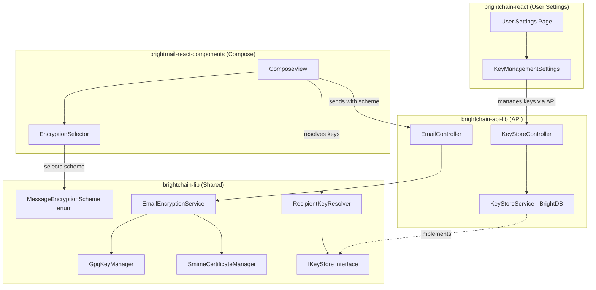
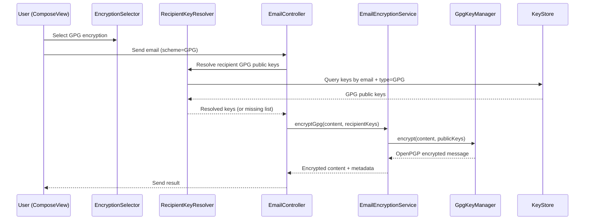
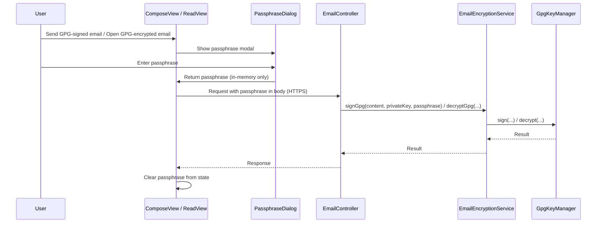

# Design Document: GPG & S/MIME Encryption

## Overview

This feature extends BrightMail's encryption capabilities from the current ECIES-only model to include full GPG (OpenPGP) and S/MIME support. The design adds three major capability layers:

1. **Key/Certificate Management** — GPG keypair generation, import/export, keyserver publishing; S/MIME certificate import (PEM, DER, PKCS#12), validation, and lifecycle management. Persisted via BrightDB with at-rest encryption for private material.
2. **Cryptographic Operations** — GPG encryption/decryption (RFC 4880), GPG signing/verification (RFC 3156 multipart/signed), S/MIME encryption/decryption (RFC 5751 CMS/PKCS#7), and S/MIME signing/verification. Integrated into the existing `EmailEncryptionService`.
3. **UI Integration** — Conditional encryption option display in the compose `EncryptionSelector` based on the user's configured keys/certificates, default encryption preference (global and per-contact), and an expanded "Encryption Keys" section in user settings.

The `MessageEncryptionScheme` enum gains a `GPG = 'gpg'` value. GPG and S/MIME work for both internal BrightChain recipients and external email recipients, unlike ECIES which is internal-only.

### Key Design Decisions

- **Library choice**: Use [OpenPGP.js](https://openpgpjs.org/) (v5+) for GPG operations and [pkijs](https://pkijs.org/) / [@peculiar/x509](https://github.com/nicolo-ribaudo/x509) for S/MIME/X.509 operations. Both are pure-JS, cross-platform (Node + browser), and well-maintained.
- **Architecture**: New `GpgKeyManager` and `SmimeCertificateManager` service classes in `brightchain-lib` handle key lifecycle. `EmailEncryptionService` gains `encryptGpg`, `decryptGpg`, `signGpg`, `verifyGpg` methods (and equivalent S/MIME methods upgrade from the current HMAC stub to real CMS signatures).
- **Storage**: Keys and certificates are stored as BrightDB documents in a `encryption_keys` collection, with private key material encrypted at rest using the user's account key via AES-256-GCM.
- **Shared types in brightchain-lib**: All interfaces (`IGpgKeyPair`, `ISmimeCertificate`, `IKeyStoreDocument`, `IEncryptionPreference`) live in brightchain-lib so both frontend and backend can consume them. API response wrappers extend these in brightchain-api-lib.

## Architecture



### Data Flow: Sending a GPG-Encrypted Message



## Components and Interfaces

### 1. MessageEncryptionScheme Enum Extension

**File**: `brightchain-lib/src/lib/enumerations/messaging/messageEncryptionScheme.ts`

```typescript
export enum MessageEncryptionScheme {
  NONE = 'none',
  SHARED_KEY = 'shared_key',
  RECIPIENT_KEYS = 'recipient_keys',
  S_MIME = 's_mime',
  GPG = 'gpg',           // NEW
}
```

### 2. GpgKeyManager (New Service)

**File**: `brightchain-lib/src/lib/services/messaging/gpgKeyManager.ts`

Wraps OpenPGP.js to provide GPG key lifecycle and cryptographic operations.

```typescript
export interface IGpgKeyMetadata {
  keyId: string;
  fingerprint: string;
  createdAt: Date;
  expiresAt: Date | null;
  userId: string;          // "Display Name <email@example.com>"
  algorithm: string;
}

export interface IGpgKeyPair {
  publicKeyArmored: string;
  privateKeyArmored: string;  // encrypted at rest before storage
  metadata: IGpgKeyMetadata;
}

export interface IGpgEncryptionResult {
  encryptedMessage: string;   // ASCII-armored OpenPGP message
}

export interface IGpgSignatureResult {
  signature: string;          // detached ASCII-armored signature
  signerKeyId: string;
}

export interface IGpgVerificationResult {
  valid: boolean;
  signerKeyId?: string;
  reason?: string;
}

export class GpgKeyManager {
  /** Generate a new OpenPGP keypair */
  async generateKeyPair(name: string, email: string, passphrase: string): Promise<IGpgKeyPair>;

  /** Import an ASCII-armored public key, validate structure */
  async importPublicKey(armoredKey: string): Promise<IGpgKeyMetadata>;

  /** Export a public key as ASCII armor */
  async exportPublicKey(publicKeyArmored: string): Promise<string>;

  /** Validate that a string is a well-formed ASCII-armored PGP public key */
  validatePublicKey(armoredKey: string): boolean;

  /** Encrypt content for one or more recipients */
  async encrypt(content: Uint8Array, recipientPublicKeysArmored: string[]): Promise<IGpgEncryptionResult>;

  /** Decrypt an OpenPGP message */
  async decrypt(encryptedMessage: string, privateKeyArmored: string, passphrase: string): Promise<Uint8Array>;

  /** Create a detached signature */
  async sign(content: Uint8Array, privateKeyArmored: string, passphrase: string): Promise<IGpgSignatureResult>;

  /** Verify a detached signature */
  async verify(content: Uint8Array, signature: string, signerPublicKeyArmored: string): Promise<IGpgVerificationResult>;

  /** Publish public key to keyserver */
  async publishToKeyserver(publicKeyArmored: string, keyserverUrl: string): Promise<void>;

  /** Search keyserver for public keys by email */
  async searchKeyserver(email: string, keyserverUrl: string): Promise<string[]>;
}
```

### 3. SmimeCertificateManager (New Service)

**File**: `brightchain-lib/src/lib/services/messaging/smimeCertificateManager.ts`

Wraps pkijs / @peculiar/x509 for X.509 certificate operations and CMS encryption/signing.

```typescript
export interface ISmimeCertificateMetadata {
  subject: string;
  issuer: string;
  serialNumber: string;
  validFrom: Date;
  validTo: Date;
  emailAddresses: string[];
  fingerprint: string;
  isExpired: boolean;
}

export interface ISmimeCertificateBundle {
  certificatePem: string;
  privateKeyPem?: string;       // encrypted at rest before storage
  metadata: ISmimeCertificateMetadata;
}

export interface ISmimeEncryptionResult {
  encryptedContent: Uint8Array;  // application/pkcs7-mime DER
  contentType: string;           // 'application/pkcs7-mime; smime-type=enveloped-data'
}

export interface ISmimeSignatureResult {
  signature: Uint8Array;         // detached CMS signature
  signerCertSubject: string;
}

export interface ISmimeVerificationResult {
  valid: boolean;
  signerSubject?: string;
  reason?: string;
}

export class SmimeCertificateManager {
  /** Import a PEM or DER certificate, validate X.509 structure */
  async importCertificate(content: string | Uint8Array, format: 'pem' | 'der'): Promise<ISmimeCertificateMetadata>;

  /** Import a PKCS#12 bundle (.p12/.pfx), extract cert + private key */
  async importPkcs12(data: Uint8Array, password: string): Promise<ISmimeCertificateBundle>;

  /** Export certificate as PEM */
  async exportCertificatePem(certificatePem: string): Promise<string>;

  /** Validate that content is a well-formed X.509 certificate */
  validateCertificate(content: string | Uint8Array, format: 'pem' | 'der'): boolean;

  /** Encrypt content using CMS/PKCS#7 for recipients */
  async encrypt(content: Uint8Array, recipientCertificatesPem: string[]): Promise<ISmimeEncryptionResult>;

  /** Decrypt CMS/PKCS#7 encrypted content */
  async decrypt(encryptedContent: Uint8Array, certificatePem: string, privateKeyPem: string): Promise<Uint8Array>;

  /** Create a CMS detached signature */
  async sign(content: Uint8Array, certificatePem: string, privateKeyPem: string): Promise<ISmimeSignatureResult>;

  /** Verify a CMS detached signature */
  async verify(content: Uint8Array, signature: Uint8Array, signerCertificatePem: string): Promise<ISmimeVerificationResult>;
}
```

### 4. RecipientKeyResolver (New Service)

**File**: `brightchain-lib/src/lib/services/messaging/recipientKeyResolver.ts`

Resolves which encryption schemes are available for a set of recipients.

```typescript
export interface IRecipientKeyAvailability {
  email: string;
  hasGpgKey: boolean;
  hasSmimeCert: boolean;
  hasEciesKey: boolean;
  isInternal: boolean;
}

export interface IResolvedRecipientKeys {
  gpgKeys: Map<string, string>;           // email -> armored public key
  smimeCerts: Map<string, string>;        // email -> PEM certificate
  eciesKeys: Map<string, Uint8Array>;     // email -> ECIES public key
  missingGpg: string[];
  missingSmime: string[];
  missingEcies: string[];
}

export interface IRecipientKeyResolver {
  /** Check key availability for all recipients */
  resolveAvailability(emails: string[]): Promise<IRecipientKeyAvailability[]>;

  /** Resolve actual keys for a given scheme */
  resolveKeysForScheme(
    emails: string[],
    scheme: MessageEncryptionScheme
  ): Promise<IResolvedRecipientKeys>;
}
```

### 5. IKeyStore Interface

**File**: `brightchain-lib/src/lib/interfaces/messaging/keyStore.ts`

Platform-agnostic interface for key/certificate persistence. Implemented by BrightDB-backed service in brightchain-api-lib.

```typescript
export interface IKeyStoreEntry<TId = string> {
  id: TId;
  userId: TId;
  type: 'gpg_keypair' | 'gpg_public' | 'smime_cert' | 'smime_bundle';
  associatedEmail: string;
  publicMaterial: string;       // ASCII armor or PEM
  privateMaterial?: string;     // encrypted at rest; undefined for public-only
  metadata: IGpgKeyMetadata | ISmimeCertificateMetadata;
  createdAt: Date;
  updatedAt: Date;
}

export interface IEncryptionPreference<TId = string> {
  userId: TId;
  contactEmail?: string;        // undefined = global default
  scheme: MessageEncryptionScheme;
}

export interface IKeyStore<TId = string> {
  // GPG operations
  storeGpgKeyPair(userId: TId, keyPair: IGpgKeyPair): Promise<IKeyStoreEntry<TId>>;
  storeGpgPublicKey(userId: TId, email: string, armoredKey: string, metadata: IGpgKeyMetadata): Promise<IKeyStoreEntry<TId>>;
  getGpgKeyPair(userId: TId): Promise<IKeyStoreEntry<TId> | null>;
  getGpgPublicKey(email: string): Promise<IKeyStoreEntry<TId> | null>;
  deleteGpgKeyPair(userId: TId): Promise<void>;

  // S/MIME operations
  storeSmimeCertificate(userId: TId, bundle: ISmimeCertificateBundle): Promise<IKeyStoreEntry<TId>>;
  storeSmimeContactCert(userId: TId, email: string, certPem: string, metadata: ISmimeCertificateMetadata): Promise<IKeyStoreEntry<TId>>;
  getSmimeCertificate(userId: TId): Promise<IKeyStoreEntry<TId> | null>;
  getSmimeContactCert(email: string): Promise<IKeyStoreEntry<TId> | null>;
  deleteSmimeCertificate(userId: TId): Promise<void>;

  // Encryption preferences
  setEncryptionPreference(pref: IEncryptionPreference<TId>): Promise<void>;
  getEncryptionPreference(userId: TId, contactEmail?: string): Promise<IEncryptionPreference<TId> | null>;

  // Query
  getKeysForEmail(email: string): Promise<IKeyStoreEntry<TId>[]>;
}
```

### 6. EmailEncryptionService Extensions

**File**: `brightchain-lib/src/lib/services/messaging/emailEncryptionService.ts`

New methods added to the existing class:

```typescript
// New methods on EmailEncryptionService:

/** Encrypt using OpenPGP for multiple recipients */
async encryptGpg(
  content: Uint8Array,
  recipientPublicKeysArmored: Map<string, string>,
  senderPrivateKeyArmored?: string,
  senderPassphrase?: string
): Promise<IPerRecipientEncryptionResult>;

/** Decrypt an OpenPGP message */
async decryptGpg(
  encryptedContent: Uint8Array,
  privateKeyArmored: string,
  passphrase: string
): Promise<Uint8Array>;

/** Sign content with GPG (detached signature) */
async signGpg(
  content: Uint8Array,
  privateKeyArmored: string,
  passphrase: string
): Promise<ISignatureResult>;

/** Verify a GPG detached signature */
async verifyGpg(
  content: Uint8Array,
  signature: Uint8Array,
  signerPublicKeyArmored: string
): Promise<boolean>;

// Upgraded S/MIME methods (replace HMAC stubs with real CMS):

/** Encrypt using CMS/PKCS#7 for multiple recipients */
async encryptSmimeReal(
  content: Uint8Array,
  recipientCertificatesPem: Map<string, string>,
  senderCertPem?: string,
  senderPrivateKeyPem?: string
): Promise<IPerRecipientEncryptionResult>;

/** Decrypt CMS/PKCS#7 content */
async decryptSmimeReal(
  encryptedContent: Uint8Array,
  certificatePem: string,
  privateKeyPem: string
): Promise<Uint8Array>;
```

### 7. EncryptionSelector Enhancement

**File**: `brightmail-react-components/src/lib/EncryptionSelector.tsx`

```typescript
// Updated props
export interface EncryptionSelectorProps {
  value: MessageEncryptionScheme;
  onChange: (scheme: MessageEncryptionScheme) => void;
  recipientWarnings?: string[];
  senderCertMissing?: boolean;
  senderGpgKeyMissing?: boolean;           // NEW
  externalRecipientWarning?: string;
  hasGpgKey: boolean;                       // NEW - user has GPG keypair
  hasSmimeCert: boolean;                    // NEW - user has S/MIME cert+key
  hasExternalRecipients?: boolean;          // NEW
}

// Updated option filtering logic
export function getAvailableEncryptionOptions(
  hasGpgKey: boolean,
  hasSmimeCert: boolean,
  hasExternalRecipients: boolean
): { value: MessageEncryptionScheme; label: string }[];
```

The `getAvailableEncryptionOptions` pure function conditionally includes GPG and S/MIME based on the user's configured keys. ECIES is only shown when there are no external recipients. NONE is always shown.

### 8. KeyManagementSettings Enhancement

**File**: `brightmail-react-components/src/lib/KeyManagementSettings.tsx`

Extended props to support:
- GPG keypair generation (not just import)
- GPG public key export
- S/MIME PKCS#12 import
- Certificate detail display (subject, issuer, validity, serial)
- Default encryption preference selector (global + per-contact)

```typescript
export interface KeyManagementSettingsProps {
  // Existing
  smimeCertificate?: string;
  gpgPublicKey?: string;
  onUpdate: (changes: {
    smimeCertificate?: string | null;
    gpgPublicKey?: string | null;
  }) => Promise<void>;

  // NEW
  gpgKeyMetadata?: IGpgKeyMetadata;
  smimeCertMetadata?: ISmimeCertificateMetadata;
  hasGpgPrivateKey: boolean;
  hasSmimePrivateKey: boolean;
  onGenerateGpgKeyPair: (passphrase: string) => Promise<void>;
  onExportGpgPublicKey: () => Promise<string>;
  onImportSmimePkcs12: (data: Uint8Array, password: string) => Promise<void>;
  onPublishGpgKey: () => Promise<void>;
  onImportGpgByEmail: (email: string) => Promise<void>;
  defaultEncryptionPreference: MessageEncryptionScheme;
  onSetDefaultPreference: (scheme: MessageEncryptionScheme) => Promise<void>;
}
```

### 9. KeyStoreController (New API Controller)

**File**: `brightchain-api-lib/src/lib/controllers/api/keyStore.ts`

REST endpoints for key management:

| Method | Path | Description |
|--------|------|-------------|
| POST | `/keys/gpg/generate` | Generate GPG keypair |
| POST | `/keys/gpg/import` | Import GPG public key |
| POST | `/keys/gpg/publish` | Publish GPG key to keyserver |
| GET | `/keys/gpg/export` | Export GPG public key |
| DELETE | `/keys/gpg` | Delete GPG keypair |
| POST | `/keys/smime/import` | Import S/MIME cert (PEM/PKCS#12) |
| GET | `/keys/smime` | Get S/MIME cert metadata |
| DELETE | `/keys/smime` | Delete S/MIME certificate |
| GET | `/keys/resolve/:email` | Resolve available keys for email |
| PUT | `/keys/preferences` | Set encryption preference |
| GET | `/keys/preferences` | Get encryption preferences |


## Data Models

### KeyStore Document (BrightDB)

Collection: `encryption_keys`

```typescript
interface IKeyStoreDocument {
  _id: string;                    // BrightDB document ID
  userId: string;                 // owner user ID
  type: 'gpg_keypair' | 'gpg_public' | 'smime_cert' | 'smime_bundle';
  associatedEmail: string;        // email address this key is for
  publicMaterial: string;         // ASCII-armored GPG key or PEM certificate
  privateMaterial?: string;       // AES-256-GCM encrypted private key (base64)
  privateIv?: string;             // IV for private material encryption (base64)
  privateAuthTag?: string;        // Auth tag for private material encryption (base64)
  metadata: {
    // GPG fields (when type starts with 'gpg_')
    keyId?: string;
    fingerprint?: string;
    algorithm?: string;
    gpgUserId?: string;
    // S/MIME fields (when type starts with 'smime_')
    subject?: string;
    issuer?: string;
    serialNumber?: string;
    validFrom?: string;           // ISO 8601
    validTo?: string;             // ISO 8601
    emailAddresses?: string[];
    smimeFingerprint?: string;
    isExpired?: boolean;
  };
  createdAt: string;              // ISO 8601
  updatedAt: string;              // ISO 8601
}
```

Indexes:
- `{ userId: 1, type: 1 }` — unique per user per type (one GPG keypair, one S/MIME bundle)
- `{ associatedEmail: 1, type: 1 }` — lookup contact keys by email
- `{ userId: 1 }` — list all keys for a user

### Encryption Preference Document (BrightDB)

Collection: `encryption_preferences`

```typescript
interface IEncryptionPreferenceDocument {
  _id: string;
  userId: string;
  contactEmail?: string;          // undefined = global default
  scheme: string;                 // MessageEncryptionScheme value
  updatedAt: string;              // ISO 8601
}
```

Indexes:
- `{ userId: 1, contactEmail: 1 }` — unique compound (global has contactEmail=null)

### IEmailInput Extension

The existing `IEmailInput` interface in `emailMessageService.ts` gains:

```typescript
// Added to IEmailInput:

/** GPG public keys for recipients (armored). Required when scheme=GPG. */
recipientGpgKeys?: Map<string, string>;

/** S/MIME certificates for recipients (PEM). Required when scheme=S_MIME. */
recipientSmimeCerts?: Map<string, string>;

/** Sender's GPG private key (armored) for signing. */
senderGpgPrivateKey?: string;

/** Passphrase for the sender's GPG private key. */
senderGpgPassphrase?: string;

/** Sender's S/MIME certificate (PEM) for signing. */
senderSmimeCert?: string;

/** Sender's S/MIME private key (PEM) for signing. */
senderSmimePrivateKey?: string;

/** Whether to sign the message (GPG or S/MIME depending on scheme). */
signMessage?: boolean;
```

### IEmailEncryptionMetadata Extension

```typescript
// Added to IEmailEncryptionMetadata:

/** ASCII-armored OpenPGP encrypted message (when scheme=GPG) */
gpgEncryptedMessage?: string;

/** Detached GPG signature (ASCII armor, when GPG signing is used) */
gpgSignature?: string;

/** Key ID of the GPG signer */
gpgSignerKeyId?: string;

/** CMS/PKCS#7 encrypted content (when scheme=S_MIME, real CMS) */
cmsEncryptedContent?: Uint8Array;

/** CMS detached signature (when S/MIME signing is used) */
cmsSignature?: Uint8Array;

/** Subject of the S/MIME signer certificate */
smimeSignerSubject?: string;
```


## Missing EmailEncryptionService S/MIME Sign/Verify Methods

The existing `EmailEncryptionService` has `encryptSmime` and `decryptSmime` stubs that delegate to ECIES+HMAC internally. In addition to the GPG methods and the upgraded `encryptSmimeReal`/`decryptSmimeReal` methods listed above, the following S/MIME signing and verification methods must be added to `EmailEncryptionService` for parity with the GPG side:

```typescript
// New S/MIME signing/verification methods on EmailEncryptionService:

/** Sign content with S/MIME (CMS detached signature) */
async signSmime(
  content: Uint8Array,
  certificatePem: string,
  privateKeyPem: string
): Promise<ISignatureResult>;

/** Verify an S/MIME CMS detached signature */
async verifySmime(
  content: Uint8Array,
  signature: Uint8Array,
  signerCertificatePem: string
): Promise<boolean>;
```

These delegate to `SmimeCertificateManager.sign()` and `SmimeCertificateManager.verify()` respectively, mirroring how `signGpg`/`verifyGpg` delegate to `GpgKeyManager`.

## GPG Private Key Passphrase Handling

GPG private keys are protected by a passphrase. The design must address how passphrases are collected and managed at decrypt/sign time:

1. **At-rest storage**: Private keys are stored encrypted via AES-256-GCM using the user's account key. The GPG passphrase is NOT stored — it must be provided by the user at time of use.
2. **UI passphrase prompt**: When a GPG operation requires the private key (decryption, signing), the frontend displays a modal passphrase dialog. The passphrase is held in component state only for the duration of the API call and is never persisted to localStorage or cookies.
3. **API transport**: The passphrase is sent over HTTPS in the request body to the relevant endpoint (e.g., `/keys/gpg/sign`, send-email with `scheme=GPG`). The API layer passes it to `GpgKeyManager.decrypt()` or `GpgKeyManager.sign()` and does not log or persist it.
4. **Session caching (optional, future)**: A future enhancement may allow caching the decrypted private key in server-side session memory (with a configurable TTL, e.g., 15 minutes) to avoid repeated passphrase prompts. This is out of scope for the initial implementation.

### Passphrase Flow Sequence



## RFC 3156 Multipart/Signed Message Assembly

When GPG signing is used, the outgoing email must conform to RFC 3156 (MIME Security with OpenPGP). The `EmailMessageService` (not `EmailEncryptionService`) is responsible for assembling the final MIME structure:

### GPG Signed Message Structure

```
Content-Type: multipart/signed;
    protocol="application/pgp-signature";
    micalg=pgp-sha256;
    boundary="----GPGSignatureBoundary"

------GPGSignatureBoundary
Content-Type: text/plain; charset=utf-8

<original message body>

------GPGSignatureBoundary
Content-Type: application/pgp-signature; name="signature.asc"
Content-Disposition: attachment; filename="signature.asc"

<ASCII-armored detached signature from GpgKeyManager.sign()>

------GPGSignatureBoundary--
```

### S/MIME Signed Message Structure (RFC 5751)

```
Content-Type: multipart/signed;
    protocol="application/pkcs7-signature";
    micalg=sha-256;
    boundary="----SMIMESignatureBoundary"

------SMIMESignatureBoundary
Content-Type: text/plain; charset=utf-8

<original message body>

------SMIMESignatureBoundary
Content-Type: application/pkcs7-signature; name="smime.p7s"
Content-Disposition: attachment; filename="smime.p7s"
Content-Transfer-Encoding: base64

<base64-encoded CMS detached signature from SmimeCertificateManager.sign()>

------SMIMESignatureBoundary--
```

### Assembly Responsibility

A new helper method is added to `EmailMessageService`:

```typescript
/**
 * Wraps message content and a detached signature into a multipart/signed
 * MIME structure per RFC 3156 (GPG) or RFC 5751 (S/MIME).
 */
private assembleMultipartSigned(
  bodyPart: IMimePart,
  signature: Uint8Array | string,
  scheme: MessageEncryptionScheme.GPG | MessageEncryptionScheme.S_MIME
): IMimePart;
```

This is called after `EmailEncryptionService.signGpg()` or `signSmime()` returns the detached signature, and before the message is handed off to the email gateway for delivery.

## Error Handling Strategy

All new cryptographic operations follow a consistent error pattern using the existing `EmailError` class:

| Error Scenario | Error Code | Thrown By |
|---|---|---|
| GPG key generation failure | `GPG_KEYGEN_FAILED` | `GpgKeyManager` |
| Invalid ASCII-armored key | `GPG_INVALID_KEY` | `GpgKeyManager` |
| GPG encryption failure (expired/invalid key) | `GPG_ENCRYPT_FAILED` | `GpgKeyManager` |
| GPG decryption failure (wrong key/passphrase) | `GPG_DECRYPT_FAILED` | `GpgKeyManager` |
| GPG signature verification failure | `GPG_VERIFY_FAILED` | `GpgKeyManager` |
| Keyserver unreachable | `GPG_KEYSERVER_ERROR` | `GpgKeyManager` |
| Invalid X.509 certificate | `SMIME_INVALID_CERT` | `SmimeCertificateManager` |
| PKCS#12 extraction failure (wrong password) | `SMIME_PKCS12_FAILED` | `SmimeCertificateManager` |
| CMS encryption failure | `SMIME_ENCRYPT_FAILED` | `SmimeCertificateManager` |
| CMS decryption failure | `SMIME_DECRYPT_FAILED` | `SmimeCertificateManager` |
| CMS signature verification failure | `SMIME_VERIFY_FAILED` | `SmimeCertificateManager` |
| Missing private key for operation | `PRIVATE_KEY_MISSING` | `EmailEncryptionService` |
| Recipient missing required key/cert | `RECIPIENT_KEY_MISSING` | `RecipientKeyResolver` |

All errors include the affected recipient email (when applicable) and a human-readable `reason` string suitable for display in the UI.

## Security Considerations

1. **Private key material at rest**: All private keys (GPG and S/MIME) are encrypted with AES-256-GCM using a key derived from the user's account key before being written to BrightDB. The IV and auth tag are stored alongside the ciphertext in the `IKeyStoreDocument`.
2. **Private key material in transit**: Private keys are never returned in API responses. Only public material and metadata are exposed via the REST API. Passphrases are transmitted only over HTTPS and are not logged.
3. **Memory handling**: After cryptographic operations complete, the decrypted private key and passphrase should be zeroed from memory where possible (limitation: JavaScript does not guarantee memory zeroing, but `Uint8Array.fill(0)` is used as a best-effort measure).
4. **Certificate validation**: S/MIME certificates are validated for well-formedness on import. Expiration warnings are shown but expired certs are still importable (the user may need them for decrypting old messages). Encryption with an expired cert is blocked.
5. **Key revocation**: GPG key revocation is handled by checking revocation signatures during import and verification. Revoked keys cannot be used for encryption but can still be used for verifying old signatures.

## Dependency Summary

| Package | Version | Purpose | Used In |
|---|---|---|---|
| `openpgp` | `^5.11` | OpenPGP key generation, encryption, signing, keyserver interaction | `brightchain-lib` |
| `pkijs` | `^3.0` | CMS/PKCS#7 encryption and signing (S/MIME) | `brightchain-lib` |
| `@peculiar/x509` | `^1.9` | X.509 certificate parsing, validation, metadata extraction | `brightchain-lib` |
| `@peculiar/asn1-pkcs12` | `^1.0` | PKCS#12 (.p12/.pfx) bundle parsing | `brightchain-lib` |

All dependencies are pure-JS and work in both Node.js and browser environments, consistent with `brightchain-lib`'s cross-platform requirement.
