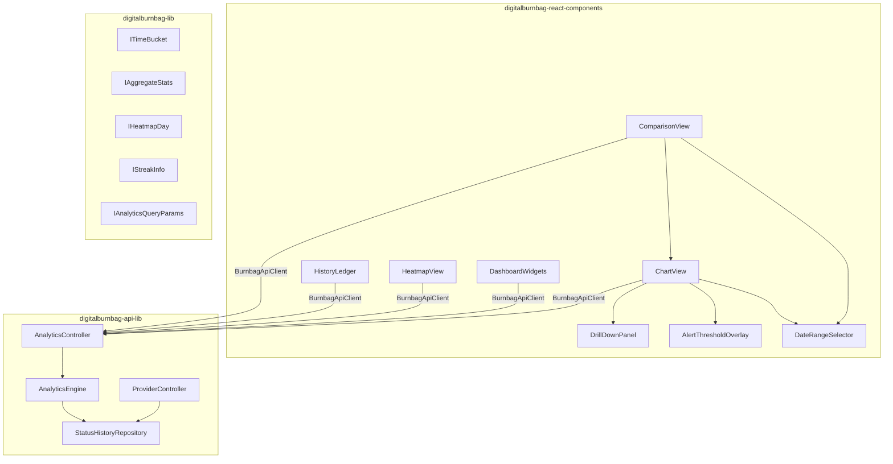
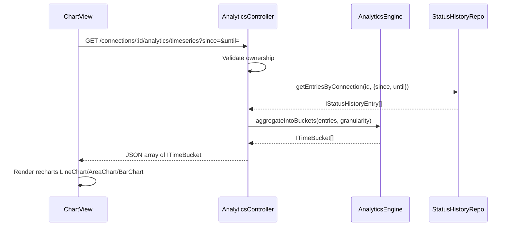

# Design Document: Heartbeat History Analytics

## Overview

The Heartbeat History Analytics feature extends the existing Canary Provider System's minimal signal timeline (colored bars in `ProviderDetailView`) into a full-featured charting, analytics, and ledger management subsystem. It introduces:

1. An **AnalyticsEngine** backend service that computes time-series aggregations, aggregate statistics, streaks, and heatmap data from raw `IStatusHistoryEntry` records.
2. New **API endpoints** under `/api/providers/connections/:id/analytics/*` that return pre-computed chart data.
3. A **React component hierarchy** for charts (recharts), paginated ledger, heatmap calendar, comparison view, and dashboard widgets.

### Key Design Decisions

1. **Server-side aggregation**: All heavy computation (bucketing, statistics, streaks) happens in the AnalyticsEngine on the backend. The frontend receives pre-aggregated data points, keeping chart rendering fast even with 90 days × multiple checks/day.

2. **Pure function architecture**: The AnalyticsEngine exposes pure helper functions (`aggregateIntoBuckets`, `computeStatistics`, `computeStreak`, `computeHeatmap`) that are independently testable via property-based testing with fast-check.

3. **recharts for visualization**: The project doesn't currently use recharts; it will be added as a peer dependency to `digitalburnbag-react-components`. Recharts integrates well with MUI and supports line, area, bar, and custom chart types needed here.

4. **Three-package split maintained**: Shared analytics interfaces/types go in `digitalburnbag-lib`, the AnalyticsEngine service goes in `digitalburnbag-api-lib`, and React chart/widget components go in `digitalburnbag-react-components`.

5. **Existing data model reuse**: All analytics derive from the existing `IStatusHistoryEntry` records in the `status_history` BrightDB collection. No schema migration needed — only new read-path computation.

## Architecture



### Data Flow: Time-Series Chart Request



## Components and Interfaces

### 1. Shared Interfaces (digitalburnbag-lib)

#### ITimeBucket

A single aggregated time bucket for chart rendering.

```typescript
export interface ITimeBucket {
  /** Start of the bucket interval (inclusive) */
  bucketStart: Date;
  /** End of the bucket interval (exclusive) */
  bucketEnd: Date;
  /** Count of each signal type within this bucket */
  signalCounts: Record<HeartbeatSignalType, number>;
  /** Total entries in this bucket */
  totalCount: number;
  /** Average confidence across entries in this bucket */
  averageConfidence: number;
  /** Average timeSinceLastActivityMs (excluding nulls) */
  averageTimeSinceActivityMs: number | null;
  /** Dominant signal type (highest count, ties broken by priority) */
  dominantSignalType: HeartbeatSignalType;
}
```

#### IAggregateStats

Computed statistics for a connection over a date range.

```typescript
export interface IAggregateStats {
  /** Uptime percentage: (PRESENCE + ABSENCE) / total * 100 */
  uptimePercentage: number | null;
  /** Average timeSinceLastActivityMs for PRESENCE entries */
  averageResponseTimeMs: number | null;
  /** CHECK_FAILED / total * 100 */
  failureRate: number | null;
  /** Total monitored duration / number of failure transitions */
  mtbfMs: number | null;
  /** Failure rate trend: % change (positive = worsening) */
  failureRateTrend: number | null;
  /** Total check count in range */
  totalCheckCount: number;
  /** Signal type distribution (count per type) */
  signalDistribution: Record<HeartbeatSignalType, number>;
}
```

#### IHeatmapDay

A single day cell for the heatmap calendar.

```typescript
export interface IHeatmapDay {
  /** The date (YYYY-MM-DD) */
  date: string;
  /** Dominant signal type for this day */
  dominantSignalType: HeartbeatSignalType | null;
  /** Total check count for this day */
  totalCount: number;
  /** Per-signal-type counts */
  signalCounts: Record<HeartbeatSignalType, number>;
}
```

#### IStreakInfo

Streak and duration metrics for dashboard widgets.

```typescript
export interface IStreakInfo {
  /** Current streak: consecutive entries of same signal type from latest */
  currentStreakCount: number;
  /** Signal type of the current streak */
  currentStreakSignalType: HeartbeatSignalType | null;
  /** Longest continuous ABSENCE duration in ms */
  longestAbsenceDurationMs: number | null;
  /** Time since last PRESENCE signal in ms, null if no PRESENCE exists */
  timeSinceLastPresenceMs: number | null;
}
```

#### IAnalyticsQueryParams

Shared query parameter interface for analytics endpoints.

```typescript
export type TimeBucketGranularity = '1h' | '6h' | '1d';

export interface IAnalyticsQueryParams {
  /** Start of date range */
  since: Date;
  /** End of date range */
  until: Date;
  /** Optional signal type filter */
  signalTypes?: HeartbeatSignalType[];
}
```

#### IComparisonDataset

Response shape for multi-provider comparison.

```typescript
export interface IComparisonDataset<TID extends PlatformID = string> {
  connectionId: TID;
  connectionName: string;
  buckets: ITimeBucket[];
}
```

### 2. Backend Service: AnalyticsEngine (digitalburnbag-api-lib)

The AnalyticsEngine is a stateless service with pure computation functions. It does not manage state or perform I/O directly — the controller fetches entries and passes them in.

```typescript
export class AnalyticsEngine {
  /**
   * Aggregate entries into time buckets.
   * Empty buckets are included for continuity.
   */
  static aggregateIntoBuckets(
    entries: IStatusHistoryEntry<string>[],
    since: Date,
    until: Date,
    granularity: TimeBucketGranularity,
  ): ITimeBucket[];

  /**
   * Select appropriate granularity based on date range span.
   * ≤48h → '1h', ≤14d → '6h', else → '1d'
   */
  static selectGranularity(since: Date, until: Date): TimeBucketGranularity;

  /**
   * Compute aggregate statistics from entries.
   * Returns null fields when entries is empty.
   */
  static computeStatistics(
    entries: IStatusHistoryEntry<string>[],
    since: Date,
    until: Date,
  ): IAggregateStats;

  /**
   * Compute heatmap day data from entries.
   */
  static computeHeatmap(
    entries: IStatusHistoryEntry<string>[],
    since: Date,
    until: Date,
  ): IHeatmapDay[];

  /**
   * Compute streak and duration info.
   */
  static computeStreakInfo(
    entries: IStatusHistoryEntry<string>[],
    now: Date,
  ): IStreakInfo;

  /**
   * Determine dominant signal type from counts.
   * Priority for ties: DURESS > CHECK_FAILED > ABSENCE > PRESENCE
   */
  static dominantSignal(
    counts: Record<HeartbeatSignalType, number>,
  ): HeartbeatSignalType;

  /**
   * Format entries for CSV export.
   */
  static formatCSV(
    entries: IStatusHistoryEntry<string>[],
  ): string;

  /**
   * Format entries for JSON export.
   */
  static formatJSON(
    entries: IStatusHistoryEntry<string>[],
  ): string;
}
```

### 3. API Endpoints: AnalyticsController (digitalburnbag-api-lib)

New controller extending the existing route pattern. Mounted under `/api/providers`.

| Method | Path | Description |
|--------|------|-------------|
| GET | `/connections/:id/analytics/timeseries` | Time-series buckets |
| GET | `/connections/:id/analytics/stats` | Aggregate statistics |
| GET | `/connections/:id/analytics/heatmap` | Heatmap day data |
| GET | `/connections/:id/analytics/streak` | Streak/duration info |
| GET | `/analytics/compare` | Multi-provider comparison (up to 5) |
| GET | `/connections/:id/history/export` | CSV/JSON export |

All endpoints accept `since`, `until` query params (ISO 8601). The timeseries endpoint auto-selects granularity. The compare endpoint accepts `connectionIds` as comma-separated list. The export endpoint accepts `format=csv|json` and optional `signalTypes` filter.

All endpoints validate that the requesting user owns the specified connection(s) before returning data.

### 4. Frontend Components (digitalburnbag-react-components)

#### Component Hierarchy

```
ProviderDetailView (existing, extended)
├── DateRangeSelector
├── ChartView
│   ├── AlertThresholdOverlay
│   └── DrillDownPanel
├── HeatmapView
├── HistoryLedger
└── DashboardWidgets (also rendered on ProviderDashboard)

ComparisonView (new top-level page)
├── ProviderSelector (multi-select, max 5)
├── DateRangeSelector
└── ChartView (multi-series mode)
```

#### DateRangeSelector

MUI-based control with predefined buttons (24h, 7d, 30d, 90d) and a custom date picker using `@mui/x-date-pickers`.

#### ChartView

Wraps recharts `ResponsiveContainer` with `LineChart`, `AreaChart`, or `BarChart` based on a `chartType` prop. Renders `ITimeBucket[]` data. Supports:
- Color-coded series per signal type using existing `getSignalTypeColor` mapping
- Tooltip on hover showing bucket breakdown
- Click handler for drill-down
- Optional `AlertThresholdOverlay` rendering `ReferenceLine` components

#### AlertThresholdOverlay

Renders recharts `ReferenceLine` and `ReferenceArea` components for configured failure thresholds and absence thresholds from the connection's `failurePolicyConfig` and `absenceConfig`.

#### DrillDownPanel

MUI `Drawer` or `Dialog` that opens when a chart data point is clicked. Shows all `IStatusHistoryEntry` records within the clicked bucket. Provides "View in Ledger" link.

#### HistoryLedger

MUI `DataGrid` (or `Table` with manual pagination) displaying entries with columns: timestamp, signal type, event count, confidence, timeSinceLastActivityMs, httpStatusCode, errorMessage. Features:
- Pagination (25/50/100 per page)
- Search filter (signal type, error message, HTTP status)
- Export buttons (CSV, JSON) triggering download from the export endpoint

#### HeatmapView

Custom grid component rendering `IHeatmapDay[]` as colored cells. Uses MUI `Tooltip` for hover details. Click navigates to that day's data in the ledger/chart.

#### DashboardWidgets

Compact MUI `Card` components showing: current streak, longest absence, uptime %, time since last presence. Applies warning (amber) / critical (red) styling based on thresholds.

#### ComparisonView

New page allowing selection of up to 5 connections. Renders a multi-series `ChartView` with distinct colors per provider and a legend with show/hide toggles.

## Data Models

No new BrightDB collections are needed. All analytics are computed on-the-fly from the existing `status_history` collection via `BrightDBStatusHistoryRepository.getEntriesByConnection()`.

The new shared interfaces (`ITimeBucket`, `IAggregateStats`, `IHeatmapDay`, `IStreakInfo`, `IComparisonDataset`) are response DTOs — they exist only in transit between the API and frontend.

### Granularity Selection Logic

| Date Range Span | Granularity | Approx Buckets |
|----------------|-------------|----------------|
| ≤ 48 hours | 1 hour | ≤ 48 |
| ≤ 14 days | 6 hours | ≤ 56 |
| ≤ 90 days | 1 day | ≤ 90 |

### Dominant Signal Priority (tie-breaking)

When multiple signal types have equal counts in a bucket or day:
1. DURESS (highest priority — safety-critical)
2. CHECK_FAILED
3. ABSENCE
4. PRESENCE (lowest priority)

### Statistics Formulas

- **Uptime %** = `(count(PRESENCE) + count(ABSENCE)) / totalCount * 100`
- **Avg Response Time** = `mean(timeSinceLastActivityMs) for PRESENCE entries` (excluding nulls)
- **Failure Rate** = `count(CHECK_FAILED) / totalCount * 100`
- **MTBF** = `totalDurationMs / numberOfFailureTransitions` (transitions into CHECK_FAILED from a non-CHECK_FAILED state)
- **Failure Rate Trend** = `(failureRate_secondHalf - failureRate_firstHalf) / failureRate_firstHalf * 100` (positive = worsening)

### Streak Computation

- **Current streak**: Starting from the most recent entry, count consecutive entries with the same signal type going backwards.
- **Longest absence duration**: Find all maximal contiguous subsequences of ABSENCE entries; for each, compute `lastTimestamp - firstTimestamp`; return the maximum.
- **Time since last presence**: `now - timestamp` of the most recent PRESENCE entry. Null if no PRESENCE exists.


## Correctness Properties

*A property is a characteristic or behavior that should hold true across all valid executions of a system — essentially, a formal statement about what the system should do. Properties serve as the bridge between human-readable specifications and machine-verifiable correctness guarantees.*

### Property 1: Granularity selection correctness

*For any* date range where `since < until`, `selectGranularity` SHALL return `'1h'` when the span is ≤ 48 hours, `'6h'` when the span is ≤ 14 days (and > 48h), and `'1d'` when the span is > 14 days.

**Validates: Requirements 1.3, 10.2**

### Property 2: Aggregation preserves total count

*For any* set of `IStatusHistoryEntry` records and any valid date range, the sum of `totalCount` across all buckets returned by `aggregateIntoBuckets` SHALL equal the number of input entries whose timestamps fall within the date range.

**Validates: Requirements 10.3**

### Property 3: Continuous time axis — correct bucket count

*For any* valid date range and granularity, `aggregateIntoBuckets` SHALL return exactly `ceil((until - since) / granularityMs)` buckets, with no gaps in the time axis, even when some buckets contain zero entries.

**Validates: Requirements 10.4**

### Property 4: Entry-to-bucket assignment correctness

*For any* `IStatusHistoryEntry` with timestamp `t` within `[since, until)`, the entry SHALL be counted in exactly one bucket where `bucketStart <= t < bucketEnd`.

**Validates: Requirements 10.1**

### Property 5: Dominant signal type priority

*For any* signal count distribution where multiple signal types share the maximum count, `dominantSignal` SHALL return the type with highest priority in the order: DURESS > CHECK_FAILED > ABSENCE > PRESENCE. When one type has a strictly higher count, it SHALL be returned regardless of priority.

**Validates: Requirements 6.2, 10.5**

### Property 6: Uptime percentage formula

*For any* non-empty set of `IStatusHistoryEntry` records, the computed `uptimePercentage` SHALL equal `(count(PRESENCE) + count(ABSENCE)) / totalCount * 100`. For an empty set, it SHALL be null.

**Validates: Requirements 3.1**

### Property 7: Average response time formula

*For any* set of `IStatusHistoryEntry` records containing at least one PRESENCE entry with non-null `timeSinceLastActivityMs`, the computed `averageResponseTimeMs` SHALL equal the arithmetic mean of `timeSinceLastActivityMs` values for PRESENCE entries (excluding nulls). When no qualifying entries exist, it SHALL be null.

**Validates: Requirements 3.2**

### Property 8: Failure rate formula

*For any* non-empty set of `IStatusHistoryEntry` records, the computed `failureRate` SHALL equal `count(CHECK_FAILED) / totalCount * 100`. For an empty set, it SHALL be null.

**Validates: Requirements 3.3**

### Property 9: MTBF formula

*For any* set of `IStatusHistoryEntry` records sorted chronologically with at least one transition into CHECK_FAILED state, the computed `mtbfMs` SHALL equal `totalDurationMs / numberOfFailureTransitions`, where a failure transition is defined as an entry with signalType CHECK_FAILED immediately preceded by an entry with a different signalType. When no failure transitions exist, MTBF SHALL be null.

**Validates: Requirements 3.4**

### Property 10: Failure rate trend computation

*For any* set of `IStatusHistoryEntry` records spanning a date range that can be split into two equal halves, the `failureRateTrend` SHALL equal `((failureRate_secondHalf - failureRate_firstHalf) / failureRate_firstHalf) * 100` when `failureRate_firstHalf > 0`. When the first half has zero failure rate, trend SHALL be null.

**Validates: Requirements 3.5**

### Property 11: Heatmap produces correct day count

*For any* valid date range `[since, until]`, `computeHeatmap` SHALL return exactly one `IHeatmapDay` per calendar day in the range (inclusive of both endpoints' dates), with no missing or duplicate days.

**Validates: Requirements 6.1**

### Property 12: Current streak computation with invariants

*For any* non-empty sequence of `IStatusHistoryEntry` records sorted chronologically, the computed `currentStreakCount` SHALL be ≥ 1. When all entries share the same signal type, `currentStreakCount` SHALL equal the total entry count. The streak signal type SHALL equal the signal type of the most recent entry.

**Validates: Requirements 11.1, 11.5**

### Property 13: Longest absence duration

*For any* set of `IStatusHistoryEntry` records sorted chronologically, `longestAbsenceDurationMs` SHALL equal the maximum value of `(lastTimestamp - firstTimestamp)` across all maximal contiguous subsequences of ABSENCE entries. When no ABSENCE entries exist, it SHALL be null.

**Validates: Requirements 11.2**

### Property 14: Time since last presence

*For any* set of `IStatusHistoryEntry` records and a reference time `now`, `timeSinceLastPresenceMs` SHALL equal `now - timestamp` of the most recent entry with signalType PRESENCE. When no PRESENCE entry exists, it SHALL be null.

**Validates: Requirements 8.2, 11.3, 11.4**

### Property 15: JSON export round-trip

*For any* set of `IStatusHistoryEntry` records, serializing via `formatJSON` and then parsing the result back SHALL produce an array of objects equivalent to the original entries (preserving all field values).

**Validates: Requirements 2.5**

### Property 16: CSV export completeness

*For any* set of `IStatusHistoryEntry` records, the CSV output from `formatCSV` SHALL contain exactly `entries.length + 1` lines (header + one row per entry), and each row SHALL contain values for all specified columns: timestamp, signalType, eventCount, confidence, timeSinceLastActivityMs, httpStatusCode, errorMessage.

**Validates: Requirements 2.4**

### Property 17: Ledger search filtering correctness

*For any* set of `IStatusHistoryEntry` records and any search query string, the filtered result SHALL contain only entries where the signal type, error message, or HTTP status code contains the query as a substring (case-insensitive). No matching entry SHALL be excluded.

**Validates: Requirements 2.3**

### Property 18: Comparison normalization — identical bucket boundaries

*For any* set of 2–5 entry arrays aggregated with the same `since`, `until`, and `granularity` parameters, all resulting `ITimeBucket[]` arrays SHALL have identical `bucketStart` and `bucketEnd` sequences.

**Validates: Requirements 4.4**

## Error Handling

### API Errors

| Error Condition | HTTP Status | Response |
|----------------|-------------|----------|
| Invalid connection ID format | 400 | `{ error: "Invalid connection ID" }` |
| Connection not found | 404 | `{ error: "Connection not found" }` |
| User does not own connection | 403 | `{ error: "Forbidden" }` |
| Invalid date range (since > until) | 400 | `{ error: "Invalid date range: since must be before until" }` |
| Too many connections in compare (>5) | 400 | `{ error: "Maximum 5 connections for comparison" }` |
| Invalid export format | 400 | `{ error: "Format must be 'csv' or 'json'" }` |
| No data in range | 200 | Empty array / null stats (not an error) |

### Computation Edge Cases

| Condition | Behavior |
|-----------|----------|
| Zero entries in date range | All statistics return null; buckets are all empty; heatmap days have null dominant type |
| Single entry | Streak = 1; MTBF = null (no transitions); trend = null |
| All entries same signal type | Streak = total count; uptime depends on type |
| Entries with null timeSinceLastActivityMs | Excluded from average response time computation |
| Date range spans DST transition | Bucket boundaries use UTC; no adjustment needed |

### Frontend Error States

| Condition | UI Behavior |
|-----------|-------------|
| API request fails | Show MUI Alert with retry button; preserve last successful data |
| Empty data for chart | Show "No data for selected range" placeholder |
| Export fails | Show snackbar error notification |
| Comparison with disconnected provider | Show warning chip on that series; data may be stale |

## Testing Strategy

### Property-Based Testing

**Library**: fast-check (already in devDependencies)

**Configuration**: Minimum 100 iterations per property test. Each test tagged with:
`Feature: heartbeat-history-analytics, Property {N}: {title}`

**Property tests** (from Correctness Properties above):
- Properties 1–18 each implemented as a single `fc.assert(fc.property(...))` test
- Custom arbitraries for:
  - `IStatusHistoryEntry` generator (random timestamps, signal types, confidence values, etc.)
  - Date range generator (ensuring since < until, various spans)
  - Signal count distribution generator
  - Entry sequence generators (uniform type, mixed type, with/without PRESENCE)

**Key test file**: `digitalburnbag-api-lib/src/lib/__tests__/services/analytics-engine.property.spec.ts`

### Unit Tests (Example-Based)

| Area | Tests |
|------|-------|
| AnalyticsEngine.aggregateIntoBuckets | Specific known inputs → expected bucket output |
| AnalyticsEngine.computeStatistics | Known entry set → expected stat values |
| AnalyticsEngine.computeHeatmap | 3-day range with known entries → expected day cells |
| AnalyticsEngine.computeStreakInfo | Known sequences → expected streak/duration |
| AnalyticsEngine.formatCSV | Verify header row, quoting of special chars |
| AnalyticsEngine.formatJSON | Verify valid JSON output |
| AnalyticsController auth | Verify 403 for non-owner |
| AnalyticsController validation | Verify 400 for bad params |
| DateRangeSelector | Predefined buttons emit correct ranges |
| ChartView | Renders with empty data, single point, many points |
| HeatmapView | Renders correct grid dimensions |
| HistoryLedger | Pagination, search, export button clicks |
| DashboardWidgets | Warning/critical styling thresholds |
| ComparisonView | Max 5 provider selection enforcement |
| DrillDownPanel | Opens on click, shows correct entries |

### Integration Tests

| Area | Tests |
|------|-------|
| GET /analytics/timeseries | Full request → response with correct shape |
| GET /analytics/stats | Full request → response with all stat fields |
| GET /analytics/heatmap | Full request → response with day objects |
| GET /analytics/compare | Multi-connection request → normalized datasets |
| GET /history/export?format=csv | Verify Content-Type: text/csv, Content-Disposition |
| GET /history/export?format=json | Verify Content-Type: application/json |
| Auth enforcement | Non-owner gets 403 on all analytics endpoints |
