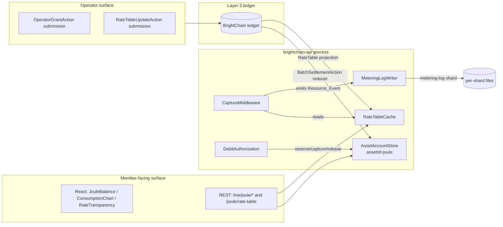

# Design: Joule Resource Credits

## Overview

This is the **application layer** for Joule. It binds:

- Layer 1 (`asset-account-store-generalization`) — operational balance under `assetId === 'joule'`.
- Layer 2 (`metering-log`) — per-request resource event capture.
- Layer 3 (`programmable-asset-ledger`) — issuance, settlement, dispute, and final balance authority.

…into a coherent member-facing experience with a single rate table, a single capture pipeline, and a single React component pack.

This design adds **no new ledger primitives**. It rides entirely on `RateTableUpdateAction` (a thin wrapper over `AttestationAction` carrying a structured payload) and `OperatorGrantAction` (a thin wrapper over `MintAction` with audit-friendly metadata). Everything else is application code.

## Architecture



## Components

### `brightchain-lib/src/lib/joule/`

Shared, browser-safe primitives.

```ts
// jouleConstants.ts
export const JOULE_ASSET_ID = 'joule' as const;
export const JOULE_MICROUNITS_PER_UNIT = 1_000_000n;
export const JOULE_DECIMALS = 6 as const;
export const JOULE_SYMBOL = 'J' as const;

// resourceClass.ts
export type ResourceClass = 'compute' | 'storage' | 'network' | 'proofOfWork';
export const RESOURCE_CLASSES: readonly ResourceClass[] = [
  'compute', 'storage', 'network', 'proofOfWork',
] as const;

// rateTable.ts
export interface IRateTableEntry {
  unit: string;                 // e.g. 'request', 'MB-day', 'MB-out'
  microJoulesPerUnit: bigint;   // µJ per 1 unit
  description: string;          // human-readable
}
export interface IRateTable {
  version: number;
  effectiveAt: number;          // unix ms
  entries: Record<ResourceClass, IRateTableEntry>;
  signedBy: ReadonlyArray<string>; // operator key fingerprints
}
export function priceMicroJoules(
  rate: IRateTable,
  cls: ResourceClass,
  units: bigint,
): bigint {
  return units * rate.entries[cls].microJoulesPerUnit;
}

// formatJoule.ts
export function formatJoule(microJoules: bigint, opts?: { precision?: number }): string;
```

`formatJoule` rules:

- `>= 1 J` → render in J with `decimals=6` trimmed
- `>= 1 mJ` → render in mJ
- otherwise → µJ
- always exact, never `Number()`-cast.

### `brightchain-api-lib/src/lib/joule/`

Server-side runtime.

#### `RateTableCache`

- Subscribes to Layer 3 projection updates.
- Keeps a sorted list of historical rate tables by `effectiveAt`.
- `getRateAt(timestamp: number): IRateTable` — binary search.
- `getCurrentRate(): IRateTable`.
- Emits `rate-changed` event for clients.

#### `RequestCostAccumulator`

- Per-request, attached to request context.
- `add(cls: ResourceClass, units: bigint): void` — accrues units only; pricing happens at flush.
- `snapshot(): Record<ResourceClass, bigint>`.

#### `CaptureMiddleware`

- On request start: pin `rateTableVersion`, attach accumulator.
- On response close: for each class with `units > 0`, emit Resource_Event to metering-log:

```ts
interface IResourceEventPayload {
  kind: 'resource_event';
  memberId: string;
  resourceClass: ResourceClass;
  units: bigint;
  microJoules: bigint;        // = units * rate.entries[cls].microJoulesPerUnit
  rateTableVersion: number;
  opId: string;               // request id
  routeId: string;
  occurredAt: number;
}
```

This payload becomes the `op` field of the metering-log CBOR record (per Layer 2 design). The Layer 2 batch settlement aggregates per-member µJ across all classes and produces one `memberDelta` per member per asset.

#### `DebitAuthorization`

- Wraps Layer 1 `reserve / capture / release` with route-aware estimation:

```ts
class DebitAuthorization {
  authorize(memberId: string, opId: string, maxMicroJoules: bigint): Promise<void>;
  capture(opId: string, actualMicroJoules: bigint): Promise<void>;
  release(opId: string): Promise<void>;
}
```

- `actualMicroJoules > maxMicroJoules` → throws `CAPTURE_EXCEEDS_AUTH`.
- Capture also emits a synthetic Resource_Event with `resourceClass: 'compute'` (or per-route classification) so audit trails remain consistent.

#### `JouleEarnService`

Operator-only.

```ts
class JouleEarnService {
  grant(memberId: string, microJoules: bigint, reason: string, quorumSig: BrightTrustQuorumSignature): Promise<TxId>;
}
```

Issues an `OperatorGrantAction` on Layer 3. Audit-friendly `reason` is required and stored on-ledger.

### Cost-category route metadata

Implemented as a Nest decorator (or Express middleware option):

```ts
@Cost('free')        @Get('/health')
@Cost('metered')     @Get('/feed')
@Cost('authorized', { estimator: bulkUploadEstimator, safety: 1.25 })
@Post('/upload/bulk')
```

CI guard: a build-time AST scan walks the controllers tree and fails if any handler lacks `@Cost(...)`.

### REST surface

| Verb | Path | Auth | Notes |
|------|------|------|-------|
| GET  | `/joule/rate-table`         | none      | current rate |
| GET  | `/joule/rate-table/history` | none      | versioned |
| GET  | `/me/joule/balance`         | member    | available / reserved / total |
| GET  | `/me/joule/consumption`     | member    | windowed aggregate |
| GET  | `/me/joule/events`          | member    | paginated raw events |
| GET  | `/me/joule/reservations`    | member    | open reservations |
| GET  | `/me/joule/disputes`        | member    | sourced from L3 disputes projection |
| POST | `/operator/joule/grant`     | operator + quorum | submits `OperatorGrantAction` |
| POST | `/operator/joule/rate-table`| operator + quorum | submits `RateTableUpdateAction` |

All amount fields wire-format: stringified bigint µJ. Never JSON `number`.

### React component pack

Lives at `brightchain-react-components/src/joule/`.

```
joule/
  formatJoule.ts            # re-exports browser-safe formatter
  JouleBalance.tsx
  JouleConsumptionChart.tsx
  JouleEventLog.tsx
  RateTransparency.tsx
  DisputeNotice.tsx
  hooks/
    useJouleBalance.ts
    useJouleConsumption.ts
    useRateTable.ts
  index.ts
```

All components are pure presentation + a thin SWR-style hook layer. They accept `bigint` props directly; serialization happens at the data-fetching boundary.

Brand-vocabulary lint: a Codacy custom pattern (regex-based) fails the build on the prohibited words list within this directory. The lint is intentionally narrower here than the workspace-wide one because Joule is the surface a user actually sees — drift here is most damaging.

### Earn-source mapping

| Earn source        | Ledger action           | Operational effect                |
|--------------------|-------------------------|-----------------------------------|
| operator grant     | `OperatorGrantAction`   | balance ↑ on settlement           |
| reservation release| (none)                  | reserved ↓, available ↑ in L1     |
| dispute resolution | `BatchSettlementResolutionAction` (L3) | balance ↑ via reducer |
| promo campaign     | `OperatorGrantAction` (batched) | balance ↑ on settlement   |

There is intentionally no `TransferAction(memberA → memberB, joule)` exposed to members. The Layer 3 ledger supports the action shape, but the API gateway rejects member-originated `TransferAction` for `assetId === 'joule'` in v1.

## Data flow: a metered request

1. Request arrives. Middleware pins `rateVersion = RateTableCache.getCurrentRate().version` and attaches accumulator.
2. Handler runs; calls `ctx.cost.add('compute', 1n)` and `ctx.cost.add('network', 4096n)` (units = bytes out).
3. Response closes. Middleware:
   - Computes `µJ_compute = 1n * rate.entries.compute.microJoulesPerUnit`.
   - Computes `µJ_network = 4096n * rate.entries.network.microJoulesPerUnit`.
   - Emits two Resource_Events to the metering-log shard.
4. Layer 2 background batcher seals shard records into a `BatchSettlementAction` (per Layer 2 spec).
5. Layer 3 validator + reducer apply the batch, decrementing `memberId`'s Joule balance.
6. Layer 1 `AssetAccountStore` projection updates; member's next `GET /me/joule/balance` reflects it.

End-to-end p99 from response close to balance reflection: ≤ 1 batch window (default 5 s), per Layer 2 perf targets. Real-time per-request balance correctness is **not** a goal (it's explicitly out of scope per Layer 3 Requirement 13).

## Data flow: an authorized request

1. Handler entry: `await debitAuth.authorize(memberId, opId, estimator(req) * safety)`.
   - On `INSUFFICIENT_FUNDS`: 402, work skipped.
2. Handler runs the expensive op, observing actual cost in `ctx.cost`.
3. On success: `await debitAuth.capture(opId, ctx.cost.totalMicroJoules)`. Capture emits the Resource_Event(s) and reduces the L1 reservation.
4. On failure: `await debitAuth.release(opId)`. No Resource_Event.
5. Reaper sweeps stale reservations every minute; releases anything older than `RESERVATION_TTL`.

## Configuration

```env
JOULE_ENABLED=true
JOULE_RATE_TABLE_SHARD=00000000-...   # which metering-log shard to use
JOULE_BATCH_WINDOW_MS=5000             # passes through to metering-log
JOULE_RESERVATION_TTL_MS=300000        # 5 min
JOULE_AUTH_SAFETY_MULTIPLIER=1.25
JOULE_RETRY_BUFFER_MAX=10000           # alarm threshold
```

## Error codes

| Code                       | HTTP | Meaning                                                |
|----------------------------|------|--------------------------------------------------------|
| `INSUFFICIENT_JOULE`       | 402  | member cannot cover authorization                      |
| `RESERVATION_NOT_FOUND`    | 404  | unknown opId on capture/release                        |
| `RESERVATION_EXPIRED`      | 410  | reservation TTL elapsed                                |
| `CAPTURE_EXCEEDS_AUTH`     | 422  | actual > max                                           |
| `RATE_TABLE_VERSION_STALE` | 409  | event references retired rate version                  |
| `RATE_EFFECTIVE_AT_INVALID`| 422  | rate-table update with past `effectiveAt`              |
| `COST_CATEGORY_MISSING`    | 500  | server bug — route lacks `@Cost`                       |
| `JOULE_TRANSFER_FORBIDDEN` | 403  | member-originated transfer of `joule` asset            |

## Out of scope

- Peer-to-peer Joule transfers (gateway forbids; ledger primitive remains internal).
- Member-initiated disputes (read-only surface only in v1).
- Multi-asset wallets (this spec scopes only to `joule`; the same components could later be parameterized).
- Real-time live balance display below batch window.
- Predictive cost estimation (estimators are static functions per route in v1).
