# Design Document: Let's Encrypt via Upstream Application Refactor

## Overview

This design refactors BrightChain's `App<TID>` class to extend the upstream `Application` from `@digitaldefiance/node-express-suite` (v3.12.16+), replacing the current inheritance from the local `BaseApplication<TID>`. The upstream `Application` already provides:

- HTTP server on the configured port
- Greenlock/Let's Encrypt HTTPS on port 443 (via `GreenlockManager`)
- HTTP-to-HTTPS redirect on port 80
- Dev HTTPS via local `.pem` certificates
- Express middleware initialization and error handling
- Graceful shutdown of all servers

BrightChain's `App` currently duplicates most of this in its own `start()`/`stop()` methods. By extending the upstream, we eliminate ~150 lines of duplicated server lifecycle code and automatically inherit greenlock support.

The key challenge is that the upstream `Application` constructor expects mongoose-related factories (`schemaMapFactory`, `databaseInitFunction`, `initResultHashFunction`) that BrightChain doesn't use — BrightChain uses `DocumentStore`/`BlockDocumentStore` instead. We bridge this with no-op stubs.

Key design decisions:
- `App` extends upstream `Application` directly, passing no-op mongoose stubs
- The local `BaseApplication` is kept as a thin compatibility layer (other code may reference it) but stripped of server lifecycle logic
- `App.start()` calls `super.start()` for HTTP/HTTPS/greenlock, then adds BrightChain services
- `App.stop()` cleans up BrightChain services, then calls `super.stop()` for server shutdown
- The `DocumentStore` is managed directly by `App` (moved from local `BaseApplication`)
- Environment variables use `LETS_ENCRYPT_*` prefix (matching upstream convention)

## Architecture

```mermaid
graph TD
    subgraph "New Inheritance Chain"
        APP["App&lt;TID&gt;<br/>(brightchain-api-lib)"]
        UPSTREAM_APP["Application<br/>(@digitaldefiance/node-express-suite)"]
        UPSTREAM_BASE["BaseApplication<br/>(@digitaldefiance/node-express-suite)"]
        
        APP -->|extends| UPSTREAM_APP
        UPSTREAM_APP -->|extends| UPSTREAM_BASE
    end

    subgraph "Removed/Simplified"
        LOCAL_BASE["BaseApplication_Local<br/>(kept as compatibility layer,<br/>no server lifecycle)"]
    end

    subgraph "App.start() Flow"
        S1["super.start(undefined)"] --> S2["HTTP server on :port"]
        S1 --> S3{letsEncrypt.enabled?}
        S3 -->|yes| S4["GreenlockManager → HTTPS :443 + redirect :80"]
        S3 -->|no| S5{httpsDevCertRoot?}
        S5 -->|yes| S6["Dev HTTPS on :httpsDevPort"]
        S5 -->|no| S7["HTTP only"]
        
        S2 --> S8["BrightChain Services Init"]
        S8 --> S9["keyStorage, memberStore, energyStore,<br/>energyLedger, emailService, authService"]
        S9 --> S10["EventNotificationSystem"]
        S10 --> S11["WebSocketMessageServer"]
        S11 --> S12["UPnP (if enabled)"]
        S12 --> S13["_ready = true"]
    end

    subgraph "App.stop() Flow"
        T1["UPnP shutdown"] --> T2["WebSocket close"]
        T2 --> T3["Clean up eventSystem, messagePassingService, apiRouter"]
        T3 --> T4["super.stop()"]
        T4 --> T5["GreenlockManager.stop() (if active)"]
        T4 --> T6["HTTP server close"]
        T4 --> T7["Database disconnect (no-op for BrightChain)"]
        T4 --> T8["_ready = false"]
    end
```



## Components and Interfaces

### App Constructor Changes

The upstream `Application` constructor signature:
```typescript
constructor(
  environment: TEnvironment,
  apiRouterFactory: (app: IApplication<TID>) => BaseRouter<TID>,
  schemaMapFactory: (connection: mongoose.Connection) => SchemaMap<TID, TModelDocs>,
  databaseInitFunction: (application: BaseApplication<TID, TModelDocs, TInitResults>) => Promise<IFailableResult<TInitResults>>,
  initResultHashFunction: (initResults: TInitResults) => string,
  cspConfig?: ICSPConfig | HelmetOptions | IFlexibleCSP,
  constants?: TConstants,
  appRouterFactory?: (apiRouter: BaseRouter<TID>) => TAppRouter,
  customInitMiddleware?: typeof initMiddleware
)
```

BrightChain's `App` will pass:

```typescript
export class App<TID extends PlatformID> extends UpstreamApplication<
  IBrightChainInitResult<TID>,  // TInitResults - minimal stub type
  Record<string, never>,         // TModelDocs - empty, no mongoose models
  TID,                           // TID
  Environment<TID>,              // TEnvironment
  IConstants,                    // TConstants
  AppRouter<TID>                 // TAppRouter
> {
  constructor(environment: Environment<TID>) {
    super(
      environment,
      // apiRouterFactory - creates BrightChain's ApiRouter
      (app: IApplication<TID>) => new ApiRouter<TID>(app as App<TID>),
      // schemaMapFactory - no-op, returns empty object
      () => ({} as SchemaMap<TID, Record<string, never>>),
      // databaseInitFunction - no-op, returns success
      async () => ({ success: true, result: {} as IBrightChainInitResult<TID> }),
      // initResultHashFunction - no-op
      () => 'no-mongoose',
      // cspConfig - undefined or BrightChain-specific CSP
      undefined,
      // constants
      AppConstants,
      // appRouterFactory - creates BrightChain's AppRouter
      (apiRouter) => new AppRouter<TID>(apiRouter as ApiRouter<TID>),
      // customInitMiddleware - BrightChain's Middlewares.init
      Middlewares.init
    );
    this.keyStorage = SecureKeyStorage.getInstance();
  }
}
```

### IBrightChainInitResult Stub

A minimal type to satisfy the upstream's `IServerInitResult<TID>` generic:

```typescript
import { IServerInitResult } from '@digitaldefiance/node-express-suite';

export interface IBrightChainInitResult<TID extends PlatformID> extends IServerInitResult<TID> {
  // No additional fields needed — BrightChain doesn't use mongoose init results
}
```

### App.start() Override

```typescript
public override async start(): Promise<void> {
  // Call upstream start with no mongoUri — skips mongoose connection
  // The upstream handles: HTTP server, greenlock/HTTPS, dev-HTTPS, middleware, routing, error handler
  await super.start(undefined);

  // BrightChain-specific initialization
  await this.keyStorage.initializeFromEnvironment();

  // Initialize services
  const blockStore = BlockStoreFactory.createMemoryStore({ blockSize: BlockSize.Small });
  const memberStore = new MemberStore(blockStore);
  const energyStore = new EnergyAccountStore();
  const energyLedger = new EnergyLedger();
  const emailService = new EmailService<TID>(this);
  const authService = new AuthService<TID>(this, memberStore, energyStore, emailService, this.environment.jwtSecret);

  this.services.register('memberStore', () => memberStore);
  this.services.register('energyStore', () => energyStore);
  this.services.register('energyLedger', () => energyLedger);
  this.services.register('emailService', () => emailService);
  this.services.register('auth', () => authService);

  // EventNotificationSystem
  this.eventSystem = new EventNotificationSystem();
  this.services.register('eventSystem', () => this.eventSystem);

  // WebSocket — attach to the server created by super.start()
  if (this.server) {
    this.wsServer = new WebSocketMessageServer(this.server, false);
    this.services.register('wsServer', () => this.wsServer);
  }

  // Wire EventNotificationSystem to SyncController
  if (this.apiRouter) {
    this.apiRouter.setSyncEventSystem(this.eventSystem);
  }

  // UPnP (non-fatal)
  if (this.environment.upnp?.enabled) {
    try {
      this.upnpManager = new UpnpManager(this.environment.upnp);
      await this.upnpManager.initialize();
      this.services.register('upnpManager', () => this.upnpManager);
    } catch (upnpErr) {
      console.warn('[ warning ] UPnP initialization failed:', upnpErr);
    }
  }

  // Note: super.start() already sets _ready = true
}
```

### App.stop() Override

```typescript
public override async stop(): Promise<void> {
  // BrightChain-specific cleanup first
  if (this.upnpManager) {
    await this.upnpManager.shutdown();
    this.upnpManager = null;
  }

  if (this.wsServer) {
    await new Promise<void>((resolve) => {
      this.wsServer!.close(() => resolve());
    });
    this.wsServer = null;
  }

  this.eventSystem = null;
  this.messagePassingService = null;
  this.apiRouter = null;

  // Upstream handles: greenlockManager.stop(), server.close(), super.stop() (db disconnect), _ready = false
  await super.stop();
}
```

### Local BaseApplication Changes

The local `BaseApplication` is simplified to a compatibility layer. It no longer manages server lifecycle (that's upstream). It retains:
- `DocumentStore` / `BlockDocumentStore` management
- The `db` getter that returns the document store
- The `getModel` method for collection access
- The `reloadEnvironment` method

If no other classes extend `BaseApplication_Local` directly, it can be converted to a mixin or its functionality folded into `App`. The `_ready`, `start()`, `stop()`, `services`, `plugins`, `environment`, and `constants` properties are all provided by the upstream chain.

### Environment Changes

The local `Environment<TID>` already extends the upstream `Environment<TID>`, which already parses `LETS_ENCRYPT_*` env vars and exposes a `letsEncrypt` getter returning `ILetsEncryptConfig`. No changes needed to the Environment class itself.

The local `IEnvironment<TID>` already extends the upstream `IEnvironment<TID>` (via `Omit`), which already includes `letsEncrypt: ILetsEncryptConfig`. No changes needed.

### Server Access

The upstream `Application` has a `private server` field. BrightChain's `App` needs access to attach WebSocket. Options:
1. The upstream `Application` may expose the server via a protected getter — check if available
2. If not, `App` can access `this.expressApp` and listen for the `listening` event, or the WebSocket can be attached differently
3. Alternatively, the upstream could be updated to expose a protected `getServer()` method

The current upstream `Application` has `private server` — this means `App` cannot directly access it. The solution is to track the server reference in `App` by overriding the listen behavior, or by attaching WebSocket to the Express app directly. The most practical approach: since `super.start()` creates the server internally, `App` can use `this.expressApp` to find the server, or the upstream can be patched to make `server` protected.

**Recommended approach**: Update the upstream `Application` to make `server` a `protected` field (or add a `protected get httpServer()` accessor). This is a minor upstream change that enables proper subclassing.


## Data Models

### ILetsEncryptConfig (from upstream)

| Field | Type | Default | Env Variable | Description |
|-------|------|---------|-------------|-------------|
| `enabled` | `boolean` | `false` | `LETS_ENCRYPT_ENABLED` | Master toggle for greenlock |
| `maintainerEmail` | `string` | `''` | `LETS_ENCRYPT_EMAIL` | ACME account email |
| `hostnames` | `string[]` | `[]` | `LETS_ENCRYPT_HOSTNAMES` | Comma-separated, supports wildcards |
| `staging` | `boolean` | `false` | `LETS_ENCRYPT_STAGING` | Use staging CA |
| `configDir` | `string` | `./greenlock.d` | `LETS_ENCRYPT_CONFIG_DIR` | Greenlock config/cert storage directory |

### IBrightChainInitResult (new stub)

```typescript
import { IServerInitResult } from '@digitaldefiance/node-express-suite';
import { PlatformID } from '@digitaldefiance/node-ecies-lib';

export interface IBrightChainInitResult<TID extends PlatformID> extends IServerInitResult<TID> {
  // Stub — BrightChain does not use mongoose init results
}
```

### Constructor Argument Stubs

| Argument | Upstream Expectation | BrightChain Stub |
|----------|---------------------|------------------|
| `schemaMapFactory` | `(connection: mongoose.Connection) => SchemaMap` | `() => ({})` — empty schema map |
| `databaseInitFunction` | `(app) => Promise<IFailableResult<TInitResults>>` | `async () => ({ success: true, result: {} })` |
| `initResultHashFunction` | `(initResults) => string` | `() => 'no-mongoose'` |
| `mongoUri` (in start()) | MongoDB connection string | `undefined` — skip mongoose connection |

### Environment Variable Examples (.env.example additions)

```bash
# ─── Let's Encrypt / Greenlock Configuration ────────────────────────────
# Enable/disable Let's Encrypt automatic TLS certificates (default: false)
LETS_ENCRYPT_ENABLED=false
# Contact email for Let's Encrypt account (required when enabled)
LETS_ENCRYPT_EMAIL=admin@brightchain.org
# Comma-separated hostnames to obtain certificates for
LETS_ENCRYPT_HOSTNAMES=brightchain.org,www.brightchain.org,nexus.brightchain.org
# Use Let's Encrypt staging environment for testing (default: false)
LETS_ENCRYPT_STAGING=false
# Directory for greenlock config and certificate storage (default: ./greenlock.d)
# LETS_ENCRYPT_CONFIG_DIR=./greenlock.d
```

## Correctness Properties

*A property is a characteristic or behavior that should hold true across all valid executions of a system — essentially, a formal statement about what the system should do. Properties serve as the bridge between human-readable specifications and machine-verifiable correctness guarantees.*

Most acceptance criteria in this spec are integration/structural tests (verifying class inheritance, constructor wiring, service registration, shutdown order) rather than universal properties over ranges of inputs. These are best covered by unit/integration tests with specific examples. Two criteria yield genuine properties:

### Property 1: Hostname parsing round-trip

*For any* list of valid hostname strings (non-empty, no internal commas, valid hostname characters), joining them with commas into a single string and then parsing that string via the upstream's `parseHostnames()` utility SHALL produce an array equal to the original list (after trimming whitespace).

**Validates: Requirements 5.4**

Reasoning: The upstream `Environment` parses `LETS_ENCRYPT_HOSTNAMES` as a comma-separated string via `parseHostnames()`. This round-trip property ensures that for any valid hostname list, the serialization (join with commas) and deserialization (parse) are inverses. This is a classic round-trip property over a range of inputs.

### Property 2: ILetsEncryptConfig JSON round-trip

*For any* valid `ILetsEncryptConfig` object (with `enabled` as boolean, `maintainerEmail` as non-empty string, `hostnames` as array of valid hostname strings, `staging` as boolean, `configDir` as non-empty string), `JSON.parse(JSON.stringify(config))` SHALL produce an object deeply equal to the original.

**Validates: Requirements 8.1, 8.2**

Reasoning: The `ILetsEncryptConfig` interface contains only JSON-safe types (boolean, string, string[]). This round-trip property verifies that serialization is lossless for all valid configurations. This subsumes the simpler "serializable to JSON" requirement.

## Error Handling

| Scenario | Behavior | Requirement |
|----------|----------|-------------|
| `super.start()` throws | Log error, exit process (non-test) or re-throw (test) | 2.6 |
| Greenlock fails to initialize (inside upstream) | Upstream logs error, continues HTTP-only | Upstream behavior |
| Port 80 unavailable (inside upstream) | Upstream logs warning, continues without redirect | Upstream behavior |
| UPnP initialization fails | Log warning, continue without port mapping | 2.5 |
| WebSocket server fails to attach | Log error, continue without WebSocket | 2.4 |
| `db` property accessed without mongoose | Return DocumentStore or throw descriptive error | 6.4 |
| Both `httpsDevCertRoot` and `letsEncrypt.enabled` | Upstream prefers Let's Encrypt, skips dev HTTPS | Upstream behavior |
| No-op `databaseInitFunction` called | Returns `{ success: true }` immediately | 6.2 |

All greenlock-specific error handling is managed by the upstream `GreenlockManager`. BrightChain's `App` only needs to handle errors in its own service initialization (keyStorage, services, UPnP, WebSocket).

## Testing Strategy

### Property-Based Tests

Use `fast-check` as the property-based testing library. Each property test runs a minimum of 100 iterations.

| Property | Test Description | Tag |
|----------|-----------------|-----|
| Property 1 | Generate random arrays of valid hostname strings, join with commas, parse via `parseHostnames()`, assert array equality | `Feature: letsencrypt-greenlock, Property 1: Hostname parsing round-trip` |
| Property 2 | Generate random `ILetsEncryptConfig` objects, round-trip through JSON, assert deep equality | `Feature: letsencrypt-greenlock, Property 2: ILetsEncryptConfig JSON round-trip` |

### Unit Tests

Unit tests cover the structural and integration aspects that are not amenable to property-based testing:

**Constructor & Inheritance:**
- `App` extends upstream `Application` (prototype chain check) (Req 1.1)
- `App` construction succeeds with Environment argument (Req 1.2, 1.3)
- No-op schemaMapFactory returns empty object (Req 1.4, 6.1)
- No-op databaseInitFunction returns success (Req 1.5, 6.2)

**Start Lifecycle:**
- `App.start()` calls `super.start()` (mock/spy) (Req 2.1)
- After start, all BrightChain services are registered (Req 2.2, 2.3, 7.2)
- After start, WebSocketMessageServer is initialized (Req 2.4)
- After start with UPnP enabled, UPnP manager is initialized (Req 2.5, 7.3)
- After start, `ready` is `true` (Req 2.7)
- When `super.start()` throws, error is logged (Req 2.6)

**Stop Lifecycle:**
- `App.stop()` shuts down UPnP before super.stop() (Req 3.1)
- `App.stop()` closes WebSocket before super.stop() (Req 3.2)
- `App.stop()` calls `super.stop()` (Req 3.3)
- After stop, eventSystem/messagePassingService/apiRouter are null (Req 3.4)
- After stop, `ready` is `false` (Req 3.5)

**DocumentStore Preservation:**
- `App` still provides document store access (Req 4.3)

**API Surface Compatibility:**
- All public methods exist with correct signatures (Req 7.1)

**Environment:**
- Local Environment exposes `letsEncrypt` from upstream (Req 5.1)
- `LETS_ENCRYPT_ENABLED=true` → `enabled` is `true` (Req 5.2)
- `LETS_ENCRYPT_ENABLED` absent → `enabled` is `false` (Req 5.3)

### Test Configuration

- Property tests: `fast-check` with `{ numRuns: 100 }` minimum
- Unit tests: Jest (via Nx)
- Run command: `NX_TUI=false npx nx test brightchain-api-lib --outputStyle=stream`
- Mocking: Use Jest mocks/spies for `super.start()`, `super.stop()`, and upstream dependencies
- Test files: `brightchain-api-lib/src/lib/__tests__/application.spec.ts` (or alongside existing test files)
- Each property test MUST be a single test case referencing its design property
- Each property test MUST be tagged with: `Feature: letsencrypt-greenlock, Property {N}: {title}`
