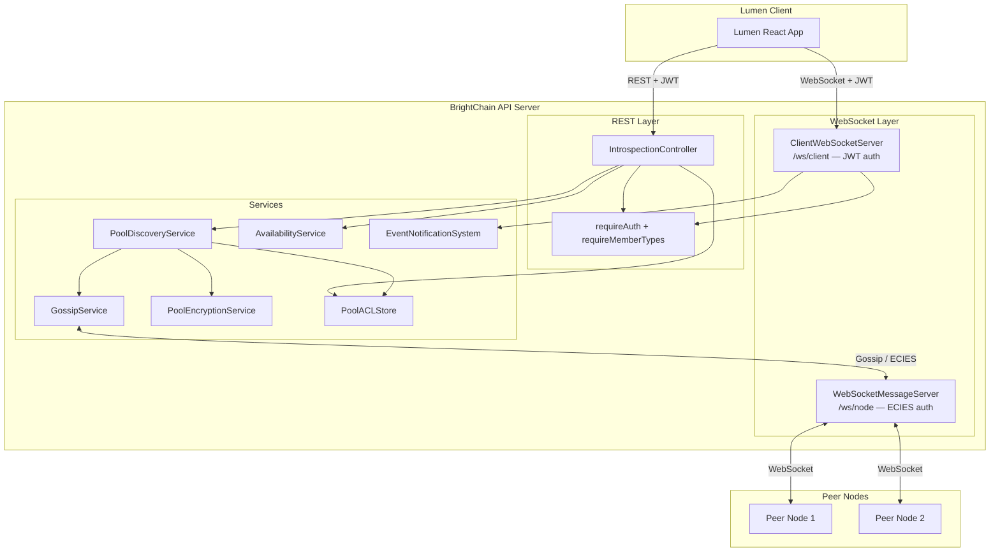
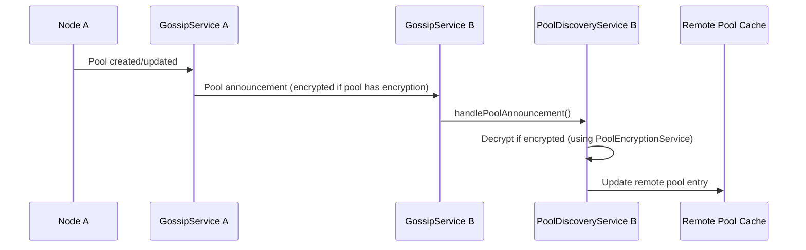
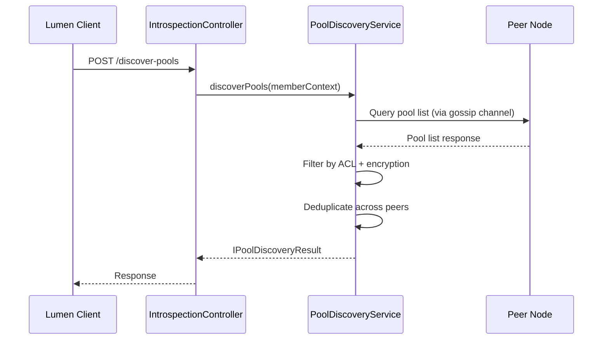

# Design Document: Lumen–BrightChain Client Protocol

## Overview

Lumen is the primary GUI admin tool and visualizer for BrightChain — it handles node management, quorum status visualization, pool management, and network topology monitoring. This design describes the server-side protocol layer that turns `brightchain-api` into a first-class introspection and management target for Lumen. It adds:

1. **Node Introspection REST API** — a new `IntrospectionController` with role-tiered endpoints for node status, peers, pools, block store stats, and energy accounts. This serves as the foundation for Lumen's node management, quorum visualization, and network monitoring capabilities. Existing controllers (QuorumController, BlocksController, etc.) already handle domain-specific operations; the IntrospectionController adds the cross-cutting observability layer Lumen needs.
2. **Pool Discovery Service** — a new service that extends the existing gossip/discovery infrastructure to discover pools (not just blocks) across connected peers, respecting ACLs and encryption.
3. **Client WebSocket Channel** — a JWT-authenticated WebSocket server on a dedicated path (`/ws/client`) separate from the existing ECIES-authenticated gossip WebSocket, delivering typed `IClientEvent` envelopes to subscribed Lumen sessions.
4. **Shared DTO Interfaces** — generic `<TID>` interfaces in `brightchain-lib` and Express response wrappers in `brightchain-api-lib`.

The design does NOT emulate MongoDB's wire protocol. It builds on existing infrastructure: `WebSocketMessageServer`, `GossipService`, `AvailabilityService`, `PoolACLStore`, `PoolEncryptionService`, `EventNotificationSystem`, and the `requireAuth`/`requireMemberTypes` middleware stack.

## Architecture



### Key Architectural Decisions

1. **Separate WebSocket paths**: `/ws/client` (JWT, Lumen) vs existing `/ws/node` (ECIES, peer gossip). Different auth, different message schemas, different trust models.
2. **Role-tiered access via existing middleware**: `requireAuth(jwtSecret)` for all endpoints, `requireMemberTypes(MemberType.Admin, MemberType.System)` for admin endpoints. No new auth infrastructure needed.
3. **Pool discovery as a new service**: `PoolDiscoveryService` sits alongside `DiscoveryProtocol` (which discovers blocks). It uses `GossipService` for pool announcements and maintains a local cache of remote pool metadata.
4. **Event bridging**: The `ClientWebSocketServer` subscribes to `EventNotificationSystem` and `AvailabilityService` events, filters by member permissions and MemberType, and forwards as `IClientEvent` envelopes.
5. **DTO pattern**: All data interfaces in `brightchain-lib` with `<TID>` generics. API response wrappers in `brightchain-api-lib` extending `IApiMessageResponse`. Frontend uses `TID = string`, backend uses `TID = GuidV4Buffer`.

## Components and Interfaces

### 1. IntrospectionController (`brightchain-api-lib`)

A new controller extending `BaseController` that registers all introspection REST endpoints.

**Route definitions:**

| Method | Path | Access | Handler | Requirements |
|--------|------|--------|---------|-------------|
| GET | `/api/introspection/status` | Public | `handleGetStatus` | 2.1, 2.3, 2.4 |
| GET | `/api/introspection/peers` | Admin | `handleListPeers` | 3.1, 3.3 |
| GET | `/api/introspection/pools` | Public | `handleListPools` | 4.1, 4.5 |
| GET | `/api/introspection/pools/:poolId` | Public | `handleGetPoolDetails` | 4.2, 4.3 |
| GET | `/api/introspection/stats` | Admin | `handleGetBlockStoreStats` | 5.1 |
| GET | `/api/introspection/energy` | Public | `handleGetEnergy` | 6.1 |
| GET | `/api/introspection/energy/:memberId` | Admin | `handleGetMemberEnergy` | 6.3 |
| POST | `/api/introspection/discover-pools` | Admin | `handleDiscoverPools` | 7.1, 7.4, 7.5 |


**Middleware stacking:**

```typescript
// Public endpoints
routeConfig('get', '/status', {
  handlerKey: 'getStatus',
  useAuthentication: true,  // requireAuth
});

// Admin endpoints
routeConfig('get', '/peers', {
  handlerKey: 'listPeers',
  useAuthentication: true,
  additionalMiddleware: [requireMemberTypes(MemberType.Admin, MemberType.System)],
});
```

**Handler signatures (pseudocode):**

```
handleGetStatus(req: IAuthenticatedRequest) -> INodeStatusApiResponse
  - Read uptime, version from application
  - Read partition mode from AvailabilityService
  - If member is Admin/System: include disconnected peers list
  - If member is User: include partition flag only

handleListPeers(req: IAuthenticatedRequest) -> IPeerListApiResponse
  - Read connected nodes from WebSocketMessageServer
  - Enrich with last-seen timestamps from HeartbeatMonitor

handleListPools(req: IAuthenticatedRequest) -> IPoolListApiResponse
  - Get all local pool IDs from AvailabilityService/BlockRegistry
  - If member is Admin/System: return all pools
  - If member is User: filter by PoolACL Read permission
  - For each pool: build IPoolInfo with block count, size, member count, encryption status

handleGetPoolDetails(req: IAuthenticatedRequest) -> IPoolDetailApiResponse
  - Check PoolACL Read permission (or Admin/System override)
  - Return full pool metadata including ACL summary

handleGetBlockStoreStats(req: IAuthenticatedRequest) -> IBlockStoreStatsApiResponse
  - Read statistics from AvailabilityService.getStatistics()
  - Add block type breakdown from BlockStore

handleGetEnergy(req: IAuthenticatedRequest) -> IEnergyAccountApiResponse
  - Read energy account for req.memberContext.memberId
  - Return balance, available, earned, spent, reserved

handleGetMemberEnergy(req: IAuthenticatedRequest) -> IEnergyAccountApiResponse
  - Admin-only: read energy account for params.memberId

handleDiscoverPools(req: IAuthenticatedRequest) -> IPoolDiscoveryApiResponse
  - Delegate to PoolDiscoveryService.discoverPools(memberContext)
  - Return aggregated, deduplicated results with unreachable peer list
```

### 2. PoolDiscoveryService (`brightchain-api-lib`)

A new service that discovers pools across connected peers.

```
class PoolDiscoveryService {
  constructor(
    peerProvider: IPeerProvider,
    poolAclStore: PoolACLStore,
    poolEncryptionService: PoolEncryptionService,
    gossipService: GossipService,
  )

  // Query all connected peers for their pool lists
  async discoverPools(memberContext: IMemberContext): Promise<IPoolDiscoveryResult<string>>

  // Handle incoming pool announcement from gossip
  handlePoolAnnouncement(announcement: PoolAnnouncement): void

  // Handle incoming pool removal from gossip
  handlePoolRemoval(poolId: string, nodeId: string): void

  // Get cached remote pool info
  getRemotePoolCache(): Map<string, IRemotePoolEntry>

  // Clear cache for a specific peer (on disconnect)
  clearPeerCache(peerId: string): void
}
```

**Pool announcement flow:**



**Discovery query flow:**



### 3. ClientWebSocketServer (`brightchain-api-lib`)

A new WebSocket server class for client connections, separate from `WebSocketMessageServer`.

```
class ClientWebSocketServer {
  constructor(
    server: Server,
    jwtSecret: string,
    eventNotificationSystem: EventNotificationSystem,
  )

  // Authenticate incoming WebSocket connection via JWT
  private authenticateConnection(req: IncomingMessage): IMemberContext | null

  // Handle subscription messages from clients
  private handleSubscription(ws: WebSocket, memberContext: IMemberContext, message: ISubscriptionMessage): void

  // Broadcast event to subscribed clients, filtered by permissions
  broadcastEvent(event: IClientEvent<string>): void

  // Handle JWT expiration for active sessions
  private startTokenExpirationMonitor(): void

  // Get count of connected client sessions
  getConnectedClientCount(): number

  // Close all client connections
  close(callback?: () => void): void
}
```

**WebSocket path separation:**

| Path | Auth | Purpose | Server Class |
|------|------|---------|-------------|
| `/ws/node/:nodeId` | ECIES signature | Node-to-node gossip | `WebSocketMessageServer` (existing) |
| `/ws/client` | JWT bearer token | Client real-time events | `ClientWebSocketServer` (new) |

**Client event filtering logic:**

```
function shouldDeliverEvent(event: IClientEvent, memberContext: IMemberContext): boolean
  - If event.accessTier === 'admin':
    return memberContext.type === MemberType.Admin || memberContext.type === MemberType.System
  - If event.accessTier === 'pool-scoped':
    return hasPermission(poolAcl, memberContext.memberId, PoolPermission.Read)
  - If event.accessTier === 'member-scoped':
    return event.targetMemberId === memberContext.memberId
  - If event.accessTier === 'public':
    return true
```

### 4. Gossip Protocol Extensions (`brightchain-api-lib`)

Extend the existing `GossipService` with pool-level announcement types.

**New announcement types added to `BlockAnnouncement`:**

```
// New gossip message types (extend existing enum)
enum GossipMessageType {
  // ... existing types ...
  POOL_ANNOUNCEMENT = 'gossip:pool_announcement',
  POOL_REMOVAL = 'gossip:pool_removal',
}

// Pool announcement payload
interface IPoolAnnouncementPayload {
  poolId: string;
  nodeId: string;
  blockCount: number;
  totalSize: number;
  encrypted: boolean;
  encryptedMetadata?: string;  // ECIES-encrypted pool details for authorized members
  ttl: number;
}
```

The `GossipService` already supports `announceBlock`, `announceRemoval`, `announcePoolDeletion`, and encrypted batches. Pool announcements follow the same pattern: queued, batched, and optionally encrypted per-peer using `PoolEncryptionService`.


## Data Models

### Shared Interfaces (`brightchain-lib`)

All interfaces use the `<TID>` generic parameter for DTO flexibility. Frontend uses `TID = string`, backend uses `TID = GuidV4Buffer`.

```typescript
// brightchain-lib/src/lib/interfaces/clientProtocol/nodeStatus.ts
export interface INodeStatus<TID = string> {
  nodeId: TID;
  healthy: boolean;
  uptime: number;           // seconds
  version: string;
  capabilities: string[];
  partitionMode: boolean;
  disconnectedPeers?: TID[]; // only populated for Admin/System
}

// brightchain-lib/src/lib/interfaces/clientProtocol/peerInfo.ts
export interface IPeerInfo<TID = string> {
  nodeId: TID;
  connected: boolean;
  lastSeen: string;         // ISO 8601
  latencyMs?: number;
}

export interface INetworkTopology<TID = string> {
  localNodeId: TID;
  peers: IPeerInfo<TID>[];
  totalConnected: number;
}

// brightchain-lib/src/lib/interfaces/clientProtocol/poolInfo.ts
export interface IPoolInfo<TID = string> {
  poolId: string;           // PoolId is always string
  blockCount: number;
  totalSize: number;        // bytes
  memberCount: number;
  encrypted: boolean;
  publicRead: boolean;
  publicWrite: boolean;
  hostingNodes: TID[];      // nodes known to host this pool
}

export interface IPoolDetail<TID = string> extends IPoolInfo<TID> {
  owner: TID;
  aclSummary: IPoolAclSummary<TID>;
}

export interface IPoolAclSummary<TID = string> {
  memberCount: number;
  adminCount: number;
  publicRead: boolean;
  publicWrite: boolean;
  currentUserPermissions: string[]; // PoolPermission values for the requesting member
}

// brightchain-lib/src/lib/interfaces/clientProtocol/poolDiscovery.ts
export interface IPoolDiscoveryResult<TID = string> {
  pools: IPoolInfo<TID>[];
  queriedPeers: TID[];
  unreachablePeers: TID[];
  timestamp: string;        // ISO 8601
}

// brightchain-lib/src/lib/interfaces/clientProtocol/blockStoreStats.ts
export interface IBlockStoreStats {
  totalCapacity: number;    // bytes
  currentUsage: number;     // bytes
  availableSpace: number;   // bytes
  blockCounts: Record<string, number>; // blockType -> count
  totalBlocks: number;
}

// brightchain-lib/src/lib/interfaces/clientProtocol/energyAccount.ts
export interface IEnergyAccountStatus<TID = string> {
  memberId: TID;
  balance: number;
  availableBalance: number;
  earned: number;
  spent: number;
  reserved: number;
}

// brightchain-lib/src/lib/interfaces/clientProtocol/clientEvent.ts
export enum ClientEventType {
  PeerConnected = 'peer:connected',
  PeerDisconnected = 'peer:disconnected',
  PoolChanged = 'pool:changed',
  PoolCreated = 'pool:created',
  PoolDeleted = 'pool:deleted',
  EnergyBalanceUpdated = 'energy:updated',
  StorageAlert = 'storage:alert',
  TokenExpiring = 'auth:token_expiring',
}

export enum ClientEventAccessTier {
  Public = 'public',
  Admin = 'admin',
  PoolScoped = 'pool-scoped',
  MemberScoped = 'member-scoped',
}

export interface IClientEvent<TID = string> {
  eventType: ClientEventType;
  accessTier: ClientEventAccessTier;
  payload: unknown;
  timestamp: string;        // ISO 8601
  correlationId: string;
  targetPoolId?: string;    // for pool-scoped events
  targetMemberId?: TID;     // for member-scoped events
}

// brightchain-lib/src/lib/interfaces/clientProtocol/subscriptionMessage.ts
export interface ISubscriptionMessage {
  action: 'subscribe' | 'unsubscribe';
  eventTypes: ClientEventType[];
}
```

### API Response Wrappers (`brightchain-api-lib`)

```typescript
// brightchain-api-lib/src/lib/interfaces/introspectionApiResponses.ts
import { IApiMessageResponse } from '@digitaldefiance/node-express-suite';
import {
  INodeStatus,
  INetworkTopology,
  IPoolInfo,
  IPoolDetail,
  IPoolDiscoveryResult,
  IBlockStoreStats,
  IEnergyAccountStatus,
} from '@brightchain/brightchain-lib';

export interface INodeStatusApiResponse extends IApiMessageResponse {
  data: INodeStatus<string>;
}

export interface IPeerListApiResponse extends IApiMessageResponse {
  data: INetworkTopology<string>;
}

export interface IPoolListApiResponse extends IApiMessageResponse {
  data: IPoolInfo<string>[];
}

export interface IPoolDetailApiResponse extends IApiMessageResponse {
  data: IPoolDetail<string>;
}

export interface IPoolDiscoveryApiResponse extends IApiMessageResponse {
  data: IPoolDiscoveryResult<string>;
}

export interface IBlockStoreStatsApiResponse extends IApiMessageResponse {
  data: IBlockStoreStats;
}

export interface IEnergyAccountApiResponse extends IApiMessageResponse {
  data: IEnergyAccountStatus<string>;
}
```

### Gossip Extensions (`brightchain-api-lib`)

```typescript
// New types added to existing websocketMessageType.ts enum
export enum ClientProtocolGossipType {
  POOL_ANNOUNCEMENT = 'gossip:pool_announcement',
  POOL_REMOVAL = 'gossip:pool_removal',
  POOL_LIST_REQUEST = 'gossip:pool_list_request',
  POOL_LIST_RESPONSE = 'gossip:pool_list_response',
}

// Pool announcement carried inside gossip batches
export interface IPoolGossipAnnouncement {
  type: 'pool_announce' | 'pool_remove';
  poolId: string;
  nodeId: string;
  blockCount: number;
  totalSize: number;
  encrypted: boolean;
  encryptedMetadata?: string;
  ttl: number;
}
```


## Correctness Properties

*A property is a characteristic or behavior that should hold true across all valid executions of a system — essentially, a formal statement about what the system should do. Properties serve as the bridge between human-readable specifications and machine-verifiable correctness guarantees.*

The following properties are derived from the acceptance criteria in the requirements document. Each property is universally quantified and designed for property-based testing with `fast-check`.

### Property 1: Role-based endpoint access control

*For any* introspection endpoint and *for any* authenticated member, the endpoint grants access if and only if the endpoint's access tier matches the member's MemberType: Public endpoints accept all authenticated members, Admin endpoints accept only members with MemberType `Admin` or `System`, and all other combinations result in a 403 Forbidden response.

**Validates: Requirements 1.2, 1.3, 11.5**

### Property 2: Authentication required for all endpoints

*For any* introspection endpoint and *for any* request that lacks a valid JWT bearer token (missing, malformed, or expired), the endpoint returns a 401 Unauthorized response.

**Validates: Requirements 2.2, 11.1**

### Property 3: Partition mode response varies by member type

*For any* node status response when the node is in partition mode, the `disconnectedPeers` field is present and non-empty if and only if the requesting member has MemberType `Admin` or `System`. For members with MemberType `User`, the `partitionMode` flag is `true` but `disconnectedPeers` is undefined.

**Validates: Requirements 2.3, 2.4**

### Property 4: Pool listing filtered by authorization

*For any* set of local pools and *for any* authenticated member, the pools endpoint returns exactly the set of pools the member is authorized to see: pools where the member has Pool_ACL Read permission, plus all pools if the member has MemberType `Admin` or `System`. No unauthorized pool appears in the result, and no authorized pool is omitted.

**Validates: Requirements 4.1, 4.3, 4.5**

### Property 5: Unauthorized pool direct access returns 403

*For any* pool and *for any* member who lacks Read permission on that pool and does not have MemberType `Admin` or `System`, a GET request for that pool's details returns a 403 Forbidden response.

**Validates: Requirements 4.3**

### Property 6: Pool discovery results contain only authorized pools

*For any* pool discovery result and *for any* requesting member, every pool in the result is one where the member has Read permission according to the pool's Pool_ACL, and if the pool has encryption enabled, the member has the decryption keys. No unauthorized or undecryptable pool appears in the result.

**Validates: Requirements 7.2, 7.3**

### Property 7: Pool discovery deduplication invariant

*For any* pool discovery result, no pool ID appears more than once, and each pool's `hostingNodes` list contains all peer nodes that reported hosting that pool.

**Validates: Requirements 7.4**

### Property 8: Pool discovery graceful degradation

*For any* set of connected peers where some subset is unreachable, the pool discovery result contains pools from all reachable peers, and the `unreachablePeers` list contains exactly the peers that could not be reached.

**Validates: Requirements 7.5**

### Property 9: Pool lifecycle events trigger gossip announcements

*For any* pool lifecycle event (creation, metadata update, or deletion), the GossipService queues a corresponding pool announcement (pool_announce for create/update, pool_remove for delete) with the correct pool ID and node ID.

**Validates: Requirements 8.1, 8.4**

### Property 10: Encrypted pool announcement round-trip

*For any* pool with encryption enabled, encrypting the pool announcement metadata with the pool's encryption key and then decrypting it with the same key produces the original metadata. Additionally, attempting to decrypt with a different key fails.

**Validates: Requirements 8.2**

### Property 11: Pool announcement cache update invariant

*For any* pool announcement received from a peer, after processing the announcement, the PoolDiscoveryService's remote pool cache contains an entry for that pool with the announcing node in its hosting nodes list.

**Validates: Requirements 8.3**

### Property 12: WebSocket JWT authentication gate

*For any* WebSocket connection attempt to the client channel endpoint, the connection is established if and only if the provided JWT token is valid and not expired. Invalid or expired tokens result in connection rejection.

**Validates: Requirements 9.1, 9.2**

### Property 13: Client event delivery respects access tiers

*For any* emitted client event and *for any* set of subscribed WebSocket sessions, the event is delivered only to sessions whose member's MemberType satisfies the event's access tier: admin-tier events go only to Admin/System members, pool-scoped events go only to members with Read permission on the target pool, member-scoped events go only to the target member, and public events go to all subscribers.

**Validates: Requirements 3.2, 4.4, 6.2, 9.4, 9.7**

### Property 14: Client event envelope completeness

*For any* client event delivered over the WebSocket channel, the event envelope contains all required fields: `eventType`, `accessTier`, `payload`, `timestamp` (valid ISO 8601), and `correlationId` (non-empty string).

**Validates: Requirements 9.4**

### Property 15: Shared interface serialization round-trip

*For any* valid instance of `INodeStatus`, `IPoolInfo`, `IPoolDiscoveryResult`, `INetworkTopology`, `IClientEvent`, `IBlockStoreStats`, or `IEnergyAccountStatus`, serializing to JSON and deserializing back produces an object deeply equal to the original.

**Validates: Requirements 10.3**

### Property 16: Introspection response completeness

*For any* successful introspection endpoint response, all fields defined in the corresponding shared interface are present and have the correct types (non-null, non-undefined for required fields).

**Validates: Requirements 2.1, 3.1, 4.2, 5.1, 6.1**

### Property 17: Energy account access control

*For any* member with MemberType `User` requesting another member's energy account (where the requested memberId differs from the requesting member's ID), the endpoint returns a 403 Forbidden response.

**Validates: Requirements 6.3**

### Property 18: WebSocket token expiration notification

*For any* active Client_WebSocket_Channel session where the JWT token's expiration time has passed, the server sends a `TokenExpiring` client event before closing the connection.

**Validates: Requirements 11.4**

## Error Handling

### REST API Errors

All error responses follow the existing `errorResponse.ts` pattern using `IApiMessageResponse`:

| Scenario | Status | Error Code | Handler |
|----------|--------|------------|---------|
| Missing/invalid JWT | 401 | `UNAUTHORIZED` | `requireAuth` middleware |
| Expired JWT | 401 | `TOKEN_EXPIRED` | `requireAuth` middleware |
| User accessing Admin endpoint | 403 | `INSUFFICIENT_PERMISSIONS` | `requireMemberTypes` middleware |
| User accessing unauthorized pool | 403 | `INSUFFICIENT_PERMISSIONS` | `IntrospectionController` |
| Pool not found | 404 | `NOT_FOUND` | `IntrospectionController` |
| Peer unreachable during discovery | 200 (partial) | N/A | Included in `unreachablePeers` |
| Internal service error | 500 | `INTERNAL_ERROR` | Controller catch block |

### WebSocket Errors

| Scenario | Behavior |
|----------|----------|
| Invalid JWT on connect | Close connection with code 4001 + "Authentication failed" |
| Expired JWT on connect | Close connection with code 4001 + "Token expired" |
| JWT expires during session | Send `TokenExpiring` event, grace period, then close with code 4002 |
| Invalid subscription message | Send error frame with `invalid_subscription` type |
| Server shutdown | Send close frame with code 1001 (Going Away) |

### Pool Discovery Errors

- Unreachable peers: included in `unreachablePeers` array, not treated as errors
- Decryption failures for encrypted pools: pool silently excluded from results (member lacks keys)
- ACL lookup failures: pool excluded from results, logged server-side

## Testing Strategy

### Property-Based Testing

All correctness properties (1–18) will be implemented as property-based tests using `fast-check` in Jest. Each test runs a minimum of 100 iterations.

**Test organization:**

- `brightchain-api-lib/src/lib/controllers/api/introspection.property.spec.ts` — Properties 1–5, 16, 17
- `brightchain-api-lib/src/lib/availability/poolDiscoveryService.property.spec.ts` — Properties 6–8, 11
- `brightchain-api-lib/src/lib/availability/poolGossip.property.spec.ts` — Properties 9, 10
- `brightchain-api-lib/src/lib/services/clientWebSocketServer.property.spec.ts` — Properties 12–14, 18
- `brightchain-lib/src/__tests__/clientProtocol.serialization.property.spec.ts` — Property 15

**Generators needed:**

- `arbMemberContext()` — generates `IMemberContext` with random MemberType, memberId, username
- `arbPoolACL()` — generates `IPoolACL<string>` with random members and permissions
- `arbPoolInfo()` — generates `IPoolInfo<string>` with random pool metadata
- `arbClientEvent()` — generates `IClientEvent<string>` with random event types and access tiers
- `arbNodeStatus()` — generates `INodeStatus<string>` with random node state
- `arbBlockStoreStats()` — generates `IBlockStoreStats` with random storage metrics
- `arbEnergyAccountStatus()` — generates `IEnergyAccountStatus<string>` with random balances

### Unit Testing

Unit tests complement property tests for specific examples and edge cases:

- `introspection.spec.ts` — Specific endpoint responses, error cases, middleware integration
- `poolDiscoveryService.spec.ts` — Specific discovery scenarios, cache behavior, timeout handling
- `clientWebSocketServer.spec.ts` — Connection lifecycle, subscription management, ping/pong

**Key unit test scenarios:**

- Empty peer list returns 200 with empty array (Req 3.3)
- Storage threshold crossing triggers alert event (Req 5.2)
- WebSocket idle timeout triggers ping then close (Req 9.5)
- Concurrent discovery requests don't corrupt cache

### Test Execution

```bash
# Run all tests for brightchain-api-lib
NX_TUI=false npx nx run brightchain-api-lib:test --outputStyle=stream

# Run all tests for brightchain-lib
NX_TUI=false npx nx run brightchain-lib:test --outputStyle=stream
```

Each property test is tagged with:
```
Feature: lumen-brightchain-client-protocol, Property N: [property title]
```
