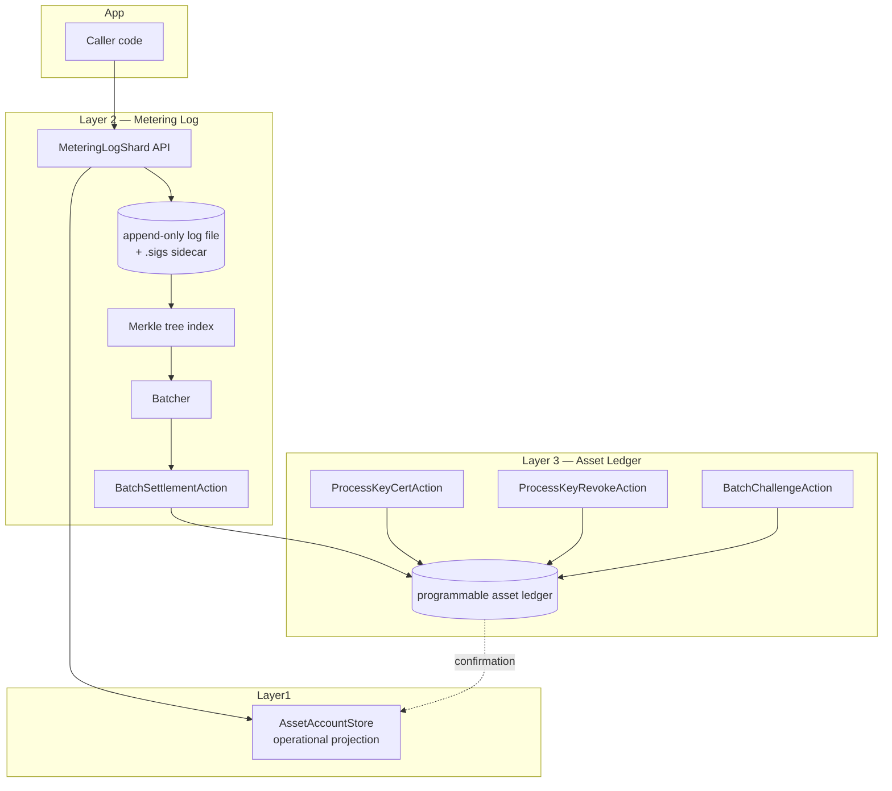

# Design — Metering Log (Layer 2)

## Overview

The metering log is a per-shard signed hash chain that batches fine-grained
events into compact, verifiable settlements posted to the asset ledger.
Three properties drive the design:

1. **Local append throughput** — the hot path is append-only, single-writer,
   single-fsync per record (or per batch via group commit).
2. **Tamper-evidence with bounded blast radius** — every Kth record is
   signed by an ephemeral process key whose lifecycle is anchored in the
   asset ledger.
3. **Compact settlement with selective disclosure** — settlement carries
   only per-`(memberId, assetId)` deltas plus a Merkle root, but full
   inclusion/exclusion proofs are derivable on demand.

This is a **Layer 2** component: it sits between the operational
`AssetAccountStore` (Layer 1) and the `programmable-asset-ledger` (Layer 3).



## Architecture

### Components

| Component                | Responsibility                                                |
| ------------------------ | ------------------------------------------------------------- |
| `MeteringLogShard`       | Owns one shard's chain. Append, sign, batch, flush.           |
| `MeteringLogStorage`     | Pluggable storage (flat-file v1; LMDB optional).              |
| `MeteringLogVerifier`    | Stateless verification of records, sigs, settlements, proofs. |
| `BatchAccumulator`       | In-memory delta map for `(memberId, assetId)` pairs.          |
| `MerkleTreeIndex`        | RFC-9162 compatible Merkle tree, on-disk persistent.          |
| `ProcessKeyManager`      | Ed25519 key rotation, cert/revoke workflow with ledger.       |
| `MeteringLogReader`      | Read-only interface for verifiers and dispute responders.     |

### Append path (hot loop)

```
1. caller -> MeteringLogShard.appendRecord({ memberId, assetId, op, amount, opId, contextHash })
2. shard:
   a. assert (memberId, opId) not already in current batch window  (idempotency)
   b. seq = lastSeq + 1
   c. prevHash = lastTipHash
   d. cbor = encode({ seq, prev_hash, ts, op, memberId, assetId, amount, opId, context_hash })
   e. payload = u32_le(len(cbor)) || cbor
   f. write(payload); fsync at group-commit boundary
   g. tipHash = blake3(prev_hash_field_extracted_serialized_record_form)
   h. update merkle leaf at index = seq - batchFromSeq
   i. accumulator.add(memberId, assetId, amount)
   j. assetAccountStore.applyDelta(memberId, assetId, ...)   // Layer 1 optimistic
   k. if seq % K == 0: emitSignature(seq, tipHash)
   l. if batch full or aged: flush()
   m. return { seq, tipHash }
```

### Batch flush path

```
1. shard.flush():
   a. emitSignature(toSeq, tipHash)               // always sign on flush
   b. itemsRoot = merkle.rootForRange(fromSeq, toSeq)
   c. memberDeltas = accumulator.materialize()    // sorted by (memberId, assetId)
   d. action = { shardId, fromSeq, toSeq, tipHash, itemsRoot, memberDeltas, sigEnvelope }
   e. assetLedger.submit(action)
   f. on confirmation:
        - persist settlement record locally (for dispute response)
        - assetAccountStore.markSettled(assetId, ts)
   g. accumulator.reset(); fromSeq := toSeq + 1
```

## Data Models

### Record (CBOR)

```ts
interface MeteringRecord {
  seq: bigint;              // uint64 in CBOR
  prev_hash: Uint8Array;    // 32 bytes (BLAKE3)
  ts: bigint;               // microseconds since epoch
  op: string;               // event discriminator, caller-defined
  memberId: Uint8Array;     // 32 bytes
  assetId: string;          // e.g. 'joule'
  amount: bigint;           // signed microunits; +earn / -spend
  opId: string;             // idempotency key, caller-supplied
  context_hash: Uint8Array; // 32 bytes
}
```

On-disk: `u32_le(payload_len) || cbor_payload`.

### Signature entry (sidecar `<shardId>.sigs`)

```ts
interface SignatureEntry {
  seq: bigint;
  tipHash: Uint8Array;            // 32 bytes
  processKeyFingerprint: Uint8Array; // 32 bytes (BLAKE3 of pubkey)
  signature: Uint8Array;          // 64 bytes (Ed25519)
}
```

Sidecar is a flat file of length-prefixed CBOR `SignatureEntry`s, indexed
by `seq`.

### BatchSettlementAction (asset-ledger payload)

```ts
interface BatchSettlementAction {
  kind: 'BatchSettlement';
  shardId: string;
  fromSeq: bigint;
  toSeq: bigint;
  tipHash: Uint8Array;
  itemsRoot: Uint8Array;
  memberDeltas: Array<{
    memberId: Uint8Array;
    assetId: string;
    earned: bigint;
    spent: bigint;
  }>;
  sigEnvelope: SignatureEntry; // covers toSeq
}
```

### ProcessKeyCertAction / ProcessKeyRevokeAction

```ts
interface ProcessKeyCertAction {
  kind: 'ProcessKeyCert';
  shardId: string;
  fingerprint: Uint8Array;
  pubKey: Uint8Array;            // 32 bytes Ed25519
  notBefore: bigint;             // µs since epoch
  notAfter: bigint;              // ≤ notBefore + 7d
  operatorSig: Uint8Array;       // signed by operator long-term key
}

interface ProcessKeyRevokeAction {
  kind: 'ProcessKeyRevoke';
  shardId: string;
  fingerprint: Uint8Array;
  reason: 'rotation' | 'compromise' | 'shutdown';
  effectiveAtSeq?: bigint;       // for compromise: revoke retroactively
  operatorSig: Uint8Array;
}
```

### Merkle tree

- Binary, balanced, RFC-9162-compatible (CT log domain separation).
- Leaf = `BLAKE3(0x00 || serialized_record)`.
- Internal = `BLAKE3(0x01 || left || right)`.
- Persisted on disk per batch (compact node store keyed by `(seq, level)`).
- Discarded after settlement is `FINAL` (post dispute window).

## Storage Layout

```
data/metering/<shardId>/
  log.000001.cbor          # rotated at 256 MiB
  log.000001.sigs          # sidecar signatures
  log.000002.cbor
  log.000002.sigs
  ...
  index/                   # merkle nodes for unsettled / disputable batches
    batch_<fromSeq>_<toSeq>.idx
  state.json               # { lastSeq, lastTipHash, processKeyFingerprint, ... }
  state.json.bak
```

State writes are atomic: write `state.json.tmp` → fsync → rename.

## Verification Algorithm

```
verifyRange(records, sigs, fromSeq, toSeq):
  assert records[0].seq == fromSeq
  assert records[-1].seq == toSeq
  for i in 1..len(records)-1:
    assert records[i].prev_hash == blake3(serialize(records[i-1]))
  let tipHash = blake3(serialize(records[-1]))
  let coveringSig = first sig in sigs with seq >= toSeq AND seq <= toSeq + K
  assert coveringSig.tipHash == tipHash recomputed up to coveringSig.seq
  assert ed25519.verify(coveringSig.signature, "metering-log-sig-v1" || shardId || coveringSig.seq || coveringSig.tipHash || coveringSig.processKeyFingerprint, pubKeyByFingerprint)
  assert ledger.processKey(coveringSig.processKeyFingerprint) is valid at toSeq
  return OK
```

## Error Handling

| Error                          | Thrown by                       | Notes                                          |
| ------------------------------ | ------------------------------- | ---------------------------------------------- |
| `MeteringLogLockedError`       | `MeteringLogShard.open`         | Another writer holds the lock.                 |
| `MeteringLogCorruptError`      | recovery                        | Length prefix valid but body fails CBOR/hash.  |
| `DuplicateOpIdError`           | `appendRecord`                  | `(memberId, opId)` repeat within batch window. |
| `ProcessKeyNotConfirmedError`  | `appendRecord`                  | Cert not yet confirmed in asset ledger.        |
| `ProcessKeyExpiredError`       | `appendRecord`                  | `notAfter` reached; rotate.                    |
| `BatchOutOfOrderError`         | asset ledger validation         | `fromSeq != prevToSeq + 1`.                    |
| `BatchTipMismatchError`        | challenge response validation   | `tipHash` doesn't match recomputation.         |
| `MerkleProofInvalidError`      | inclusion/exclusion verifier    | Path mismatch.                                 |
| `DisputeWindowClosedError`     | challenge submission            | Window expired.                                |
| `DisputeResponseTimeoutError`  | challenge resolution            | Operator didn't respond in time.               |

## Crash Recovery

```
on startup:
  read state.json (or .bak if main is invalid)
  scan from last fully-indexed seq forward through log files:
    while bytes remain:
      try read u32_le len; if EOF mid-prefix -> truncate at prefix start
      try read len bytes; if EOF -> truncate at prefix start
      try cbor decode; if invalid -> truncate at prefix start
      verify prev_hash chain; if mismatch -> halt with MeteringLogCorruptError
      replay merkle index update + accumulator delta
  emit MeteringLogRecovery diagnostic with (recoveredTo, truncatedBytes)
  open log for append at next position
```

## Testing Strategy

- **Unit**: record serialization round-trip; signature creation/verification;
  Merkle inclusion/exclusion proofs; idempotency cache.
- **Property-based (fast-check)**:
  - Random op streams → flush → `BatchSettlementAction` reproducibility.
  - Random subset → inclusion proof always validates.
  - Random non-members → exclusion proof always validates.
  - Random byte-truncation of last record → recovery converges to the
    last valid tip.
- **Integration**:
  - Spin up an in-memory asset-ledger stub; simulate cert/revoke; verify
    that records signed under a revoked key are rejected.
  - Simulate a malicious operator submitting a `tipHash` that doesn't
    match its records; verify challenge resolution.
- **Performance**:
  - Microbenchmark: append loop on tmpfs and NVMe.
  - 50_000 rec/sec sustained for 60 seconds with p99 < 5ms.

## Implementation Plan (high level)

| Phase | Scope                                                                  |
| ----- | ---------------------------------------------------------------------- |
| 1     | Storage layer: flat-file writer/reader, length-prefixed CBOR, fsync.   |
| 2     | Hash chain + signature sidecar; in-process Ed25519 keys.               |
| 3     | Process key cert/revoke flow against asset-ledger (stub initially).    |
| 4     | Merkle tree index + inclusion/exclusion proofs.                        |
| 5     | Batcher + `BatchSettlementAction` emission.                            |
| 6     | Challenge / dispute path on the asset ledger.                          |
| 7     | Operational-tier coupling (`AssetAccountStore.applyDelta`).            |
| 8     | Crash recovery, performance hardening, property tests.                 |

Estimated 3–4 engineer-weeks.

## Out of Scope

- Cross-shard ordering / total order. Shards are independent.
- Witness cosigning (deferred).
- Payload encryption.
- Log compaction / archival.
- Joule-specific rate tables (in `joule-resource-credits`).
