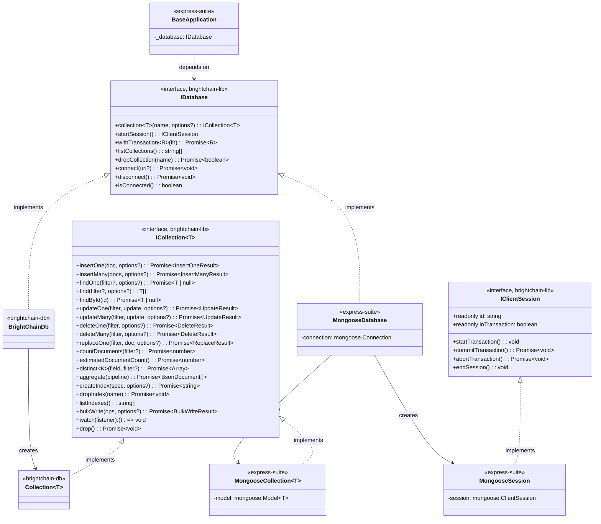
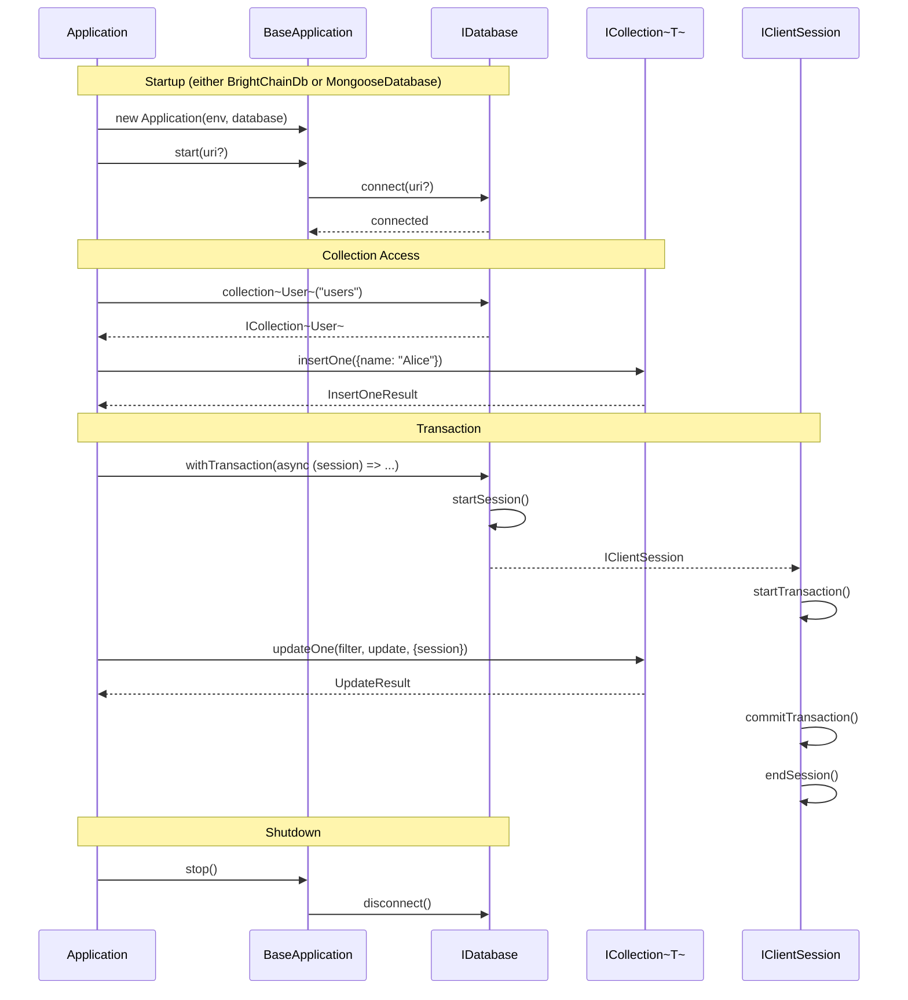
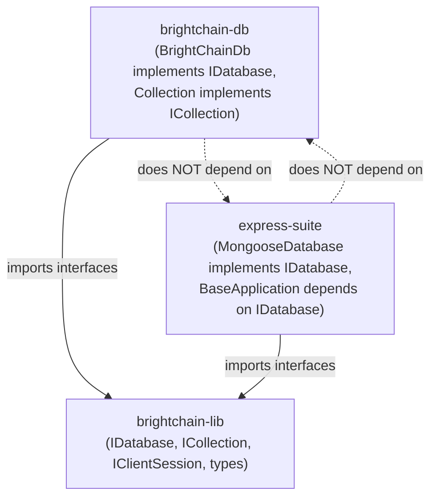

# Design Document: MongoDB-Compatible Document Store

## Overview

This design promotes `brightchain-db`'s existing MongoDB-compatible types to shared interfaces in `brightchain-lib`, defines three core interfaces (`IDatabase`, `ICollection<T>`, `IClientSession`), makes `brightchain-db` conform to them, creates a `MongooseDatabase` adapter in `express-suite`, and refactors `BaseApplication` to depend on `IDatabase` instead of `IDocumentStore`.

The key insight is that `brightchain-db` already has a complete, well-typed MongoDB-compatible API. Rather than creating adapter wrappers around it, we promote its types to shared contracts and make both `brightchain-db` and mongoose conform to the same interface.

## Architecture



### Data Flow



## Components and Interfaces

### Promoted Types (brightchain-lib)

The types currently in `brightchain-db/src/lib/types.ts` are moved to `brightchain-lib/src/lib/interfaces/storage/documentTypes.ts`. The `brightchain-db` package re-exports them from `brightchain-lib`.

```typescript
// brightchain-lib/src/lib/interfaces/storage/documentTypes.ts
// Contains all types currently in brightchain-db/src/lib/types.ts:
// DocumentId, BsonDocument, FilterQuery<T>, FilterOperator<V>, LogicalOperators<T>,
// UpdateOperators<T>, UpdateQuery<T>, SortSpec<T>, ProjectionSpec<T>,
// IndexSpec, IndexOptions, FindOptions<T>, WriteOptions, UpdateOptions,
// InsertOneResult, InsertManyResult, UpdateResult, DeleteResult, ReplaceResult,
// ChangeEventType, ChangeEvent<T>, ChangeListener<T>, AggregationStage,
// ClientSession (renamed to IClientSession), WriteConcern, ReadPreference,
// CollectionOptions, BulkWriteOperation<T>, BulkWriteOptions, BulkWriteResult,
// TextIndexOptions, CursorSession
```

**Design Decision:** Moving types rather than duplicating them. `brightchain-db/src/lib/types.ts` becomes a re-export barrel: `export * from '@brightchain/brightchain-lib/interfaces/storage/documentTypes'`. This ensures a single source of truth and no drift between packages.

### IClientSession (brightchain-lib)

```typescript
// brightchain-lib/src/lib/interfaces/storage/clientSession.ts
export interface IClientSession {
  readonly id: string;
  readonly inTransaction: boolean;
  startTransaction(): void;
  commitTransaction(): Promise<void>;
  abortTransaction(): Promise<void>;
  endSession(): void;
}
```

**Design Decision:** This is identical to `brightchain-db`'s existing `ClientSession` interface. We promote it to `brightchain-lib` as `IClientSession` (prefixed with `I` per project conventions for interfaces). The `brightchain-db` `ClientSession` type alias becomes `export type ClientSession = IClientSession` for backward compatibility.

### ICollection<T> (brightchain-lib)

```typescript
// brightchain-lib/src/lib/interfaces/storage/collection.ts
import {
  BsonDocument, DocumentId, FilterQuery, UpdateQuery, FindOptions,
  WriteOptions, UpdateOptions, InsertOneResult, InsertManyResult,
  UpdateResult, DeleteResult, ReplaceResult, SortSpec, AggregationStage,
  IndexSpec, IndexOptions, ChangeListener, WriteConcern, ReadPreference,
  BulkWriteOperation, BulkWriteOptions, BulkWriteResult, TextIndexOptions,
  CollectionSchema,
} from './documentTypes';

export interface ICollection<T extends BsonDocument = BsonDocument> {
  // CRUD
  insertOne(doc: T, options?: WriteOptions): Promise<InsertOneResult>;
  insertMany(docs: T[], options?: WriteOptions): Promise<InsertManyResult>;
  findOne(filter?: FilterQuery<T>, options?: FindOptions<T>): Promise<T | null>;
  find(filter?: FilterQuery<T>, options?: FindOptions<T>): T[] | Promise<T[]>;
  findById(id: DocumentId): Promise<T | null>;
  updateOne(filter: FilterQuery<T>, update: UpdateQuery<T>, options?: UpdateOptions): Promise<UpdateResult>;
  updateMany(filter: FilterQuery<T>, update: UpdateQuery<T>, options?: UpdateOptions): Promise<UpdateResult>;
  deleteOne(filter: FilterQuery<T>, options?: WriteOptions): Promise<DeleteResult>;
  deleteMany(filter: FilterQuery<T>, options?: WriteOptions): Promise<DeleteResult>;
  replaceOne(filter: FilterQuery<T>, doc: T, options?: UpdateOptions): Promise<ReplaceResult>;

  // Query
  countDocuments(filter?: FilterQuery<T>): Promise<number>;
  estimatedDocumentCount(): Promise<number>;
  distinct<K extends keyof T>(field: K, filter?: FilterQuery<T>): Promise<Array<T[K]>>;
  aggregate(pipeline: AggregationStage[]): Promise<BsonDocument[]>;

  // Indexes
  createIndex(spec: IndexSpec, options?: IndexOptions): Promise<string>;
  dropIndex(name: string): Promise<void>;
  listIndexes(): string[];

  // Bulk
  bulkWrite(operations: BulkWriteOperation<T>[], options?: BulkWriteOptions): Promise<BulkWriteResult>;

  // Change streams
  watch(listener: ChangeListener<T>): () => void;

  // Schema validation
  setSchema(schema: CollectionSchema): void;
  getSchema(): CollectionSchema | undefined;
  removeSchema(): void;

  // Write concern / Read preference
  getWriteConcern(): WriteConcern;
  setWriteConcern(wc: WriteConcern): void;
  getReadPreference(): ReadPreference;
  setReadPreference(rp: ReadPreference): void;

  // Text index
  createTextIndex(options: TextIndexOptions): string;
  dropTextIndex(): void;
  hasTextIndex(): boolean;

  // Lifecycle
  drop(): Promise<void>;
}
```

**Design Decision:** The interface mirrors `brightchain-db`'s `Collection` class public API. Methods like `_txInsert`, `_txUpdate`, `_txDelete`, and `_txRollback*` are intentionally excluded — they are internal transaction mechanics, not part of the public collection contract. The `find` return type is `T[] | Promise<T[]>` to accommodate both synchronous in-memory results and async mongoose queries. The `CollectionSchema` type will also need to be promoted or defined in brightchain-lib since `setSchema`/`getSchema`/`validateDoc` reference it.

### IDatabase (brightchain-lib)

```typescript
// brightchain-lib/src/lib/interfaces/storage/database.ts
import { BsonDocument, CollectionOptions } from './documentTypes';
import { IClientSession } from './clientSession';
import { ICollection } from './collection';

export interface IDatabase {
  /** Get or create a collection by name. */
  collection<T extends BsonDocument = BsonDocument>(
    name: string,
    options?: CollectionOptions,
  ): ICollection<T>;

  /** Start a client session for transaction support. */
  startSession(): IClientSession;

  /** Run a callback within a transaction (auto-commit/abort). */
  withTransaction<R>(fn: (session: IClientSession) => Promise<R>): Promise<R>;

  /** List all known collection names. */
  listCollections(): string[];

  /** Drop a collection by name. */
  dropCollection(name: string): Promise<boolean>;

  /** Connect to the backing store. URI may be ignored by non-network stores. */
  connect(uri?: string): Promise<void>;

  /** Disconnect from the backing store. */
  disconnect(): Promise<void>;

  /** Whether the store is currently connected. */
  isConnected(): boolean;
}
```

**Design Decision:** `connect`/`disconnect`/`isConnected` are included in `IDatabase` rather than a separate lifecycle interface. This keeps the API surface simple — one interface to depend on. For `BrightChainDb`, `connect` is a lightweight state toggle (block storage doesn't need network connections). For `MongooseDatabase`, `connect` establishes the actual mongoose connection.

### BrightChainDb Conformance (brightchain-db)

`BrightChainDb` already implements most of `IDatabase`. The additions are:

```typescript
// Added to brightchain-db/src/lib/database.ts
export class BrightChainDb implements IDatabase {
  private _connected = false;

  async connect(_uri?: string): Promise<void> {
    this._connected = true;
  }

  async disconnect(): Promise<void> {
    this._connected = false;
  }

  isConnected(): boolean {
    return this._connected;
  }

  // Existing methods already satisfy IDatabase:
  // collection<T>(), startSession(), withTransaction(), listCollections(), dropCollection()
}
```

`Collection<T>` already satisfies `ICollection<T>` — no changes needed beyond adding `implements ICollection<T>` to the class declaration.

### MongooseDatabase Adapter (express-suite)

```typescript
// express-suite/packages/digitaldefiance-node-express-suite/src/services/mongoose-database.ts
import { IDatabase, ICollection, IClientSession, BsonDocument, CollectionOptions } from '@brightchain/brightchain-lib';
import mongoose from 'mongoose';

export class MongooseDatabase implements IDatabase {
  private connection: mongoose.Connection;

  constructor(connection?: mongoose.Connection) {
    this.connection = connection ?? mongoose.connection;
  }

  async connect(uri?: string): Promise<void> {
    if (uri) {
      await mongoose.connect(uri);
    }
  }

  async disconnect(): Promise<void> {
    await mongoose.disconnect();
  }

  isConnected(): boolean {
    return this.connection.readyState === 1; // connected
  }

  collection<T extends BsonDocument>(name: string, _options?: CollectionOptions): ICollection<T> {
    return new MongooseCollection<T>(this.connection, name);
  }

  startSession(): IClientSession {
    // Wraps mongoose ClientSession in IClientSession adapter
    return new MongooseSessionAdapter(this.connection);
  }

  async withTransaction<R>(fn: (session: IClientSession) => Promise<R>): Promise<R> {
    const session = this.startSession();
    session.startTransaction();
    try {
      const result = await fn(session);
      await session.commitTransaction();
      return result;
    } catch (err) {
      await session.abortTransaction();
      throw err;
    } finally {
      session.endSession();
    }
  }

  listCollections(): string[] {
    return Object.keys(this.connection.collections);
  }

  async dropCollection(name: string): Promise<boolean> {
    try {
      await this.connection.dropCollection(name);
      return true;
    } catch {
      return false;
    }
  }
}
```

**Design Decision:** `MongooseDatabase` wraps a mongoose `Connection` rather than the global `mongoose` object, allowing multiple database connections. The `MongooseCollection<T>` wrapper (implementation detail, not shown in full) delegates `ICollection` methods to the corresponding mongoose `Model` methods. The `MongooseSessionAdapter` wraps mongoose's `ClientSession` to conform to `IClientSession`.

### MongooseCollection<T> (express-suite)

A wrapper that adapts a mongoose Model to the `ICollection<T>` interface:

```typescript
// express-suite/packages/digitaldefiance-node-express-suite/src/services/mongoose-collection.ts
export class MongooseCollection<T extends BsonDocument> implements ICollection<T> {
  private model: mongoose.Model<T & mongoose.Document>;

  constructor(connection: mongoose.Connection, collectionName: string) {
    // Get or create the model from the connection
    this.model = connection.model<T & mongoose.Document>(collectionName);
  }

  async insertOne(doc: T, options?: WriteOptions): Promise<InsertOneResult> {
    const result = await this.model.create([doc], { session: options?.session as mongoose.ClientSession });
    return { acknowledged: true, insertedId: String(result[0]._id) };
  }

  // ... other ICollection methods delegate to this.model
}
```

**Design Decision:** Each `ICollection` method maps to the equivalent mongoose `Model` method. The main translation work is converting between the shared types (`FilterQuery`, `UpdateQuery`, etc.) and mongoose's native types. Since the shared types are modeled after MongoDB's query language (which mongoose also uses), most translations are straightforward type casts. Schema validation methods (`setSchema`, `getSchema`, etc.) are no-ops on the mongoose side since mongoose handles schema validation internally.

### BaseApplication Refactoring (express-suite)

```typescript
// Updated express-suite application-base.ts
export class BaseApplication<TID, TModelDocs, TInitResults, TConstants> {
  protected readonly _database: IDatabase;

  // Backward compatibility: accept either IDatabase or legacy IDocumentStore
  constructor(
    environment: Environment<TID>,
    database: IDatabase | IDocumentStore<TID, TModelDocs>,
    constants: TConstants,
  ) {
    if ('collection' in database && 'startSession' in database) {
      this._database = database as IDatabase;
    } else {
      // Legacy IDocumentStore — wrap in a compatibility shim
      this._database = new DocumentStoreShim(database);
    }
  }

  async start(uri?: string): Promise<void> {
    await this._database.connect(uri ?? this.environment.mongo.uri);
    // ... plugin init, etc.
  }

  async stop(): Promise<void> {
    await this._database.disconnect();
  }

  getCollection<T extends BsonDocument>(name: string): ICollection<T> {
    return this._database.collection<T>(name);
  }

  // Backward compatibility
  getModel<T>(modelName: string): Model<T> {
    // Delegates to legacy path if available
  }
}
```

**Design Decision:** The constructor uses duck-typing to detect whether the passed object is an `IDatabase` or legacy `IDocumentStore`. This allows a gradual migration — existing code passing `MongooseDocumentStore` continues to work, while new code can pass `BrightChainDb` or `MongooseDatabase` directly. The `DocumentStoreShim` is a thin wrapper that adapts `IDocumentStore` to `IDatabase` for the transition period.

### withTransaction Refactoring (express-suite)

The existing `withTransaction` utility takes a mongoose `Connection` and `ClientSession`. It will be updated to also accept `IDatabase`:

```typescript
// Updated signature (overloaded)
async function withTransaction<T>(
  database: IDatabase,
  useTransaction: boolean,
  session: IClientSession | undefined,
  callback: TransactionCallback<T>,
  options?: TransactionOptions,
): Promise<T>;

// Legacy signature preserved for backward compatibility
async function withTransaction<T>(
  connection: Connection,
  useTransaction: boolean,
  session: ClientSession | undefined,
  callback: TransactionCallback<T>,
  options?: TransactionOptions,
): Promise<T>;
```

**Design Decision:** Function overloading preserves backward compatibility. When an `IDatabase` is passed, the function uses `database.startSession()` instead of `connection.getClient().startSession()`. The retry logic and error handling remain the same.

## Data Models

No new persistent data models are introduced. The promoted types are metadata/contract types, not stored entities.

### Package Dependency Graph



This ensures clean separation: `brightchain-lib` owns the contracts, `brightchain-db` and `express-suite` each implement them independently.


## Correctness Properties

*A property is a characteristic or behavior that should hold true across all valid executions of a system — essentially, a formal statement about what the system should do. Properties serve as the bridge between human-readable specifications and machine-verifiable correctness guarantees.*

### Property 1: Connection state machine

*For any* `IDatabase` implementation (BrightChainDb) and any sequence of `connect` and `disconnect` calls (with arbitrary URI strings including undefined), `isConnected()` SHALL return `true` if the last lifecycle call was `connect`, and `false` if the last lifecycle call was `disconnect` (or if no lifecycle call has been made). No call in the sequence SHALL throw an error.

**Validates: Requirements 5.2, 5.3, 5.4, 5.6, 5.7**

Reasoning: Connect and disconnect are idempotent state transitions. We generate random sequences of `connect(randomUri)` and `disconnect()` calls and verify the invariant after each. Edge cases (repeated connects, repeated disconnects, random URI strings) are naturally covered by the generator.

### Property 2: Sort-skip-limit model equivalence

*For any* array of documents, any sort specification (mapping field names to 1 or -1), any non-negative skip value, and any non-negative limit value, the result of applying sort → skip → limit through the Collection's `find` method SHALL equal the result of: (1) sorting the array by the spec fields in order, (2) dropping the first `s` elements, (3) taking the first `l` elements.

**Validates: Requirements 8.1, 8.2, 8.3, 8.4, 8.5**

Reasoning: This is a model-based property. We have a simple reference implementation (manual sort → slice → slice) and compare it against the actual `Collection` output. The generator produces random document arrays with varying field values, random sort specs, and random skip/limit values. Edge cases (limit=0, skip > length, empty arrays, multi-field sort) are naturally covered by the generator.

### Property 3: Document storage round-trip

*For any* valid document object (with string, number, boolean, nested object, and array fields), storing it via `insertOne` and retrieving it via `findById` using the returned `_id` SHALL produce a document with field values equivalent to the original.

**Validates: Requirements 9.1, 9.2**

Reasoning: This is the fundamental round-trip property for the document store. Documents may be serialized to JSON for block storage and deserialized on retrieval. The generator produces documents with nested structures, arrays, and various field types to ensure serialization preserves all data.

### Property 4: JSON serialization round-trip

*For any* valid document object stored via `insertOne` and retrieved via `findById`, serializing the retrieved document to JSON via `JSON.stringify` and deserializing via `JSON.parse` SHALL produce an object with field values equivalent to the original document (excluding `_id`).

**Validates: Requirements 9.3**

Reasoning: This tests the JSON serialization layer specifically. Documents stored in brightchain-db go through JSON encoding internally. This property ensures that the JSON representation is faithful and no data is lost through the serialization boundary.

## Error Handling

### Connection State Errors
- `BrightChainDb`: `connect` and `disconnect` are idempotent — calling them in any order never throws.
- `MongooseDatabase`: `connect` with an invalid URI throws a mongoose connection error. `disconnect` on an already-disconnected connection is a no-op.

### Collection Access Errors
- `IDatabase.collection(name)`: Returns a collection handle (lazy creation). No error for non-existent collections — they are created on first write (matching MongoDB behavior).

### Transaction Errors
- `IClientSession.commitTransaction()`: Throws if no transaction is active.
- `IClientSession.abortTransaction()`: Throws if no transaction is active.
- `IDatabase.withTransaction(fn)`: Catches errors from the callback, aborts the transaction, and re-throws.

### MongooseDatabase-Specific Errors
- `MongooseDatabase.startSession()`: Throws if not connected.
- `MongooseCollection` methods: Throw mongoose-specific errors (validation, duplicate key, etc.) which are passed through to the caller.

### withTransaction Retry Logic
- The refactored `withTransaction` utility preserves the existing retry logic for transient MongoDB errors (WriteConflict, DuplicateKey, TransactionAborted, etc.).
- When used with `BrightChainDb`, transient errors are not expected (in-memory transactions), but the retry logic is harmless.

## Testing Strategy

### Property-Based Tests (fast-check, minimum 100 iterations)

Each correctness property maps to a single property-based test:

1. **Property 1 test**: Generate random sequences of `{type: 'connect', uri: string | undefined} | {type: 'disconnect'}` operations. Apply each to a `BrightChainDb` instance. After each operation, assert `isConnected()` matches the expected state. Assert no operation throws.
   - Tag: `Feature: mongo-compatible-document-store, Property 1: Connection state machine`

2. **Property 2 test**: Generate random arrays of documents (with numeric and string fields), random sort specs (field → 1 or -1), random skip values (0 to 2× array length), and random limit values (0 to 2× array length). Compare `Collection.find()` with sort/skip/limit options against the reference implementation (manual sort → slice → slice).
   - Tag: `Feature: mongo-compatible-document-store, Property 2: Sort-skip-limit model equivalence`

3. **Property 3 test**: Generate random document objects with string, number, boolean, nested object, and array fields. Insert via `collection.insertOne()`, retrieve via `collection.findById()`, assert deep equality of fields (ignoring `_id`).
   - Tag: `Feature: mongo-compatible-document-store, Property 3: Document storage round-trip`

4. **Property 4 test**: Generate random document objects. Insert via `collection.insertOne()`, retrieve via `collection.findById()`, serialize to JSON via `JSON.stringify`, deserialize via `JSON.parse`, assert deep equality with original fields (ignoring `_id`).
   - Tag: `Feature: mongo-compatible-document-store, Property 4: JSON serialization round-trip`

### Unit Tests (specific examples and edge cases)

- **BrightChainDb connection lifecycle**: Create instance, verify `isConnected()` is false, call `connect()`, verify true, call `disconnect()`, verify false.
- **BrightChainDb implements IDatabase**: Verify all `IDatabase` methods exist and are callable.
- **Collection implements ICollection**: Verify all `ICollection` methods exist and are callable.
- **Sort ascending/descending**: Create 3 documents with known values, sort ascending, verify order. Sort descending, verify reverse order.
- **Multi-field sort**: Create documents with equal first-field values, sort by two fields, verify secondary sort.
- **Limit and skip edge cases**: limit(0) returns empty, skip > length returns empty.
- **Sort + skip + limit chain**: Create 5 documents, sort, skip(1), limit(2), verify correct 2 documents.
- **Nested document round-trip**: Create document with nested objects and arrays, retrieve, verify structure preserved.
- **MongooseDatabase integration** (requires MongoDB): Connect, create collection, insert/find documents, disconnect.
- **BaseApplication with IDatabase**: Pass a mock `IDatabase` to `BaseApplication`, verify `start` calls `connect`, `stop` calls `disconnect`.
- **BaseApplication backward compatibility**: Pass a legacy `IDocumentStore` to `BaseApplication`, verify it still works.
- **withTransaction with IDatabase**: Pass a mock `IDatabase` to `withTransaction`, verify session lifecycle (startSession → startTransaction → callback → commit/abort → endSession).

### Testing Library

- Property-based tests: `fast-check` with minimum 100 iterations per property
- Unit tests: `jest` (existing test framework)
- Test runner: `NX_TUI=false npx nx test brightchain-db --outputStyle=stream` for brightchain-db tests
- Test runner: `NX_TUI=false npx nx test digitaldefiance-node-express-suite --outputStyle=stream` for express-suite tests
- `BrightChainDb` with an in-memory block store is used as the backing store in property tests (no external dependencies needed)
