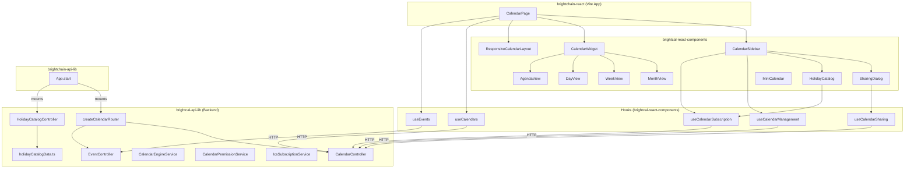

# Design Document: Multi-Calendar Management

## Overview

This design covers the frontend UI components, React hooks, backend route wiring, and holiday catalog data needed to deliver a full Outlook-competitive multi-calendar experience in BrightCal. The backend calendar CRUD, event CRUD, permission service, and ICS subscription merge logic already exist — this work focuses on connecting those services to the user-facing application.

The scope breaks into six areas:

1. **Calendar Sidebar rewrite** — Replace the current upcoming-events-only sidebar with an Outlook-style calendar list featuring colored checkboxes, context menus for management, and grouped sections (My Calendars / Other Calendars).
2. **Visibility Set state management** — Client-side state tracking which calendars are toggled on, persisted to localStorage, and used to filter event fetches.
3. **CalendarWidget view wiring** — Replace the placeholder div inside CalendarWidget with actual MonthView/WeekView/DayView/AgendaView rendering based on the current view mode.
4. **Sharing & subscription UI** — SharingDialog modal and HolidayCatalog browsable panel, backed by new hooks (useCalendarSharing, useCalendarSubscription, useCalendarManagement).
5. **Backend route mounting** — Wire createCalendarRouter into App.start() and add a GET /api/cal/holiday-catalog endpoint.
6. **CalendarPage integration** — Update the CalendarPage in brightchain-react to use the new sidebar, pass the Visibility Set to useEvents, and supply calendar colors to the widget.

### Key Design Decisions

- **Visibility Set lives in the CalendarPage** (lifted state), not inside the sidebar. The sidebar emits changes via callback; CalendarPage persists to localStorage and passes the set down to useEvents and CalendarWidget.
- **No new backend services** for sharing/subscription — the existing CalendarPermissionService and CalendarEngineService already cover all operations. We only need a thin controller endpoint for the holiday catalog.
- **Holiday catalog is a static TypeScript constant** in brightcal-api-lib, served by a lightweight controller. No database storage needed.
- **useCalendarManagement hook** wraps create/update/delete calendar API calls (distinct from useCalendarSharing which wraps share/revoke/public-link calls).
- **Context menu** for calendar entries uses a simple React state-driven dropdown (no third-party menu library), keeping the dependency footprint minimal.

## Architecture



### Data Flow

1. **CalendarPage** mounts, calls `useCalendars` → GET /api/cal/calendars → returns owned + shared calendars.
2. CalendarPage initializes the **Visibility Set** from localStorage (or defaults to all calendars enabled).
3. CalendarPage passes the Visibility Set's calendar IDs to `useEvents` → GET /api/cal/events?calendarId=...&rangeStart=...&rangeEnd=...
4. CalendarPage renders **CalendarSidebar** (receives calendars, Visibility Set, and callbacks) and **CalendarWidget** (receives filtered events and calendars).
5. User toggles a calendar → sidebar calls `onVisibilityChange(newSet)` → CalendarPage updates state + localStorage → useEvents re-fetches with new IDs.
6. User creates/renames/deletes a calendar → sidebar calls `useCalendarManagement` hook → API call → `refetchCalendars()`.
7. User opens SharingDialog → `useCalendarSharing` hook handles share/revoke/public-link API calls.
8. User browses HolidayCatalog → fetches from GET /api/cal/holiday-catalog → subscribes via `useCalendarSubscription`.

## Components and Interfaces

### New Components

#### CalendarSidebar (rewrite)

Location: `brightcal-react-components/src/lib/components/CalendarSidebar.tsx`

```typescript
export interface CalendarSidebarProps {
  calendars: ICalendarCollectionDTO[];
  visibilitySet: Set<string>;
  onVisibilityChange: (newSet: Set<string>) => void;
  apiBaseUrl: string;
  authToken?: string;
  onCalendarsChanged: () => void; // triggers refetch in parent
  onEventClick?: (event: ICalendarEventDTO) => void;
  strings?: Partial<BrightCalUIStringsType>;
}
```

Renders:
- MiniCalendar at top
- "My Calendars" section (owned, `calendar.ownerId === currentUserId`)
- "Other Calendars" section (shared + subscribed)
- Each entry: colored checkbox + display name + context menu trigger (⋯ button)
- "Add Calendar" button → inline form (name + color picker)
- "Subscribe to Calendar" button → URL input
- "Browse Holiday Calendars" button → opens HolidayCatalog

#### SharingDialog

Location: `brightcal-react-components/src/lib/components/SharingDialog.tsx`

```typescript
export interface SharingDialogProps {
  calendarId: string;
  calendarName: string;
  isOpen: boolean;
  onClose: () => void;
  apiBaseUrl: string;
  authToken?: string;
}
```

Modal that:
- Lists existing shares (user ID + permission level + revoke button)
- Input for new share (user ID + permission dropdown + share button)
- "Copy Public Link" / "Revoke Public Link" buttons
- Inline error display

#### HolidayCatalog

Location: `brightcal-react-components/src/lib/components/HolidayCatalog.tsx`

```typescript
export interface HolidayCatalogProps {
  isOpen: boolean;
  onClose: () => void;
  subscribedCalendarUrls: Set<string>;
  apiBaseUrl: string;
  authToken?: string;
  onSubscribed: () => void; // triggers refetch in parent
}
```

Modal/panel that:
- Fetches holiday entries from GET /api/cal/holiday-catalog
- Groups entries by region/category
- Search/filter input
- "Add" button per entry (or "Subscribed" badge if already subscribed)

### Modified Components

#### CalendarWidget

Replace the placeholder `<div>` in the view container with actual view component rendering:

```typescript
// Inside CalendarWidget render, replace placeholder with:
{currentView === 'month' && <MonthView date={currentDate} events={events} calendars={calendars} onEventClick={onEventClick} onDayClick={handleDateChange} />}
{currentView === 'week' && <WeekView date={currentDate} events={events} calendars={calendars} onEventClick={onEventClick} onTimeSlotClick={...} />}
{currentView === 'day' && <DayView date={currentDate} events={events} calendars={calendars} onEventClick={onEventClick} onTimeSlotClick={...} />}
{currentView === 'agenda' && <AgendaView events={events} calendars={calendars} onEventClick={onEventClick} />}
```

#### CalendarPage (brightchain-react)

- Add Visibility Set state (`useState<Set<string>>`)
- Initialize from localStorage on mount
- Pass Visibility Set to useEvents as calendarIds
- Replace MiniCalendar-only sidebar with full CalendarSidebar
- Pass calendar colors through to CalendarWidget

### New Hooks

#### useCalendarManagement

Location: `brightcal-react-components/src/lib/hooks/useCalendarManagement.ts`

```typescript
export interface UseCalendarManagementOptions {
  apiBaseUrl: string;
  authToken?: string;
  onSuccess?: () => void;
}

export interface UseCalendarManagementResult {
  createCalendar: (displayName: string, color: string, description?: string) => Promise<ICalendarCollectionDTO | null>;
  updateCalendar: (id: string, updates: { displayName?: string; color?: string; description?: string }) => Promise<ICalendarCollectionDTO | null>;
  deleteCalendar: (id: string) => Promise<boolean>;
  loading: boolean;
  error: string | null;
}
```

#### useCalendarSharing

Location: `brightcal-react-components/src/lib/hooks/useCalendarSharing.ts`

```typescript
export interface UseCalendarSharingOptions {
  apiBaseUrl: string;
  authToken?: string;
}

export interface UseCalendarSharingResult {
  shareCalendar: (calendarId: string, grantedToUserId: string, permission: CalendarPermissionLevel) => Promise<ICalendarShareDTO | null>;
  revokeShare: (calendarId: string, shareId: string) => Promise<boolean>;
  getShares: (calendarId: string) => Promise<ICalendarShareDTO[]>;
  generatePublicLink: (calendarId: string) => Promise<string | null>;
  revokePublicLink: (calendarId: string) => Promise<boolean>;
  loading: boolean;
  error: string | null;
}
```

#### useCalendarSubscription

Location: `brightcal-react-components/src/lib/hooks/useCalendarSubscription.ts`

```typescript
export interface UseCalendarSubscriptionOptions {
  apiBaseUrl: string;
  authToken?: string;
  onSuccess?: () => void;
}

export interface UseCalendarSubscriptionResult {
  subscribe: (url: string, displayName: string, refreshInterval?: number) => Promise<ICalendarCollectionDTO | null>;
  refreshSubscription: (calendarId: string) => Promise<boolean>;
  unsubscribe: (calendarId: string) => Promise<boolean>;
  loading: boolean;
  error: string | null;
}
```

### Backend Additions

#### HolidayCatalogController

Location: `brightcal-api-lib/src/lib/controllers/holidayCatalogController.ts`

Single endpoint: GET / → returns the static holiday catalog array.

#### Holiday Catalog Data

Location: `brightcal-api-lib/src/lib/data/holidayCatalogData.ts`

Static TypeScript constant array of `IHolidayFeedEntry` objects.

#### Route Mounting in App.start()

In `brightchain-api-lib/src/lib/application.ts`, after existing service initialization:

```typescript
// Calendar subsystem
const calendarResult = createCalendarRouter(this, brightDb);
// Mount controllers
this.expressApp.use('/api/cal/calendars', calendarResult.controllers.calendar.router);
this.expressApp.use('/api/cal/events', calendarResult.controllers.event.router);
// ... remaining mounts
this.expressApp.use('/caldav', calendarResult.middleware.caldav.middleware());
// Holiday catalog
const holidayCatalogController = new HolidayCatalogController(this);
this.expressApp.use('/api/cal/holiday-catalog', holidayCatalogController.router);
```

## Data Models

### Existing Models (no changes needed)

| Model | Collection | Key Fields |
|---|---|---|
| CalendarCollection | calendar_collections | ownerId, displayName, color, isDefault, isSubscription, subscriptionUrl |
| CalendarEvent | calendar_events | calendarId, uid, summary, dtstart, dtend, rrule |
| CalendarShare | calendar_shares | calendarId, grantedToUserId, permission, publicLink |

### New Shared Interface

Location: `brightcal-lib/src/lib/interfaces/holidayFeedEntryDto.ts`

```typescript
export interface IHolidayFeedEntry {
  id: string;
  displayName: string;
  description: string;
  region: string;
  category: string;
  icsUrl: string;
}
```

This interface goes in brightcal-lib (shared) since both the backend (serves it) and frontend (consumes it) need the type.

### Visibility Set (Client-Side Only)

Not a database model — stored in localStorage under key `brightcal:visibilitySet`.

```typescript
// Serialization format: JSON array of calendar ID strings
// e.g., ["cal-abc123", "cal-def456"]
type VisibilitySet = Set<string>;

// localStorage helpers
function loadVisibilitySet(): Set<string> | null {
  const raw = localStorage.getItem('brightcal:visibilitySet');
  if (!raw) return null;
  return new Set(JSON.parse(raw));
}

function saveVisibilitySet(set: Set<string>): void {
  localStorage.setItem('brightcal:visibilitySet', JSON.stringify([...set]));
}
```

Initialization logic in CalendarPage:
1. Load from localStorage
2. If null (first visit), default to all calendar IDs from useCalendars
3. On any change, persist immediately


## Correctness Properties

*A property is a characteristic or behavior that should hold true across all valid executions of a system — essentially, a formal statement about what the system should do. Properties serve as the bridge between human-readable specifications and machine-verifiable correctness guarantees.*

### Property 1: Calendar grouping by ownership

*For any* array of calendar collections and any user ID, the grouping function SHALL partition calendars into exactly two groups: "My Calendars" containing only calendars where `ownerId` equals the user ID, and "Other Calendars" containing all remaining calendars. The union of both groups SHALL equal the original array, and their intersection SHALL be empty.

**Validates: Requirements 1.1**

### Property 2: Visibility Set toggle correctness

*For any* Visibility Set and any calendar ID, toggling that ID SHALL produce a new set where: if the ID was present, it is now absent; if the ID was absent, it is now present. All other IDs in the set SHALL remain unchanged.

**Validates: Requirements 1.3**

### Property 3: Visibility Set serialization round-trip

*For any* set of calendar ID strings, serializing the Visibility Set to the localStorage JSON format and then deserializing it back SHALL produce a set with identical membership to the original.

**Validates: Requirements 1.5**

### Property 4: Event filtering by Visibility Set

*For any* array of calendar events and any Visibility Set, the filtered event array SHALL contain exactly those events whose `calendarId` is a member of the Visibility Set. No events with a `calendarId` outside the set SHALL appear, and no events with a `calendarId` inside the set SHALL be excluded.

**Validates: Requirements 7.1, 7.5, 8.1**

### Property 5: Calendar color map correctness

*For any* array of calendar collections with distinct IDs and hex color values, building a color map and looking up any event's `calendarId` SHALL return the exact hex color string of that event's parent calendar. If the `calendarId` is not in the map, the lookup SHALL return the default color `#3b82f6`.

**Validates: Requirements 1.2, 7.2**

### Property 6: Holiday catalog search filter

*For any* array of Holiday Feed Entries and any non-empty search query string, the filtered results SHALL contain only entries where the `displayName` or `region` field contains the query as a case-insensitive substring. No matching entries SHALL be excluded from the results.

**Validates: Requirements 5.5**

### Property 7: Holiday catalog subscription badge state

*For any* set of subscribed ICS URLs and any array of Holiday Feed Entries, each entry whose `icsUrl` is in the subscribed set SHALL be marked as "subscribed", and each entry whose `icsUrl` is NOT in the subscribed set SHALL be marked as "available". No entry SHALL have an incorrect badge state.

**Validates: Requirements 5.4**

## Error Handling

### Frontend Error Handling

| Scenario | Behavior |
|---|---|
| useCalendars fetch fails | CalendarPage shows error state with retry button (existing pattern) |
| useEvents fetch fails | CalendarWidget shows error state with retry button (existing pattern) |
| Calendar create/update/delete fails | useCalendarManagement sets `error` string; sidebar displays inline error toast |
| Share/revoke API fails | useCalendarSharing sets `error` string; SharingDialog displays inline error without closing |
| Subscription URL unreachable | useCalendarSubscription sets `error` string; sidebar displays inline error message |
| Holiday catalog fetch fails | HolidayCatalog displays "Unable to load holiday calendars" with retry |
| localStorage unavailable | Visibility Set falls back to in-memory state only (no persistence); no error shown to user |
| Clipboard API unavailable (Copy Public Link) | SharingDialog falls back to selecting the link text for manual copy; shows "Link copied" or "Select and copy the link above" |

### Backend Error Handling

All existing error handling in CalendarController, EventController, and CalendarPermissionService is preserved. The new HolidayCatalogController has minimal error surface since it serves static data:

| Scenario | HTTP Status | Response |
|---|---|---|
| GET /api/cal/holiday-catalog success | 200 | JSON array of IHolidayFeedEntry |
| Unauthenticated request to calendar endpoints | 401 | Standard unauthorized error (existing) |
| Forbidden operation (non-owner tries to share/delete) | 403 | Standard forbidden error (existing) |
| Calendar not found | 404 | Standard not found error (existing) |
| Validation error (invalid hex color, empty name) | 400 | Standard validation error (existing) |

### Optimistic Updates

The sidebar does NOT use optimistic updates for calendar CRUD — it waits for API confirmation before updating the list (via `refetchCalendars`). This avoids complex rollback logic for operations that modify shared state. The existing `useEventMutation` hook's pattern of waiting for confirmation is followed.

## Testing Strategy

### Unit Tests (Example-Based)

Focus areas for example-based unit tests:

- **CalendarWidget view rendering**: Verify each view mode renders the correct component (Requirements 6.1–6.5)
- **CalendarSidebar UI interactions**: Context menu opens, inline form appears, confirmation dialog shows (Requirements 2.1–2.7)
- **SharingDialog flows**: Share creation, revoke, public link copy/revoke (Requirements 3.1–3.7)
- **HolidayCatalog UI**: Catalog opens, entries grouped by region, Add/Subscribed badge (Requirements 5.1–5.3)
- **Hook API surface**: Each hook exposes the correct functions and state (Requirements 11.1–12.4)
- **CalendarPage integration**: Sidebar renders in layout, Visibility Set flows to useEvents (Requirements 13.1–13.3)
- **Edge cases**: Delete default calendar blocked, empty Visibility Set returns empty events, subscription error display

### Property-Based Tests

Property-based tests using [fast-check](https://github.com/dubzzz/fast-check) (already available in the workspace or easily added). Each property test runs a minimum of 100 iterations.

| Property | Test File | Tag |
|---|---|---|
| Property 1: Calendar grouping | `CalendarSidebar.property.test.ts` | Feature: multi-calendar-management, Property 1: Calendar grouping by ownership |
| Property 2: Toggle correctness | `visibilitySet.property.test.ts` | Feature: multi-calendar-management, Property 2: Visibility Set toggle correctness |
| Property 3: Serialization round-trip | `visibilitySet.property.test.ts` | Feature: multi-calendar-management, Property 3: Visibility Set serialization round-trip |
| Property 4: Event filtering | `eventFiltering.property.test.ts` | Feature: multi-calendar-management, Property 4: Event filtering by Visibility Set |
| Property 5: Color map | `calendarColorMap.property.test.ts` | Feature: multi-calendar-management, Property 5: Calendar color map correctness |
| Property 6: Holiday search | `holidayCatalog.property.test.ts` | Feature: multi-calendar-management, Property 6: Holiday catalog search filter |
| Property 7: Subscription badge | `holidayCatalog.property.test.ts` | Feature: multi-calendar-management, Property 7: Holiday catalog subscription badge state |

### Integration Tests

- **Route mounting**: Verify all /api/cal/* endpoints respond (not 404) after App.start()
- **Holiday catalog endpoint**: GET /api/cal/holiday-catalog returns valid JSON array with >= 10 entries
- **End-to-end calendar CRUD**: Create → list → update → delete calendar via API
- **End-to-end sharing**: Share → list shares → revoke via API
