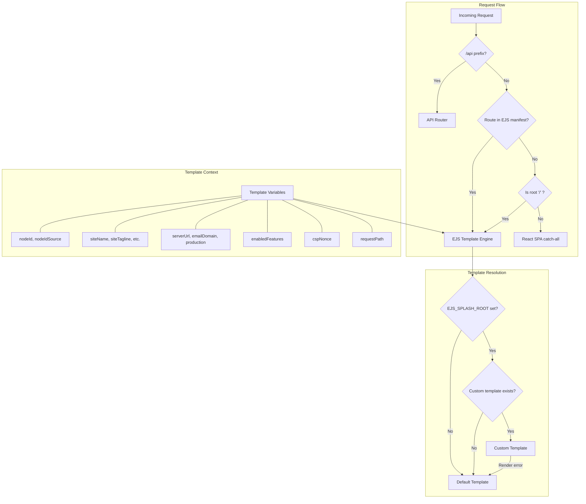
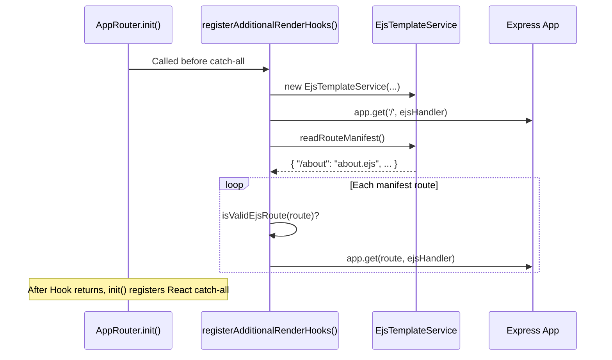

# Design Document: Node EJS Splash Page

## Overview

This feature replaces the current string-replacement approach for serving the BrightChain splash page with a proper EJS template engine. The system introduces a layered template resolution strategy: node operators can point `EJS_SPLASH_ROOT` at a directory containing custom EJS templates, partials, and a route manifest (`routes.json`); when absent or broken, the system falls back to a bundled default template that replicates the current stock page behavior.

The design hooks into the existing `AppRouter` class via the `registerAdditionalRenderHooks(app)` extension point, registering EJS routes *before* the React SPA catch-all. API routes (mounted at `/api`) always take priority. The route manifest enables multi-page EJS serving without source code changes.

Key design decisions:
- **No caching of custom templates** — files are re-read per request so operators can edit without restart
- **Manifest-driven routing** — no filesystem scanning; routes must be explicitly declared
- **Graceful degradation** — any failure in custom template resolution falls back to the bundled default
- **Backward compatibility** — deprecated `SPLASH_TEMPLATE_PATH` is still honored when `EJS_SPLASH_ROOT` is absent

## Architecture



## Components and Interfaces

### EjsTemplateService

A new service class in `brightchain-api-lib/src/lib/services/` responsible for template resolution and rendering.

```typescript
// brightchain-api-lib/src/lib/services/ejsTemplateService.ts

export interface IEjsTemplateContext {
  // Node identity
  nodeId: string;
  nodeIdSource: string;
  // Branding
  siteName: string;
  siteTagline: string;
  siteDescription: string;
  fontAwesomeKitId: string;
  // Environment
  serverUrl: string;
  emailDomain: string;
  emailSender: string;
  production: boolean;
  // Features
  enabledFeatures: string[];
  // CSP
  cspNonce: string;
  // Request
  requestPath: string;
  // All BrightChainIndexLocals properties (spread)
  [key: string]: unknown;
}

export interface IRouteManifest {
  [urlPath: string]: string; // URL path → relative .ejs filename
}

export class EjsTemplateService {
  private readonly defaultTemplatePath: string;
  private readonly ejsSplashRoot: string | undefined;
  private readonly splashTemplatePath: string | undefined; // deprecated

  constructor(
    defaultTemplatePath: string,
    ejsSplashRoot?: string,
    splashTemplatePath?: string,
  );

  /**
   * Resolves which template file to use for a given route.
   * Returns the absolute path to the template file.
   * Falls back to default template on any resolution failure.
   */
  resolveTemplatePath(route: string): string;

  /**
   * Renders a template with the given context.
   * On render failure of custom templates, falls back to default template.
   */
  render(templatePath: string, context: IEjsTemplateContext): string;

  /**
   * Reads and parses the routes.json manifest.
   * Returns empty object on missing/invalid manifest.
   */
  readRouteManifest(): IRouteManifest;

  /**
   * Validates that a route does not conflict with API prefixes.
   */
  isValidEjsRoute(route: string): boolean;

  /**
   * Builds the full template context from request, response, and environment.
   */
  buildContext(
    locals: BrightChainIndexLocals,
    req: Request,
  ): IEjsTemplateContext;
}
```

### AppRouter Extension

The existing `AppRouter` class in `brightchain-api-lib/src/lib/routers/app.ts` will override `registerAdditionalRenderHooks(app)` to register EJS routes.

```typescript
// Addition to AppRouter class

protected override registerAdditionalRenderHooks(app: Application): void {
  // Register root EJS route and manifest routes
  // before the React SPA catch-all
  const ejsService = new EjsTemplateService(
    defaultTemplatePath,
    environment.ejsSplashRoot,
    environment.splashTemplatePath,
  );

  // Register manifest routes + root route
  app.get('/', (req, res, next) => { /* EJS render */ });
  // Dynamic manifest routes registered here
}
```

### Environment Extension

The `Environment` class gains two new properties:

```typescript
// Addition to Environment class and IEnvironment interface

/**
 * Root directory for custom EJS templates.
 * Set via EJS_SPLASH_ROOT env var.
 */
ejsSplashRoot: string | undefined;

/**
 * @deprecated Use ejsSplashRoot instead.
 * Direct path to a single custom template file.
 * Set via SPLASH_TEMPLATE_PATH env var.
 */
splashTemplatePath: string | undefined;
```

### Route Registration Flow



## Data Models

### IEjsTemplateContext

The template context interface extends all `BrightChainIndexLocals` properties and adds EJS-specific fields:

| Field | Type | Source |
|-------|------|--------|
| nodeId | string | Environment |
| nodeIdSource | string | Environment |
| siteName | string | Constants.Site |
| siteTagline | string | Constants.SiteTagline |
| siteDescription | string | Constants.SiteDescription |
| fontAwesomeKitId | string | Environment |
| serverUrl | string | Environment |
| emailDomain | string | Environment |
| emailSender | string | Environment |
| production | boolean | Environment |
| enabledFeatures | string[] | Environment |
| cspNonce | string | res.locals.cspNonce |
| requestPath | string | req.path |
| siteUrl | string | Environment / derived |
| title | string | Constants.Site |
| tagline | string | Constants.SiteTagline |
| description | string | Constants.SiteDescription |

### IRouteManifest (routes.json schema)

```json
{
  "/about": "about.ejs",
  "/terms": "legal/terms.ejs",
  "/privacy": "legal/privacy.ejs"
}
```

- Keys: URL path strings starting with `/`
- Values: Relative `.ejs` file paths within `EJS_SPLASH_ROOT`
- The root route `/` → `index.ejs` is implicit unless overridden in the manifest

### Default Template Location

```
brightchain-api-lib/src/lib/templates/default-splash.ejs
```

This file is included in the package's `files` array and ships with builds.

## Correctness Properties

*A property is a characteristic or behavior that should hold true across all valid executions of a system — essentially, a formal statement about what the system should do. Properties serve as the bridge between human-readable specifications and machine-verifiable correctness guarantees.*

### Property 1: Template variable completeness

*For any* valid `IEjsTemplateContext` object built from a request and environment, all properties of that object SHALL be accessible as top-level variables within the EJS template during rendering.

**Validates: Requirements 2.1, 2.2, 2.3, 2.4, 2.5, 2.6, 2.7**

### Property 2: Custom template freshness (no stale cache)

*For any* custom template file in `EJS_SPLASH_ROOT`, if the file content changes between two consecutive requests, the second request's rendered output SHALL reflect the updated file content.

**Validates: Requirements 5.4, 3.2**

### Property 3: Syntax error fallback produces valid HTML

*For any* EJS template string containing a syntax error, rendering it via the `EjsTemplateService` SHALL fall back to the default template and produce valid HTML output (not an error page or empty response).

**Validates: Requirements 5.2, 1.4**

### Property 4: CSP nonce applied to all inline scripts

*For any* nonce string and any rendered template (default or custom), every `<script>` tag in the output HTML SHALL contain a `nonce` attribute with the provided nonce value.

**Validates: Requirements 4.5**

### Property 5: Manifest route rendering correctness

*For any* valid `routes.json` manifest and a request matching a declared route, the `EjsTemplateService` SHALL render the template file specified by that route's manifest entry, with the full set of template variables.

**Validates: Requirements 7.1, 7.2, 7.4, 7.11**

### Property 6: API route priority over manifest routes

*For any* URL path that matches both an API route prefix (`/api/`) and a route declared in the manifest, the system SHALL serve the API route and never render the EJS template for that path.

**Validates: Requirements 7.5, 7.10**

### Property 7: Unregistered routes fall through to React SPA

*For any* URL path that does not match an API route and is not registered in the route manifest (and is not the root `/`), the request SHALL fall through to the React SPA catch-all handler.

**Validates: Requirements 7.6, 6.1**

### Property 8: Manifest freshness (re-read per request)

*For any* modification to `routes.json` between two requests, the second request SHALL reflect the updated manifest (new routes available, removed routes no longer served).

**Validates: Requirements 7.7**

### Property 9: Path resolution accepts absolute and relative paths

*For any* valid directory path (absolute or relative to `process.cwd()`), when set as `EJS_SPLASH_ROOT`, the template engine SHALL correctly resolve and read templates from that directory.

**Validates: Requirements 3.7**

### Property 10: Default template renders expected content blocks

*For any* `fontAwesomeKitId` string and `enabledFeatures` array, the default template's rendered output SHALL contain the Font Awesome kit `<script>` tag (when kitId is non-empty) and an `APP_CONFIG` script block containing the features and site URL.

**Validates: Requirements 4.3, 4.4**

## Error Handling

| Scenario | Behavior | HTTP Status |
|----------|----------|-------------|
| `EJS_SPLASH_ROOT` directory does not exist | Log warning, fall back to default template | 200 |
| `EJS_SPLASH_ROOT` exists but no `index.ejs` | Log warning, fall back to default template | 200 |
| Custom template has EJS syntax error | Log error with path + error details, fall back to default template | 200 |
| Default template has EJS syntax error | Log critical error, return 500 with generic message | 500 |
| `routes.json` contains invalid JSON | Log error, serve only root route (ignore manifest) | 200 for root |
| Manifest route points to nonexistent `.ejs` file | Log warning, return 404 for that specific route | 404 |
| Manifest route conflicts with `/api/` prefix | Skip route registration, log warning | N/A (route not registered) |
| `SPLASH_TEMPLATE_PATH` + `EJS_SPLASH_ROOT` both set | Log deprecation warning for `SPLASH_TEMPLATE_PATH`, use `EJS_SPLASH_ROOT` | 200 |
| Custom template deleted after startup | Detect on next request (file re-read), fall back to default | 200 |

All error logging uses the existing application logger. Errors in custom templates never crash the server — the default template is always the safety net.

## Testing Strategy

### Property-Based Tests (fast-check)

The feature is well-suited for property-based testing because the core logic involves:
- Pure functions (template context building, path resolution, manifest parsing)
- Input spaces that vary meaningfully (template variables, file paths, manifest content, malformed EJS)
- Universal invariants (variable completeness, fallback behavior, route priority)

**Library**: `fast-check` (already a devDependency in brightchain-api-lib)
**Minimum iterations**: 100 per property test
**Tag format**: `Feature: node-ejs-splash-page, Property {N}: {title}`

Each correctness property (1–10) maps to a single property-based test.

### Unit Tests (example-based)

- Default template produces HTML equivalent to current stock page (snapshot comparison)
- `EJS_SPLASH_ROOT` env var is correctly read by Environment class
- Deprecated `SPLASH_TEMPLATE_PATH` backward compatibility
- EJS syntax tags (output, unescaped, control flow) render correctly
- Root route renders without a manifest present

### Integration Tests

- Full request to `/` returns 200 with EJS-rendered HTML
- API routes (`/api/*`) are unaffected by EJS feature
- React static assets still served for non-manifest routes
- CSP headers remain intact on EJS responses
- EJS includes/partials resolve relative to `EJS_SPLASH_ROOT`

### Edge Case Tests

- Custom template deleted mid-operation → fallback
- Nonexistent `EJS_SPLASH_ROOT` directory → fallback
- Empty `routes.json` (`{}`) → only root served
- Manifest with `/api/` prefixed routes → rejected
- Manifest pointing to missing `.ejs` file → 404
