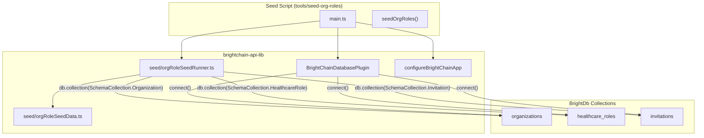

# Design Document: Organization Role Dev Seeding

## Overview

This design introduces a development-environment seed script that populates the BrightDb `organizations`, `healthcare_roles`, and `invitations` collections with representative sample data. The script follows the same database initialization patterns established by `brightchain-inituserdb` — using `configureBrightChainApp` to bootstrap the `BrightChainDatabasePlugin`, then accessing collections via `db.collection(SchemaCollection.*)`.

The seed data lives in a standalone TypeScript module inside `brightchain-api-lib` so that integration tests and other dev utilities can import the same deterministic identifiers. The script itself is a lightweight Nx application (`tools/seed-org-roles`) that connects to BrightDb, performs idempotent insert-or-skip operations, and logs a summary.

Key design decisions:
- **Idempotent upsert via `findOne` + `insertOne`**: Check by `_id` before inserting. This avoids `replaceOne` semantics that would overwrite manual edits a developer made through the API.
- **Deterministic UUIDs**: All seed record `_id` values are hardcoded UUID v4 strings, not generated at runtime. This makes existence checks stable across runs.
- **Reuse existing bootstrap**: The script uses `configureBrightChainApp` + `BrightChainDatabasePlugin.connect()` — the same path the API server and `brightchain-inituserdb` use — so the connection config is identical.
- **Dev user from environment**: The `MEMBER_ID` environment variable (the same one `brightchain-inituserdb` generates) is used as the `createdBy` and `memberId` for all seed records. The seed data module exports a default fallback that can be overridden.

## Architecture



### Execution Flow

1. `yarn seed:org-roles` invokes `npx nx run tools-seed-org-roles:serve`
2. `main.ts` loads the environment (same `.env` as the API), calls `configureBrightChainApp`, and connects the database plugin
3. `seedOrgRoles(db)` is called with the connected `BrightDb` instance
4. For each seed record (orgs → roles → invitations), the runner does `findOne({ _id })` — if found, skip; if not, `insertOne`
5. A summary is logged and the process exits with code 0 (or non-zero on error)

## Components and Interfaces

### Seed Data Module (`brightchain-api-lib/src/lib/seed/orgRoleSeedData.ts`)

Exports all seed data as typed constants:

```typescript
import { ADMIN, PHYSICIAN, PATIENT, ROLE_CODE_DISPLAY } from '@brightchain/brightchart-lib';
import type { IOrganization } from '@brightchain/brightchart-lib';
import type { IHealthcareRoleDocument } from '@brightchain/brightchart-lib';
import type { IInvitation } from '@brightchain/brightchart-lib';

// ── Deterministic IDs ───────────────────────────────────────────
export const DEV_USER_ID = 'seed-dev-user-00000000-0000-0001';

export const ORG_SUNRISE_ID   = 'seed-org-sunrise-00000000-0001';
export const ORG_DOWNTOWN_ID  = 'seed-org-downtown-0000000-0002';
export const ORG_CITYVET_ID   = 'seed-org-cityvet-00000000-0003';

export const ROLE_ADMIN_SUNRISE_ID    = 'seed-role-admin-sunrise-0001';
export const ROLE_PHYSICIAN_DOWNTOWN_ID = 'seed-role-phys-downtown-002';
export const ROLE_PATIENT_CITYVET_ID  = 'seed-role-patient-cityvet-03';

export const INV_DOWNTOWN_PATIENT_ID    = 'seed-inv-downtown-patient-01';
export const INV_DOWNTOWN_PATIENT_TOKEN = 'seed-invite-downtown-patient-token-001';

// ── Seed data arrays ────────────────────────────────────────────
export const SEED_ORGANIZATIONS: IOrganization[];
export const SEED_HEALTHCARE_ROLES: IHealthcareRoleDocument[];
export const SEED_INVITATIONS: IInvitation[];

// ── Helper ──────────────────────────────────────────────────────
export function getDevUserId(): string;  // returns DEV_USER_ID, overridable via env
```

The module imports `ADMIN`, `PHYSICIAN`, `PATIENT`, and `ROLE_CODE_DISPLAY` from `brightchart-lib` rather than duplicating SNOMED CT codes.

### Seed Runner (`brightchain-api-lib/src/lib/seed/orgRoleSeedRunner.ts`)

Pure function that takes a `BrightDb` instance and performs the idempotent seeding:

```typescript
import type { BrightDb } from '@brightchain/db';

export interface SeedResult {
  organizations: { inserted: number; skipped: number };
  healthcareRoles: { inserted: number; skipped: number };
  invitations: { inserted: number; skipped: number };
}

export async function seedOrgRoles(db: BrightDb, logger?: SeedLogger): Promise<SeedResult>;
```

The runner is separated from the CLI entry point so it can be called programmatically in tests or other tools.

### Seed Logger Interface

```typescript
export interface SeedLogger {
  inserted(collection: string, id: string, label: string): void;
  skipped(collection: string, id: string): void;
  summary(result: SeedResult): void;
  error(message: string, err?: unknown): void;
}
```

A default `ConsoleSeedLogger` implementation writes to `console.log`. Tests can provide a mock logger to capture output.

### CLI Entry Point (`tools/seed-org-roles/src/main.ts`)

Minimal script that:
1. Calls `configureBrightChainApp` with `skipAutoSeed: true`
2. Connects the plugin
3. Calls `seedOrgRoles(plugin.brightDb)`
4. Logs the summary
5. Disconnects and exits

## Data Models

The seed script writes to three existing collections. No schema changes are needed — the schemas are already defined in `brightchain-api-lib/src/lib/interfaces/storage/`.

### Seed Organizations

| Field | Sunrise Family Practice | Downtown Dental Clinic | City Veterinary Hospital |
|---|---|---|---|
| `_id` | `seed-org-sunrise-00000000-0001` | `seed-org-downtown-0000000-0002` | `seed-org-cityvet-00000000-0003` |
| `name` | Sunrise Family Practice | Downtown Dental Clinic | City Veterinary Hospital |
| `active` | `true` | `true` | `true` |
| `enrollmentMode` | `open` | `invite-only` | `open` |
| `createdBy` | `DEV_USER_ID` | `DEV_USER_ID` | `DEV_USER_ID` |
| `createdAt` | Fixed ISO timestamp | Fixed ISO timestamp | Fixed ISO timestamp |
| `updatedAt` | Fixed ISO timestamp | Fixed ISO timestamp | Fixed ISO timestamp |

### Seed Healthcare Roles

| Field | Admin @ Sunrise | Physician @ Downtown | Patient @ City Vet |
|---|---|---|---|
| `_id` | `seed-role-admin-sunrise-0001` | `seed-role-phys-downtown-002` | `seed-role-patient-cityvet-03` |
| `memberId` | `DEV_USER_ID` | `DEV_USER_ID` | `DEV_USER_ID` |
| `roleCode` | `394572006` (ADMIN) | `309343006` (PHYSICIAN) | `116154003` (PATIENT) |
| `roleDisplay` | Clinical Administrator | Physician | Patient |
| `organizationId` | `ORG_SUNRISE_ID` | `ORG_DOWNTOWN_ID` | `ORG_CITYVET_ID` |
| `practitionerRef` | `DEV_USER_ID` | `DEV_USER_ID` | — |
| `patientRef` | — | — | `DEV_USER_ID` |
| `period` | `{ start: <fixed> }` | `{ start: <fixed> }` | `{ start: <fixed> }` |
| `createdBy` | `DEV_USER_ID` | `DEV_USER_ID` | `DEV_USER_ID` |

### Seed Invitation

| Field | Value |
|---|---|
| `_id` | `seed-inv-downtown-patient-01` |
| `token` | `seed-invite-downtown-patient-token-001` |
| `organizationId` | `ORG_DOWNTOWN_ID` |
| `roleCode` | `116154003` (PATIENT) |
| `createdBy` | `DEV_USER_ID` |
| `expiresAt` | `2099-12-31T23:59:59.000Z` |
| `createdAt` | Fixed ISO timestamp |
| `usedBy` | _(unset)_ |
| `usedAt` | _(unset)_ |

### Idempotent Upsert Strategy

```typescript
async function upsertRecord(
  collection: BrightDbCollection,
  record: Record<string, unknown>,
  collectionName: string,
  label: string,
  logger: SeedLogger,
): Promise<'inserted' | 'skipped'> {
  const existing = await collection.findOne({ _id: record._id });
  if (existing) {
    logger.skipped(collectionName, record._id as string);
    return 'skipped';
  }
  await collection.insertOne(record as never);
  logger.inserted(collectionName, record._id as string, label);
  return 'inserted';
}
```

This pattern:
- Uses `findOne` by `_id` (the deterministic seed ID)
- If found → skip, preserving any manual edits
- If not found → `insertOne`
- No `updateOne` or `replaceOne` — existing data is never overwritten


## Correctness Properties

*A property is a characteristic or behavior that should hold true across all valid executions of a system — essentially, a formal statement about what the system should do. Properties serve as the bridge between human-readable specifications and machine-verifiable correctness guarantees.*

### Property 1: Seed record schema conformance

*For any* seed record in the seed data arrays (organizations, healthcare roles, or invitations), all required fields defined in the corresponding `CollectionSchema` (`ORGANIZATION_SCHEMA`, `HEALTHCARE_ROLE_SCHEMA`, or `INVITATION_SCHEMA`) SHALL be present and have non-null/non-undefined values.

**Validates: Requirements 2.2, 3.2, 4.2**

### Property 2: Idempotent upsert preserves existing data

*For any* subset of seed records pre-inserted into the database, running the seed runner SHALL insert only the records whose `_id` is not already present, skip all records whose `_id` already exists, and leave the pre-existing records completely unchanged. The total count of inserted + skipped records SHALL equal the total number of seed records.

**Validates: Requirements 2.3, 3.3, 4.4, 5.1, 5.2**

### Property 3: Deterministic identifiers are stable across accesses

*For any* number of accesses to the seed data module, all exported `_id` values, the invitation token, and the dev user ID SHALL be identical strings across every access — no randomness or runtime generation.

**Validates: Requirements 5.3**

### Property 4: Summary log contains correct counts

*For any* combination of inserted and skipped counts across the three collections, the summary log message SHALL contain the exact inserted and skipped counts for organizations, healthcare roles, and invitations.

**Validates: Requirements 1.3, 7.3**

### Property 5: Operation log contains record identifier and action

*For any* seed record and any operation outcome (inserted or skipped), the corresponding log message SHALL contain the record's `_id` value. For insert operations, the log SHALL additionally contain the collection name and a human-readable label.

**Validates: Requirements 7.1, 7.2**

## Error Handling

| Scenario | Behavior | Exit Code |
|---|---|---|
| BrightDb connection failure | Log descriptive error message including connection details | 1 |
| `insertOne` fails (e.g. schema validation) | Log the collection, record ID, and error message; abort remaining inserts | 1 |
| Environment missing `MEMBER_ID` | Fall back to `DEV_USER_ID` default; log a warning | 0 |
| Partial completion (some inserts succeeded before error) | Already-inserted records persist (no rollback); error is logged with counts of what succeeded | 1 |
| All records already exist | Log summary with zero inserts; exit cleanly | 0 |

Error messages follow the pattern: `[seed:org-roles] ERROR: <description>` for consistency with the existing `[BrightChain]` log prefix convention.

## Testing Strategy

### Unit Tests (Example-Based)

- Seed data module exports the three expected organizations with correct names and enrollment modes (Req 2.1)
- Seed data module exports ADMIN role at Sunrise with `practitionerRef`, PHYSICIAN at Downtown, PATIENT at City Vet with `patientRef` (Req 3.1, 3.4)
- Seed data module exports an unredeemed invitation for Downtown Dental with PATIENT role code and far-future expiry (Req 4.1, 4.3)
- Seed data module exports all expected named constants (Req 6.2)
- Seed data role codes match `ADMIN`, `PHYSICIAN`, `PATIENT` constants from `brightchart-lib` (Req 6.3)
- Seed data module exports `getDevUserId()` function (Req 6.4)
- Connection error produces non-zero exit code (Req 1.4)
- Full idempotency: all records pre-exist → zero inserts (Req 5.1)
- `yarn seed:org-roles` script exists in root `package.json` (Req 1.1)

### Property-Based Tests

Property-based tests use `fast-check` (already in devDependencies) with a minimum of 100 iterations per property. Each test is tagged with its design property reference.

Tag format: **Feature: org-role-dev-seeding, Property {N}: {title}**

Properties to implement:
- Property 1: Schema conformance — generate random subsets of seed records, validate all required fields present
- Property 2: Idempotent upsert — generate random subsets of pre-existing records, run seed, verify only missing records inserted and existing unchanged
- Property 3: Deterministic IDs — access seed data N times, verify all IDs identical
- Property 4: Summary log counts — generate random inserted/skipped count tuples, verify summary string contains correct numbers
- Property 5: Operation log format — generate random record metadata, verify log messages contain expected identifiers

### Integration Tests

- End-to-end: run seed against empty in-memory BrightDb, verify all records present in collections
- End-to-end: run seed twice, verify second run reports all skips and zero inserts
- Verify seed script uses same connection config as API server (same environment bootstrap path)
