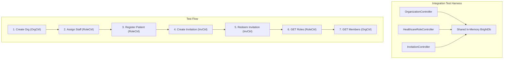

# Design Document: Organization Role Integration Tests

## Overview

This design specifies integration and property-based integration tests for the Organization Role Management system. The existing codebase has property-based unit tests covering each controller in isolation (OrganizationController, HealthcareRoleController, InvitationController). These new tests exercise **multi-controller flows** where all three controllers share a single in-memory database, verifying that cross-controller data flow, authorization checks, and role retrieval work correctly end-to-end.

The test suite is split across two packages:

| Package | Test File | Purpose |
|---|---|---|
| `brightchain-api-lib` | `crossController.integration.property.spec.ts` | Multi-controller flows with shared in-memory DB, property-based |
| `brightchart-react-components` | `useHealthcareRoles.integration.spec.tsx` | Hook ↔ API contract verification, example-based |

The backend integration tests reuse the established in-memory DB mock pattern from the existing property specs, but instantiate **all three controllers** against a single shared DB instance so documents inserted by one controller are visible to the others.

## Architecture



### Key Design Decision: Shared In-Memory DB

The existing unit property tests each create their own `createInMemoryDb()` instance per test. For integration tests, we create **one** shared instance and pass it to all three controller factories. This is the minimal change needed to enable cross-controller data flow verification — no new infrastructure, no HTTP server, just the same handler-direct-invocation pattern with a shared data store.

### Key Design Decision: Handler Direct Invocation

Following the established pattern, tests call controller handler methods directly with mock request objects. This bypasses Express routing and focuses on business logic correctness. The existing property specs already validate this pattern works reliably.

## Components and Interfaces

### Shared Test Infrastructure (`crossController.integration.helpers.ts`)

A shared helper module that consolidates the in-memory DB mock and controller factory code currently duplicated across the three existing property spec files.

```typescript
/** Creates a shared in-memory BrightDb mock with full query operator support */
export function createInMemoryDb(): InMemoryDb;

/** Creates a mock IBrightChainApplication wired to the given DB */
export function createMockApplication(db: InMemoryDb): IBrightChainApplication;

/** Instantiates all three controllers against a shared DB, returns handler accessors */
export function createIntegrationControllers(db?: InMemoryDb): {
  db: InMemoryDb;
  orgHandlers: OrgHandlers;
  roleHandlers: RoleHandlers;
  invHandlers: InvHandlers;
};

/** Helper: create org and return its ID */
export async function createOrg(orgHandlers: OrgHandlers, memberId: string, name: string): Promise<string>;

/** Helper: set enrollment mode on an org */
export async function setEnrollmentMode(orgHandlers: OrgHandlers, orgId: string, memberId: string, mode: 'open' | 'invite-only'): Promise<void>;

/** Helper: assign staff role and return the role doc */
export async function assignStaff(roleHandlers: RoleHandlers, adminId: string, targetId: string, roleCode: string, orgId: string): Promise<Record<string, unknown>>;

/** Helper: register patient and return the role doc */
export async function registerPatient(roleHandlers: RoleHandlers, memberId: string, orgId: string, opts?: { targetMemberId?: string; invitationToken?: string }): Promise<Record<string, unknown>>;

/** Helper: create invitation and return the token */
export async function createInvitation(invHandlers: InvHandlers, adminId: string, orgId: string, roleCode: string): Promise<string>;

/** Helper: redeem invitation and return the result */
export async function redeemInvitation(invHandlers: InvHandlers, memberId: string, token: string): Promise<{ statusCode: number; response: unknown }>;

/** Helper: GET roles for a member */
export async function getMyRoles(roleHandlers: RoleHandlers, memberId: string): Promise<Array<Record<string, unknown>>>;
```

### Handler Type Interfaces

Reused from existing specs — typed accessors for each controller's handlers:

```typescript
interface OrgHandlers {
  createOrganization: (req: unknown) => Promise<{ statusCode: number; response: unknown }>;
  updateOrganization: (req: unknown) => Promise<{ statusCode: number; response: unknown }>;
  listOrgMembers: (req: unknown) => Promise<{ statusCode: number; response: unknown }>;
}

interface RoleHandlers {
  getMyRoles: (req: unknown) => Promise<{ statusCode: number; response: unknown }>;
  assignStaff: (req: unknown) => Promise<{ statusCode: number; response: unknown }>;
  registerPatient: (req: unknown) => Promise<{ statusCode: number; response: unknown }>;
  removeRole: (req: unknown) => Promise<{ statusCode: number; response: unknown }>;
}

interface InvHandlers {
  createInvitation: (req: unknown) => Promise<{ statusCode: number; response: unknown }>;
  redeemInvitation: (req: unknown) => Promise<{ statusCode: number; response: unknown }>;
}
```

### fast-check Arbitraries

Shared arbitraries for property-based tests:

```typescript
const memberIdArb = fc.uuid();
const orgNameArb = fc.string({ minLength: 1, maxLength: 50 }).filter(s => s.trim().length > 0).map(s => s.trim());
const validPractitionerCodeArb = fc.constantFrom(PHYSICIAN, REGISTERED_NURSE, MEDICAL_ASSISTANT, DENTIST, VETERINARIAN, ADMIN);
const validInvitationRoleCodeArb = fc.constantFrom(PHYSICIAN, REGISTERED_NURSE, MEDICAL_ASSISTANT, DENTIST, VETERINARIAN, ADMIN, PATIENT);
const enrollmentModeArb = fc.constantFrom('open' as const, 'invite-only' as const);
```

## Data Models

No new data models. The integration tests operate on the existing `organizations`, `healthcare_roles`, and `invitations` collections as defined in the organization-role-management design. The in-memory DB mock stores documents as `Record<string, unknown>[]` per collection, matching the existing pattern.

## Correctness Properties

*A property is a characteristic or behavior that should hold true across all valid executions of a system — essentially, a formal statement about what the system should do. Properties serve as the bridge between human-readable specifications and machine-verifiable correctness guarantees.*

### Property 1: End-to-end lifecycle produces correct roles across controllers

*For any* valid organization name, admin member, staff member, and patient member, creating an organization via OrganizationController, then assigning staff and registering a patient via HealthcareRoleController, SHALL result in: (a) the auto-created ADMIN role being retrievable for the admin, (b) the staff role having the correct organizationId, and (c) the PATIENT role having the correct organizationId and patientRef — all via HealthcareRoleController GET.

**Validates: Requirements 1.1, 1.2, 1.5**

### Property 2: Organization display name round-trip across controllers

*For any* set of organization names and role assignments across multiple organizations, retrieving healthcare roles via HealthcareRoleController GET SHALL return each role with `organization.display` exactly matching the organization name provided at creation time via OrganizationController.

**Validates: Requirements 1.3, 1.4, 5.2**

### Property 3: Invitation redemption creates retrievable role with correct data

*For any* valid organization, invitation role code, and redeeming member, creating an invitation via InvitationController and redeeming it SHALL produce a healthcare role that is retrievable via HealthcareRoleController GET with `organization.display` populated from the organization name and `roleCode` matching the invitation's role code.

**Validates: Requirements 2.1, 2.2, 2.3**

### Property 4: Re-redemption of used invitation returns 410

*For any* valid invitation that has been redeemed once, attempting to redeem the same token a second time SHALL return HTTP 410 with error code GONE, and no additional healthcare role SHALL be created.

**Validates: Requirements 2.4**

### Property 5: Invite-only patient registration via invitation token

*For any* organization with enrollment mode set to `invite-only` and a PATIENT invitation, redeeming the invitation via the patient registration endpoint SHALL create a PATIENT role that is retrievable via HealthcareRoleController GET.

**Validates: Requirements 2.5**

### Property 6: Non-admin member gets 403 on cross-controller staff assignment

*For any* organization and any member who does not hold an ADMIN role at that organization, attempting to assign staff via HealthcareRoleController SHALL return HTTP 403, verifying that the authorization check reads from the shared database populated by OrganizationController.

**Validates: Requirements 3.1**

### Property 7: Practitioner staff can create invitations cross-controller

*For any* organization where a member holds a practitioner (non-admin, non-patient) role assigned via HealthcareRoleController, that member SHALL be able to create invitations via InvitationController, verifying that InvitationController's `isStaffAtOrg` check reads from the shared database.

**Validates: Requirements 3.2**

### Property 8: Soft-deleted admin role blocks org update cross-controller

*For any* organization with two admin members, soft-deleting one admin's role via HealthcareRoleController SHALL cause OrganizationController to return HTTP 403 when that member attempts to update the organization, verifying that the admin guard reads `period.end` from the shared database.

**Validates: Requirements 3.3**

### Property 9: No cross-contamination between members' roles

*For any* valid sequence of organization creation, staff assignments with distinct role codes, and patient registrations, retrieving healthcare roles via HealthcareRoleController GET for each member SHALL return exactly the roles assigned to that member, with no roles belonging to other members.

**Validates: Requirements 5.1**

### Property 10: Invitation-created role indistinguishable from direct assignment in GET response

*For any* valid role code, a healthcare role created via invitation redemption (InvitationController) SHALL be indistinguishable in the HealthcareRoleController GET response from a role created via direct staff assignment (HealthcareRoleController), except for the `createdBy` field — both SHALL have matching `roleCode`, `roleDisplay`, `organization.display`, and reference fields.

**Validates: Requirements 5.3**

### Property 11: Organization members listing scoped to org only

*For any* set of multiple organizations with roles assigned across them, the organization members listing (OrganizationController GET /:id/members) for each organization SHALL include only roles belonging to that organization, with no cross-organization leakage.

**Validates: Requirements 5.4**

## Error Handling

The integration tests verify error handling across controller boundaries:

| Scenario | Expected Status | Error Code | Cross-Controller Aspect |
|---|---|---|---|
| Non-admin attempts staff assignment | 403 | `FORBIDDEN` | RoleController reads admin role from shared DB populated by OrgController |
| Non-staff attempts invitation creation | 403 | `FORBIDDEN` | InvController reads staff roles from shared DB populated by RoleController |
| Soft-deleted admin attempts org update | 403 | `FORBIDDEN` | OrgController reads period.end set by RoleController |
| Re-redeem used invitation | 410 | `GONE` | InvController reads usedBy from shared DB |
| Self-register at invite-only org without token | 403 | `INVITATION_REQUIRED` | RoleController reads enrollmentMode set by OrgController |

## Testing Strategy

### Test File Structure

```
brightchain-api-lib/src/lib/controllers/api/brightchart/
├── crossController.integration.helpers.ts          # Shared DB mock, controller factories, helpers
├── crossController.integration.property.spec.ts    # Property-based integration tests (Properties 1-11)
└── (existing property spec files unchanged)

brightchart-react-components/src/lib/shell/__tests__/
├── useHealthcareRoles.integration.spec.tsx          # Hook API contract tests (Requirements 4.x)
└── (existing useHealthcareRoles.spec.tsx unchanged)
```

### Property-Based Integration Tests (brightchain-api-lib)

Uses `fast-check` with minimum 100 iterations per property. Each test is tagged with its design property reference.

Tag format: **Feature: org-role-integration-tests, Property {N}: {title}**

Properties to implement:
- Property 1: End-to-end lifecycle (org → admin → staff → patient → GET)
- Property 2: Organization display name round-trip
- Property 3: Invitation redemption → retrievable role
- Property 4: Re-redemption returns 410
- Property 5: Invite-only patient via invitation token
- Property 6: Non-admin 403 on staff assignment
- Property 7: Practitioner creates invitations
- Property 8: Soft-deleted admin blocks org update
- Property 9: No cross-contamination between members
- Property 10: Invitation role ≈ direct assignment role
- Property 11: Org members listing scoped to org

### Hook Integration Tests (brightchart-react-components)

Example-based tests verifying the `useHealthcareRoles` hook correctly consumes the API response shape matching HealthcareRoleController output:

- API roles populate ActiveContext with all roles (Req 4.1)
- ActiveContext sets activeOrganizationName from initial role's organization.display (Req 4.2)
- Role switch updates activeOrganizationName and activePatientRef (Req 4.3)
- Empty API response falls back to default roles with "Default Practice" (Req 4.4)

These are example-based (not property-based) because they test React component state management with fixed API response shapes, where behavior doesn't vary meaningfully with randomized input.

### Running Tests

```bash
# Run integration property tests only
yarn nx test brightchain-api-lib --testPathPatterns="crossController.integration"

# Run hook integration tests only
yarn nx test brightchart-react-components --testPathPatterns="useHealthcareRoles.integration"

# Run all integration tests
yarn nx test brightchain-api-lib --testPathPatterns="crossController.integration"
yarn nx test brightchart-react-components --testPathPatterns="useHealthcareRoles.integration"
```
